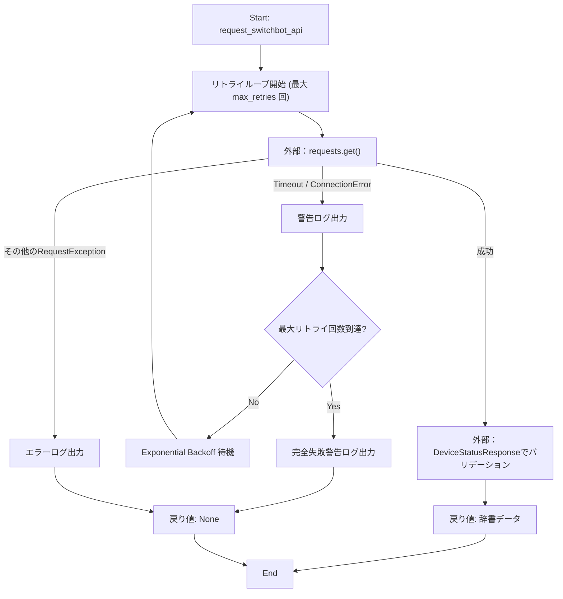
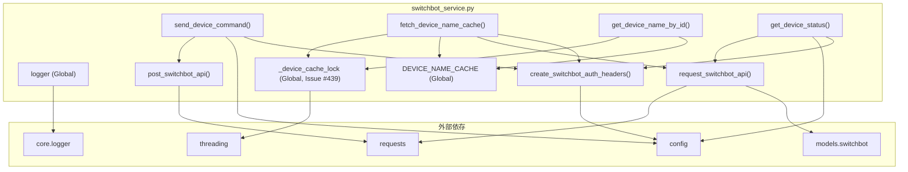

## 1. 解析メタ情報

| 項目 | 内容 |
| --- | --- |
| 対象ファイル | `switchbot_service.py` |
| 言語 | Python |
| 解析対象 | 提供されたコードのみ |
| 推測・補完 | 一切なし |

## 関連ドキュメント

- [switchbot.md](./switchbot.md) — `models.switchbot.DeviceStatusResponse`(バリデーション用モデル)を提供
- [config.md](./config.md) — 設定値(`SWITCHBOT_API_TOKEN`等)を提供
- [logger.md](./logger.md) — `core.logger.setup_logging`の実体
- [switchbot_power_monitor.md](./switchbot_power_monitor.md) — 呼び出し元(`get_device_status`を利用)
- [webhook_router.md](./webhook_router.md) — 呼び出し元(`get_device_name_by_id`を利用)
- [switchbot_webhook_fix.md](./switchbot_webhook_fix.md) — 呼び出し元(`create_switchbot_auth_headers`を利用)
- [tv_lock_monitor.md](./tv_lock_monitor.md) — 呼び出し元(`send_device_command`を利用)

## 2. ファイルの概要

* SwitchBot APIとのHTTP通信（GET/POSTリクエスト、Exponential Backoffによるリトライ処理、HMAC認証ヘッダーの生成）を担う。
* デバイスのステータス取得、デバイスへのコマンド送信処理を提供する。
* デバイスリストを取得し、デバイスIDとデバイス名のマッピングをメモリ上のキャッシュ（グローバル変数）に保持・取得する機能を提供する。

## 3. 外部依存関係

### インポート一覧

| 名称 | 種類 | 用途 | 根拠 |
| --- | --- | --- | --- |
| `threading`（Issue #439で追加） | 標準ライブラリ | `DEVICE_NAME_CACHE`/`_fetch_attempted`を複数のWebhookリクエストスレッドから保護する`_device_cache_lock`(`threading.Lock`)の生成 | 根拠: `import threading` (行番号: 2 / 抜粋: "import threading")、[`_device_cache_lock`定義] (行番号: 28 / 抜粋: "_device_cache_lock = threading.Lock()") |
| `time` | 標準ライブラリ | 現在時刻の取得、リトライ時の待機（sleep） | 根拠: `import time` (行番号: 3 / 抜粋: "import time") |
| `hashlib` | 標準ライブラリ | HMAC署名生成時のハッシュアルゴリズム（SHA256）指定 | 根拠: `import hashlib` (行番号: 4 / 抜粋: "import hashlib") |
| `hmac` | 標準ライブラリ | 認証ヘッダー用のHMAC署名生成 | 根拠: `import hmac` (行番号: 5 / 抜粋: "import hmac") |
| `base64` | 標準ライブラリ | 生成したHMAC署名のBase64エンコード | 根拠: `import base64` (行番号: 6 / 抜粋: "import base64") |
| `uuid` | 標準ライブラリ | 認証ヘッダー用のnonce（一意な値）生成 | 根拠: `import uuid` (行番号: 7 / 抜粋: "import uuid") |
| `typing` | 標準ライブラリ | 静的型チェックのための型ヒントの提供 | 根拠: `from typing import...` (行番号: 8 / 抜粋: "from typing import Dict, Any, Optional") |
| `requests` | 外部ライブラリ | 外部API（SwitchBot API）へのHTTPリクエスト送信 | 根拠: `import requests` (行番号: 10 / 抜粋: "import requests") |
| `config` | 内部モジュール | APIホストURL、トークン、シークレット等の設定値取得 | 根拠: `import config` (行番号: 11 / 抜粋: "import config") |
| `core.logger` | 内部モジュール | ロガー（`setup_logging`）の取得 | 根拠: `from core.logger import...` (行番号: 14 / 抜粋: "from core.logger import setup_logging") |
| `models.switchbot` | 内部モジュール | レスポンスデータ検証用のPydanticモデル取得 | 根拠: `from models.switchbot import...` (行番号: 15 / 抜粋: "from models.switchbot import DeviceStatusResponse") |

### ブラックボックスとなる外部要素

| 名称 | 理由 | 根拠 |
| --- | --- | --- |
| `config` | 設定値（トークン、シークレット、ホストURL）が環境変数から取得されているか等の実装詳細が不明。 | 根拠: `config.SWITCHBOT_API_TOKEN` (行番号: 80 / 抜粋: "token = config.SWITCHBOT_API_TOKEN") |
| `DeviceStatusResponse` | モデルのプロパティ定義や、`dict()`呼び出し時の挙動（シリアライズ仕様）が不明。 | 根拠: `DeviceStatusResponse` (行番号: 28 / 抜粋: "validated = DeviceStatusResponse(**raw_data)") |
| `setup_logging` | 生成されるロガーの設定（出力先、フォーマット、ログレベルなど）の詳細が不明。 | 根拠: `setup_logging` (行番号: 16 / 抜粋: "logger = setup_logging("service.switchbot")") |

## 4. 主要要素の定義（関数 / エンドポイント / コンポーネント）

### `request_switchbot_api`

* **役割**: SwitchBot APIに対してGETリクエストを送信する。タイムアウトや接続エラー時にはExponential Backoffを用いて最大指定回数リトライする。取得したデータをモデルでバリデーションして返す。
* 根拠: `request_switchbot_api` (行番号: 20〜48 / 抜粋: "def request_switchbot_api(url: str, ...")

* **引数/リクエスト**:
* `url`: `str` (リクエスト先URL)
* `headers`: `Dict[str, str]` (リクエストヘッダー)
* `max_retries`: `int` (最大リトライ回数、デフォルト4)
* 根拠: `request_switchbot_api` (行番号: 20 / 抜粋: "url: str, headers: Dict[str, str], max_retries: int = 4")

* **戻り値/レスポンス**: `Optional[Dict[str, Any]]` (バリデーション済みの辞書データ。全リトライ失敗時はNone)
* 根拠: `request_switchbot_api` (行番号: 20 / 抜粋: "-> Optional[Dict[str, Any]]:")

* **副作用**: ロガーへの出力（警告、エラー、デバッグ）
* 根拠: `logger.warning`, `logger.error`, `logger.debug` (行番号: 33, 37, 43 / 抜粋: "logger.warning(f"⚠️ SwitchBot API ...")

* **エラーハンドリング**:
* `requests.exceptions.Timeout`, `requests.exceptions.ConnectionError`: 警告ログを出力し、待機後にリトライ。
* `requests.exceptions.RequestException`: エラーログを出力し、リトライを中断。
* リトライ最大数到達時は警告ログを出力し `None` を返す（フェイルソフト）。
* 根拠: `except` (行番号: 31〜48 / 抜粋: "except (requests.exceptions.Timeout, ...")

### `post_switchbot_api`

* **役割**: SwitchBot APIに対してPOSTリクエストを送信する。モデルによるバリデーションは行わず生データを返す。
* 根拠: `post_switchbot_api` (行番号: 51〜56 / 抜粋: "def post_switchbot_api(url: str, ...")

* **引数/リクエスト**:
* `url`: `str` (リクエスト先URL)
* `headers`: `Dict[str, str]` (リクエストヘッダー)
* `json_data`: `Dict[str, Any]` (POSTするJSONペイロード)
* 根拠: `post_switchbot_api` (行番号: 51 / 抜粋: "url: str, headers: Dict[str, str], json_data: Dict[str, Any]")

* **戻り値/レスポンス**: `Dict[str, Any]` (APIレスポンスのJSONパース結果)
* 根拠: `post_switchbot_api` (行番号: 51 / 抜粋: "-> Dict[str, Any]:")

* **副作用**: 外部APIへのデータ送信（デバイスの操作など）
* 根拠: `requests.post` (行番号: 53 / 抜粋: "response = requests.post(url, ...")

* **エラーハンドリング**: HTTPエラーステータスが返却された場合、`response.raise_for_status()` により例外を送出。
* 根拠: `raise_for_status` (行番号: 54 / 抜粋: "response.raise_for_status()")

### `send_device_command`

* **役割**: 指定されたデバイスIDに対し、エンドポイントURLと認証ヘッダー、ペイロードを構築し、コマンド送信リクエストを行う。
* 根拠: `send_device_command` (行番号: 58〜76 / 抜粋: "def send_device_command(device_id: str, ...")

* **引数/リクエスト**:
* `device_id`: `str` (対象デバイスのID)
* `command`: `str` (実行するコマンド名)
* `parameter`: `str` (コマンドのパラメータ、デフォルト"default")
* `command_type`: `str` (コマンドの種類、デフォルト"command")
* 根拠: `send_device_command` (行番号: 58 / 抜粋: "device_id: str, command: str, parameter: str = "default", command_type: str = "command"")

* **戻り値/レスポンス**: `Optional[Dict[str, Any]]` (送信結果のレスポンス、失敗時はNone)
* 根拠: `send_device_command` (行番号: 58 / 抜粋: "-> Optional[Dict[str, Any]]:")

* **副作用**: APIへのPOSTリクエスト呼び出し、失敗時のエラーログ出力
* 根拠: `post_switchbot_api` (行番号: 72 / 抜粋: "response_data = post_switchbot_api(url, headers, payload)")

* **エラーハンドリング**: 実行中の任意の例外（`Exception`）をキャッチし、エラーログを出力して `None` を返す。
* 根拠: `except Exception as e` (行番号: 74〜76 / 抜粋: "except Exception as e:")

### `create_switchbot_auth_headers`

* **役割**: トークン、タイムスタンプ、nonceを用いてHMAC-SHA256署名を生成し、APIリクエストに必要な認証ヘッダー群を構築する。
* 根拠: `create_switchbot_auth_headers` (行番号: 78〜105 / 抜粋: "def create_switchbot_auth_headers() -> Dict[str, str]:")

* **引数/リクエスト**: なし
* 根拠: `create_switchbot_auth_headers` (行番号: 78 / 抜粋: "def create_switchbot_auth_headers()")

* **戻り値/レスポンス**: `Dict[str, str]` (認証情報の入ったヘッダー辞書、設定不備時は空辞書)
* 根拠: `create_switchbot_auth_headers` (行番号: 78 / 抜粋: "-> Dict[str, str]:")

* **副作用**: 警告ログ出力（トークンまたはシークレット欠如時）
* 根拠: `logger.warning` (行番号: 85 / 抜粋: "logger.warning("SwitchBot Token/Secret is missing in config.")")

* **エラーハンドリング**: トークンまたはシークレットが設定されていない場合、警告を出力して空の辞書を返す。
* 根拠: `if not token or not secret:` (行番号: 84〜86 / 抜粋: "if not token or not secret:")

### `fetch_device_name_cache`

* **役割**: SwitchBot APIのデバイス一覧エンドポイントからデバイス情報を取得し、グローバル変数 `DEVICE_NAME_CACHE` にデバイスIDと名前のペアを格納する。**（Issue #439で修正）** 以前はAPIから取得したデバイス名を`DEVICE_NAME_CACHE`へループの都度ロック無しで直接書き込んでいたが、現在はまずローカル辞書`new_names`（ネットワークI/O中はロックを取得しない）へ全件を集め、最後に`_device_cache_lock`保持下で`DEVICE_NAME_CACHE.update(new_names)`によりまとめてマージする。
* 根拠: `fetch_device_name_cache` (行番号: 117〜156 / 抜粋: "def fetch_device_name_cache() -> bool:")、[ローカル辞書への集約とロック下でのマージ] (行番号: 137〜148 / 抜粋: "new_names: Dict[str, str] = {}\n            # 通常デバイス\n            for d in body.get('deviceList', []):\n                new_names[d['deviceId']] = d['deviceName']", "with _device_cache_lock:\n                DEVICE_NAME_CACHE.update(new_names)\n                cache_size = len(DEVICE_NAME_CACHE)")

* **引数/リクエスト**: なし
* 根拠: `fetch_device_name_cache` (行番号: 117 / 抜粋: "def fetch_device_name_cache()")

* **戻り値/レスポンス**: `bool` (処理の成功・失敗)
* 根拠: `fetch_device_name_cache` (行番号: 117 / 抜粋: "-> bool:")

* **副作用**: `_device_cache_lock`保持下でのグローバル変数 `DEVICE_NAME_CACHE` の追加更新（マージ）。インフォメーションおよびエラーログ出力。APIへのGETリクエスト（ロック外）。
* 根拠: `global DEVICE_NAME_CACHE` (行番号: 119 / 抜粋: "global DEVICE_NAME_CACHE")、[ロック保持下でのマージ] (行番号: 145〜147 / 抜粋: "with _device_cache_lock:\n                DEVICE_NAME_CACHE.update(new_names)")

* **エラーハンドリング**:
* 認証ヘッダー取得失敗時は `False` を返す。
* APIレスポンスが `None` の場合（Fail-Soft時）は `False` を返す。
* `statusCode` が100以外の場合はエラーログを出力し `False` を返す。
* 任意の例外発生時はエラーログを出力し `False` を返す。
* 根拠: `except Exception as e` (行番号: 154 / 抜粋: "except Exception as e:")

### `get_device_name_by_id`

* **役割**: `DEVICE_NAME_CACHE` から指定されたデバイスIDに対応するデバイス名を取得する。**（Issue #439で修正）** 「キャッシュが空かつ未試行かをチェックしてから`_fetch_attempted`を立てる」処理と、最終的なキャッシュ読み取りは、いずれも`_device_cache_lock`保持下で行うよう修正された。以前はロード無しでこのチェックを行っており、Webhookリクエストが集中する起動直後に複数スレッドが同時に「キャッシュ空・未試行」と判定してしまい、`fetch_device_name_cache`（SwitchBotのデバイス一覧API呼び出し）が並行して複数回走りうる状態だった。ネットワークI/Oを伴う`fetch_device_name_cache()`自体の呼び出しは、`_device_cache_lock`を一度解放してから（ロックの外側で）行う。
* 根拠: `get_device_name_by_id` (行番号: 158〜169 / 抜粋: "def get_device_name_by_id(device_id: str) -> Optional[str]:")、[ロック下でのcheck-and-set] (行番号: 161〜164 / 抜粋: "with _device_cache_lock:\n        should_fetch = not DEVICE_NAME_CACHE and not _fetch_attempted\n        if should_fetch:\n            _fetch_attempted = True")、[ロック外での遅延ロード呼び出し] (行番号: 165〜167 / 抜粋: "if should_fetch:\n        # APIリクエスト(ネットワークI/O)は_device_cache_lock保持中に行わない\n        fetch_device_name_cache()")、[ロック下での最終読み取り] (行番号: 168〜169 / 抜粋: "with _device_cache_lock:\n        return DEVICE_NAME_CACHE.get(device_id, None)")

* **引数/リクエスト**: `device_id`: `str` (デバイスID)
* 根拠: `get_device_name_by_id` (行番号: 158 / 抜粋: "device_id: str")

* **戻り値/レスポンス**: `Optional[str]` (見つかった場合はデバイス名、存在しない場合はNone)
* 根拠: `get_device_name_by_id` (行番号: 158 / 抜粋: "-> Optional[str]:")

* **副作用**: `_device_cache_lock`保持下での`DEVICE_NAME_CACHE`/`_fetch_attempted`の読み取り・書き込み、`DEVICE_NAME_CACHE` が空かつ未試行(`_fetch_attempted`が`False`)の場合、`fetch_device_name_cache()` を1回だけ呼び出して遅延ロードを試みる（**#411 S-L2で追加**: 以前は `fetch_device_name_cache` の呼出元がどこにも無く、`DEVICE_NAME_CACHE` は常に空のままだったため、`devices.json` に登録の無いセンサーからのWebhookは常に `Unknown_<mac>` 表示になっていた）。プロセス起動後の初回呼出し(＝最初のWebhook受信)時にのみ発火し、成否に関わらず以後は再試行しない。
* 根拠: `get_device_name_by_id` (行番号: 161〜167 / 抜粋: "with _device_cache_lock:\n        should_fetch = not DEVICE_NAME_CACHE and not _fetch_attempted")

* **エラーハンドリング**: なし（辞書の `get` メソッドによりKeyErrorを回避）。遅延ロード自体が失敗しても`fetch_device_name_cache`内で例外は握り潰され`False`が返るのみで、本関数は`None`を返す。
* 根拠: `DEVICE_NAME_CACHE.get` (行番号: 169 / 抜粋: "return DEVICE_NAME_CACHE.get(device_id, None)")

### `get_device_status`

* **役割**: 指定されたデバイスのステータス取得用URLを構築し、APIリクエストを送信して結果を取得する。
* 根拠: `get_device_status` (行番号: 171〜184 / 抜粋: "def get_device_status(device_id: str) -> Optional[Dict[str, Any]]:")

* **引数/リクエスト**: `device_id`: `str` (対象デバイスのID)
* 根拠: `get_device_status` (行番号: 171 / 抜粋: "device_id: str")

* **戻り値/レスポンス**: `Optional[Dict[str, Any]]` (取得したステータス辞書、失敗時はNone)
* 根拠: `get_device_status` (行番号: 171 / 抜粋: "-> Optional[Dict[str, Any]]:")

* **副作用**: APIへのGETリクエスト呼び出し、失敗時のエラーログ出力
* 根拠: `request_switchbot_api` (行番号: 180 / 抜粋: "response_data = request_switchbot_api(url, headers)")

* **エラーハンドリング**: 実行中の任意の例外（`Exception`）をキャッチし、エラーログを出力して `None` を返す。
* 根拠: `except Exception as e` (行番号: 182〜184 / 抜粋: "except Exception as e:")

## 5. 処理フロー図

主要な汎用リクエスト関数である `request_switchbot_api` のリトライ制御ロジックのフローを示します。

```mermaid
flowchart TD
    Start["Start: request_switchbot_api"] --> LoopInit["リトライループ開始 (最大 max_retries 回)"]
    LoopInit --> TryRequest["外部：requests.get()"]
    TryRequest -- 成功 --> Validate["外部：DeviceStatusResponseでバリデーション"]
    Validate --> ReturnDict["戻り値: 辞書データ"] --> End["End"]
    
    TryRequest -- Timeout / ConnectionError --> LogWarn["警告ログ出力"]
    LogWarn --> CheckRetry{"最大リトライ回数到達?"}
    CheckRetry -- No --> Wait["Exponential Backoff 待機"] --> LoopInit
    CheckRetry -- Yes --> LogFailSoft["完全失敗警告ログ出力"] --> ReturnNone["戻り値: None"] --> End
    
    TryRequest -- その他のRequestException --> LogErr["エラーログ出力"] --> ReturnNone

```

## 6. 依存関係図

```mermaid
graph TD
    subgraph "switchbot_service.py"
        logger["logger (Global)"]
        DEVICE_NAME_CACHE["DEVICE_NAME_CACHE (Global)"]
        device_cache_lock["_device_cache_lock (Global, Issue #439)"]
        request_switchbot_api["request_switchbot_api()"]
        post_switchbot_api["post_switchbot_api()"]
        send_device_command["send_device_command()"]
        create_switchbot_auth_headers["create_switchbot_auth_headers()"]
        fetch_device_name_cache["fetch_device_name_cache()"]
        get_device_name_by_id["get_device_name_by_id()"]
        get_device_status["get_device_status()"]
    end

    subgraph "外部依存"
        config["config"]
        core_logger["core.logger"]
        models_switchbot["models.switchbot"]
        requests["requests"]
        threading_mod["threading"]
    end

    logger --> core_logger
    create_switchbot_auth_headers --> config
    request_switchbot_api --> models_switchbot
    request_switchbot_api --> requests
    post_switchbot_api --> requests

    send_device_command --> create_switchbot_auth_headers
    send_device_command --> config
    send_device_command --> post_switchbot_api

    fetch_device_name_cache --> create_switchbot_auth_headers
    fetch_device_name_cache --> request_switchbot_api
    fetch_device_name_cache --> DEVICE_NAME_CACHE
    fetch_device_name_cache --> device_cache_lock

    get_device_name_by_id --> DEVICE_NAME_CACHE
    get_device_name_by_id --> device_cache_lock
    device_cache_lock --> threading_mod

    get_device_status --> create_switchbot_auth_headers
    get_device_status --> config
    get_device_status --> request_switchbot_api

```

## 7. 次のステップ（リバースエンジニアリングの提案）

| 優先度 | ファイル名(推測可) | 理由 | 根拠 |
| --- | --- | --- | --- |
| 高 | `models/switchbot.py` | `request_switchbot_api` 関数において、すべてのGET通信のレスポンスが `DeviceStatusResponse` でバリデーションされている。このモデルがデバイスリスト取得時（`/v1.1/devices`）のJSON構造も正しく処理できる設計になっているか確認する必要があるため。 | 根拠: `DeviceStatusResponse` (行番号: 14 / 抜粋: "from models.switchbot import DeviceStatusResponse") |
| 中 | `config.py` | API通信のホストURL、トークン、シークレットの設定がどのように注入されているか（環境変数、DB、ファイル等）を把握し、デプロイやテスト要件を明確にするため。 | 根拠: `config` (行番号: 10 / 抜粋: "import config") |

## 8. 保守上の注意点

* **[修正済み・Issue #439] `DEVICE_NAME_CACHE`/`_fetch_attempted`のスレッドセーフティ**: 以前は`fetch_device_name_cache`がグローバル変数 `DEVICE_NAME_CACHE` をロック無しで直接更新しており、`get_device_name_by_id`の「キャッシュが空か確認してから`_fetch_attempted`を立てる」チェックもロック無しで行っていたため、複数のWebhookリクエストスレッドが起動直後に集中すると、check-then-actの隙間を突いて`fetch_device_name_cache`（SwitchBotのデバイス一覧API呼び出し）が複数回同時に走りうる競合状態があった。現在は`_device_cache_lock`（グローバル`threading.Lock`）を導入し、(1) `get_device_name_by_id`の「空かつ未試行か」の判定と`_fetch_attempted`のセット、(2) `fetch_device_name_cache`が新規取得したデバイス名を`DEVICE_NAME_CACHE`へマージする処理、(3) `get_device_name_by_id`の最終的なキャッシュ読み取り、の3箇所をこのロックで保護している。ただしSwitchBot APIへのネットワークリクエスト自体（`fetch_device_name_cache`の`request_switchbot_api`呼び出し）は`_device_cache_lock`を保持したままでは行わない設計になっている。
* **バリデーションモデルの汎用性適用**: `request_switchbot_api` 内で常に `DeviceStatusResponse` モデルによるバリデーションを行っている。しかし、`fetch_device_name_cache` では、同関数を利用して `/v1.1/devices` エンドポイント（ステータスではなくリスト）を要求している。もし `DeviceStatusResponse` がデバイスリスト特有のキー（`deviceList`, `infraredRemoteList`）を許容しない厳密なスキーマだった場合、バリデーションエラーが発生する恐れがある。
* **広範な例外キャッチ**: `send_device_command`, `fetch_device_name_cache`, `get_device_status` において `except Exception as e:` が使われている。これにより予期しないシンタックスエラーや型エラー（TypeError）なども捕捉してしまい、バグが握りつぶされて `None` または `False` として処理される可能性がある。

## 9. 不明事項一覧

| 項目 | 理由 | 必要なファイル |
| --- | --- | --- |
| `DeviceStatusResponse` の仕様 | どのようなプロパティを要求し、バリデーションエラー時にはどのような例外を投げるか（PydanticのValidationError等）が本ファイルからは読み取れない。 | `models/switchbot.py` |
| 認証情報の取得ロジック | `config.SWITCHBOT_API_TOKEN` 等が静的定数なのか、動的な環境変数読み込みなのかが不明。 | `config.py` |
| ロガーの仕様 | 出力フォーマットやログレベルが不明。 | `core/logger.py` |

## 相互参照による補足情報

| 元の不明事項 | 判明した内容 | 参照元ドキュメント |
| --- | --- | --- |
| `DeviceStatusResponse` の仕様 | `models/switchbot.py`を直接確認した。`DeviceStatusResponse`(24〜28行目)は`statusCode: int`、`message: str`、`body: Dict[str, Any]`(デバイスにより中身が変わるため`Any`)の3フィールドを持つPydanticモデルであることが判明した。バリデーションエラー時に投げられる例外の型については本モデル自体には明記がなく、Pydanticの標準動作(`pydantic.ValidationError`)に依拠する設計と考えられるが、これを明示するコードは`models/switchbot.py`内には存在しない。 | 直接ソース確認: `MY_HOME_SYSTEM/models/switchbot.py:24-28` |
| 認証情報の取得ロジック | `config.py`を直接確認した。139行目の`load_dotenv()`実行後、177〜178行目で`SWITCHBOT_API_TOKEN: Optional[str] = os.getenv("SWITCHBOT_API_TOKEN")`、`SWITCHBOT_API_SECRET: Optional[str] = os.getenv("SWITCHBOT_API_SECRET")`と定義されており、静的定数ではなく`.env`ファイル由来の環境変数を動的に読み込む設計であることが判明した。 | 直接ソース確認: `MY_HOME_SYSTEM/config.py:139, 177-178` |
| ロガーの仕様 | `core/logger.py`を直接確認した。`setup_logging(name, webhook_url=None)`(46〜86行目)は、(1) `logging.Formatter('%(asctime)s [%(levelname)s] %(name)s: %(message)s', datefmt='%Y-%m-%d %H:%M:%S')`形式のコンソール出力用`StreamHandler`(57〜60行目)、(2) `config.BASE_DIR/logs/home_system.log`に対し`TimedRotatingFileHandler(when='midnight', interval=1, backupCount=7, encoding='utf-8')`で日次ローテーションするファイル出力(62〜74行目)、(3) `ERROR`レベル以上を`config.DISCORD_WEBHOOK_ERROR`(または引数指定URL)へPOST通知する`DiscordErrorHandler`(76〜84行目、レベル`logging.ERROR`)の3種のハンドラを登録することが判明した。ロガー自体の基本レベルは`logging.INFO`(54行目)。 | 直接ソース確認: `MY_HOME_SYSTEM/core/logger.py:46-86` |

## 10. 自己検証結果

* [x] 推測・外部ファイルの仕様を一切含んでいない
* [x] 全関数・全クラス・全コンポーネントを列挙した
* [x] 全てのインポート要素を列挙した
* [x] すべての仕様説明に「根拠（行番号・抜粋）」を明記した
* [x] 根拠漏れが0件である
* [x] Mermaid構文にエラーの原因となる記号（エスケープ漏れ）がない
* [x] 不明事項を漏れなく列挙した

完了