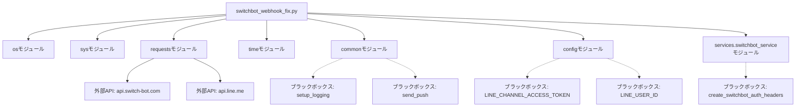

## 1. 解析メタ情報

| 項目 | 内容 |
| --- | --- |
| 対象ファイル | switchbot_webhook_fix.py |
| 言語 | Python |
| 解析対象 | 提供されたコードのみ |
| 推測・補完 | 一切なし |

## 関連ドキュメント

- [common.md](./common.md) — `setup_logging`・`send_push`を再エクスポートするFacadeモジュール
- [logger.md](./logger.md) — `common.setup_logging`の実体(`core.logger.setup_logging`)
- [notification_service.md](./notification_service.md) — `common.send_push`の実体(`services.notification_service.send_push`)
- [config.md](./config.md) — `LINE_CHANNEL_ACCESS_TOKEN`/`LINE_USER_ID`等の設定値を提供
- [switchbot_service.md](./switchbot_service.md) — `create_switchbot_auth_headers`(SwitchBot API認証ヘッダー生成)の実装元
- [webhook_router.md](./webhook_router.md) — 同じSwitchBot/LINE Webhookエコシステムに属する、Webhook受信側のルーター

## 2. ファイルの概要

* 環境変数に設定されたベースURLを用いて、SwitchBotおよびLINE BotのWebhookエンドポイントを自動的に更新・修復する。更新が行われた場合はプッシュ通知を送信して報告する。加えて、SwitchBot側で旧設定を削除した後に新規登録が失敗した(Webhookが未設定のまま残る)危険な状態を検知した場合は、更新の成否に関わらず必ずエラー通知を送信する(Issue #166)。
* 根拠: [関数 `fix_all_webhooks` の処理内容、およびログ文字列] (行番号: 120〜148 / 抜粋: "🚀 Webhook自動修復ツール起動")

## 3. 外部依存関係

### インポート一覧

| 名称 | 種類 | 用途 | 根拠 |
| --- | --- | --- | --- |
| `sys` | 標準ライブラリ | システムパスの追加、および異常時のスクリプト終了(`sys.exit`) | `import sys` (行番号: 2, 13-15, 23, 109) |
| `os` | 標準ライブラリ | ファイルパスの取得、および環境変数の取得 | `import os` (行番号: 3, 9-10, 106) |
| `traceback` | 標準ライブラリ | 本ファイル内では未使用 | `import traceback` (行番号: 4) |
| `requests` | サードパーティ | 外部API（SwitchBot, LINE）へのHTTPリクエスト送信 | `import requests` (行番号: 5, 36, 46, 51, 86, 91) |
| `time` | 標準ライブラリ | APIコール間のスリープ処理（待機） | `import time` (行番号: 6, 47) |
| `common` | カスタムモジュール | ロガー設定の初期化、および完了時のプッシュ通知送信 | `import common` (行番号: 18, 26, 117) |
| `config` | カスタムモジュール | LINEチャネルアクセストークンやユーザーIDの設定値取得 | `import config` (行番号: 19, 73, 79, 86, 117) |
| `services.switchbot_service` (as `sb_tool`) | カスタムモジュール | SwitchBot API通信用の認証ヘッダー生成 | `from services import switchbot_service as sb_tool` (行番号: 20, 33, 50) |

### ブラックボックスとなる外部要素

| 名称 | 理由 | 根拠 |
| --- | --- | --- |
| `common.setup_logging` | ロガーの初期化処理、ログの出力先やフォーマットの実装が不明。 | `logger = common.setup_logging("webhook_fix")` (行番号: 26) |
| `common.send_push` | 引数に渡されるDiscord指定などの処理内容や、実際の通知送信ロジックが不明。 | `common.send_push(config.LINE_USER_ID, ...)` (行番号: 117) |
| `config.LINE_CHANNEL_ACCESS_TOKEN` | 環境変数等からの読み込み処理など、具体的な定義内容や値が不明。 | `if not config.LINE_CHANNEL_ACCESS_TOKEN:` (行番号: 73) |
| `config.LINE_USER_ID` | 通知先となるユーザーIDの定義内容や値が不明。 | `common.send_push(config.LINE_USER_ID, ...)` (行番号: 117) |
| `sb_tool.create_switchbot_auth_headers` | APIリクエストに必要なトークンや署名生成などの具体的な認証ロジックが不明。 | `headers = sb_tool.create_switchbot_auth_headers()` (行番号: 33) |

## 4. 主要要素の定義（関数 / エンドポイント / コンポーネント）

### `update_switchbot_webhook`

* **役割**: SwitchBot APIを利用してWebhook URLの現在設定を取得し、必要に応じて古い設定の削除と新しいURLの登録を行う。
* 根拠: [関数定義およびDocstring] (行番号: 28〜37 / 抜粋: "SwitchBotのWebhook URLを更新")

* **引数/リクエスト**: `base_url` (型: 不明 / 環境変数から取得されたベースURLの文字列)
* 根拠: [関数定義] (行番号: 28 / 抜粋: "def update_switchbot_webhook(base_url):")

* **戻り値/レスポンス**: `Optional[bool]` — `True`: 新しいURLの登録に成功した(変更あり)。`False`: 既に設定済み、またはURL照会自体に失敗し何も変更していない。`None`: 旧URLを削除した後、新URLの登録に失敗した(Issue #166。SwitchBotのWebhookが未設定のまま残っている危険な状態を、「既に設定済みで変更不要」の`False`と区別するために導入された)。
* 根拠: [return文] (行番号: 48, 52, 74, 84 / 抜粋: "return False", "return True", "return None")
* 根拠: [Docstringの戻り値説明] (行番号: 30〜36 / 抜粋: "True  - 新しいURLの登録に成功した(変更あり)")

* **副作用**:
* 外部API呼び出し: `https://api.switch-bot.com/v1.1/webhook/queryWebhook` へのPOSTリクエスト
* 外部API呼び出し: `https://api.switch-bot.com/v1.1/webhook/deleteWebhook` へのPOSTリクエスト（旧URLごとに1回、失敗しても他の旧URLの削除・後続の新規登録は続行する）
* 外部API呼び出し: `https://api.switch-bot.com/v1.1/webhook/setupWebhook` へのPOSTリクエスト
* 根拠: [requestsメソッド] (行番号: 44, 58, 66 / 抜粋: "requests.post(...)")

* **エラーハンドリング**: URL照会(`queryWebhook`)の例外は`False`を返して処理を打ち切る(何も変更していないため)。旧URL削除(`deleteWebhook`)の例外は個々にログ出力するのみで処理を継続する(次の旧URLの削除・新規登録を試みる)。新規登録(`setupWebhook`)の例外、または`statusCode != 100`はエラーログを出力し、関数末尾の`return None`に到達する(Issue #166の修正前は暗黙的に`False`が返り、「変更なし」と区別できなかった)。
* 根拠: [try-exceptブロック] (行番号: 43, 46〜48, 57, 59〜60, 65, 78〜79 / 抜粋: "except Exception as e:")

### `update_line_webhook`

* **役割**: LINE Messaging APIを利用してWebhookエンドポイントの現在設定を取得し、変更が必要な場合のみ新しいURLに更新する。
* 根拠: [関数定義およびDocstring] (行番号: 68〜69 / 抜粋: "LINE BotのWebhook URLを更新")

* **引数/リクエスト**: `base_url` (型: 不明 / 環境変数から取得されたベースURLの文字列)
* 根拠: [関数定義] (行番号: 68 / 抜粋: "def update_line_webhook(base_url):")

* **戻り値/レスポンス**: `bool` (更新が成功した場合は `True`、スキップ・設定済み・失敗時は `False`)
* 根拠: [return文] (行番号: 75, 89, 94, 97, 100 / 抜粋: "return True", "return False")

* **副作用**:
* 外部API呼び出し: `https://api.line.me/v2/bot/channel/webhook/endpoint` へのGETリクエスト
* 外部API呼び出し: `https://api.line.me/v2/bot/channel/webhook/endpoint` へのPUTリクエスト
* 根拠: [requestsメソッド] (行番号: 86, 91 / 抜粋: "requests.get(...)", "requests.put(...)")

* **エラーハンドリング**: 例外(`Exception`)発生時にエラーログを出力し、`False`を返す。
* 根拠: [try-exceptブロック] (行番号: 84, 98〜100 / 抜粋: "except Exception as e:")

### `fix_all_webhooks`

* **役割**: 実行環境の環境変数からベースURLを取得し、SwitchBotとLINEのWebhook更新処理を実行する。`update_switchbot_webhook`が`None`(旧設定削除後に新規登録が失敗した危険な状態、Issue #166)を返した場合は、更新の成否に関わらず必ずエラー通知(`channel="error"`)を送信する。そのうえで、SwitchBot側の更新有無(`bool(sb_result)`)またはLINE側の更新有無のいずれかが真の場合のみ、従来通り成功通知(`channel="report"`)を送信する。
* 根拠: [関数定義およびコメント] (行番号: 120〜148 / 抜粋: "実際に更新が走った時のみ通知を送信")
* 根拠: `if sb_result is None:` (行番号: 136〜142 / 抜粋: "update_switchbot_webhook が None(=旧設定を削除した後に新規登録が失敗し、")

* **引数/リクエスト**: なし
* 根拠: [関数定義] (行番号: 120 / 抜粋: "def fix_all_webhooks():")

* **戻り値/レスポンス**: なし
* 根拠: [return文の不在] (行番号: 120〜148 / 抜粋: "return文なし")

* **副作用**:
* 環境変数取得: `os.environ.get("WEBHOOK_BASE_URL")`
* 外部モジュール呼び出し: `common.send_push` によるプッシュ通知送信(SwitchBot側が危険な状態(`None`)の場合のエラー通知、および更新成功時の完了通知の最大2回)
* システム終了: 設定がない場合の `sys.exit(1)`
* 根拠: [処理内容] (行番号: 124, 127, 142, 148 / 抜粋: "sys.exit(1)", "common.send_push(...)")

* **エラーハンドリング**: `WEBHOOK_BASE_URL` が取得できない場合、エラーログを出力して `sys.exit(1)` でプロセスを終了させる。`update_switchbot_webhook`が例外を送出することはない(関数内で`Exception`を捕捉し`False`/`None`を返す設計のため)。
* 根拠: [ifブロック] (行番号: 125〜127 / 抜粋: "if not base_url:")

## 5. 処理フロー図

```mermaid
flowchart TD
    Start([Start]) --> CheckEnv{WEBHOOK_BASE_URL\n取得成功?}
    
    CheckEnv -- No --> LogError[エラーログ出力]
    LogError --> Exit[外部: sys.exit]
    Exit --> End([End])
    
    CheckEnv -- Yes --> CallSB[update_switchbot_webhook 呼び出し]
    CallSB --> QuerySB[外部: API queryWebhook]
    QuerySB --> SBCond{target_url\n設定済み?}
    
    SBCond -- Yes --> CallLINE[update_line_webhook 呼び出し]
    
    SBCond -- No --> DeleteSB[外部: API deleteWebhook]
    DeleteSB --> SetupSB[外部: API setupWebhook]
    SetupSB --> SetupCond{statusCode == 100?}
    SetupCond -- Yes --> CallLINE
    SetupCond -- No --> CallLINE

    CallLINE --> CheckToken{LINE Token\n設定あり?}
    CheckToken -- No --> CheckDanger{"sb_result is None?\n(Issue #166: 旧URL削除後に\n新規登録が失敗した危険な状態)"}
    
    CheckToken -- Yes --> QueryLINE[外部: API GET endpoint]
    QueryLINE --> LINECond{target_url\n設定済み?}
    
    LINECond -- Yes --> CheckDanger
    LINECond -- No --> PutLINE[外部: API PUT endpoint]
    PutLINE --> CheckDanger

    CheckDanger -- Yes --> SendErrorAlert["外部: common.send_push\n(channel=error)"]
    CheckDanger -- No --> CheckUpdate
    SendErrorAlert --> CheckUpdate{sb_updated(=bool(sb_result))\nOR line_updated ?}

    CheckUpdate -- Yes --> SendPush["外部: common.send_push\n(channel=report)"]
    SendPush --> End
    
    CheckUpdate -- No --> End

```

## 6. 依存関係図

```mermaid
graph TD
    File[switchbot_webhook_fix.py] --> OS[osモジュール]
    File --> SYS[sysモジュール]
    File --> REQ[requestsモジュール]
    File --> TIME[timeモジュール]
    
    File --> COMMON[commonモジュール]
    File --> CONFIG[configモジュール]
    File --> SBTOOL[services.switchbot_serviceモジュール]
    
    COMMON -.-> BlackBox1[ブラックボックス: setup_logging]
    COMMON -.-> BlackBox2[ブラックボックス: send_push]
    
    CONFIG -.-> BlackBox3[ブラックボックス: LINE_CHANNEL_ACCESS_TOKEN]
    CONFIG -.-> BlackBox4[ブラックボックス: LINE_USER_ID]
    
    SBTOOL -.-> BlackBox5[ブラックボックス: create_switchbot_auth_headers]
    
    REQ --> API_SB[外部API: api.switch-bot.com]
    REQ --> API_LINE[外部API: api.line.me]

```

## 7. 次のステップ（リバースエンジニアリングの提案）

| 優先度 | ファイル名(推測可) | 理由 | 根拠 |
| --- | --- | --- | --- |
| 高 | `common.py` | ロギングの設定内容や、更新完了時の通知（Discordへの送信仕様など）の具体的な挙動を把握するため。 | `import common` (行番号: 18 / 抜粋: "logger = common.setup_logging...") |
| 高 | `services/switchbot_service.py` | SwitchBot API通信に必須となる認証ヘッダーの生成仕様（暗号化やトークン仕様）を確認するため。 | `from services import switchbot_service as sb_tool` (行番号: 20 / 抜粋: "sb_tool.create_switchbot_auth_headers()") |
| 中 | `config.py` | LINE関連のトークンやユーザーIDがどのように管理・取得されているか（環境変数かファイルか）を特定するため。 | `import config` (行番号: 19 / 抜粋: "config.LINE_CHANNEL_ACCESS_TOKEN") |

## 8. 保守上の注意点

* `sys.path.insert` を用いて親ディレクトリなどを強制的にシステムパスに追加(Path Injection)しており、ディレクトリ構造が変更された際にインポートエラーが発生する可能性が高い。
* `update_switchbot_webhook` 関数内にて、古いWebhookを削除するループ処理に `time.sleep(1)` が含まれており、登録数が多い場合は関数全体の実行時間が著しく長くなる。
* すべての `requests` 呼び出し（SwitchBot/LINE双方）に `timeout=10` が明示的に設定されており、外部APIの応答遅延によるプロセスハングは一定範囲で防止されている。
* `traceback` モジュールがインポートされているが、スクリプト内で使用されていない未使用コードが存在する。
* `update_switchbot_webhook`の戻り値は`True`/`False`/`None`の3値であり、`fix_all_webhooks`側は必ず`is None`で危険な状態を判定し、成功通知の判定には`bool(sb_result)`で真偽値化してから使う必要がある(Issue #166)。単純な`if sb_result:`ではなく`is None`チェックを省略・誤読すると、旧設定削除後の新規登録失敗が再び無通知のまま埋もれる。

## 9. 不明事項一覧

| 項目 | 理由 | 必要なファイル |
| --- | --- | --- |
| `common.setup_logging` の詳細仕様 | ログフォーマットや出力先（ファイル、コンソール等）が不明のため。 | `common.py` |
| `common.send_push` の詳細仕様 | 引数の `target="discord"` や `channel="report"` がどのように処理されるか不明のため。 | `common.py` |
| `config` 内の変数定義方法 | `LINE_CHANNEL_ACCESS_TOKEN` 等が環境変数から取得されているのか、ファイルに直書きされているのか不明のため。 | `config.py` |
| API認証ヘッダーの生成ロジック | SwitchBot API仕様に準拠したハッシュ生成などがどのように実装されているか不明のため。 | `services/switchbot_service.py` |
| 外部APIの例外レスポンス構造 | API側で想定外のエラーが発生した場合のステータスコードやJSON構造の詳細が不明のため。（リポジトリ内を「API仕様」「openapi」等で検索したが該当ファイルは存在せず、解消不可。SwitchBot/LINE等の公式APIドキュメントを要参照） | 各外部API仕様書 |

## 相互参照による補足情報

| 元の不明事項 | 判明した内容 | 参照元ドキュメント |
| --- | --- | --- |
| `common.setup_logging` の詳細仕様 | `logger.md`の解析によれば、`setup_logging`はコンソール出力・日次ローテーションのファイル出力(`TimedRotatingFileHandler`、ログファイル名`home_system.log`固定)に加え、ERRORレベル以上のログをDiscord Webhookへ通知する`DiscordErrorHandler`を登録する設計であることが判明した。 | logger.md |
| `common.send_push` の詳細仕様 | `notification_service.md`の解析によれば、`send_push`は`target`引数(`discord`/`line`/`both`)に応じてDiscord Webhookおよび/またはLINE Messaging APIへ送信し、LINE送信失敗時はDiscordの`error`チャンネルへフォールバック通知する関数(戻り値`bool`)と推測される。 | notification_service.md |
| `config` 内の変数定義方法 | `config.md`の解析によれば、`config.py`は`load_dotenv()`により`.env`ファイルから環境変数を読み込む設計であることが判明した。ただし`LINE_CHANNEL_ACCESS_TOKEN`個別の値は`config.md`側でも確認できていない。 | config.md |
| API認証ヘッダーの生成ロジック | `switchbot_service.md`の解析によれば、`create_switchbot_auth_headers`はトークン・タイムスタンプ・nonceを用いてHMAC-SHA256署名を生成し認証ヘッダー辞書を構築する関数であり、トークンまたはシークレット未設定時は警告ログを出力して空辞書を返すことが判明した。 | switchbot_service.md |

## 10. 自己検証結果

* [x] 推測・外部ファイルの仕様を一切含んでいない
* [x] 全関数・全クラス・全コンポーネントを列挙した
* [x] 全てのインポート要素を列挙した
* [x] すべての仕様説明に「根拠（行番号・抜粋）」を明記した
* [x] 根拠漏れが0件である
* [x] Mermaid構文にエラーの原因となる記号（エスケープ漏れ）がない
* [x] 不明事項を漏れなく列挙した
（完了）