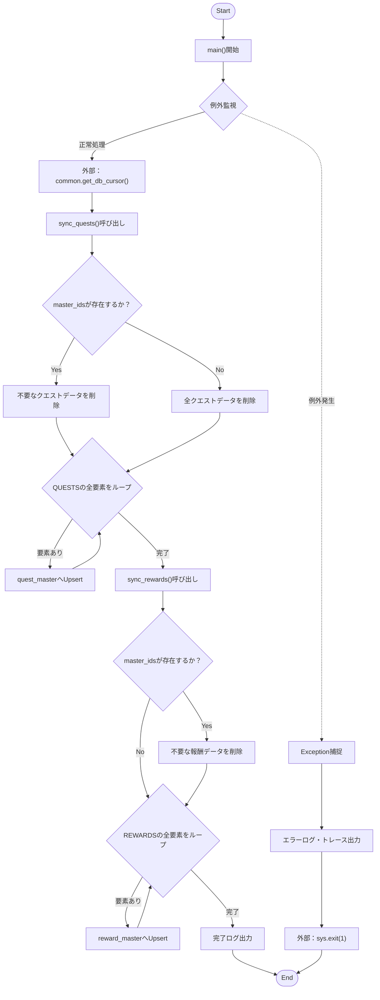
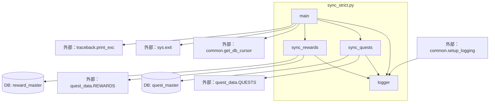

## 1. 解析メタ情報

| 項目 | 内容 |
| --- | --- |
| 対象ファイル | sync_strict.py |
| 言語 | Python |
| 解析対象 | 提供されたコードのみ |
| 推測・補完 | 一切なし |

## 2. ファイルの概要

* マスターデータ (`QUESTS`, `REWARDS`) とデータベースのマスターテーブル (`quest_master`, `reward_master`) を完全に同期（厳密な同期）する責務を持つ。
* データベースからマスターデータに存在しない不要な古いレコードを削除 (Clean Up) し、最新のマスターデータを追加・更新 (Upsert) する。
* 根拠: `sync_quests` (行番号: 15〜18 / 抜粋: "マスターに存在しない古いデータをDBから削除")
* 根拠: `sync_quests` (行番号: 41 / 抜粋: "ON CONFLICT(quest_id) DO UPDATE")

## 3. 外部依存関係

### インポート一覧

| 名称 | 種類 | 用途 | 根拠 |
| --- | --- | --- | --- |
| `sys` | 標準ライブラリ | エラー発生時のプログラム終了 (`sys.exit(1)`) | 根拠: `sys` (行番号: 1 / 抜粋: "import sys") |
| `common` | 外部モジュール | ロガーのセットアップ (`setup_logging`) およびDBカーソルの取得 (`get_db_cursor`) | 根拠: `common` (行番号: 2 / 抜粋: "import common") |
| `quest_data` | 外部モジュール | 同期元となるマスターデータ (`QUESTS`, `REWARDS`, `USERS`) の取得 | 根拠: `quest_data` (行番号: 3 / 抜粋: "from quest_data import QUESTS,") |
| `traceback` | 標準ライブラリ | 例外発生時のスタックトレースの出力 (`traceback.print_exc()`) | 根拠: `traceback` (行番号: 114 / 抜粋: "import traceback") |

### ブラックボックスとなる外部要素

| 名称 | 理由 | 根拠 |
| --- | --- | --- |
| `common.setup_logging` | 内部実装が提供されておらず、設定されるロガーの詳細仕様が不明 | 根拠: `setup_logging` (行番号: 6 / 抜粋: "common.setup_logging(") |
| `common.get_db_cursor` | 接続先DBの種類（SQLite等）や、トランザクションの詳細な制御方法が不明 | 根拠: `get_db_cursor` (行番号: 108 / 抜粋: "common.get_db_cursor(commit=") |
| `quest_data` の各変数 | `QUESTS`, `REWARDS`, `USERS` の全プロパティ構造が現在のファイルからは完全に読み取れない | 根拠: `QUESTS` (行番号: 3 / 抜粋: "import QUESTS, REWARDS, USERS") |
| `init_unified_db.py` | コメントでのみ言及されており、DBの厳密なテーブルスキーマが不明 | 根拠: コメント (行番号: 32 / 抜粋: "init_unified_db.py の定義と一致させる") |

## 4. 主要要素の定義（関数 / エンドポイント / コンポーネント）

### `sync_quests`

* **役割**: マスターデータ `QUESTS` を元に、`quest_master` テーブルの不要なデータを削除し、存在するデータをUpsert（挿入または更新）する。
* 根拠: `sync_quests` (行番号: 8〜61 / 抜粋: "クエスト定義の完全同期")

* **引数/リクエスト**: `cur` (型不明、データベースカーソルオブジェクト)
* 根拠: `sync_quests` (行番号: 8 / 抜粋: "def sync_quests(cur):")

* **戻り値/レスポンス**: なし
* 根拠: `sync_quests` (行番号: 8〜61 / 抜粋: "return文が存在しない")

* **副作用**: `quest_master` テーブルに対するDELETE文およびINSERT/UPDATE文の発行。
* 根拠: `sql_delete` (行番号: 19 / 抜粋: "cur.execute(sql_delete, master")
* 根拠: `INSERT` (行番号: 34 / 抜粋: "cur.execute("""")

* **エラーハンドリング**: なし（呼び出し元に依存）
* 根拠: `sync_quests` (行番号: 8〜61 / 抜粋: "try-exceptが存在しない")

### `sync_rewards`

* **役割**: マスターデータ `REWARDS` を元に、`reward_master` テーブルの不要なデータを削除し、存在するデータをUpsert（挿入または更新）する。
* 根拠: `sync_rewards` (行番号: 63〜103 / 抜粋: "報酬データの完全同期")

* **引数/リクエスト**: `cur` (型不明、データベースカーソルオブジェクト)
* 根拠: `sync_rewards` (行番号: 63 / 抜粋: "def sync_rewards(cur):")

* **戻り値/レスポンス**: なし
* 根拠: `sync_rewards` (行番号: 63〜103 / 抜粋: "return文が存在しない")

* **副作用**: `reward_master` テーブルに対するDELETE文およびINSERT/UPDATE文の発行。
* 根拠: `DELETE` (行番号: 71 / 抜粋: "cur.execute(f"DELETE FROM rewa")
* 根拠: `INSERT` (行番号: 82 / 抜粋: "cur.execute("""")

* **エラーハンドリング**: なし（呼び出し元に依存）
* 根拠: `sync_rewards` (行番号: 63〜103 / 抜粋: "try-exceptが存在しない")

### `main`

* **役割**: 同期処理の開始ログを出力後、DBカーソルを取得して `sync_quests` および `sync_rewards` を実行する。例外発生時はエラーログとトレースを出力し、異常終了する。
* 根拠: `main` (行番号: 105〜116 / 抜粋: "Starting Strict Master Data")

* **引数/リクエスト**: なし
* 根拠: `main` (行番号: 105 / 抜粋: "def main():")

* **戻り値/レスポンス**: なし
* 根拠: `main` (行番号: 105〜116 / 抜粋: "return文が存在しない")

* **副作用**: 外部モジュールを利用したDB接続の開始、ログ出力、プロセス終了 (`sys.exit(1)`)。
* 根拠: `get_db_cursor` (行番号: 108 / 抜粋: "with common.get_db_cursor(comm")
* 根拠: `sys.exit` (行番号: 116 / 抜粋: "sys.exit(1)")

* **エラーハンドリング**: `Exception` を捕捉し、エラーログの出力と `traceback.print_exc()` を実行後、プロセスを終了させる。
* 根拠: `try...except` (行番号: 107〜116 / 抜粋: "except Exception as e:")

## 5. 処理フロー図

## 6. 依存関係図

## 7. 次のステップ（リバースエンジニアリングの提案）

| 優先度 | ファイル名(推測可) | 理由 | 根拠 |
| --- | --- | --- | --- |
| 高 | `common.py` | データベース接続の仕様（利用しているRDBMSなど）や、トランザクションのコミット/ロールバックの挙動を特定するため。 | 根拠: `import common` (行番号: 2 / 抜粋: "import common") |
| 高 | `quest_data.py` | 同期元となるマスターデータ `QUESTS`、`REWARDS` の正確なスキーマおよび内容を確認するため。 | 根拠: `QUESTS` (行番号: 3 / 抜粋: "from quest_data import QUESTS,") |
| 中 | `init_unified_db.py` | DBのテーブル `quest_master` と `reward_master` の厳密なカラム定義、データ型、制約を確認するため。 | 根拠: コメント (行番号: 32 / 抜粋: "(init_unified_db.py の定義と一致させる)") |

## 8. 保守上の注意点

* **副作用**: 実行時に `quest_master` および `reward_master` テーブルのデータが物理削除 (DELETE) され、その後 Upsert されるため、DBに対する破壊的変更が含まれている。
* 根拠: `DELETE`処理 (行番号: 18, 22, 71 / 抜粋: "DELETE FROM quest_master")

* **削除処理の非対称性**: `sync_quests` にはマスターデータが空の場合に全データを削除する処理 (`else:` 分岐) があるが、`sync_rewards` には存在せず、空の場合は削除処理がスキップされる挙動となっている。
* 根拠: `sync_quests` の `else` (行番号: 21〜22 / 抜粋: "else: cur.execute("DELETE FROM")

* **データ取得におけるフォールバック**: マスターデータの辞書から値を取得する際、`.get('exp_gain', q.get('exp', 0))` のように、キーが存在しない場合に代替キーやデフォルト値を使用している箇所が複数ある。
* 根拠: フォールバック処理 (行番号: 27 / 抜粋: "exp_val = q.get('exp_gain', q.")

* **未使用コード**: `quest_data` からインポートされている `USERS` は、現在のファイル内では一度も使用されていない。
* 根拠: インポート文 (行番号: 3 / 抜粋: "from quest_data import QUESTS,")

* **null安全性**: Upsert時のSQLにおいて、辞書の `.get()` メソッドで取得した値（存在しない場合は `None` になるもの、例えば `q.get('days')`）がそのままSQLのパラメータとして渡されており、DBスキーマ側でNULLが許可されていないとエラーになる可能性がある。
* 根拠: パラメータ渡し (行番号: 58 / 抜粋: "q.get('days'),")

## 9. 不明事項一覧

| 項目 | 理由 | 必要なファイル |
| --- | --- | --- |
| 対象データベースの種類 | プレースホルダー `?` を使用していることや `ON CONFLICT` 構文からSQLite等と推測されるが、明記されていないため判断不可。 | `common.py` |
| `QUESTS`, `REWARDS` の全プロパティ構造 | コード上には `.get()` で参照されているキーしか表れていないため、実際のマスターデータの全容が不明。 | `quest_data.py` |
| DBの正確なテーブルスキーマ | カラムの型や `NOT NULL` 制約、デフォルト値が現在のファイルからは判断できないため。 | `init_unified_db.py` または DBスキーマ定義ファイル |
| トランザクションの挙動 | `get_db_cursor(commit=True)` が例外発生時に自動でロールバックを行うかどうかが不明なため。 | `common.py` |

## 10. 自己検証結果

* [x] 推測・外部ファイルの仕様を一切含んでいない
* [x] 全関数・全クラス・全コンポーネントを列挙した
* [x] 全てのインポート要素を列挙した
* [x] すべての仕様説明に「根拠（行番号・抜粋）」を明記した
* [x] 根拠漏れが0件である
* [x] Mermaid構文にエラーの原因となる記号（エスケープ漏れ）がない
* [x] 不明事項を漏れなく列挙した

完了