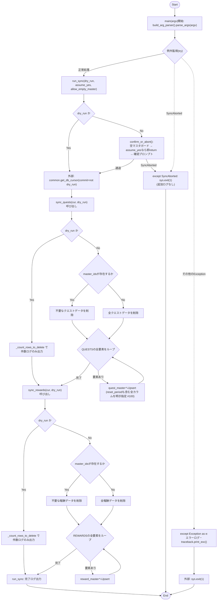
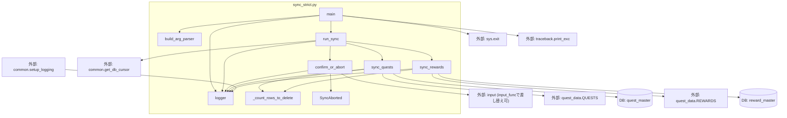

## 1. 解析メタ情報

| 項目 | 内容 |
| --- | --- |
| 対象ファイル | sync_strict.py |
| 言語 | Python |
| 解析対象 | 提供されたコードのみ |
| 推測・補完 | 一切なし |

## 関連ドキュメント

- [common.md](./common.md) — `setup_logging`・`get_db_cursor`を再エクスポートするFacadeモジュール
- [database.md](./database.md) — `common.get_db_cursor`の実体(`core.database.get_db_cursor`)
- [quest_data.md](./quest_data.md) — 同期元マスターデータ`QUESTS`/`REWARDS`/`USERS`の定義元
- [init_unified_db.md](./init_unified_db.md) — `quest_master`/`reward_master`テーブルのスキーマ定義元
- [quest_service.md](./quest_service.md) — `is_within_reset_period`の実装元。`reset_period`列に`'daily'`/`'weekly'`以外の値(旧`'weekly_monday'`等)が入ると常に`False`を返す

## 2. ファイルの概要

マスターデータ(`quest_data.QUESTS`/`REWARDS`)とデータベースのマスターテーブル(`quest_master`/`reward_master`)を完全に同期する、コマンドライン実行用のスクリプト。マスターデータに存在しない行はDBから物理削除(DELETE)し、マスターデータの内容は`INSERT ... ON CONFLICT DO UPDATE`でUpsertする「厳密な同期」を行う。この削除は破壊的操作であり、`quest_data.py`のID変更ミス一発で本番マスタが全件消えるリスクがあるため(M-9-6)、`main`から呼ばれる`run_sync`は実行前に`confirm_or_abort`で安全ガード(マスタデータが空の場合の拒否)と対話的な確認プロンプトを挟む。`--dry-run`フラグでDBを一切変更せず削除・更新件数のみを表示するモードもある。
* 根拠: `def sync_quests(cur, dry_run: bool = False):` (行番号: 22〜23 / 抜粋: "クエスト定義の完全同期 (不要なデータは削除)")
* 根拠: `class SyncAborted(Exception):` (行番号: 176〜177 / 抜粋: "M-9-6: ユーザーがマスタ同期の確認プロンプトで拒否した、または安全ガードで拒否された場合。")
* 根拠: `def confirm_or_abort(...)` docstring (行番号: 185〜192 / 抜粋: "sync_strict.py はマスタに無い行を無確認でDELETEする(マスタが空なら全削除)。")

`quest_master`へのUpsertでは、`reset_period`列を含む全カラムを明示的に指定する(Issue #100)。以前は`reset_period`列がINSERT対象に含まれていなかったため、新規行や既存行の再Upsert時にDB列のデフォルト値(`current_schema.sql`/`migrations/0002`に由来する`'weekly_monday'`。SQLiteの`ALTER TABLE`では変更不能なため列を再作成しない限り残り続ける)がそのまま入ってしまい、`is_within_reset_period()`が扱えない値のため周期内多重完了ガードが機能しない・クリアしても未クリア表示になる不具合(`migrations/0005`で一度データ補正済みのもの)が再発する経路になっていた。
* 根拠: `reset_period_val = q.get('reset_period', 'daily')` および `INSERT INTO quest_master (...)` (行番号: 57〜94 / 抜粋: "#100: reset_period 列を明示的にINSERTしないと")

## 3. 外部依存関係

### インポート一覧

| 名称 | 種類 | 用途 | 根拠 |
| --- | --- | --- | --- |
| `argparse` | 標準ライブラリ | CLI引数(`--dry-run`, `-y`/`--yes`, `--allow-empty-master`)のパース | `import argparse` (行番号: 1) |
| `sys` | 標準ライブラリ | 異常終了時のプロセス終了 (`sys.exit(1)`) | `import sys` (行番号: 2) |
| `common` | 内部モジュール | ロガーのセットアップ(`setup_logging`)およびDBカーソルの取得(`get_db_cursor`) | `import common` (行番号: 3) |
| `quest_data` (`QUESTS`, `REWARDS`, `USERS`) | 内部モジュール | 同期元となるマスターデータ | `from quest_data import QUESTS, REWARDS, USERS` (行番号: 4) |
| `traceback` (ローカルインポート) | 標準ライブラリ | `main`内で予期しない例外発生時のスタックトレース出力 | `import traceback` (行番号: 243、`main`内) |

### ブラックボックスとなる外部要素

| 名称 | 理由 | 根拠 |
| --- | --- | --- |
| `common.setup_logging` | 内部実装が提供されておらず、設定されるロガーの詳細仕様が不明 | `logger = common.setup_logging("strict_sync")` (行番号: 7) |
| `common.get_db_cursor` | 接続先DBの種類やトランザクションの詳細な制御方法が不明 | `with common.get_db_cursor(commit=not dry_run) as cur:` (行番号: 221) |
| `quest_data`の各変数 | `QUESTS`, `REWARDS`, `USERS`の全プロパティ構造が現在のファイルからは`.get()`で参照されているキーしか読み取れない | `from quest_data import QUESTS, REWARDS, USERS` (行番号: 4) |
| `init_unified_db.py` | コメントでのみ言及されており、DBの厳密なテーブルスキーマが不明 | コメント (行番号: 52 / 抜粋: "init_unified_db.py の定義と一致させる") |

## 4. 主要要素の定義（関数 / エンドポイント / コンポーネント）

### `_count_rows_to_delete`

* **役割**: `dry_run`時に、マスタに存在しないため削除対象になる行数を実際には削除せずカウントする。`master_ids`が空の場合はテーブルの全件数を返す。
* 根拠: `def _count_rows_to_delete(cur, table: str, id_column: str, master_ids: list) -> int:` (行番号: 10〜19)
* **引数/リクエスト**: `cur`, `table: str`(対象テーブル名), `id_column: str`(ID列名), `master_ids: list`(マスタ側に存在するIDのリスト)
* 根拠: (行番号: 10)
* **戻り値/レスポンス**: `int`(削除対象になる行数)
* 根拠: (行番号: 19 / 抜粋: "return row['c'] if row else 0")
* **副作用**: DB参照(`SELECT COUNT(*)`)のみ。更新・削除は行わない
* 根拠: (行番号: 12〜18)
* **エラーハンドリング**: なし
* 根拠: (行番号: 10〜19)

### `sync_quests`

* **役割**: `quest_data.QUESTS`を元に`quest_master`テーブルを完全同期する。`dry_run=True`の場合は`_count_rows_to_delete`で削除見込み件数と登録予定件数をログ出力するのみで、DBへは一切書き込まない。通常実行時は、マスタに存在しないIDの行を`DELETE`(`master_ids`が空なら全件`DELETE`)したうえで、`QUESTS`の各要素を`quest_id`をキーに`INSERT ... ON CONFLICT DO UPDATE`でUpsertする。
* 根拠: `def sync_quests(cur, dry_run: bool = False):` (行番号: 22〜95)
* **引数/リクエスト**: `cur`(DBカーソル), `dry_run: bool = False`
* 根拠: (行番号: 22)
* **戻り値/レスポンス**: なし(`return`文は`dry_run`時の早期`return`のみ)
* 根拠: (行番号: 22〜95、通常実行パスに明示的な`return`なし)
* **副作用**: `dry_run=False`時、`quest_master`テーブルへの`DELETE`文および`INSERT ... ON CONFLICT DO UPDATE`文の発行、ログ出力(`logger.info`)
* 根拠: (行番号: 38〜43 / 抜粋: "sql_delete = f\"DELETE FROM quest_master..."), (行番号: 66〜94 / 抜粋: "INSERT INTO quest_master (")
* **エラーハンドリング**: なし(呼び出し元の`run_sync`/`common.get_db_cursor`に依存)
* 根拠: (行番号: 22〜95、try-exceptなし)

### `sync_rewards`

* **役割**: `quest_data.REWARDS`を元に`reward_master`テーブルを完全同期する。`sync_quests`と同様の`dry_run`分岐・削除・Upsertの構造を持つが、`master_ids`が空の場合の全件削除ログが`sync_quests`と異なりUpsertループ手前のみで、`_count_rows_to_delete`と実処理の`else`分岐名は共通の構造。
* 根拠: `def sync_rewards(cur, dry_run: bool = False):` (行番号: 97〜146)
* **引数/リクエスト**: `cur`(DBカーソル), `dry_run: bool = False`
* 根拠: (行番号: 97)
* **戻り値/レスポンス**: なし
* 根拠: (行番号: 97〜146、明示的な`return`は`dry_run`時のみ)
* **副作用**: `dry_run=False`時、`reward_master`テーブルへの`DELETE`文および`INSERT ... ON CONFLICT DO UPDATE`文の発行、ログ出力
* 根拠: (行番号: 109〜114 / 抜粋: "DELETE FROM reward_master"), (行番号: 125〜145 / 抜粋: "INSERT INTO reward_master (")
* **エラーハンドリング**: なし
* 根拠: (行番号: 97〜146、try-exceptなし)

### `build_arg_parser`

* **役割**: CLI引数パーサを構築する。`--dry-run`(DB変更なしで件数のみ表示)、`-y`/`--yes`(確認プロンプトをスキップ)、`--allow-empty-master`(マスタが空でも実行を許可)の3フラグを定義する。
* 根拠: `def build_arg_parser() -> argparse.ArgumentParser:` (行番号: 149〜173)
* **引数/リクエスト**: なし
* 根拠: (行番号: 149)
* **戻り値/レスポンス**: `argparse.ArgumentParser`
* 根拠: (行番号: 149, 173 / 抜粋: "return parser")
* **副作用**: なし(パーサオブジェクトの構築のみ)
* 根拠: (行番号: 150〜172)
* **エラーハンドリング**: なし
* 根拠: (行番号: 149〜173)

### `SyncAborted` (例外クラス)

* **役割**: ユーザーが確認プロンプトで拒否した、または安全ガード(空マスタ)により実行を中止すべき場合に送出される専用例外(M-9-6)。
* 根拠: `class SyncAborted(Exception):` (行番号: 176〜177 / 抜粋: "M-9-6: ユーザーがマスタ同期の確認プロンプトで拒否した")
* **引数/リクエスト**: `Exception`を継承するのみで独自属性なし
* 根拠: (行番号: 176〜177)
* **戻り値/レスポンス**: 該当なし(例外クラス)
* **副作用**: なし
* **エラーハンドリング**: 該当なし。呼び出し元(`main`)が`except SyncAborted:`で捕捉し`sys.exit(1)`する
* 根拠: (行番号: 239〜240 / 抜粋: "except SyncAborted:\n        sys.exit(1)")

### `confirm_or_abort`

* **役割**: 破壊的なDELETEを伴う同期を実行してよいか判定する安全ガード(M-9-6)。`master_quest_ids`または`master_reward_ids`が空で`allow_empty_master=False`の場合はエラーログを出して即座に`SyncAborted`を送出する。`assume_yes=True`ならここで終了(プロンプト表示なし)。それ以外は`input_func`で対話的に確認し、`y`/`yes`(大小文字・前後空白は無視)以外の回答なら`SyncAborted`を送出する。
* 根拠: `def confirm_or_abort(master_quest_ids: list, master_reward_ids: list, allow_empty_master: bool, assume_yes: bool, input_func=input) -> None:` (行番号: 180〜209)
* **引数/リクエスト**: `master_quest_ids: list`, `master_reward_ids: list`, `allow_empty_master: bool`, `assume_yes: bool`, `input_func=input`(テスト用の差し替え可能な入力関数)
* 根拠: (行番号: 180〜184)
* **戻り値/レスポンス**: `None`(中止すべき場合は`SyncAborted`を送出して戻らない)
* 根拠: (行番号: 184)
* **副作用**: `logger.error`/`logger.info`によるログ出力、`input_func`の呼び出し(標準入力からの読み取りが既定)
* 根拠: (行番号: 194〜198, 204〜206, 208)
* **エラーハンドリング**: 空マスタガードまたはユーザー拒否の場合に`SyncAborted`を送出する。それ以外の例外は捕捉しない
* 根拠: (行番号: 199 / 抜粋: "raise SyncAborted(\"empty master data without --allow-empty-master\")"), (行番号: 209 / 抜粋: "raise SyncAborted(\"user declined confirmation prompt\")")

### `run_sync`

* **役割**: 同期処理全体のエントリポイント。開始ログを出力し、`dry_run=False`の場合のみ`confirm_or_abort`で安全ガード・確認プロンプトを通過させたうえで、単一のDBカーソル(`common.get_db_cursor(commit=not dry_run)`)を使って`sync_quests`と`sync_rewards`を順に実行する。
* 根拠: `def run_sync(dry_run: bool = False, assume_yes: bool = False, allow_empty_master: bool = False, input_func=input) -> None:` (行番号: 212〜228)
* **引数/リクエスト**: `dry_run: bool = False`, `assume_yes: bool = False`, `allow_empty_master: bool = False`, `input_func=input`
* 根拠: (行番号: 212)
* **戻り値/レスポンス**: なし
* 根拠: (行番号: 212〜228、明示的な`return`なし)
* **副作用**: `confirm_or_abort`呼び出し(`dry_run=False`時)、DBカーソルの取得と`sync_quests`/`sync_rewards`の呼び出し、ログ出力
* 根拠: (行番号: 218〜223 / 抜粋: "with common.get_db_cursor(commit=not dry_run) as cur:\n        sync_quests(cur, dry_run=dry_run)\n        sync_rewards(cur, dry_run=dry_run)")
* **エラーハンドリング**: 本関数自体は例外を捕捉しない。`confirm_or_abort`からの`SyncAborted`、DB操作からの例外はいずれも呼び出し元(`main`)にそのまま伝播する
* 根拠: (行番号: 212〜228、try-exceptなし)

### `main`

* **役割**: CLIエントリポイント。`build_arg_parser`でパースした引数を`run_sync`に渡して実行する。`SyncAborted`(安全ガード/確認プロンプト拒否)は静かに`sys.exit(1)`、それ以外の`Exception`はエラーログとスタックトレースを出力してから`sys.exit(1)`する。
* 根拠: `def main(argv=None):` (行番号: 231〜245)
* **引数/リクエスト**: `argv=None`(`argparse.parse_args`にそのまま渡され、`None`ならプロセスの`sys.argv`が使われる)
* 根拠: (行番号: 231〜232)
* **戻り値/レスポンス**: なし(異常時は`sys.exit(1)`でプロセス終了)
* 根拠: (行番号: 231〜245)
* **副作用**: `run_sync`の呼び出し、エラー時のログ出力・`traceback.print_exc()`・プロセス終了
* 根拠: (行番号: 241〜245 / 抜粋: "logger.error(f\"❌ Sync failed: {e}\")\n        import traceback\n        traceback.print_exc()\n        sys.exit(1)")
* **エラーハンドリング**: `SyncAborted`を捕捉して`sys.exit(1)`(ログなし、`confirm_or_abort`側で既に出力済みのため)。それ以外の`Exception`はログ・トレース出力後に`sys.exit(1)`
* 根拠: (行番号: 239〜245)

## 5. 処理フロー図

```mermaid
flowchart TD
    Start([Start]) --> MainStart["main(argv)開始: build_arg_parser().parse_args(argv)"]
    MainStart --> TryBlock{"例外監視(try)"}
    TryBlock -->|正常処理| CallRunSync["run_sync(dry_run, assume_yes, allow_empty_master)"]

    CallRunSync --> DryCheck{"dry_run か"}
    DryCheck -- No --> Confirm["confirm_or_abort():<br/>空マスタガード → assume_yesなら即return → 確認プロンプト"]
    Confirm -->|SyncAborted| CatchAbort
    DryCheck -- Yes --> GetCursor
    Confirm -->|通過| GetCursor["外部: common.get_db_cursor(commit=not dry_run)"]

    GetCursor --> CallQuests["sync_quests(cur, dry_run)呼び出し"]
    CallQuests --> Q_DryCheck{"dry_run か"}
    Q_DryCheck -- Yes --> Q_Count["_count_rows_to_delete で件数ログのみ出力"]
    Q_Count --> CallRewards
    Q_DryCheck -- No --> Q_Check{"master_idsが存在するか"}
    Q_Check -- Yes --> Q_DelPartial["不要なクエストデータを削除"]
    Q_Check -- No --> Q_DelAll["全クエストデータを削除"]
    Q_DelPartial --> Q_Loop{"QUESTSの全要素をループ"}
    Q_DelAll --> Q_Loop
    Q_Loop -- 要素あり --> Q_Upsert["quest_masterへUpsert<br/>(reset_periodも含む全カラムを明示指定 #100)"]
    Q_Upsert --> Q_Loop
    Q_Loop -- 完了 --> CallRewards["sync_rewards(cur, dry_run)呼び出し"]

    CallRewards --> R_DryCheck{"dry_run か"}
    R_DryCheck -- Yes --> R_Count["_count_rows_to_delete で件数ログのみ出力"]
    R_Count --> Success
    R_DryCheck -- No --> R_Check{"master_idsが存在するか"}
    R_Check -- Yes --> R_DelPartial["不要な報酬データを削除"]
    R_Check -- No --> R_DelAll["全報酬データを削除"]
    R_DelPartial --> R_Loop{"REWARDSの全要素をループ"}
    R_DelAll --> R_Loop
    R_Loop -- 要素あり --> R_Upsert["reward_masterへUpsert"]
    R_Upsert --> R_Loop
    R_Loop -- 完了 --> Success["run_sync: 完了ログ出力"]
    Success --> End([End])

    TryBlock -.->|SyncAborted| CatchAbort["except SyncAborted: sys.exit(1)<br/>(追加ログなし)"]
    CatchAbort --> End
    TryBlock -.->|その他のException| CatchOther["except Exception as e:<br/>エラーログ・traceback.print_exc()"]
    CatchOther --> ExitOther["外部: sys.exit(1)"]
    ExitOther --> End
```

## 6. 依存関係図

```mermaid
graph TD
    subgraph sync_strict.py
        logger
        count_rows["_count_rows_to_delete"]
        sync_quests
        sync_rewards
        build_arg_parser
        SyncAborted
        confirm_or_abort
        run_sync
        main
    end

    main --> build_arg_parser
    main --> run_sync
    main --> logger
    main --> Ext_SysExit["外部: sys.exit"]
    main --> Ext_Traceback["外部: traceback.print_exc"]

    run_sync --> confirm_or_abort
    run_sync --> sync_quests
    run_sync --> sync_rewards
    run_sync --> logger
    run_sync --> Ext_GetCursor["外部: common.get_db_cursor"]

    confirm_or_abort --> SyncAborted
    confirm_or_abort --> logger
    confirm_or_abort --> Ext_Input["外部: input (input_funcで差し替え可)"]

    sync_quests --> count_rows
    sync_quests --> logger
    sync_quests --> Ext_Quests["外部: quest_data.QUESTS"]
    sync_quests --> DB_quest_master[(DB: quest_master)]

    sync_rewards --> count_rows
    sync_rewards --> logger
    sync_rewards --> Ext_Rewards["外部: quest_data.REWARDS"]
    sync_rewards --> DB_reward_master[(DB: reward_master)]

    Ext_SetupLogging["外部: common.setup_logging"] --> logger
```

## 7. 次のステップ（リバースエンジニアリングの提案）

| 優先度 | ファイル名(推測可) | 理由 | 根拠 |
| --- | --- | --- | --- |
| 高 | `common.py` | データベース接続の仕様（利用しているRDBMSなど）や、トランザクションのコミット/ロールバックの挙動を特定するため。 | 根拠: `import common` (行番号: 3 / 抜粋: "import common") |
| 高 | `quest_data.py` | 同期元となるマスターデータ `QUESTS`、`REWARDS` の正確なスキーマおよび内容を確認するため。 | 根拠: `QUESTS` (行番号: 4 / 抜粋: "from quest_data import QUESTS, REWARDS, USERS") |
| 中 | `init_unified_db.py` | DBのテーブル `quest_master` と `reward_master` の厳密なカラム定義、データ型、制約を確認するため。 | 根拠: コメント (行番号: 52 / 抜粋: "(init_unified_db.py の定義と一致させる)") |
| 中 | `services/quest_service.py` | `is_within_reset_period`が`reset_period`列のどの値を有効として扱うか（`'daily'`/`'weekly'`のみ）を確認し、`sync_quests`が書き込む値との整合性を検証するため。 | 根拠: コメント (行番号: 57〜63 / 抜粋: "is_within_reset_period() が扱えない値のため") |

## 8. 保守上の注意点

* **破壊的な削除操作**: 実行時(`dry_run=False`)に`quest_master`および`reward_master`テーブルのデータが物理削除(DELETE)され、その後Upsertされる。マスタデータ(`QUESTS`/`REWARDS`)が空、または想定より少ないと、DBの対応テーブルの内容が意図せず失われる。M-9-6でこのリスクに対する安全ガード(`confirm_or_abort`)が導入されている。
* 根拠: `DELETE`処理 (行番号: 38〜43, 109〜114 / 抜粋: "DELETE FROM quest_master")
* **`quest_master`へのUpsertは全カラムを明示指定する必要がある(Issue #100)**: `reset_period`のようにINSERT対象から漏れた列は、SQLiteの列デフォルト値(`current_schema.sql`/`migrations/0002`由来の`'weekly_monday'`)がそのまま入り、`is_within_reset_period()`が扱えない値のため周期内多重完了ガードが機能しなくなる。`ALTER TABLE`では列のデフォルト値自体を変更できない(列を再作成しない限り残り続ける)ため、アプリケーション側で明示的に値を指定する必要がある。今後`quest_master`に新しい列を追加する場合も、`sync_quests`のINSERT/UPDATE列リストへの追加を忘れずに行う必要がある。
* 根拠: `reset_period_val = q.get('reset_period', 'daily')` (行番号: 57〜64), `INSERT INTO quest_master (... reset_period)` (行番号: 66〜94)
* **削除処理の非対称性**: `sync_quests`と`sync_rewards`はいずれも`master_ids`が空の場合に全データを削除する`else`分岐を持つ点は共通しているが、`dry_run`時の件数カウント(`_count_rows_to_delete`)は両者で共通ヘルパーに統合されている一方、実削除・Upsertのロジック自体はほぼ重複したコードとして個別に実装されている。
* 根拠: `sync_quests`の`else`分岐 (行番号: 41〜43), `sync_rewards`の`else`分岐 (行番号: 112〜114)
* **データ取得におけるフォールバック**: マスターデータの辞書から値を取得する際、`.get('exp_gain', q.get('exp', 0))`のように、キーが存在しない場合に代替キーやデフォルト値を使用している箇所が複数ある。
* 根拠: フォールバック処理 (行番号: 47〜49 / 抜粋: "exp_val = q.get('exp_gain', q.get('exp', 0))")
* **未使用のインポート**: `quest_data`からインポートされている`USERS`は、現在のファイル内では一度も使用されていない。
* 根拠: インポート文 (行番号: 4 / 抜粋: "from quest_data import QUESTS, REWARDS, USERS")
* **null安全性**: Upsert時のSQLにおいて、辞書の`.get()`メソッドで取得した値（キーが存在しない場合は`None`になるもの、例えば`q.get('days')`）がそのままSQLのパラメータとして渡されており、DBスキーマ側でNULLが許可されていないとエラーになる可能性がある。
* 根拠: パラメータ渡し (行番号: 91 / 抜粋: "q.get('days'),              # days (0,1,2...)")
* **`confirm_or_abort`の対話プロンプトはCLI実行前提**: `input_func`のデフォルトは組み込み`input`であり、`unified_server.py`等のAPI経由で本モジュールの関数を直接呼び出すような使い方は想定されていない(現状そのような呼び出し元は本ファイルからは確認できない)。

## 9. 不明事項一覧

| 項目 | 理由 | 必要なファイル |
| --- | --- | --- |
| 対象データベースの種類 | プレースホルダー`?`の使用や`ON CONFLICT`構文からSQLite等と推測されるが、本ファイルには明記されていないため判断不可。 | `common.py` |
| `QUESTS`, `REWARDS` の全プロパティ構造 | コード上には`.get()`で参照されているキーしか表れていないため、実際のマスターデータの全容が不明。 | `quest_data.py` |
| DBの正確なテーブルスキーマ | カラムの型や`NOT NULL`制約、デフォルト値が現在のファイルからは判断できないため。 | `init_unified_db.py` または DBスキーマ定義ファイル |
| トランザクションの挙動 | `get_db_cursor(commit=not dry_run)`が例外発生時に自動でロールバックを行うかどうかが不明なため。 | `common.py` |
| 本スクリプトの実運用上の呼び出しタイミング | `main`/`run_sync`がCI/デプロイ手順・運用者の手動実行のどちらを主な想定としているか、呼び出し元のドキュメントが本ファイルには存在しないため不明。 | デプロイ手順書、`deploy.sh`等 |

## 相互参照による補足情報

| 元の不明事項 | 判明した内容 | 参照元ドキュメント |
| --- | --- | --- |
| 対象データベースの種類 | `database.md`の解析によれば、`common.get_db_cursor`の実体である`core.database.get_db_cursor`は`sqlite3`を用いた接続コンテキストマネージャであり、`PRAGMA journal_mode=WAL`および`PRAGMA foreign_keys=ON`を発行することが判明した。これによりSQLiteであることが裏付けられる。 | database.md |
| `QUESTS`, `REWARDS` の全プロパティ構造 | `quest_data.md`の解析によれば、`QUESTS`は`id`/`title`/`type`/`target`/`category`/`difficulty`/`exp`/`gold`/`icon`/`desc`を基本キーとし任意で`days`/`start_time`/`end_time`/`chance`を持つ辞書のリスト(有効53件)、`REWARDS`は`id`/`title`/`category`/`cost_gold`/`icon_key`/`desc`を基本キーとし任意で`target`を持つ辞書のリスト(23件)であることが判明した。いずれも`reset_period`キーは持たない。 | quest_data.md |

## 10. 自己検証結果

* [x] 推測・外部ファイルの仕様を一切含んでいない（完了）
* [x] 全関数・全クラス・全コンポーネントを列挙した（完了）
* [x] 全てのインポート要素を列挙した（完了）
* [x] すべての仕様説明に「根拠（行番号・抜粋）」を明記した（完了）
* [x] 根拠漏れが0件である（完了）
* [x] Mermaid構文にエラーの原因となる記号（エスケープ漏れ）がない（完了）
* [x] 不明事項を漏れなく列挙した（完了）
