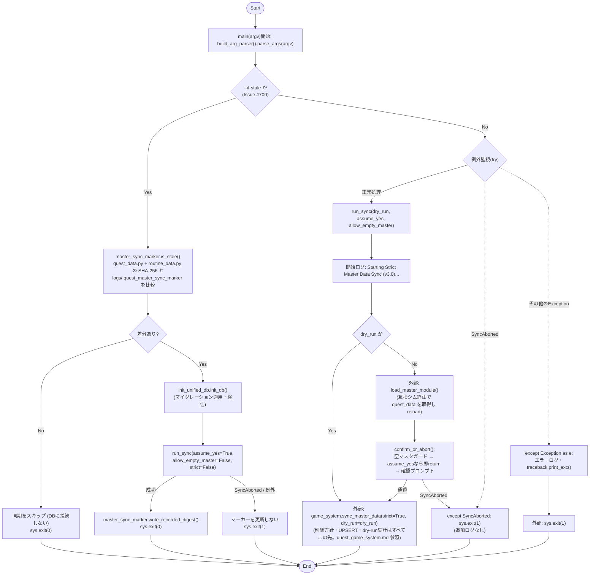
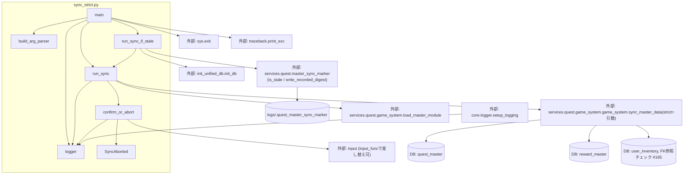

## 1. 解析メタ情報

| 項目 | 内容 |
| --- | --- |
| 対象ファイル | sync_strict.py |
| 言語 | Python |
| 解析対象 | 提供されたコードのみ |
| 推測・補完 | 一切なし |

## 関連ドキュメント

- [quest_game_system.md](./quest_game_system.md) — **Issue #664 で同期の実体が移った先**。`GameSystem.sync_master_data(strict=True, dry_run=...)` が本ファイルの唯一の実処理
- [quest_master_sync_sql.md](./quest_master_sync_sql.md) — UPSERT文とパラメータ組み立ての一元管理（Issue #664。統合後は `game_system.py` からのみ参照される）
- [common.md](./common.md) — **Issue #664 で `common.py` ごと廃止された Deprecated Facade**（本ファイルは実体を直importするようになった。仕様書は履歴として残っている）
- [database.md](./database.md) — `core.database.get_db_cursor` / `get_ro_connection` の実体（統合後、本ファイルからは直接使わない）
- [quest_data.md](./quest_data.md) — 同期元マスターデータ`QUESTS`/`REWARDS`の定義元
- [init_unified_db.md](./init_unified_db.md) — `quest_master`/`reward_master`テーブルのスキーマ定義元
- [quest_service.md](./quest_service.md) — `quest_data` を保持する互換シム。`load_master_module()` はここ経由でマスタを読む
- [quest_master_sync_marker.md](./quest_master_sync_marker.md) — **（Issue #700 で追加）** `--if-stale` の冪等判定（マスタ定義ソースのダイジェストとマーカー）
- [routine_data.md](./routine_data.md) — **（Issue #700 で追加）** `--if-stale` のダイジェスト対象その2
- [start_all.md](./start_all.md) — **（Issue #700 で追加）** Phase 2.5 から `--if-stale` を呼ぶ側
- [health_watch.md](./health_watch.md) — **（Issue #700 で追加）** 同期漏れの検知側（チェック8）。修正は本ファイル、検知は health_watch と責務を分けている
- [init_unified_db.md](./init_unified_db.md) — **（Issue #700 で追加）** `--if-stale` が同期前に呼ぶ `init_db()`（マイグレーション適用と検証）

## 2. ファイルの概要

マスターデータ(`quest_data.QUESTS`/`REWARDS`)とデータベースのマスターテーブル(`quest_master`/`reward_master`)を完全に同期するコマンドライン実行用のスクリプト。マスターデータに存在しない行はDBから物理削除(DELETE)される破壊的操作であり、`quest_data.py`のID変更ミス一発で本番マスタが全件消えるリスクがあるため(M-9-6)、実行前に`confirm_or_abort`で安全ガード(マスタデータが空の場合の拒否)と対話的な確認プロンプトを挟む。`--dry-run`フラグでDBを一切変更せず削除・更新件数のみを表示するモードもある。
* 根拠: モジュールdocstring (行番号: 1〜19 / 抜粋: "quest_data.py の内容で quest_master/reward_master を完全同期する手動実行CLI。")
* 根拠: `class SyncAborted(Exception):` (行番号: 75〜76 / 抜粋: "M-9-6: ユーザーがマスタ同期の確認プロンプトで拒否した、または安全ガードで拒否された場合。")

**（Issue #664 で変更）本ファイルは同期処理そのものを持たない。** 同期の実体(`DELETE ... NOT IN` とUPSERTのループ)は`services/quest/game_system.py`の`GameSystem.sync_master_data(strict=True)`へ統合され、本ファイルに残るのはCLIの責務(引数解析と、破壊的操作に対する安全ガード)だけである。統合前はここと`GameSystem.sync_master_data()`に「マスタ→DB同期」が二重に書かれており、UPSERTの列リストが食い違う事故が#100(`reset_period`欠落)・#164(時間帯/期間/出現率/前提クエスト欠落)・#165(`description`欠落)と3度起きていた。#664の前段(PR #670)でUPSERT文自体は`services/quest/master_sync_sql.py`へ寄せられたが、削除方針と同期ループは二重のまま残っていたため、ここで完全に1本化された。
* 根拠: モジュールdocstring (行番号: 3〜16 / 抜粋: "同期の実体(`DELETE ... NOT IN` + UPSERT)は")
* 根拠: `game_system.sync_master_data(strict=True, dry_run=dry_run)` (行番号: 107 / 抜粋: "game_system.sync_master_data(strict=True, dry_run=dry_run)")

`strict=True`が API 経路(`POST /api/quest/seed` = `strict=False`)と異なる点は3つで、いずれも`GameSystem.sync_master_data`側のdocstringに記載されている: (1) マスタのクエストが空のとき`quest_master`を全削除する(`strict=False`は#242の安全弁として削除自体をスキップする)、(2) `quest_users`は同期しない(CLIの対象は一貫して`quest_master`/`reward_master`の2テーブル)、(3) マスタ各エントリの欠損キーを統合前の本ファイルと同じ既定値で補ってから`MasterQuest`/`MasterReward`で検証する。
* 根拠: モジュールdocstring (行番号: 17〜18 / 抜粋: "`strict=True` が API 経路(`POST /api/quest/seed` = `strict=False`)と違う点は")

**（Issue #700 で追加）`--if-stale`（冪等モード）**: マスタ同期は API (`POST /api/quest/sync_master`) か本CLIを手で叩いたときにしか走らず、`quest_data.py`を編集したPRをマージして実機に`git pull`してもDBは古いまま残っていた（2026-09-19の棚卸しで、退役済みクエスト6件が`quest_master`に残って移設先のすごろくステップ報酬と二重報酬になっていた）。本フラグは`services/quest/master_sync_marker.py`の判定で**マスタ定義ソースに差分があるときだけ**同期し、`deploy/git-hooks/post-merge`と`MY_HOME_SYSTEM/start_all.sh`（Phase 2.5）の両方から無人で呼ばれる。無人実行のため確認プロンプトは出さず、同期モードは`strict=False`（マスタが空でも`quest_master`を全削除しない#242の安全弁が効く側）を使う。
* 根拠: モジュールdocstring (行番号: 20〜27 / 抜粋: "Issue #700: デプロイ経路(`deploy/git-hooks/post-merge` と")

## 3. 外部依存関係

### インポート一覧

| 名称 | 種類 | 用途 | 根拠 |
| --- | --- | --- | --- |
| `argparse` | 標準ライブラリ | CLI引数(`--dry-run`, `-y`/`--yes`, `--allow-empty-master`)のパース | `import argparse` (行番号: 20) |
| `sys` | 標準ライブラリ | 異常終了時のプロセス終了 (`sys.exit(1)`) | `import sys` (行番号: 21) |
| `core.logger.setup_logging` | ローカルモジュール | **（Issue #664 で変更）** 以前は Deprecated Facade である `common` 経由で参照していた。`common.py` の廃止に伴い実体を直接importする | `from core.logger import setup_logging` (行番号: 23) |
| `services.quest.master_sync_marker` | ローカルモジュール | **（Issue #700 で追加）** `--if-stale` の差分判定とマーカーの読み書き | `from services.quest import master_sync_marker` (行番号: 33) |
| `services.quest.game_system.game_system` | ローカルモジュール | **（Issue #664 で追加）** 同期の実体。モジュールレベルのシングルトン | `from services.quest.game_system import game_system, load_master_module` (行番号: 24) |
| `services.quest.game_system.load_master_module` | ローカルモジュール | **（Issue #664 で追加）** 安全ガードが数えるマスタを、同期処理と同じ読み込み口から取得するため | `from services.quest.game_system import game_system, load_master_module` (行番号: 24) |
| `init_unified_db` (ローカルインポート) | ローカルモジュール | **（Issue #700 で追加）** `--if-stale` の同期前にマイグレーションを適用する(`init_db()`)。このモード専用の依存のためモジュール先頭ではなく関数内でimportする | `import init_unified_db` (行番号: 185、`run_sync_if_stale`内) |
| `traceback` (ローカルインポート) | 標準ライブラリ | `main`内で予期しない例外発生時のスタックトレース出力 | `import traceback` (行番号: 122、`main`内) |

**（Issue #664 で削除されたインポート）** `core.database.get_db_cursor`、`quest_data`の`QUESTS`/`REWARDS`、`services.quest.master_sync_sql`の4シンボル(`QUEST_UPSERT_SQL`/`REWARD_UPSERT_SQL`/`quest_upsert_params`/`reward_upsert_params`)は、同期処理ごと`game_system.py`へ移ったため本ファイルからは参照されなくなった。**本ファイルはDBに直接触れない。**
* 根拠: `import` 節全体 (行番号: 20〜24)

### ブラックボックスとなる外部要素

| 名称 | 理由 | 根拠 |
| --- | --- | --- |
| `core.logger.setup_logging` | 内部実装が提供されておらず、設定されるロガーの詳細仕様が不明 | `logger = setup_logging("strict_sync")` (行番号: 27) |
| `services.quest.game_system.game_system` | `sync_master_data(strict=True, dry_run=...)` が実際にどのSQLを発行するかは本ファイルからは読み取れない | `game_system.sync_master_data(strict=True, dry_run=dry_run)` (行番号: 107) |
| `services.quest.game_system.load_master_module` | 互換シム経由でどのモジュールを解決し `importlib.reload` するかは本ファイルからは読み取れない | `quest_data = load_master_module()` (行番号: 101) |

## 4. 主要要素の定義（関数 / エンドポイント / コンポーネント）

### `build_arg_parser`

* **役割**: CLI引数パーサを構築する。`--dry-run`(DB変更なしで件数のみ表示)、`-y`/`--yes`(確認プロンプトをスキップ)、`--allow-empty-master`(マスタが空でも実行を許可)、**（Issue #700 で追加）**`--if-stale`(`dest="if_stale"`。マスタ定義ソースに差分があるときだけ同期する冪等モード)の4フラグを定義する。
* 根拠: `def build_arg_parser() -> argparse.ArgumentParser:` (行番号: 40〜72)
* **引数/リクエスト**: なし
* 根拠: (行番号: 30)
* **戻り値/レスポンス**: `argparse.ArgumentParser`
* 根拠: (行番号: 30, 54 / 抜粋: "return parser")
* **副作用**: なし(パーサオブジェクトの構築のみ)
* 根拠: (行番号: 31〜53)
* **エラーハンドリング**: なし
* 根拠: (行番号: 30〜54、try-exceptなし)

### `SyncAborted` (例外クラス)

* **役割**: ユーザーが確認プロンプトで拒否した、または安全ガード(空マスタ)により実行を中止すべき場合に送出される専用例外(M-9-6)。
* 根拠: `class SyncAborted(Exception):` (行番号: 75〜76 / 抜粋: "M-9-6: ユーザーがマスタ同期の確認プロンプトで拒否した")
* **引数/リクエスト**: `Exception`を継承するのみで独自属性なし
* 根拠: (行番号: 57〜58)
* **戻り値/レスポンス**: 該当なし(例外クラス)
* **副作用**: なし
* **エラーハンドリング**: 該当なし。呼び出し元(`main`)が`except SyncAborted:`で捕捉し`sys.exit(1)`する
* 根拠: (行番号: 118〜119 / 抜粋: "except SyncAborted:")

### `confirm_or_abort`

* **役割**: 破壊的なDELETEを伴う同期を実行してよいか判定する安全ガード(M-9-6)。`master_quest_ids`または`master_reward_ids`が空で`allow_empty_master=False`の場合はエラーログを出して即座に`SyncAborted`を送出する。`assume_yes=True`ならここで終了(プロンプト表示なし)。それ以外は`input_func`で対話的に確認し、`y`/`yes`(大小文字・前後空白は無視)以外の回答なら`SyncAborted`を送出する。
* 根拠: `def confirm_or_abort(` (行番号: 79〜108)
* **引数/リクエスト**: `master_quest_ids: list`, `master_reward_ids: list`, `allow_empty_master: bool`, `assume_yes: bool`, `input_func=input`(テスト用の差し替え可能な入力関数)
* 根拠: (行番号: 61〜65)
* **戻り値/レスポンス**: `None`(中止すべき場合は`SyncAborted`を送出して戻らない)
* 根拠: (行番号: 65 / 抜粋: ") -> None:")
* **副作用**: `logger.error`/`logger.info`によるログ出力、`input_func`の呼び出し(標準入力からの読み取りが既定)
* 根拠: (行番号: 75〜79, 85〜87, 90)
* **エラーハンドリング**: 空マスタガードまたはユーザー拒否の場合に`SyncAborted`を送出する。それ以外の例外は捕捉しない
* 根拠: (行番号: 80 / 抜粋: "raise SyncAborted(\"empty master data without --allow-empty-master\")"), (行番号: 90 / 抜粋: "raise SyncAborted(\"user declined confirmation prompt\")")

### `run_sync`

* **役割**: **（Issue #664 で縮小）** CLIの実行本体。開始ログを出力し、`dry_run=False`の場合のみ`load_master_module()`でマスタを取得して`confirm_or_abort`に通したうえで、`game_system.sync_master_data(strict=strict, dry_run=dry_run)`を1回呼ぶ（`strict`の既定値は`True`）。統合前はここで`get_db_cursor(commit=not dry_run)`を開き`sync_quests`/`sync_rewards`を順に実行していたが、その処理はすべて`game_system.py`側へ移った。マスタの取得に`load_master_module()`を使うのは、**安全ガードが数えるマスタと実際に同期されるマスタを同じ読み込み口に揃える**ためである(別々に読むと「ガードは通ったが別のデータで全削除された」が起こりうる)。
* 根拠: `def run_sync(` (行番号: 111〜135)
* 根拠: コメント (行番号: 96〜98 / 抜粋: "安全ガードは「これから同期されるマスタ」を数える必要があるため、")
* **引数/リクエスト**: `dry_run: bool = False`, `assume_yes: bool = False`, `allow_empty_master: bool = False`, `input_func=input`, **（Issue #700 で追加）**`strict: bool = True`(そのまま`sync_master_data`へ渡す。既定の`True`は従来どおりの手動CLIの挙動で、`--if-stale`だけが`False`を渡す)
* 根拠: (行番号: 111〜113)
* **戻り値/レスポンス**: なし
* 根拠: (行番号: 93 / 抜粋: ") -> None:")
* **副作用**: 開始ログの出力、`dry_run=False`時の`load_master_module()`呼び出しと`confirm_or_abort`呼び出し、`game_system.sync_master_data`の呼び出し(DBへの変更はこの先で起きる)
* 根拠: (行番号: 94, 99〜107)
* **エラーハンドリング**: 本関数自体は例外を捕捉しない。`confirm_or_abort`からの`SyncAborted`、`load_master_module()`の`ImportError`、`sync_master_data`からの`HTTPException`・DB例外はいずれも呼び出し元(`main`)にそのまま伝播する
* 根拠: (行番号: 93〜107、try-exceptなし)

### `run_sync_if_stale` (**Issue #700で追加**)

* **役割**: `--if-stale`の実体。`master_sync_marker.is_stale()`で`quest_data.py`/`routine_data.py`の差分を判定し、差分が無ければ**DBに接続すらせず**0を返す。差分があれば`init_unified_db.init_db()`(マイグレーション適用と検証)を通してから`run_sync(assume_yes=True, allow_empty_master=False, strict=False)`を実行し、成功した場合だけマーカーへ現在のダイジェストを記録する。docstringには、無人実行のため`strict=False`を使う理由（`strict=True`はマスタが空のとき`quest_master`を全削除するが、確認プロンプトで止められない）、それでも空マスタガードは通す理由（`reward_master`側はstrictでなくても「マスタが空なら参照の無い報酬を全削除」する経路が残る）、`init_db()`を先に呼ぶ理由（このモードは`unified_server.py`の`lifespan`より前に走るため、新しいマイグレーションとマスタ定義の変更を同じpullで受け取るとスキーマ未適用のままUPSERTして失敗しうる）が明記されている。
* 根拠: `def run_sync_if_stale(dry_run: bool = False, base_dir=None, marker_path=None) -> int:` (行番号: 138〜206)

* **引数/リクエスト**: `dry_run: bool = False`, `base_dir=None`(マスタ定義ソースの探索基点。`None`なら`config.BASE_DIR`), `marker_path=None`(`None`なら`master_sync_marker.get_marker_path()`)
* 根拠: `def run_sync_if_stale(dry_run: bool = False, base_dir=None, marker_path=None) -> int:` (行番号: 138)

* **戻り値/レスポンス**: `int`(プロセスの終了コード相当)。0は「最新のため何もしなかった」または「同期に成功した」、1は「判定不能(マスタ定義ソースを読めない)」または「同期の失敗・中止」。
* 根拠: (行番号: 174、178、191、196、201、206 / 抜粋: "return 1", "return 0")

* **副作用**: マスタ定義ソースとマーカーの読み取り、差分がある場合の`init_db()`・`run_sync()`呼び出し(DBへの変更はこの先で起きる)、同期成功後のマーカーの原子的な更新。`dry_run=True`のときはマーカーを更新しない(何も変更していないのに進めると次回の同期が飛ぶため)。
* 根拠: (行番号: 198〜205 / 抜粋: "# dry-run は何も変更していないので、マーカーを進めると次回の同期が飛ぶ。")

* **エラーハンドリング**: `compute_master_digest`の`OSError`は「判定不能」としてエラーログを出し、同期もマーカー更新もせずに1を返す。`SyncAborted`(空マスタガード)と、それ以外の例外はいずれもエラーログのみを出して1を返し、**マーカーを更新しない**ため次回の実行で再試行される(無人実行なのでtracebackは出さない)。マーカーの書き込み失敗は同期自体が完了しているため警告ログのみで0を返す。
* 根拠: (行番号: 169〜174、189〜196、203〜205 / 抜粋: "except SyncAborted:")

### `main`

* **役割**: CLIエントリポイント。**（Issue #700 で変更）** `--if-stale`が指定されていれば`run_sync_if_stale(dry_run=...)`の戻り値をそのまま`sys.exit`する(従来の確認プロンプト付き経路には流れない)。それ以外は`build_arg_parser`でパースした引数を`run_sync`に渡して実行する。`SyncAborted`(安全ガード/確認プロンプト拒否)は静かに`sys.exit(1)`、それ以外の`Exception`はエラーログとスタックトレースを出力してから`sys.exit(1)`する。
* 根拠: `def main(argv=None):` (行番号: 209〜224)
* 根拠: (行番号: 211〜212 / 抜粋: "if args.if_stale:")
* **引数/リクエスト**: `argv=None`(`argparse.parse_args`にそのまま渡され、`None`ならプロセスの`sys.argv`が使われる)
* 根拠: (行番号: 110〜111)
* **戻り値/レスポンス**: なし(異常時は`sys.exit(1)`でプロセス終了)
* 根拠: (行番号: 110〜125)
* **副作用**: `run_sync`の呼び出し、エラー時のログ出力・`traceback.print_exc()`・プロセス終了
* 根拠: (行番号: 120〜124 / 抜粋: "logger.error(f\"❌ Sync failed: {e}\")")
* **エラーハンドリング**: `SyncAborted`を捕捉して`sys.exit(1)`(ログなし、`confirm_or_abort`側で既に出力済みのため)。それ以外の`Exception`はログ・トレース出力後に`sys.exit(1)`
* 根拠: (行番号: 118〜124)

## 5. 処理フロー図

```mermaid
flowchart TD
    Start([Start]) --> MainStart["main(argv)開始: build_arg_parser().parse_args(argv)"]
    MainStart --> IfStale{"--if-stale か<br/>(Issue #700)"}
    IfStale -- Yes --> Marker["master_sync_marker.is_stale()<br/>quest_data.py + routine_data.py の SHA-256 と<br/>logs/.quest_master_sync_marker を比較"]
    Marker --> StaleQ{"差分あり?"}
    StaleQ -- No --> SkipSync["同期をスキップ (DBに接続しない)<br/>sys.exit(0)"]
    SkipSync --> End
    StaleQ -- Yes --> InitDb["init_unified_db.init_db()<br/>(マイグレーション適用・検証)"]
    InitDb --> StaleSync["run_sync(assume_yes=True,<br/>allow_empty_master=False, strict=False)"]
    StaleSync -->|"成功"| WriteMarker["master_sync_marker.write_recorded_digest()<br/>sys.exit(0)"]
    StaleSync -->|"SyncAborted / 例外"| NoMarker["マーカーを更新しない<br/>sys.exit(1)"]
    WriteMarker --> End
    NoMarker --> End
    IfStale -- No --> TryBlock{"例外監視(try)"}
    TryBlock -->|正常処理| CallRunSync["run_sync(dry_run, assume_yes, allow_empty_master)"]

    CallRunSync --> StartLog["開始ログ: Starting Strict Master Data Sync (v3.0)..."]
    StartLog --> DryCheck{"dry_run か"}
    DryCheck -- Yes --> CallSync
    DryCheck -- No --> LoadMaster["外部: load_master_module()<br/>(互換シム経由で quest_data を取得し reload)"]
    LoadMaster --> Confirm["confirm_or_abort():<br/>空マスタガード → assume_yesなら即return → 確認プロンプト"]
    Confirm -->|SyncAborted| CatchAbort
    Confirm -->|通過| CallSync["外部: game_system.sync_master_data(strict=True, dry_run=dry_run)<br/>(削除方針・UPSERT・dry-run集計はすべてこの先。quest_game_system.md 参照)"]

    CallSync --> End([End])

    TryBlock -.->|SyncAborted| CatchAbort["except SyncAborted: sys.exit(1)<br/>(追加ログなし)"]
    CatchAbort --> End
    TryBlock -.->|その他のException| CatchOther["except Exception as e:<br/>エラーログ・traceback.print_exc()"]
    CatchOther --> ExitOther["外部: sys.exit(1)"]
    ExitOther --> End
```

## 6. 依存関係図

```mermaid
graph TD
    subgraph sync_strict.py
        logger
        build_arg_parser
        SyncAborted
        confirm_or_abort
        run_sync
        run_sync_if_stale
        main
    end

    main --> build_arg_parser
    main --> run_sync
    main --> run_sync_if_stale
    run_sync_if_stale --> run_sync
    run_sync_if_stale --> Ext_Marker["外部: services.quest.master_sync_marker<br/>(is_stale / write_recorded_digest)"]
    run_sync_if_stale --> Ext_InitDb["外部: init_unified_db.init_db"]
    Ext_Marker --> MarkerFile[("logs/.quest_master_sync_marker")]
    main --> logger
    main --> Ext_SysExit["外部: sys.exit"]
    main --> Ext_Traceback["外部: traceback.print_exc"]

    run_sync --> confirm_or_abort
    run_sync --> logger
    run_sync --> Ext_LoadMaster["外部: services.quest.game_system.load_master_module"]
    run_sync --> Ext_SyncMasterData["外部: services.quest.game_system.game_system.sync_master_data(strict=引数)"]

    confirm_or_abort --> SyncAborted
    confirm_or_abort --> logger
    confirm_or_abort --> Ext_Input["外部: input (input_funcで差し替え可)"]

    Ext_SyncMasterData --> DB_quest_master[(DB: quest_master)]
    Ext_SyncMasterData --> DB_reward_master[(DB: reward_master)]
    Ext_SyncMasterData --> DB_user_inventory[(DB: user_inventory, FK参照チェック #165)]

    Ext_SetupLogging["外部: core.logger.setup_logging"] --> logger
```

## 7. 次のステップ（リバースエンジニアリングの提案）

| 優先度 | ファイル名(推測可) | 理由 | 根拠 |
| --- | --- | --- | --- |
| 高 | `services/quest/game_system.py` | **同期の実体がここにある**(Issue #664)。削除方針・UPSERT列リスト・dry-run集計・`strict`の意味はすべてこのファイルを読まないと分からない。 | 根拠: `from services.quest.game_system import game_system, load_master_module` (行番号: 24) |
| 高 | `quest_data.py` | 同期元となるマスターデータ `QUESTS`、`REWARDS` の正確なスキーマおよび内容を確認するため。 | 根拠: `quest_data = load_master_module()` (行番号: 101) |
| 中 | `services/quest/master_sync_sql.py` | `quest_master`/`reward_master`への実際のUPSERT列リストを確認するため。 | 根拠: モジュールdocstring (行番号: 8〜10 / 抜粋: "#664 の前段で SQL 自体は") |
| 中 | `services/quest_service.py` | `load_master_module()`が経由する互換シムで、`quest_data`の実体を保持している。 | 根拠: モジュールdocstring (行番号: 3〜4 / 抜粋: "`services/quest/game_system.py` の `GameSystem.sync_master_data(strict=True)` へ統合した。") |

## 8. 保守上の注意点

* **破壊的な削除操作**: 実行時(`dry_run=False`)に`quest_master`および`reward_master`テーブルのデータが物理削除(DELETE)され、その後Upsertされる。マスタデータ(`QUESTS`/`REWARDS`)が空、または想定より少ないと、DBの対応テーブルの内容が意図せず失われる。M-9-6でこのリスクに対する安全ガード(`confirm_or_abort`)が導入されている。**削除そのものを行うのは`game_system.sync_master_data(strict=True)`側**で、本ファイルはその前段のガードだけを担う。
* 根拠: `class SyncAborted(Exception):` (行番号: 75〜76), `game_system.sync_master_data(strict=True, dry_run=dry_run)` (行番号: 107)
* **（Issue #664）同期ロジックをここに書き戻さないこと**: UPSERTの列リストが食い違う事故が#100・#164・#165と3度起きたのは、同じ同期が2箇所に別実装で存在したためである。新しい列の追加・削除方針の変更は`services/quest/game_system.py`と`services/quest/master_sync_sql.py`の側で行う。回帰テスト`tests/test_sync_strict.py::TestMasterSyncSqlIsSharedWithGameSystem::test_the_cli_no_longer_has_its_own_sync_implementation`が、本ファイルに独自のSQL実行・`sync_quests`/`sync_rewards`が復活していないことを検査する。
* 根拠: モジュールdocstring (行番号: 3〜16 / 抜粋: "UPSERT の列リストが食い違う事故が #100")
* **安全ガードとマスタの読み込み口は一致させること**: `run_sync`は`load_master_module()`で取得したマスタの件数を`confirm_or_abort`に渡し、続けて`sync_master_data`が同じ読み込み口から読む。ここを別々の経路(例: `from quest_data import QUESTS`のモジュールレベルimport)に戻すと、ガードが見たマスタと実際に書かれるマスタがずれうる。
* 根拠: コメント (行番号: 96〜98 / 抜粋: "別々に読むと、ガードが見たマスタと実際に書かれるマスタがずれうる。")
* **`--dry-run`は確認プロンプトを通らない**: `run_sync`は`dry_run=True`のとき`load_master_module()`も`confirm_or_abort`も呼ばずに`sync_master_data(strict=True, dry_run=True)`へ進む。DBを変更しないため問題にはならないが、「dry-runでは空マスタガードが働かない」という非対称は意図的なものである。
* 根拠: (行番号: 96〜107 / 抜粋: "if not dry_run:")
* **`confirm_or_abort`の対話プロンプトはCLI実行前提**: `input_func`のデフォルトは組み込み`input`であり、`unified_server.py`等のAPI経由で本モジュールの関数を直接呼び出すような使い方は想定されていない(現状そのような呼び出し元は本ファイルからは確認できない)。API経路が使うのは`strict=False`側である。
* **（Issue #700）`--if-stale`は差分があるときだけ同期すること**: マーカーの判定を外して毎回同期すると、`DELETE ... NOT IN`を含む破壊的操作が`git pull`・サーバー起動のたびに走る。逆に**同期が失敗したのにマーカーを進めると、以後のデプロイで永久に同期されなくなる**ため、マーカーの更新は同期成功後に限ること。回帰テストは`tests/test_sync_strict.py::TestRunSyncIfStale`(差分なしで`sync_master_data`を呼ばないこと、`strict=False`で呼ぶこと、プロンプトを出さないこと、中止・失敗・dry-runでマーカーを更新しないこと)。
* 根拠: `def run_sync_if_stale(dry_run: bool = False, base_dir=None, marker_path=None) -> int:` (行番号: 138〜206)
* **（Issue #700）`--if-stale`だけが`strict=False`である**: 手動CLI(`--yes`等)は従来どおり`strict=True`で、マスタが空なら`quest_master`を全削除する。無人実行の経路でこの方針を使うと、`quest_data.py`のimportミス一発で確認なしに全削除されうるため、`strict=False`(#242の安全弁)と空マスタガードの二重で止める。**このモードの`strict`を`True`に変えないこと。**
* 根拠: モジュールdocstring (行番号: 25〜27 / 抜粋: "このモードだけは `strict=False` で同期する — 無人実行では確認プロンプトを")

## 9. 不明事項一覧

| 項目 | 理由 | 必要なファイル |
| --- | --- | --- |
| `sync_master_data(strict=True)`が実際に発行するSQL | 本ファイルは呼び出すだけで、削除方針・UPSERT列リストは読み取れない。 | `services/quest/game_system.py`、`services/quest/master_sync_sql.py` |
| `QUESTS`, `REWARDS` の全プロパティ構造 | 本ファイルは`q['id']`/`r['id']`しか参照していないため、マスターデータの全容が不明。 | `quest_data.py` |
| DBの正確なテーブルスキーマ | 本ファイルはDBに触れないため、カラムの型や制約が判断できない。 | `MY_HOME_SYSTEM/migrations/`(唯一の定義元)、`MY_HOME_SYSTEM/current_schema.sql` |
| トランザクションの挙動 | `get_db_cursor`の呼び出しが本ファイルから消えたため、コミット単位が判断できない。 | `services/quest/game_system.py`、`core/database.py` |
| 本スクリプトの実運用上の呼び出しタイミング | **（Issue #700 で一部解消）** `--if-stale`は`deploy/git-hooks/post-merge`と`start_all.sh`から自動実行されるが、それ以外のフラグ(手動の`--yes`等)をいつ使うかは本ファイルからは読み取れない。 | `deploy/git-hooks/post-merge`、`MY_HOME_SYSTEM/start_all.sh` |

## 相互参照による補足情報

| 元の不明事項 | 判明した内容 | 参照元ドキュメント |
| --- | --- | --- |
| `sync_master_data(strict=True)`が実際に発行するSQL | `services/quest/game_system.py`の`sync_master_data`(103行目〜)を直接確認した。`strict=True`のとき、クエストは`active_q_ids`が非空なら`DELETE FROM quest_master WHERE quest_id NOT IN (?,...)`、**空なら`DELETE FROM quest_master`(全削除)**を実行する(`strict=False`は#242の安全弁として削除自体をスキップする)。報酬はどちらのモードでも、削除候補を`SELECT`で抽出したうえで`user_inventory`への参照が残るものを除外してから1行ずつ`DELETE`する(#165)。UPSERTは両モードとも`services/quest/master_sync_sql.py`の`QUEST_UPSERT_SQL`(全16列)・`REWARD_UPSERT_SQL`(全8列、`desc`には`description`と同じ値)を使う。`quest_users`は`strict=False`のときだけ同期される。 | 直接ソース確認: `MY_HOME_SYSTEM/services/quest/game_system.py:103-269`, `MY_HOME_SYSTEM/services/quest/master_sync_sql.py`（参考: [quest_game_system.md](./quest_game_system.md)・[quest_master_sync_sql.md](./quest_master_sync_sql.md)） |
| `QUESTS`, `REWARDS` の全プロパティ構造 | `quest_data.md`の解析によれば、`QUESTS`は`id`/`title`/`type`/`target`/`category`/`difficulty`/`exp`/`gold`/`icon`/`desc`を基本キーとし任意で`days`/`start_time`/`end_time`/`chance`を持つ辞書のリスト、`REWARDS`は`id`/`title`/`category`/`cost_gold`/`icon_key`/`desc`を基本キーとし任意で`target`を持つ辞書のリスト(23件)であることが判明した。いずれも`reset_period`キーは持たない。 | quest_data.md |
| DBの正確なテーブルスキーマ | **（Issue #330でスキーマの定義元が移動）** 現在の唯一の定義元は`MY_HOME_SYSTEM/migrations/`(空DBでは`0000_baseline_schema.sql`)と、そこから`python init_unified_db.py --dump-schema`で生成される参照用ダンプ`MY_HOME_SYSTEM/current_schema.sql`である。本スクリプトが同期対象とする2テーブルは`quest_master(quest_id INTEGER PRIMARY KEY AUTOINCREMENT, title TEXT NOT NULL, description TEXT, quest_type TEXT DEFAULT 'daily', exp_gain INTEGER DEFAULT 10, gold_gain INTEGER DEFAULT 5, icon_key TEXT, day_of_week TEXT, target_user TEXT DEFAULT 'all', start_date TEXT, end_date TEXT, occurrence_chance REAL DEFAULT 1.0, start_time TEXT, end_time TEXT, days TEXT, pre_requisite_quest_id INTEGER DEFAULT NULL, reset_period TEXT DEFAULT 'daily')`と、`reward_master(reward_id INTEGER PRIMARY KEY AUTOINCREMENT, title TEXT NOT NULL, cost_gold INTEGER, category TEXT, icon_key TEXT, desc TEXT, target TEXT DEFAULT 'all', description TEXT)`である。**`reward_master`に`desc`と`description`が併存している**のは本スクリプトが担った移行の名残で、`services/quest/game_system.py`の`get_all_view_data`はビュー応答で`description`のみを正として`desc`を落としている。`user_inventory.reward_id`だけが`reward_master(reward_id)`への外部キーを持つ(`core/database.py`が接続ごとに`PRAGMA foreign_keys=ON`を設定する)。 | 直接ソース確認: `MY_HOME_SYSTEM/current_schema.sql`, `MY_HOME_SYSTEM/migrations/0000_baseline_schema.sql`, `MY_HOME_SYSTEM/core/database.py`（参考: [init_unified_db.md](./init_unified_db.md)・[migrations.md](./migrations.md)） |
| トランザクションの挙動 | `services/quest/game_system.py`の`sync_master_data`は、非dry-run時に`with get_db_cursor(commit=True) as cur:`の**単一ブロック**でユーザー・クエスト・報酬をまとめて処理するため、途中で例外が出れば全体がロールバックされる。dry-run時は`_report_dry_run`が`get_db_cursor(commit=False)`を開き、`_count_rows_to_delete`のSELECTしか実行しないため、DBへは一切の変更が残らない。`get_db_cursor`の実体は`MY_HOME_SYSTEM/core/database.py`にあり、`sqlite3.connect(config.SQLITE_DB_PATH, timeout=30.0)`を最大5回(1秒間隔)リトライし、`row_factory = sqlite3.Row`・`PRAGMA journal_mode=WAL`・`PRAGMA foreign_keys=ON`を設定する。 | 直接ソース確認: `MY_HOME_SYSTEM/services/quest/game_system.py:103-297`, `MY_HOME_SYSTEM/core/database.py`（参考: [database.md](./database.md)・[quest_game_system.md](./quest_game_system.md)） |
| 本スクリプトの実運用上の呼び出しタイミング | **（Issue #700 で変化）** 現在は`--if-stale`に限り自動実行される: `deploy/git-hooks/post-merge`(`git pull`のたび)と`MY_HOME_SYSTEM/start_all.sh`のPhase 2.5(サーバー起動前)の2箇所で、いずれもマスタ定義ソースに差分があるときだけ同期し、失敗しても警告のみで`git pull`・サーバー起動を止めない。**以下は Issue #700 以前の調査結果**: リポジトリ内の自動実行経路をすべて確認したが、**本スクリプトを起動する定期実行・デプロイ経路は存在しない**。実機のcrontabをリポジトリ管理下に置いた`deploy/cron/crontab`(Issue #528)に`sync_strict`のエントリは無く、`MY_HOME_SYSTEM/deploy/systemd/`配下のユニット、`MY_HOME_SYSTEM/start_all.sh`、`scheduler_boot.py`の`TASKS`のいずれからも参照されていない。したがって本スクリプトは**オーナーが必要時に手動で実行するCLIツール**という位置づけで、`build_arg_parser()`が`--dry-run`/`--yes`/`--allow-empty-master`を持ち、非dry-run時に`confirm_or_abort`で対話確認を求める設計もこれと整合する(自動実行を前提にしていない)。なお通常のマスタ同期は`POST /api/quest/seed`→`GameSystem.sync_master_data()`(= `strict=False`)が担い、マスタが空のときの全削除を行わない点が本スクリプトとの違いである。 | 直接ソース確認: `deploy/cron/crontab`（全体）, `MY_HOME_SYSTEM/deploy/systemd/`, `MY_HOME_SYSTEM/scheduler_boot.py`, `MY_HOME_SYSTEM/routers/quest_router.py`（参考: [run_task.md](./run_task.md)・[quest_game_system.md](./quest_game_system.md)） |

## 10. 自己検証結果

* [x] 推測・外部ファイルの仕様を一切含んでいない（完了）
* [x] 全関数・全クラス・全コンポーネントを列挙した（完了）
* [x] 全てのインポート要素を列挙した（完了）
* [x] すべての仕様説明に「根拠（行番号・抜粋）」を明記した（完了）
* [x] 根拠漏れが0件である（完了）
* [x] Mermaid構文にエラーの原因となる記号（エスケープ漏れ）がない（完了）
* [x] 不明事項を漏れなく列挙した（完了）
