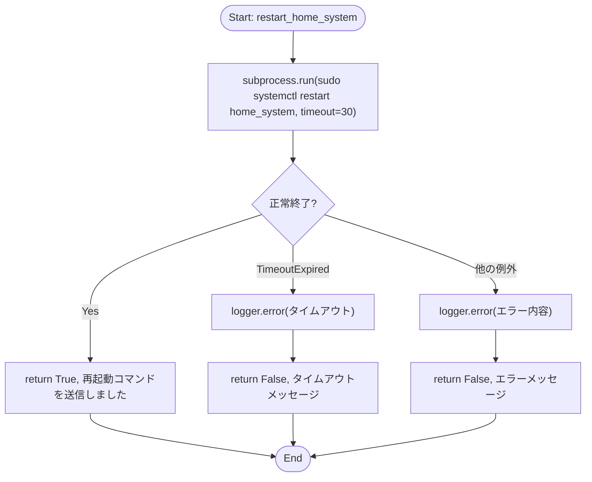
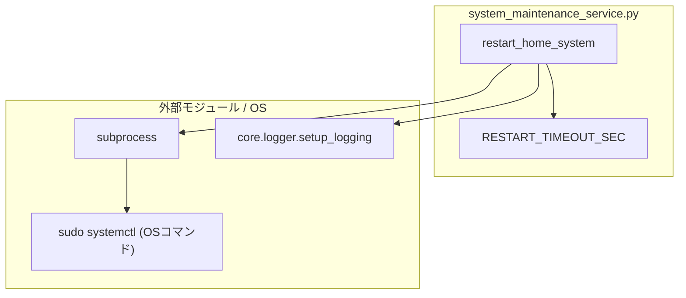

## 1. 解析メタ情報

| 項目 | 内容 |
| --- | --- |
| 対象ファイル | `system_maintenance_service.py` |
| 言語 | Python |
| 解析対象 | 提供されたコードのみ |
| 推測・補完 | 一切なし |

## 関連ドキュメント

* [core_logger.md](./core_logger.md) - `setup_logging`の実体
* [system_router.md](./system_router.md) - `restart_home_system`の呼び出し元(`POST /api/system/restart`)
* [log_tab.md](./log_tab.md) - Issue #829でStreamlit版から廃止された「メンテナンス操作」画面。本ファイルはその再起動処理を独立させたもの

## 2. ファイルの概要

システムページ(かんたん表示)の「サービス再起動」操作を担うサービスモジュール。`sudo systemctl restart home_system`をタイムアウト付きで実行する処理のみを持つ。Issue #829でStreamlit版ダッシュボード(`views/dashboard/log_tab.py`)の中に直接書かれていたロジックを、Streamlit版廃止に伴いシステムページ(`routers/dashboard_router.py`が返すHTML)のPOSTエンドポイントから呼べるサービス関数として独立させた。

## 3. 外部依存関係

### インポート一覧

| 名称 | 種類 | 用途 | 根拠 |
| --- | --- | --- | --- |
| `subprocess` | 標準 | `sudo systemctl restart`の実行 | 根拠: [インポート宣言] (行番号: 9 / 抜粋: "import subprocess") |
| `core.logger.setup_logging` | 外部 | ロガーのセットアップ | 根拠: [インポート宣言] (行番号: 11 / 抜粋: "from core.logger import setup_logging") |

### ブラックボックスとなる外部要素

| 名称 | 理由 | 根拠 |
| --- | --- | --- |
| `setup_logging`関数 | ロガーの具体的な設定(出力先、ログレベル、フォーマット)が本ファイルからは不明。 | 根拠: [関数呼び出し] (行番号: 13 / 抜粋: 'logger = setup_logging("system_maintenance")') |
| `sudo systemctl restart home_system`コマンド自体の実行結果 | 実機のsystemd設定・sudoers設定に依存し、本ファイルからは不明。 | 根拠: [外部コマンド実行] (行番号: 22〜26 / 抜粋: 'subprocess.run(\n            ["sudo", "systemctl", "restart", "home_system"],') |

## 4. 主要要素の定義（関数 / エンドポイント / コンポーネント）

### `RESTART_TIMEOUT_SEC`

* **役割**: `subprocess.run`に渡すタイムアウト秒数(30秒)を定義する定数。systemctl等の外部コマンドが応答しない場合にサーバーを固めないための上限。
* 根拠: [定数宣言] (行番号: 16 / 抜粋: "RESTART_TIMEOUT_SEC: int = 30")

* **引数/リクエスト**: 該当なし
* 根拠: 同上

* **戻り値/レスポンス**: 該当なし
* 根拠: 同上

* **副作用**: なし
* 根拠: 同上

* **エラーハンドリング**: なし
* 根拠: 同上

### `restart_home_system`

* **役割**: `home_system`(systemdサービス)を`sudo systemctl restart home_system`で再起動する。
* 根拠: [関数定義] (行番号: 19〜36 / 抜粋: "def restart_home_system() -> tuple[bool, str]:")、[外部コマンド実行] (行番号: 22〜26 / 抜粋: 'subprocess.run(\n            ["sudo", "systemctl", "restart", "home_system"],\n            check=True,\n            timeout=RESTART_TIMEOUT_SEC,\n        )')

* **引数/リクエスト**: なし
* 根拠: [関数定義] (行番号: 19 / 抜粋: "def restart_home_system() -> tuple[bool, str]:")

* **戻り値/レスポンス**: `tuple[bool, str]`(成功したかどうかのフラグと、画面に出すメッセージ)。成功時は`(True, "再起動コマンドを送信しました")`。
* 根拠: [戻り値] (行番号: 27 / 抜粋: 'return True, "再起動コマンドを送信しました"')

* **副作用**: `sudo systemctl restart home_system`の実行(外部プロセス起動)。失敗時はERRORログを出力する。
* 根拠: [外部コマンド実行] (行番号: 22〜26)、[エラーログ] (行番号: 29, 35 / 抜粋: 'logger.error(f"サービス再起動が {RESTART_TIMEOUT_SEC} 秒以内に完了しませんでした")', 'logger.error(f"サービス再起動に失敗しました: {e}")')

* **エラーハンドリング**: `subprocess.TimeoutExpired`(`RESTART_TIMEOUT_SEC`秒以内に完了しない場合)を捕捉し、ERRORログを出力したうえで`(False, "...systemctl 側の状態を確認してください。")`を返す。それ以外の`Exception`も捕捉し、ERRORログを出力したうえで`(False, f"エラー: {e}")`を返す。いずれの場合も例外は呼び出し元へ伝播しない。
* 根拠: [例外処理] (行番号: 28〜36 / 抜粋: 'except subprocess.TimeoutExpired:\n        logger.error(...)\n        return False, (\n            f"再起動コマンドが {RESTART_TIMEOUT_SEC} 秒以内に完了しませんでした。"\n            "systemctl 側の状態を確認してください。"\n        )\n    except Exception as e:\n        logger.error(f"サービス再起動に失敗しました: {e}")\n        return False, f"エラー: {e}"')

## 5. 処理フロー図

## 6. 依存関係図

## 7. 次のステップ（リバースエンジニアリングの提案）

| 優先度 | ファイル名(推測可) | 理由 | 根拠 |
| --- | --- | --- | --- |
| 高 | `routers/system_router.py` | `restart_home_system`の実際の呼び出し元(`POST /api/system/restart`エンドポイント)を確認するため。 | 呼び出し元は本ファイル外にあり不明 |
| 中 | `deploy/systemd/home_system.service` | 再起動対象の`home_system`サービスの実際の定義(ExecStart等)を確認するため。 | 根拠: [外部コマンド実行] (行番号: 23 / 抜粋: '"restart", "home_system"') |

## 8. 保守上の注意点

* `sudo systemctl restart home_system`は自分自身が動くホストのサービスを再起動するため、`unified_server`プロセス自体が数秒間停止する。呼び出し元(システムページ)は再起動後の応答が一時的に得られなくなることを踏まえたUIにすること。
* `subprocess.run`に`check=True`を渡しているため、コマンドが非ゼロ終了した場合は`subprocess.CalledProcessError`が送出され、`except Exception`側で捕捉される(専用のログメッセージやハンドリングは無く、他の例外と同じ扱いになる)。

## 9. 不明事項一覧

| 項目 | 理由 | 必要なファイル |
| --- | --- | --- |
| `sudo`の権限設定(sudoersでパスワード無しに許可されているか) | 本ファイルは`subprocess.run`を呼ぶのみで、実機のsudoers設定は本ファイルからは不明。 | 実機の`/etc/sudoers`または`/etc/sudoers.d/`配下の設定ファイル |
| `home_system`サービスの実際の定義 | systemdユニットファイルの内容は本ファイルからは不明。 | `deploy/systemd/home_system.service` |

## 10. 自己検証結果

* [x] 完了: 推測・外部ファイルの仕様を一切含んでいない
* [x] 完了: 全関数・全クラス・全コンポーネントを列挙した
* [x] 完了: 全てのインポート要素を列挙した
* [x] 完了: すべての仕様説明に「根拠（行番号・抜粋）」を明記した
* [x] 完了: 根拠漏れが0件である
* [x] 完了: Mermaid構文にエラーの原因となる記号（エスケープ漏れ）がない
* [x] 完了: 不明事項を漏れなく列挙した

完了
