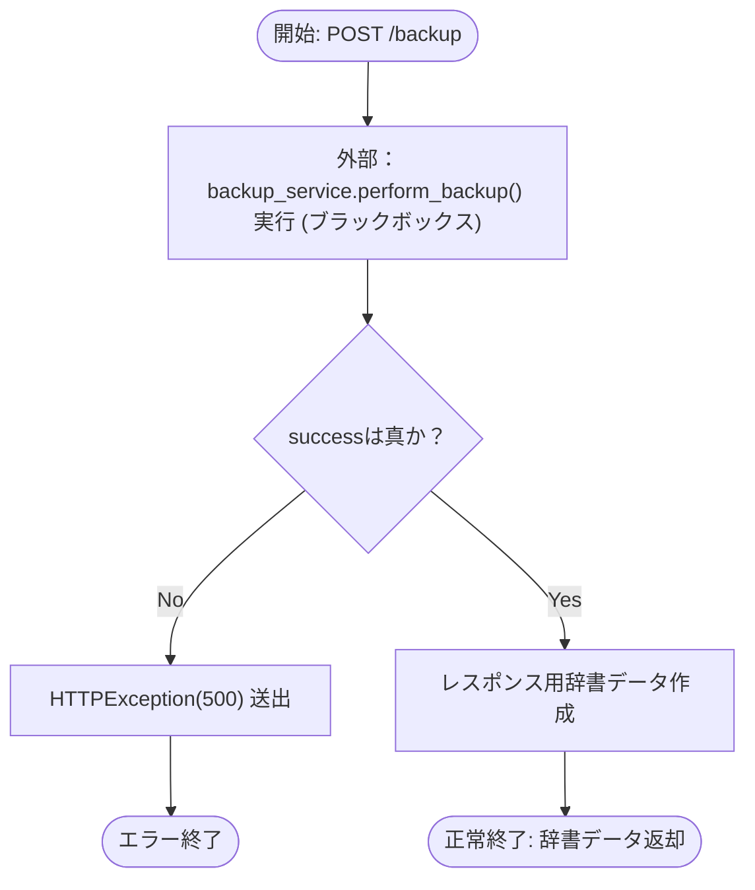
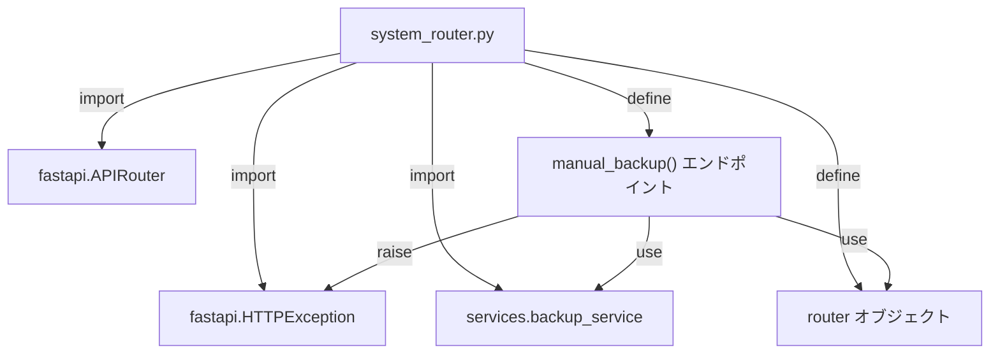

## 1. 解析メタ情報

| 項目 | 内容 |
| --- | --- |
| 対象ファイル | `system_router.py` |
| 言語 | Python (FastAPI) |
| 解析対象 | 提供されたコードのみ |
| 推測・補完 | 一切なし |

## 2. ファイルの概要

* FastAPIのルーターオブジェクトを生成し、手動バックアップをトリガーするためのPOSTエンドポイントを提供する。
* 根拠: `router = APIRouter()` (行番号: 7 / 抜粋: "router = APIRouter()") および `manual_backup` (行番号: 9-10 / 抜粋: "@router.post("/backup")")

* 実際のバックアップ処理は外部モジュールである `services.backup_service` に委譲している。
* 根拠: `backup_service.perform_backup()` (行番号: 12 / 抜粋: "success, msg, size = backup_s")

## 3. 外部依存関係

### インポート一覧

| 名称 | 種類 | 用途 | 根拠 |
| --- | --- | --- | --- |
| `APIRouter` | クラス | FastAPIのルーターインスタンス生成用 | 根拠: [APIRouter] (行番号: 2 / 抜粋: "from fastapi import APIRouter") |
| `HTTPException` | 例外クラス | 処理失敗時のHTTPエラーレスポンス生成用 | 根拠: [HTTPException] (行番号: 2 / 抜粋: "from fastapi import APIRouter") |
| `Dict` | 型ヒント | 戻り値の型定義用 | 根拠: [Dict] (行番号: 3 / 抜粋: "from typing import Dict, Any") |
| `Any` | 型ヒント | 戻り値の型定義用 | 根拠: [Any] (行番号: 3 / 抜粋: "from typing import Dict, Any") |
| `backup_service` | モジュール | バックアップ処理の実行用 | 根拠: [backup_service] (行番号: 5 / 抜粋: "from services import backup_s") |

### ブラックボックスとなる外部要素

| 名称 | 理由 | 根拠 |
| --- | --- | --- |
| `backup_service.perform_backup` | 実装内容が含まれていないため。内部でのシステムに対する副作用（DB操作、ファイル出力など）および、処理にかかる時間やエラー発生の挙動が不明。 | 根拠: [backup_service.perform_backup] (行番号: 12 / 抜粋: "success, msg, size = backup_s") |

## 4. 主要要素の定義（関数 / エンドポイント / コンポーネント）

### `router`

* **役割**: FastAPIのルーターインスタンス。
* 根拠: [router] (行番号: 7 / 抜粋: "router = APIRouter()")

### `manual_backup`

* **役割**: `/backup` パスに対するPOSTリクエストを受け取り、手動バックアップ処理をトリガーする。
* 根拠: [manual_backup] (行番号: 9-11 / 抜粋: "@router.post("/backup")")

* **引数/リクエスト**: なし
* 根拠: [manual_backup] (行番号: 10 / 抜粋: "async def manual_backup() -> ")

* **戻り値/レスポンス**: `Dict[str, Any]` 型。成功時は `status`, `message`, `size_mb` を含む辞書を返す。
* 根拠: [戻り値の型ヒントとreturn文] (行番号: 10, 15 / 抜粋: "return {"status": "success", ")

* **副作用**: 外部関数 `backup_service.perform_backup()` を呼び出す（具体的な副作用は不明（`services.backup_service`ファイルに依存のため要確認））。
* 根拠: [関数呼び出し] (行番号: 12 / 抜粋: "success, msg, size = backup_s")

* **エラーハンドリング**: `backup_service.perform_backup()` の戻り値 `success` が真でない場合、ステータスコード500の `HTTPException` を送出する。
* 根拠: [if文と例外送出] (行番号: 13-14 / 抜粋: "raise HTTPException(status_co")

---

## 5. 処理フロー図

## 6. 依存関係図

## 7. 次のステップ（リバースエンジニアリングの提案）

| 優先度 | ファイル名(推測可) | 理由 | 根拠 |
| --- | --- | --- | --- |
| 高 | `services/backup_service.py` | バックアップ処理の成否判定条件や、実際にバックアップされる対象（データベース、ファイル群など）、外部システムへの影響を特定するため。 | 根拠: [import文] (行番号: 5 / 抜粋: "from services import backup_s") |

## 8. 保守上の注意点

* `backup_service.perform_backup()` は非同期関数 (`await`) ではなく同期関数として呼び出されている。
* 根拠: [関数呼び出し] (行番号: 12 / 抜粋: "success, msg, size = backup_s")

* `backup_service.perform_backup()` 内で例外（Exception）が発生した場合、このエンドポイント内ではキャッチ処理（try-except）が行われていない。
* 根拠: [manual_backup関数全体] (行番号: 10-15 / 抜粋: "async def manual_backup() -> ")

## 9. 不明事項一覧

| 項目 | 理由 | 必要なファイル |
| --- | --- | --- |
| `backup_service.perform_backup()` の具体的な処理内容 | 実装が別ファイルに存在するため、どのようなデータをどこにバックアップしているか判断不可 | `services/backup_service.py` |
| 戻り値の `size` 変数の実際の型や単位 | レスポンスキーは `"size_mb"` だが、`perform_backup` 関数からの戻り値 `size` が数値型か文字列型か、実際にメガバイト単位で返されているかが判断不可 | `services/backup_service.py` |

## 10. 自己検証結果

* [x] 推測・外部ファイルの仕様を一切含んでいない
* [x] 全関数・全クラス・全コンポーネントを列挙した
* [x] 全てのインポート要素を列挙した
* [x] すべての仕様説明に「根拠（行番号・抜粋）」を明記した
* [x] 根拠漏れが0件である
* [x] Mermaid構文にエラーの原因となる記号（エスケープ漏れ）がない
* [x] 不明事項を漏れなく列挙した

**完了**