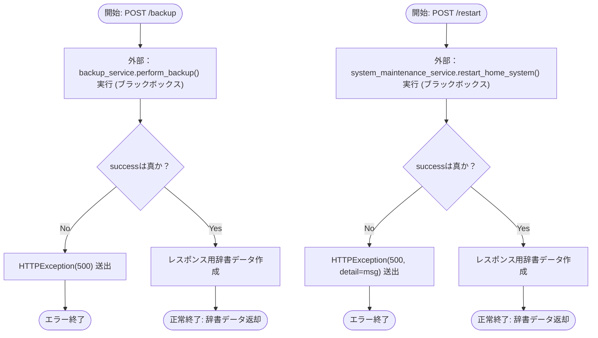
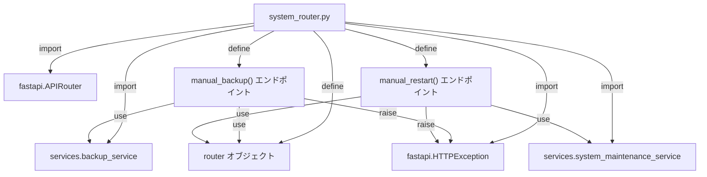

## 1. 解析メタ情報

| 項目 | 内容 |
| --- | --- |
| 対象ファイル | `system_router.py` |
| 言語 | Python (FastAPI) |
| 解析対象 | 提供されたコードのみ |
| 推測・補完 | 一切なし |

## 関連ドキュメント

- [backup_service.md](./backup_service.md) — `perform_backup`の実装元。DBバックアップとNAS転送を行い、失敗時は`Tuple[bool, str, float]`を返す
- [system_maintenance_service.md](./system_maintenance_service.md) — **（Issue #829で追加）** `restart_home_system`の実装元。`sudo systemctl restart home_system`をタイムアウト付きで実行する
- [dashboard_page_service.md](./dashboard_page_service.md) — システムページ(かんたん表示)の「サービス再起動」「今すぐバックアップ」ボタンから、それぞれ`/restart`・`/backup`をクライアントJSで`fetch`する呼び出し元
- [unified_server.md](./unified_server.md) — 呼び出し元。本ルーターを`/api/system`等のプレフィックスで`app.include_router`する

## 2. ファイルの概要

* FastAPIのルーターオブジェクトを生成し、手動バックアップと**（Issue #829で追加）** サービス再起動をそれぞれトリガーするためのPOSTエンドポイントを提供する。
* 根拠: `router = APIRouter()` (行番号: 10 / 抜粋: "router = APIRouter()") および `manual_backup` (行番号: 12〜13 / 抜粋: '@router.post("/backup")\ndef manual_backup() -> Dict[str, Any]:')、`manual_restart` (行番号: 30〜31 / 抜粋: '@router.post("/restart")\ndef manual_restart() -> Dict[str, Any]:')

* 実際のバックアップ処理は外部モジュールである `services.backup_service` に、サービス再起動処理は`services.system_maintenance_service`に委譲している。**（Issue #829）** 再起動処理は以前Streamlit版ダッシュボード(`views/dashboard/log_tab.py`)のスクリプト実行スレッド内に直書きされていたが、Streamlit版廃止に伴い通常のAPIエンドポイントとして本ルーターへ切り出された。
* 根拠: `backup_service.perform_backup()` (行番号: 21 / 抜粋: "success, msg, size = backup_s")、`system_maintenance_service.restart_home_system()` (行番号: 40 / 抜粋: "success, msg = system_maintenance_service.restart_home_system()")

## 3. 外部依存関係

### インポート一覧

| 名称 | 種類 | 用途 | 根拠 |
| --- | --- | --- | --- |
| `APIRouter` | クラス | FastAPIのルーターインスタンス生成用 | 根拠: [APIRouter] (行番号: 2 / 抜粋: "from fastapi import APIRouter") |
| `HTTPException` | 例外クラス | 処理失敗時のHTTPエラーレスポンス生成用 | 根拠: [HTTPException] (行番号: 2 / 抜粋: "from fastapi import APIRouter") |
| `Dict` | 型ヒント | 戻り値の型定義用 | 根拠: [Dict] (行番号: 3 / 抜粋: "from typing import Dict, Any") |
| `Any` | 型ヒント | 戻り値の型定義用 | 根拠: [Any] (行番号: 3 / 抜粋: "from typing import Dict, Any") |
| `backup_service` | モジュール | バックアップ処理の実行用 | 根拠: [backup_service] (行番号: 5 / 抜粋: "from services import backup_service, system_maintenance_service") |
| `system_maintenance_service` | モジュール | サービス再起動処理の実行用（Issue #829で追加） | 根拠: [system_maintenance_service] (行番号: 5 / 抜粋: "from services import backup_service, system_maintenance_service") |
| `core.logger.setup_logging` | 関数 | ロガーのセットアップ | 根拠: [setup_logging] (行番号: 6 / 抜粋: "from core.logger import setup_logging") |

### ブラックボックスとなる外部要素

| 名称 | 理由 | 根拠 |
| --- | --- | --- |
| `backup_service.perform_backup` | 実装内容が含まれていないため。内部でのシステムに対する副作用（DB操作、ファイル出力など）および、処理にかかる時間やエラー発生の挙動が不明。 | 根拠: [backup_service.perform_backup] (行番号: 21 / 抜粋: "success, msg, size = backup_s") |
| `system_maintenance_service.restart_home_system` | 実装内容が含まれていないため。`sudo systemctl restart home_system`の実行結果・タイムアウト挙動は[system_maintenance_service.md](./system_maintenance_service.md)側にある。 | 根拠: [system_maintenance_service.restart_home_system] (行番号: 40 / 抜粋: "success, msg = system_maintenance_service.restart_home_system()") |

## 4. 主要要素の定義（関数 / エンドポイント / コンポーネント）

### `router`

* **役割**: FastAPIのルーターインスタンス。
* 根拠: [router] (行番号: 10 / 抜粋: "router = APIRouter()")

### `manual_backup`

* **役割**: `/backup` パスに対するPOSTリクエストを受け取り、手動バックアップ処理をトリガーする。**（Issue #408で修正）** 以前は`async def`の中で同期的な`perform_backup()`（sqlite backup + NASへの`shutil.copy2`）を直接呼んでいたためイベントループ全体が止まり、`/webhook/switchbot`や`/callback/line`を含む全リクエストが数秒〜数十秒停止していた。現在は通常の`def`として定義し、FastAPIがスレッドプール上で実行する。
* 根拠: [manual_backup] (行番号: 12〜27 / 抜粋: '@router.post("/backup")\ndef manual_backup() -> Dict[str, Any]:')

* **引数/リクエスト**: なし
* 根拠: [manual_backup] (行番号: 13 / 抜粋: "def manual_backup() -> Dict[str, Any]:")

* **戻り値/レスポンス**: `Dict[str, Any]` 型。成功時は `status`, `message`, `size_mb` を含む辞書を返す。失敗時は`HTTPException(500)`で、`detail`は固定文言「バックアップに失敗しました。サーバーログを確認してください。」（Issue #408: 以前は`perform_backup`の生の失敗メッセージ＝NASパス等の内部情報を含みうる例外文字列をそのまま返していた。生メッセージは`logger.error`でログにのみ残す）。
* 根拠: [戻り値の型ヒントとreturn文] (行番号: 27 / 抜粋: 'return {"status": "success", "message": msg, "size_mb": size}')

* **副作用**: 外部関数 `backup_service.perform_backup()` を呼び出す（具体的な副作用は不明（`services.backup_service`ファイルに依存のため要確認））。失敗時は`logger.error`でログ出力。
* 根拠: [関数呼び出し] (行番号: 21, 25 / 抜粋: "success, msg, size = backup_service.perform_backup()")

* **エラーハンドリング**: `backup_service.perform_backup()` の戻り値 `success` が真でない場合、ステータスコード500の `HTTPException` を送出する。
* 根拠: [if文と例外送出] (行番号: 22〜26 / 抜粋: "if not success:")

### `manual_restart`

* **役割**: **（Issue #829で追加）** `/restart` パスに対するPOSTリクエストを受け取り、`system_maintenance_service.restart_home_system()`(`sudo systemctl restart home_system`をタイムアウト付きで実行)を呼ぶ。システムページ(かんたん表示)の「サービス再起動」ボタンから呼ばれる。以前はStreamlit版ダッシュボードのスクリプト実行スレッド内で直接`subprocess.run`していたが、システムページのHTMLはこのサーバー自身が返すようになったため、通常のAPIエンドポイントとして切り出された。`manual_backup`と同じ理由で`async def`にしない。
* 根拠: [manual_restart] (行番号: 30〜43 / 抜粋: '@router.post("/restart")\ndef manual_restart() -> Dict[str, Any]:')

* **引数/リクエスト**: なし
* 根拠: [manual_restart] (行番号: 31 / 抜粋: "def manual_restart() -> Dict[str, Any]:")

* **戻り値/レスポンス**: `Dict[str, Any]` 型。成功時は `status`, `message` を含む辞書を返す。失敗時は`HTTPException(500)`で、`detail`は`restart_home_system`が返したメッセージそのもの。
* 根拠: [戻り値] (行番号: 43 / 抜粋: 'return {"status": "success", "message": msg}')、[エラーハンドリング] (行番号: 41〜42 / 抜粋: "if not success:\n        raise HTTPException(status_code=500, detail=msg)")

* **副作用**: 外部関数 `system_maintenance_service.restart_home_system()` を呼び出す(`sudo systemctl restart`の実行を含む)。
* 根拠: [関数呼び出し] (行番号: 40 / 抜粋: "success, msg = system_maintenance_service.restart_home_system()")

* **エラーハンドリング**: `restart_home_system()` の戻り値 `success` が真でない場合、ステータスコード500の `HTTPException` を送出する（`detail`にはメッセージ`msg`をそのまま使う。`manual_backup`と異なり固定文言への差し替えは無い）。
* 根拠: [if文と例外送出] (行番号: 41〜42 / 抜粋: "if not success:\n        raise HTTPException(status_code=500, detail=msg)")

---

## 5. 処理フロー図

```mermaid
flowchart TD
    Start([開始: POST /backup]) --> A["外部：backup_service.perform_backup() 実行 (ブラックボックス)"]
    A --> B{"successは真か？"}
    B -- No --> C["HTTPException(500) 送出"]
    C --> Error([エラー終了])
    B -- Yes --> D["レスポンス用辞書データ作成"]
    D --> End([正常終了: 辞書データ返却])

    Start2([開始: POST /restart]) --> A2["外部：system_maintenance_service.restart_home_system() 実行 (ブラックボックス)"]
    A2 --> B2{"successは真か？"}
    B2 -- No --> C2["HTTPException(500, detail=msg) 送出"]
    C2 --> Error2([エラー終了])
    B2 -- Yes --> D2["レスポンス用辞書データ作成"]
    D2 --> End2([正常終了: 辞書データ返却])

```

## 6. 依存関係図

```mermaid
graph TD
    File_SystemRouter["system_router.py"] --> |import| APIRouter["fastapi.APIRouter"]
    File_SystemRouter --> |import| HTTPException["fastapi.HTTPException"]
    File_SystemRouter --> |import| backup_service["services.backup_service"]
    File_SystemRouter --> |import| system_maintenance_service["services.system_maintenance_service"]
    
    File_SystemRouter --> |define| router["router オブジェクト"]
    File_SystemRouter --> |define| manual_backup["manual_backup() エンドポイント"]
    File_SystemRouter --> |define| manual_restart["manual_restart() エンドポイント"]
    
    manual_backup --> |use| router
    manual_backup --> |use| backup_service
    manual_backup --> |raise| HTTPException
    manual_restart --> |use| router
    manual_restart --> |use| system_maintenance_service
    manual_restart --> |raise| HTTPException

```

## 7. 次のステップ（リバースエンジニアリングの提案）

| 優先度 | ファイル名(推測可) | 理由 | 根拠 |
| --- | --- | --- | --- |
| 高 | `services/backup_service.py` | バックアップ処理の成否判定条件や、実際にバックアップされる対象（データベース、ファイル群など）、外部システムへの影響を特定するため。 | 根拠: [import文] (行番号: 5 / 抜粋: "from services import backup_service, system_maintenance_service") |
| 高 | `services/system_maintenance_service.py` | `restart_home_system()`の成否判定条件・タイムアウト値・`sudo`権限の前提を特定するため。 | 根拠: [import文] (行番号: 5) |

## 8. 保守上の注意点

* `backup_service.perform_backup()`・`system_maintenance_service.restart_home_system()`はいずれも非同期関数 (`await`) ではなく同期関数として呼び出されている。
* 根拠: [関数呼び出し] (行番号: 21, 40 / 抜粋: "success, msg, size = backup_service.perform_backup()", "success, msg = system_maintenance_service.restart_home_system()")

* `backup_service.perform_backup()` 内で例外（Exception）が発生した場合、このエンドポイント内ではキャッチ処理（try-except）が行われていない。`system_maintenance_service.restart_home_system()`側は自身の内部で`subprocess.TimeoutExpired`・`Exception`を捕捉して`(False, msg)`を返す設計になっており、`manual_restart`側でのtry-exceptは不要になっている（[system_maintenance_service.md](./system_maintenance_service.md)参照）。
* 根拠: [manual_backup関数全体] (行番号: 13 / 抜粋: "def manual_backup() -> Dict[str, Any]:")

## 9. 不明事項一覧

| 項目 | 理由 | 必要なファイル |
| --- | --- | --- |
| `backup_service.perform_backup()` の具体的な処理内容 | 実装が別ファイルに存在するため、どのようなデータをどこにバックアップしているか判断不可 | `services/backup_service.py` |
| 戻り値の `size` 変数の実際の型や単位 | レスポンスキーは `"size_mb"` だが、`perform_backup` 関数からの戻り値 `size` が数値型か文字列型か、実際にメガバイト単位で返されているかが判断不可 | `services/backup_service.py` |

## 相互参照による補足情報

| 元の不明事項 | 判明した内容 | 参照元ドキュメント |
| --- | --- | --- |
| `backup_service.perform_backup()` の具体的な処理内容 | `backup_service.md`の解析によれば、`perform_backup`はSQLiteデータベースをローカルにバックアップした後NASへ`shutil.copy2`で転送し、NASへの転送失敗時（権限エラー・接続断等）は管理者への即時通知(`_notify_and_log_error`経由の`send_push`)を行う設計であることが判明した。 | backup_service.md |
| 戻り値の `size` 変数の実際の型や単位 | `backup_service.md`の解析によれば、`perform_backup`の戻り値は`Tuple[bool, str, float]`であり、成功時は`(True, "バックアップ完了", local_size_mb)`という形でMB単位の`float`を返すことが判明した。これは`manual_backup`が返す`size_mb`キーの値と対応する。 | backup_service.md |

## 10. 自己検証結果

* [x] 推測・外部ファイルの仕様を一切含んでいない
* [x] 全関数・全クラス・全コンポーネントを列挙した
* [x] 全てのインポート要素を列挙した
* [x] すべての仕様説明に「根拠（行番号・抜粋）」を明記した
* [x] 根拠漏れが0件である
* [x] Mermaid構文にエラーの原因となる記号（エスケープ漏れ）がない
* [x] 不明事項を漏れなく列挙した

**完了**