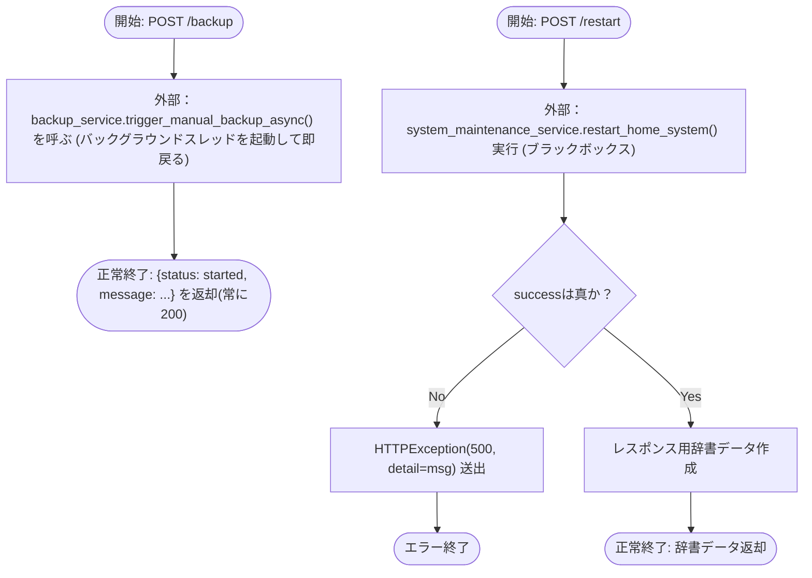
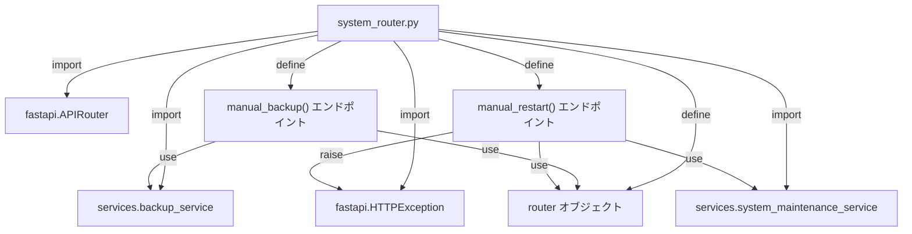

## 1. 解析メタ情報

| 項目 | 内容 |
| --- | --- |
| 対象ファイル | `system_router.py` |
| 言語 | Python (FastAPI) |
| 解析対象 | 提供されたコードのみ |
| 推測・補完 | 一切なし |

## 関連ドキュメント

- [backup_service.md](./backup_service.md) — `perform_backup`/`trigger_manual_backup_async`の実装元。DBバックアップとNAS転送を行い、失敗時は`Tuple[bool, str, float]`を返す。**(不具合修正)** `trigger_manual_backup_async`はこれをバックグラウンドスレッドで実行し、完了をDiscordへ通知する
- [system_maintenance_service.md](./system_maintenance_service.md) — **（Issue #829で追加）** `restart_home_system`の実装元。`sudo systemctl restart home_system`をタイムアウト付きで実行する
- [dashboard_page_service.md](./dashboard_page_service.md) — システムページ(かんたん表示)の「サービス再起動」「今すぐバックアップ」ボタンから、それぞれ`/restart`・`/backup`をクライアントJSで`fetch`する呼び出し元
- [unified_server.md](./unified_server.md) — 呼び出し元。本ルーターを`/api/system`等のプレフィックスで`app.include_router`する

## 2. ファイルの概要

* FastAPIのルーターオブジェクトを生成し、手動バックアップと**（Issue #829で追加）** サービス再起動をそれぞれトリガーするためのPOSTエンドポイントを提供する。
* 根拠: `router = APIRouter()` (行番号: 7 / 抜粋: "router = APIRouter()") および `manual_backup` (行番号: 12〜13 / 抜粋: '@router.post("/backup")\ndef manual_backup() -> Dict[str, Any]:')、`manual_restart` (行番号: 30〜31 / 抜粋: '@router.post("/restart")\ndef manual_restart() -> Dict[str, Any]:')

* 実際のバックアップ処理は外部モジュールである `services.backup_service` に、サービス再起動処理は`services.system_maintenance_service`に委譲している。**（Issue #829）** 再起動処理は以前Streamlit版ダッシュボード(`views/dashboard/log_tab.py`)のスクリプト実行スレッド内に直書きされていたが、Streamlit版廃止に伴い通常のAPIエンドポイントとして本ルーターへ切り出された。**(不具合修正)** バックアップは以前`backup_service.perform_backup()`の完了をこのエンドポイントのレスポンスとして待たせていたが、`trigger_manual_backup_async()`でバックグラウンド実行に切り替え、開始した旨を即座に返すようにした。
* 根拠: `backup_service.trigger_manual_backup_async()` (行番号: 24 / 抜粋: "backup_service.trigger_manual_backup_async()")、`system_maintenance_service.restart_home_system()` (行番号: 58 / 抜粋: "success, msg = system_maintenance_service.restart_home_system()")

## 3. 外部依存関係

### インポート一覧

| 名称 | 種類 | 用途 | 根拠 |
| --- | --- | --- | --- |
| `APIRouter` | クラス | FastAPIのルーターインスタンス生成用 | 根拠: [APIRouter] (行番号: 2 / 抜粋: "from fastapi import APIRouter") |
| `HTTPException` | 例外クラス | 処理失敗時のHTTPエラーレスポンス生成用 | 根拠: [HTTPException] (行番号: 2 / 抜粋: "from fastapi import APIRouter") |
| `Dict` | 型ヒント | 戻り値の型定義用 | 根拠: [Dict] (行番号: 3 / 抜粋: "from typing import Dict, Any") |
| `Any` | 型ヒント | 戻り値の型定義用 | 根拠: [Any] (行番号: 3 / 抜粋: "from typing import Dict, Any") |
| `backup_service` | モジュール | バックアップ処理の実行用 | 根拠: [backup_service] (行番号: 5 / 抜粋: "from services import backup_service, system_maintenance_service") |
| `system_maintenance_service` | モジュール | サービス再起動処理の実行用（Issue #829で追加） | 根拠: [system_maintenance_service] (行番号: 5 / 抜粋: "from services import backup_service, system_maintenance_service") |

**(不具合修正で削除)** 以前あった`core.logger.setup_logging`/`logger`は、`manual_backup`が失敗メッセージを`logger.error`でログ出力する処理ごと不要になったため削除された(失敗時の通知は`backup_service`側の`_notify_and_log_error`に一本化)。

### ブラックボックスとなる外部要素

| 名称 | 理由 | 根拠 |
| --- | --- | --- |
| `backup_service.trigger_manual_backup_async` | 実装内容が含まれていないため。バックグラウンドスレッドでの`perform_backup()`実行・完了時のDiscord通知の詳細は[backup_service.md](./backup_service.md)側にある。 | 根拠: [backup_service.trigger_manual_backup_async] (行番号: 24 / 抜粋: "backup_service.trigger_manual_backup_async()") |
| `system_maintenance_service.restart_home_system` | 実装内容が含まれていないため。`sudo systemctl restart home_system`の実行結果・タイムアウト挙動は[system_maintenance_service.md](./system_maintenance_service.md)側にある。 | 根拠: [system_maintenance_service.restart_home_system] (行番号: 58 / 抜粋: "success, msg = system_maintenance_service.restart_home_system()") |

## 4. 主要要素の定義（関数 / エンドポイント / コンポーネント）

### `router`

* **役割**: FastAPIのルーターインスタンス。
* 根拠: [router] (行番号: 7 / 抜粋: "router = APIRouter()")

### `backup_status`

* **役割**: **(UI改善で新設)** `GET /backup/status`。システムページの「今すぐバックアップ」ボタンが、実行中か(`running`)・最後に起動した実行のID(`run_id`)・直近の結果(`last_result`)・NAS上の最新バックアップ(`latest_backup`: `filename`/`created_at`/`size_mb`、無ければnull)を表示するために参照する。NASのファイル列挙を伴うため`manual_backup`と同じ理由で`async def`にしない。

### `manual_backup`

* **役割**: `/backup` パスに対するPOSTリクエストを受け取り、手動バックアップ処理をトリガーする。**（Issue #408で修正）** 以前は`async def`の中で同期的な`perform_backup()`（sqlite backup + NASへの`shutil.copy2`）を直接呼んでいたためイベントループ全体が止まり、`/webhook/switchbot`や`/callback/line`を含む全リクエストが数秒〜数十秒停止していた。現在は通常の`def`として定義し、FastAPIがスレッドプール上で実行する。**(不具合修正)** 以前は`perform_backup()`自体の完了(NAS転送・場合によってはオフサイト複製で最大30分)をこのレスポンスとして待たせており、ダッシュボードの「今すぐバックアップ」ボタンをタップしても完了したか分からない原因になっていた。`backup_service.trigger_manual_backup_async()`でバックグラウンド実行に切り替え、開始した旨を即座に返すようにした。
* 根拠: [manual_backup] (行番号: 9〜25 / 抜粋: '@router.post("/backup")\ndef manual_backup() -> Dict[str, Any]:')

* **引数/リクエスト**: なし
* 根拠: [manual_backup] (行番号: 10 / 抜粋: "def manual_backup() -> Dict[str, Any]:")

* **戻り値/レスポンス**: `Dict[str, Any]` 型。**(UI改善)** 起動したときは`status="started"`、既に実行中で二重起動しなかったときは`status="running"`を返し、どちらも`run_id`(画面が結果と突き合わせる実行ID)を含む。メッセージは固定文言(「バックアップを開始しました。完了するとDiscordに通知します。」)を返す。**(不具合修正)** 以前は成功時`status="success"`+`size_mb`、失敗時`HTTPException(500)`という同期的な成否をそのまま反映していたが、バックグラウンド実行への変更により、このエンドポイントからは成否を判定できなくなった(成否は`backup_service`側のDiscord通知で伝える)。
* 根拠: [return文] (行番号: 25 / 抜粋: 'return {"status": "started", "message": "バックアップを開始しました。完了するとDiscordに通知します。"}')

* **副作用**: 外部関数 `backup_service.trigger_manual_backup_async()` を呼び出す(内部でバックグラウンドスレッドを起動する。詳細は[backup_service.md](./backup_service.md))。
* 根拠: [関数呼び出し] (行番号: 24 / 抜粋: "backup_service.trigger_manual_backup_async()")

* **エラーハンドリング**: なし。**(不具合修正で削除)** 以前あった`success`の真偽による`HTTPException(500)`送出は、バックグラウンド実行への変更で同期的に成否を知りようがなくなったため削除された。
* 根拠: [関数本体] (行番号: 24〜25。`if`/`raise`が存在しないことを確認)

### `manual_restart`

* **役割**: **（Issue #829で追加）** `/restart` パスに対するPOSTリクエストを受け取り、`system_maintenance_service.restart_home_system()`(`sudo systemctl restart home_system`をタイムアウト付きで実行)を呼ぶ。システムページ(かんたん表示)の「サービス再起動」ボタンから呼ばれる。以前はStreamlit版ダッシュボードのスクリプト実行スレッド内で直接`subprocess.run`していたが、システムページのHTMLはこのサーバー自身が返すようになったため、通常のAPIエンドポイントとして切り出された。`manual_backup`と同じ理由で`async def`にしない。
* 根拠: [manual_restart] (行番号: 30〜43 / 抜粋: '@router.post("/restart")\ndef manual_restart() -> Dict[str, Any]:')

* **引数/リクエスト**: なし
* 根拠: [manual_restart] (行番号: 49 / 抜粋: "def manual_restart() -> Dict[str, Any]:")

* **戻り値/レスポンス**: `Dict[str, Any]` 型。成功時は `status`, `message` を含む辞書を返す。失敗時は`HTTPException(500)`で、`detail`は`restart_home_system`が返したメッセージそのもの。
* 根拠: [戻り値] (行番号: 43 / 抜粋: 'return {"status": "success", "message": msg}')、[エラーハンドリング] (行番号: 59〜60 / 抜粋: "if not success:\n        raise HTTPException(status_code=500, detail=msg)")

* **副作用**: 外部関数 `system_maintenance_service.restart_home_system()` を呼び出す(`sudo systemctl restart`の実行を含む)。
* 根拠: [関数呼び出し] (行番号: 58 / 抜粋: "success, msg = system_maintenance_service.restart_home_system()")

* **エラーハンドリング**: `restart_home_system()` の戻り値 `success` が真でない場合、ステータスコード500の `HTTPException` を送出する（`detail`にはメッセージ`msg`をそのまま使う。`manual_backup`と異なり固定文言への差し替えは無い）。
* 根拠: [if文と例外送出] (行番号: 59〜60 / 抜粋: "if not success:\n        raise HTTPException(status_code=500, detail=msg)")

---

## 5. 処理フロー図

```mermaid
flowchart TD
    Start([開始: POST /backup]) --> A["外部：backup_service.trigger_manual_backup_async() を呼ぶ (バックグラウンドスレッドを起動して即戻る)"]
    A --> End(["正常終了: {status: started, message: ...} を返却(常に200)"])

    Start2([開始: POST /restart]) --> A2["外部：system_maintenance_service.restart_home_system() 実行 (ブラックボックス)"]
    A2 --> B2{"successは真か？"}
    B2 -- No --> C2["HTTPException(500, detail=msg) 送出"]
    C2 --> Error2([エラー終了])
    B2 -- Yes --> D2["レスポンス用辞書データ作成"]
    D2 --> End2([正常終了: 辞書データ返却])

```

## 6. 依存関係図

```mermaid
graph TD
    File_SystemRouter["system_router.py"] --> |import| APIRouter["fastapi.APIRouter"]
    File_SystemRouter --> |import| HTTPException["fastapi.HTTPException"]
    File_SystemRouter --> |import| backup_service["services.backup_service"]
    File_SystemRouter --> |import| system_maintenance_service["services.system_maintenance_service"]
    
    File_SystemRouter --> |define| router["router オブジェクト"]
    File_SystemRouter --> |define| manual_backup["manual_backup() エンドポイント"]
    File_SystemRouter --> |define| manual_restart["manual_restart() エンドポイント"]
    
    manual_backup --> |use| router
    manual_backup --> |use| backup_service
    manual_restart --> |use| router
    manual_restart --> |use| system_maintenance_service
    manual_restart --> |raise| HTTPException

```

## 7. 次のステップ（リバースエンジニアリングの提案）

| 優先度 | ファイル名(推測可) | 理由 | 根拠 |
| --- | --- | --- | --- |
| 高 | `services/backup_service.py` | バックアップ処理の成否判定条件や、実際にバックアップされる対象（データベース、ファイル群など）、外部システムへの影響を特定するため。 | 根拠: [import文] (行番号: 5 / 抜粋: "from services import backup_service, system_maintenance_service") |
| 高 | `services/system_maintenance_service.py` | `restart_home_system()`の成否判定条件・タイムアウト値・`sudo`権限の前提を特定するため。 | 根拠: [import文] (行番号: 5) |

## 8. 保守上の注意点

* `backup_service.trigger_manual_backup_async()`・`system_maintenance_service.restart_home_system()`はいずれも非同期関数 (`await`) ではなく同期関数として呼び出されている(`trigger_manual_backup_async()`自体はすぐ戻るが、内部でバックグラウンドスレッドを起動する)。
* 根拠: [関数呼び出し] (行番号: 24, 58 / 抜粋: "backup_service.trigger_manual_backup_async()", "success, msg = system_maintenance_service.restart_home_system()")

* **(不具合修正)** `manual_backup`はバックグラウンド実行への変更により、このエンドポイントのレスポンスからはバックアップの成否を判定できない(常に`status="started"`)。成否は`backup_service`側(`perform_backup`内の例外処理・`trigger_manual_backup_async`の完了通知)に一本化されている([backup_service.md](./backup_service.md)参照)。`system_maintenance_service.restart_home_system()`側は自身の内部で`subprocess.TimeoutExpired`・`Exception`を捕捉して`(False, msg)`を返す設計になっており、`manual_restart`側でのtry-exceptは不要になっている（[system_maintenance_service.md](./system_maintenance_service.md)参照）。
* 根拠: [manual_backup関数全体] (行番号: 10 / 抜粋: "def manual_backup() -> Dict[str, Any]:")

## 9. 不明事項一覧

| 項目 | 理由 | 必要なファイル |
| --- | --- | --- |
| `backup_service.trigger_manual_backup_async()`内で呼ばれる`perform_backup()`の具体的な処理内容 | 実装が別ファイルに存在するため、どのようなデータをどこにバックアップしているか判断不可 | `services/backup_service.py` |

## 相互参照による補足情報

| 元の不明事項 | 判明した内容 | 参照元ドキュメント |
| --- | --- | --- |
| `backup_service.perform_backup()` の具体的な処理内容 | `backup_service.md`の解析によれば、`perform_backup`はSQLiteデータベースをローカルにバックアップした後NASへ`shutil.copy2`で転送し、NASへの転送失敗時（権限エラー・接続断等）は管理者への即時通知(`_notify_and_log_error`経由の`send_push`)を行う設計であることが判明した。**(不具合修正)** `manual_backup`はこれを`trigger_manual_backup_async()`経由でバックグラウンドスレッドとして呼ぶようになり、完了(成功時)はDiscordの`report`チャンネルへの通知で伝える。 | backup_service.md |

## 10. 自己検証結果

* [x] 推測・外部ファイルの仕様を一切含んでいない
* [x] 全関数・全クラス・全コンポーネントを列挙した
* [x] 全てのインポート要素を列挙した
* [x] すべての仕様説明に「根拠（行番号・抜粋）」を明記した
* [x] 根拠漏れが0件である
* [x] Mermaid構文にエラーの原因となる記号（エスケープ漏れ）がない
* [x] 不明事項を漏れなく列挙した

**完了**