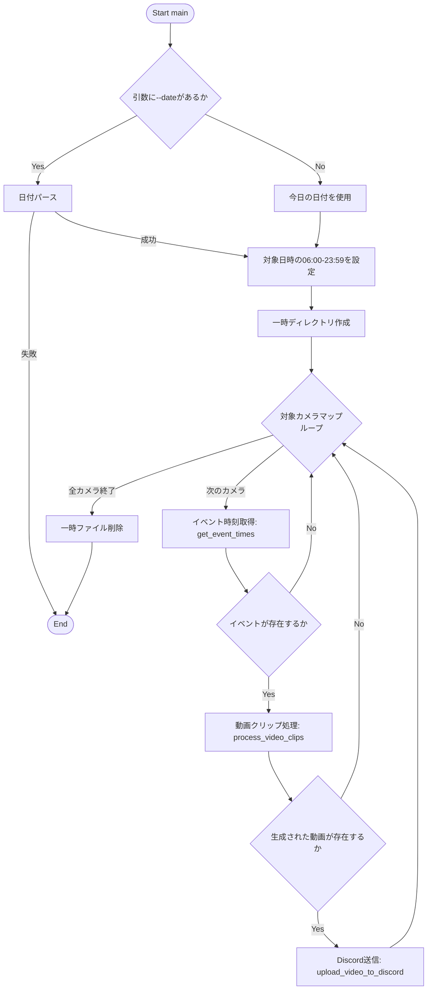
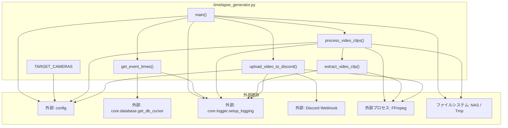

## 1. 解析メタ情報

| 項目 | 内容 |
| --- | --- |
| 対象ファイル | `timelapse_generator.py` |
| 言語 | Python |
| 解析対象 | 提供されたコードのみ |
| 推測・補完 | 一切なし |

## 2. ファイルの概要

データベースから取得したイベント検知時刻に基づき、特定の時間帯のNVR録画ファイル（動画）からクリップを抽出し、それらを結合してタイムラプス動画を生成、最終的にDiscordへアップロードする処理を担うスクリプト。

## 3. 外部依存関係

### インポート一覧

| 名称 | 種類 | 用途 | 根拠 |
| --- | --- | --- | --- |
| `os` | 標準ライブラリ | パス操作、ディレクトリ作成、ファイルサイズ取得、ファイル削除 | `import os` (行番号: 2) |
| `glob` | 標準ライブラリ | ファイル検索（パターンマッチング） | `import glob` (行番号: 3) |
| `time` | 標準ライブラリ | 待機処理（スリープ） | `import time` (行番号: 4) |
| `datetime` | 標準ライブラリ | 日時データの操作、フォーマット変換 | `import datetime` (行番号: 5) |
| `subprocess` | 標準ライブラリ | 外部コマンド（FFmpeg等）の実行 | `import subprocess` (行番号: 6) |
| `requests` | サードパーティ/標準外 | Discord WebhookへのHTTP POSTリクエスト送信 | `import requests` (行番号: 7) |
| `argparse` | 標準ライブラリ | コマンドライン引数の解析 | `import argparse` (行番号: 8) |
| `math` | 標準ライブラリ | （ファイル内に明示的な使用箇所なし） | `import math` (行番号: 9) |
| `typing.List` | 標準ライブラリ | 型アノテーション | `from typing import List` (行番号: 10) |
| `config` | 外部モジュール | 各種設定値の参照 | `import config` (行番号: 12) |
| `get_db_cursor` | 外部関数 | データベースへの接続とカーソル取得 | `from core.database import get_db_cursor` (行番号: 13) |
| `setup_logging` | 外部関数 | ロガーの初期化と取得 | `from core.logger import setup_logging` (行番号: 14) |
| `send_push` | 外部関数 | （ファイル内に明示的な使用箇所なし） | `from services.notification_service import send_push` (行番号: 15) |

### ブラックボックスとなる外部要素

| 名称 | 理由 | 根拠 |
| --- | --- | --- |
| `config` | モジュール内の具体的な変数（`CAMERAS`, `NVR_RECORD_DIR`, `TMP_VIDEO_DIR`, `DISCORD_WEBHOOK_REPORT`, `DISCORD_WEBHOOK_URL`）の構造や値が不明。 | `import config` (行番号: 12) |
| `core.database` | `get_db_cursor`の内部実装（接続先DB種別、トランザクション管理）や、`device_records`テーブルの正確なスキーマが不明。 | `from core.database import get_db_cursor` (行番号: 13) |
| `core.logger` | `setup_logging`の内部実装（ログの出力形式や出力先）が不明。 | `from core.logger import setup_logging` (行番号: 14) |

## 4. 主要要素の定義（関数 / エンドポイント / コンポーネント）

### グローバル変数: `TARGET_CAMERAS`

* **役割**: 対象とするカメラのリストを定義する。`config.CAMERAS`が存在する場合はその`name`のリストを、存在しない場合は固定のリスト(`["garden", "parking"]`)を設定する。
* 根拠: `TARGET_CAMERAS = ...` (行番号: 20 / 抜粋: "TARGET_CAMERAS = [cam["name"]...")

### 関数: `extract_video_clip`

* **役割**: FFmpegコマンドを実行して動画ファイルからクリップを抽出する。最大リトライ回数までのExponential Backoffを用いたリトライ制御、及び致命的なエラー時のフェイルソフト処理を行う。
* 根拠: `def extract_video_clip(...)` (行番号: 22〜66 / 抜粋: "subprocess.run(cmd, check=True...")

* **引数/リクエスト**:
* `cmd`: `List[str]` - 実行するFFmpegコマンドのリスト
* `input_path`: `str` - 入力動画ファイルのパス（ログ出力用）
* `output_path`: `str` - 出力先ファイルのパス（ログ出力用）
* `max_retries`: `int` - 最大リトライ回数 (デフォルト: 3)
* 根拠: `def extract_video_clip(cmd: List[str], input_path: str, output_path: str, max_retries: int = 3) -> bool:` (行番号: 22 / 抜粋: "cmd: List[str], input_path: s...")

* **戻り値/レスポンス**: `bool` - 抽出に成功した場合はTrue、スキップ（失敗）した場合はFalse
* 根拠: `return True` / `return False` (行番号: 42, 51, 65 / 抜粋: "return True")

* **副作用**: `subprocess.run`による外部プロセス（FFmpeg等）の実行
* 根拠: `subprocess.run(cmd, check=...` (行番号: 36〜41 / 抜粋: "subprocess.run( cmd, check=T...")

* **エラーハンドリング**: `subprocess.CalledProcessError` 及び `subprocess.TimeoutExpired` をキャッチし、エラー出力の内容に応じてリトライの継続または打ち切りを行う。
* 根拠: `except subprocess.CalledProcessError as e:` / `except subprocess.TimeoutExpired:` (行番号: 44, 60 / 抜粋: "except subprocess.CalledProc...")

### 関数: `get_event_times`

* **役割**: データベースから指定時間帯・指定デバイスのイベント検知時刻（`timestamp`）を取得し、`datetime`オブジェクトのリストとして返す。
* 根拠: `def get_event_times(...)` (行番号: 68〜90 / 抜粋: "SELECT timestamp FROM device...")

* **引数/リクエスト**:
* `camera_name`: `str` - 対象のカメラ名
* `start_time`: `str` - 取得開始時刻（ISOフォーマット風文字列）
* `end_time`: `str` - 取得終了時刻（ISOフォーマット風文字列）
* 根拠: `def get_event_times(camera_name: str, start_time: str, end_time: str) -> List[datetime.datetime]:` (行番号: 68 / 抜粋: "camera_name: str, start_time...")

* **戻り値/レスポンス**: `List[datetime.datetime]` - 変換された日時オブジェクトのリスト
* 根拠: `return event_times` (行番号: 90 / 抜粋: "return event_times")

* **副作用**: DBからのデータ読み取り
* 根拠: `cur.execute(query, ...)` (行番号: 79 / 抜粋: "cur.execute(query, (camera_n...")

* **エラーハンドリング**: ISOフォーマットのパース失敗時（`ValueError`）はスキップ。全体の例外（`Exception`）発生時はエラーログを出力する。
* 根拠: `except ValueError:` / `except Exception as e:` (行番号: 85, 88 / 抜粋: "except ValueError: pass")

### 関数: `process_video_clips`

* **役割**: イベント時刻のリストから対象となる動画ファイルを検索・選択し、`extract_video_clip`を用いてタイムラプス用のクリップ（.ts）を抽出。その後、リストファイルを作成してFFmpegのconcatにより結合した単一の動画ファイル（.mp4）を生成する。
* 根拠: `def process_video_clips(...)` (行番号: 92〜177 / 抜粋: "concat_cmd = [ "nice", "-n",...")

* **引数/リクエスト**:
* `camera_name`: `str` - カメラ名
* `nas_folder`: `str` - NASのフォルダ名
* `event_times`: `List[datetime.datetime]` - イベント日時のリスト
* `tmp_dir`: `str` - 一時ファイルの出力先ディレクトリ
* 根拠: `def process_video_clips(camera_name: str, nas_folder: str, event_times: List[datetime.datetime], tmp_dir: str) -> str:` (行番号: 92 / 抜粋: "camera_name: str, nas_folder...")

* **戻り値/レスポンス**: `str` - 生成された出力動画ファイルのパス（クリップがない場合は空文字列 `""`）
* 根拠: `return output_video` / `return ""` (行番号: 177, 163 / 抜粋: "return output_video")

* **副作用**:
* ファイルシステム検索（`glob.glob`）
* スリープ処理（`time.sleep(0.5)`）
* リストファイルの書き込み（`with open(...)`）
* FFmpegプロセスの実行（`extract_video_clip`呼び出し、及び結合コマンドの`subprocess.run`）
* 根拠: `glob.glob(pattern)` / `f.write(f"file '{clip}'\n")` / `subprocess.run(concat_cmd...` (行番号: 111, 168, 175 / 抜粋: "subprocess.run(concat_cmd, s...")

* **エラーハンドリング**: `strptime`によるファイル名のパース失敗時（`ValueError`）はスキップ。
* 根拠: `except ValueError:` (行番号: 128 / 抜粋: "except ValueError: continue")

### 関数: `upload_video_to_discord`

* **役割**: 生成した動画ファイルをDiscordへアップロードする。ファイルサイズが閾値（8MB）を超える場合はFFmpegを用いて動画を分割（30秒間隔）し、順次アップロードする。
* 根拠: `def upload_video_to_discord(...)` (行番号: 179〜225 / 抜粋: "res = requests.post(webhook_...")

* **引数/リクエスト**:
* `file_path`: `str` - アップロードする動画ファイルのパス
* `message`: `str` - Discordに送信するテキストメッセージ
* 根拠: `def upload_video_to_discord(file_path: str, message: str) -> None:` (行番号: 179 / 抜粋: "file_path: str, message: str...")

* **戻り値/レスポンス**: `None`
* 根拠: `-> None:` (行番号: 179 / 抜粋: "-> None:")

* **副作用**:
* 外部APIへのHTTPリクエスト（`requests.post`）
* ファイルサイズ取得・読み込み
* FFmpegを用いた分割動画ファイルの生成
* 根拠: `requests.post(webhook_url...` / `subprocess.run(split_cmd...` (行番号: 194, 210 / 抜粋: "res = requests.post(webhook_...")

* **エラーハンドリング**: HTTPステータスコードが200または204でない場合のエラーログ出力。リクエスト時の例外（`Exception`）をキャッチしてエラーログ出力。
* 根拠: `if res.status_code not in [200, 204]:` / `except Exception as e:` (行番号: 197, 201, 221 / 抜粋: "except Exception as e:")

### 関数: `main`

* **役割**: スクリプトのエントリポイント。コマンドライン引数の解析、対象日時・期間の決定、一時ディレクトリの作成を行い、定義されたカメラごとに一連の処理（イベント取得、動画生成、アップロード）を順に実行する。最後に一時ファイルを削除する。
* 根拠: `def main():` (行番号: 227〜279 / 抜粋: "parser.parse_args()")

* **引数/リクエスト**: なし（コマンドライン引数 `sys.argv` に依存）
* **戻り値/レスポンス**: なし
* **副作用**:
* コマンドライン引数の読み取り
* ディレクトリの作成（`os.makedirs`）
* コンソールへのログ出力
* 一時ファイルの削除（`os.remove`）
* 各関数呼び出しによる全体処理の実行
* 根拠: `os.makedirs(config.TMP_VI...` / `os.remove(f)` (行番号: 243, 279 / 抜粋: "os.remove(f)")

* **エラーハンドリング**: `--date` 引数の形式が不正な場合（`ValueError`）、エラーログを出力して終了する。
* 根拠: `except ValueError:` (行番号: 234 / 抜粋: "except ValueError: logger.er...")

## 5. 処理フロー図

## 6. 依存関係図

## 7. 次のステップ（リバースエンジニアリングの提案）

| 優先度 | ファイル名(推測可) | 理由 | 根拠 |
| --- | --- | --- | --- |
| 高 | `config.py` (または相当ファイル) | 設定値の構造や定義の全容（`CAMERAS`, 各種ディレクトリパス、Webhook URL）を把握するため。 | `import config` (行番号: 12) |
| 高 | `core/database.py` | `get_db_cursor`のコネクション管理の詳細および、DBの種類・スキーマを確認するため。 | `from core.database import get_db_cursor` (行番号: 13) |
| 中 | `core/logger.py` | ログの出力レベル、出力先、ローテーションの有無などを確認するため。 | `from core.logger import setup_logging` (行番号: 14) |

## 8. 保守上の注意点

* `math` モジュールおよび `send_push` 関数がインポートされているが、スクリプト内で使用されていない。
* `config.CAMERAS` の真偽値判定が行われているが、`config`内に`CAMERAS`属性が存在しない場合は `AttributeError` となる可能性がある。
* `process_video_clips` や `upload_video_to_discord` で `subprocess.run` を実行する際、`shell=False`（リスト形式の引数）であるためコマンドインジェクションの脆弱性は低いが、例外処理が設定されていない箇所がある（`stdout=subprocess.DEVNULL, stderr=subprocess.DEVNULL` で実行されている箇所の失敗が検知されない）。
* `upload_video_to_discord` で `getattr(config, 'DISCORD_WEBHOOK_REPORT', getattr(config, 'DISCORD_WEBHOOK_URL', None))` としているため、2つめの `getattr` でも属性が存在しない場合は `None` となる。
* `main` 内でのクリーンアップ処理（`os.remove(f)`）でエラー（使用中など）が発生した場合に例外がキャッチされずプロセスが終了する。

## 9. 不明事項一覧

| 項目 | 理由 | 必要なファイル |
| --- | --- | --- |
| `config`の具体的な設定内容 | 外部モジュールで定義されており、本ファイルからはパスやURLの実態が読み取れないため。 | `config.py`等の設定モジュール |
| データベースのスキーマ・仕様 | `device_records`テーブルの実在カラムや、`get_db_cursor`のDBエンジン（SQLite/PostgreSQL等）が読み取れないため。 | `core/database.py` および スキーマ定義 |
| ロガーの仕様 | `setup_logging`の出力仕様（ファイル出力の有無、フォーマット等）が不明なため。 | `core/logger.py` |

## 10. 自己検証結果

* [x] 推測・外部ファイルの仕様を一切含んでいない
* [x] 全関数・全クラス・全コンポーネントを列挙した
* [x] 全てのインポート要素を列挙した
* [x] すべての仕様説明に「根拠（行番号・抜粋）」を明記した
* [x] 根拠漏れが0件である
* [x] Mermaid構文にエラーの原因となる記号（エスケープ漏れ）がない
* [x] 不明事項を漏れなく列挙した

完了