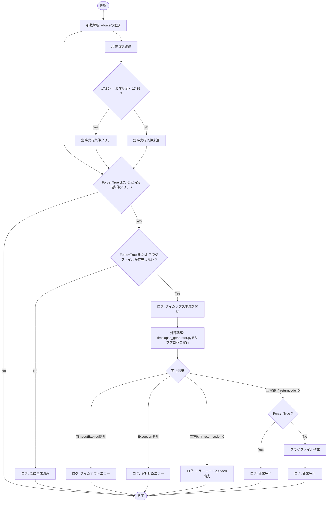
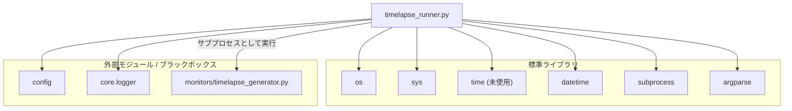

## 1. 解析メタ情報

| 項目 | 内容 |
| --- | --- |
| 対象ファイル | `timelapse_runner.py` |
| 言語 | Python |
| 解析対象 | 提供されたコードのみ |
| 推測・補完 | 一切なし |

## 2. ファイルの概要

タイムラプス生成スクリプト（`timelapse_generator.py`）を、定時（17:30〜17:34）または手動による強制実行（`--force`）の条件に基づいてサブプロセスとして起動・管理するランナースクリプト。重複実行を防ぐためのフラグファイル制御と、処理遅延に対するタイムアウト処理を担っている。

## 3. 外部依存関係

### インポート一覧

| 名称 | 種類 | 用途 | 根拠 |
| --- | --- | --- | --- |
| `os` | 標準ライブラリ | プロジェクトルートの解決、ファイル存在確認、パス結合 | `import os` (行番号: 2 / 抜粋: "import os") |
| `sys` | 標準ライブラリ | モジュール検索パスの追加、Python実行環境のパス取得 | `import sys` (行番号: 3 / 抜粋: "import sys") |
| `time` | 標準ライブラリ | 未使用（インポートのみ） | `import time` (行番号: 4 / 抜粋: "import time") |
| `datetime` | 標準ライブラリ | 現在時刻の取得、日付に基づく文字列生成 | `import datetime` (行番号: 5 / 抜粋: "import datetime") |
| `subprocess` | 標準ライブラリ | 外部スクリプトのサブプロセスとしての実行 | `import subprocess` (行番号: 6 / 抜粋: "import subprocess") |
| `argparse` | 標準ライブラリ | コマンドライン引数(`--force`)の解析 | `import argparse` (行番号: 7 / 抜粋: "import argparse") |
| `config` | 外部モジュール | ログディレクトリ(`LOG_DIR`)のパス取得 | `import config` (行番号: 12 / 抜粋: "import config") |
| `setup_logging` | 外部関数(`core.logger`) | ロガーインスタンスの初期化と取得 | `from core.logger import setup_...` (行番号: 13 / 抜粋: "from core.logger import setup_...") |

### ブラックボックスとなる外部要素

| 名称 | 理由 | 根拠 |
| --- | --- | --- |
| `config` | 設定値（`LOG_DIR`の具体的なパスなど）の実装がファイル内に存在しないため。 | `import config` (行番号: 12 / 抜粋: "import config") |
| `setup_logging` | ロガーの具体的な設定（出力先、フォーマット、レベルなど）が不明なため。 | `from core.logger import setup_...` (行番号: 13 / 抜粋: "from core.logger import setup_...") |
| `timelapse_generator.py` | サブプロセスとして実行されるが、タイムラプス生成の具体的な処理内容が不明なため。 | `script_path = os.path.join(...` (行番号: 34 / 抜粋: "... "timelapse_generator.py")") |

## 4. 主要要素の定義（関数 / エンドポイント / コンポーネント）

### `main`

* **役割**: コマンドライン引数を解釈し、現在時刻と完了フラグの存在判定を行う。定時かつ未実行、または強制実行フラグがある場合に、`timelapse_generator.py`をサブプロセスで実行する。正常終了時には定時実行時のみ完了フラグファイルを作成する。
* 根拠: `def main():` (行番号: 17 / 抜粋: "def main():")

* **引数/リクエスト**: なし（実行時にコマンドライン引数 `--force` を解析）
* 根拠: `parser.add_argument("--force"...` (行番号: 20 / 抜粋: "parser.add_argument("--force"...")

* **戻り値/レスポンス**: なし
* 根拠: `def main():` (行番号: 17 / 抜粋: "def main():") ※関数内にreturn文なし

* **副作用**:
* 外部スクリプト（`timelapse_generator.py`）の実行
* 根拠: `result = subprocess.run(` (行番号: 38 / 抜粋: "result = subprocess.run(")

* 完了フラグファイル（`[LOG_DIR]/timelapse_YYYYMMDD.done`）のファイルシステムへの書き込み（強制実行でない正常終了時のみ）
* 根拠: `with open(flag_file, "w") as f:` (行番号: 49 / 抜粋: "with open(flag_file, "w") as f:")

* **エラーハンドリング**:
* `subprocess.TimeoutExpired`: タイムアウト（1800秒超過）例外をキャッチし、エラーログを出力。
* 根拠: `except subprocess.TimeoutExpir...` (行番号: 57 / 抜粋: "except subprocess.TimeoutExpir...")

* `Exception`: その他の予期せぬエラーをキャッチし、スタックトレース付きエラーログを出力。
* 根拠: `except Exception as e:` (行番号: 59 / 抜粋: "except Exception as e:")

* サブプロセス実行の非ゼロ終了コード(`returncode != 0`): エラーと判定し、標準エラー出力の内容とともにエラーログを出力。
* 根拠: `if result.returncode == 0:` の `else:` 句 (行番号: 52 / 抜粋: "else:")

## 5. 処理フロー図

## 6. 依存関係図

## 7. 次のステップ（リバースエンジニアリングの提案）

| 優先度 | ファイル名(推測可) | 理由 | 根拠 |
| --- | --- | --- | --- |
| 高 | `monitors/timelapse_generator.py` | このファイルがキックしている主要なバッチ処理の実体であり、タイムラプスの生成方法や必要な入力データの仕様を特定するため。 | `script_path = os.path.join(...` (行番号: 34 / 抜粋: "... "timelapse_generator.py")") |
| 中 | `config.py` | フラグファイルの保存先である`LOG_DIR`の具体的なパスなど、システム環境に依存する設定値を特定するため。 | `flag_file = os.path.join(con...` (行番号: 27 / 抜粋: "flag_file = os.path.join(con...") |
| 低 | `core/logger.py` | 出力されているログがどこに（標準出力、ファイル等）、どのような形式・保持期間で保存されているかを確認するため。 | `from core.logger import setup_...` (行番号: 13 / 抜粋: "from core.logger import setup_...") |

## 8. 保守上の注意点

* タイムアウトの設定値とエラーログのメッセージに不一致がある。`subprocess.run`の引数では`timeout=1800`（30分）と設定されているが、`TimeoutExpired`発生時のログメッセージでは「タイムアウト（10分）しました」とハードコードされている。
* 根拠: `timeout=1800` (行番号: 43 / 抜粋: "timeout=1800") および `logger.error("⏰ タイムラプス生成がタイム...` (行番号: 58 / 抜粋: "logger.error("⏰ タイムラプス生成がタイム...")

* 標準ライブラリの`time`モジュールがインポートされているが、スクリプト内で一度も使用されていない（未使用コード）。
* 根拠: `import time` (行番号: 4 / 抜粋: "import time")

* モジュールのインポートを解決するため、`sys.path`にプロジェクトルートを動的に追加してシステム環境のパスを操作している。
* 根拠: `sys.path.append(PROJECT_ROOT)` (行番号: 10 / 抜粋: "sys.path.append(PROJECT_ROOT)")

## 9. 不明事項一覧

| 項目 | 理由 | 必要なファイル |
| --- | --- | --- |
| `LOG_DIR`の具体的なパス | `config`モジュール内の変数を参照しているが、定義が提供されていないため。 | `config.py` |
| タイムラプス生成の具体的な処理 | `timelapse_generator.py`がサブプロセスとして実行される事実しか分からず、ロジック自体が提供されていないため。 | `monitors/timelapse_generator.py` |
| ロガーの設定内容 | `setup_logging`関数の内部実装が提供されていないため。 | `core/logger.py` |

## 10. 自己検証結果

* [x] 完了: 推測・外部ファイルの仕様を一切含んでいない
* [x] 完了: 全関数・全クラス・全コンポーネントを列挙した
* [x] 完了: 全てのインポート要素を列挙した
* [x] 完了: すべての仕様説明に「根拠（行番号・抜粋）」を明記した
* [x] 完了: 根拠漏れが0件である
* [x] 完了: Mermaid構文にエラーの原因となる記号（エスケープ漏れ）がない
* [x] 完了: 不明事項を漏れなく列挙した