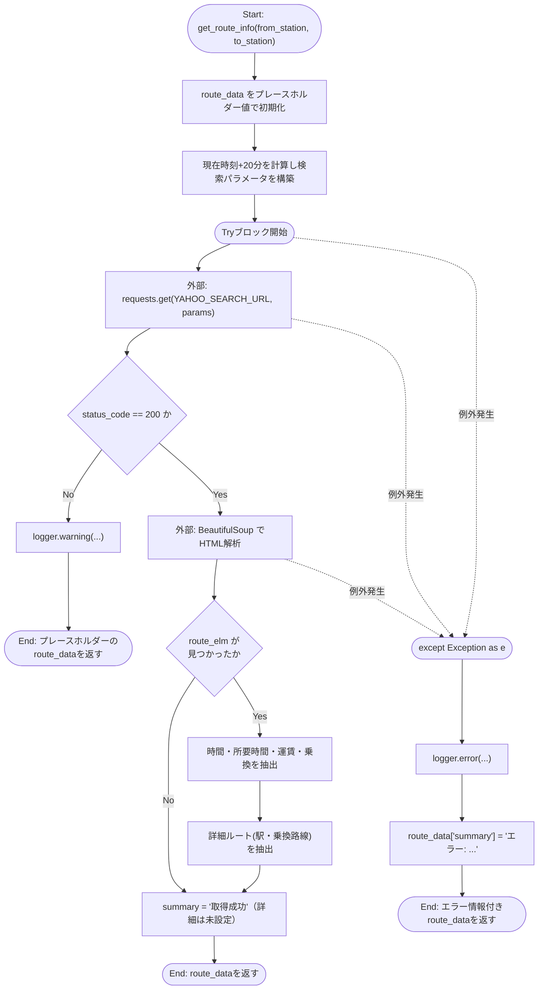
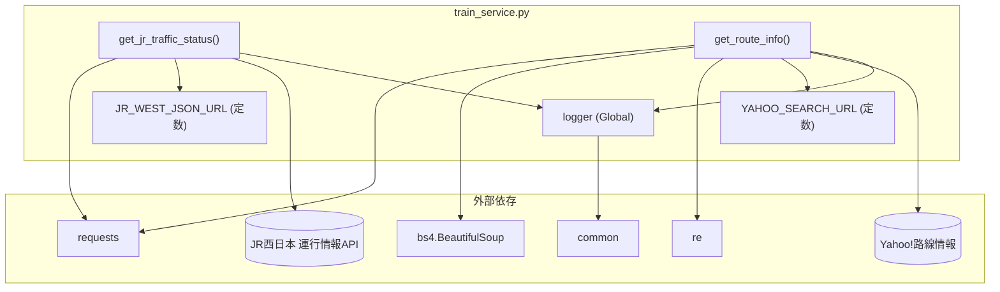

## 1. 解析メタ情報

| 項目 | 内容 |
| --- | --- |
| 対象ファイル | `train_service.py` |
| 言語 | Python |
| 解析対象 | 提供されたコードのみ |
| 推測・補完 | 一切なし |

## 関連ドキュメント

- [common.md](./common.md) — `setup_logging`を再エクスポートするFacadeモジュール
- [logger.md](./logger.md) — `common.setup_logging`の実体(`core.logger.setup_logging`)
- [dashboard.md](./dashboard.md) — 呼び出し元候補。Streamlitダッシュボードの`views/dashboard/misc_tab.py`(`render_traffic`)が本ファイルの機能を利用すると推測される

## 2. ファイルの概要

* JR西日本の運行情報API（JSON）から、宝塚線・神戸線の運行状況を取得する機能を提供する。
* Yahoo!路線情報のHTMLページをスクレイピングし、指定された駅間（デフォルトは伊丹(兵庫県)→長岡京）の最短経路（出発・到着時刻、所要時間、運賃、乗換回数、詳細経路）を取得する機能を提供する。
* いずれの機能も通信・解析エラー発生時は例外を送出せず、デフォルト値やエラーメッセージを含んだ辞書を返すことでシステム全体の停止を防ぐフェイルソフト設計になっている。

## 3. 外部依存関係

### インポート一覧

| 名称 | 種類 | 用途 | 根拠 |
| --- | --- | --- | --- |
| `requests` | 外部ライブラリ | JR西日本APIおよびYahoo!路線情報へのHTTP GETリクエスト送信 | `import requests` (行番号: 2 / 抜粋: "import requests") |
| `bs4.BeautifulSoup` | 外部ライブラリ | Yahoo!路線情報のHTMLレスポンスの解析（スクレイピング） | `from bs4 import BeautifulSoup` (行番号: 3 / 抜粋: "from bs4 import BeautifulSoup") |
| `traceback` | 標準ライブラリ | インポートのみで本ファイル内では未使用 | `import traceback` (行番号: 4 / 抜粋: "import traceback") |
| `re` | 標準ライブラリ | 時刻文字列（`HH:MM`形式）の正規表現抽出 | `import re` (行番号: 5 / 抜粋: "import re") |
| `logging` | 標準ライブラリ | インポートのみで、ロガー生成には `common.setup_logging` が使われている（直接の `logging.*` API呼び出しは本ファイル内に無い） | `import logging` (行番号: 6 / 抜粋: "import logging") |
| `datetime`, `timedelta` | 標準ライブラリ | 検索対象時刻（現在時刻+20分）の計算 | `from datetime import datetime, timedelta` (行番号: 7 / 抜粋: "from datetime import datetime, timedelta") |
| `typing` (`Dict`, `Any`, `List`, `Optional`) | 標準ライブラリ | 関数の型ヒント | `from typing import Dict, Any, List, Optional` (行番号: 8 / 抜粋: "from typing import Dict, Any, List, Optional") |
| `common` | 内部モジュール | ロガーの生成（`setup_logging`） | `import common` (行番号: 11 / 抜粋: "import common") |

### ブラックボックスとなる外部要素

| 名称 | 理由 | 根拠 |
| --- | --- | --- |
| `common.setup_logging` | 生成されるロガーの出力先・フォーマット・ログレベルの詳細が不明。 | `logger = common.setup_logging("train_service")` (行番号: 14 / 抜粋: "logger = common.setup_logging("train_service")") |
| JR西日本 運行情報API (`JR_WEST_JSON_URL`) | レスポンスJSONの完全な構造（`lines`キー以下の全路線ID一覧や、`status`/`text`以外のフィールドの有無）が本ファイルからは不明。 | `resp = requests.get(JR_WEST_JSON_URL, timeout=5)` (行番号: 35 / 抜粋: "resp = requests.get(JR_WEST_JSON_URL, timeout=5)") |
| Yahoo!路線情報 (`YAHOO_SEARCH_URL`) | 検索結果HTMLのDOM構造（CSSセレクタが対象とする要素の完全な仕様）や、将来的なサイト構造変更への耐性が不明。 | `resp = requests.get(YAHOO_SEARCH_URL, params=params, timeout=5)` (行番号: 100 / 抜粋: "resp = requests.get(YAHOO_SEARCH_URL, params=params, timeout=5)") |

## 4. 主要要素の定義（関数 / エンドポイント / コンポーネント）

### `logger` (モジュールレベル変数)

* **役割**: `common.setup_logging` を用いて `"train_service"` 名のロガーインスタンスを生成する。
* 根拠: `logger = common.setup_logging("train_service")` (行番号: 14 / 抜粋: "logger = common.setup_logging("train_service")")

* **引数/リクエスト**: なし
* 根拠: (行番号: 14 / 抜粋: "logger = common.setup_logging("train_service")")

* **戻り値/レスポンス**: なし（グローバル変数への代入）
* 根拠: (行番号: 14 / 抜粋: "logger = common.setup_logging("train_service")")

* **副作用**: モジュール変数 `logger` の生成。
* 根拠: (行番号: 14 / 抜粋: "logger = common.setup_logging("train_service")")

* **エラーハンドリング**: なし
* 根拠: (行番号: 14 / 抜粋: "logger = common.setup_logging("train_service")")

### `JR_WEST_JSON_URL` / `YAHOO_SEARCH_URL` (モジュールレベル定数)

* **役割**: JR西日本運行情報APIのエンドポイントURLと、Yahoo!路線情報検索結果ページのベースURLを定義する。
* 根拠: `JR_WEST_JSON_URL: str = "https://www.train-guide.westjr.co.jp/api/v3/area_kinki_trafficinfo.json"` (行番号: 17 / 抜粋: "JR_WEST_JSON_URL: str = "https://www.train-guide.westjr.co.jp/api/v3/area_kinki_trafficinfo.json""), `YAHOO_SEARCH_URL: str = "https://transit.yahoo.co.jp/search/result"` (行番号: 20 / 抜粋: "YAHOO_SEARCH_URL: str = "https://transit.yahoo.co.jp/search/result"")

* **引数/リクエスト**: なし
* 根拠: (行番号: 17, 20 / 抜粋: "YAHOO_SEARCH_URL: str = ")

* **戻り値/レスポンス**: なし（文字列定数）
* 根拠: (行番号: 17, 20 / 抜粋: "JR_WEST_JSON_URL: str = ")

* **副作用**: なし
* 根拠: (行番号: 17, 20 / 抜粋: "JR_WEST_JSON_URL: str = ")

* **エラーハンドリング**: なし
* 根拠: (行番号: 17, 20 / 抜粋: "YAHOO_SEARCH_URL: str = ")

### `get_jr_traffic_status`

* **役割**: JR西日本の運行情報APIから宝塚線（`G`）・神戸線（`A`）の運行状況を取得し、遅延・運休の有無を含む辞書を返す。APIが平常運転の路線を返さない場合はデフォルトの「平常運転」を維持する。
* 根拠: `def get_jr_traffic_status() -> Dict[str, Dict[str, Any]]:` (行番号: 22〜60 / 抜粋: "def get_jr_traffic_status() -> Dict[str, Dict[str, Any]]:\n    """\n    JR西日本の運行状況を取得する")

* **引数/リクエスト**: なし
* 根拠: (行番号: 22 / 抜粋: "def get_jr_traffic_status() -> Dict[str, Dict[str, Any]]:")

* **戻り値/レスポンス**: `Dict[str, Dict[str, Any]]`。キーは `"宝塚線"`, `"神戸線"`。各値は `status`（絵文字付き状態文字列）, `detail`（詳細説明）, `is_delay`（bool）, `is_suspended`（bool）を持つ。
* 根拠: `results: Dict[str, Dict[str, Any]] = {\n        "宝塚線": {"status": "🟢 平常運転", "detail": "遅れはありません", "is_delay": False, "is_suspended": False},` (行番号: 29〜31 / 抜粋: "results: Dict[str, Dict[str, Any]] = {"), `return results` (行番号: 60 / 抜粋: "return results")

* **副作用**: JR西日本APIへのHTTP GETリクエスト送信、失敗時のエラーログ出力（`logger.error`）。
* 根拠: `resp = requests.get(JR_WEST_JSON_URL, timeout=5)` (行番号: 35 / 抜粋: "resp = requests.get(JR_WEST_JSON_URL, timeout=5)")

* **エラーハンドリング**: 任意の `Exception` を捕捉し、エラーログを出力した上で、初期化済みのデフォルト値（両路線とも平常運転）をそのまま返す（フェイルソフト）。
* 根拠: `except Exception as e:\n        logger.error(f"JR Traffic API Error: {e}")\n        # エラー時はデフォルト(平常運転)を返すことでシステムを止めない` (行番号: 56〜58 / 抜粋: "except Exception as e:")

### `get_route_info`

* **役割**: Yahoo!路線情報から、指定区間の最短経路（現在時刻+20分を出発時刻として検索）をスクレイピングし、出発・到着時刻、所要時間、運賃、乗換回数、詳細経路のリストを含む辞書を返す。
* 根拠: `def get_route_info(from_station: str = "伊丹(兵庫県)", to_station: str = "長岡京") -> Dict[str, Any]:` (行番号: 62〜158 / 抜粋: "def get_route_info(from_station: str = "伊丹(兵庫県)", to_station: str = "長岡京") -> Dict[str, Any]:")

* **引数/リクエスト**: `from_station: str`（デフォルト `"伊丹(兵庫県)"`）, `to_station: str`（デフォルト `"長岡京"`）
* 根拠: (行番号: 62 / 抜粋: "def get_route_info(from_station: str = "伊丹(兵庫県)", to_station: str = "長岡京") -> Dict[str, Any]:")

* **戻り値/レスポンス**: `Dict[str, Any]`。`label`, `departure`, `arrival`, `duration`, `transfer`, `cost`, `details`（`list[str]`）, `url`, `summary`（`"取得成功"` / `"取得失敗"` / `"エラー: ..."`）を持つ。取得失敗時は初期化時のプレースホルダー値（`"--:--"` 等）のまま返る。
* 根拠: `route_data: Dict[str, Any] = {\n        "label": f"{from_station} → {to_station}",\n        "departure": "--:--",` (行番号: 70〜72 / 抜粋: "route_data: Dict[str, Any] = {"), `return route_data` (行番号: 158 / 抜粋: "return route_data")

* **副作用**: Yahoo!路線情報へのHTTP GETリクエスト送信、レスポンスHTMLのBeautifulSoupによる解析、ステータス異常時の警告ログ出力、例外発生時のエラーログ出力。
* 根拠: `resp = requests.get(YAHOO_SEARCH_URL, params=params, timeout=5)` (行番号: 100 / 抜粋: "resp = requests.get(YAHOO_SEARCH_URL, params=params, timeout=5)"), `soup = BeautifulSoup(resp.text, 'html.parser')` (行番号: 107 / 抜粋: "soup = BeautifulSoup(resp.text, 'html.parser')")

* **エラーハンドリング**: HTTPステータスコードが200以外の場合、警告ログを出力しプレースホルダー値のままの `route_data` を返す。処理全体を `try...except Exception as e:` で囲み、例外発生時はエラーログを出力し `route_data["summary"]` にエラー内容を設定した上で `route_data` を返す（例外を外部に送出しない）。
* 根拠: `if resp.status_code != 200:\n            logger.warning(f"Yahoo Route Search failed with status: {resp.status_code}")\n            return route_data` (行番号: 103〜105 / 抜粋: "if resp.status_code != 200:"), `except Exception as e:\n        logger.error(f"Route scrape error: {e}")\n        route_data["summary"] = f"エラー: {str(e)}"` (行番号: 154〜156 / 抜粋: "except Exception as e:")

### モジュールレベル実行部（`if __name__ == "__main__":`）

* **役割**: スクリプトを直接実行した場合に、`get_jr_traffic_status()` と `get_route_info()` をそれぞれ呼び出し結果を標準出力へ表示する簡易テスト実行部。
* 根拠: `if __name__ == "__main__":\n    # テスト実行用の設定` (行番号: 160〜167 / 抜粋: "if __name__ == "__main__":\n    # テスト実行用の設定\n    # common.setup_logging済みなのでコンソールにも出るはずだが念のため")

* **引数/リクエスト**: なし
* 根拠: (行番号: 160〜167 / 抜粋: "print("--- JR Status ---")")

* **戻り値/レスポンス**: なし
* 根拠: (行番号: 160〜167 / 抜粋: "print(get_jr_traffic_status())")

* **副作用**: `get_jr_traffic_status()` と `get_route_info()` の呼び出し（それぞれAPI通信・スクレイピングを含む）、結果の標準出力への表示。
* 根拠: `print(get_jr_traffic_status())` (行番号: 164 / 抜粋: "print(get_jr_traffic_status())"), `print(get_route_info())` (行番号: 167 / 抜粋: "print(get_route_info())")

* **エラーハンドリング**: なし（呼び出す各関数が内部でフェイルソフトに例外を処理する設計のため）
* 根拠: (行番号: 160〜167 / 抜粋: "print("\n--- Route Info ---")")

## 5. 処理フロー図

`get_route_info` における、Yahoo!路線情報のスクレイピングとフォールバックの流れを示します。

## 6. 依存関係図

## 7. 次のステップ（リバースエンジニアリングの提案）

| 優先度 | ファイル名(推測可) | 理由 | 根拠 |
| --- | --- | --- | --- |
| 高 | `common.py` | `setup_logging` の実装（ログ出力先やフォーマット）を確認するため。 | `logger = common.setup_logging("train_service")` (行番号: 14 / 抜粋: "logger = common.setup_logging("train_service")") |
| 中 | `views/dashboard/misc_tab.py` | `dashboard.py` の解析より、電車遅延タブ（`misc_tab.render_traffic()`）が本ファイルの機能を利用している可能性が高く、`get_jr_traffic_status`/`get_route_info` の戻り値がどう画面表示されるかを確認するため。 | `def get_jr_traffic_status() -> Dict[str, Dict[str, Any]]:` (行番号: 22 / 抜粋: "def get_jr_traffic_status() -> Dict[str, Dict[str, Any]]:")（`train_service.py` 自体からの直接参照ではなく、周辺ファイル調査から得た推測） |

## 8. 保守上の注意点

* **未使用インポート**: `traceback`（4行目）と `logging`（6行目）がインポートされているが、本ファイル内で `traceback.*` や `logging.*` の呼び出しは一切なく（ロガーは `common.setup_logging` 経由で取得）、未使用のインポートとなっている。
* **HTMLスクレイピングへの依存**: `get_route_info` はYahoo!路線情報のHTML構造（CSSセレクタ `#rsltlst li.el`, `.routeSummary`, `.time`, `.fare`, `.transfer`, `.routeDetail` 等）に強く依存しており、対象サイトのマークアップ変更によって静かに（例外を出さずに）情報が取得できなくなるリスクがある（`route_elm` が見つからない場合、108〜110行目のロジックにより `summary` は "取得成功" のまま詳細情報だけが空になる）。
* **広範な例外キャッチによるフェイルソフト設計**: 両関数とも `except Exception as e:` で全例外を捕捉し、デフォルト値やエラーメッセージ入りの辞書を返す設計になっている。呼び出し側から見ると成功と「部分的な失敗（デフォルト値のまま）」の区別が難しい場合がある（特に `get_jr_traffic_status` は例外時にも初期化済みの「平常運転」データをそのまま返すため、実際にAPIが失敗しているのか本当に平常運転なのかが `results` の中身だけでは判別できない）。
* **固定のタイムアウト値**: 両関数とも `timeout=5` 秒がハードコードされており（35, 100行目）、設定ファイル等で外部から調整する仕組みがない。

## 9. 不明事項一覧

| 項目 | 理由 | 必要なファイル |
| --- | --- | --- |
| `common.setup_logging` の仕様 | ロガーの出力先・フォーマット・ログレベルが不明。 | `common.py` |
| JR西日本APIのレスポンス完全仕様 | `lines` オブジェクト内に `G`, `A` 以外にどのような路線IDが存在するか、`status`/`text` 以外のフィールドの有無が不明。 | JR西日本APIの公式仕様書（本リポジトリ外） |
| Yahoo!路線情報の現在のHTML構造 | コード中のCSSセレクタが現在のサイト構造と一致しているかは、本ファイルの解析のみでは検証できない。 | 対象サイトの実際のHTML（本リポジトリ外） |
| 呼び出し元の利用方法 | `get_jr_traffic_status` と `get_route_info` がどの画面・どの頻度で呼び出されるかが不明。 | `views/dashboard/misc_tab.py` 等の呼び出し元 |

## 相互参照による補足情報

| 元の不明事項 | 判明した内容 | 参照元ドキュメント |
| --- | --- | --- |
| `common.setup_logging` の仕様 | `logger.md`の解析によれば、`setup_logging`はコンソール出力・日次ローテーションのファイル出力(`home_system.log`固定)・ERRORレベル以上のDiscord Webhook通知(`DiscordErrorHandler`)の3種のハンドラを登録する設計であることが判明した。 | logger.md |
| 呼び出し元の利用方法 | `dashboard.md`の解析によれば、`dashboard.py`は`views.dashboard.misc_tab`モジュールの`render_traffic()`関数を電車遅延タブとして呼び出しており、この関数が本ファイルの`get_jr_traffic_status`/`get_route_info`を利用する可能性が高いと推測される。ただし`misc_tab.py`自体は未解析のため確定情報ではない。 | dashboard.md |

## 10. 自己検証結果

* [x] 推測・外部ファイルの仕様を一切含んでいない
* [x] 全関数・全クラス・全コンポーネントを列挙した
* [x] 全てのインポート要素を列挙した
* [x] すべての仕様説明に「根拠（行番号・抜粋）」を明記した
* [x] 根拠漏れが0件である
* [x] Mermaid構文にエラーの原因となる記号（エスケープ漏れ）がない
* [x] 不明事項を漏れなく列挙した

完了
