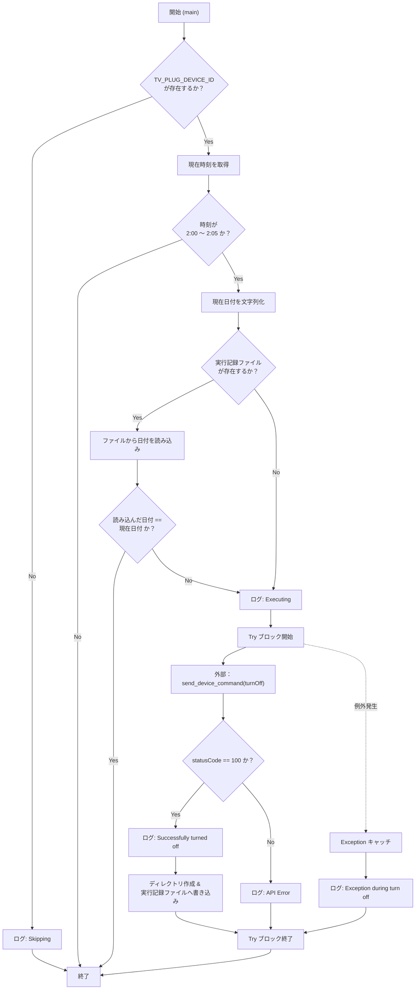
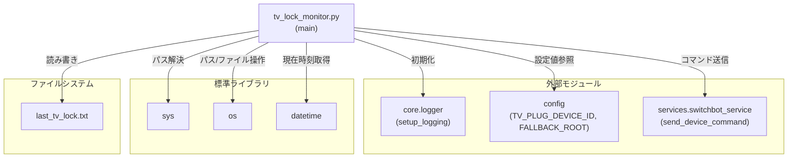

## 1. 解析メタ情報

| 項目 | 内容 |
| --- | --- |
| 対象ファイル | `tv_lock_monitor.py` |
| 言語 | Python |
| 解析対象 | 提供されたコードのみ |
| 推測・補完 | 一切なし |

## 2. ファイルの概要

* 深夜の特定時間帯（2:00〜2:05）にTVプラグデバイスの電源をオフにする制御を行うスクリプトです。
* 1日1回の重複実行を防止するための記録・判定機能を有しています。

## 3. 外部依存関係

### インポート一覧

| 名称 | 種類 | 用途 | 根拠 |
| --- | --- | --- | --- |
| `sys` | 標準ライブラリ | プロジェクトルートのパス解決 | 根拠: `sys.path.append` (行番号: 2, 8-9 / 抜粋: "sys.path.append(PROJECT_ROOT)") |
| `os` | 標準ライブラリ | パス操作、ファイル存在確認、ディレクトリ作成 | 根拠: `os.path.dirname`, `os.path.exists` など (行番号: 3, 7, 18, 32, 45 / 抜粋: "import os") |
| `datetime` | 標準ライブラリ | 現在時刻の取得と日付のフォーマット | 根拠: `datetime.now()` (行番号: 4, 25 / 抜粋: "from datetime import datetime") |
| `config` | 外部モジュール | デバイスIDやルートディレクトリの取得 | 根拠: `config.TV_PLUG_DEVICE_ID` 等 (行番号: 11, 18, 21 / 抜粋: "import config") |
| `core.logger` | 外部モジュール | ロガーの初期化処理 | 根拠: `setup_logging` (行番号: 12, 15 / 抜粋: "from core.logger import setup_logging") |
| `services.switchbot_service` | 外部モジュール | 外部デバイス（SwitchBot）へのコマンド送信 | 根拠: `send_device_command` (行番号: 13, 40 / 抜粋: "from services import switchbot_service") |

### ブラックボックスとなる外部要素

| 名称 | 理由 | 根拠 |
| --- | --- | --- |
| `config` | 設定値（`TV_PLUG_DEVICE_ID`, `FALLBACK_ROOT`）の実態や設定元が現在のファイルからは判断不可 | 根拠: `config` (行番号: 11, 18, 21 / 抜粋: "import config") |
| `setup_logging` | ログの出力先、フォーマットなどの具体的な処理内容が不明 | 根拠: `setup_logging` (行番号: 12, 15 / 抜粋: "logger = setup_logging...") |
| `send_device_command` | 内部の通信処理、エラー仕様、および戻り値の正確なスキーマが不明 | 根拠: `send_device_command` (行番号: 13, 40 / 抜粋: "switchbot_service.send_device_command") |

## 4. 主要要素の定義（関数 / エンドポイント / コンポーネント）

### `main`

* **役割**: 設定値からデバイスIDを確認し、現在時刻が2:00〜2:05の範囲内かつ当日未実行の場合に、外部サービスを通じてTVプラグをオフにする。成功時は実行記録をファイルに保存する。
* 根拠: `main` (行番号: 20-51 / 抜粋: "def main():")

* **引数/リクエスト**: なし
* 根拠: `main` (行番号: 20 / 抜粋: "def main():")

* **戻り値/レスポンス**: なし
* 根拠: `main` (行番号: 20-51 / 抜粋: "return")

* **副作用**:
* 外部APIまたはデバイスに対するオフコマンド（"turnOff"）送信
* 根拠: `send_device_command`呼び出し (行番号: 40 / 抜粋: "switchbot_service.send_device_command")

* ローカルファイルシステム上のディレクトリ作成、およびファイル（`last_tv_lock.txt`）への日付文字列書き込み
* 根拠: `os.makedirs`, `open` (行番号: 45-47 / 抜粋: "with open(LAST_RUN_FILE, "w") as f:")

* **エラーハンドリング**:
* コマンド送信時やファイル書き込み時に発生する汎用例外（`Exception`）をキャッチし、エラーログを出力する。
* 根拠: `try-except`ブロック (行番号: 39-51 / 抜粋: "except Exception as e:")

## 5. 処理フロー図

## 6. 依存関係図

## 7. 次のステップ（リバースエンジニアリングの提案）

| 優先度 | ファイル名(推測可) | 理由 | 根拠 |
| --- | --- | --- | --- |
| 高 | `config.py` | 使用されている定数（`TV_PLUG_DEVICE_ID`, `FALLBACK_ROOT`）の値や設定の仕組みを把握するため | 根拠: `config.FALLBACK_ROOT`等 (行番号: 11, 18, 21) |
| 高 | `services/switchbot_service.py` | `send_device_command`関数が行っている実際の通信手段（HTTP, SDK等）や、返却されるレスポンスデータの構造を明確にするため | 根拠: `send_device_command` (行番号: 40) |
| 中 | `core/logger.py` | システム全体のログ管理方針や、`setup_logging`がどこにログを出力するのかを確認するため | 根拠: `setup_logging` (行番号: 15) |

## 8. 保守上の注意点

* `LAST_RUN_FILE`の書き込み時の例外は`try-except`内で処理されるが、読み込み時（行番号: 32-34）のファイル操作には明示的な例外処理（`PermissionError`等の捕捉）が存在しないため、ファイル権限などに問題がある場合はスクリプトがクラッシュする可能性がある。
* `config.TV_PLUG_DEVICE_ID`が未設定（`None`や空文字）の場合、例外は発生せずログを出力して正常に処理がスキップされる。
* `switchbot_service.send_device_command`の戻り値`res`が`None`である場合や辞書型でない場合を考慮し、`res and res.get("statusCode") == 100`としてNull安全なチェックが行われている。

## 9. 不明事項一覧

| 項目 | 理由 | 必要なファイル |
| --- | --- | --- |
| `TV_PLUG_DEVICE_ID` および `FALLBACK_ROOT` の具体的な値 | 外部モジュールの定数に依存しているため | `config.py` |
| `send_device_command`の完全なレスポンス構造とエラー発生条件 | 外部モジュールの実装に依存しているため | `services/switchbot_service.py` |
| このスクリプトがどのように定期実行されるか（Cron等の呼び出し元） | コード上に実行スケジューラーの記述が存在しないため | インフラ設定ファイル（cron等）、または呼び出し元のPythonスクリプト |

## 10. 自己検証結果

* [x] 完了: 推測・外部ファイルの仕様を一切含んでいない
* [x] 完了: 全関数・全クラス・全コンポーネントを列挙した
* [x] 完了: 全てのインポート要素を列挙した
* [x] 完了: すべての仕様説明に「根拠（行番号・抜粋）」を明記した
* [x] 完了: 根拠漏れが0件である
* [x] 完了: Mermaid構文にエラーの原因となる記号（エスケープ漏れ）がない
* [x] 完了: 不明事項を漏れなく列挙した