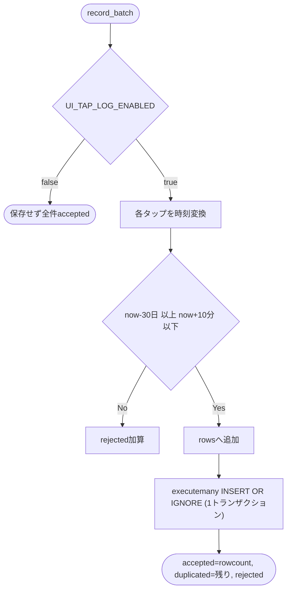
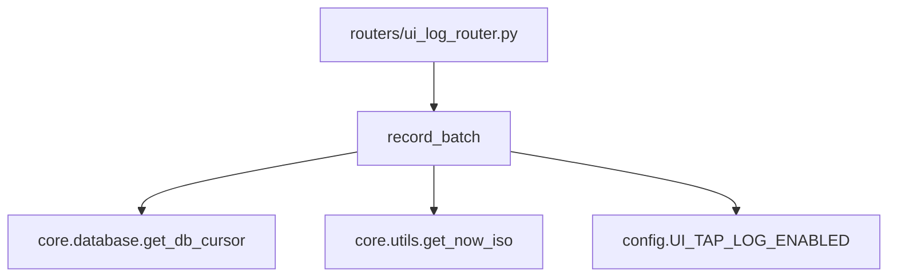

## 1. 解析メタ情報

| 項目 | 内容 |
| --- | --- |
| 対象ファイル | `services/ui_event_service.py` |
| 言語 | Python |
| 解析対象 | 提供されたコードのみ |
| 推測・補完 | 一切なし |

## 関連ドキュメント

* [ui_log_router.md](./ui_log_router.md) - 本サービスの`record_batch`を呼ぶルーター
* [ui_log.md](./ui_log.md) - 引数`UiTapBatch`の定義元
* [db_retention_service.md](./db_retention_service.md) - 保存先`ui_tap_events`を保持期間削除の対象に登録している

## 2. ファイルの概要

画面タップログを`ui_tap_events`へ追記するサービス。クライアントのバッチを1トランザクションの`executemany`で`INSERT OR IGNORE`し、新規・重複・範囲外の件数を返す。docstringによれば`quest_users`には触れないため残高ロックとは無関係である。
根拠: [ファイル冒頭docstring] (行番号: 2-8)、[クラス定義] (行番号: 34 / 抜粋: "class UiEventService:")

## 3. 外部依存関係

### インポート一覧

| 名称 | 種類 | 用途 | 根拠 |
| --- | --- | --- | --- |
| `datetime` | 標準 | 時刻変換・許容範囲 | 根拠: [インポート宣言] (行番号: 8 / 抜粋: "import datetime") |
| `config` | ローカルモジュール | `UI_TAP_LOG_ENABLED`の参照 | 根拠: [インポート宣言] (行番号: 10 / 抜粋: "import config") |
| `core.database.get_db_cursor` | ローカルモジュール | 書き込みトランザクション | 根拠: [インポート宣言] (行番号: 11 / 抜粋: "from core.database import get_db_cursor") |
| `core.logger.setup_logging` | ローカルモジュール | ロガー生成 | 根拠: [インポート宣言] (行番号: 12 / 抜粋: "from core.logger import setup_logging") |
| `core.utils.get_now_iso` | ローカルモジュール | 受信時刻の生成 | 根拠: [インポート宣言] (行番号: 13 / 抜粋: "from core.utils import get_now_iso") |
| `models.ui_log.UiTapBatch` | ローカルモジュール | 引数の型 | 根拠: [インポート宣言] (行番号: 14 / 抜粋: "from models.ui_log import UiTapBatch") |

### ブラックボックスとなる外部要素

| 名称 | 理由 | 根拠 |
| --- | --- | --- |
| `ui_tap_events`テーブルの定義 | `migrations/0022_add_ui_tap_events.sql`側(仕様書対象外)。本ファイルはINSERT文のみ | [SQL定義] (行番号: 26-31) |

## 4. 主要要素の定義（関数 / エンドポイント / コンポーネント）

### 定数

* **役割**: `MAX_EVENT_AGE`(30日。これより古いタップは端末の時計の異常とみなして保存しない)、`MAX_FUTURE_SKEW`(10分。これより未来は保存しない)、`JST`。
* 根拠: [定数定義] (行番号: 22 / 抜粋: "MAX_EVENT_AGE = datetime.timedelta(days=30)")、(行番号: 24 / 抜粋: "MAX_FUTURE_SKEW = datetime.timedelta(minutes=10)")
* **引数/リクエスト**: 該当なし
* **戻り値/レスポンス**: 該当なし
* **副作用**: なし
* **エラーハンドリング**: なし

### `UiEventService.record_batch`

* **役割**: バッチを保存し`{accepted, duplicated, rejected}`を返す。`UI_TAP_LOG_ENABLED`がfalseなら何も保存せず全件をacceptedとして返す(クライアントに失敗と誤認させ再送を繰り返させないため)。有効なら各タップの`occurred_at_ms`をJSTのISO文字列へ変換し(`10**18`のように変換できない桁外れの値は`OverflowError`/`OSError`/`ValueError`を捕捉して当該イベントだけをrejectedにする。放置すると500になり、クライアントが5xxを再試行扱いにして同じキューを永久に再送するため)、`now-30日 ≦ 時刻 ≦ now+10分`の範囲外はrejectedとして除外、残りを1トランザクションの`executemany`で`INSERT OR IGNORE`する。`accepted`は`cur.rowcount`(実際に挿入された行数)、`duplicated`は`len(rows)-inserted`。
* 根拠: [メソッド定義] (行番号: 35 / 抜粋: "def record_batch(self, batch: UiTapBatch, now: datetime.datetime | None = None) -> dict[str, int]:")、[無効時] (行番号: 41-42)、[範囲判定] (行番号: 51-55)、[保存] (行番号: 62-68)、[戻り値] (行番号: 72)
* **引数/リクエスト**: `batch: UiTapBatch`, `now: datetime.datetime | None`(テスト用の注入。省略時は現在のJST)
* 根拠: [メソッド定義] (行番号: 35)
* **戻り値/レスポンス**: `dict[str, int]`(`accepted` / `duplicated` / `rejected`)
* 根拠: [戻り値] (行番号: 72)
* **副作用**: `ui_tap_events`への追記(`get_db_cursor(commit=True)`)。範囲外があれば警告ログを出す。
* 根拠: [保存] (行番号: 64-65)、[警告ログ] (行番号: 70-71)
* **エラーハンドリング**: 時刻変換の`OverflowError`/`OSError`/`ValueError`のみ捕捉してrejected扱いにする。DB例外はそのまま伝播する。
* 根拠: [時刻変換の例外捕捉] (行番号: 53-60 / 抜粋: "except (OverflowError, OSError, ValueError):")

### `ui_event_service`

* **役割**: モジュールレベルのシングルトン(CLAUDE.mdのDI方針どおり)。
* 根拠: [変数宣言] (行番号: 83 / 抜粋: "ui_event_service = UiEventService()")
* **引数/リクエスト**: 該当なし
* **戻り値/レスポンス**: 該当なし
* **副作用**: なし
* **エラーハンドリング**: なし

## 5. 処理フロー図

## 6. 依存関係図

## 7. 次のステップ（リバースエンジニアリングの提案）

| 優先度 | ファイル名(推測可) | 理由 | 根拠 |
| --- | --- | --- | --- |
| 中 | `migrations/0022_add_ui_tap_events.sql` | 保存先テーブルの列定義を把握するため。 | [SQL定義] (行番号: 26-31) |

## 8. 保守上の注意点

* `executemany`の`rowcount`に依存して`accepted`を数えている。INSERT OR IGNOREで無視された重複は含まれない。
* 追記専用でUPDATEは行わない。保持期間削除は`db_retention_service`の`RETENTION_TARGETS`(`DB_ROW_RETENTION_EVENT_DAYS`)が担う。

## 9. 不明事項一覧

| 項目 | 理由 | 必要なファイル |
| --- | --- | --- |
| テーブル列の制約詳細 | マイグレーションSQLは仕様書の対象外 | `migrations/0022_add_ui_tap_events.sql` |

## 10. 自己検証結果

* [x] 完了: 推測・外部ファイルの仕様を一切含んでいない
* [x] 完了: 全関数・全クラス・全コンポーネントを列挙した
* [x] 完了: 全てのインポート要素を列挙した
* [x] 完了: すべての仕様説明に「根拠（行番号・抜粋）」を明記した
* [x] 完了: 根拠漏れが0件である
* [x] 完了: Mermaid構文にエラーの原因となる記号（エスケープ漏れ）がない
* [x] 完了: 不明事項を漏れなく列挙した
