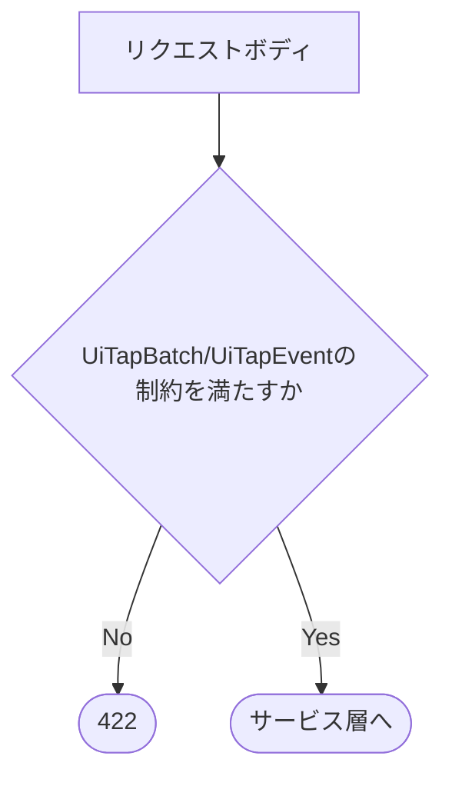
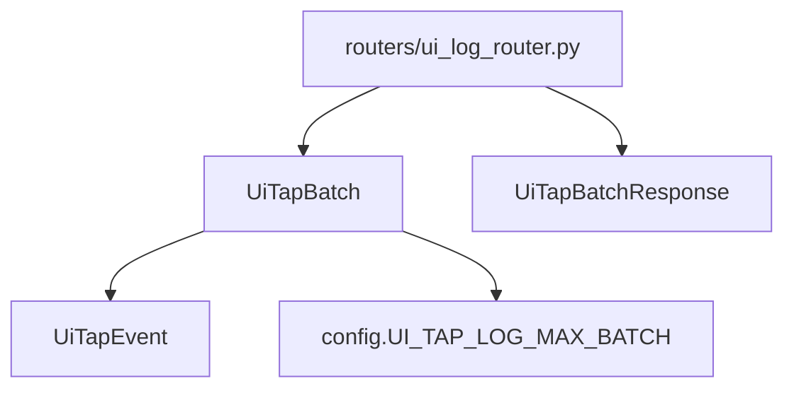

## 1. 解析メタ情報

| 項目 | 内容 |
| --- | --- |
| 対象ファイル | `models/ui_log.py` |
| 言語 | Python / Pydantic |
| 解析対象 | 提供されたコードのみ |
| 推測・補完 | 一切なし |

## 関連ドキュメント

* [ui_log_router.md](./ui_log_router.md) - 本ファイルのモデルをリクエスト/レスポンス型として使うルーター
* [ui_event_service.md](./ui_event_service.md) - `UiTapBatch`を受け取って保存するサービス
* [config.md](./config.md) - `config.UI_TAP_LOG_MAX_BATCH`の定義元

## 2. ファイルの概要

画面タップログ(`POST /api/ui-log/events`)のリクエスト/レスポンスを定義するPydanticモデル群。1タップ分の`UiTapEvent`、バッチ全体の`UiTapBatch`、結果の件数を返す`UiTapBatchResponse`の3クラスを持つ。各文字列フィールドの長さ上限は、docstringによればLAN内クライアントの不具合や悪用でDBが肥大化しないための歯止めである。
根拠: [クラス定義] (行番号: 11, 27, 37)

## 3. 外部依存関係

### インポート一覧

| 名称 | 種類 | 用途 | 根拠 |
| --- | --- | --- | --- |
| `config` | ローカルモジュール | `UI_TAP_LOG_MAX_BATCH`を`events`の上限に使う | 根拠: [インポート宣言] (行番号: 3 / 抜粋: "import config") |
| `pydantic.BaseModel` / `Field` | 外部パッケージ | モデル定義と長さ・範囲制約 | 根拠: [インポート宣言] (行番号: 4 / 抜粋: "from pydantic import BaseModel, Field") |

### ブラックボックスとなる外部要素

| 名称 | 理由 | 根拠 |
| --- | --- | --- |
| `config.UI_TAP_LOG_MAX_BATCH`の値 | 定義は[config.md](./config.md)側。本ファイルは参照のみ | [フィールド定義] (行番号: 29 / 抜粋: "max_length=config.UI_TAP_LOG_MAX_BATCH") |

## 4. 主要要素の定義（関数 / エンドポイント / コンポーネント）

### `UiTapEvent`

* **役割**: 1タップ分。`event_id`(8〜64文字)、`occurred_at_ms`(0以上の整数。クライアントの`Date.now()`)、`user_id`(任意・最大64)、`screen`(1〜32文字)、`element_id`(任意・最大64)、`element_tag`(任意・最大16)、`is_interactive`(bool)、`x_pct`/`y_pct`(任意・0〜100)、`layout_mode`(任意・最大16)。
* 根拠: [クラス定義] (行番号: 11 / 抜粋: "class UiTapEvent(BaseModel):")、[フィールド定義] (行番号: 14, 17-20, 24)
* **引数/リクエスト**: 上記フィールド
* **戻り値/レスポンス**: 該当なし(モデル)
* **副作用**: なし
* **エラーハンドリング**: 制約違反はPydanticの検証エラー(FastAPI経由で422)

### `UiTapBatch`

* **役割**: バッチ全体。`session_id`(8〜64文字)と`events`(1件以上`config.UI_TAP_LOG_MAX_BATCH`件以下の`UiTapEvent`)。
* 根拠: [クラス定義] (行番号: 27 / 抜粋: "class UiTapBatch(BaseModel):")、[フィールド定義] (行番号: 28-29)
* **引数/リクエスト**: `session_id`, `events`
* **戻り値/レスポンス**: 該当なし(モデル)
* **副作用**: なし
* **エラーハンドリング**: 空配列・上限超過・`session_id`不正は検証エラー(422)

### `UiTapBatchResponse`

* **役割**: レスポンス。`accepted`(新規保存件数)、`duplicated`(`event_id`が保存済みだった件数)、`rejected`(時刻が範囲外などで保存しなかった件数)。
* 根拠: [クラス定義] (行番号: 37 / 抜粋: "class UiTapBatchResponse(BaseModel):")
* **引数/リクエスト**: 該当なし
* **戻り値/レスポンス**: 3つの`int`
* **副作用**: なし
* **エラーハンドリング**: なし

## 5. 処理フロー図

## 6. 依存関係図

## 7. 次のステップ（リバースエンジニアリングの提案）

| 優先度 | ファイル名(推測可) | 理由 | 根拠 |
| --- | --- | --- | --- |
| 中 | `services/ui_event_service.py` | モデルを受け取る側の保存処理を把握するため。 | [関連ドキュメント] |

## 8. 保守上の注意点

* フロントエンド`src/lib/tapLogger.ts`は同じ上限(user_id 64 / screen 32 / element_tag 16 / layout_mode 16 / バッチ100件)で送信前に丸めている。1件でも超えると422でバッチ全体が破棄されるため、上限を変えるときは両方を揃えること。

## 9. 不明事項一覧

| 項目 | 理由 | 必要なファイル |
| --- | --- | --- |
| なし | - | - |

## 10. 自己検証結果

* [x] 完了: 推測・外部ファイルの仕様を一切含んでいない
* [x] 完了: 全関数・全クラス・全コンポーネントを列挙した
* [x] 完了: 全てのインポート要素を列挙した
* [x] 完了: すべての仕様説明に「根拠（行番号・抜粋）」を明記した
* [x] 完了: 根拠漏れが0件である
* [x] 完了: Mermaid構文にエラーの原因となる記号（エスケープ漏れ）がない
* [x] 完了: 不明事項を漏れなく列挙した
