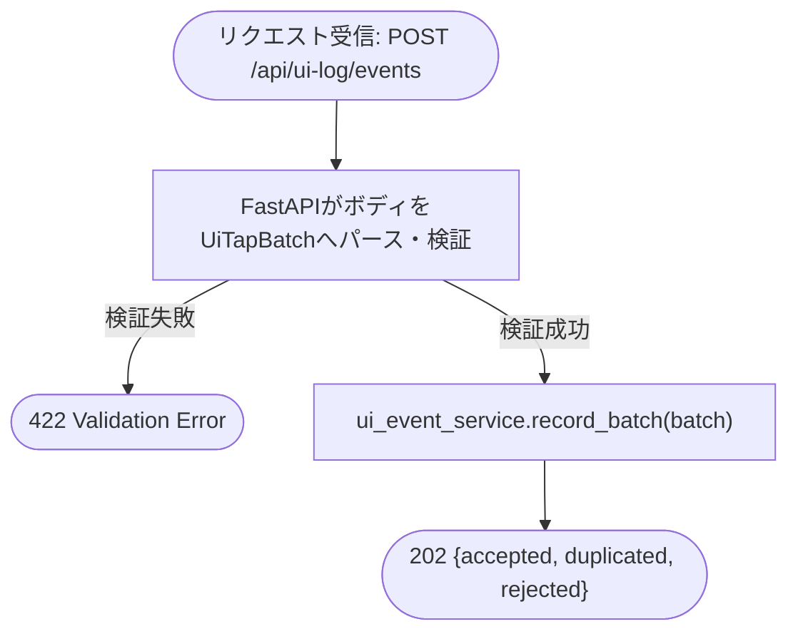
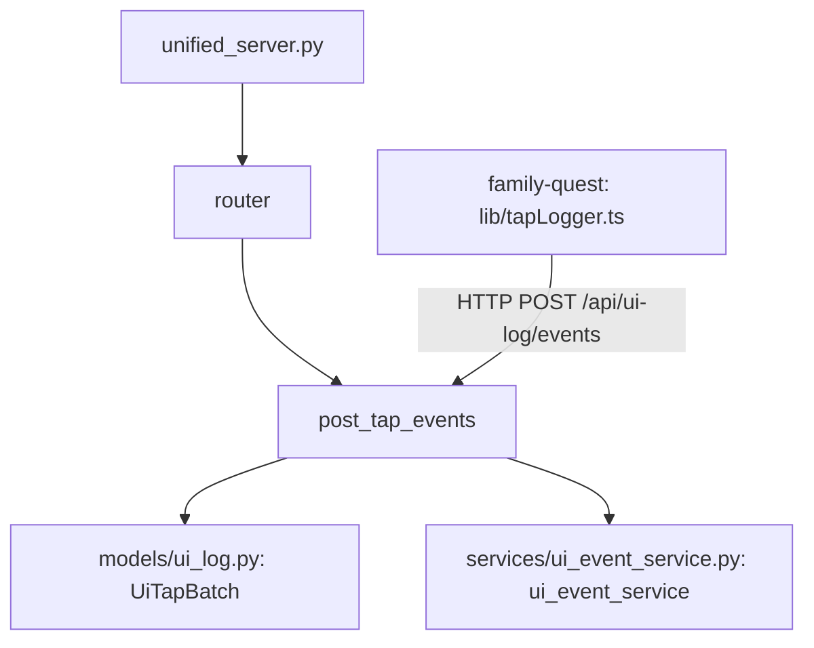

## 1. 解析メタ情報

| 項目 | 内容 |
| --- | --- |
| 対象ファイル | `routers/ui_log_router.py` |
| 言語 | Python / FastAPI |
| 解析対象 | 提供されたコードのみ |
| 推測・補完 | 一切なし |

## 関連ドキュメント

* [ui_log.md](./ui_log.md) - `from models.ui_log import UiTapBatch, UiTapBatchResponse`でimportするリクエスト/レスポンスモデルの定義元
* [ui_event_service.md](./ui_event_service.md) - `from services.ui_event_service import ui_event_service`でimportするサービス層シングルトン。実処理はすべてここに委譲される
* [unified_server.md](./unified_server.md) - 本ルーターを`/api/ui-log`プレフィックス・タグ`ui-log`で`include_router`する呼び出し元
* [src/lib/tapLogger.md](./../family-quest/src/lib/tapLogger.md) - 本エンドポイントへバッチを送るフロントエンド側の送信元

## 2. ファイルの概要

画面タップログ(UX改善用の操作ログ)を受け付けるFastAPIルーター。CLAUDE.mdのレイヤリング規約どおり、リクエストのパース・検証のみを行いロジックは`services.ui_event_service.ui_event_service`に委譲する薄いルーターで、エンドポイントは`POST /events`の1つだけである。
根拠: [ルーター定義] (行番号: 6 / 抜粋: "router = APIRouter()")、[エンドポイント定義] (行番号: 9-16)

## 3. 外部依存関係

### インポート一覧

| 名称 | 種類 | 用途 | 根拠 |
| --- | --- | --- | --- |
| `fastapi.APIRouter` | 外部パッケージ | ルーターインスタンス`router`の作成 | 根拠: [インポート宣言] (行番号: 2 / 抜粋: "from fastapi import APIRouter") |
| `models.ui_log.UiTapBatch` | ローカルモジュール | リクエストボディ型 | 根拠: [インポート宣言] (行番号: 3 / 抜粋: "from models.ui_log import UiTapBatch, UiTapBatchResponse") |
| `models.ui_log.UiTapBatchResponse` | ローカルモジュール | `response_model` | 根拠: [インポート宣言] (行番号: 3 / 抜粋: "from models.ui_log import UiTapBatch, UiTapBatchResponse") |
| `services.ui_event_service.ui_event_service` | ローカルモジュール | 実処理の委譲先シングルトン | 根拠: [インポート宣言] (行番号: 4 / 抜粋: "from services.ui_event_service import ui_event_service") |

### ブラックボックスとなる外部要素

| 名称 | 理由 | 根拠 |
| --- | --- | --- |
| `ui_event_service.record_batch`の内部実装 | 保存・重複排除・時刻範囲の判定は本ファイルからは不明。詳細は[ui_event_service.md](./ui_event_service.md)参照。 | [関数呼び出し] (行番号: 16 / 抜粋: "return ui_event_service.record_batch(batch)") |

## 4. 主要要素の定義（関数 / エンドポイント / コンポーネント）

### `router`

* **役割**: 本ファイルが定義するエンドポイントをまとめる`APIRouter`インスタンス。`unified_server.py`から`prefix="/api/ui-log"`でマウントされる。
* 根拠: [変数宣言] (行番号: 6 / 抜粋: "router = APIRouter()")
* **引数/リクエスト**: 該当なし
* **戻り値/レスポンス**: 該当なし
* **副作用**: なし(インスタンス生成のみ)
* **エラーハンドリング**: なし

### `post_tap_events` (`POST /events`)

* **役割**: 画面タップのバッチ(最大`config.UI_TAP_LOG_MAX_BATCH`件)を追記するエンドポイント。docstringによれば、クライアントが20件または30秒ごと、および画面を閉じる/隠すときに送り、`event_id`で冪等なので再送しても二重には記録されない。成功時のステータスコードは202。
* 根拠: [ルーティング定義・関数定義] (行番号: 10-16 / 抜粋: "def post_tap_events(batch: UiTapBatch) -> dict[str, int]:")、[docstring] (行番号: 11-15)
* **引数/リクエスト**: リクエストボディ`batch: UiTapBatch`(`session_id`と`events`。制約は[ui_log.md](./ui_log.md)参照)
* 根拠: [関数定義] (行番号: 10 / 抜粋: "def post_tap_events(batch: UiTapBatch) -> dict[str, int]:")
* **戻り値/レスポンス**: `dict[str, int]`(`accepted` / `duplicated` / `rejected`の3キー。`response_model=UiTapBatchResponse`)
* 根拠: [ルーティング定義] (行番号: 9 / 抜粋: "@router.post(\"/events\", response_model=UiTapBatchResponse, status_code=202)")
* **副作用**: `ui_event_service.record_batch`の呼び出しに伴うDBへの追記(間接的)。本ファイル自体には副作用となるコードは存在しない。
* 根拠: [関数呼び出し] (行番号: 16 / 抜粋: "return ui_event_service.record_batch(batch)")
* **エラーハンドリング**: 本ファイル内には`try`/`except`は存在しない。ボディが`UiTapBatch`の制約を満たさない場合はFastAPI/Pydantic側で422が自動生成される。
* 根拠: [関数定義] (行番号: 9-16、`try`/`except`は存在しない)

## 5. 処理フロー図

## 6. 依存関係図

## 7. 次のステップ（リバースエンジニアリングの提案）

| 優先度 | ファイル名(推測可) | 理由 | 根拠 |
| --- | --- | --- | --- |
| 高 | `services/ui_event_service.py` | 実処理(保存・冪等化・時刻範囲)の詳細を把握するため。 | [関数呼び出し] (行番号: 16) |
| 中 | `models/ui_log.py` | リクエストの制約詳細を把握するため。 | [インポート宣言] (行番号: 3) |

## 8. 保守上の注意点

* `user_id`はクライアント入力のまま保存され、認可は行わない。これはCLAUDE.mdに記載されたFamily Quest API全体の既知の設計判断(LAN内信頼境界、Issue #614)と同じパターンである。
* 本ルーターは新しい外部Webhookではない(同一オリジンの`/api/ui-log`)ため、`allowed_webhook_paths`への追記は不要。
* `UI_TAP_LOG_ENABLED=false`でもエンドポイントは202を返す(保存しないだけ)。クライアントの再送を誘発しないためである([ui_event_service.md](./ui_event_service.md)参照)。

## 9. 不明事項一覧

| 項目 | 理由 | 必要なファイル |
| --- | --- | --- |
| 保存の詳細(重複判定・時刻範囲) | 本ファイルは委譲のみ | `services/ui_event_service.py` |

## 10. 自己検証結果

* [x] 完了: 推測・外部ファイルの仕様を一切含んでいない
* [x] 完了: 全関数・全クラス・全コンポーネントを列挙した
* [x] 完了: 全てのインポート要素を列挙した
* [x] 完了: すべての仕様説明に「根拠（行番号・抜粋）」を明記した
* [x] 完了: 根拠漏れが0件である
* [x] 完了: Mermaid構文にエラーの原因となる記号（エスケープ漏れ）がない
* [x] 完了: 不明事項を漏れなく列挙した
