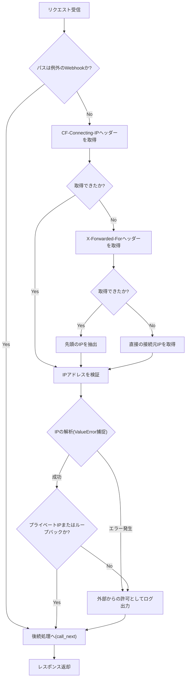
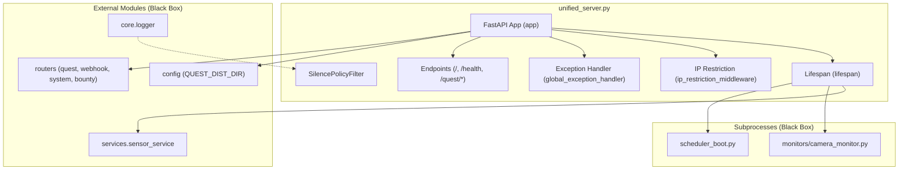

## 1. 解析メタ情報

| 項目 | 内容 |
| --- | --- |
| 対象ファイル | `unified_server.py` |
| 言語 | Python (FastAPI) |
| 解析対象 | 提供されたコードのみ |
| 推測・補完 | 一切なし |

## 2. ファイルの概要

* FastAPIを用いたAPIサーバーのエントリーポイント（起動・設定スクリプト）である。
* システムのルートディレクトリ解決、CORS設定、IPアドレスベースの検証（Cloudflare等リバースプロキシ対応）、ログ抑制フィルターの設定、各種ルーターの統合を行う。
* 静的ファイル（`/assets`, `/uploads`, SPA用ファイル）の配信ルーティングを行う。
* アプリケーション起動・終了時（ライフサイクル）に連動して、サブプロセス（カメラ監視スクリプト、スケジューラースクリプト）の起動と終了管理、およびセンサー関連タスクのキャンセル処理を行う。
* 未捕捉例外のグローバルハンドリングを担う。
* 根拠: `app = FastAPI(...)` (行番号: 104-109 / 抜粋: "app = FastAPI("), `uvicorn.run(...)` (行番号: 261 / 抜粋: "uvicorn.run(app, host="0.0.0.0"")

## 3. 外部依存関係

### インポート一覧

| 名称 | 種類 | 用途 | 根拠 |
| --- | --- | --- | --- |
| `os` | 標準ライブラリ | パス操作、環境変数アクセス | 根拠: `[os]` (行番号: 2 / 抜粋: "import os") |
| `sys` | 標準ライブラリ | Pythonパス追加、実行パス取得 | 根拠: `[sys]` (行番号: 3 / 抜粋: "import sys") |
| `asyncio` | 標準ライブラリ | 非同期処理用（未使用だがインポート有） | 根拠: `[asyncio]` (行番号: 4 / 抜粋: "import asyncio") |
| `datetime` | 標準ライブラリ | 現在時刻の取得 | 根拠: `[datetime]` (行番号: 5 / 抜粋: "import datetime") |
| `subprocess` | 標準ライブラリ | 外部プロセスの起動・管理 | 根拠: `[subprocess]` (行番号: 6 / 抜粋: "import subprocess") |
| `signal` | 標準ライブラリ | シグナル管理（未使用だがインポート有） | 根拠: `[signal]` (行番号: 7 / 抜粋: "import signal") |
| `logging` | 標準ライブラリ | ログの出力、フィルター作成 | 根拠: `[logging]` (行番号: 8 / 抜粋: "import logging") |
| `contextlib.asynccontextmanager` | 標準ライブラリ | 非同期コンテキストマネージャー | 根拠: `[asynccontextmanager]` (行番号: 9 / 抜粋: "from contextlib import asynccon") |
| `ipaddress` | 標準ライブラリ | IPアドレスのパースと検証 | 根拠: `[ipaddress]` (行番号: 10 / 抜粋: "import ipaddress") |
| `typing` (AsyncGenerator, Optional, Callable, Awaitable) | 標準ライブラリ | 型ヒントの定義 | 根拠: `[typing]` (行番号: 12 / 抜粋: "from typing import AsyncGenerat") |
| `fastapi` | 外部パッケージ | Webフレームワーク基本機能 | 根拠: `[FastAPI]` (行番号: 14 / 抜粋: "from fastapi import FastAPI, Re") |
| `fastapi.staticfiles` | 外部パッケージ | 静的ファイル配信 | 根拠: `[StaticFiles]` (行番号: 15 / 抜粋: "from fastapi.staticfiles import") |
| `fastapi.responses` | 外部パッケージ | JSON/ファイルレスポンス生成 | 根拠: `[JSONResponse, FileResponse]` (行番号: 16 / 抜粋: "from fastapi.responses import J") |
| `fastapi.middleware.cors` | 外部パッケージ | CORS処理ミドルウェア | 根拠: `[CORSMiddleware]` (行番号: 17 / 抜粋: "from fastapi.middleware.cors im") |
| `fastapi.exceptions` | 外部パッケージ | リクエスト検証例外（未使用だが有） | 根拠: `[RequestValidationError]` (行番号: 18 / 抜粋: "from fastapi.exceptions import ") |
| `uvicorn` | 外部パッケージ | ASGIサーバーの起動と設定取得 | 根拠: `[uvicorn]` (行番号: 254 / 抜粋: "import uvicorn") |
| `config` | ローカルモジュール | 設定値(`QUEST_DIST_DIR`等)の取得 | 根拠: `[config]` (行番号: 24 / 抜粋: "import config") |
| `core.logger.setup_logging` | ローカルモジュール | ロガーの初期化処理 | 根拠: `[setup_logging]` (行番号: 25 / 抜粋: "from core.logger import setup_l") |
| `services.sensor_service` | ローカルモジュール | センサータスクの管理 | 根拠: `[sensor_service]` (行番号: 26 / 抜粋: "from services import sensor_ser") |
| `routers.*` | ローカルモジュール | 各APIエンドポイントのルーター | 根拠: `[routers]` (行番号: 29 / 抜粋: "from routers import quest_route") |
| `handlers.line_handler` | ローカルモジュール | LINEハンドラー（ファイル内未使用） | 根拠: `[line_handler]` (行番号: 32 / 抜粋: "from handlers import line_handl") |

### ブラックボックスとなる外部要素

| 名称 | 理由 | 根拠 |
| --- | --- | --- |
| `config.QUEST_DIST_DIR` | 設定ファイル内の変数の有無・パス文字列が不明 | `getattr(config, "QUEST_DIST_DIR", None)` (行番号: 201 / 抜粋: "quest_dist_dir = getattr(config") |
| `setup_logging()` | ログ出力フォーマット等の詳細仕様が不明 | `logger = setup_logging("unifie")` (行番号: 35 / 抜粋: "logger = setup_logging("unifie") |
| `sensor_service.cancel_all_tasks()` | キャンセルされる具体的なタスク内容が不明 | `sensor_service.cancel_all_tasks()` (行番号: 100 / 抜粋: "sensor_service.cancel_all_tasks") |
| 各ルーター (`quest`, `webhook`, `system`, `bounty`) | 各パス配下の具体的なルーティング定義が不明 | `app.include_router(...)` (行番号: 189-192 / 抜粋: "app.include_router(webhook_rout") |
| `monitors/camera_monitor.py` | 起動する外部スクリプトの処理内容が不明 | `subprocess.Popen([sys.executable, camera_script])` (行番号: 80 / 抜粋: "camera_process = subprocess.Po") |
| `scheduler_boot.py` | 起動する外部スクリプトの処理内容が不明 | `subprocess.Popen([sys.executable, scheduler_script])` (行番号: 85 / 抜粋: "scheduler_process = subprocess.") |

## 4. 主要要素の定義（関数 / エンドポイント / コンポーネント）

### `SilencePolicyFilter`

* **役割**: Uvicorn等のアクセスログ出力を評価し、GETリクエストかつ正常系（200 OK または 304 Not Modified）で、特定のパス・キーワード（ポーリング、ヘルスチェック、静的アセット等）を含む場合のみログ出力を抑制する（Falseを返す）。それ以外や例外発生時はログを出力する。
* 根拠: `class SilencePolicyFilter(logg` (行番号: 38-70 / 抜粋: "class SilencePolicyFilter(logg")

* **引数/リクエスト**: `record: logging.LogRecord`
* 根拠: `def filter(self, record: loggin` (行番号: 43 / 抜粋: "def filter(self, record: loggin")

* **戻り値/レスポンス**: `bool` (True: ログ出力、False: ログ抑制)
* 根拠: `-> bool:` (行番号: 43 / 抜粋: "def filter(self, record: loggin")

* **副作用**: なし
* 根拠: 該当関数内処理 (行番号: 43-70 / 抜粋: "def filter(self, record: loggin")

* **エラーハンドリング**: 関数内部での例外発生時は全てキャッチし無視(`pass`)することで、ロギング処理全体の停止を防ぎ、デフォルトとして`True`を返す安全策を持つ。
* 根拠: `except Exception: pass` (行番号: 66-68 / 抜粋: "except Exception: pass")

### `lifespan`

* **役割**: FastAPIの起動時(`yield`前)にアクセスログへのフィルター適用、カメラおよびスケジューラーのサブプロセスを起動する。終了時(`yield`後)にサブプロセスを停止させ、センサータスクのキャンセル処理を実行する。
* 根拠: `async def lifespan(app: FastA` (行番号: 75-102 / 抜粋: "async def lifespan(app: FastA")

* **引数/リクエスト**: `app: FastAPI`
* 根拠: `async def lifespan(app: FastA` (行番号: 75 / 抜粋: "async def lifespan(app: FastA")

* **戻り値/レスポンス**: `AsyncGenerator[None, None]`
* 根拠: `-> AsyncGenerator[None, None]:` (行番号: 75 / 抜粋: "-> AsyncGenerator[None, None]:")

* **副作用**: Uvicornロガー設定の変更、外部プロセス(`subprocess.Popen`)の実行と強制終了(`terminate`, `kill`)、グローバル変数(`camera_process`, `scheduler_process`)の書き換え。
* 根拠: 該当関数内処理 (行番号: 78, 80, 85, 94-98 / 抜粋: "scheduler_process.terminate()")

* **エラーハンドリング**: スケジューラー起動失敗時の例外(`Exception`)、プロセス停止時のタイムアウト(`subprocess.TimeoutExpired`)を補足し、フォールバック（エラーログ出力や強制kill）を実行する。
* 根拠: `except Exception as e:` (行番号: 88-89 / 抜粋: "except Exception as e:"), `except subprocess.TimeoutExpire` (行番号: 96-97 / 抜粋: "except subprocess.TimeoutExpire")

### `ip_restriction_middleware`

* **役割**: リクエスト元のIPを判定するHTTPミドルウェア。Webhookの例外パス以外では、`cf-connecting-ip`や`x-forwarded-for`を検証しローカル/プライベートIPかを判定するが、最終的にはアクセス遮断を行わず全リクエストを後続(`call_next`)へ渡す。例外時はデバッグログのみ出力する。
* 根拠: `async def ip_restriction_middle` (行番号: 124-180 / 抜粋: "async def ip_restriction_middle")

* **引数/リクエスト**: `request: Request`, `call_next: Callable[[Request], Awaitable[Response]]`
* 根拠: `async def ip_restriction_middle` (行番号: 124 / 抜粋: "async def ip_restriction_middle")

* **戻り値/レスポンス**: `Response` (後続の処理結果)
* 根拠: `-> Response:` (行番号: 124 / 抜粋: "-> Response:")

* **副作用**: 外部ネットワークからのアクセス判定時(`logger.debug`)のログ出力。
* 根拠: `logger.debug(f"Allowed extern` (行番号: 179 / 抜粋: "logger.debug(f"Allowed extern")

* **エラーハンドリング**: IPアドレス解析時(`ipaddress.ip_address`)の`ValueError`を補足し無視(`pass`)する。
* 根拠: `except ValueError: pass` (行番号: 168-169 / 抜粋: "except ValueError: pass")

### `global_exception_handler`

* **役割**: アプリケーション全体で発生した未捕捉の例外をキャッチし、ログに記録した上でステータスコード500のエラーレスポンスを返す。
* 根拠: `async def global_exception_hand` (行番号: 182-187 / 抜粋: "async def global_exception_hand")

* **引数/リクエスト**: `request: Request`, `exc: Exception`
* 根拠: `async def global_exception_hand` (行番号: 183 / 抜粋: "async def global_exception_hand")

* **戻り値/レスポンス**: `JSONResponse` (HTTP 500, detailとエラー内容のJSON)
* 根拠: `return JSONResponse(...)` (行番号: 185-187 / 抜粋: "return JSONResponse( status_c")

* **副作用**: エラーログへのスタックトレース出力。
* 根拠: `logger.error(f"🔥 Global Exce` (行番号: 184 / 抜粋: "logger.error(f"🔥 Global Exce")

* **エラーハンドリング**: なし（本メソッド自体が最上位の例外ハンドラ）
* 根拠: `@app.exception_handler(Exceptio` (行番号: 182 / 抜粋: "@app.exception_handler(Exceptio")

### `serve_quest_spa` (エンドポイント: `GET /quest/{full_path:path}`)

* **役割**: SPA(Single Page Application)向けのリクエストハンドラ。指定されたパスのファイルが存在する場合はそれを返し、存在しない場合はフォールバックとして`index.html`を返す。
* 根拠: `async def serve_quest_spa(full_` (行番号: 218-228 / 抜粋: "async def serve_quest_spa(full_")

* **引数/リクエスト**: `full_path: str`
* 根拠: `async def serve_quest_spa(full_` (行番号: 218 / 抜粋: "async def serve_quest_spa(full_")

* **戻り値/レスポンス**: `FileResponse` または `JSONResponse` (HTTP 404)
* 根拠: `return FileResponse(target_fil` (行番号: 222 / 抜粋: "return FileResponse(target_file"), `return JSONResponse(status_code` (行番号: 227 / 抜粋: "return JSONResponse(status_code")

* **副作用**: なし
* 根拠: 該当関数内処理 (行番号: 218-228 / 抜粋: "async def serve_quest_spa(full_")

* **エラーハンドリング**: `index.html`が存在しない場合は404エラーとしてJSONレスポンスを返す。
* 根拠: `if os.path.exists(index_path):` (行番号: 225-227 / 抜粋: "if os.path.exists(index_path):")

### `serve_quest_root` (エンドポイント: `GET /quest`, `GET /quest/`)

* **役割**: SPAルートパスへのアクセスに対し`index.html`を返す。
* 根拠: `async def serve_quest_root():` (行番号: 232-236 / 抜粋: "async def serve_quest_root():")

* **引数/リクエスト**: なし
* 根拠: `async def serve_quest_root():` (行番号: 232 / 抜粋: "async def serve_quest_root():")

* **戻り値/レスポンス**: `FileResponse` または `JSONResponse` (HTTP 404)
* 根拠: `return FileResponse(index_path)` (行番号: 235 / 抜粋: "return FileResponse(index_path)"), `return JSONResponse(status_code` (行番号: 236 / 抜粋: "return JSONResponse(status_code")

* **副作用**: なし
* 根拠: 該当関数内処理 (行番号: 232-236 / 抜粋: "async def serve_quest_root():")

* **エラーハンドリング**: `index.html`が存在しない場合は404エラーとしてJSONレスポンスを返す。
* 根拠: `if os.path.exists(index_path):` (行番号: 234-236 / 抜粋: "if os.path.exists(index_path):")

### `root` (エンドポイント: `GET /`)

* **役割**: 稼働状態、システム名、現在時刻を返すルートAPI。
* 根拠: `async def root():` (行番号: 242-247 / 抜粋: "async def root():")

* **引数/リクエスト**: なし
* 根拠: `async def root():` (行番号: 242 / 抜粋: "async def root():")

* **戻り値/レスポンス**: `dict` (status, system, timeキーを含む)
* 根拠: `return { "status": "ok", ... }` (行番号: 243-247 / 抜粋: "return { "status": "ok", "sy")

* **副作用**: なし
* 根拠: 該当関数内処理 (行番号: 242-247 / 抜粋: "async def root():")

* **エラーハンドリング**: なし
* 根拠: 該当関数内処理 (行番号: 242-247 / 抜粋: "async def root():")

### `health_check` (エンドポイント: `GET /health`)

* **役割**: ヘルスチェック用に正常稼働を示すJSONを返す。
* 根拠: `async def health_check():` (行番号: 250-251 / 抜粋: "async def health_check():")

* **引数/リクエスト**: なし
* 根拠: `async def health_check():` (行番号: 250 / 抜粋: "async def health_check():")

* **戻り値/レスポンス**: `dict` (statusキーを含む)
* 根拠: `return {"status": "healthy"}` (行番号: 251 / 抜粋: "return {"status": "healthy"}")

* **副作用**: なし
* 根拠: 該当関数内処理 (行番号: 250-251 / 抜粋: "async def health_check():")

* **エラーハンドリング**: なし
* 根拠: 該当関数内処理 (行番号: 250-251 / 抜粋: "async def health_check():")

## 5. 処理フロー図

※主要なロジックである `ip_restriction_middleware` におけるアクセス検証のフローを可視化。

## 6. 依存関係図

## 7. 次のステップ（リバースエンジニアリングの提案）

| 優先度 | ファイル名(推測可) | 理由 | 根拠 |
| --- | --- | --- | --- |
| 高 | `config.py` | システム全体の静的パス(`QUEST_DIST_DIR`等)や他の設定変数を決定しており、システムの配置構造を把握するため。 | `import config` (行番号: 24)、`getattr(config, "QUEST_DIST_DIR", None)` (行番号: 201) |
| 高 | `scheduler_boot.py` | APIサーバー起動と同時にサブプロセスとして起動・ライフサイクル共有されるため、非同期で動作する定期処理の仕様把握に必須であるため。 | `scheduler_script = os.path.join(PROJECT_ROOT, "scheduler_boot.py")` (行番号: 83) |
| 中 | `routers/quest_router.py` | `/api/quest`パス配下にマウントされる処理群であり、システム名である「Family Quest API」のコアドメイン処理を把握するため。 | `app.include_router(quest_router.router, prefix="/api/quest")` (行番号: 190) |
| 中 | `services/sensor_service.py` | 終了処理にタスクキャンセルが含まれており、起動後に常駐するセンサー処理の内容と影響範囲を特定するため。 | `sensor_service.cancel_all_tasks()` (行番号: 100) |

## 8. 保守上の注意点

* `ip_restriction_middleware` 内でIP制限のロジックが実装されているが、現状は `return await call_next(request)` が分岐の最終地点で必ず呼ばれるため、事実上すべてのIPからのアクセスが遮断されずに後続処理へ流れる状態となっている。
* モジュール `handlers.line_handler` はインポートされているが、ファイル内で一度も使用されていない（未使用インポート）。
* サブプロセス（`camera_process`, `scheduler_process`）はグローバル変数として定義および管理されており、プロセス停止処理（`terminate()`や`kill()`）で状態変異（副作用）を伴う。
* シャットダウン時、スケジューラープロセスの終了待ち（`wait`）が5秒でタイムアウトし、強制キル（`kill`）される仕様となっている。
* `config.QUEST_DIST_DIR` が未定義またはパスに存在しない場合、システムは例外終了せず警告ログのみを出力する（null安全性/フォールバック）。
* Webhook受信の例外パス（`/webhook/switchbot`, `/callback/line`）はハードコードで定義されている。

## 9. 不明事項一覧

| 項目 | 理由 | 必要なファイル |
| --- | --- | --- |
| 設定値の内容 | `QUEST_DIST_DIR`などの変数値が不明 | `config.py` |
| APIルーティング詳細 | `/api/quest`、`/api/system`、`/api/bounty`配下の実際のエンドポイント定義が不明 | `routers/quest_router.py`, `routers/system_router.py`, `routers/bounty_router.py`, `routers/webhook_router.py` |
| キャンセルされるタスク | `sensor_service.cancel_all_tasks()`の対象タスク仕様が不明 | `services/sensor_service.py` |
| サブプロセスの処理仕様 | カメラの監視仕様および定期実行されるスケジューラ仕様が不明 | `monitors/camera_monitor.py`, `scheduler_boot.py` |
| ログ設定の詳細 | `setup_logging`内で設定されるハンドラやフォーマッタの実装が不明 | `core/logger.py` |

## 10. 自己検証結果

* [x] 推測・外部ファイルの仕様を一切含んでいない
* [x] 全関数・全クラス・全コンポーネントを列挙した
* [x] 全てのインポート要素を列挙した
* [x] すべての仕様説明に「根拠（行番号・抜粋）」を明記した
* [x] 根拠漏れが0件である
* [x] Mermaid構文にエラーの原因となる記号（エスケープ漏れ）がない
* [x] 不明事項を漏れなく列挙した
* [x] 完了