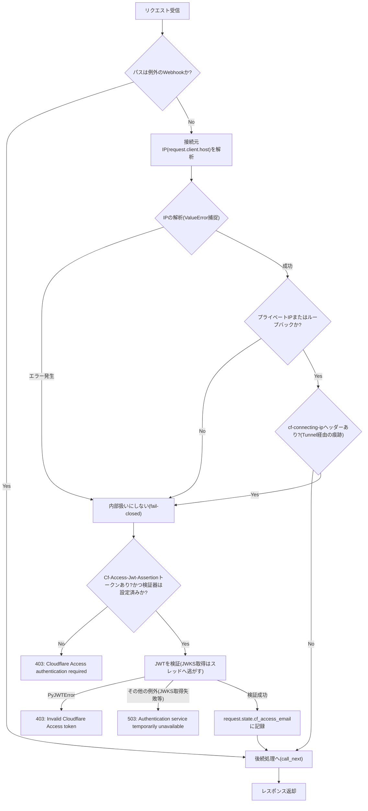
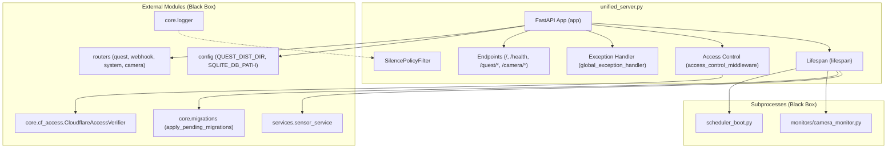

## 1. 解析メタ情報

| 項目 | 内容 |
| --- | --- |
| 対象ファイル | `unified_server.py` |
| 言語 | Python (FastAPI) |
| 解析対象 | 提供されたコードのみ |
| 推測・補完 | 一切なし |

## 関連ドキュメント

- [config.md](./config.md) — `QUEST_DIST_DIR`, `SQLITE_DB_PATH`, `CORS_ORIGINS`等の設定値を提供
- [logger.md](./logger.md) — `core.logger.setup_logging`の実体
- [database.md](./database.md) / [init_unified_db.md](./init_unified_db.md) — 起動時に呼び出される`apply_pending_migrations`関連のマイグレーション機構
- [sensor_service.md](./sensor_service.md) — シャットダウン時に呼ばれる`cancel_all_tasks()`の実装元
- [camera_monitor.md](./camera_monitor.md) — 起動時にサブプロセスとして起動されるカメラ監視スクリプト
- [scheduler_boot.md](./scheduler_boot.md) — 起動時にサブプロセスとして起動されるスケジューラスクリプト
- [quest_router.md](./quest_router.md) — `/api/quest`にマウントされるルーター
- [webhook_router.md](./webhook_router.md) — Webhook例外パス(`/webhook/switchbot`, `/callback/line`)を持つルーター
- [system_router.md](./system_router.md) — `/api/system`にマウントされるルーター(手動バックアップ)
- [camera_router.md](./camera_router.md) — `/api/cameras`にマウントされ、SPAルーティング(`/camera/*`)とも連動するルーター

## 2. ファイルの概要

* FastAPIを用いたAPIサーバーのエントリーポイント（起動・設定スクリプト）である。
* システムのルートディレクトリ解決、CORS設定、Cloudflare AccessのJWT検証によるアクセス制御（fail-closed。棚卸し課題4で実装）、ログ抑制フィルターの設定、各種ルーターの統合を行う。CORS許可オリジンは`config.CORS_ORIGINS`を直接参照する（M-8-2で、本ファイル側に別途あった重複ハードコードリストを削除し一本化した。以前は本ファイル側のリストのみが実際に使われ、`config.py`側の設定やその元になる`ALLOW_ALL_ORIGINS`環境変数を変更してもCORS設定に反映されない状態だった）。
* 根拠: [CORSミドルウェア設定] (行番号: 166-172 / 抜粋: "allow_origins=config.CORS_ORIGINS,"), [アクセス制御ミドルウェア] (行番号: 179-254 / 抜粋: "async def access_control_middleware")
* 静的ファイル（`/assets`, `/uploads`, SPA用ファイル）の配信ルーティングを行う。
* アプリケーション起動・終了時（ライフサイクル）に連動して、サブプロセス（カメラ監視スクリプト、スケジューラースクリプト）の起動と終了管理、およびセンサー関連タスクのキャンセル処理を行う。
* 未捕捉例外のグローバルハンドリングを担う。
* 根拠: `app = FastAPI(...)` (行番号: 153-158 / 抜粋: "app = FastAPI("), `uvicorn.run(...)` (行番号: 325 / 抜粋: "uvicorn.run(app, host="0.0.0.0"")

## 3. 外部依存関係

### インポート一覧

| 名称 | 種類 | 用途 | 根拠 |
| --- | --- | --- | --- |
| `os` | 標準ライブラリ | パス操作、環境変数アクセス | 根拠: `[os]` (行番号: 2 / 抜粋: "import os") |
| `sys` | 標準ライブラリ | Pythonパス追加、実行パス取得 | 根拠: `[sys]` (行番号: 3 / 抜粋: "import sys") |
| `asyncio` | 標準ライブラリ | 非同期処理用（未使用だがインポート有） | 根拠: `[asyncio]` (行番号: 4 / 抜粋: "import asyncio") |
| `datetime` | 標準ライブラリ | 現在時刻の取得 | 根拠: `[datetime]` (行番号: 5 / 抜粋: "import datetime") |
| `subprocess` | 標準ライブラリ | 外部プロセスの起動・管理 | 根拠: `[subprocess]` (行番号: 6 / 抜粋: "import subprocess") |
| `signal` | 標準ライブラリ | シグナル管理（未使用だがインポート有） | 根拠: `[signal]` (行番号: 7 / 抜粋: "import signal") |
| `logging` | 標準ライブラリ | ログの出力、フィルター作成 | 根拠: `[logging]` (行番号: 8 / 抜粋: "import logging") |
| `contextlib.asynccontextmanager` | 標準ライブラリ | 非同期コンテキストマネージャー（未使用だがインポート有。`lifespan`にデコレータとして付与されていない） | 根拠: `[asynccontextmanager]` (行番号: 9 / 抜粋: "from contextlib import asynccon") |
| `ipaddress` | 標準ライブラリ | IPアドレスのパースと検証 | 根拠: `[ipaddress]` (行番号: 10 / 抜粋: "import ipaddress") |
| `typing` (AsyncGenerator, Optional, Callable, Awaitable) | 標準ライブラリ | 型ヒントの定義 | 根拠: `[typing]` (行番号: 12 / 抜粋: "from typing import AsyncGenerat") |
| `jwt` | 外部パッケージ(PyJWT) | Cloudflare Access JWTの検証時に送出される`PyJWTError`系例外の捕捉 | 根拠: `[jwt]` (行番号: 27 / 抜粋: "import jwt") |
| `core.cf_access.CloudflareAccessVerifier` | ローカルモジュール | Cloudflare Access発行のJWT(`Cf-Access-Jwt-Assertion`)の検証本体 | 根拠: `[CloudflareAccessVerifier]` (行番号: 30 / 抜粋: "from core.cf_access import CloudflareAccessVerifier") |
| `fastapi` | 外部パッケージ | Webフレームワーク基本機能 | 根拠: `[FastAPI]` (行番号: 14 / 抜粋: "from fastapi import FastAPI, Re") |
| `fastapi.staticfiles` | 外部パッケージ | 静的ファイル配信 | 根拠: `[StaticFiles]` (行番号: 15 / 抜粋: "from fastapi.staticfiles import") |
| `fastapi.responses` | 外部パッケージ | JSON/ファイルレスポンス生成 | 根拠: `[JSONResponse, FileResponse]` (行番号: 16 / 抜粋: "from fastapi.responses import J") |
| `fastapi.middleware.cors` | 外部パッケージ | CORS処理ミドルウェア | 根拠: `[CORSMiddleware]` (行番号: 17 / 抜粋: "from fastapi.middleware.cors im") |
| `fastapi.exceptions` | 外部パッケージ | リクエスト検証例外（未使用だが有） | 根拠: `[RequestValidationError]` (行番号: 18 / 抜粋: "from fastapi.exceptions import ") |
| `uvicorn` | 外部パッケージ | ASGIサーバーの起動と設定取得 | 根拠: `[uvicorn]` (行番号: 316 / 抜粋: "import uvicorn") |
| `sqlite3` | 標準ライブラリ | 起動時マイグレーション適用のためのDB接続確立 | 根拠: `[sqlite3]` (行番号: 25 / 抜粋: "import sqlite3") |
| `config` | ローカルモジュール | 設定値(`QUEST_DIST_DIR`, `SQLITE_DB_PATH`, `CF_ACCESS_TEAM_DOMAIN`, `CF_ACCESS_AUD`等)の取得 | 根拠: `[config]` (行番号: 29 / 抜粋: "import config") |
| `core.logger.setup_logging` | ローカルモジュール | ロガーの初期化処理 | 根拠: `[setup_logging]` (行番号: 31 / 抜粋: "from core.logger import setup_l") |
| `core.migrations.apply_pending_migrations` | ローカルモジュール | 起動時のスキーママイグレーション適用 | 根拠: `[apply_pending_migrations]` (行番号: 32 / 抜粋: "from core.migrations import apply_pending_migrations") |
| `services.sensor_service` | ローカルモジュール | センサータスクの管理 | 根拠: `[sensor_service]` (行番号: 33 / 抜粋: "from services import sensor_ser") |
| `routers.*` (`quest_router`, `webhook_router`, `system_router`, `camera_router`) | ローカルモジュール | 各APIエンドポイントのルーター | 根拠: `[routers]` (行番号: 36 / 抜粋: "from routers import quest_router, webhook_router, system_router, camera_router") |
| `handlers.line_handler` | ローカルモジュール | LINEハンドラー（ファイル内未使用） | 根拠: `[line_handler]` (行番号: 39 / 抜粋: "from handlers import line_handl") |

### ブラックボックスとなる外部要素

| 名称 | 理由 | 根拠 |
| --- | --- | --- |
| `config.QUEST_DIST_DIR` | 設定ファイル内の変数の有無・パス文字列が不明 | `getattr(config, "QUEST_DIST_DIR", None)` (行番号: 255 / 抜粋: "quest_dist_dir = getattr(config") |
| `setup_logging()` | ログ出力フォーマット等の詳細仕様が不明 | `logger = setup_logging("unifie")` (行番号: 39 / 抜粋: "logger = setup_logging("unifie") |
| `sensor_service.cancel_all_tasks()` | キャンセルされる具体的なタスク内容が不明 | `sensor_service.cancel_all_tasks()` (行番号: 150 / 抜粋: "sensor_service.cancel_all_tasks") |
| 各ルーター (`webhook`, `quest`, `system`, `camera`) | 各パス配下の具体的なルーティング定義が不明 | `app.include_router(...)` (行番号: 234-237 / 抜粋: "app.include_router(webhook_rout") |
| `monitors/camera_monitor.py` | 起動する外部スクリプトの処理内容が不明 | `subprocess.Popen([sys.executable, camera_script])` (行番号: 114 / 抜粋: "camera_process = subprocess.Po") |
| `scheduler_boot.py` | 起動する外部スクリプトの処理内容が不明 | `subprocess.Popen([sys.executable, scheduler_script])` (行番号: 121 / 抜粋: "scheduler_process = subprocess.") |
| `apply_pending_migrations()` | マイグレーション適用の具体的な内部処理は `core/migrations.py` にあるため不明 | `apply_pending_migrations(migration_conn)` (行番号: 106 / 抜粋: "apply_pending_migrations(migration_conn)") |

## 4. 主要要素の定義（関数 / エンドポイント / コンポーネント）

### `SilencePolicyFilter`

* **役割**: Uvicorn等のアクセスログ出力を評価し、GETリクエストかつ正常系（200 OK または 304 Not Modified）で、特定のパス・キーワード（ポーリング、ヘルスチェック、静的アセット等）を含む場合のみログ出力を抑制する（Falseを返す）。それ以外や例外発生時はログを出力する。
* 根拠: `class SilencePolicyFilter(logg` (行番号: 42-85 / 抜粋: "class SilencePolicyFilter(logg")

* **引数/リクエスト**: `record: logging.LogRecord`
* 根拠: `def filter(self, record: loggin` (行番号: 48 / 抜粋: "def filter(self, record: loggin")

* **戻り値/レスポンス**: `bool` (True: ログ出力、False: ログ抑制)
* 根拠: `-> bool:` (行番号: 48 / 抜粋: "def filter(self, record: loggin")

* **副作用**: なし
* 根拠: 該当関数内処理 (行番号: 48-85 / 抜粋: "def filter(self, record: loggin")

* **エラーハンドリング**: 関数内部での例外発生時は全てキャッチし無視(`pass`)することで、ロギング処理全体の停止を防ぎ、デフォルトとして`True`を返す安全策を持つ。
* 根拠: `except Exception: pass` (行番号: 81-83 / 抜粋: "except Exception: pass")

### `lifespan`

* **役割**: FastAPIの起動時(`yield`前)にアクセスログへのフィルター適用、DBスキーママイグレーションの適用(`apply_pending_migrations`)、カメラおよびスケジューラーのサブプロセスを起動する。終了時(`yield`後)にスケジューラー・カメラ監視の両サブプロセスを停止させ、センサータスクのキャンセル処理を実行する。
* 根拠: `async def lifespan(app: FastA` (行番号: 91-151 / 抜粋: "async def lifespan(app: FastA")

* **引数/リクエスト**: `app: FastAPI`
* 根拠: `async def lifespan(app: FastA` (行番号: 91 / 抜粋: "async def lifespan(app: FastA")

* **戻り値/レスポンス**: `AsyncGenerator[None, None]`
* 根拠: `-> AsyncGenerator[None, None]:` (行番号: 91 / 抜粋: "-> AsyncGenerator[None, None]:")

* **副作用**: Uvicornロガー設定の変更、`sqlite3.connect`によるマイグレーション用DB接続の確立と`apply_pending_migrations`の実行、外部プロセス(`subprocess.Popen`)の実行と強制終了(`terminate`, `kill`)、グローバル変数(`camera_process`, `scheduler_process`)の書き換え。
* 根拠: 該当関数内処理 (行番号: 103-110, 112-114, 117-126, 132-139, 141-148 / 抜粋: "apply_pending_migrations(migration_conn)", "scheduler_process.terminate()")

* **エラーハンドリング**: マイグレーション適用失敗時の例外(`Exception`)を捕捉しエラーログ出力のうえ起動は継続する。スケジューラー起動失敗時の例外(`Exception`)、プロセス停止時のタイムアウト(`subprocess.TimeoutExpired`)を捕捉し、フォールバック（エラーログ出力や強制kill）を実行する。カメラ監視サブプロセス(`camera_process`)の起動自体には例外処理がなく、失敗時はそのまま例外が送出される。
* 根拠: `except Exception as e: logger.error(f"⚠️ Migration check failed...")` (行番号: 109-110 / 抜粋: "Migration check failed"), `except Exception as e:` (行番号: 125-126 / 抜粋: "Failed to start scheduler"), `except subprocess.TimeoutExpired` (行番号: 137-138, 146-147 / 抜粋: "except subprocess.TimeoutExpired")

### `access_control_middleware`

* **役割**: 全リクエストに適用されるアクセス制御ミドルウェア（棚卸し課題4でリニューアル。旧`ip_restriction_middleware`を置き換え）。Webhook例外パス(`/webhook/switchbot`, `/callback/line`)は各ハンドラの署名/トークン検証に委ねて通過させる。それ以外は詐称可能な`cf-connecting-ip`/`x-forwarded-for`ヘッダーではなく実TCP接続元(`request.client.host`)で内部/外部を判定し、「プライベート/ループバックかつCloudflare Tunnel経由の痕跡(`cf-connecting-ip`ヘッダー)なし」の場合のみLAN内アクセスとして通過させる。それ以外(Tunnel経由の外部アクセス等)は`Cf-Access-Jwt-Assertion`ヘッダーのJWTを`CloudflareAccessVerifier.verify()`で検証し、**トークン欠如・検証失敗時は403を返してリクエストを拒否する(fail-closed)**。旧実装と異なり、最終的に全リクエストを無条件で後続へ通す分岐は存在しない。
* 根拠: `async def access_control_middlewar` (行番号: 179-254 / 抜粋: "async def access_control_middleware")

* **引数/リクエスト**: `request: Request`, `call_next: Callable[[Request], Awaitable[Response]]`
* 根拠: `async def access_control_middlewar` (行番号: 180 / 抜粋: "async def access_control_middleware")

* **戻り値/レスポンス**: `Response` (通過時は後続処理結果、拒否時は`JSONResponse`)。判定に応じて3種のレスポンスがあり得る: (1) トークン欠如/`cf_access_verifier.configured`が偽 → HTTP 403 `{"detail": "Cloudflare Access authentication required"}`、(2) JWT検証失敗(`jwt.PyJWTError`) → HTTP 403 `{"detail": "Invalid Cloudflare Access token"}`、(3) JWKS取得失敗等の検証基盤エラー → HTTP 503 `{"detail": "Authentication service temporarily unavailable"}`。
* 根拠: `-> Response:` (行番号: 180 / 抜粋: "-> Response:"), `return JSONResponse(status_code=403, ...)` (行番号: 227-230, 240-243 / 抜粋: "Cloudflare Access authentication required", "Invalid Cloudflare Access token"), `return JSONResponse(status_code=503, ...)` (行番号: 247-250 / 抜粋: "Authentication service temporarily unavailable")

* **副作用**: JWT検証（JWKS取得時）を`asyncio.to_thread`でスレッドに逃がして実行。検証成功時、後続処理向けに`request.state.cf_access_email`へ検証済みメールアドレスを記録。拒否時は`logger.warning`、検証基盤エラー時は`logger.error`でログ出力。
* 根拠: `claims = await asyncio.to_thread(cf_access_verifier.verify, token)` (行番号: 234 / 抜粋: "asyncio.to_thread(cf_access_verifier.verify"), `request.state.cf_access_email = claims.get("email")` (行番号: 253 / 抜粋: "request.state.cf_access_email")

* **エラーハンドリング**: 接続元IPが解析不能な場合(`ipaddress.ip_address`の`ValueError`)は内部扱いにしない(fail-closed)。JWT検証時の`jwt.PyJWTError`は403、それ以外の例外(JWKS取得失敗等)は503として区別して処理する。
* 根拠: `except ValueError:` (行番号: 211-213 / 抜粋: "接続元が解釈できない場合は内部扱いにしない"), `except jwt.PyJWTError as e:` (行番号: 235-243 / 抜粋: "except jwt.PyJWTError as e:"), `except Exception as e:` (行番号: 244-250 / 抜粋: "JWKS取得失敗などの検証基盤エラー")

### `global_exception_handler`

* **役割**: アプリケーション全体で発生した未捕捉の例外をキャッチし、ログにスタックトレース付きで記録した上でステータスコード500の定型エラーレスポンスを返す。
* 根拠: `async def global_exception_hand` (行番号: 226-231 / 抜粋: "async def global_exception_hand")

* **引数/リクエスト**: `request: Request`, `exc: Exception`
* 根拠: `async def global_exception_hand` (行番号: 226 / 抜粋: "async def global_exception_hand")

* **戻り値/レスポンス**: `JSONResponse` (HTTP 500, `{"detail": "Internal Server Error"}`のみ)。例外の詳細文字列(`str(exc)`)はレスポンスボディに含めず、ログにのみ出力する。
* 根拠: `return JSONResponse(status_code=500, content={"detail": "Internal Server Error"})` (行番号: 228-231 / 抜粋: "content={"detail": "Internal Server Error"}")

* **副作用**: エラーログへのスタックトレース出力。
* 根拠: `logger.error(f"🔥 Global Exce` (行番号: 227 / 抜粋: "logger.error(f"🔥 Global Exce")

* **エラーハンドリング**: なし（本メソッド自体が最上位の例外ハンドラ）
* 根拠: `@app.exception_handler(Exceptio` (行番号: 225 / 抜粋: "@app.exception_handler(Exceptio")

### `serve_quest_spa` (エンドポイント: `GET /quest/{full_path:path}`, `GET /camera/{full_path:path}`)

* **役割**: SPA(Single Page Application)向けのリクエストハンドラ。`/quest/*`と`/camera/*`の両方に同一ハンドラが登録されている。指定されたパスのファイルが存在する場合はそれを返し、存在しない場合はフォールバックとして`index.html`を返す。
* 根拠: `async def serve_quest_spa(full_` (行番号: 269-284 / 抜粋: "async def serve_quest_spa(full_")、`@app.get("/quest/{full_path:path}")` / `@app.get("/camera/{full_path:path}")` (行番号: 267-268)

* **引数/リクエスト**: `full_path: str`
* 根拠: `async def serve_quest_spa(full_` (行番号: 269 / 抜粋: "async def serve_quest_spa(full_")

* **戻り値/レスポンス**: `FileResponse` または `JSONResponse` (HTTP 404)
* 根拠: `return FileResponse(target_fil` (行番号: 278 / 抜粋: "return FileResponse(target_file"), `return JSONResponse(status_code` (行番号: 284 / 抜粋: "return JSONResponse(status_code")

* **副作用**: なし
* 根拠: 該当関数内処理 (行番号: 269-284 / 抜粋: "async def serve_quest_spa(full_")

* **エラーハンドリング**: `index.html`が存在しない場合は404エラーとしてJSONレスポンスを返す。
* 根拠: `if os.path.exists(index_path):` (行番号: 282-284 / 抜粋: "if os.path.exists(index_path):")

### `serve_quest_root` (エンドポイント: `GET /quest`, `GET /quest/`, `GET /camera`, `GET /camera/`)

* **役割**: SPAルートパスへのアクセスに対し`index.html`を返す。`/quest`系と`/camera`系の計4パスに同一ハンドラが登録されている。
* 根拠: `async def serve_quest_root():` (行番号: 292-296 / 抜粋: "async def serve_quest_root():")、`@app.get("/quest")` 等4つのデコレータ (行番号: 288-291)

* **引数/リクエスト**: なし
* 根拠: `async def serve_quest_root():` (行番号: 292 / 抜粋: "async def serve_quest_root():")

* **戻り値/レスポンス**: `FileResponse` または `JSONResponse` (HTTP 404)
* 根拠: `return FileResponse(index_path)` (行番号: 295 / 抜粋: "return FileResponse(index_path)"), `return JSONResponse(status_code` (行番号: 296 / 抜粋: "return JSONResponse(status_code")

* **副作用**: なし
* 根拠: 該当関数内処理 (行番号: 292-296 / 抜粋: "async def serve_quest_root():")

* **エラーハンドリング**: `index.html`が存在しない場合は404エラーとしてJSONレスポンスを返す。
* 根拠: `if os.path.exists(index_path):` (行番号: 294-296 / 抜粋: "if os.path.exists(index_path):")

### `root` (エンドポイント: `GET /`)

* **役割**: 稼働状態、システム名、現在時刻を返すルートAPI。
* 根拠: `async def root():` (行番号: 303-309 / 抜粋: "async def root():")

* **引数/リクエスト**: なし
* 根拠: `async def root():` (行番号: 304 / 抜粋: "async def root():")

* **戻り値/レスポンス**: `dict` (status, system, timeキーを含む)
* 根拠: `return { "status": "ok", ... }` (行番号: 305-309 / 抜粋: "return { "status": "ok", "sy")

* **副作用**: なし
* 根拠: 該当関数内処理 (行番号: 303-309 / 抜粋: "async def root():")

* **エラーハンドリング**: なし
* 根拠: 該当関数内処理 (行番号: 303-309 / 抜粋: "async def root():")

### `health_check` (エンドポイント: `GET /health`)

* **役割**: ヘルスチェック用に正常稼働を示すJSONを返す。
* 根拠: `async def health_check():` (行番号: 311-313 / 抜粋: "async def health_check():")

* **引数/リクエスト**: なし
* 根拠: `async def health_check():` (行番号: 312 / 抜粋: "async def health_check():")

* **戻り値/レスポンス**: `dict` (statusキーを含む)
* 根拠: `return {"status": "healthy"}` (行番号: 313 / 抜粋: "return {"status": "healthy"}")

* **副作用**: なし
* 根拠: 該当関数内処理 (行番号: 311-313 / 抜粋: "async def health_check():")

* **エラーハンドリング**: なし
* 根拠: 該当関数内処理 (行番号: 311-313 / 抜粋: "async def health_check():")

## 5. 処理フロー図

※主要なロジックである `access_control_middleware` におけるアクセス検証のフローを可視化。

```mermaid
flowchart TD
    Start["リクエスト受信"] --> CheckWebhook{"パスは例外のWebhookか?"}

    CheckWebhook -- Yes --> CallNext["後続処理へ(call_next)"]
    CheckWebhook -- No --> ParsePeerIP["接続元IP(request.client.host)を解析"]

    ParsePeerIP --> TryParse{"IPの解析(ValueError捕捉)"}
    TryParse -- エラー発生 --> NotInternal["内部扱いにしない(fail-closed)"]
    TryParse -- 成功 --> CheckLocalPrivate{"プライベートIPまたはループバックか?"}

    CheckLocalPrivate -- No --> NotInternal
    CheckLocalPrivate -- Yes --> CheckTunnel{"cf-connecting-ipヘッダーあり?(Tunnel経由の痕跡)"}

    CheckTunnel -- No --> CallNext
    CheckTunnel -- Yes --> NotInternal

    NotInternal --> HasToken{"Cf-Access-Jwt-Assertionトークンあり?かつ検証器は設定済みか?"}
    HasToken -- No --> Reject403a["403: Cloudflare Access authentication required"]
    HasToken -- Yes --> VerifyJWT["JWTを検証(JWKS取得はスレッドへ逃がす)"]

    VerifyJWT -- PyJWTError --> Reject403b["403: Invalid Cloudflare Access token"]
    VerifyJWT -- その他の例外(JWKS取得失敗等) --> Reject503["503: Authentication service temporarily unavailable"]
    VerifyJWT -- 検証成功 --> RecordEmail["request.state.cf_access_emailに記録"] --> CallNext

    CallNext --> End["レスポンス返却"]

```

## 6. 依存関係図

```mermaid
graph TD
    subgraph "unified_server.py"
        App["FastAPI App (app)"]
        Lifespan["Lifespan (lifespan)"]
        Middleware["Access Control (access_control_middleware)"]
        ExceptionH["Exception Handler (global_exception_handler)"]
        LogFilter["SilencePolicyFilter"]
        Endpoints["Endpoints (/, /health, /quest/*, /camera/*)"]
    end

    App --> Lifespan
    App --> Middleware
    App --> ExceptionH
    App --> Endpoints

    subgraph "External Modules (Black Box)"
        Config["config (QUEST_DIST_DIR, SQLITE_DB_PATH)"]
        Logger["core.logger"]
        Migrations["core.migrations (apply_pending_migrations)"]
        Sensors["services.sensor_service"]
        Routers["routers (quest, webhook, system, camera)"]
        CFAccess["core.cf_access.CloudflareAccessVerifier"]
    end

    subgraph "Subprocesses (Black Box)"
        Camera["monitors/camera_monitor.py"]
        Scheduler["scheduler_boot.py"]
    end

    App --> Config
    Lifespan --> Sensors
    Lifespan --> Migrations
    App --> Routers
    Middleware --> CFAccess
    
    Lifespan --> Camera
    Lifespan --> Scheduler
    
    Logger -.-> LogFilter

```

## 7. 次のステップ（リバースエンジニアリングの提案）

| 優先度 | ファイル名(推測可) | 理由 | 根拠 |
| --- | --- | --- | --- |
| 高 | `config.py` | システム全体の静的パス(`QUEST_DIST_DIR`等)や他の設定変数を決定しており、システムの配置構造を把握するため。 | `import config` (行番号: 27)、`getattr(config, "QUEST_DIST_DIR", None)` (行番号: 255) |
| 高 | `scheduler_boot.py` | APIサーバー起動と同時にサブプロセスとして起動・ライフサイクル共有されるため、非同期で動作する定期処理の仕様把握に必須であるため。 | `scheduler_script = os.path.join(PROJECT_ROOT, "scheduler_boot.py")` (行番号: 119) |
| 中 | `routers/quest_router.py` | `/api/quest`パス配下にマウントされる処理群であり、システム名である「Family Quest API」のコアドメイン処理を把握するため。 | `app.include_router(quest_router.router, prefix="/api/quest")` (行番号: 235) |
| 中 | `routers/camera_router.py` | `/api/cameras`パス配下にマウントされ、SPAルーティング(`/camera/*`)とも連動するカメラ機能のAPI仕様を把握するため。 | `app.include_router(camera_router.router, prefix="/api/cameras")` (行番号: 237) |
| 中 | `services/sensor_service.py` | 終了処理にタスクキャンセルが含まれており、起動後に常駐するセンサー処理の内容と影響範囲を特定するため。 | `sensor_service.cancel_all_tasks()` (行番号: 150) |

## 8. 保守上の注意点

* `access_control_middleware`はfail-closed設計であり、Webhook例外パスとLAN内アクセス以外は`Cf-Access-Jwt-Assertion`のJWT検証に成功しない限り403/503で拒否される。`cf_access_verifier.configured`が偽(`config.CF_ACCESS_TEAM_DOMAIN`/`CF_ACCESS_AUD`が未設定)の場合も、外部からのリクエストはトークン欠如と同じ扱いで403拒否となる点に注意(未設定=素通りではない)。
* モジュール `handlers.line_handler` はインポートされているが、ファイル内で一度も使用されていない（未使用インポート）。
* `contextlib.asynccontextmanager` もインポートされているが、`lifespan`関数には`@asynccontextmanager`デコレータが付与されておらず（`FastAPI(lifespan=lifespan)`に直接渡されている）、ファイル内で一度も使用されていない（未使用インポート）。
* サブプロセス（`camera_process`, `scheduler_process`）はグローバル変数として定義および管理されており、プロセス停止処理（`terminate()`や`kill()`）で状態変異（副作用）を伴う。
* シャットダウン時、スケジューラープロセス・カメラ監視プロセスの双方とも終了待ち（`wait`）が5秒でタイムアウトし、強制キル（`kill`）される同一パターンの処理となっている（行番号: 132-139, 141-148）。
* カメラ監視サブプロセス（`camera_process = subprocess.Popen(...)`、行番号: 114）の起動は、スケジューラー起動処理（行番号: 118-126）とは異なり `try-except` で囲まれていないため、起動に失敗した場合は `lifespan` 全体が例外で停止し、アプリケーションが起動できない可能性がある。
* `config.QUEST_DIST_DIR` が未定義またはパスに存在しない場合、システムは例外終了せず警告ログのみを出力する（null安全性/フォールバック）。
* Webhook受信の例外パス（`/webhook/switchbot`, `/callback/line`）はハードコードで定義されている。

## 9. 不明事項一覧

| 項目 | 理由 | 必要なファイル |
| --- | --- | --- |
| 設定値の内容 | `QUEST_DIST_DIR`などの変数値が不明 | `config.py` |
| APIルーティング詳細 | `/api/quest`、`/api/system`、`/api/cameras`配下の実際のエンドポイント定義が不明 | `routers/quest_router.py`, `routers/system_router.py`, `routers/webhook_router.py`, `routers/camera_router.py` |
| キャンセルされるタスク | `sensor_service.cancel_all_tasks()`の対象タスク仕様が不明 | `services/sensor_service.py` |
| サブプロセスの処理仕様 | カメラの監視仕様および定期実行されるスケジューラ仕様が不明 | `monitors/camera_monitor.py`, `scheduler_boot.py` |
| ログ設定の詳細 | `setup_logging`内で設定されるハンドラやフォーマッタの実装が不明 | `core/logger.py` |

## 相互参照による補足情報

| 元の不明事項 | 判明した内容 | 参照元ドキュメント |
| --- | --- | --- |
| 設定値の内容 | `config.md`の解析によれば、`config.py`は`load_dotenv()`による環境変数読み込みに加え、NASなど外部ストレージのマウント遅延を考慮したディレクトリ検証・作成関数を提供する設計であることが判明した。ただし`QUEST_DIST_DIR`個別の値自体は`config.md`側でも確認できていない。 | config.md |
| APIルーティング詳細 | `quest_router.md`の解析によれば`/api/quest`配下はゲームデータ同期・クエスト完了・承認・報酬購入・画像アップロード等のエンドポイント群、`webhook_router.md`の解析によれば`/callback/line`・`/webhook/switchbot`はLINE署名検証とSwitchBotイベントの重複排除・DB保存を行うエンドポイント群、`camera_router.md`の解析によれば`/api/cameras`配下はカメラ設定一覧・ライブHLS配信・録画配信のエンドポイント群であることがそれぞれ判明した。`system_router.md`(本バッチ内)の解析によれば`/api/system`配下は手動バックアップの単一エンドポイントであることが判明している。 | quest_router.md, webhook_router.md, camera_router.md |
| キャンセルされるタスク | `sensor_service.md`の解析によれば、`cancel_all_tasks()`はグローバル変数`MOTION_TASKS`(モーションセンサーの無反応検知タイマー用の非同期タスク群)を全てキャンセルする関数であることが判明した。 | sensor_service.md |
| サブプロセスの処理仕様 | `camera_monitor.md`の解析によれば、`monitors/camera_monitor.py`はONVIFプロトコルでカメラの動体検知イベントを監視しDB保存・スナップショット保存を行うスクリプトであることが判明した。`scheduler_boot.md`の解析によれば、`scheduler_boot.py`は`ThreadPoolExecutor`で複数の定期タスクスクリプトを並列実行する無限ループのスケジューラであることが判明した。 | camera_monitor.md, scheduler_boot.md |
| ログ設定の詳細 | `logger.md`の解析によれば、`setup_logging`はコンソール出力・日次ローテーションのファイル出力(`home_system.log`固定)・ERRORレベル以上のDiscord Webhook通知(`DiscordErrorHandler`)の3種のハンドラを登録する設計であることが判明した。 | logger.md |

## 10. 自己検証結果

* [x] 完了: 推測・外部ファイルの仕様を一切含んでいない
* [x] 完了: 全関数・全クラス・全コンポーネントを列挙した
* [x] 完了: 全てのインポート要素を列挙した
* [x] 完了: すべての仕様説明に「根拠（行番号・抜粋）」を明記した
* [x] 完了: 根拠漏れが0件である
* [x] 完了: Mermaid構文にエラーの原因となる記号（エスケープ漏れ）がない
* [x] 完了: 不明事項を漏れなく列挙した
