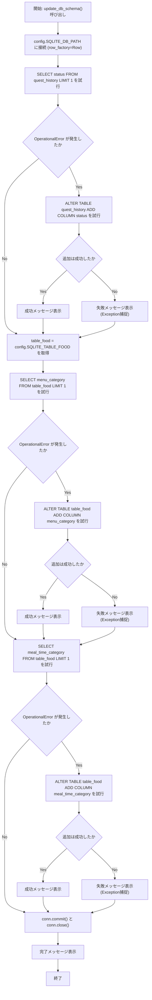
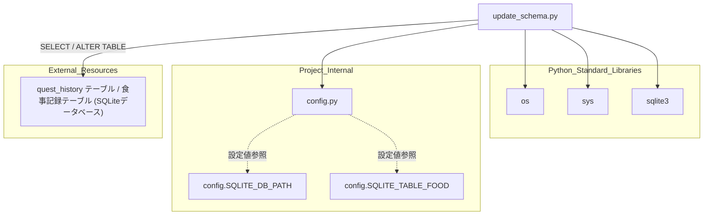

## 1. 解析メタ情報

| 項目 | 内容 |
| --- | --- |
| 対象ファイル | `update_schema.py` |
| 言語 | Python |
| 解析対象 | 提供されたコードのみ |
| 推測・補完 | 一切なし |

## 関連ドキュメント

* [config.md](./config.md) - `SQLITE_DB_PATH`および`SQLITE_TABLE_FOOD`を提供する設定モジュール
* [quest_service.md](./quest_service.md) - `quest_history`テーブルを扱う本番サービス側モジュールと推測され、本ファイルが追加する`status`カラムの利用先として関連
* [weekly_analyze_report.md](./weekly_analyze_report.md) - `config.SQLITE_TABLE_FOOD`を参照する食事記録関連モジュールで、`menu_category`・`meal_time_category`カラムの利用先として関連

## 2. ファイルの概要

`config.SQLITE_DB_PATH`のSQLiteデータベースに接続し、（1）`quest_history`テーブルに`status`カラム（デフォルト`'approved'`）を、（2）`config.SQLITE_TABLE_FOOD`で指定される食事記録テーブルに`menu_category`カラムおよび`meal_time_category`カラムを、それぞれ`SELECT`によるカラム存在確認を行った上で不足時のみ追加する`update_db_schema`関数を定義するスクリプト。モジュール直接実行時に`update_db_schema()`が呼び出される。

* 根拠: `[DB接続]` (行番号: 11 / 抜粋: "conn = sqlite3.connect(config.SQLITE_DB_PATH)")
* 根拠: `[quest_history.statusカラム追加]` (行番号: 18〜24 / 抜粋: "try:\n        cur.execute(\"SELECT status FROM quest_history LIMIT 1\")\n    except sqlite3.OperationalError:")
* 根拠: `[食事テーブルのmenu_category追加]` (行番号: 32, 36〜44 / 抜粋: "table_food = config.SQLITE_TABLE_FOOD" / "cur.execute(f\"SELECT menu_category FROM {table_food} LIMIT 1\")")
* 根拠: `[食事テーブルのmeal_time_category追加]` (行番号: 47〜55 / 抜粋: "cur.execute(f\"SELECT meal_time_category FROM {table_food} LIMIT 1\")")
* 根拠: `[main実行部]` (行番号: 61〜62 / 抜粋: "if __name__ == \"__main__\":\n    update_db_schema()")

## 3. 外部依存関係

### インポート一覧

| 名称 | 種類 | 用途 | 根拠 |
| --- | --- | --- | --- |
| `os` | 標準ライブラリ | 実行ファイルの絶対パス・ディレクトリ取得（`sys.path`への追加用） | 根拠: `[os.path.dirname(os.path.abspath(__file__))]` (行番号: 6 / 抜粋: "sys.path.append(os.path.dirname(os.path.abspath(__file__)))") |
| `sys` | 標準ライブラリ | モジュール検索パスへのカレントディレクトリ追加 | 根拠: `[sys.path.append]` (行番号: 6 / 抜粋: "sys.path.append(os.path.dirname(os.path.abspath(__file__)))") |
| `sqlite3` | 標準ライブラリ | SQLiteデータベースへの接続、`row_factory`設定、カーソル生成、SQL実行、`OperationalError`の捕捉 | 根拠: `[import sqlite3]` (行番号: 4 / 抜粋: "import sqlite3") |
| `config` | 内部モジュール | DB接続先パス(`SQLITE_DB_PATH`)および食事記録テーブル名(`SQLITE_TABLE_FOOD`)の提供元 | 根拠: `[import config]` (行番号: 7 / 抜粋: "import config") |

### ブラックボックスとなる外部要素

| 名称 | 理由 | 根拠 |
| --- | --- | --- |
| `config.SQLITE_DB_PATH` | `config`モジュールのソースコードが当ファイル内に存在せず、実際のDBパス文字列が不明であるため。 | 根拠: `[config.SQLITE_DB_PATH]` (行番号: 11 / 抜粋: "conn = sqlite3.connect(config.SQLITE_DB_PATH)") |
| `config.SQLITE_TABLE_FOOD` | `config`モジュールのソースコードが当ファイル内に存在せず、実際の食事記録テーブル名の文字列が不明であるため。 | 根拠: `[config.SQLITE_TABLE_FOOD]` (行番号: 32 / 抜粋: "table_food = config.SQLITE_TABLE_FOOD") |
| `quest_history`テーブルおよび食事記録テーブルの完全なスキーマ | いずれのテーブルも、当ファイル内では追加対象カラムの存在確認のみが行われており、テーブル全体の定義が存在しないため。 | 根拠: `[SELECT ... LIMIT 1]` (行番号: 19, 37, 48 / 抜粋: "cur.execute(\"SELECT status FROM quest_history LIMIT 1\")") |

## 4. 主要要素の定義（関数 / エンドポイント / コンポーネント）

### `update_db_schema`

* **役割**: `config.SQLITE_DB_PATH`のDBに接続し、`quest_history`テーブルへの`status`カラム追加、および`config.SQLITE_TABLE_FOOD`で指定されるテーブルへの`menu_category`・`meal_time_category`カラム追加を、いずれも`SELECT ... LIMIT 1`実行時の`sqlite3.OperationalError`発生有無によってカラムの存在を判定した上で、不足しているカラムのみ`ALTER TABLE`で追加する。
* 根拠: `[update_db_schema定義]` (行番号: 9 / 抜粋: "def update_db_schema():")
* 根拠: `[3種のカラム追加処理]` (行番号: 18〜55 / 抜粋: "cur.execute(\"SELECT status FROM quest_history LIMIT 1\")" / "cur.execute(f\"SELECT menu_category FROM {table_food} LIMIT 1\")" / "cur.execute(f\"SELECT meal_time_category FROM {table_food} LIMIT 1\")")

* **引数/リクエスト**: なし
* 根拠: `[関数シグネチャ]` (行番号: 9 / 抜粋: "def update_db_schema():")

* **戻り値/レスポンス**: なし。処理の進行状況は全て`print`により標準出力へ絵文字付きメッセージとして表示される。
* 根拠: `[print出力]` (行番号: 10, 21, 24, 33, 39, 42, 50, 53, 59 / 抜粋: "print(\"🛠️ Database Schema Update...\")")

* **副作用**: `sqlite3.connect`によるDB接続確立、`row_factory = sqlite3.Row`の設定、最大3種類の`ALTER TABLE`によるスキーマ変更、`conn.commit()`によるDB永続化、`conn.close()`によるDB接続クローズ。
* 根拠: `[connectとrow_factory]` (行番号: 11〜12 / 抜粋: "conn = sqlite3.connect(config.SQLITE_DB_PATH)\n    conn.row_factory = sqlite3.Row  # カラム名アクセス用（確認のため）")
* 根拠: `[commit/close]` (行番号: 57〜58 / 抜粋: "conn.commit()\n    conn.close()")

* **エラーハンドリング**: 3箇所それぞれで、まず`SELECT ... LIMIT 1`を`try`し`sqlite3.OperationalError`（カラム不在によるエラーと推定）を捕捉してカラム追加処理に進む二段構えの構造。各カラム追加自体もさらに内側の`try`/`except Exception`で個別に捕捉し、失敗してもエラーメッセージを表示するのみで処理を継続する（後続のカラム追加処理は中断されない）。関数全体を囲む`try`/`except`は存在しない。
* 根拠: `[二段構えのtry/except]` (行番号: 18〜26 / 抜粋: "try:\n        cur.execute(\"SELECT status FROM quest_history LIMIT 1\")\n    except sqlite3.OperationalError:\n        print(\"ℹ️ 'status' column missing in quest_history. Adding...\")\n        try:\n            cur.execute(\"ALTER TABLE quest_history ADD COLUMN status TEXT DEFAULT 'approved'\")")

## 5. 処理フロー図

## 6. 依存関係図

## 7. 次のステップ（リバースエンジニアリングの提案）

| 優先度 | ファイル名(推測可) | 理由 | 根拠 |
| --- | --- | --- | --- |
| 高 | `config.py` | `SQLITE_DB_PATH`および`SQLITE_TABLE_FOOD`の実際の値を確認するため。 | 根拠: `[config.SQLITE_DB_PATH, config.SQLITE_TABLE_FOOD]` (行番号: 11, 32 / 抜粋: "conn = sqlite3.connect(config.SQLITE_DB_PATH)") |
| 中 | `quest_service.py` | 追加された`quest_history.status`カラムが本番サービス側でどのように利用されるかを確認するため。 | 根拠: `[quest_history.statusカラム]` (行番号: 19, 23 / 抜粋: "cur.execute(\"SELECT status FROM quest_history LIMIT 1\")") |
| 中 | `weekly_analyze_report.py` | `config.SQLITE_TABLE_FOOD`で指定されるテーブルの`menu_category`・`meal_time_category`カラムが集計処理でどのように利用されるかを確認するため。 | 根拠: `[menu_category / meal_time_categoryカラム]` (行番号: 37, 41, 48, 52 / 抜粋: "cur.execute(f\"ALTER TABLE {table_food} ADD COLUMN menu_category TEXT\")") |

## 8. 保守上の注意点

* **f-stringによるSQL文の動的構築**: `table_food`（`config.SQLITE_TABLE_FOOD`由来）をf-stringでSQL文に直接埋め込んでおり、パラメータ化されたクエリを使用していない。値は設定モジュール由来のためユーザー入力ではないが、動的にテーブル名を組み込む構造自体は設計上の懸念点である。
* 根拠: `[f-stringによるSQL構築]` (行番号: 37, 41, 48, 52 / 抜粋: "cur.execute(f\"SELECT menu_category FROM {table_food} LIMIT 1\")")
* **「カラム不在」の判定を`OperationalError`全般で代用**: `SELECT column FROM table LIMIT 1`の実行失敗を「カラムが存在しない」ことの判定根拠としているが、`sqlite3.OperationalError`はテーブル自体が存在しない場合や他のSQL構文エラーでも発生し得るため、テーブル不在時にも「カラムが存在しない」と誤判定されカラム追加を試み、その`ALTER TABLE`も失敗して二重にエラーメッセージが表示される可能性がある。
* 根拠: `[OperationalErrorによる判定]` (行番号: 18〜20 / 抜粋: "try:\n        cur.execute(\"SELECT status FROM quest_history LIMIT 1\")\n    except sqlite3.OperationalError:")
* **多重の例外握りつぶし**: 各カラム追加処理が個別の`try`/`except Exception`で囲まれ、失敗してもメッセージ表示のみで処理が継続するため、一部のカラム追加に失敗しても関数全体としては「正常終了」したように見え、失敗を後から検知しにくい。
* 根拠: `[except Exception]` (行番号: 25〜26, 43〜44, 54〜55 / 抜粋: "except Exception as e:\n            print(f\"❌ Failed to add 'status' column: {e}\")")
* **`row_factory = sqlite3.Row`が実質未使用**: コメントで「カラム名アクセス用（確認のため）」と設定されているが、本ファイル内で`cur.fetchone()`等の結果からカラム名アクセス（辞書的アクセス）を行っている箇所は見当たらない。
* 根拠: `[row_factory設定とコメント]` (行番号: 12 / 抜粋: "conn.row_factory = sqlite3.Row  # カラム名アクセス用（確認のため）")

## 9. 不明事項一覧

| 項目 | 理由 | 必要なファイル |
| --- | --- | --- |
| `config.SQLITE_DB_PATH`・`config.SQLITE_TABLE_FOOD`の実際の値 | `config`モジュールのソースコードが当ファイル内に存在しないため。 | `config.py` |
| `quest_history`テーブルおよび食事記録テーブルの完全なスキーマ | 対象カラムの存在確認のみが行われており、テーブル全体の定義が当ファイル内には存在しないため。 | `init_unified_db.py`等のスキーマ定義ファイル |
| 追加された`status`・`menu_category`・`meal_time_category`カラムの実際の利用箇所 | どのモジュールがこれらのカラムを読み書きするかは当ファイルからは判断できないため。 | `quest_service.py`、`weekly_analyze_report.py`等 |

## 10. 自己検証結果

* [x] 推測・外部ファイルの仕様を一切含んでいない（完了）
* [x] 全関数・全クラス・全コンポーネントを列挙した（完了）
* [x] 全てのインポート要素を列挙した（完了）
* [x] すべての仕様説明に「根拠（行番号・抜粋）」を明記した（完了）
* [x] 根拠漏れが0件である（完了）
* [x] Mermaid構文にエラーの原因となる記号（エスケープ漏れ）がない（完了）
* [x] 不明事項を漏れなく列挙した（完了）
