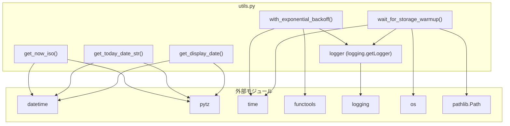

## 1. 解析メタ情報

| 項目 | 内容 |
| --- | --- |
| 対象ファイル | utils.py |
| 言語 | Python |
| 解析対象 | 提供されたコードのみ |
| 推測・補完 | 一切なし |

## 2. ファイルの概要

* システム全体で共通して使用されるユーティリティ関数群を提供する。
* "Asia/Tokyo" タイムゾーンに基づいた現在日時の取得処理を提供する。
* ネットワーク障害やストレージの復帰遅延など、一時的な障害に対する指数関数的バックオフを用いたリトライ機能を提供する。

## 3. 外部依存関係

### インポート一覧

| 名称 | 種類 | 用途 | 根拠 |
| --- | --- | --- | --- |
| `datetime` | 標準ライブラリ | 現在日時の取得、フォーマット変換 | 根拠: [import文] (行番号: 1 / 抜粋: "import datetime") |
| `pytz` | 外部ライブラリ | タイムゾーンの指定("Asia/Tokyo") | 根拠: [import文] (行番号: 2 / 抜粋: "import pytz") |
| `time` | 標準ライブラリ | リトライ時の待機(`time.sleep`) | 根拠: [import文] (行番号: 3 / 抜粋: "import time") |
| `functools` | 標準ライブラリ | デコレータの作成(`functools.wraps`) | 根拠: [import文] (行番号: 4 / 抜粋: "import functools") |
| `logging` | 標準ライブラリ | ロガーの取得とログ出力 | 根拠: [import文] (行番号: 5 / 抜粋: "import logging") |
| `os` | 標準ライブラリ | アクセス権限のチェック(`os.access`) | 根拠: [import文] (行番号: 6 / 抜粋: "import os") |
| `pathlib.Path` | 標準ライブラリ | ファイル・ディレクトリパスの操作 | 根拠: [import文] (行番号: 7 / 抜粋: "from pathlib import Path") |
| `typing.Callable`, `Any`, `Union` | 標準ライブラリ | 型ヒントの定義 | 根拠: [import文] (行番号: 8 / 抜粋: "from typing import Callable, A...") |

### ブラックボックスとなる外部要素

| 名称 | 理由 | 根拠 |
| --- | --- | --- |
| 該当なし | ファイル内の処理は標準ライブラリおよび`pytz`のみで完結しているため。 | 根拠: [インポート一覧] (行番号: 1〜8 / 抜粋: "import datetime...") |

## 4. 主要要素の定義（関数 / エンドポイント / コンポーネント）

### `get_now_iso`

* **役割**: "Asia/Tokyo" タイムゾーンの現在日時をISO 8601形式の文字列で返す。
* 根拠: [get_now_iso] (行番号: 12〜13 / 抜粋: "return datetime.datetime.now(p...")

* **引数/リクエスト**: なし
* 根拠: [get_now_iso] (行番号: 12 / 抜粋: "def get_now_iso() -> str:")

* **戻り値/レスポンス**: `str`。ISO 8601形式の日時文字列。
* 根拠: [get_now_iso] (行番号: 12 / 抜粋: "def get_now_iso() -> str:")

* **副作用**: なし
* 根拠: [get_now_iso] (行番号: 12〜13 / 抜粋: "return datetime.datetime.now(p...")

* **エラーハンドリング**: なし
* 根拠: [get_now_iso] (行番号: 12〜13 / 抜粋: "return datetime.datetime.now(p...")

### `get_today_date_str`

* **役割**: "Asia/Tokyo" タイムゾーンの現在日時を "YYYY-MM-DD" 形式の文字列で返す。
* 根拠: [get_today_date_str] (行番号: 15〜16 / 抜粋: "return datetime.datetime.now(p...")

* **引数/リクエスト**: なし
* 根拠: [get_today_date_str] (行番号: 15 / 抜粋: "def get_today_date_str() -> st...")

* **戻り値/レスポンス**: `str`。"YYYY-MM-DD" 形式の日付文字列。
* 根拠: [get_today_date_str] (行番号: 15 / 抜粋: "def get_today_date_str() -> st...")

* **副作用**: なし
* 根拠: [get_today_date_str] (行番号: 15〜16 / 抜粋: "return datetime.datetime.now(p...")

* **エラーハンドリング**: なし
* 根拠: [get_today_date_str] (行番号: 15〜16 / 抜粋: "return datetime.datetime.now(p...")

### `get_display_date`

* **役割**: "Asia/Tokyo" タイムゾーンの現在日時を "MM/DD" 形式の文字列で返す。
* 根拠: [get_display_date] (行番号: 18〜19 / 抜粋: "return datetime.datetime.now(p...")

* **引数/リクエスト**: なし
* 根拠: [get_display_date] (行番号: 18 / 抜粋: "def get_display_date() -> str:")

* **戻り値/レスポンス**: `str`。"MM/DD" 形式の日付文字列。
* 根拠: [get_display_date] (行番号: 18 / 抜粋: "def get_display_date() -> str:")

* **副作用**: なし
* 根拠: [get_display_date] (行番号: 18〜19 / 抜粋: "return datetime.datetime.now(p...")

* **エラーハンドリング**: なし
* 根拠: [get_display_date] (行番号: 18〜19 / 抜粋: "return datetime.datetime.now(p...")

### `with_exponential_backoff`

* **役割**: 関数実行時の例外を捕捉し、指数関数的バックオフを用いて無限にリトライ処理を行うデコレータを返す。
* 根拠: [with_exponential_backoff] (行番号: 33〜51 / 抜粋: "while True: ... except Excepti...")

* **引数/リクエスト**:
* `base_delay` (`int`): 初回のリトライ待機時間（秒）。デフォルトは5。
* `max_delay` (`int`): 最大待機時間の上限（秒）。デフォルトは300。
* `alert_threshold` (`int`): エラーログのレベルをERRORに引き上げる基準となる連続失敗回数。デフォルトは5。
* 根拠: [with_exponential_backoff] (行番号: 21〜24 / 抜粋: "base_delay: int = 5, ... alert...")

* **戻り値/レスポンス**: `Callable`。対象の関数をラップしたデコレータ関数。
* 根拠: [with_exponential_backoff] (行番号: 25 / 抜粋: ") -> Callable:")

* **副作用**: 失敗回数に応じて `logger.warning` または `logger.error` によりログが出力され、`time.sleep` でスレッドが一時停止する。
* 根拠: [wrapper内部] (行番号: 44〜49 / 抜粋: "logger.error(...) ... time.sle...")

* **エラーハンドリング**: デコレートされた関数で発生したすべての `Exception` をキャッチし、リトライを行う。
* 根拠: [wrapper内部] (行番号: 40 / 抜粋: "except Exception as e:")

### `wait_for_storage_warmup`

* **役割**: 対象のファイルまたはディレクトリが存在し、読み書きアクセスが可能になるまで指数関数的バックオフを用いて待機する。
* 根拠: [wait_for_storage_warmup] (行番号: 75〜90 / 抜粋: "if check_target.exists() and o...")

* **引数/リクエスト**:
* `target_path` (`Union[str, Path]`): アクセスを確認する対象のパス。
* `max_retries` (`int`): 最大リトライ回数。デフォルトは5。
* `base_delay` (`float`): 初回の待機時間（秒）。デフォルトは1.0。
* `max_delay` (`float`): 最大の待機時間（秒）。デフォルトは16.0。
* 根拠: [wait_for_storage_warmup] (行番号: 54〜58 / 抜粋: "target_path: Union[str, Path],...")

* **戻り値/レスポンス**: `bool`。指定回数内にアクセス可能となった場合は `True`、不可の場合は `False`。
* 根拠: [wait_for_storage_warmup] (行番号: 59 / 抜粋: ") -> bool:")

* **副作用**: チェックプロセス中および失敗時に `logger.info`, `logger.debug`, `logger.error` でログが出力される。また `time.sleep` によりスレッドが一時停止する。
* 根拠: [wait_for_storage_warmup] (行番号: 78〜91 / 抜粋: "logger.info(...) ... time.slee...")

* **エラーハンドリング**: 例外の捕捉は行われていない（`Path`の生成や`os.access`で発生する例外はそのままスローされる可能性がある）。パスが存在しない、あるいは権限がない場合はリトライを実施する。
* 根拠: [wait_for_storage_warmup] (行番号: 75〜92 / 抜粋: "for attempt in range(max_retri...")

## 5. 処理フロー図

```mermaid
flowchart TD
    %% with_exponential_backoff のフロー
    subgraph with_exponential_backoff_wrapper["with_exponential_backoff (wrapper)"]
        A[Start: 実行開始] --> B[attempt = 0]
        B --> C[対象関数を実行]
        C -- 成功 --> D[End: 戻り値を返す]
        C -- 例外発生 --> E[attempt += 1]
        E --> F[delay = min_max_delay, base_delay * 2^attempt-1]
        F --> G{attempt >= alert_threshold?}
        G -- Yes --> H[外部: logger.error]
        G -- No --> I[外部: logger.warning]
        H --> J[外部: time.sleep_delay]
        I --> J
        J --> C
    end

    %% wait_for_storage_warmup のフロー
    subgraph wait_for_storage_warmup["wait_for_storage_warmup"]
        S[Start: 関数呼び出し] --> T{target_pathはディレクトリか?}
        T -- Yes --> U[check_target = path_obj]
        T -- No --> V[check_target = path_obj.parent]
        U --> W[attempt = 0 から max_retries までループ]
        V --> W
        W --> X{check_targetが存在 & R/W権限あり?}
        X -- Yes --> Y{attempt > 0?}
        Y -- Yes --> Z[外部: logger.info]
        Y -- No --> AA[Return True]
        Z --> AA
        X -- No --> AB{attempt < max_retries?}
        AB -- Yes --> AC[delay = min_max_delay, base_delay * 2^attempt]
        AC --> AD[外部: logger.debug]
        AD --> AE[外部: time.sleep_delay]
        AE --> W
        AB -- No --> AF[外部: logger.error]
        AF --> AG[Return False]
    end

```

## 6. 依存関係図

## 7. 次のステップ（リバースエンジニアリングの提案）

| 優先度 | ファイル名(推測可) | 理由 | 根拠 |
| --- | --- | --- | --- |
| 高 | `utils.py` をインポートしている各モジュール（メインの処理ファイル） | これらの関数がシステム内のどこで、どのような目的・頻度で呼び出されているか特定するため。 | 根拠: [ファイル全体] (行番号: 1〜92 / 抜粋: 提供されたコードは汎用ユーティリティであり単独では動作しないため) |
| 高 | データベースアクセスや外部API呼び出しを実装しているファイル | `with_exponential_backoff` デコレータがどの関数に適用され、どのような例外が発生しうるのかを把握するため。 | 根拠: [with_exponential_backoff] (行番号: 40 / 抜粋: "except Exception as e:") |
| 中 | ファイルストレージ・NASへのアクセス処理を行うファイル | `wait_for_storage_warmup` 関数がどのパスに対して実行され、復帰遅延が発生しやすい環境がどこかを確認するため。 | 根拠: [wait_for_storage_warmup] (行番号: 54〜55 / 抜粋: "def wait_for_storage_warmup(ta...") |

## 8. 保守上の注意点

* `with_exponential_backoff` は `while True:` を用いており、関数が成功するまで無限にリトライを繰り返す仕様である。恒久的な障害が発生した場合、処理が永遠にブロックされる。
* `with_exponential_backoff` および `wait_for_storage_warmup` は `time.sleep()` を使用した同期的処理である。非同期フレームワーク（`asyncio`, `FastAPI`の非同期エンドポイントなど）で実行した場合、イベントループ全体をブロックする可能性がある。
* `wait_for_storage_warmup` では、`os.access` や `Path(target_path)` 自体が例外（権限エラー以外のOSレベルのエラーなど）を発生させた場合のハンドリングが実装されていない。

## 9. 不明事項一覧

| 項目 | 理由 | 必要なファイル |
| --- | --- | --- |
| 呼び出し元モジュールの特定 | ファイル単体では、どの箇所でこれらのユーティリティが使用されているか判断できない。 | プロジェクト全体のソースコード、またはインポートを追跡できる依存関係ツリー |
| 実行環境とパッケージのバージョン | `pytz`など外部パッケージのバージョン指定がなく、動作環境のPythonバージョンも特定できない。 | `requirements.txt`, `Pipfile`, `pyproject.toml` などの依存管理ファイル |

## 10. 自己検証結果

* [完了] 推測・外部ファイルの仕様を一切含んでいない
* [完了] 全関数・全クラス・全コンポーネントを列挙した
* [完了] 全てのインポート要素を列挙した
* [完了] すべての仕様説明に「根拠（行番号・抜粋）」を明記した
* [完了] 根拠漏れが0件である
* [完了] Mermaid構文にエラーの原因となる記号（エスケープ漏れ）がない
* [完了] 不明事項を漏れなく列挙した