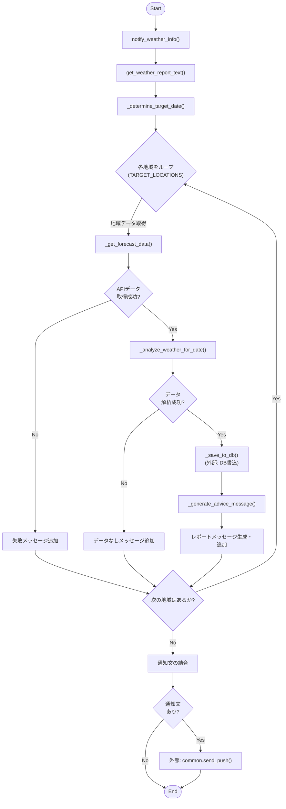
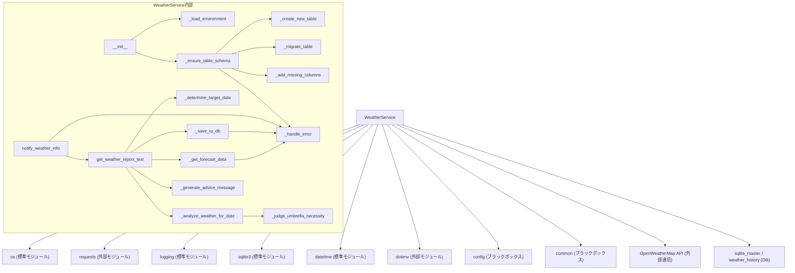

## 1. 解析メタ情報

| 項目 | 内容 |
| --- | --- |
| 対象ファイル | weather_service.py |
| 言語 | Python |
| 解析対象 | 提供されたコードのみ |
| 推測・補完 | 一切なし |

## 2. ファイルの概要

このファイルは、指定された地域（伊丹、高砂、奈良）の天気予報データをOpenWeatherMap APIから取得し、降水確率や気温などの情報を解析してSQLiteデータベースに保存する役割を持つ。さらに、取得したデータをもとに主婦向けの天気アドバイスを生成し、外部モジュールを通じてLINEやDiscord等のプラットフォームへ通知を送信する機能を担っている。

## 3. 外部依存関係

### インポート一覧

| 名称 | 種類 | 用途 | 根拠 |
| --- | --- | --- | --- |
| `os` | 標準 | パス操作および環境変数の取得 | 根拠: [import os] (行番号: 2 / 抜粋: "import os") |
| `requests` | 外部 | 天気予報APIへのHTTPリクエストの送信 | 根拠: [import requests] (行番号: 3 / 抜粋: "import requests") |
| `logging` | 標準 | エラーや処理状況のロギング | 根拠: [import logging] (行番号: 4 / 抜粋: "import logging") |
| `sqlite3` | 標準 | SQLiteデータベース操作および型定義 | 根拠: [import sqlite3] (行番号: 5 / 抜粋: "import sqlite3") |
| `datetime`, `timedelta` | 標準 | 現在時刻の取得および対象日時の計算 | 根拠: [from datetime import ...] (行番号: 6 / 抜粋: "from datetime import datetime") |
| `typing` | 標準 | 静的型チェックのための型ヒントの提供 | 根拠: [from typing import ...] (行番号: 7 / 抜粋: "from typing import List, Dict") |
| `load_dotenv` | 外部 | `.env`ファイルからの環境変数の読み込み | 根拠: [from dotenv import ...] (行番号: 8 / 抜粋: "from dotenv import load_dotenv") |
| `config` | 不明（自作） | 設定値（LINEのユーザーIDなど）の取得 | 根拠: [import config] (行番号: 10 / 抜粋: "import config") |
| `common` | 不明（自作） | DBカーソル取得やPush通知などの共通処理 | 根拠: [import common] (行番号: 11 / 抜粋: "import common") |

### ブラックボックスとなる外部要素

| 名称 | 理由 | 根拠 |
| --- | --- | --- |
| `config.LINE_USER_ID` | `config`モジュールの実装が提供されておらず、変数の値や型が不明 | 根拠: [common.send_push] (行番号取得不可 / 抜粋: "config.LINE_USER_ID,") |
| `common.get_db_cursor` | トランザクション管理やエラー時のロールバック仕様が不明 | 根拠: [common.get_db_cursor] (行番号取得不可 / 抜粋: "with common.get_db_cursor") |
| `common.send_push` | 通知失敗時の挙動や対応プラットフォームの全容が不明 | 根拠: [common.send_push] (行番号取得不可 / 抜粋: "common.send_push(") |
| `common.get_now_iso` | 返却されるISOフォーマットの正確な形式（タイムゾーンの有無など）が不明 | 根拠: [common.get_now_iso] (行番号取得不可 / 抜粋: "common.get_now_iso()") |

## 4. 主要要素の定義（関数 / エンドポイント / コンポーネント）

### `WeatherService`

* **役割**: 天気予報を取得し、データベースへの保存とユーザーへの通知を行うクラス全体を定義。
* 根拠: [WeatherService] (行番号取得不可 / 抜粋: "class WeatherService:")

### `__init__`

* **役割**: クラスの初期化。ベースディレクトリの設定、環境変数の読み込み、テーブルスキーマの確認を行う。
* 根拠: [**init**] (行番号取得不可 / 抜粋: "def **init**(self) -> None:")

* **引数/リクエスト**: `None` (`self` のみ)
* 根拠: [**init**] (行番号取得不可 / 抜粋: "def **init**(self) -> None:")

* **戻り値/レスポンス**: `None`
* 根拠: [**init**] (行番号取得不可 / 抜粋: "def **init**(self) -> None:")

* **副作用**: `_ensure_table_schema` 経由でのDBスキーマ変更の可能性。
* 根拠: [**init**] (行番号取得不可 / 抜粋: "self._ensure_table_schema()")

* **エラーハンドリング**: なし。

### `_load_environment`

* **役割**: `.env` ファイルを読み込み、OpenWeatherMapのAPIキーを取得・保持する。
* 根拠: [_load_environment] (行番号取得不可 / 抜粋: "def _load_environment(self)")

* **引数/リクエスト**: `None`
* 根拠: [_load_environment] (行番号取得不可 / 抜粋: "def _load_environment(self) -> None:")

* **戻り値/レスポンス**: `None`
* 根拠: [_load_environment] (行番号取得不可 / 抜粋: "def _load_environment(self) -> None:")

* **副作用**: `self.api_key` に環境変数の値を代入。
* 根拠: [_load_environment] (行番号取得不可 / 抜粋: "self.api_key = os.getenv(")

* **エラーハンドリング**: APIキーがない場合、警告ログを出力する。
* 根拠: [_load_environment] (行番号取得不可 / 抜粋: "logger.warning("OpenWeatherMap")

### `_ensure_table_schema`

* **役割**: データベースに `weather_history` テーブルが存在するか確認し、未存在の場合は新規作成、構造が古い場合はマイグレーションまたはカラム追加を行う。
* 根拠: [_ensure_table_schema] (行番号取得不可 / 抜粋: "def _ensure_table_schema(self)")

* **引数/リクエスト**: `None`
* 根拠: [_ensure_table_schema] (行番号取得不可 / 抜粋: "def _ensure_table_schema(self) -> None:")

* **戻り値/レスポンス**: `None`
* 根拠: [_ensure_table_schema] (行番号取得不可 / 抜粋: "def _ensure_table_schema(self) -> None:")

* **副作用**: DBへのテーブル作成、スキーマ変更等のDDL実行。
* 根拠: [_ensure_table_schema] (行番号取得不可 / 抜粋: "self._create_new_table(cursor)")

* **エラーハンドリング**: 例外発生時、`_handle_error` メソッドを呼び出してエラーログと通知を行う。
* 根拠: [_ensure_table_schema] (行番号取得不可 / 抜粋: "except Exception as e:")

### `_create_new_table`

* **役割**: `weather_history` テーブルを新規作成するためのSQL文を実行する。
* 根拠: [_create_new_table] (行番号取得不可 / 抜粋: "CREATE TABLE IF NOT EXISTS")

* **引数/リクエスト**: `cursor` (`sqlite3.Cursor`)
* 根拠: [_create_new_table] (行番号取得不可 / 抜粋: "def _create_new_table(self, cursor: sqlite3.Cursor)")

* **戻り値/レスポンス**: `None`
* 根拠: [_create_new_table] (行番号取得不可 / 抜粋: "def _create_new_table(self, cursor: sqlite3.Cursor) -> None:")

* **副作用**: DBへのテーブル作成。
* 根拠: [_create_new_table] (行番号取得不可 / 抜粋: "cursor.execute(sql)")

* **エラーハンドリング**: なし（呼び出し元に委譲）。

### `_add_missing_columns`

* **役割**: `weather_history` テーブルの既存カラムを確認し、不足しているカラム（`location`, `max_pop`, `umbrella_level`）を追加する。
* 根拠: [_add_missing_columns] (行番号取得不可 / 抜粋: "def _add_missing_columns(self,")

* **引数/リクエスト**: `cursor` (`sqlite3.Cursor`)
* 根拠: [_add_missing_columns] (行番号取得不可 / 抜粋: "def _add_missing_columns(self, cursor: sqlite3.Cursor)")

* **戻り値/レスポンス**: `None`
* 根拠: [_add_missing_columns] (行番号取得不可 / 抜粋: "def _add_missing_columns(self, cursor: sqlite3.Cursor) -> None:")

* **副作用**: DBへのカラム追加（ALTER TABLE実行）。
* 根拠: [_add_missing_columns] (行番号取得不可 / 抜粋: "cursor.execute("ALTER TABLE")

* **エラーハンドリング**: 例外発生時、警告ログを出力して処理を続行する。
* 根拠: [_add_missing_columns] (行番号取得不可 / 抜粋: "logger.warning(f"Column add")

### `_migrate_table`

* **役割**: 複合ユニーク制約を再設定するために、一時テーブルを利用してテーブルを再作成し、データを移行する。
* 根拠: [_migrate_table] (行番号取得不可 / 抜粋: "def _migrate_table(self, cursor")

* **引数/リクエスト**: `cursor` (`sqlite3.Cursor`)
* 根拠: [_migrate_table] (行番号取得不可 / 抜粋: "def _migrate_table(self, cursor: sqlite3.Cursor)")

* **戻り値/レスポンス**: `None`
* 根拠: [_migrate_table] (行番号取得不可 / 抜粋: "def _migrate_table(self, cursor: sqlite3.Cursor) -> None:")

* **副作用**: テーブルのDROP、RENAME、CREATE、およびデータ移行のINSERT実行。
* 根拠: [_migrate_table] (行番号取得不可 / 抜粋: "cursor.execute("DROP TABLE IF")

* **エラーハンドリング**: 例外発生時、そのまま例外を再送出（`raise e`）する。
* 根拠: [_migrate_table] (行番号取得不可 / 抜粋: "raise e")

### `_handle_error`

* **役割**: エラーメッセージをログ出力し、Discordチャンネルへエラー通知を送信する。
* 根拠: [_handle_error] (行番号取得不可 / 抜粋: "def _handle_error(self, message")

* **引数/リクエスト**: `message` (`str`)
* 根拠: [_handle_error] (行番号取得不可 / 抜粋: "def _handle_error(self, message: str)")

* **戻り値/レスポンス**: `None`
* 根拠: [_handle_error] (行番号取得不可 / 抜粋: "def _handle_error(self, message: str) -> None:")

* **副作用**: エラーログの出力、外部モジュール経由でのDiscord通知。
* 根拠: [_handle_error] (行番号取得不可 / 抜粋: "common.send_push(")

* **エラーハンドリング**: 通知の送信に失敗した場合は例外を握りつぶす（`pass`）。
* 根拠: [_handle_error] (行番号取得不可 / 抜粋: "except Exception:\n            pass")

### `get_weather_report_text`

* **役割**: 各監視対象地域の天気を取得・解析・DB保存し、通知用のレポートテキストを生成する。
* 根拠: [get_weather_report_text] (行番号取得不可 / 抜粋: "def get_weather_report_text(self")

* **引数/リクエスト**: `None`
* 根拠: [get_weather_report_text] (行番号取得不可 / 抜粋: "def get_weather_report_text(self) -> str:")

* **戻り値/レスポンス**: `str` (生成された天気レポートの文字列)
* 根拠: [get_weather_report_text] (行番号取得不可 / 抜粋: "def get_weather_report_text(self) -> str:")

* **副作用**: 外部APIへのリクエスト送信（`_get_forecast_data`）、DBへのデータ書き込み（`_save_to_db`）、情報ログ出力。
* 根拠: [get_weather_report_text] (行番号取得不可 / 抜粋: "if not self._save_to_db(summary)")

* **エラーハンドリング**: 取得失敗時、保存失敗時、データなし時にそれぞれエラーログまたはレポート上のメッセージを追加して処理を継続する。
* 根拠: [get_weather_report_text] (行番号取得不可 / 抜粋: "reports.append(f"❌ {name}: 情報取得に失敗")

### `notify_weather_info`

* **役割**: `get_weather_report_text` で生成したレポートを外部サービス（デフォルトはLINE）へ通知する。
* 根拠: [notify_weather_info] (行番号取得不可 / 抜粋: "def notify_weather_info(self,")

* **引数/リクエスト**: `target` (`str`, デフォルト `"line"`)
* 根拠: [notify_weather_info] (行番号取得不可 / 抜粋: "target: str = "line"")

* **戻り値/レスポンス**: `None`
* 根拠: [notify_weather_info] (行番号取得不可 / 抜粋: "def notify_weather_info(self, target: str = "line") -> None:")

* **副作用**: 外部へのPush通知。
* 根拠: [notify_weather_info] (行番号取得不可 / 抜粋: "common.send_push(")

* **エラーハンドリング**: 通知送信失敗時、`_handle_error` でエラーログと通知を実行する。
* 根拠: [notify_weather_info] (行番号取得不可 / 抜粋: "except Exception as e:")

### `_determine_target_date`

* **役割**: 実行時刻が17時以降であれば「明日」、それ以前であれば「今日」を対象日付として決定する。
* 根拠: [_determine_target_date] (行番号取得不可 / 抜粋: "def _determine_target_date(self)")

* **引数/リクエスト**: `None`
* 根拠: [_determine_target_date] (行番号取得不可 / 抜粋: "def _determine_target_date(self) -> Tuple[datetime, str]:")

* **戻り値/レスポンス**: `Tuple[datetime, str]` (対象日時のオブジェクト、"今日"または"明日"のラベル文字列)
* 根拠: [_determine_target_date] (行番号取得不可 / 抜粋: "return target_date, date_label")

* **副作用**: 現在時刻の取得。
* 根拠: [_determine_target_date] (行番号取得不可 / 抜粋: "now = datetime.now()")

* **エラーハンドリング**: なし。

### `_get_forecast_data`

* **役割**: OpenWeatherMap APIに対してHTTPリクエストを送信し、天気予報データをJSON形式で取得する。
* 根拠: [_get_forecast_data] (行番号取得不可 / 抜粋: "def _get_forecast_data(self,")

* **引数/リクエスト**: `lat` (`float`), `lon` (`float`)
* 根拠: [_get_forecast_data] (行番号取得不可 / 抜粋: "def _get_forecast_data(self, lat: float, lon: float)")

* **戻り値/レスポンス**: `Optional[Dict[str, Any]]` (APIのレスポンスデータ、または失敗時 `None`)
* 根拠: [_get_forecast_data] (行番号取得不可 / 抜粋: "-> Optional[Dict[str, Any]]:")

* **副作用**: 外部APIへの通信。
* 根拠: [_get_forecast_data] (行番号取得不可 / 抜粋: "res = requests.get(self.API_URL")

* **エラーハンドリング**: APIキー未設定時は `None` を返す。通信エラーやステータスコードエラー時は `_handle_error` を呼び出し `None` を返す。
* 根拠: [_get_forecast_data] (行番号取得不可 / 抜粋: "except requests.exceptions.RequestException")

### `_analyze_weather_for_date`

* **役割**: APIから取得したデータから対象日の情報を抽出し、最高/最低気温、降水確率、天気、傘の必要性を集計する。
* 根拠: [_analyze_weather_for_date] (行番号取得不可 / 抜粋: "def _analyze_weather_for_date(")

* **引数/リクエスト**: `data` (`Dict[str, Any]`), `location_name` (`str`), `target_date_str` (`str`)
* 根拠: [_analyze_weather_for_date] (行番号取得不可 / 抜粋: "def _analyze_weather_for_date(self, data: Dict[str, Any], location_name: str, target_date_str: str)")

* **戻り値/レスポンス**: `Optional[Dict[str, Any]]` (集計されたサマリー情報、データなし時 `None`)
* 根拠: [_analyze_weather_for_date] (行番号取得不可 / 抜粋: "-> Optional[Dict[str, Any]]:")

* **副作用**: なし。
* 根拠: [_analyze_weather_for_date] (行番号取得不可 / 抜粋: "return {")

* **エラーハンドリング**: 対象日のデータがない場合、直近8件のデータを利用するフォールバック処理を行う。それでもない場合は `None` を返す。
* 根拠: [_analyze_weather_for_date] (行番号取得不可 / 抜粋: "if not forecasts_for_target_date:")

### `_judge_umbrella_necessity`

* **役割**: 最大降水確率と天気IDをもとに、傘の必要性を判定する。
* 根拠: [_judge_umbrella_necessity] (行番号取得不可 / 抜粋: "def _judge_umbrella_necessity(")

* **引数/リクエスト**: `max_pop` (`int`), `weather_ids` (`List[int]`)
* 根拠: [_judge_umbrella_necessity] (行番号取得不可 / 抜粋: "def _judge_umbrella_necessity(self, max_pop: int, weather_ids: List[int])")

* **戻り値/レスポンス**: `str` ("必須", "あるほうがいい", "不要" のいずれか)
* 根拠: [_judge_umbrella_necessity] (行番号取得不可 / 抜粋: "-> str:")

* **副作用**: なし。
* 根拠: [_judge_umbrella_necessity] (行番号取得不可 / 抜粋: "return "必須"")

* **エラーハンドリング**: なし。

### `_generate_advice_message`

* **役割**: 集計された天気情報に基づいて、主婦向けのメッセージ文（傘や気温に関するアドバイス）を生成する。
* 根拠: [_generate_advice_message] (行番号取得不可 / 抜粋: "def _generate_advice_message(se")

* **引数/リクエスト**: `summary` (`Dict[str, Any]`)
* 根拠: [_generate_advice_message] (行番号取得不可 / 抜粋: "def _generate_advice_message(self, summary: Dict[str, Any]) -> str:")

* **戻り値/レスポンス**: `str` (アドバイス文)
* 根拠: [_generate_advice_message] (行番号取得不可 / 抜粋: "return msg")

* **副作用**: なし。
* 根拠: [_generate_advice_message] (行番号取得不可 / 抜粋: "msg = "しっかりした傘を"")

* **エラーハンドリング**: なし。

### `_save_to_db`

* **役割**: 集計されたサマリー情報をSQLiteデータベースにUpsert処理（挿入または更新）で保存する。
* 根拠: [_save_to_db] (行番号取得不可 / 抜粋: "def _save_to_db(self, summary: ")

* **引数/リクエスト**: `summary` (`Dict[str, Any]`)
* 根拠: [_save_to_db] (行番号取得不可 / 抜粋: "def _save_to_db(self, summary: Dict[str, Any]) -> bool:")

* **戻り値/レスポンス**: `bool` (保存成功時 `True`, 失敗時 `False`)
* 根拠: [_save_to_db] (行番号取得不可 / 抜粋: "-> bool:")

* **副作用**: DBへのデータ書き込み実行、情報ログの出力。
* 根拠: [_save_to_db] (行番号取得不可 / 抜粋: "cursor.execute(sql, vals)")

* **エラーハンドリング**: データベース操作で例外が発生した際、`_handle_error` を呼び出し `False` を返す。
* 根拠: [_save_to_db] (行番号取得不可 / 抜粋: "except Exception as e:")

## 5. 処理フロー図

## 6. 依存関係図

## 7. 次のステップ（リバースエンジニアリングの提案）

| 優先度 | ファイル名(推測可) | 理由 | 根拠 |
| --- | --- | --- | --- |
| 高 | `common.py` | DB接続におけるトランザクション制御やエラー時のロールバック挙動、および通知(`send_push`)の引数仕様とサポート対象を特定するため。 | 根拠: [commonモジュールの利用] (抜粋: "with common.get_db_cursor(com") |
| 中 | `config.py` | `LINE_USER_ID`などの設定値の内容や、本システム全体の設定管理方法を確認するため。 | 根拠: [configモジュールの利用] (抜粋: "config.LINE_USER_ID") |
| 低 | `.env` (環境設定ファイル) | `OPENWEATHER_API_KEY` 以外にシステムを動かすために必要な環境変数が隠れていないか確認するため。 | 根拠: [環境変数の読み込み] (抜粋: "dotenv_path = os.path.join") |

## 8. 保守上の注意点

* `_handle_error` メソッド内で `common.send_push` の実行時に例外が発生した場合、`pass` により例外が握りつぶされるため、通知エラーがログに記録されない。
* `_ensure_table_schema` 内での複合ユニーク制約の有無チェックが文字列マッチング (`"UNIQUE(date, location)"` と `"UNIQUE (date, location)"`) に依存しているため、SQLiteのバージョンやスペースの入り方等のフォーマット差異により、意図せずマイグレーション (`_migrate_table`) が実行される可能性がある。
* `_save_to_db` では `INSERT ... ON CONFLICT` 構文を利用している。これは SQLite 3.24.0 以降でサポートされている機能のため、古いバージョンでは構文エラーとなる。
* APIから取得するデータが0件（または指定した対象日付のデータがない）場合、直近8件のデータを利用するフォールバック処理が存在する。
* `_get_forecast_data` において、APIリクエスト失敗時は即座に `None` を返却し、リトライ処理は実装されていない。

## 9. 不明事項一覧

| 項目 | 理由 | 必要なファイル |
| --- | --- | --- |
| DB接続・トランザクションの詳細 | `common.get_db_cursor(commit=True)` の実装が不明であるため、エラー発生時に正しくロールバックされるか、接続が安全に閉じられるか判断不可。 | `common.py` |
| 外部通知 (`send_push`) の仕様 | `target="discord"` や `target="line"` 以外の指定可能な値、失敗時のリトライ有無やエラーコード処理などが不明。 | `common.py` |
| 設定値の詳細と型 | `config.LINE_USER_ID` にセットされている値やデータ型が不明。 | `config.py` |

## 10. 自己検証結果

* [x] 推測・外部ファイルの仕様を一切含んでいない
* [x] 全関数・全クラス・全コンポーネントを列挙した
* [x] 全てのインポート要素を列挙した
* [x] すべての仕様説明に「根拠（行番号・抜粋）」を明記した
* [x] 根拠漏れが0件である
* [x] Mermaid構文にエラーの原因となる記号（エスケープ漏れ）がない
* [x] 不明事項を漏れなく列挙した

完了