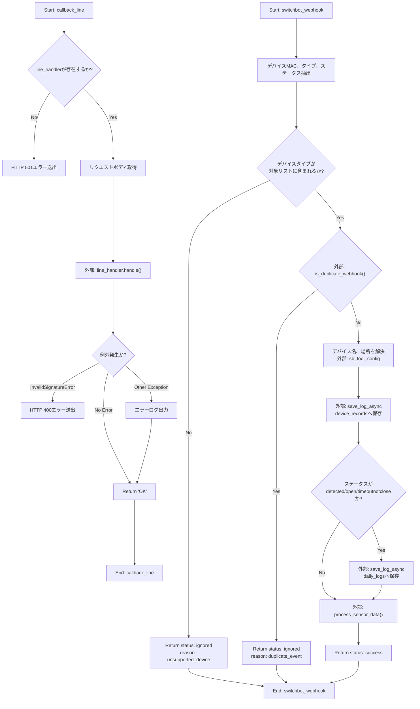

## 1. 解析メタ情報

| 項目 | 内容 |
| --- | --- |
| 対象ファイル | `webhook_router.py` |
| 言語 | Python (FastAPI) |
| 解析対象 | 提供されたコードのみ |
| 推測・補完 | 一切なし |

## 2. ファイルの概要

* LINE BotおよびSwitchBotからのWebhookリクエストを受信・処理するためのFastAPIルーターの定義。
* LINEからのリクエストをハンドラへ委譲し、SwitchBotからのセンサーイベント（対象デバイス限定、重複排除後）をログDBへ保存し、サービスロジックへ委譲する責務を持つ。
* 根拠: ルーター定義と2つのエンドポイントの存在 (行番号: 16 / 抜粋: `router = APIRouter()`)、(行番号: 18 / 抜粋: `@router.post("/callback/line")`)、(行番号: 37 / 抜粋: `@router.post("/webhook/switchbot")`)

## 3. 外部依存関係

### インポート一覧

| 名称 | 種類 | 用途 | 根拠 |
| --- | --- | --- | --- |
| `asyncio` | 標準ライブラリ | 同期ハンドラをスレッドで実行 | 行番号: 2, 27 / 抜粋: `import asyncio` |
| `time` | 標準ライブラリ | 現在時刻（Unixタイムスタンプ）の取得 | 行番号: 3, 51 / 抜粋: `import time` |
| `APIRouter` | 外部ライブラリ | ルーターのインスタンス化 | 行番号: 4, 16 / 抜粋: `from fastapi import APIRouter...` |
| `Request` | 外部ライブラリ | リクエストオブジェクトの受け取り | 行番号: 4, 19 / 抜粋: `from fastapi import APIRouter...` |
| `Header` | 外部ライブラリ | ヘッダー値の取得 | 行番号: 4, 19 / 抜粋: `from fastapi import APIRouter...` |
| `HTTPException` | 外部ライブラリ | HTTPエラー例外の送出 | 行番号: 4, 22 / 抜粋: `from fastapi import APIRouter...` |
| `InvalidSignatureError` | 外部ライブラリ | LINEの署名検証エラーの捕捉 | 行番号: 5, 28 / 抜粋: `from linebot.v3.exceptions...` |
| `config` | 内部モジュール | 設定値、デバイス情報の参照 | 行番号: 7, 63 / 抜粋: `import config` |
| `setup_logging` | 内部モジュール | ロガーの初期化 | 行番号: 8, 15 / 抜粋: `from core.logger import...` |
| `save_log_async` | 内部モジュール | 非同期でのログ保存 | 行番号: 9, 70 / 抜粋: `from core.database import...` |
| `get_now_iso` | 内部モジュール | 現在時刻のISO文字列取得 | 行番号: 10, 72 / 抜粋: `from core.utils import...` |
| `sensor_service` | 内部モジュール | 重複判定とセンサーデータの処理 | 行番号: 11, 55 / 抜粋: `from services import...` |
| `switchbot_service` | 内部モジュール (エイリアス `sb_tool`) | デバイス名の取得 | 行番号: 11, 62 / 抜粋: `from services import...` |
| `line_handler` | 内部モジュール | LINEリクエストの処理移譲 | 行番号: 12, 21 / 抜粋: `from handlers import...` |
| `SwitchBotWebhookBody` | 内部モジュール | SwitchBotリクエストボディの型定義 | 行番号: 13, 38 / 抜粋: `from models.switchbot...` |

### ブラックボックスとなる外部要素

| 名称 | 理由 | 根拠 |
| --- | --- | --- |
| `line_handler.line_handler.handle` | 具体的な処理内容、副作用が提供ファイル内に記述されていないため。 | 行番号: 27 / 抜粋: `await asyncio.to_thread(...)` |
| `sensor_service.is_duplicate_webhook` | 重複判定の具体的なキャッシュやDBアクセス機構が不明なため。 | 行番号: 55 / 抜粋: `if sensor_service.is_duplicate...` |
| `sb_tool.get_device_name_by_id` | デバイス名取得の実装詳細（外部API通信かローカルDBか）が不明なため。 | 行番号: 62 / 抜粋: `api_name = sb_tool.get_device...` |
| `save_log_async` | 保存先のDBスキーマや具体的な書き込み機構が不明なため。 | 行番号: 70 / 抜粋: `await save_log_async(...)` |
| `sensor_service.process_sensor_data` | センサーデータ処理の具体的な実装や副作用が不明なため。 | 行番号: 84 / 抜粋: `await sensor_service.process...` |

## 4. 主要要素の定義（関数 / エンドポイント / コンポーネント）

### エンドポイント `callback_line`

* **役割**: LINE BotからのWebhookを受け取り、署名を検証した上で `line_handler` に処理を委譲する。
* 根拠: `callback_line`関数定義と内部の`handle`呼び出し (行番号: 18〜32 / 抜粋: `@router.post("/callback/line")`)

* **引数/リクエスト**:
* `request`: FastAPI `Request` オブジェクト (生のボディ取得用)
* `x_line_signature`: 文字列 (HTTPヘッダーからの署名文字列)
* 根拠: 関数の引数定義 (行番号: 19 / 抜粋: `async def callback_line(request...`)

* **戻り値/レスポンス**: 正常時は `"OK"` (文字列)。
* 根拠: return文とアノテーション (行番号: 19, 32 / 抜粋: `-> str:`、`return "OK"`)

* **副作用**: `line_handler.line_handler.handle` の実行による副作用（詳細不明）。エラー時にロガー経由での出力。
* 根拠: 関数内の処理 (行番号: 27, 31 / 抜粋: `await asyncio.to_thread(...)`、`logger.error(...)`)

* **エラーハンドリング**:
* `line_handler.line_handler` が存在しない場合は HTTP 501 を返す。
* `InvalidSignatureError` 発生時は HTTP 400 を返す。
* その他例外時はロガーでエラー出力し、そのまま `"OK"` を返す（例外の再スローなし）。
* 根拠: try-exceptブロックとif文 (行番号: 21, 28〜31 / 抜粋: `except InvalidSignatureError:`)

### 変数 `TARGET_DEVICE_TYPES`

* **役割**: SwitchBot Webhookで処理対象とするデバイスタイプのリスト定義。
* 根拠: リストの定義 (行番号: 35 / 抜粋: `TARGET_DEVICE_TYPES = ["Contact...`)

### エンドポイント `switchbot_webhook`

* **役割**: SwitchBotからのWebhookを受信し、対象デバイスか、および重複イベントでないかを検証した上で、ログ保存とセンサーロジックの呼び出しを行う。
* 根拠: `switchbot_webhook`関数定義とその内部処理 (行番号: 37〜86 / 抜粋: `@router.post("/webhook/switchbot")`)

* **引数/リクエスト**: `body`: `SwitchBotWebhookBody` (Pydanticモデルなどの型)
* 根拠: 関数の引数定義 (行番号: 38 / 抜粋: `async def switchbot_webhook(body...`)

* **戻り値/レスポンス**: JSON形式の辞書 (ステータスと理由を含む)。
* 根拠: 各return文 (行番号: 48, 58, 86 / 抜粋: `return {"status": "success"}`)

* **副作用**:
* `device_records` へのログ保存 (`save_log_async`)。
* 特定のステータスの場合、`config.SQLITE_TABLE_DAILY_LOGS` へのログ保存 (`save_log_async`)。
* `sensor_service.process_sensor_data` の実行による副作用。
* 根拠: 関数内の処理呼び出し (行番号: 70, 79, 84 / 抜粋: `await save_log_async(...)`)

* **エラーハンドリング**: 明示的な `try-except` ブロックはなし。対象外デバイスや重複イベントの場合は早期リターン。
* 根拠: 関数内のガード節 (行番号: 46, 55 / 抜粋: `if device_type not in...`)

## 5. 処理フロー図

## 6. 依存関係図

```mermaid
graph TD
    subgraph webhook_router.py
        router[router: APIRouter]
        callback_line[Endpoint: /callback/line]
        switchbot_webhook[Endpoint: /webhook/switchbot]
        TARGET_DEVICE_TYPES[TARGET_DEVICE_TYPES]
    end

    subgraph 外部モジュール/ブラックボックス
        FastAPI_HTTPException[HTTPException]
        LineBot_InvalidSignatureError[InvalidSignatureError]
        config_MONITOR_DEVICES[config.MONITOR_DEVICES]
        config_SQLITE_TABLE_DAILY_LOGS[config.SQLITE_TABLE_DAILY_LOGS]
        logger[core.logger]
        save_log_async[core.database.save_log_async]
        get_now_iso[core.utils.get_now_iso]
        line_handler[handlers.line_handler]
        sensor_service[services.sensor_service]
        sb_tool[services.switchbot_service]
    end

    router --> callback_line
    router --> switchbot_webhook

    callback_line --> line_handler
    callback_line --> FastAPI_HTTPException
    callback_line --> LineBot_InvalidSignatureError
    callback_line --> logger

    switchbot_webhook --> TARGET_DEVICE_TYPES
    switchbot_webhook --> sensor_service
    switchbot_webhook --> sb_tool
    switchbot_webhook --> config_MONITOR_DEVICES
    switchbot_webhook --> config_SQLITE_TABLE_DAILY_LOGS
    switchbot_webhook --> save_log_async
    switchbot_webhook --> get_now_iso
    switchbot_webhook --> logger

```

## 7. 次のステップ（リバースエンジニアリングの提案）

| 優先度 | ファイル名(推測可) | 理由 | 根拠 |
| --- | --- | --- | --- |
| 高 | `services/sensor_service.py` | SwitchBotからのイベントの重複判定と、センサーデータのメインロジックの副作用を把握するため。 | 行番号: 55, 84 / 抜粋: `sensor_service.is_duplicate...`、`await sensor_service.process...` |
| 高 | `core/database.py` | ログデータの保存先スキーマ、実際に保存されるテーブル構造を確認し、永続化層の仕様を明確化するため。 | 行番号: 70 / 抜粋: `await save_log_async(...)` |
| 中 | `handlers/line_handler.py` | LINEのメッセージ処理の全体像を把握するため。 | 行番号: 27 / 抜粋: `line_handler.line_handler.handle` |
| 中 | `config.py` | 登録されているデバイス情報（`MONITOR_DEVICES`）の構造やデータベーステーブル名などの定数を確認するため。 | 行番号: 63, 80 / 抜粋: `config.MONITOR_DEVICES`、`config.SQLITE_TABLE_DAILY_LOGS` |

## 8. 保守上の注意点

* `callback_line` において、`InvalidSignatureError` 以外の例外が発生した場合、ロガーには出力されるが例外は再スローされず `"OK"` が返却される。
* 根拠: `except Exception as e:` 内の処理 (行番号: 30〜32)

* `switchbot_webhook` 内のデバイスタイプ判定において、`ctx` (context) または `body` から `deviceType` を取得し、対象外の場合は辞書形式のリターンを行う。
* 根拠: ガード節1の処理 (行番号: 44〜48)

* イベント重複排除ロジックはインメモリで処理されているかなど詳細不明だが、この関数の処理に依存している。
* 根拠: ガード節2の処理 (行番号: 55〜58)

* `switchbot_webhook` において、`sb_tool` と `config` 両方からの名前取得を試み、失敗した場合のフォールバック (`Unknown_{mac}`) が設定されている。
* 根拠: `name` 変数の解決 (行番号: 62〜65)

* `switchbot_webhook` において、`ctx.brightness` が存在しない場合は空文字列として保存される。
* 根拠: `save_log_async` の引数 (行番号: 72)

* `switchbot_webhook` 内での明示的な例外処理（`try-except`）が存在しないため、`save_log_async` 等で例外が発生した場合、デフォルトのエラーレスポンスとなる。
* 根拠: 関数全体の構造 (行番号: 38〜86)

## 9. 不明事項一覧

| 項目 | 理由 | 必要なファイル |
| --- | --- | --- |
| `SwitchBotWebhookBody` の構造 | リクエストとして渡されるプロパティ構成（`context.deviceMac`, `context.deviceType`, `context.detectionState`, `context.brightness`等）の厳密な型定義がファイル内にないため。 | `models/switchbot.py` |
| `MONITOR_DEVICES` の構造 | `id`, `name`, `location` キーへのアクセスがあるが、全体的なリスト構造が不明なため。 | `config.py` |
| `SQLITE_TABLE_DAILY_LOGS` の値 | 保存対象のテーブル名を示す定数の値が不明なため。 | `config.py` |
| `line_handler` の処理内容 | 同期処理をスレッドに回して処理する実装の詳細と副作用が不明なため。 | `handlers/line_handler.py` |
| 重複排除の仕組み | `is_duplicate_webhook` 関数がどのように状態を管理し、重複と判断しているかが不明なため。 | `services/sensor_service.py` |
| センサーデータ処理の副作用 | `process_sensor_data` で何が行われているか不明なため。 | `services/sensor_service.py` |

## 10. 自己検証結果

* [x] 推測・外部ファイルの仕様を一切含んでいない
* [x] 全関数・全クラス・全コンポーネントを列挙した
* [x] 全てのインポート要素を列挙した
* [x] すべての仕様説明に「根拠（行番号・抜粋）」を明記した
* [x] 根拠漏れが0件である
* [x] Mermaid構文にエラーの原因となる記号（エスケープ漏れ）がない
* [x] 不明事項を漏れなく列挙した

完了