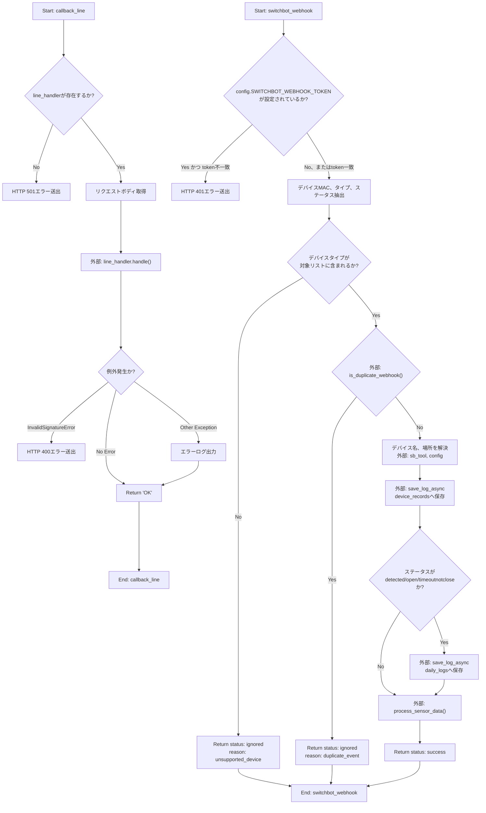

## 1. 解析メタ情報

| 項目 | 内容 |
| --- | --- |
| 対象ファイル | `webhook_router.py` |
| 言語 | Python (FastAPI) |
| 解析対象 | 提供されたコードのみ |
| 推測・補完 | 一切なし |

## 関連ドキュメント

- [unified_server.md](./unified_server.md) — 呼び出し元。本ルーターを`app.include_router`し、Webhook例外パス(`/webhook/switchbot`, `/callback/line`)を認識するミドルウェアを持つ
- [config.md](./config.md) — `MONITOR_DEVICES`, `SQLITE_TABLE_DAILY_LOGS`, `SWITCHBOT_WEBHOOK_TOKEN`等の設定値を提供
- [database.md](./database.md) — `core.database.save_log_async`の実体
- [sensor_service.md](./sensor_service.md) — `is_duplicate_webhook`, `process_sensor_data`の実装元
- [switchbot_service.md](./switchbot_service.md) — `get_device_name_by_id`の実装元
- [line_handler.md](./line_handler.md) — `line_handler.line_handler.handle`(LINE SDKのイベントディスパッチャ)の実装元
- [system_router.md](./system_router.md), [camera_router.md](./camera_router.md), [quest_router.md](./quest_router.md) — 同じFastAPIアプリにマウントされる姉妹ルーター群

## 2. ファイルの概要

* LINE BotおよびSwitchBotからのWebhookリクエストを受信・処理するためのFastAPIルーターの定義。
* LINEからのリクエストをハンドラへ委譲し、SwitchBotからのセンサーイベント（対象デバイス限定、重複排除後）をログDBへ保存し、サービスロジックへ委譲する責務を持つ。
* 根拠: ルーター定義と2つのエンドポイントの存在 (行番号: 17 / 抜粋: `router = APIRouter()`)、(行番号: 19 / 抜粋: `@router.post("/callback/line")`)、(行番号: 45 / 抜粋: `@router.post("/webhook/switchbot")`)
* コミット`94c2198`（H-4修正）により、SwitchBot公式Webhookペイロード形式（`context.deviceType`に`"WoContact"`/`"WoPresence"`等が入る形式）に対応した。`TARGET_DEVICE_TYPES`はデバイス一覧APIの語彙（`"Contact Sensor"`, `"Motion Sensor"`）と公式Webhookの語彙（`"WoContact"`, `"WoPresence"`）を併存させたsetに変更され、`device_type`の解決ロジックも`ctx.deviceType or getattr(body, "deviceType", None) or "Unknown"`という`or`連鎖に変更された（修正前の`getattr(ctx, "deviceType", ...)`はモデル上`deviceType`が常に定義済みの`Optional`フィールドだったため、デフォルト値が効かず常に`None`になるバグがあった）。
* 根拠: `TARGET_DEVICE_TYPES = {` (行番号: 40-43 / 抜粋: "TARGET_DEVICE_TYPES = {"), `device_type = ctx.deviceType or getattr(body, "deviceType", None) or "Unknown"` (行番号: 61 / 抜粋: "device_type = ctx.deviceType or getattr")

## 3. 外部依存関係

### インポート一覧

| 名称 | 種類 | 用途 | 根拠 |
| --- | --- | --- | --- |
| `asyncio` | 標準ライブラリ | 同期ハンドラをスレッドで実行 | 行番号: 2, 28 / 抜粋: `import asyncio` |
| `hmac` | 標準ライブラリ | SwitchBot Webhookの共有シークレット比較(タイミング攻撃耐性のある比較) | 行番号: 3, 52 / 抜粋: `import hmac` |
| `time` | 標準ライブラリ | 現在時刻（Unixタイムスタンプ）の取得 | 行番号: 4, 69 / 抜粋: `import time` |
| `APIRouter` | 外部ライブラリ | ルーターのインスタンス化 | 行番号: 5, 17 / 抜粋: `from fastapi import APIRouter...` |
| `Request` | 外部ライブラリ | リクエストオブジェクトの受け取り | 行番号: 5, 20 / 抜粋: `from fastapi import APIRouter...` |
| `Header` | 外部ライブラリ | ヘッダー値の取得 | 行番号: 5, 20 / 抜粋: `from fastapi import APIRouter...` |
| `HTTPException` | 外部ライブラリ | HTTPエラー例外の送出 | 行番号: 5, 23 / 抜粋: `from fastapi import APIRouter...` |
| `InvalidSignatureError` | 外部ライブラリ | LINEの署名検証エラーの捕捉 | 行番号: 6, 29 / 抜粋: `from linebot.v3.exceptions...` |
| `config` | 内部モジュール | 設定値、デバイス情報、SwitchBot Webhook共有シークレットの参照 | 行番号: 8, 51, 82 / 抜粋: `import config` |
| `setup_logging` | 内部モジュール | ロガーの初期化 | 行番号: 9, 16 / 抜粋: `from core.logger import...` |
| `save_log_async` | 内部モジュール | 非同期でのログ保存 | 行番号: 10, 88 / 抜粋: `from core.database import...` |
| `get_now_iso` | 内部モジュール | 現在時刻のISO文字列取得 | 行番号: 11, 90 / 抜粋: `from core.utils import...` |
| `sensor_service` | 内部モジュール | 重複判定とセンサーデータの処理 | 行番号: 12, 73 / 抜粋: `from services import...` |
| `switchbot_service` | 内部モジュール (エイリアス `sb_tool`) | デバイス名の取得 | 行番号: 12, 81 / 抜粋: `from services import...` |
| `line_handler` | 内部モジュール | LINEリクエストの処理移譲 | 行番号: 13, 22 / 抜粋: `from handlers import...` |
| `SwitchBotWebhookBody` | 内部モジュール | SwitchBotリクエストボディの型定義 | 行番号: 14, 46 / 抜粋: `from models.switchbot...` |

### ブラックボックスとなる外部要素

| 名称 | 理由 | 根拠 |
| --- | --- | --- |
| `line_handler.line_handler.handle` | 具体的な処理内容、副作用が提供ファイル内に記述されていないため。 | 行番号: 28 / 抜粋: `await asyncio.to_thread(...)` |
| `config.SWITCHBOT_WEBHOOK_TOKEN` | 実際のトークン値が`config.py`側の環境変数読み込みに依存し、本ファイルからは不明なため。 | 行番号: 51 / 抜粋: `if config.SWITCHBOT_WEBHOOK_TOKEN:` |
| `sensor_service.is_duplicate_webhook` | 重複判定の具体的なキャッシュやDBアクセス機構が不明なため。 | 行番号: 73 / 抜粋: `if sensor_service.is_duplicate...` |
| `sb_tool.get_device_name_by_id` | デバイス名取得の実装詳細（外部API通信かローカルDBか）が不明なため。 | 行番号: 81 / 抜粋: `api_name = sb_tool.get_device...` |
| `save_log_async` | 保存先のDBスキーマや具体的な書き込み機構が不明なため。 | 行番号: 88 / 抜粋: `await save_log_async(...)` |
| `sensor_service.process_sensor_data` | センサーデータ処理の具体的な実装や副作用が不明なため。 | 行番号: 102 / 抜粋: `await sensor_service.process...` |

## 4. 主要要素の定義（関数 / エンドポイント / コンポーネント）

### エンドポイント `callback_line`

* **役割**: LINE BotからのWebhookを受け取り、署名を検証した上で `line_handler` に処理を委譲する。
* 根拠: `callback_line`関数定義と内部の`handle`呼び出し (行番号: 19〜33 / 抜粋: `@router.post("/callback/line")`)

* **引数/リクエスト**:
* `request`: FastAPI `Request` オブジェクト (生のボディ取得用)
* `x_line_signature`: 文字列 (HTTPヘッダーからの署名文字列)
* 根拠: 関数の引数定義 (行番号: 20 / 抜粋: `async def callback_line(request...`)

* **戻り値/レスポンス**: 正常時は `"OK"` (文字列)。
* 根拠: return文とアノテーション (行番号: 20, 33 / 抜粋: `-> str:`、`return "OK"`)

* **副作用**: `line_handler.line_handler.handle` の実行による副作用（詳細不明）。エラー時にロガー経由での出力。
* 根拠: 関数内の処理 (行番号: 28, 32 / 抜粋: `await asyncio.to_thread(...)`、`logger.error(...)`)

* **エラーハンドリング**:
* `line_handler.line_handler` が存在しない場合は HTTP 501 を返す。
* `InvalidSignatureError` 発生時は HTTP 400 を返す。
* その他例外時はロガーでエラー出力し、そのまま `"OK"` を返す（例外の再スローなし）。
* 根拠: try-exceptブロックとif文 (行番号: 22, 29〜32 / 抜粋: `except InvalidSignatureError:`)

### 変数 `TARGET_DEVICE_TYPES`

* **役割**: SwitchBot Webhookで処理対象とするデバイスタイプの集合(`set`)定義。デバイス一覧API(`GET /devices`)の語彙(`"Contact Sensor"`, `"Motion Sensor"`)と、SwitchBot公式Webhookペイロードの語彙(`"WoContact"`, `"WoPresence"`)の両方を許容する（コミット`94c2198`, H-4修正で後者を追加。従来は前者のみのリストだったため、公式Webhook形式のペイロードが全て「対象外デバイス」として黙って捨てられていた）。
* 根拠: 集合の定義 (行番号: 40-43 / 抜粋: `TARGET_DEVICE_TYPES = {`)

### エンドポイント `switchbot_webhook`

* **役割**: SwitchBotからのWebhookを受信し、(設定されていれば)共有シークレットトークンを検証したうえで、対象デバイスか、および重複イベントでないかを検証し、ログ保存とセンサーロジックの呼び出しを行う。デバイスタイプの判定には`ctx.deviceType`(context直下、公式Webhook形式)を優先し、`None`の場合のみ`body.deviceType`(トップレベル)、それも無ければ`"Unknown"`にフォールバックする（コミット`94c2198`, H-4修正）。この解決済みの`device_type`変数は、`sensor_service.process_sensor_data`の第4引数にもそのまま渡される（#94修正: 以前はここで未解決の`body.deviceType`（公式Webhook形式では`context`側にのみ値が入るため常に`None`）を渡していたため、公式形式のモーションイベントが`process_sensor_data`側のMotion判定に到達せず、見守り通知・無反応監視タイマーが一切発火しなかった）。
* 根拠: `switchbot_webhook`関数定義とその内部処理 (行番号: 45〜107 / 抜粋: `@router.post("/webhook/switchbot")`), `await sensor_service.process_sensor_data(mac, name, location, device_type, state)` (行番号: 105)

* **引数/リクエスト**: `body`: `SwitchBotWebhookBody` (Pydanticモデルなどの型)、`token`: `str`（省略可、デフォルト`None`。クエリパラメータ `?token=...`）
* 根拠: 関数の引数定義 (行番号: 46 / 抜粋: `async def switchbot_webhook(body: SwitchBotWebhookBody, token: str = None):`)

* **戻り値/レスポンス**: JSON形式の辞書 (ステータスと理由を含む)。
* 根拠: 各return文 (行番号: 66, 76, 107 / 抜粋: `return {"status": "success"}`)

* **副作用**:
* `device_records` へのログ保存 (`save_log_async`)。
* 特定のステータスの場合、`config.SQLITE_TABLE_DAILY_LOGS` へのログ保存 (`save_log_async`)。
* `sensor_service.process_sensor_data` の実行による副作用（第4引数には61行目で解決済みの`device_type`を渡す。#94修正）。
* 根拠: 関数内の処理呼び出し (行番号: 88, 96, 105 / 抜粋: `await save_log_async(...)`)

* **エラーハンドリング**:
* `config.SWITCHBOT_WEBHOOK_TOKEN` が設定されている場合、クエリパラメータ `token` が一致しなければ HTTP 401 を送出する(`hmac.compare_digest`によるタイミング攻撃耐性のある比較)。未設定時は従来通り検証をスキップする(後方互換)。
* 対象外デバイスや重複イベントの場合は早期リターン。
* 明示的な `try-except` ブロックはそれ以外にはなし。
* 根拠: トークン検証 (行番号: 51〜53 / 抜粋: `if config.SWITCHBOT_WEBHOOK_TOKEN:`)、ガード節 (行番号: 64, 73 / 抜粋: `if device_type not in...`)

## 5. 処理フロー図

```mermaid
flowchart TD
    %% callback_lineのフロー
    StartLine["Start: callback_line"] --> CheckConfig{"line_handlerが存在するか?"}
    CheckConfig -->|"No"| Raise501["HTTP 501エラー送出"]
    CheckConfig -->|"Yes"| GetBody["リクエストボディ取得"]
    GetBody --> CallHandle["外部: line_handler.handle()"]
    CallHandle --> CheckError{"例外発生か?"}
    CheckError -->|"InvalidSignatureError"| Raise400["HTTP 400エラー送出"]
    CheckError -->|"Other Exception"| LogError["エラーログ出力"]
    CheckError -->|"No Error"| ReturnOK["Return 'OK'"]
    LogError --> ReturnOK
    ReturnOK --> EndLine["End: callback_line"]

    %% switchbot_webhookのフロー
    StartSB["Start: switchbot_webhook"] --> CheckToken{"config.SWITCHBOT_WEBHOOK_TOKEN<br>が設定されているか?"}
    CheckToken -->|"Yes かつ token不一致"| Raise401["HTTP 401エラー送出"]
    CheckToken -->|"No、またはtoken一致"| ExtractBody["デバイスMAC、タイプ、ステータス抽出"]
    ExtractBody --> CheckDeviceType{"デバイスタイプが<br>対象リストに含まれるか?"}
    CheckDeviceType -->|"No"| ReturnIgnored1["Return status: ignored<br>reason: unsupported_device"]
    CheckDeviceType -->|"Yes"| CheckDuplicate{"外部: is_duplicate_webhook()"}
    CheckDuplicate -->|"Yes"| ReturnIgnored2["Return status: ignored<br>reason: duplicate_event"]
    CheckDuplicate -->|"No"| ResolveDeviceInfo["デバイス名、場所を解決<br>外部: sb_tool, config"]
    ResolveDeviceInfo --> SaveLog1["外部: save_log_async<br>device_recordsへ保存"]
    SaveLog1 --> CheckState{"ステータスが<br>detected/open/timeoutnotcloseか?"}
    CheckState -->|"Yes"| SaveLog2["外部: save_log_async<br>daily_logsへ保存"]
    CheckState -->|"No"| CallSensorService["外部: process_sensor_data()"]
    SaveLog2 --> CallSensorService
    CallSensorService --> ReturnSuccess["Return status: success"]
    
    ReturnIgnored1 --> EndSB["End: switchbot_webhook"]
    ReturnIgnored2 --> EndSB
    ReturnSuccess --> EndSB

```

## 6. 依存関係図

```mermaid
graph TD
    subgraph webhook_router.py
        router[router: APIRouter]
        callback_line[Endpoint: /callback/line]
        switchbot_webhook[Endpoint: /webhook/switchbot]
        TARGET_DEVICE_TYPES[TARGET_DEVICE_TYPES]
    end

    subgraph 外部モジュール/ブラックボックス
        FastAPI_HTTPException[HTTPException]
        LineBot_InvalidSignatureError[InvalidSignatureError]
        hmac_module[hmac.compare_digest]
        config_MONITOR_DEVICES[config.MONITOR_DEVICES]
        config_SQLITE_TABLE_DAILY_LOGS[config.SQLITE_TABLE_DAILY_LOGS]
        config_SWITCHBOT_WEBHOOK_TOKEN[config.SWITCHBOT_WEBHOOK_TOKEN]
        logger[core.logger]
        save_log_async[core.database.save_log_async]
        get_now_iso[core.utils.get_now_iso]
        line_handler[handlers.line_handler]
        sensor_service[services.sensor_service]
        sb_tool[services.switchbot_service]
    end

    router --> callback_line
    router --> switchbot_webhook

    callback_line --> line_handler
    callback_line --> FastAPI_HTTPException
    callback_line --> LineBot_InvalidSignatureError
    callback_line --> logger

    switchbot_webhook --> TARGET_DEVICE_TYPES
    switchbot_webhook --> sensor_service
    switchbot_webhook --> sb_tool
    switchbot_webhook --> config_MONITOR_DEVICES
    switchbot_webhook --> config_SQLITE_TABLE_DAILY_LOGS
    switchbot_webhook --> config_SWITCHBOT_WEBHOOK_TOKEN
    switchbot_webhook --> hmac_module
    switchbot_webhook --> FastAPI_HTTPException
    switchbot_webhook --> save_log_async
    switchbot_webhook --> get_now_iso
    switchbot_webhook --> logger

```

## 7. 次のステップ（リバースエンジニアリングの提案）

| 優先度 | ファイル名(推測可) | 理由 | 根拠 |
| --- | --- | --- | --- |
| 高 | `services/sensor_service.py` | SwitchBotからのイベントの重複判定と、センサーデータのメインロジックの副作用を把握するため。 | 行番号: 73, 102 / 抜粋: `sensor_service.is_duplicate...`、`await sensor_service.process...` |
| 高 | `core/database.py` | ログデータの保存先スキーマ、実際に保存されるテーブル構造を確認し、永続化層の仕様を明確化するため。 | 行番号: 88 / 抜粋: `await save_log_async(...)` |
| 中 | `handlers/line_handler.py` | LINEのメッセージ処理の全体像を把握するため。 | 行番号: 28 / 抜粋: `line_handler.line_handler.handle` |
| 中 | `config.py` | 登録されているデバイス情報（`MONITOR_DEVICES`）の構造やデータベーステーブル名、`SWITCHBOT_WEBHOOK_TOKEN`などの定数を確認するため。 | 行番号: 51, 82, 96 / 抜粋: `config.SWITCHBOT_WEBHOOK_TOKEN`、`config.MONITOR_DEVICES`、`config.SQLITE_TABLE_DAILY_LOGS` |

## 8. 保守上の注意点

* `switchbot_webhook` は `config.SWITCHBOT_WEBHOOK_TOKEN` が未設定の場合、トークン検証を行わず従来通り動作する（後方互換のためのオプトイン設計）。設定時のみ `?token=...` クエリパラメータとの一致を `hmac.compare_digest` で検証し、不一致・未指定であれば HTTP 401 を返す。
* 根拠: トークン検証ブロック (行番号: 51〜53)

* `callback_line` において、`InvalidSignatureError` 以外の例外が発生した場合、ロガーには出力されるが例外は再スローされず `"OK"` が返却される。
* 根拠: `except Exception as e:` 内の処理 (行番号: 31〜32)

* **(コミット`94c2198`, H-4修正で解消)** 修正前は `device_type = getattr(ctx, "deviceType", getattr(body, "deviceType", "Unknown"))` という実装だったが、`SwitchBotContext.deviceType` がPydanticの`Optional`フィールドとして常に定義済みだったため`getattr`のデフォルト値が効かず、`ctx.deviceType`が未設定(`None`)の場合でも`getattr`は`None`をそのまま返し、`body.deviceType`側へのフォールバックが機能しなかった。加えて`TARGET_DEVICE_TYPES`はデバイス一覧APIの語彙のみだったため、SwitchBot公式Webhookのペイロード（`context.deviceType`に`"WoContact"`等が入る形式）は常に「対象外デバイス」として黙って捨てられていた。現在は`device_type = ctx.deviceType or getattr(body, "deviceType", None) or "Unknown"`という`or`連鎖に変更され、`TARGET_DEVICE_TYPES`も公式Webhook語彙を含むsetに拡張されている。
* 根拠: `device_type = ctx.deviceType or getattr(body, "deviceType", None) or "Unknown"` (行番号: 61 / 抜粋: "device_type = ctx.deviceType or getattr"), `TARGET_DEVICE_TYPES = {` (行番号: 40-43 / 抜粋: "TARGET_DEVICE_TYPES = {")

* `switchbot_webhook` 内のデバイスタイプ判定において、`ctx.deviceType`（優先）または`body.deviceType`から`deviceType`を取得し、対象外の場合は辞書形式のリターンを行う。
* 根拠: ガード節1の処理 (行番号: 58〜66)

* イベント重複排除ロジックはインメモリで処理されているかなど詳細不明だが、この関数の処理に依存している。
* 根拠: ガード節2の処理 (行番号: 73〜76)

* `switchbot_webhook` において、`sb_tool` と `config` 両方からの名前取得を試み、失敗した場合のフォールバック (`Unknown_{mac}`) が設定されている。
* 根拠: `name` 変数の解決 (行番号: 81〜85)

* `switchbot_webhook` において、`ctx.brightness` が存在しない場合は空文字列として保存される。
* 根拠: `save_log_async` の引数 (行番号: 90)

* `switchbot_webhook` 内での明示的な例外処理（`try-except`）が存在しないため、`save_log_async` 等で例外が発生した場合、デフォルトのエラーレスポンスとなる。
* 根拠: 関数全体の構造 (行番号: 45〜104)

## 9. 不明事項一覧

| 項目 | 理由 | 必要なファイル |
| --- | --- | --- |
| `SwitchBotWebhookBody` の構造 | リクエストとして渡されるプロパティ構成（`context.deviceMac`, `context.deviceType`, `context.detectionState`, `context.brightness`等）の厳密な型定義がファイル内にないため。 | `models/switchbot.py` |
| `MONITOR_DEVICES` の構造 | `id`, `name`, `location` キーへのアクセスがあるが、全体的なリスト構造が不明なため。 | `config.py` |
| `SQLITE_TABLE_DAILY_LOGS` の値 | 保存対象のテーブル名を示す定数の値が不明なため。 | `config.py` |
| `SWITCHBOT_WEBHOOK_TOKEN` の値・設定有無 | 環境変数として本番でどう設定されているか（未設定=検証なし、設定済み=検証あり）がファイル内からは不明なため。 | `config.py`, `.env` |
| `line_handler` の処理内容 | 同期処理をスレッドに回して処理する実装の詳細と副作用が不明なため。 | `handlers/line_handler.py` |
| 重複排除の仕組み | `is_duplicate_webhook` 関数がどのように状態を管理し、重複と判断しているかが不明なため。 | `services/sensor_service.py` |
| センサーデータ処理の副作用 | `process_sensor_data` で何が行われているか不明なため。 | `services/sensor_service.py` |

## 相互参照による補足情報

| 元の不明事項 | 判明した内容 | 参照元ドキュメント |
| --- | --- | --- |
| `SwitchBotWebhookBody` の構造 | `MY_HOME_SYSTEM/models/switchbot.py`(全33行)を直接確認した。`SwitchBotWebhookBody`(22〜27行目)は`eventType: str`, `eventVersion: str`, `context: SwitchBotContext`, `deviceType: Optional[str] = None`を持つPydanticモデル。ネストする`SwitchBotContext`(5〜20行目)は`deviceMac: str`(必須)に加え、コミット`94c2198`(H-4修正)で追加された`deviceType: Optional[str] = None`(12行目。公式Webhookでは`context`内に`"WoContact"`/`"WoPresence"`等が入る)、`detectionState`/`brightness: Optional[str] = None`、`timeOfSample: Optional[int] = None`、電力計向けの`power`/`voltage`/`weight`/`watt`フィールドを持つ。本ファイルがアクセスしている`context.deviceMac`, `context.deviceType`, `context.detectionState`, `context.brightness`は全て`SwitchBotContext`側のフィールドと一致することを確認した(`SwitchBotWebhookBody`直下にも同名の`deviceType`フィールドが独立して存在し、本ファイルはコンテキスト側を優先しつつこちらへフォールバックする)。 | 直接ソース確認: `MY_HOME_SYSTEM/models/switchbot.py:1-33` |
| `MONITOR_DEVICES` の構造 | `MY_HOME_SYSTEM/config.py`を直接確認した。298行目で`MONITOR_DEVICES: List[Dict[str, Any]] = []`として初期化され、307行目で`[DeviceConfig(**d).model_dump() for d in _devices_data["monitor_devices"]]`により`devices.json`の`monitor_devices`配列を`DeviceConfig`モデルでバリデーションした上でdictのリストとして格納される。`DeviceConfig`(159〜165行目)は`id: str, type: str, location: str, name: str, notify_settings: NotifySettings`(`default_factory`)を持つ。本ファイル82行目の`next((d for d in config.MONITOR_DEVICES if d.get("id") == mac), None)`によるid検索は、この`DeviceConfig.id`フィールドと一致することを確認した。 | 直接ソース確認: `MY_HOME_SYSTEM/config.py:159-165,296-307`（本ファイル内利用: `MY_HOME_SYSTEM/routers/webhook_router.py:82`） |
| `SQLITE_TABLE_DAILY_LOGS` の値 | `MY_HOME_SYSTEM/config.py:238`に`SQLITE_TABLE_DAILY_LOGS: str = "daily_logs"`とハードコードされていることを直接確認した。本ファイル96行目の`save_log_async(config.SQLITE_TABLE_DAILY_LOGS, ...)`はこの文字列`"daily_logs"`をテーブル名として使用している。 | 直接ソース確認: `MY_HOME_SYSTEM/config.py:238`（本ファイル内利用: `MY_HOME_SYSTEM/routers/webhook_router.py:96`） |
| `SWITCHBOT_WEBHOOK_TOKEN` の値・設定有無 | `MY_HOME_SYSTEM/config.py:191`に`SWITCHBOT_WEBHOOK_TOKEN: Optional[str] = os.getenv("SWITCHBOT_WEBHOOK_TOKEN")`と定義されていることを直接確認した。値は環境変数由来で未設定時は`None`となる。本ファイル自身の49〜52行目の`if config.SWITCHBOT_WEBHOOK_TOKEN: ... hmac.compare_digest(token, config.SWITCHBOT_WEBHOOK_TOKEN)`というロジックにより「設定されていれば検証、未設定ならスキップ」という後方互換設計であることは本ファイル単体からも確認できる。ただし実際の値自体は`.env`(gitignore対象)にのみ存在しうるものであり、`MY_HOME_SYSTEM/.env.example`を確認したが`SWITCHBOT_WEBHOOK_TOKEN`というキー自体が記載されておらず、具体的な値はリポジトリ内からは確認できなかった。 | 直接ソース確認: `MY_HOME_SYSTEM/config.py:191`（`MY_HOME_SYSTEM/.env.example`にキー記載なし、値自体は解消不可） |
| `line_handler` の処理内容 | `MY_HOME_SYSTEM/handlers/line_handler.py`(全177行)を直接確認した。`line_handler`(35, 42行目)は`config.LINE_CHANNEL_ACCESS_TOKEN`と`LINE_CHANNEL_SECRET`の両方が設定されている場合のみ`WebhookHandler(config.LINE_CHANNEL_SECRET)`として初期化される`Optional[WebhookHandler]`。175〜177行目で`line_handler.add(MessageEvent, message=TextMessageContent)(handle_message)`と`line_handler.add(PostbackEvent)(handle_postback)`によりイベントディスパッチが登録される。`handle_message`(92〜104行目)はテキストメッセージ受信時に`asyncio.run(_process_message_async(...))`で非同期処理を同期的に実行し、内部でファミリークエストコマンド(「ステータス」「クエスト」「承認」「却下」)、健康記録コマンド、AI応答フォールバック(`services.ai_service.analyze_text_and_execute`)の順に分岐する。`handle_postback`(145〜173行目)は`"approve:"`/`"reject:"`プレフィックスの場合は`_process_message_async`へ委譲し、それ以外は`handlers.line_logic.handle_postback`へ処理を委譲する。副作用として、いずれの経路でも最終的にLINE Messaging APIへの`reply_message`呼び出し(71〜85行目)が発生しうる。 | 直接ソース確認: `MY_HOME_SYSTEM/handlers/line_handler.py:35-177` |
| 重複排除の仕組み | `MY_HOME_SYSTEM/services/sensor_service.py:19-51`を直接確認した。モジュールレベルの辞書`EVENT_CACHE: Dict[str, Dict[str, Any]] = {}`(22行目)と定数`DEDUPE_TTL_SECONDS: float = 3.0`(23行目)を用いる。`is_duplicate_webhook(mac, state, event_timestamp)`(29〜51行目)は、同一macの直近イベント(`EVENT_CACHE.get(mac)`)が存在し、かつその`state`が今回と完全一致し、かつ経過時間(`event_timestamp - last_event["timestamp"]`)が3.0秒以内であれば`True`(重複)を返す。それ以外の場合は`EVENT_CACHE`を最新の`state`/`timestamp`で更新して`False`(新規イベント)を返す設計であることを確認した。 | 直接ソース確認: `MY_HOME_SYSTEM/services/sensor_service.py:19-51` |
| センサーデータ処理の副作用 | `MY_HOME_SYSTEM/services/sensor_service.py:57-123`を直接確認した。`process_sensor_data(mac, name, location, dev_type, state)`(78〜123行目)は、`dev_type`に`"Motion"`を含む場合、既存の無反応監視タスク(`MOTION_TASKS[mac]`)があればキャンセルした上で、非アクティブからアクティブへの変化時のみINFOログと通知メッセージを準備し、新たに`send_inactive_notification(mac, name, location, MOTION_TIMEOUT)`を`asyncio.create_task`で`MOTION_TASKS[mac]`に登録する(継続検知時はDEBUGログのみで通知はしない)。`state`が`"open"`/`"timeoutnotclose"`の場合は`LAST_NOTIFY_TIME[mac]`によるクールダウン(`CONTACT_COOLDOWN`)を確認した上でINFOログと通知メッセージを準備する。いずれかで`msg`が設定されていれば、`asyncio.to_thread(send_push, config.LINE_USER_ID, [...], None, "discord", "notify")`によりDiscordの`notify`チャンネルへ通知する副作用が発生する。関連する`send_inactive_notification`(57〜76行目)は、タイムアウト時間(`MOTION_TIMEOUT`秒)待機後、まだキャンセルされていなければ「動きが止まりました」という無反応通知を同様に`send_push`経由で送信し、`IS_ACTIVE[mac]`を`False`に戻す副作用を持つ。 | 直接ソース確認: `MY_HOME_SYSTEM/services/sensor_service.py:57-123` |

## 10. 自己検証結果

* [x] 推測・外部ファイルの仕様を一切含んでいない
* [x] 全関数・全クラス・全コンポーネントを列挙した
* [x] 全てのインポート要素を列挙した
* [x] すべての仕様説明に「根拠（行番号・抜粋）」を明記した
* [x] 根拠漏れが0件である
* [x] Mermaid構文にエラーの原因となる記号（エスケープ漏れ）がない
* [x] 不明事項を漏れなく列挙した

完了