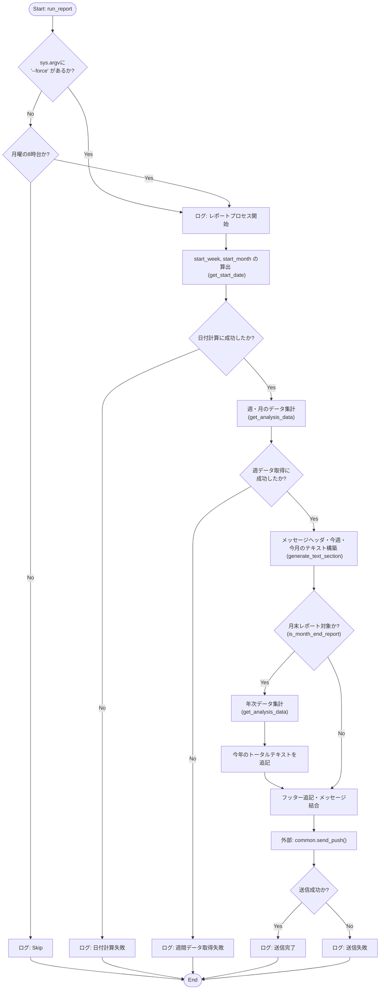
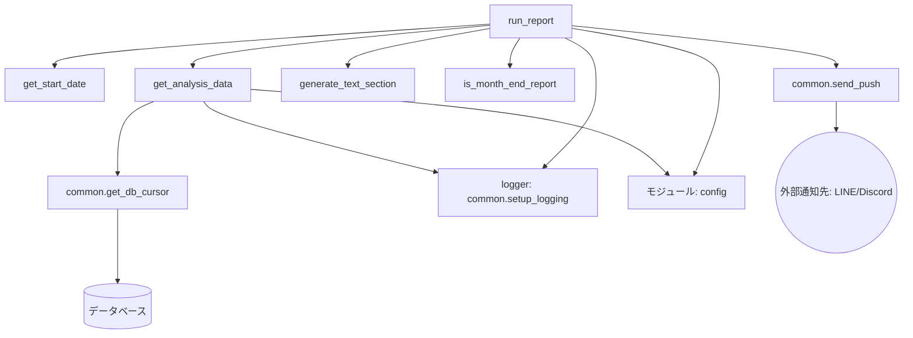

## 1. 解析メタ情報

| 項目 | 内容 |
| --- | --- |
| 対象ファイル | weekly_analyze_report.py |
| 言語 | Python |
| 解析対象 | 提供されたコードのみ |
| 推測・補完 | 一切なし |

## 2. ファイルの概要

指定された期間（週、月、年）の食事、車利用、電気代、家族の体調に関するデータをデータベースから集計し、整形したレポートテキストを作成して、外部システム（LINE/Discord）へプッシュ通知を送信する週間レポート生成スクリプトである。

## 3. 外部依存関係

### インポート一覧

| 名称 | 種類 | 用途 | 根拠 |
| --- | --- | --- | --- |
| `config` | 外部モジュール | テーブル名やユーザーIDなどの設定値の取得 | 根拠: `import config` (行番号取得不可 / 抜粋: "import config") |
| `common` | 外部モジュール | ロガー設定、DBカーソル取得、プッシュ通知送信などの共通処理の呼び出し | 根拠: `import common` (行番号取得不可 / 抜粋: "import common") |
| `datetime` | 標準ライブラリ | 日付や時間の取得、計算 | 根拠: `import datetime` (行番号取得不可 / 抜粋: "import datetime") |
| `pytz` | 外部ライブラリ | タイムゾーン（"Asia/Tokyo"）の指定 | 根拠: `import pytz` (行番号取得不可 / 抜粋: "import pytz") |
| `sys` | 標準ライブラリ | コマンドライン引数（`sys.argv`）の取得 | 根拠: `import sys` (行番号取得不可 / 抜粋: "import sys") |
| `typing` | 標準ライブラリ | 型ヒント（`Dict`, `Optional`, `Any`）の指定 | 根拠: `from typing import Dict, Optional, Any` (行番号取得不可 / 抜粋: "from typing import Dict, Option") |

### ブラックボックスとなる外部要素

| 名称 | 理由 | 根拠 |
| --- | --- | --- |
| `config` 内の各種定数 | `SQLITE_TABLE_FOOD`, `SQLITE_TABLE_CAR`, `SQLITE_TABLE_CHILD`, `LINE_USER_ID`, `SQLITE_TABLE_POWER_USAGE`（未定義時のフォールバックあり）などの具体的な値や型が不明 | 根拠: `config.SQLITE_TABLE_FOOD` (行番号取得不可 / 抜粋: "FROM {config.SQLITE_TABLE_FOOD") |
| `common.setup_logging` | 戻り値の正確な型や内部でのログ設定の詳細が不明 | 根拠: `logger = common.setup_logging("weekly_report")` (行番号取得不可 / 抜粋: "logger = common.setup_logging") |
| `common.get_db_cursor` | 接続先DBの種類（SQLite等）や取得されるカーソルオブジェクトの振る舞い（辞書型アクセスが可能かどうか）が不明 | 根拠: `with common.get_db_cursor() as cursor:` (行番号取得不可 / 抜粋: "with common.get_db_cursor() as") |
| `common.send_push` | 引数 `target="discord"` の挙動、送信先の実態、戻り値が `True`/`False` になる条件が不明 | 根拠: `common.send_push(config.LINE_USER_ID, ...)` (行番号取得不可 / 抜粋: "if common.send_push(config.LIN") |
| データベースのスキーマ | 各テーブルの正確なカラム定義やデータ型が不明 | 根拠: `SELECT menu_category FROM ...` (行番号取得不可 / 抜粋: "SELECT menu_category") |

## 4. 主要要素の定義（関数 / エンドポイント / コンポーネント）

### `get_start_date`

* **役割**: 指定された期間タイプ（週、月、年）に応じた集計開始日時（00:00:00）を計算して取得する。
* 根拠: `get_start_date` 定義部 (行番号取得不可 / 抜粋: "def get_start_date(period_type")

* **引数/リクエスト**: `period_type: str` - "week", "month", "year" のいずれか。
* 根拠: `get_start_date` 引数部 (行番号取得不可 / 抜粋: "period_type: str")

* **戻り値/レスポンス**: `Optional[datetime.datetime]` - 計算された開始日時。無効なタイプの場合は `None`。
* 根拠: `get_start_date` 戻り値ヒント (行番号取得不可 / 抜粋: "-> Optional[datetime.datetime]")

* **副作用**: なし
* 根拠: 関数内部の処理 (行番号取得不可 / 抜粋: "now = datetime.datetime.now(py")

* **エラーハンドリング**: 該当しない `period_type` が渡された場合は例外を発生させず `None` を返す。
* 根拠: `get_start_date` 末尾 (行番号取得不可 / 抜粋: "return None")

### `get_analysis_data`

* **役割**: 指定された開始日時から現在までの食事、車利用、電気代、体調のデータをDBから集計する。
* 根拠: `get_analysis_data` 定義部 (行番号取得不可 / 抜粋: "def get_analysis_data(start_dt")

* **引数/リクエスト**: `start_dt: datetime.datetime` - 集計開始日時。
* 根拠: `get_analysis_data` 引数部 (行番号取得不可 / 抜粋: "start_dt: datetime.datetime")

* **戻り値/レスポンス**: `Optional[Dict[str, Any]]` - 集計結果の辞書。DB接続失敗時や例外発生時は `None`。
* 根拠: `get_analysis_data` 戻り値ヒント (行番号取得不可 / 抜粋: "-> Optional[Dict[str, Any]]:")

* **副作用**: `common.get_db_cursor()` を用いてDBに対して `SELECT` クエリを実行する。
* 根拠: DBクエリ実行部 (行番号取得不可 / 抜粋: "cursor.execute(sql_food, (star")

* **エラーハンドリング**: 例外発生時はキャッチして `logger.error` でログ出力し、`None` を返す。
* 根拠: `except Exception as e:` ブロック (行番号取得不可 / 抜粋: "except Exception as e:")

### `generate_text_section`

* **役割**: 集計データからレポート用のテキストセクション（詳細モードまたは簡易モード）を生成する。
* 根拠: `generate_text_section` 定義部 (行番号取得不可 / 抜粋: "def generate_text_section(peri")

* **引数/リクエスト**: `period_name: str`, `data: Dict[str, Any]`, `is_simple: bool = False`
* 根拠: `generate_text_section` 引数部 (行番号取得不可 / 抜粋: "period_name: str, data: Dict[s")

* **戻り値/レスポンス**: `str` - 整形されたテキスト文字列。
* 根拠: `generate_text_section` 戻り値ヒント (行番号取得不可 / 抜粋: "-> str:")

* **副作用**: なし
* 根拠: 関数内部の処理 (行番号取得不可 / 抜粋: "total = data["total_meals"]")

* **エラーハンドリング**: `data` が空（Falsy）の場合は即座に空文字 `""` を返す。
* 根拠: データチェック部 (行番号取得不可 / 抜粋: "if not data: return """)

### `is_month_end_report`

* **役割**: 実行時点から7日後の月が現在の月と異なるかを判定し、月末レポート対象日であるかをチェックする。
* 根拠: `is_month_end_report` 定義部 (行番号取得不可 / 抜粋: "def is_month_end_report() -> b")

* **引数/リクエスト**: なし
* 根拠: `is_month_end_report` 引数部 (行番号取得不可 / 抜粋: "()")

* **戻り値/レスポンス**: `bool`
* 根拠: `is_month_end_report` 戻り値ヒント (行番号取得不可 / 抜粋: "-> bool:")

* **副作用**: なし
* 根拠: 関数内部の処理 (行番号取得不可 / 抜粋: "return now.month != next_week.")

* **エラーハンドリング**: なし
* 根拠: 関数内部の処理 (行番号取得不可 / 抜粋: "return now.month != next_week.")

### `run_report`

* **役割**: 週間レポート生成のメイン処理。実行条件の判定、データ集計の呼び出し、メッセージの構築、外部へのプッシュ通知を行う。
* 根拠: `run_report` 定義部 (行番号取得不可 / 抜粋: "def run_report() -> None:")

* **引数/リクエスト**: なし
* 根拠: `run_report` 引数部 (行番号取得不可 / 抜粋: "()")

* **戻り値/レスポンス**: `None`
* 根拠: `run_report` 戻り値ヒント (行番号取得不可 / 抜粋: "-> None:")

* **副作用**:
* `sys.argv` の読み取り。
* ロガーによる状態のログ出力（INFO, ERROR, DEBUG）。
* `common.send_push` を呼び出し外部システムへ通知を送信。
* 根拠: 各種処理部 (行番号取得不可 / 抜粋: "is_force = len(sys.argv) > 1 a", "logger.info("📊 週間レポート生成プロセ", "common.send_push(config.LINE_U")

* **エラーハンドリング**: 日付計算失敗時（`start_week` 等が `None`）、および週間データ取得失敗時（`stats_week` が `None`）はエラーログを出力し、処理を中断（`return`）する。
* 根拠: エラーチェック部 (行番号取得不可 / 抜粋: "if not start_week or not start", "if not stats_week:")

## 5. 処理フロー図

## 6. 依存関係図

## 7. 次のステップ（リバースエンジニアリングの提案）

| 優先度 | ファイル名(推測可) | 理由 | 根拠 |
| --- | --- | --- | --- |
| 高 | `config.py` | 使用されている各種テーブル名、ユーザーIDの実態、定数値（`SQLITE_TABLE_POWER_USAGE` など）を特定するため。 | 根拠: `config.SQLITE_TABLE_FOOD`, `config.LINE_USER_ID` など (行番号取得不可 / 抜粋: "config.SQLITE_TABLE_FOOD", "config.LINE_USER_ID") |
| 高 | `common.py` | DB接続先やクエリ結果を扱うカーソルの仕様、およびプッシュ通知の実際の送信先・処理内容を把握するため。 | 根拠: `common.get_db_cursor`, `common.send_push` (行番号取得不可 / 抜粋: "common.get_db_cursor()", "common.send_push(config.LINE_U") |
| 中 | （データベーススキーマ定義ファイル） | `menu_category`、`action`、`wattage`、`condition` カラムのデータ型や格納形式、制約を確認するため。 | 根拠: DBクエリ実行部 (行番号取得不可 / 抜粋: "SELECT menu_category FROM", "SELECT AVG(wattage)") |

## 8. 保守上の注意点

* `get_analysis_data` 内の `elapsed_hours` の計算において、現在時刻(`now`)と開始日時(`start_dt`)の差分から経過時間を求めているが、データベース内に存在するデータの実際の記録範囲ではなく、現在時刻に基づく実行タイミング依存の計算となっている。
* `get_analysis_data` の例外処理では `except Exception as e:` と広範な例外をキャッチしており、`None` を返す仕様になっている。一時的なDBエラーと致命的な構文エラーの区別がつかない。
* `table_power = getattr(config, "SQLITE_TABLE_POWER_USAGE", "power_usage")` において、`config.py` に変数が存在しない場合のフォールバック値 `"power_usage"` がハードコードされている。
* `run_report` におけるプッシュ通知処理 `common.send_push` の引数で、`config.LINE_USER_ID` を使用しつつ `target="discord"` と指定されており、通知先の実態がコード上からは自明ではない。

## 9. 不明事項一覧

| 項目 | 理由 | 必要なファイル |
| --- | --- | --- |
| `config` モジュールの定数値 | コード内では定数名のみ呼び出されており、実値やデータ型が不明なため。 | `config.py` |
| `common` モジュールの実装詳細 | DBカーソルの仕様（ディクショナリ的アクセス可否）、プッシュ通知の実際の宛先と送信仕様、ロガーの設定内容が不明なため。 | `common.py` |
| データベースのスキーマ定義 | クエリ内で呼び出しているテーブルのカラムのデータ型や制約が不明なため。 | DBマイグレーションファイルまたはスキーマ定義書 |
| 実行スケジューラ（Cron等）の設定 | コード上のコメントに「scheduler.pyが月曜に実行することを前提」とあるが、実際の設定や呼び出し元の処理が不明なため。 | `scheduler.py` またはシステムのCron設定ファイル |

## 10. 自己検証結果

* [x] 完了: 推測・外部ファイルの仕様を一切含んでいない
* [x] 完了: 全関数・全クラス・全コンポーネントを列挙した
* [x] 完了: 全てのインポート要素を列挙した
* [x] 完了: すべての仕様説明に「根拠（行番号・抜粋）」を明記した
* [x] 完了: 根拠漏れが0件である
* [x] 完了: Mermaid構文にエラーの原因となる記号（エスケープ漏れ）がない
* [x] 完了: 不明事項を漏れなく列挙した