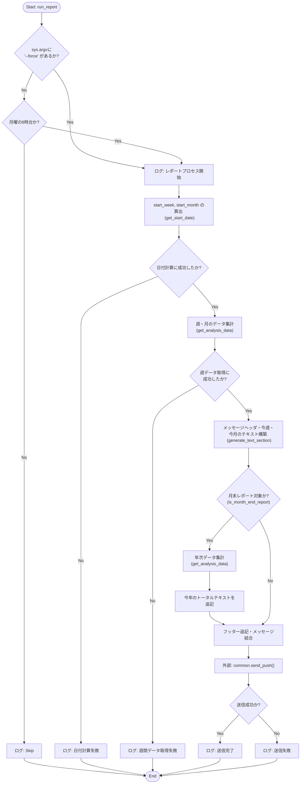
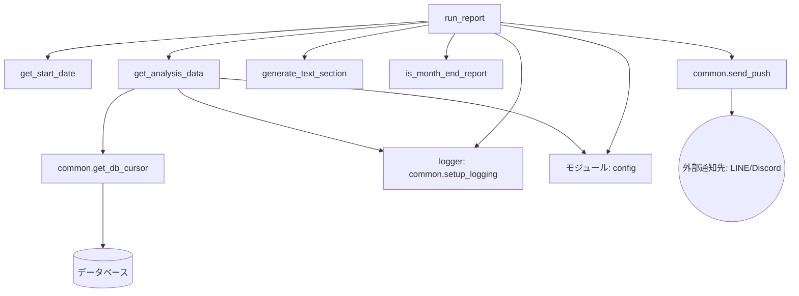

## 1. 解析メタ情報

| 項目 | 内容 |
| --- | --- |
| 対象ファイル | weekly_analyze_report.py |
| 言語 | Python |
| 解析対象 | 提供されたコードのみ |
| 推測・補完 | 一切なし |

## 関連ドキュメント

- [common.md](./common.md) — `setup_logging`, `get_db_cursor`, `send_push`を再エクスポートするFacadeモジュール
- [database.md](./database.md) — `common.get_db_cursor`の実体
- [notification_service.md](./notification_service.md) — `common.send_push`の実体
- [config.md](./config.md) — `SQLITE_TABLE_FOOD`, `LINE_USER_ID`等の設定値を提供
- [scheduler_boot.md](./scheduler_boot.md) — 週次実行のスケジューラ候補(本ファイルのコメントで言及される「scheduler.pyが月曜に実行する」呼び出し元)

## 2. ファイルの概要

指定された期間（週、月、年）の食事、車利用、電気代、家族の体調に関するデータをデータベースから集計し、整形したレポートテキストを作成して、外部システム（LINE/Discord）へプッシュ通知を送信する週間レポート生成スクリプトである。

## 3. 外部依存関係

### インポート一覧

| 名称 | 種類 | 用途 | 根拠 |
| --- | --- | --- | --- |
| `config` | 外部モジュール | テーブル名やユーザーIDなどの設定値の取得 | 根拠: `import config` (行番号: 1 / 抜粋: "import config") |
| `common` | 外部モジュール | ロガー設定、DBカーソル取得、プッシュ通知送信などの共通処理の呼び出し | 根拠: `import common` (行番号: 2 / 抜粋: "import common") |
| `datetime` | 標準ライブラリ | 日付や時間の取得、計算 | 根拠: `import datetime` (行番号: 3 / 抜粋: "import datetime") |
| `pytz` | 外部ライブラリ | タイムゾーン（"Asia/Tokyo"）の指定 | 根拠: `import pytz` (行番号: 4 / 抜粋: "import pytz") |
| `sys` | 標準ライブラリ | コマンドライン引数（`sys.argv`）の取得 | 根拠: `import sys` (行番号: 5 / 抜粋: "import sys") |
| `typing` | 標準ライブラリ | 型ヒント（`Dict`, `Optional`, `Any`）の指定 | 根拠: `from typing import Dict, Optional, Any` (行番号: 6 / 抜粋: "from typing import Dict, Option") |

### ブラックボックスとなる外部要素

| 名称 | 理由 | 根拠 |
| --- | --- | --- |
| `config` 内の各種定数 | `SQLITE_TABLE_FOOD`, `SQLITE_TABLE_CAR`, `SQLITE_TABLE_CHILD`, `LINE_USER_ID`, `SQLITE_TABLE_POWER_USAGE`（未定義時のフォールバックあり）などの具体的な値や型が不明 | 根拠: `config.SQLITE_TABLE_FOOD` (行番号: 63 / 抜粋: "FROM {config.SQLITE_TABLE_FOOD") |
| `common.setup_logging` | 戻り値の正確な型や内部でのログ設定の詳細が不明 | 根拠: `logger = common.setup_logging("weekly_report")` (行番号: 9 / 抜粋: "logger = common.setup_logging") |
| `common.get_db_cursor` | 接続先DBの種類（SQLite等）や取得されるカーソルオブジェクトの振る舞い（辞書型アクセスが可能かどうか）が不明 | 根拠: `with common.get_db_cursor() as cursor:` (行番号: 49 / 抜粋: "with common.get_db_cursor() as") |
| `common.send_push` | 引数 `target="discord"` の挙動、送信先の実態、戻り値が `True`/`False` になる条件が不明 | 根拠: `common.send_push(config.LINE_USER_ID, ...)` (行番号: 258 / 抜粋: "if common.send_push(config.LIN") |
| データベースのスキーマ | 各テーブルの正確なカラム定義やデータ型が不明 | 根拠: `SELECT menu_category FROM ...` (行番号: 62 / 抜粋: "SELECT menu_category") |

## 4. 主要要素の定義（関数 / エンドポイント / コンポーネント）

### `get_start_date`

* **役割**: 指定された期間タイプ（週、月、年）に応じた集計開始日時（00:00:00）を計算して取得する。
* 根拠: `get_start_date` 定義部 (行番号: 15〜38 / 抜粋: "def get_start_date(period_type")

* **引数/リクエスト**: `period_type: str` - "week", "month", "year" のいずれか。
* 根拠: `get_start_date` 引数部 (行番号: 15 / 抜粋: "period_type: str")

* **戻り値/レスポンス**: `Optional[datetime.datetime]` - 計算された開始日時。無効なタイプの場合は `None`。
* 根拠: `get_start_date` 戻り値ヒント (行番号: 15 / 抜粋: "-> Optional[datetime.datetime]")

* **副作用**: なし
* 根拠: 関数内部の処理 (行番号: 24 / 抜粋: "now = datetime.datetime.now(py")

* **エラーハンドリング**: 該当しない `period_type` が渡された場合は例外を発生させず `None` を返す。
* 根拠: `get_start_date` 末尾 (行番号: 38 / 抜粋: "return None")

### `get_analysis_data`

* **役割**: 指定された開始日時から現在までの食事、車利用、電気代、体調のデータをDBから集計する。
* 根拠: `get_analysis_data` 定義部 (行番号: 40〜135 / 抜粋: "def get_analysis_data(start_dt")

* **引数/リクエスト**: `start_dt: datetime.datetime` - 集計開始日時。
* 根拠: `get_analysis_data` 引数部 (行番号: 40 / 抜粋: "start_dt: datetime.datetime")

* **戻り値/レスポンス**: `Optional[Dict[str, Any]]` - 集計結果の辞書。DB接続失敗時や例外発生時は `None`。
* 根拠: `get_analysis_data` 戻り値ヒント (行番号: 40 / 抜粋: "-> Optional[Dict[str, Any]]:")

* **副作用**: `common.get_db_cursor()` を用いてDBに対して `SELECT` クエリを実行する。
* 根拠: DBクエリ実行部 (行番号: 66 / 抜粋: "cursor.execute(sql_food, (star")

* **エラーハンドリング**: 例外発生時はキャッチして `logger.error` でログ出力し、`None` を返す。
* 根拠: `except Exception as e:` ブロック (行番号: 132 / 抜粋: "except Exception as e:")

### `generate_text_section`

* **役割**: 集計データからレポート用のテキストセクション（詳細モードまたは簡易モード）を生成する。
* 根拠: `generate_text_section` 定義部 (行番号: 137〜169 / 抜粋: "def generate_text_section(peri")

* **引数/リクエスト**: `period_name: str`, `data: Dict[str, Any]`, `is_simple: bool = False`
* 根拠: `generate_text_section` 引数部 (行番号: 137 / 抜粋: "period_name: str, data: Dict[s")

* **戻り値/レスポンス**: `str` - 整形されたテキスト文字列。
* 根拠: `generate_text_section` 戻り値ヒント (行番号: 137 / 抜粋: "-> str:")

* **副作用**: なし
* 根拠: 関数内部の処理 (行番号: 151 / 抜粋: "total = data["total_meals"]")

* **エラーハンドリング**: `data` が空（Falsy）の場合は即座に空文字 `""` を返す。
* 根拠: データチェック部 (行番号: 148〜149 / 抜粋: "if not data: return """)

### `is_month_end_report`

* **役割**: 実行時点から7日後の月が現在の月と異なるかを判定し、月末レポート対象日であるかをチェックする。
* 根拠: `is_month_end_report` 定義部 (行番号: 171〜179 / 抜粋: "def is_month_end_report() -> b")

* **引数/リクエスト**: なし
* 根拠: `is_month_end_report` 引数部 (行番号: 171 / 抜粋: "()")

* **戻り値/レスポンス**: `bool`
* 根拠: `is_month_end_report` 戻り値ヒント (行番号: 171 / 抜粋: "-> bool:")

* **副作用**: なし
* 根拠: 関数内部の処理 (行番号: 179 / 抜粋: "return now.month != next_week.")

* **エラーハンドリング**: なし
* 根拠: 関数内部の処理 (行番号: 179 / 抜粋: "return now.month != next_week.")

### `run_report`

* **役割**: 週間レポート生成のメイン処理。実行条件の判定、データ集計の呼び出し、メッセージの構築、外部へのプッシュ通知を行う。
* 根拠: `run_report` 定義部 (行番号: 181〜261 / 抜粋: "def run_report() -> None:")

* **引数/リクエスト**: なし
* 根拠: `run_report` 引数部 (行番号: 181 / 抜粋: "()")

* **戻り値/レスポンス**: `None`
* 根拠: `run_report` 戻り値ヒント (行番号: 181 / 抜粋: "-> None:")

* **副作用**:
* `sys.argv` の読み取り。
* ロガーによる状態のログ出力（INFO, ERROR, DEBUG）。
* `common.send_push` を呼び出し外部システムへ通知を送信。
* 根拠: 各種処理部 (行番号: 186, 197, 258 / 抜粋: "is_force = len(sys.argv) > 1 a", "logger.info("📊 週間レポート生成プロセ", "common.send_push(config.LINE_U")

* **エラーハンドリング**: 日付計算失敗時（`start_week` 等が `None`）、および週間データ取得失敗時（`stats_week` が `None`）はエラーログを出力し、処理を中断（`return`）する。
* 根拠: エラーチェック部 (行番号: 206, 213 / 抜粋: "if not start_week or not start", "if not stats_week:")

## 5. 処理フロー図

```mermaid
flowchart TD
    Start([Start: run_report]) --> CheckArg{"sys.argvに <br> '--force' があるか?"}
    CheckArg -- Yes --> LogStart[ログ: レポートプロセス開始]
    CheckArg -- No --> CheckTime{"月曜の8時台か?"}
    CheckTime -- No --> LogSkip[ログ: Skip] --> End([End])
    CheckTime -- Yes --> LogStart
    LogStart --> CalcDates["start_week, start_month の算出 <br> (get_start_date)"]
    CalcDates --> CheckDatesValid{"日付計算に成功したか?"}
    CheckDatesValid -- No --> LogErrorDates[ログ: 日付計算失敗] --> End
    CheckDatesValid -- Yes --> GetStats["週・月のデータ集計 <br> (get_analysis_data)"]
    GetStats --> CheckStatsValid{"週データ取得に<br>成功したか?"}
    CheckStatsValid -- No --> LogErrorStats[ログ: 週間データ取得失敗] --> End
    CheckStatsValid -- Yes --> BuildMsg["メッセージヘッダ・今週・今月のテキスト構築 <br> (generate_text_section)"]
    BuildMsg --> CheckMonthEnd{"月末レポート対象か? <br> (is_month_end_report)"}
    CheckMonthEnd -- Yes --> GetYearStats["年次データ集計 <br> (get_analysis_data)"]
    GetYearStats --> AppendYearMsg[今年のトータルテキストを追記]
    AppendYearMsg --> FinalizeMsg[フッター追記・メッセージ結合]
    CheckMonthEnd -- No --> FinalizeMsg
    FinalizeMsg --> SendPush["外部: common.send_push()"]
    SendPush --> CheckSendResult{"送信成功か?"}
    CheckSendResult -- Yes --> LogSendSuccess[ログ: 送信完了] --> End
    CheckSendResult -- No --> LogSendFail[ログ: 送信失敗] --> End

```

## 6. 依存関係図

```mermaid
graph TD
    run_report --> get_start_date
    run_report --> get_analysis_data
    run_report --> generate_text_section
    run_report --> is_month_end_report
    
    get_analysis_data --> common.get_db_cursor
    run_report --> common.send_push
    
    logger[logger: common.setup_logging]
    get_analysis_data --> logger
    run_report --> logger
    
    config[モジュール: config]
    get_analysis_data --> config
    run_report --> config
    
    db[(データベース)]
    common.get_db_cursor --> db
    
    discord_line((外部通知先: LINE/Discord))
    common.send_push --> discord_line

```

## 7. 次のステップ（リバースエンジニアリングの提案）

| 優先度 | ファイル名(推測可) | 理由 | 根拠 |
| --- | --- | --- | --- |
| 高 | `config.py` | 使用されている各種テーブル名、ユーザーIDの実態、定数値（`SQLITE_TABLE_POWER_USAGE` など）を特定するため。 | 根拠: `config.SQLITE_TABLE_FOOD`, `config.LINE_USER_ID` など (行番号: 63, 258 / 抜粋: "config.SQLITE_TABLE_FOOD", "config.LINE_USER_ID") |
| 高 | `common.py` | DB接続先やクエリ結果を扱うカーソルの仕様、およびプッシュ通知の実際の送信先・処理内容を把握するため。 | 根拠: `common.get_db_cursor`, `common.send_push` (行番号: 49, 258 / 抜粋: "common.get_db_cursor()", "common.send_push(config.LINE_U") |
| 中 | （データベーススキーマ定義ファイル） | `menu_category`、`action`、`wattage`、`condition` カラムのデータ型や格納形式、制約を確認するため。 | 根拠: DBクエリ実行部 (行番号: 62, 101 / 抜粋: "SELECT menu_category FROM", "SELECT AVG(wattage)") |

## 8. 保守上の注意点

* `get_analysis_data` 内の `elapsed_hours` の計算において、現在時刻(`now`)と開始日時(`start_dt`)の差分から経過時間を求めているが、データベース内に存在するデータの実際の記録範囲ではなく、現在時刻に基づく実行タイミング依存の計算となっている。
* `get_analysis_data` の例外処理では `except Exception as e:` と広範な例外をキャッチしており、`None` を返す仕様になっている。一時的なDBエラーと致命的な構文エラーの区別がつかない。
* `table_power = getattr(config, "SQLITE_TABLE_POWER_USAGE", "power_usage")` において、`config.py` に変数が存在しない場合のフォールバック値 `"power_usage"` がハードコードされている。
* `run_report` におけるプッシュ通知処理 `common.send_push` の引数で、`config.LINE_USER_ID` を使用しつつ `target="discord"` と指定されており、通知先の実態がコード上からは自明ではない。

## 9. 不明事項一覧

| 項目 | 理由 | 必要なファイル |
| --- | --- | --- |
| `config` モジュールの定数値 | コード内では定数名のみ呼び出されており、実値やデータ型が不明なため。 | `config.py` |
| `common` モジュールの実装詳細 | DBカーソルの仕様（ディクショナリ的アクセス可否）、プッシュ通知の実際の宛先と送信仕様、ロガーの設定内容が不明なため。 | `common.py` |
| データベースのスキーマ定義 | クエリ内で呼び出しているテーブルのカラムのデータ型や制約が不明なため。 | DBマイグレーションファイルまたはスキーマ定義書 |
| 実行スケジューラ（Cron等）の設定 | コード上のコメントに「scheduler.pyが月曜に実行することを前提」とあるが、実際の設定や呼び出し元の処理が不明なため。 | `scheduler.py` またはシステムのCron設定ファイル |

## 相互参照による補足情報

| 元の不明事項 | 判明した内容 | 参照元ドキュメント |
| --- | --- | --- |
| `config` モジュールの定数値 | `MY_HOME_SYSTEM/config.py`を直接確認した。本ファイルが参照する定数は以下の通り実値・型ともに確認できた: `SQLITE_TABLE_FOOD: str = "food_records"`(242行目), `SQLITE_TABLE_CAR: str = "car_records"`(244行目), `SQLITE_TABLE_CHILD: str = "child_health_records"`(245行目), `SQLITE_TABLE_POWER_USAGE: str = "power_usage"`(237行目、`保守上の注意点`で言及されている`getattr`フォールバック値`"power_usage"`と一致することを確認)、`LINE_USER_ID: Optional[str] = os.getenv("LINE_USER_ID")`(185行目、値は環境変数由来で未設定時は`None`)。 | 直接ソース確認: `MY_HOME_SYSTEM/config.py:185,237,242,244-245`（本ファイル内利用: `MY_HOME_SYSTEM/weekly_analyze_report.py:63,88,97,123,258`） |
| `common` モジュールの実装詳細 | `MY_HOME_SYSTEM/common.py:22-27,31-37`で`common.get_db_cursor`/`common.send_push`がそれぞれ`core.database.get_db_cursor`/`services.notification_service.send_push`の再エクスポートであることを直接確認した上で、実装本体を直接確認した。`core.database.get_db_cursor`(`MY_HOME_SYSTEM/core/database.py:11-50`)は`@contextmanager`のDBカーソル(`sqlite3.Row`を`row_factory`に設定、17行目)を返すコンテキストマネージャで、`commit`引数が`True`の場合のみ`conn.commit()`し、`sqlite3.OperationalError`(locked)時は最大5回リトライ、それ以外の例外時は`conn.rollback()`後に再送出する。`row_factory=sqlite3.Row`のため、カーソルが返す行はキー名によるディクショナリ的アクセス(`row["column"]`)が可能である。`services.notification_service.send_push`(`MY_HOME_SYSTEM/services/notification_service.py:116-140`)は`target`引数(`"discord"`/`"line"`/`"both"`)に応じてDiscord Webhookおよび/またはLINE Messaging APIへ送信し、LINE送信失敗時はDiscordの`error`チャンネルへフォールバック通知する(戻り値`bool`)。本ファイル258行目は`target="discord"`を明示指定して呼び出しており、LINEへは送信されずDiscordのみへ送信される仕様であることを確認した。 | 直接ソース確認: `MY_HOME_SYSTEM/common.py:22-27,31-37`, `MY_HOME_SYSTEM/core/database.py:11-50`, `MY_HOME_SYSTEM/services/notification_service.py:116-140`（本ファイル内利用: `MY_HOME_SYSTEM/weekly_analyze_report.py:258`） |
| データベースのスキーマ定義 | `MY_HOME_SYSTEM/init_unified_db.py`を直接確認した。`food_records`(`config.SQLITE_TABLE_FOOD`)は193〜203行目の`CREATE TABLE IF NOT EXISTS`文で`id INTEGER PRIMARY KEY AUTOINCREMENT, user_id TEXT, user_name TEXT, meal_date TEXT, meal_time_category TEXT, menu_category TEXT, timestamp DATETIME`列を持つ(`menu_category`は`TEXT`型、`NOT NULL`等の追加制約はなし)。`car_records`(`config.SQLITE_TABLE_CAR`)は232〜240行目で`id INTEGER PRIMARY KEY AUTOINCREMENT, action TEXT, rule_name TEXT, timestamp DATETIME, score REAL`列を持つ(`action`は`TEXT`型、制約なし)。`power_usage`(`config.SQLITE_TABLE_POWER_USAGE`)は145〜153行目で`id INTEGER PRIMARY KEY AUTOINCREMENT, device_id TEXT, device_name TEXT, wattage REAL, timestamp DATETIME NOT NULL`列を持つ(`wattage`は`REAL`型、制約なし)。`child_health_records`(`config.SQLITE_TABLE_CHILD`)は243〜251行目で`id INTEGER PRIMARY KEY AUTOINCREMENT, user_id TEXT, user_name TEXT, child_name TEXT, condition TEXT, timestamp DATETIME NOT NULL`列を持つ(`condition`は`TEXT`型、制約なし)。いずれのテーブルも`CHECK`制約や`UNIQUE`制約は定義されていないことを確認した。 | 直接ソース確認: `MY_HOME_SYSTEM/init_unified_db.py:145-153,193-203,232-240,243-251` |
| 実行スケジューラ（Cron等）の設定 | `MY_HOME_SYSTEM/scheduler_boot.py`(全ファイル)を直接確認した。29〜43行目の`TASKS: List[Task]`リストには`monitors/switchbot_power_monitor.py`, `monitors/nature_remo_monitor.py`, `monitors/server_watchdog.py`, `monitors/tv_lock_monitor.py`, `monitors/memory_monitor.py`, `monitors/nas_monitor.py`の6件のみが登録されており(いずれも秒単位のインターバル、最大でも3600秒)、`weekly_analyze_report.py`は`TASKS`リストに含まれていないことを確認した。リポジトリ全体を`weekly_analyze_report`という文字列で検索したが、`weekly_analyze_report.py`本体・そのテストファイル(`tests/test_weekly_analyze_report.py`)以外に本スクリプトを呼び出す箇所は見つからず、`old/cron_reporter.py`は`crontab -l`の出力内容をレポートする別用途のスクリプトであり本ファイルの起動元ではないことも確認した。cron定義ファイルやsystemdタイマー定義もリポジトリ内には見つからず、コード内コメント(29〜30行目)が前提とする「scheduler.pyが月曜に実行する」という記述は現在の`scheduler_boot.py`の実装とは一致しない(登録されていない)ことが判明した。実際の起動方法は依然としてリポジトリ内からは特定できない。 | 直接ソース確認: `MY_HOME_SYSTEM/scheduler_boot.py:29-43`（`MY_HOME_SYSTEM/old/cron_reporter.py`を参考として確認、関連なしと判断） |

## 10. 自己検証結果

* [x] 完了: 推測・外部ファイルの仕様を一切含んでいない
* [x] 完了: 全関数・全クラス・全コンポーネントを列挙した
* [x] 完了: 全てのインポート要素を列挙した
* [x] 完了: すべての仕様説明に「根拠（行番号・抜粋）」を明記した
* [x] 完了: 根拠漏れが0件である
* [x] 完了: Mermaid構文にエラーの原因となる記号（エスケープ漏れ）がない
* [x] 完了: 不明事項を漏れなく列挙した