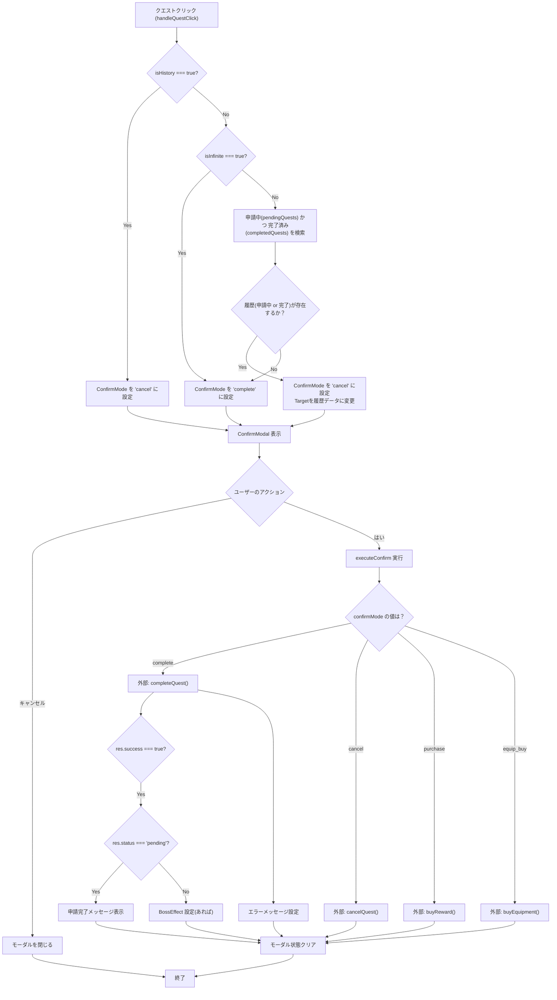

## 1. 解析メタ情報

| 項目 | 内容 |
| --- | --- |
| 対象ファイル | App.tsx |
| 言語 | React (TypeScript) |
| 解析対象 | 提供されたコードのみ |
| 推測・補完 | 一切なし |

## 2. ファイルの概要

このファイルはReactアプリケーションのメインコンポーネント（ルートに近い層）を定義している。アプリケーションの全体的な状態管理（表示モード、アクティブなタブ、選択中のユーザー、確認モーダルの状態、メッセージ等のUI状態）を行い、各種カスタムフック（`useSound`、`useGameData`）から取得したデータや関数を各子コンポーネントへ渡すルーティング的な責務を持つ。

* 根拠: `App`関数内の`useState`による状態管理と、戻り値のJSX要素群 (行番号取得不可 / 抜粋: "function App() { const { play } = useSound(); ...")

## 3. 外部依存関係

### インポート一覧

| 名称 | 種類 | 用途 | 根拠 |
| --- | --- | --- | --- |
| `useState` | 関数 | コンポーネントのローカル状態管理 | `import { useState } from 'react';` |
| `Sword`, `Shirt`, `ShoppingBag`, `Backpack`, `Scroll`, `Sparkles` | コンポーネント | タブ切り替えボタンのアイコン表示 | `import { ... } from 'lucide-react';` |
| `INITIAL_USERS` | 定数 | ユーザーデータが未取得または存在しない場合のフォールバック | `import { INITIAL_USERS } from './lib/masterData';` |
| `useGameData` | カスタムフック | ゲーム全体のデータ・状態更新関数の取得 | `import { useGameData } from './hooks/useGameData';` |
| `useSound` | カスタムフック | 効果音再生関数の取得 | `import { useSound } from './hooks/useSound';` |
| `AdminDashboard` | コンポーネント | 管理者用画面の表示 | `import AdminDashboard from './features/admin/components/AdminDashboard';` |
| `RewardList` | コンポーネント | ごほうびリストの表示 | `import RewardList from './features/shop/components/RewardList';` |
| `InventoryList` | コンポーネント | 所持アイテムリストの表示 | `import { InventoryList } from './features/shop/components/InventoryList';` |
| `GuildBoard` | コンポーネント | ギルド画面の表示 | `import { GuildBoard } from './features/guild/components/GuildBoard';` |
| `Quest`, `QuestHistory`, `Reward`, `Equipment`, `BossEffect` | 型定義 | 各オブジェクトの型定義 | `import { Quest, QuestHistory, Reward, Equipment, BossEffect } from '@/types';` |
| `LevelUpModal` | コンポーネント | レベルアップ時のモーダル表示 | `import LevelUpModal from './components/ui/LevelUpModal';` |
| `Header` | コンポーネント | 画面上部のヘッダー表示 | `import Header from './components/layout/Header';` |
| `AvatarUploader` | コンポーネント | アバター画像アップロード画面の表示 | `import AvatarUploader from './components/ui/AvatarUploader';` |
| `MessageModal` | コンポーネント | 結果やエラーメッセージのモーダル表示 | `import MessageModal from './components/ui/MessageModal';` |
| `Button` | コンポーネント | 各種ボタンの表示 | `import { Button } from './components/ui/Button';` |
| `Modal` | コンポーネント | 汎用モーダルダイアログの表示 | `import { Modal } from './components/ui/Modal';` |
| `FamilyMileageCard` | コンポーネント | ファミリーマイレージの表示 | `import { FamilyMileageCard } from './features/family/components/FamilyMileageCard';` |
| `UserStatusCard` | コンポーネント | 現在選択中ユーザーのステータス表示 | `import UserStatusCard from './features/family/components/UserStatusCard';` |
| `QuestList` | コンポーネント | クエスト一覧の表示 | `import QuestList from './features/quest/components/QuestList';` |
| `ApprovalList` | コンポーネント | 承認待ちクエスト一覧の表示 | `import ApprovalList from './features/quest/components/ApprovalList';` |
| `EquipmentShop` | コンポーネント | 装備購入画面の表示 | `import EquipmentShop from './features/shop/components/EquipmentShop';` |
| `FamilyLog` | コンポーネント | ファミリーのログ表示 | `import FamilyLog from './features/family/components/FamilyLog';` |
| `FamilyParty` | コンポーネント | ファミリーパーティ画面の表示 | `import FamilyParty from './features/family/components/FamilyParty';` |
| `BattleEffect` | コンポーネント | 戦闘エフェクトの表示 | `import BattleEffect from './components/ui/BattleEffect';` |
| `WeeklyTrends` | コンポーネント | 週間トレンドの表示 | `import { WeeklyTrends } from './features/family/components/WeeklyTrends';` |

### ブラックボックスとなる外部要素

| 名称 | 理由 | 根拠 |
| --- | --- | --- |
| インポートされている全UIコンポーネント | 実装ファイルが提供されておらず、内部のレンダリング内容や副作用が不明 | インポート文全体 (行番号取得不可) |
| `useGameData` | 実装が提供されておらず、非同期処理の成否判定やDBとの通信有無、データの初期構造が不明 | `import { useGameData } from './hooks/useGameData';` |
| `useSound` | 音声ファイルのパスや再生ロジックが不明 | `import { useSound } from './hooks/useSound';` |
| `INITIAL_USERS` | データ構造の詳細が不明 | `import { INITIAL_USERS } from './lib/masterData';` |
| `@/types` | 各型のプロパティ詳細が不明 | `import { Quest, ... } from '@/types';` |

## 4. 主要要素の定義（関数 / エンドポイント / コンポーネント）

### `ConfirmModal`

* **役割**: 操作確認用のモーダルを表示する。渡された`mode`に応じてタイトルとメッセージテキストを切り替える。
* 根拠: `ConfirmModal` コンポーネント定義内の `messages` オブジェクトと戻り値 (行番号取得不可 / 抜粋: "const messages = { cancel: ...")

* **引数/リクエスト**: オブジェクト `{ mode: 'cancel' | 'purchase' | 'complete' | 'equip_buy' | null, target: any, onConfirm: () => void, onCancel: () => void }`
* 根拠: 引数の型定義 (行番号取得不可 / 抜粋: "mode: 'cancel' | 'purchase' | ...")

* **戻り値/レスポンス**: JSX.Element または null
* 根拠: 戻り値の実装 (行番号取得不可 / 抜粋: "if (!mode || !target) return null; return ( <Modal ... )")

* **副作用**: なし（描画のみ）
* 根拠: 内部での状態更新や外部API呼び出しなし (行番号取得不可 / 抜粋: "const messages = ... return ...")

* **エラーハンドリング**: `mode`または`target`がFalsyな場合は何も描画せずnullを返す。
* 根拠: 初期チェック (行番号取得不可 / 抜粋: "if (!mode || !target) return null;")

### `App`

* **役割**: アプリケーションのメイン状態を管理し、各種ハンドラー関数を定義・子コンポーネントへ渡す。現在の`viewMode`や`activeTab`に応じて表示するコンポーネントを切り替える。
* 根拠: `App` コンポーネント定義全体 (行番号取得不可 / 抜粋: "function App() { ...")

* **引数/リクエスト**: なし
* 根拠: `function App() {` の引数なし

* **戻り値/レスポンス**: JSX.Element
* 根拠: 戻り値の実装 (行番号取得不可 / 抜粋: "return ( 
 { setLevelUpInfo(info); };")

* **引数/リクエスト**: `info: any`
* 根拠: 引数定義 (行番号取得不可 / 抜粋: "(info: any)")

* **戻り値/レスポンス**: なし (void)
* 根拠: `return`文なし

* **副作用**: `levelUpInfo`状態の更新
* 根拠: `setLevelUpInfo(info);`

### `handleUserChange` (App内の関数)

* **役割**: 現在のユーザーを切り替え、ビューモードを'main'に戻し、タップ音を鳴らす。
* 根拠: (行番号取得不可 / 抜粋: "setCurrentUserIdx(idx); setViewMode('main'); play('tap');")

* **引数/リクエスト**: `idx: number`
* 根拠: 引数定義 (行番号取得不可 / 抜粋: "(idx: number)")

* **戻り値/レスポンス**: なし (void)
* 根拠: `return`文なし

* **副作用**: `currentUserIdx`と`viewMode`の更新、音の再生
* 根拠: `setCurrentUserIdx(idx);`, `setViewMode('main');`, `play('tap');`

### `handleQuestClick` (App内の関数)

* **役割**: クエストクリック時に、履歴かどうか、無限クエストかどうか、申請中・完了済みの履歴があるかどうかに応じて、確認モーダルのモード（'cancel' または 'complete'）とターゲットを決定する。
* 根拠: (行番号取得不可 / 抜粋: "if (isHistory) { ... setConfirmMode('cancel');")

* **引数/リクエスト**: `q: Quest | QuestHistory`, `isHistory: boolean`
* 根拠: 引数定義 (行番号取得不可 / 抜粋: "(q: Quest | QuestHistory, isHistory: boolean)")

* **戻り値/レスポンス**: なし (void)
* 根拠: 早期`return`はあるが戻り値なし

* **副作用**: `confirmTarget`, `confirmMode` の更新、音の再生
* 根拠: `setConfirmTarget(q); setConfirmMode('complete'); play('select');`など

### `handleBuyReward` (App内の関数)

* **役割**: 報酬購入確認モーダルを開くための状態設定。
* 根拠: (行番号取得不可 / 抜粋: "setConfirmTarget(r); setConfirmMode('purchase');")

* **引数/リクエスト**: `r: Reward`
* 根拠: 引数定義 (行番号取得不可 / 抜粋: "(r: Reward)")

* **戻り値/レスポンス**: なし (void)
* 根拠: `return`文なし

* **副作用**: `confirmTarget`, `confirmMode` の更新、音の再生
* 根拠: `setConfirmTarget`, `setConfirmMode`, `play`

### `handleBuyEquipment` (App内の関数)

* **役割**: 装備購入確認モーダルを開くための状態設定。
* 根拠: (行番号取得不可 / 抜粋: "setConfirmTarget(e); setConfirmMode('equip_buy');")

* **引数/リクエスト**: `e: Equipment`
* 根拠: 引数定義 (行番号取得不可 / 抜粋: "(e: Equipment)")

* **戻り値/レスポンス**: なし (void)
* 根拠: `return`文なし

* **副作用**: `confirmTarget`, `confirmMode` の更新、音の再生
* 根拠: `setConfirmTarget`, `setConfirmMode`, `play`

### `handleEquip` (App内の関数)

* **役割**: ネイティブの`confirm`で装備変更の意思確認後、装備変更処理を実行し結果を通知する。
* 根拠: (行番号取得不可 / 抜粋: "if (confirm(`「${e.name}」を装備しますか？`)) { ... }")

* **引数/リクエスト**: `e: Equipment`
* 根拠: 引数定義 (行番号取得不可 / 抜粋: "(e: Equipment)")

* **戻り値/レスポンス**: `Promise<void>`
* 根拠: `async`関数で戻り値なし (行番号取得不可 / 抜粋: "const handleEquip = async (e: Equipment) => {")

* **副作用**: 外部API(`changeEquipment`)の呼び出し、`messageData`の更新、音の再生
* 根拠: `changeEquipment(currentUser, e);`, `setMessageData`, `play`

### `executeConfirm` (App内の関数)

* **役割**: `confirmMode`に応じた処理(`completeQuest`, `cancelQuest`, `buyReward`, `buyEquipment`)を実行し、結果に応じて成功・エラーメッセージを設定する。
* 根拠: (行番号取得不可 / 抜粋: "if (confirmMode === 'complete') { ... } else if (confirmMode === 'cancel') {")

* **引数/リクエスト**: なし
* 根拠: 引数定義 (行番号取得不可 / 抜粋: "const executeConfirm = async () => {")

* **戻り値/レスポンス**: `Promise<void>`
* 根拠: `async`関数で戻り値なし (行番号取得不可 / 抜粋: "const executeConfirm = async () => {")

* **副作用**: モーダル状態のクリア(`setConfirmMode`, `setConfirmTarget`)、外部更新処理の呼び出し、メッセージおよびボスエフェクト状態の更新
* 根拠: `setConfirmMode(null); setConfirmTarget(null);`、各API呼び出し、`setMessageData`等

### `handleApprove` (App内の関数)

* **役割**: クエスト承認処理を実行し、成功時にボスエフェクトがあれば設定する。
* 根拠: (行番号取得不可 / 抜粋: "const res = await approveQuest(currentUser, history); ...")

* **引数/リクエスト**: `history: QuestHistory`
* 根拠: 引数定義 (行番号取得不可 / 抜粋: "(history: QuestHistory)")

* **戻り値/レスポンス**: `Promise<void>`
* 根拠: `async`関数で戻り値なし

* **副作用**: `approveQuest`の呼び出し、音の再生、`bossEffect`の更新
* 根拠: `approveQuest(...)`, `play('approve')`, `setBossEffect(...)`

### `handleReject` (App内の関数)

* **役割**: ネイティブの`confirm`で確認後、クエスト却下処理を実行する。
* 根拠: (行番号取得不可 / 抜粋: "if (confirm("本当に却下しますか？")) { ... }")

* **引数/リクエスト**: `history: QuestHistory`
* 根拠: 引数定義 (行番号取得不可 / 抜粋: "(history: QuestHistory)")

* **戻り値/レスポンス**: `Promise<void>`
* 根拠: `async`関数で戻り値なし

* **副作用**: `rejectQuest`の呼び出し、音の再生
* 根拠: `rejectQuest(...)`, `play('cancel')`

### `getHeaderViewMode` (App内の関数)

* **役割**: `Header`コンポーネントに渡すためのビューモード文字列を判定する。
* 根拠: (行番号取得不可 / 抜粋: "const getHeaderViewMode = () => { if (viewMode === 'familyLog') return ...")

* **引数/リクエスト**: なし
* 根拠: 引数定義 (行番号取得不可 / 抜粋: "()")

* **戻り値/レスポンス**: 文字列 `'familyLog' | 'party' | 'trends' | 'user'`
* 根拠: 戻り値の実装 (行番号取得不可 / 抜粋: "return 'user';")

* **副作用**: なし
* 根拠: 状態や外部の変更なし

## 5. 処理フロー図

※主要なロジックである「クエストクリックから実行(モーダル表示から確定まで)」のフローを描画します。

## 6. 依存関係図

```mermaid
graph TD
    App["App コンポーネント"]
    useGameData["Hook: useGameData (ブラックボックス)"]
    useSound["Hook: useSound (ブラックボックス)"]
    INITIAL_USERS["定数: INITIAL_USERS"]
    
    UI_Header["コンポーネント: Header"]
    UI_Admin["コンポーネント: AdminDashboard"]
    UI_Main_Mileage["コンポーネント: FamilyMileageCard"]
    UI_Main_User["コンポーネント: UserStatusCard"]
    UI_Main_Approval["コンポーネント: ApprovalList"]
    
    Tab_Quest["コンポーネント: QuestList (通常)"]
    Tab_Special["コンポーネント: QuestList (特別)"]
    Tab_Guild["コンポーネント: GuildBoard"]
    Tab_Shop["コンポーネント: RewardList"]
    Tab_Equip["コンポーネント: EquipmentShop"]
    Tab_Inventory["コンポーネント: InventoryList"]
    
    Modal_Confirm["コンポーネント: ConfirmModal (App内定義)"]
    Modal_LevelUp["コンポーネント: LevelUpModal"]
    Modal_Message["コンポーネント: MessageModal"]
    Modal_Avatar["コンポーネント: AvatarUploader"]
    Modal_Battle["コンポーネント: BattleEffect"]
    
    View_Log["コンポーネント: FamilyLog"]
    View_Party["コンポーネント: FamilyParty"]
    View_Trends["コンポーネント: WeeklyTrends"]

    App --> useGameData
    App --> useSound
    App --> INITIAL_USERS
    App --> Modal_Confirm

    App -->|viewMode| UI_Header
    App -->|viewMode === 'admin'| UI_Admin
    
    App -->|viewMode === 'main'| UI_Main_Mileage
    App -->|viewMode === 'main'| UI_Main_User
    App -->|viewMode === 'main' & 権限あり| UI_Main_Approval
    
    App -->|activeTab === 'quest'| Tab_Quest
    App -->|activeTab === 'special_quest'| Tab_Special
    App -->|activeTab === 'guild'| Tab_Guild
    App -->|activeTab === 'shop'| Tab_Shop
    App -->|activeTab === 'equip'| Tab_Equip
    App -->|activeTab === 'inventory'| Tab_Inventory
    
    App -->|levelUpInfo| Modal_LevelUp
    App -->|messageData| Modal_Message
    App -->|isAvatarModalOpen| Modal_Avatar
    App -->|bossEffect| Modal_Battle
    
    App -->|viewMode === 'familyLog'| View_Log
    App -->|viewMode === 'party'| View_Party
    App -->|viewMode === 'trends'| View_Trends

```

## 7. 次のステップ（リバースエンジニアリングの提案）

| 優先度 | ファイル名(推測可) | 理由 | 根拠 |
| --- | --- | --- | --- |
| 高 | `./hooks/useGameData.ts` | アプリケーションのコアドメインロジック（データのCRUD処理やAPI通信、非同期状態）がすべてこのフックに集約されており、機能の詳細を把握するために必須であるため。 | `App.tsx`内で多用される`completeQuest`や各種ステート(`quests`, `users`など)の生成元であるため |
| 中 | `@/types/index.ts` (または関連ファイル) | `Quest`や`QuestHistory`など、主要なデータ構造を正確に把握することで、UIの表示条件やバグの特定が容易になるため。 | `App.tsx`のインポート文 `import { Quest, QuestHistory, ... } from '@/types';` |
| 中 | `./features/quest/components/QuestList.tsx` | 「無限クエスト」「通常・特別クエスト」の分岐などの表示制御をより詳細に知る必要があるため。 | `isDaily`プロパティを渡して通常/特別を切り替えているため |

## 8. 保守上の注意点

* **例外処理漏れ/null安全性**: `handleQuestClick` にて、`isInfinite` の判定に `(q as any)._isInfinite || (q as any).type === 'infinite' || (q as any).quest_type === 'infinite'` と `any` キャストが多用されており、型の安全性が保証されていない。
* **例外処理漏れ/null安全性**: `handleQuestClick` にて、`historyEntry` が存在する場合に `setConfirmTarget({ ...historyEntry, quest_title: (q as any).title || (historyEntry as any).quest_title });` と記述されているが、これも `any` キャストによりプロパティの存在が保証されていない。
* **例外処理漏れ/null安全性**: `executeConfirm` 内のレスポンス結果 `res` が `any` で定義されているため (`let res: any = { success: false };`)、`res.reason` などの参照時に型チェックが効いていない。
* **副作用**: `handleEquip` や `handleReject` にて、UI上のモーダルではなくブラウザネイティブの `confirm` が使用されており、スレッドブロック等の挙動に注意が必要。

## 9. 不明事項一覧

| 項目 | 理由 | 必要なファイル |
| --- | --- | --- |
| `useGameData` の各関数の戻り値構造 | `res.status` や `res.bossEffect` などの具体的なデータ構造が不明 | `./hooks/useGameData.ts` または `@/types` |
| 無限クエストの正確な判定条件 | `App.tsx` 内で `(q as any)._isInfinite` 等の苦肉の判定をしているが、本来どこで定義されている値なのか不明 | `@/types` または APIレスポンス定義 |
| `isDaily` の挙動 | `QuestList` コンポーネントに `isDaily={true}` 等を渡しているが、内部でどうフィルタリングされるか不明 | `./features/quest/components/QuestList.tsx` |
| 各種UIコンポーネントの実装仕様 | propsとして渡しているデータがどのように描画され、内部でどのようなイベントが発火するか不明 | 各コンポーネントファイル |

## 10. 自己検証結果

* [x] 推測・外部ファイルの仕様を一切含んでいない
* [x] 全関数・全クラス・全コンポーネントを列挙した
* [x] 全てのインポート要素を列挙した
* [x] すべての仕様説明に「根拠（行番号・抜粋）」を明記した
* [x] 根拠漏れが0件である
* [x] Mermaid構文にエラーの原因となる記号（エスケープ漏れ）がない
* [x] 不明事項を漏れなく列挙した
完了