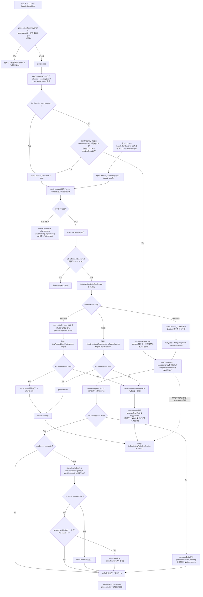
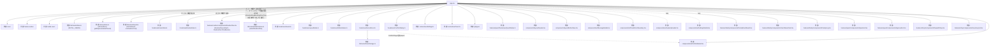

## 1. 解析メタ情報

| 項目 | 内容 |
| --- | --- |
| 対象ファイル | App.tsx (family-quest/src/App.tsx) |
| 言語 | React (TypeScript) |
| 解析対象 | 提供されたコードのみ |
| 推測・補完 | 一切なし |
| 解析基準コミット | `0d67384` (+同一ブランチ内でエラートースト重複ロジックのonErrorへの集約を追加修正) |

## 関連ドキュメント

* [main.md](main.md) - 本コンポーネントをルートとしてマウントする呼び出し元（想定）
* [src/hooks/useGameData.md](src/hooks/useGameData.md) - ユーザー/クエスト/報酬データの取得・更新関数（`completeQuest`等）を提供するカスタムフック
* [src/hooks/useRoutineData.md](src/hooks/useRoutineData.md) - **（すごろく機能で新規追加）** 「きょうのすごろく」の当日フロー状態取得・ステップ完了報告を提供するカスタムフック。`currentUser.user_id`で呼び出す
* [src/features/routine/components/RoutineFlow.md](src/features/routine/components/RoutineFlow.md) - **（すごろく機能で新規追加）** すごろくUI本体。デフォルトエクスポート`RoutineFlow`（誘導中の全ステップ表示）と名前付きエクスポート`RoutineFreeTimeBanner`（自由時間中バナー）の両方を縦画面の`quest`タブ内で使用。**（Issue #718 で追加）** `RoutineFlow`へ`isAdult={isParentUser(currentUser)}`を渡し、大人(`role_adult`)には療育目的の「まだだよ」表示を出さないよう制御する（表示のみの制御で、追いつき完了の可否は変えない）
  * 根拠: (行番号: 597 / 抜粋: "isAdult={isParentUser(currentUser)}")
* [src/lib/routineDataSchema.md](src/lib/routineDataSchema.md) - **（すごろく機能で新規追加、コードレビューでApp.tsx側の重複ロジックをselectRoutineFlowへ集約）** `selectRoutineFlow`（誘導中/自由時間中のフローキーをam優先で判定するヘルパー）と`RoutineFlowState`等の型の実装元
* [src/hooks/useLayoutMode.md](src/hooks/useLayoutMode.md) - `landscape`/`portrait`のレイアウトモード判定フック
* [src/hooks/useSound.md](src/hooks/useSound.md) - 効果音再生フック
* [src/hooks/useOnlineStatus.md](src/hooks/useOnlineStatus.md) - オンライン/オフライン判定フック
* [src/hooks/useCurrentUser.md](src/hooks/useCurrentUser.md) - **（Issue #552で新規抽出）** 選択中ユーザーの永続化解決・保存を行うカスタムフック。`currentUserIdx`自体の`useState`はApp.tsxに残る
* [src/hooks/useConfirmDialog.md](src/hooks/useConfirmDialog.md) - **（Issue #552で新規抽出）** 完了・購入・却下の確認モーダルまわりの状態クラスタを保持するカスタムフック
* [src/context/useSettings.md](src/context/useSettings.md) - 表示密度・アイコン優先ユーザーなどの表示設定を提供するコンテキストフック
* [src/context/useToast.md](src/context/useToast.md) - トースト通知の表示関数を提供するコンテキストフック
* [src/lib/masterData.md](src/lib/masterData.md) - `INITIAL_USERS`フォールバックデータの提供元
* [src/lib/userRole.md](src/lib/userRole.md) - **（Issue #552で新規抽出）** `isParentUser`/`getRepresentativeParent`の実装元
* [src/lib/actionResult.md](src/lib/actionResult.md) - **（Issue #552で新規抽出）** `ActionResult`型・`resolveErrorText`の実装元
* [src/types/index.md](src/types/index.md) - `Quest`/`QuestHistory`/`Reward`/`User`/`CompletedSignal`/`ID`型の定義元
* [src/features/quest/hooks/useQuestStatus.md](src/features/quest/hooks/useQuestStatus.md) - `getQuestLockState`/`getQuestProcessingKey`関数の実装元
* [src/components/layout/Header.md](src/components/layout/Header.md) - 子コンポーネント（ヘッダー。`showUserSwitcher`/`showLogSwitcher`/`showBackToMain`等のpropを渡す）
* [src/components/layout/BottomNav.md](src/components/layout/BottomNav.md) - 子コンポーネント（縦画面用フッターナビ）
* [src/components/ui/AvatarUploader.md](src/components/ui/AvatarUploader.md) - 子コンポーネント（アバター変更モーダル、`React.lazy`で動的import）
* [src/components/ui/SettingsModal.md](src/components/ui/SettingsModal.md) - 子コンポーネント（表示設定モーダル、`React.lazy`で動的import）
* [src/components/ui/MessageModal.md](src/components/ui/MessageModal.md) - 子コンポーネント（エラーメッセージ専用モーダル）
* [src/components/ui/ConfirmModal.md](src/components/ui/ConfirmModal.md) - **（Issue #552で新規抽出）** 子コンポーネント（完了・購入・却下の確認モーダル本体。以前はApp.tsx内にインラインで定義されていた）
* [src/components/ui/ChunkErrorBoundary.md](src/components/ui/ChunkErrorBoundary.md) - `lazy()`で分割した`AvatarUploader`/`SettingsModal`の`Suspense`を包むエラーバウンダリ（Issue #362）
* [src/features/family/components/FamilyDashboard.md](src/features/family/components/FamilyDashboard.md) - 横画面（landscape）時のメイン表示コンポーネント
* [src/features/quest/context/QuestActivityContext.md](src/features/quest/context/QuestActivityContext.md) - **（Issue #659で新規追加）** 本ファイルが返り値全体を包む`QuestActivityProvider`の実装元
* [src/features/quest/context/questActivityShared.md](src/features/quest/context/questActivityShared.md) - **（Issue #659で新規追加）** 上記Providerが配る`QuestActivityValue`型の定義元
* [src/features/family/components/UserStatusCard.md](src/features/family/components/UserStatusCard.md) - 縦画面（portrait）時のユーザーステータス表示コンポーネント
* [src/features/family/components/FamilyLog.md](src/features/family/components/FamilyLog.md) - 子コンポーネント（`viewMode === 'familyLog'`時の記録表示）
* [src/features/quest/components/QuestList.md](src/features/quest/components/QuestList.md) - 縦画面時のクエスト一覧表示コンポーネント
* [src/features/quest/components/ApprovalList.md](src/features/quest/components/ApprovalList.md) - 縦画面時の承認待ち一覧表示コンポーネント
* [src/features/shop/components/RewardShop.md](src/features/shop/components/RewardShop.md) - 「ごほうび」タブの実体コンポーネント
* [src/features/shop/components/InventoryList.md](src/features/shop/components/InventoryList.md) - 「もちもの」タブの実体コンポーネント

## 2. ファイルの概要

* **（Issue #660 で変更）** ユーザー切替・タブ切替のスワイプ判定に使う移動量(60px)は `src/lib/uiConstants.ts` の `VIEW_SWIPE_THRESHOLD_PX` から取る。以前は本ファイルと `FamilyLog.tsx` に同じ数値が直書きされており、感度の調整が片方だけに入る状態だった。

このファイルはReactアプリケーションのルートコンポーネント`App`を定義している。アプリケーション全体のUI状態（アクティブなタブ`activeTab`、表示モード`viewMode`、選択中ユーザー`currentUserIdx`、確認モーダルの状態、エラーメッセージ、アバターアップロード対象、設定モーダルの開閉、承認・クエスト実行の多重送信防止に使う各種ref/state）を管理し、`useLayoutMode`が返すレイアウトモード（`landscape`/`portrait`）に応じて、横画面用の`FamilyDashboard`（4人常時表示）または縦画面用の単一ユーザー切替UI（`UserStatusCard`＋`ApprovalList`＋`QuestList`/`RewardShop`/`InventoryList`タブ切替）のいずれかを条件分岐で描画する。`useGameData`・`useSound`・`useLayoutMode`・`useOnlineStatus`・`useCurrentUser`・`useConfirmDialog`・`useSettings`・`useToast`の各フックから取得したデータや関数を各子コンポーネントへ渡すルーティング的な責務を持つ。`AvatarUploader`と`SettingsModal`は`React.lazy`による動的importで初回バンドルから分離されている。**（Issue #552）** 以前はApp.tsx内にインラインで定義されていた`ConfirmModal`コンポーネント・`ConfirmTarget`型・`REJECT_REASONS`定数は`components/ui/ConfirmModal.tsx`へ、`isParentUser`/`getRepresentativeParent`は`lib/userRole.ts`へ、`ActionResult`型・`ERROR_REASON_MESSAGES`・`resolveErrorText`は`lib/actionResult.ts`へ、選択中ユーザーの永続化ヘルパー(`loadSavedUserId`/`saveCurrentUserId`)は`lib/currentUserStorage.ts`へそれぞれ切り出され、それらを使う副作用（選択中ユーザーの解決・保存、確認モーダルの状態クラスタ）はそれぞれ`hooks/useCurrentUser.ts`/`hooks/useConfirmDialog.ts`という新規フックへ抽出された。CLAUDE.mdの記述に従い、`viewMode`/`activeTab`/`currentUserIdx`自体の`useState`はApp.tsxのトップレベル状態として残されている。クエスト完了は`ConfirmModal`（`confirmMode === 'complete'`）による確認ダイアログを挟む一方、取消は`QuestList`側の長押し（`useLongPress`）でのみ発火するため引き続き確認なしのワンタップ（`runQuestAction`）のままであり、ゴールドを消費する「購入」と親向けの「却下」も従来通り`ConfirmModal`による確認を経由する。成功系の通知は`useToast`によるトースト表示に統一されており、`messageData`ステートとそれに紐づく`MessageModal`はエラー通知専用となっている。
* 根拠: `App`関数定義とレイアウト分岐 (行番号: 45, 47, 535, 552 / 抜粋: "function App() {", "const layoutMode = useLayoutMode();", "{viewMode === 'main' && layoutMode === 'landscape' && (", "{viewMode === 'main' && layoutMode === 'portrait' && (")
* 根拠: 動的importのコメント (行番号: 34〜37 / 抜粋: "// 初期表示には不要なモーダル類は動的importで分離し、初回バンドルを軽くする\n// (実際に開かれるまでチャンクを読み込まない)\nconst AvatarUploader = lazy(() => import('./components/ui/AvatarUploader'));\nconst SettingsModal = lazy(() => import('./components/ui/SettingsModal'));")
* 根拠: Issue #552抽出後のimport群 (行番号: 13〜14, 24〜25, 31 / 抜粋: "import { useCurrentUser } from './hooks/useCurrentUser';\nimport { useConfirmDialog } from './hooks/useConfirmDialog';", "import { isParentUser, getRepresentativeParent } from './lib/userRole';\nimport { ActionResult, resolveErrorText } from './lib/actionResult';", "import { ConfirmModal } from './components/ui/ConfirmModal';")
* 根拠: `useCurrentUser`のコメント (行番号: 146〜148 / 抜粋: "// #393: usersが実データに揃ったら保存済みuser_idを解決し、以後のcurrentUserIdxの\n  // 変化(ユーザー切替)を都度localStorageへ保存する(#552でuseCurrentUserへ抽出)。\n  useCurrentUser(users, currentUserIdx, setCurrentUserIdx);")
* 根拠: `useConfirmDialog`の分割代入 (行番号: 54〜58 / 抜粋: "const {\n    confirmMode, confirmTarget, confirmUser, rejectReason, setRejectReason,\n    isConfirming, setIsConfirming, isConfirmingRef,\n    openConfirm, closeConfirm,\n  } = useConfirmDialog();")
* **（すごろく機能で追加）** `currentUser`確定後、`useRoutineData(currentUser.user_id, onLevelUp, onError)`を呼び出す。第2引数の`onLevelUp`は`handleLevelUp({ user: currentUser.name, level: info.newLevel, job: currentUser.job_class || '無職' })`を呼ぶコールバックで、チェックポイント通過ボーナスでレベルアップした際にクエスト完了時と同じLEVEL UPトーストを出すために**（コードレビューで発覚した欠落を修正して追加）**された。**（さらに別のコードレビューで発覚した重複を追加修正）** 第3引数`onError`は完了報告失敗時に`showToast`＋`play('cancel')`でエラーを通知するコールバックで、以前は`completeRoutineStep`の戻り値(`{success, detail}`)を見て同じ処理をする`handleRoutineStepComplete`という関数を本ファイルが自前で定義していたが（`FamilyDashboard.tsx`にも一字一句同じ関数が重複していた）、`useRoutineData`自体の`onError`引数へロジックを集約し、本ファイルからは`handleRoutineStepComplete`自体が削除された。**（大人用フロー分離で追加）** 第4引数`onStepReward`は、大人用フロー(パパ・ママ用のすごろく)でデイリークエストから移設されたステップを完了した際の即時報酬を通知するコールバックで、`play('clear')`と「クリア！ / {gold} G と {exp} EXP を手に入れた！」のトーストを出す(コメントによれば「元のデイリークエストを完了したときと同じ手応えになるよう」の演出)。`flows`（`am`/`pm`2系統のフロー状態）は`lib/routineDataSchema`の`selectRoutineFlow`（**コードレビューで発覚した重複を解消するために導入**。以前は`isRoutineFlowBlocking`/`isRoutineFlowFreeTime`を使った同じ4分岐の三項演算子が本ファイルと`FamilyDashboard.tsx`に重複していた）に渡され、`activeRoutineKey`（誘導中のフローキー、`am`優先）と`freeTimeRoutineKey`（`activeRoutineKey`が無い場合のみ判定される自由時間中のフローキー）が算出される。縦画面の`quest`タブ描画（後述の「レンダリング分岐」参照）で、`QuestList`の代わりに`RoutineFlow`を表示するか、`QuestList`の上に`RoutineFreeTimeBanner`を重ねて表示するかの分岐に使われる。
* 根拠: `useRoutineData`呼び出しと`selectRoutineFlow` (行番号: 118〜131 / 抜粋: "// 「きょうのすごろく」: 平日朝/夕方の生活導線UI。誘導中(自由時間・未開始・完了後\n  // 以外)はクエスト選択画面より優先して表示し、迷わず1本道で進めるようにする。\n  // #(コードレビューで発覚): 完了報告失敗時のエラートースト表示(旧handleRoutineStepComplete)\n  // がFamilyDashboard.tsx側と一字一句重複していたため、useRoutineData自体のonErrorへ集約した。\n  // runQuestActionInner(通常クエスト)と同様にエラーをトーストで示す。\n  const { flows: routineFlows, completeStep: completeRoutineStep, isCompleting: isCompletingRoutine } = useRoutineData(\n    currentUser.user_id,\n    (info) => handleLevelUp({ user: currentUser.name, level: info.newLevel, job: currentUser.job_class || '無職' }),\n    (detail) => {\n      showToast({ title: 'エラー', text: detail || '通信状態を確認し、もう一度お試しください', icon: '⚠️' });\n      play('cancel');\n    },\n    // 大人用フローに寄せたステップ(ママの「夕食を作る」等)の即時報酬は、\n    // 元のデイリークエストを完了したときと同じ手応えになるよう演出する。\n    (reward) => {\n      play('clear');\n      showToast({ title: 'クリア！', text: `${reward.gold} G と ${reward.exp} EXP を手に入れた！`, icon: '💰' });\n    }\n  );\n  const { activeKey: activeRoutineKey, freeTimeKey: freeTimeRoutineKey } = selectRoutineFlow(routineFlows);")

## 3. 外部依存関係

### インポート一覧

| 名称 | 種類 | 用途 | 根拠 |
| --- | --- | --- | --- |
| `useState`, `useRef`, `useEffect`, `lazy`, `Suspense` | 関数/コンポーネント | ローカル状態管理、複数の`useRef`（`pendingQuestsRef`等）の保持、コンポーネントの動的import、非同期読み込み中のフォールバック制御 | 根拠: (行番号: 1 / 抜粋: "import { useState, useRef, useEffect, lazy, Suspense } from 'react';") |
| `motion` | オブジェクト | ジェスチャー(`onPanEnd`)付きアニメーションdivの描画 | 根拠: (行番号: 3 / 抜粋: "import { motion } from 'framer-motion';") |
| `WifiOff`, `AlertTriangle` | コンポーネント | オフライン時のバナーアイコン表示、データ取得失敗バナーのアイコン（Issue #390） | 根拠: (行番号: 4 / 抜粋: "import { WifiOff, AlertTriangle } from 'lucide-react';") |
| `INITIAL_USERS` | 定数 | ユーザーデータが未取得または存在しない場合のフォールバック | 根拠: (行番号: 5 / 抜粋: "import { INITIAL_USERS } from './lib/masterData';") |
| `useGameData`, `LevelUpInfo` | カスタムフック / 型定義 | ゲーム全体のデータ・状態更新関数の取得、レベルアップ情報の型 | 根拠: (行番号: 6 / 抜粋: "import { useGameData, LevelUpInfo } from './hooks/useGameData';") |
| `useRoutineData` | カスタムフック（すごろく機能で新規追加） | 「きょうのすごろく」の当日フロー状態取得・ステップ完了報告 | 根拠: (行番号: 7 / 抜粋: "import { useRoutineData } from './hooks/useRoutineData';") |
| `RoutineFlow` (default), `RoutineFreeTimeBanner` | コンポーネント（すごろく機能で新規追加） | `RoutineFlow`はすごろく誘導中の全ステップ表示、`RoutineFreeTimeBanner`は自由時間中の現在地バナー表示 | 根拠: (行番号: 8 / 抜粋: "import RoutineFlow, { RoutineFreeTimeBanner } from './features/routine/components/RoutineFlow';") |
| `selectRoutineFlow` | 関数（すごろく機能で新規追加、コードレビューで重複解消のため導入） | `routineFlows.am`/`routineFlows.pm`から、誘導中(`activeRoutineKey`)/自由時間中(`freeTimeRoutineKey`)のフローキーを`am`優先でまとめて算出するヘルパー | 根拠: (行番号: 9 / 抜粋: "import { selectRoutineFlow } from './lib/routineDataSchema';") |
| `useSound` | カスタムフック | 効果音再生関数の取得 | 根拠: (行番号: 10 / 抜粋: "import { useSound } from './hooks/useSound';") |
| `useLayoutMode` | カスタムフック | 横画面/縦画面のレイアウトモード判定 | 根拠: (行番号: 11 / 抜粋: "import { useLayoutMode } from './hooks/useLayoutMode';") |
| `useOnlineStatus` | カスタムフック | オンライン/オフライン状態の判定 | 根拠: (行番号: 12 / 抜粋: "import { useOnlineStatus } from './hooks/useOnlineStatus';") |
| `useCurrentUser` | カスタムフック（Issue #552で新規追加） | 選択中ユーザーの永続化解決・保存 | 根拠: (行番号: 13 / 抜粋: "import { useCurrentUser } from './hooks/useCurrentUser';") |
| `useConfirmDialog` | カスタムフック（Issue #552で新規追加） | 確認モーダルまわりの状態クラスタの取得 | 根拠: (行番号: 14 / 抜粋: "import { useConfirmDialog } from './hooks/useConfirmDialog';") |
| `useSettings` | カスタムフック(コンテキスト) | 表示密度(`density`)、アイコン優先表示ユーザーID一覧(`iconFirstUserIds`)の取得 | 根拠: (行番号: 15 / 抜粋: "import { useSettings } from './context/useSettings';") |
| `useToast` | カスタムフック(コンテキスト) | トースト通知表示関数(`showToast`)の取得 | 根拠: (行番号: 16 / 抜粋: "import { useToast } from './context/useToast';") |
| `RewardShop` | コンポーネント | 「ごほうび」タブの表示 | 根拠: (行番号: 17 / 抜粋: "import RewardShop from './features/shop/components/RewardShop';") |
| `InventoryList` | コンポーネント | 「もちもの」タブの表示 | 根拠: (行番号: 18 / 抜粋: "import { InventoryList } from './features/shop/components/InventoryList';") |
| `FamilyDashboard` | コンポーネント | 横画面用、4人常時表示レイアウトの表示 | 根拠: (行番号: 19 / 抜粋: "import FamilyDashboard from './features/family/components/FamilyDashboard';") |
| `QuestActivityProvider` | コンポーネント | **（Issue #659）** 進行中のクエスト操作（`completedSignal`/`processingQuestKeys`/`busyHistoryIds`）をContextで配るため、返り値全体を包む | 根拠: (行番号: 43 / 抜粋: "import { QuestActivityProvider } from './features/quest/context/QuestActivityContext';") |
| `CompletedSignal`, `ID`, `Quest`, `QuestHistory`, `Reward`, `User` | 型定義 | 各オブジェクトの型定義 | 根拠: (行番号: 21 / 抜粋: "import { CompletedSignal, ID, Quest, QuestHistory, Reward, User } from '@/types';") |
| `getQuestLockState`, `getQuestProcessingKey` | 関数 | クエストの無限判定・申請中/完了履歴の検索、多重送信防止用キーの生成 | 根拠: (行番号: 22 / 抜粋: "import { getQuestLockState, getQuestProcessingKey } from './features/quest/hooks/useQuestStatus';") |
| `isParentUser`, `getRepresentativeParent` | 関数（Issue #552で`./lib/userRole`へ移動） | 保護者判定、承認・却下・購入の記録名義となる代表親の解決 | 根拠: (行番号: 24 / 抜粋: "import { isParentUser, getRepresentativeParent } from './lib/userRole';") |
| `ActionResult`, `resolveErrorText` | 型定義 / 関数（Issue #552で`./lib/actionResult`へ移動） | ミューテーション結果の型、エラーメッセージ解決関数 | 根拠: (行番号: 25 / 抜粋: "import { ActionResult, resolveErrorText } from './lib/actionResult';") |
| `Header` | コンポーネント | 画面上部のヘッダー表示 | 根拠: (行番号: 28 / 抜粋: "import Header from './components/layout/Header';") |
| `BottomNav`, `BottomNavTab` | コンポーネント / 型 | 縦画面用フッターナビの表示、タブ種別の型 | 根拠: (行番号: 29 / 抜粋: "import BottomNav, { BottomNavTab } from './components/layout/BottomNav';") |
| `MessageModal` | コンポーネント | エラーメッセージのモーダル表示 | 根拠: (行番号: 30 / 抜粋: "import MessageModal from './components/ui/MessageModal';") |
| `ConfirmModal` | コンポーネント（Issue #552で`./components/ui/ConfirmModal`へ移動） | 完了・購入・却下の確認モーダル表示 | 根拠: (行番号: 31 / 抜粋: "import { ConfirmModal } from './components/ui/ConfirmModal';") |
| `ChunkErrorBoundary` | コンポーネント | `lazy()`チャンク読み込み失敗時の自動再読み込み | 根拠: (行番号: 32 / 抜粋: "import ChunkErrorBoundary from './components/ui/ChunkErrorBoundary';") |
| `AvatarUploader` (lazy) | コンポーネント | アバター画像アップロード画面の表示（動的import） | 根拠: (行番号: 36 / 抜粋: "const AvatarUploader = lazy(() => import('./components/ui/AvatarUploader'));") |
| `SettingsModal` (lazy) | コンポーネント | 表示設定モーダルの表示（動的import） | 根拠: (行番号: 37 / 抜粋: "const SettingsModal = lazy(() => import('./components/ui/SettingsModal'));") |
| `UserStatusCard` | コンポーネント | 現在選択中ユーザーのステータス表示（縦画面） | 根拠: (行番号: 39 / 抜粋: "import UserStatusCard from './features/family/components/UserStatusCard';") |
| `QuestList` | コンポーネント | クエスト一覧の表示（縦画面） | 根拠: (行番号: 40 / 抜粋: "import QuestList from './features/quest/components/QuestList';") |
| `ApprovalList` | コンポーネント | 承認待ちクエスト一覧の表示（縦画面、保護者のみ） | 根拠: (行番号: 41 / 抜粋: "import ApprovalList from './features/quest/components/ApprovalList';") |
| `FamilyLog` | コンポーネント | ファミリーのログ（記録）表示 | 根拠: (行番号: 42 / 抜粋: "import FamilyLog from './features/family/components/FamilyLog';") |

### ブラックボックスとなる外部要素

| 名称 | 理由 | 根拠 |
| --- | --- | --- |
| インポートされている全UIコンポーネント（`RewardShop`, `InventoryList`, `FamilyDashboard`, `RoutineFlow`, `RoutineFreeTimeBanner`, `Header`, `BottomNav`, `AvatarUploader`, `SettingsModal`, `MessageModal`, `ConfirmModal`, `ChunkErrorBoundary`, `UserStatusCard`, `QuestList`, `ApprovalList`, `FamilyLog`） | 実装ファイルが本ファイルからは提供されておらず、内部のレンダリング内容や副作用は各コンポーネント自身の仕様書を参照する必要がある | 根拠: インポート文全体 (行番号: 7, 16〜18, 26〜30, 34〜35, 37〜40) |
| `useGameData` | 実装が別ファイルであり、非同期処理の成否判定やDBとの通信有無、データの初期構造の詳細は本ファイルからは不明 | 根拠: (行番号: 6 / 抜粋: "import { useGameData, LevelUpInfo } from './hooks/useGameData';") |
| `useRoutineData` | 実装が別ファイルであり、`GET /api/routine/today`のポーリング詳細・`POST /api/routine/complete`の成否判定は本ファイルからは不明（詳細は`useRoutineData.md`を参照） | 根拠: (行番号: 7 / 抜粋: "import { useRoutineData } from './hooks/useRoutineData';") |
| `selectRoutineFlow` | 実装が別ファイル（`lib/routineDataSchema.ts`）であり、優先順位判定の詳細は本ファイルからは呼び出し結果の利用箇所のみ確認できる（詳細は`routineDataSchema.md`を参照） | 根拠: (行番号: 9 / 抜粋: "import { selectRoutineFlow } from './lib/routineDataSchema';") |
| `useSound` | 音声ファイルのパスや再生ロジックが不明 | 根拠: (行番号: 10 / 抜粋: "import { useSound } from './hooks/useSound';") |
| `useLayoutMode` | `landscape`/`portrait`の判定条件（メディアクエリ等）の詳細が本ファイルからは不明 | 根拠: (行番号: 11 / 抜粋: "import { useLayoutMode } from './hooks/useLayoutMode';") |
| `useOnlineStatus` | オンライン判定の具体的な実装が不明 | 根拠: (行番号: 12 / 抜粋: "import { useOnlineStatus } from './hooks/useOnlineStatus';") |
| `useSettings` | `density`/`iconFirstUserIds`以外に保持する設定項目や永続化方法が不明 | 根拠: (行番号: 15 / 抜粋: "import { useSettings } from './context/useSettings';") |
| `useToast` | `showToast`の内部実装（表示時間、キュー処理、スタイリング）が不明 | 根拠: (行番号: 16 / 抜粋: "import { useToast } from './context/useToast';") |
| `getQuestLockState`, `getQuestProcessingKey` | 実装が別ファイルであり、無限クエスト判定・履歴検索・キー生成の具体的なロジックが本ファイルからは不明 | 根拠: (行番号: 22 / 抜粋: "import { getQuestLockState, getQuestProcessingKey } from './features/quest/hooks/useQuestStatus';") |
| `@/types` | 各型のプロパティ詳細が不明 | 根拠: (行番号: 21 / 抜粋: "import { CompletedSignal, ID, Quest, QuestHistory, Reward, User } from '@/types';") |

## 4. 主要要素の定義（関数 / エンドポイント / コンポーネント）

### `App`

* **役割**: アプリケーションのルートコンポーネント。各種フックからデータ・関数を取得し、UI状態を管理し、各種ハンドラー関数を定義・子コンポーネントへ渡す。`useLayoutMode()`の結果に応じて`FamilyDashboard`（横画面）または縦画面用のUI一式を条件分岐で描画する。
* 根拠: `App` コンポーネント定義全体 (行番号: 42〜644 / 抜粋: "function App() {")

* **引数/リクエスト**: なし
* 根拠: (行番号: 45 / 抜粋: "function App() {")

* **戻り値/レスポンス**: JSX要素。`isLoading`が真の間はローディング表示のみを返す。
* 根拠: (行番号: 468, 470 / 抜粋: "if (isLoading) return 
Loading Family Quest...
;", "return (\n    
")

* **副作用**: フック呼び出し群（`useSound`/`useLayoutMode`/`useOnlineStatus`/`useSettings`/`useToast`/`useGameData`/`useCurrentUser`/`useConfirmDialog`）に加え、以下のローカル状態・refを保持する。
  * `activeTab`（`'quest' | 'shop' | 'inventory'`、既定`'quest'`）、`viewMode`（`'main' | 'familyLog'`、既定`'main'`）、`currentUserIdx`（既定`0`）: CLAUDE.mdの規約によりApp.tsx自身のトップレベル状態として保持される（`currentUserIdx`の値の初期解決・永続化のみ`useCurrentUser`に委譲）。
  * `useConfirmDialog()`が返す`confirmMode`/`confirmTarget`/`confirmUser`/`rejectReason`(+setter)/`isConfirming`(+setter)/`isConfirmingRef`/`openConfirm`/`closeConfirm`（Issue #552で抽出）。
  * `approvingHistoryIdsRef`（`Set<ID>`）/`isApprovingAllRef`（承認の多重送信防止、Issue #119）と、その見た目用ミラーである`approvingHistoryIds`(state)/`isApprovingAll`(state)（Issue #391/F-L8: 承認ボタンの`isLoading`表示用に、同期的なrefの判定結果をstateにも書き写す）。**（Issue #659で変更）** このうち ref/state/同期関数の3点セットは`useBusyKeys`フック（[useBusyKeys.md](./src/features/quest/hooks/useBusyKeys.md)）へ切り出され、分割代入で従来と同じ変数名に束ね直している（`isApprovingAllRef`/`isApprovingAll`は集合ではなく単一のbooleanのため対象外で、`useRef`/`useState`のまま）。
  * `processingQuestKeysRef`（`Set<string>`）/`processingQuestKeys`(state)（Issue #391: クエスト完了/取消APIが送信中の`(user_id, quest_id)`の組を追跡し、応答前の再タップを無視しつつ`QuestItem`にローディング表示を出すためのもの）。**（Issue #659で変更）** こちらも`useBusyKeys`フック経由で宣言している。
  * `completedSignal`(state、`CompletedSignal | null`)（Issue #102/#363: 完了APIが実際に成功した時点でのみ完了音・無限クエストのクールダウンを発火させるため、対象クエストのid・完了した本人のuserId・発火のたびに変わるnonceを`QuestList`/`QuestItem`側へ通知する）。
  * `messageData`(state、エラー専用)、`avatarUser`(state)、`settingsOpen`(state)。
  * `pendingQuestsRef`（`useRef(pendingQuests)`を`useEffect`で同期。バグ修正M-6-2: `handleApproveAll`の`onRetry`が古い`pendingQuests`クロージャを掴んだままになる問題の修正）。
* 根拠: state/ref宣言全体 (行番号: 46〜48, 51〜55, 64〜70, 77〜79, 88, 91, 94〜95, 122〜125)
* 根拠: `useConfirmDialog`分割代入 (行番号: 56〜61 / 抜粋: "// モーダル状態 (完了・購入・却下。取消は長押しでのみ発火するため確認を挟まない)\n  const {\n    confirmMode, confirmTarget, confirmUser, rejectReason, setRejectReason,\n    isConfirming, setIsConfirming, isConfirmingRef,\n    openConfirm, closeConfirm,\n  } = useConfirmDialog();")
* 根拠: Issue #119連打ガードとその見た目ミラー (行番号: 60〜77 / 抜粋: "// #119: 承認待ちカードは「スワイプ承認」と「承認ボタン」が併存し、確認モーダルを\n  // 挟まず即座にAPIを叩くため、#101のisConfirmingRefと同じ連打対策が無かった。", "const {\n    ref: approvingHistoryIdsRef,\n    keys: approvingHistoryIds,\n    sync: syncApprovingHistoryIds,\n  } = useBusyKeys<ID>();")
* 根拠: Issue #391の`processingQuestKeys` (行番号: 75〜82 / 抜粋: "// #391: クエスト完了/取消APIが送信中の (user_id, quest_id) の集合。以前は確認モーダルを\n  // 閉じてから await runQuestAction していたため、応答が返るまでカードは未完了のまま\n  // 再タップでき、2回目の確認モーダルが1回目の完了後も開いたまま残って「はい」を押すと\n  // 400「本日は完了済み」/429 のエラーモーダルになっていた。")
* 根拠: `completedSignal`のコメント (行番号: 84〜91 / 抜粋: "// #102: クエスト完了の効果音・無限クエストの連打防止クールダウンは、以前は\n  // QuestList側でタップ即時(=確認モーダルを開く前)に発火していたため、確認モーダルで\n  // 「キャンセル」しても完了音が鳴り、無限クエストは60秒間タップ不能になっていた。\n  // 実際に完了APIが成功した時点でのみ発火させるため、対象クエストのidと発火のたびに\n  // 変わるnonceをApp側からQuestList/QuestItemへ通知する。\n  // #363: 横画面の4人パネルでは同じsignalが全員のQuestItemに届くため、「誰の完了か」\n  // (userId)も載せ、QuestItem側で自分のパネルの完了だけに反応させる。")
* 根拠: `pendingQuestsRef`同期 (行番号: 150〜156 / 抜粋: "// ★バグ修正(M-6-2): handleApproveAllのonRetryが承認失敗時点の古いpendingQuests\n  // クロージャを掴んだままになり、再試行すると既に承認済みの項目まで再承認しようとして\n  // 400エラーになり続けていた。refで常に最新のpendingQuestsを参照できるようにする。\n  const pendingQuestsRef = useRef(pendingQuests);\n  useEffect(() => {\n    pendingQuestsRef.current = pendingQuests;\n  }, [pendingQuests]);")

* **エラーハンドリング**: `useGameData`から取得した各更新関数(`completeQuest`等)のレスポンスが`!res.success`の場合、`resolveErrorText`により`res.detail`または`res.reason`に対応するメッセージ（なければ既定文言）を`messageData`にセットし、`cancel`音を鳴らす。
* 根拠: `runQuestActionInner`・`executeConfirm`・`handleApprove`・`handleApproveAll`内の分岐 (行番号: 185〜190, 284〜291, 325〜332, 397〜403)

### `handleLevelUp` (App内の関数)

* **役割**: `useGameData`にコールバックとして渡され、レベルアップ発生時に`levelUp`効果音を再生し、トーストでレベルアップを通知する。以前はブロッキングモーダルで演出していたが、連続完了時のテンポを損なうためトースト表示に変更された（角度⑤）。
* 根拠: (行番号: 100〜105 / 抜粋: "// 角度⑤: レベルアップ/メダル獲得などの「成功の演出」は、作業を止めるブロッキングモーダルから\n  // 自動で消えるトーストへ変更(連続してクエストを完了する際にテンポが悪かったため)。\n  const handleLevelUp = (info: LevelUpInfo) => {\n    play('levelUp');\n    showToast({ title: 'LEVEL UP!', text: `${info.user}は Lv.${info.level} になった！`, icon: '⚡' });\n  };")

* **引数/リクエスト**: `info: LevelUpInfo`
* **戻り値/レスポンス**: なし (void)
* **副作用**: `play('levelUp')`の呼び出し、`showToast`によるトースト表示
* 根拠: (行番号: 100〜101)

### `handleUserChange` (App内の関数)

* **役割**: 現在のユーザー(`currentUserIdx`)を切り替え、`viewMode`を`'main'`に戻し、タップ音を鳴らす。
* 根拠: (行番号: 152〜157 / 抜粋: "const handleUserChange = (idx: number) => {\n    setCurrentUserIdx(idx);\n    // ★修正③: ユーザーアイコンを押したら必ずメイン画面(User View)に戻す\n    setViewMode('main');\n    play('tap');\n  };")

* **引数/リクエスト**: `idx: number`
* **戻り値/レスポンス**: なし (void)
* **副作用**: `currentUserIdx`と`viewMode`の更新、`tap`音の再生
* **エラーハンドリング**: なし

### `runQuestAction` (App内の関数)

* **役割**: クエストの完了/取消を実際に実行する`runQuestActionInner`を、多重送信防止のガードで包む薄いラッパー。**（Issue #391）** `getQuestProcessingKey(user.user_id, target.quest_id)`で求めたキーが`processingQuestKeysRef.current`に既に含まれていれば即座に`return`し、同一ユーザー・同一クエストへの完了/取消の二重送信を防ぐ。ガードを通過すると当該キーを`processingQuestKeysRef.current`に追加し`syncProcessingQuestKeys()`でstateへ反映したうえで`runQuestActionInner`を`await`し、`finally`で必ずキーを取り除いて再度`syncProcessingQuestKeys()`する。
* 根拠: (行番号: 161〜174 / 抜粋: "const runQuestAction = async (user: User, mode: 'complete' | 'cancel', target: Quest | QuestHistory) => {\n    // #391: 同一ユーザー・同一クエストの完了/取消が送信中なら二重送信しない\n    // (再試行(onRetry)から再入する場合は finally で解除済みなので通る)。\n    const processingKey = getQuestProcessingKey(user.user_id, target.quest_id);\n    if (processingQuestKeysRef.current.has(processingKey)) return;\n    processingQuestKeysRef.current.add(processingKey);\n    syncProcessingQuestKeys();\n    try {\n      await runQuestActionInner(user, mode, target);\n    } finally {\n      processingQuestKeysRef.current.delete(processingKey);\n      syncProcessingQuestKeys();\n    }\n  };")

* **引数/リクエスト**: `user: User`, `mode: 'complete' | 'cancel'`, `target: Quest | QuestHistory`
* **戻り値/レスポンス**: `Promise<void>`
* **副作用**: `processingQuestKeysRef`への追加・削除（`finally`で必ず削除）、`syncProcessingQuestKeys`によるstate反映、`runQuestActionInner`の呼び出し
* **エラーハンドリング**: 多重送信は早期`return`で無視する。それ以外のエラー処理は`runQuestActionInner`側に委譲される。

### `runQuestActionInner` (App内の関数)

* **役割**: クエストの完了/取消の実行本体。完了は`ConfirmModal`（`confirmMode === 'complete'`）での確認後に`executeConfirm`から、取消は`QuestList`側の長押し操作をきっかけに`handleQuestClick`からワンタップで呼び出される（いずれも`runQuestAction`経由）。`mode`に応じて`completeQuest`または`cancelQuest`を呼び出し、成功時かつ`mode === 'complete'`の場合、完了APIが実際に成功したこの時点で完了音を再生（`completedQuest.quest_type === 'daily'`または`completedQuest._isInfinite`なら`clear`、それ以外は`submit`）し、対象クエストの`quest_id`・完了した本人の`user.user_id`・発火のたびに変わる`nonce`(`Date.now()`)を`completedSignal`にセットする。子ども（`role_child`）の完了報告は親の承認待ち（`status: 'pending'`）になるのが常だが、それでも「提出」自体は完了しているため、鳴動・クールダウン対象から`pending`は除外しない。`res.status === 'pending'`なら申請完了トースト、`(res.earnedMedals ?? 0) > 0`ならメダル獲得演出（`medal`音＋トースト）を表示する。
* 根拠: (行番号: 176〜215 / 抜粋: "const runQuestActionInner = async (user: User, mode: 'complete' | 'cancel', target: Quest | QuestHistory) => {")
* 根拠: 完了音・`completedSignal`更新 (行番号: 182〜196 / 抜粋: "if (mode === 'complete') {\n        const completedQuest = target as Quest;\n        // #102: 完了音・無限クエストのクールダウンは、確認モーダルでの「はい」タップ\n        // 時点ではなく、実際に完了APIが成功したこの時点で発火させる(以前はQuestList側で\n        // タップ即時に鳴らしていたため、モーダルを「キャンセル」しても完了音が鳴り、\n        // 無限クエストはクールダウンに入ってしまっていた)。", "play(completedQuest.quest_type === 'daily' || completedQuest._isInfinite ? 'clear' : 'submit');\n        const idForSignal = completedQuest.quest_id;\n        if (idForSignal !== undefined) {\n          setCompletedSignal({ id: idForSignal, userId: user.user_id, nonce: Date.now() });\n        }")
* 根拠: 申請完了/メダル演出 (行番号: 197〜204 / 抜粋: "if (res.status === 'pending') {\n          showToast({ title: \"申請完了\", text: res.message || \"親の承認待ちになりました\", icon: '📨' });\n        } else if ((res.earnedMedals ?? 0) > 0) {")

* **引数/リクエスト**: `user: User`, `mode: 'complete' | 'cancel'`, `target: Quest | QuestHistory`
* 根拠: (行番号: 152)

* **戻り値/レスポンス**: `Promise<void>`
* 根拠: `async`関数で明示的な戻り値なし (行番号: 152)

* **副作用**: `completeQuest`/`cancelQuest`の呼び出し、`showToast`によるトースト表示、`clear`/`submit`/`medal`/`cancel`音の再生、`mode === 'complete'`成功時の`completedSignal`更新、失敗時の`messageData`更新
* 根拠: (行番号: 153〜190)

* **エラーハンドリング**: `!res.success`の場合、`resolveErrorText(res, "失敗しました")`をエラーメッセージとして`messageData`にセットし（`onRetry`に同じ引数で`runQuestAction`を再実行するコールバックを含む）、`cancel`音を再生する。
* 根拠: (行番号: 209〜214 / 抜粋: "setMessageData({\n      title: \"エラー\",\n      text: resolveErrorText(res, \"失敗しました\"),\n      onRetry: () => runQuestAction(user, mode, target),\n    });\n    play('cancel');")

### `handleQuestClick` (App内の関数)

* **役割**: クエストクリック時のハンドラ。シグネチャは`(user: User, q: Quest)`（Issue #530で第3引数`isHistory`を削除済み）。**（Issue #391）** 先頭で`getQuestProcessingKey(user.user_id, q.quest_id)`が`processingQuestKeysRef.current`に含まれていれば（送信中）静かに無視して`return`する（確認モーダルも開かない）。`select`音を再生した上で、`getQuestLockState`が返す無限クエスト判定・申請中/完了履歴の有無に応じて処理を振り分ける。無限クエストかつ申請中（`pendingEntry`）でない場合、および未実施のクエストを完了しようとする場合は、`useConfirmDialog`の`openConfirm('complete', q, user)`で確認ダイアログを開く。無限クエストが申請中（`pendingEntry`あり）の場合は通常クエストと同じ取消経路へ流す（無限クエストの完了済み履歴`completedEntry`は取消対象にしない: 周回前提のため）。取消対象が既存履歴の場合、`quest_title`が履歴側に無ければ`q.title`から補完する。
* 根拠: (行番号: 217〜255 / 抜粋: "// #530: 以前の第3引数 isHistory(履歴タブからのワンタップ取消)は全呼び出しが false で\n  // 到達不能な分岐だったため削除した。本関数はクエストリストからのタップ/長押し専用。\n  const handleQuestClick = (user: User, q: Quest) => {")
* 根拠: Issue #391の送信中ガード (行番号: 227〜228 / 抜粋: "// #391: 送信中のクエストの再タップは静かに無視する(確認モーダルも開かない)。\n    if (processingQuestKeysRef.current.has(getQuestProcessingKey(user.user_id, q.quest_id))) return;")
* 根拠: 無限クエスト・申請中の分岐 (行番号: 229〜239 / 抜粋: "// 無限クエストは常に「完了」扱い\n    // ★実機検証で子どもの誤操作(意図しない完了)が多かったため、完了(クリア)には\n    // 確認ダイアログを挟む(取り消しは長押しで保護されているため対象外)。\n    // ただし子どもの申請が承認待ち(pendingEntry)のときは、カード側で長押し(取消)のみが\n    // 有効になっているため、ここでも通常クエストと同じ取消経路へ流す。", "if (isInfinite && !pendingEntry) {\n      openConfirm('complete', q, user);\n      return;\n    }")
* 根拠: `historyEntry`判定と取消/完了への振り分け (行番号: 243〜256 / 抜粋: "const historyEntry = isInfinite ? pendingEntry : (pendingEntry || completedEntry);\n\n    if (historyEntry) {", "runQuestAction(user, 'cancel', { ...historyEntry, quest_title: q.title || historyEntry.quest_title });\n    } else {\n      // 未実施なら確認ダイアログを挟んでから完了\n      openConfirm('complete', q, user);\n    }")

* **引数/リクエスト**: `user: User`, `q: Quest`
* **戻り値/レスポンス**: なし (void)
* **副作用**: 送信中の場合は無視、既存履歴ありの場合は`runQuestAction`（取消）の呼び出し、それ以外（無限クエスト・未実施クエスト）の場合は`openConfirm('complete', q, user)`による`ConfirmModal`表示、`select`音の再生
* **エラーハンドリング**: なし。取消・完了いずれのエラー処理も`runQuestActionInner`側で行う。

### `handleBuyReward` (App内の関数)

* **役割**: 報酬購入確認モーダルを開く。`useConfirmDialog`の`openConfirm('purchase', r, user)`を呼び出す。
* 根拠: (行番号: 257〜260 / 抜粋: "const handleBuyReward = (user: User, r: Reward) => {\n    openConfirm('purchase', r, user);\n    play('select');\n  };")

* **引数/リクエスト**: `user: User`, `r: Reward`
* **戻り値/レスポンス**: なし (void)
* **副作用**: `openConfirm`呼び出し（`confirmMode`/`confirmTarget`/`confirmUser`/`rejectReason`の更新）、`select`音の再生

### `executeConfirm` (App内の関数)

* **役割**: `confirmMode`（`'complete'`/`'purchase'`/`'reject'`）に応じた処理を実行する。先頭で`isConfirmingRef.current`（`useConfirmDialog`が保持するref）が`true`なら即座に`return`し、確認ボタンの連打による二重実行を防ぐ（Issue #101）。ガードを通過すると`isConfirmingRef.current`/`isConfirming`(state)の両方を`true`にし、`try`ブロックで本処理を行い、`finally`で必ず両方を`false`に戻す。`confirmMode === 'complete'`の場合は`closeConfirm()`で確認モーダルの状態を先にクリアしたうえで`runQuestAction(actingUser, 'complete', target)`に処理を委譲する。`'purchase'`の場合、`actingUser`（`confirmUser`。モーダルを開いた時点のスナップショットで、`useGameData`の背景ポーリングによるゴールド残高更新に追従しない）ではなく、`users`（最新の`gameData`由来の配列）から同一`user_id`の最新オブジェクトを`freshActingUser`として引き直し（Issue #245）、これを`buyReward`へ渡す。`'reject'`の場合は`getRepresentativeParent(users)`を記録名義として`rejectQuest`を実行する。成功時、購入は`showToast`＋`clear`音、却下は`cancel`音を再生したうえで`closeConfirm()`を呼ぶ。
* 根拠: (行番号: 263〜322 / 抜粋: "const executeConfirm = async () => {")
* 根拠: 連打ガード (行番号: 271〜277 / 抜粋: "if (!confirmMode || !confirmTarget) return;\n    // #101: 「はい」の連打で、1回目のレスポンス前に2回目の実行が発火するのを防ぐ。\n    // (サーバー側にもスパムチェック/ロックを追加済みだが、フロント側でも連打そのものを\n    // 抑止し、連打の2回目がエラートーストになるのを防ぐ)\n    if (isConfirmingRef.current) return;\n    isConfirmingRef.current = true;\n    setIsConfirming(true);")
* 根拠: `try`/`finally`によるガード解除 (行番号: 248, 294〜297 / 抜粋: "try {", "} finally {\n      isConfirmingRef.current = false;\n      setIsConfirming(false);\n    }")
* 根拠: `complete`モードの委譲 (行番号: 275〜282 / 抜粋: "if (confirmMode === 'complete') {\n        // 完了処理そのもの(メダル演出・エラー表示含む)はrunQuestActionに委ねる。\n        // モーダルは先に閉じ、成功/失敗の通知はトースト/エラーモーダル側で行う。\n        const target = confirmTarget as Quest;\n        closeConfirm();\n        await runQuestAction(actingUser, 'complete', target);\n        return;\n      }")
* 根拠: `freshActingUser`の引き直し (行番号: 287〜294 / 抜粋: "// #245: actingUser(confirmUser)はモーダルを開いた時点のスナップショットであり、\n        // 背景ポーリング(useGameDataの10秒間隔)によるゴールド残高の更新に追従しない。", "const freshActingUser = users.find(u => u.user_id === actingUser.user_id) || actingUser;\n        res = await buyReward(freshActingUser, confirmTarget as Reward);")
* 根拠: `reject`モード (行番号: 300〜306 / 抜粋: "} else if (confirmMode === 'reject') {\n        // 却下の記録名義は「親」で固定する(要件5)\n        res = await rejectQuest(getRepresentativeParent(users), confirmTarget as QuestHistory, rejectReason || undefined);")

* **引数/リクエスト**: なし
* **戻り値/レスポンス**: `Promise<void>`
* **副作用**: `isConfirmingRef.current`/`isConfirming`(state)の設定・解除（`finally`で必ず解除）。`confirmMode === 'complete'`の場合は`closeConfirm()`呼び出し後に`runQuestAction`を呼び出す。`'purchase'`/`'reject'`の場合は`buyReward`/`rejectQuest`の呼び出し、成功時の`showToast`/音再生、失敗時の`messageData`更新、成功時の`closeConfirm()`呼び出し。
* 根拠: (行番号: 244〜246, 251〜258, 262〜282, 293, 294〜297)

* **エラーハンドリング**: `'purchase'`/`'reject'`の場合、`!res.success`のとき`confirmMode === 'reject'`かどうかでフォールバック文言（「却下に失敗しました」/「失敗しました」）を切り替えつつ`resolveErrorText(res, fallback)`を`messageData`にセットし`cancel`音を再生して`return`する（確認モーダルの状態はクリアされず開いたまま残る。角度⑨: エラーを閉じたあと状態を失わずに「はい」で再試行できるようにするため）。`'complete'`のエラー処理は`runQuestActionInner`側に委譲される。いずれの分岐でも`finally`により連打ガードは必ず解除される。
* 根拠: (行番号: 308〜315 / 抜粋: "if (!res.success) {\n        const fallback = confirmMode === 'reject' ? \"却下に失敗しました\" : \"失敗しました\";\n        setMessageData({ title: \"エラー\", text: resolveErrorText(res, fallback) });\n        play('cancel');\n        // ★角度⑨: 確認モーダルは閉じずに残し、エラーを閉じたあとにもう一度「はい」で\n        // 再試行できるようにする(状態[購入対象/却下理由]を失わないため)\n        return;\n      }")

### `handleApprove` (App内の関数)

* **役割**: クエスト承認処理を実行する。記録名義は`getRepresentativeParent(users)`で「親」に固定する（要件5）。先頭で`history.id`が`approvingHistoryIdsRef.current`（`Set<ID>`）に既に含まれていれば即座に`return`し、同一履歴への多重送信（連打・スワイプ承認とボタン承認のほぼ同時操作。**（Issue #391/F-L8）** 一括承認中に対象idが先に集合へ入っている場合の個別タップも同様にここで無視される）を静かに無視する（エラー表示は出さない、Issue #119）。ガードを通過すると`history.id`を`approvingHistoryIdsRef.current`に追加し`syncApprovingHistoryIds()`でstateへ反映、`try`ブロックで`approveQuest`を呼び出し、`finally`で必ず`approvingHistoryIdsRef.current`から取り除き再度`syncApprovingHistoryIds()`する。成功時、`res.earnedMedals`と`res.partnerEarnedMedals`（兄妹連携クエストのカスケード承認時のみ相方分が入る、Issue #238）を合算した数が1以上であれば`medal`音とメダル獲得トーストを表示する。失敗時はエラーメッセージ（`onRetry`で同じ引数で自身を再実行するコールバック付き）を表示する。
* 根拠: (行番号: 324〜363 / 抜粋: "// 承認ハンドラ: 記録名義は「親」で固定する(要件5)\n  const handleApprove = async (history: QuestHistory) => {")
* 根拠: Issue #119/#391の多重送信ガード (行番号: 326〜334 / 抜粋: "// #119: 同一履歴への多重送信は静かに無視する(2回目のタップ・スワイプは\n    // 1回分として扱い、エラー表示を出さない)。\n    // #391(F-L8): 一括承認中は対象の全idが先に集合へ入るため、一括承認中の個別タップも\n    // ここで同様に無視される(以前は一括承認と競合して400のエラーモーダルになっていた)。\n    if (history.id != null) {\n      if (approvingHistoryIdsRef.current.has(history.id)) return;\n      approvingHistoryIdsRef.current.add(history.id);\n      syncApprovingHistoryIds();\n    }")
* 根拠: `finally`によるガード解除 (行番号: 357〜362 / 抜粋: "} finally {\n      if (history.id != null) {\n        approvingHistoryIdsRef.current.delete(history.id);\n        syncApprovingHistoryIds();\n      }\n    }")
* 根拠: メダル獲得演出 (行番号: 344〜353 / 抜粋: "const totalEarnedMedals = (res.earnedMedals ?? 0) + (res.partnerEarnedMedals ?? 0);\n        if (totalEarnedMedals > 0) {\n          play('medal');\n          showToast({ title: \"ちいさなメダル獲得！\", text: `ちいさなメダルを ${totalEarnedMedals} 枚手に入れた！`, icon: \"🏅\" });\n        }")

* **引数/リクエスト**: `history: QuestHistory`
* **戻り値/レスポンス**: `Promise<void>`
* **副作用**: `approvingHistoryIdsRef.current`への履歴idの追加・削除（`finally`で必ず削除）と`syncApprovingHistoryIds`によるstate反映、`approveQuest`の呼び出し、`approve`/`medal`/`cancel`音の再生、成功時（メダル獲得時）の`showToast`、失敗時の`messageData`更新
* **エラーハンドリング**: 同一`history.id`への多重送信は早期`return`で静かに無視する（Issue #119）。`!res.success`の場合、`resolveErrorText(res, "承認に失敗しました")`を`messageData`にセットし`cancel`音を再生
* 根拠: (行番号: 325〜332)

### `handleApproveAll` (App内の関数)

* **役割**: 承認待ちが複数あるとき、1件ずつ承認する手間を減らす一括承認処理（角度⑩）。先頭で`isApprovingAllRef.current`が`true`なら即座に`return`し、「すべて承認」ボタンの連打で1回目のループが終わる前に2回目が同じ履歴を並行して承認しようとし400になるのを防ぐ（Issue #119）。ガードを通過すると`isApprovingAllRef.current`/`isApprovingAll`(state)を`true`にし、`pendingQuestsRef.current`のスナップショットのうち**（Issue #391/F-L8）** 個別承認が既に送信中（`approvingHistoryIdsRef.current`に含まれる）の履歴を除外した`targets`を対象に、対象0件なら即`return`、それ以外は対象idを先に全て`approvingHistoryIdsRef.current`へ追加・`claimedIds`に記録してから`syncApprovingHistoryIds()`する。以降、`approveQuest`を1件ずつ順番に`await`し、兄妹連携クエストのカスケード承認（片方を承認すると相方の行もサーバー側で自動承認される）で既に成功扱いになった`linked_history_id`は`cascadedIds`で追跡してスキップしつつ成功件数と合計獲得メダル数（Issue #238で相方分`partnerEarnedMedals`も合算）をカウントする（バグ修正M-6-2: `pendingQuestsRef.current`のスナップショットを使うことで、失敗時点の古い`pendingQuests`クロージャを掴んだままの`onRetry`再試行でも正しく動く）。`finally`で`claimedIds`の全idを`approvingHistoryIdsRef.current`から削除・`syncApprovingHistoryIds()`し、`isApprovingAllRef.current`/`isApprovingAll`を`false`に戻す。1件でも成功すれば`approve`音、メダルを1枚以上獲得していれば`medal`音とメダル獲得トーストを表示する。全件成功ならトーストで結果を通知、一部でも失敗すれば成功件数を含むエラーメッセージ（`onRetry`で自身を再実行）を表示する。
* 根拠: (行番号: 365〜434 / 抜粋: "// 角度⑩: 承認待ちが複数あるとき、1件ずつ承認する手間を減らす一括承認\n  const handleApproveAll = async () => {")
* 根拠: Issue #119の連打ガード (行番号: 374〜378 / 抜粋: "// #119: 一括承認ボタンの連打で、1回目のループが終わる前に2回目が\n    // 同じ履歴を並行して承認しようとし400になるのを防ぐ。\n    if (isApprovingAllRef.current) return;\n    isApprovingAllRef.current = true;\n    setIsApprovingAll(true);")
* 根拠: Issue #391/F-L8の対象絞り込みと事前クレーム (行番号: 372〜390 / 抜粋: "// #391(F-L8): 個別承認が送信中の履歴は一括の対象から外し(応答待ちの行を二重に\n    // 承認して400にしない)、残りの全idを先に approvingHistoryIdsRef へ入れて、\n    // 一括処理中の個別タップを handleApprove 側で無視させる。", "const targets = [...pendingQuestsRef.current].filter(h =>\n        h.id == null || !approvingHistoryIdsRef.current.has(h.id)\n      );\n      if (targets.length === 0) return;\n      for (const h of targets) {\n        if (h.id != null) {\n          approvingHistoryIdsRef.current.add(h.id);\n          claimedIds.push(h.id);\n        }\n      }\n      syncApprovingHistoryIds();")
* 根拠: カスケード承認のスキップと合算 (行番号: 393〜408 / 抜粋: "// 兄妹連携クエストは片方を承認するとサーバー側で相方の行も自動承認される。\n      // 相方のidをここに記録し、後続ループで個別に承認APIを叩いて400にならないようにする。\n      const cascadedIds = new Set<ID>();\n      for (const history of targets) {\n        if (history.id != null && cascadedIds.has(history.id)) {\n          successCount++;\n          continue;\n        }", "totalEarnedMedals += (res.earnedMedals ?? 0) + (res.partnerEarnedMedals ?? 0);\n          if (history.linked_history_id != null) {\n            cascadedIds.add(history.linked_history_id);\n          }")
* 根拠: `finally`によるガード解除 (行番号: 428〜433 / 抜粋: "} finally {\n      for (const id of claimedIds) approvingHistoryIdsRef.current.delete(id);\n      syncApprovingHistoryIds();\n      isApprovingAllRef.current = false;\n      setIsApprovingAll(false);\n    }")

* **引数/リクエスト**: なし
* **戻り値/レスポンス**: `Promise<void>`
* **副作用**: `isApprovingAllRef.current`/`isApprovingAll`(state)の設定・解除、`approvingHistoryIdsRef.current`への対象idの一括追加・削除と`syncApprovingHistoryIds`によるstate反映、`targets`件数分の`approveQuest`呼び出し、`approve`/`medal`/`cancel`音の再生、成功時（および合計メダル獲得時）の`showToast`、一部失敗時の`messageData`更新
* 根拠: (行番号: 348〜403)

* **エラーハンドリング**: 「すべて承認」ボタンの連打は`isApprovingAllRef.current`によるガードで早期`return`し無視する（Issue #119）。対象が0件なら即`return`。`successCount !== targets.length`の場合、`「一部の承認に失敗しました (成功数/対象数件成功)」`という文言で`messageData`をセットする(`onRetry`は`() => handleApproveAll()`)。
* 根拠: (行番号: 358, 394〜403)

### `handleReject` (App内の関数)

* **役割**: 却下確認モーダルを開くための状態設定。`useConfirmDialog`の`openConfirm('reject', history)`を呼ぶ（`confirmUser`は`getRepresentativeParent`で親を確定するため第3引数を省略する）。
* 根拠: (行番号: 436〜440 / 抜粋: "const handleReject = (history: QuestHistory) => {\n    // reject は getRepresentativeParent で親を確定するため confirmUser は不要\n    openConfirm('reject', history);\n    play('select');\n  };")

* **引数/リクエスト**: `history: QuestHistory`
* **戻り値/レスポンス**: なし (void)
* **副作用**: `openConfirm`呼び出し（`confirmMode`/`confirmTarget`/`confirmUser`/`rejectReason`の更新）、`select`音の再生

### `getHeaderViewMode` (App内の関数)

* **役割**: `Header`コンポーネントに渡すためのビューモード文字列を判定する。`viewMode === 'familyLog'`なら`'familyLog'`、それ以外は`'user'`を返す。
* 根拠: (行番号: 442〜445 / 抜粋: "const getHeaderViewMode = () => {\n    if (viewMode === 'familyLog') return 'familyLog';\n    return 'user';\n  };")

* **引数/リクエスト**: なし
* **戻り値/レスポンス**: 文字列 `'familyLog' | 'user'`
* **副作用**: なし

### `handleBottomNavChange` (App内の関数)

* **役割**: 縦画面用フッターナビ`BottomNav`のタブ変更を受け取り、`tap`音を再生した上で、`'familyLog'`タブなら`viewMode`を`'familyLog'`に、それ以外なら`viewMode`を`'main'`に戻しつつ`activeTab`を更新する（角度⑦: 縦画面はフッターナビに一本化）。
* 根拠: (行番号: 447〜456 / 抜粋: "// 角度⑦: 縦画面はフッターナビ(クエスト/ごほうび/記録)に一本化する\n  const handleBottomNavChange = (tab: BottomNavTab) => {\n    play('tap');\n    if (tab === 'familyLog') {\n      setViewMode('familyLog');\n    } else {\n      setViewMode('main');\n      setActiveTab(tab);\n    }\n  };")

* **引数/リクエスト**: `tab: BottomNavTab`
* **戻り値/レスポンス**: なし (void)
* **副作用**: `viewMode`/`activeTab`の更新、`tap`音の再生

### `App` のレンダリング分岐（JSX本体）

* **役割**: `isLoading`ならローディング表示のみを返す。それ以外は、オフライン時のバナー（`!isOnline`、`WifiOff`アイコン付き）、`/api/quest/data`の取得失敗バナー（Issue #390。`gameDataError`が非`null`のとき、`role="alert"`の琥珀色バーに「データの取得に失敗しました: {gameDataError}」と`refetchGameData`を呼ぶ「再試行」ボタンを表示）、`Header`（`showUserSwitcher={layoutMode !== 'landscape'}`, `showLogSwitcher={layoutMode !== 'portrait'}`, `showBackToMain={layoutMode === 'landscape'}`）を描画したのち、`viewMode === 'main' && layoutMode === 'landscape'`なら`FamilyDashboard`（**Issue #659で変更**: `completedSignal`/`processingQuestKeys`/`busyHistoryIds`の3つはpropsでは渡さなくなり、後述の`QuestActivityProvider`経由で届く。propsで渡すのは`isApprovingAll`まで）、`viewMode === 'main' && layoutMode === 'portrait'`なら`UserStatusCard`＋（保護者なら）`ApprovalList`＋スワイプ対応の`motion.div`内で`activeTab`（`quest`/`shop`/`inventory`）に応じた表示、`viewMode === 'familyLog'`なら`FamilyLog`（**改善で追加**: スマホ幅で最初に選択するユーザーをメイン画面と揃えるため`initialUserId={currentUser.user_id}`を渡す）を描画する。**（すごろく機能で変更）** `activeTab === 'quest'`の中身は単純な`QuestList`直接描画ではなくなり、`activeRoutineKey`（前述の状態/フック節を参照）が真であれば`QuestList`の代わりに`RoutineFlow`（`flowKey={activeRoutineKey}`, `flow={routineFlows[activeRoutineKey]}`, `onCompleteStep`は`completeRoutineStep(activeRoutineKey, stepKey)`を呼ぶコールバック（**さらに別のコードレビューで発覚した重複を追加修正**: 以前はここで`handleRoutineStepComplete(activeRoutineKey, stepKey)`という、失敗時に`showToast`を出す自前のラッパー関数を呼んでいたが、そのロジックが`useRoutineData`自体の`onError`引数へ集約されたため、本ファイルは`completeRoutineStep`を直接呼ぶだけでよくなった）, `isCompleting={isCompletingRoutine}`）を描画し、`activeRoutineKey`が無ければ、`freeTimeRoutineKey`が真の場合のみ`QuestList`の直前に`RoutineFreeTimeBanner`（`flowKey={freeTimeRoutineKey}`, `flow={routineFlows[freeTimeRoutineKey]}`）を挟んだうえで、従来通りの`QuestList`（`completedSignal`/`processingQuestKeys`を渡す）を描画する。`shop`/`inventory`タブの中身（`RewardShop`/`InventoryList`）はすごろく機能による変更を受けていない。縦画面のときのみ`BottomNav`を表示する。コンテナの最大幅は`densityWrapperClass`（`density === 'compact'`で余白を縮小）と`layoutMode === 'landscape'`のとき`max-w-[min(92vw,1800px)]`、それ以外は`max-w-md md:max-w-5xl`に切り替わる。末尾で`ConfirmModal`（`mode={confirmMode}`, `target={confirmTarget}`, `rejectReason`, `onSelectRejectReason={setRejectReason}`, `onConfirm={executeConfirm}`, `onCancel={() => { closeConfirm(); play('cancel'); }}`, `isConfirming`）と、`messageData`があれば`MessageModal`を描画する。
* 根拠: (行番号: 494, 507, 509, 529, 616 / 抜粋: "${layoutMode === 'landscape' ? 'max-w-[min(92vw,1800px)]' : 'max-w-md md:max-w-5xl'}", "{viewMode === 'main' && layoutMode === 'landscape' && (\n          <FamilyDashboard", "{viewMode === 'main' && layoutMode === 'portrait' && (", "{viewMode === 'familyLog' && (")
* 根拠: `FamilyLog`への`initialUserId`の受け渡し (行番号: 641 / 抜粋: "<FamilyLog chronicle={chronicle} users={users} initialUserId={currentUser.user_id} />")
* 根拠: データ取得失敗バナー (行番号: 492〜494 / 抜粋: "{gameDataError && (\n        <div\n          role=\"alert\"")
* **（Issue #659）** 返り値全体が`QuestActivityProvider`で包まれており、`completedSignal`/`processingQuestKeys`/`busyHistoryIds={approvingHistoryIds}`はここで一度だけ渡される。コメントによれば、以前は`App → FamilyDashboard → FamilyPanel → QuestList`と素通しのpropsで運んでいたが「中継する2つは値を使わないので Context へ移した」。App直下で描画する`QuestList`/`ApprovalList`は1段なのでpropsのまま渡しており、その理由は「表示専用コンポーネントの単体テストを Provider 無しで書ける状態を保つため」と説明されている。
* 根拠: `QuestActivityProvider`による包み込み (行番号: 476〜482, 695 / 抜粋: "    <QuestActivityProvider", "    </QuestActivityProvider>")
* 根拠: `FamilyDashboard`への受け渡し (行番号: 536 / 抜粋: "<FamilyDashboard")
* 根拠: `ConfirmModal`への呼び出し (行番号: 638〜645 / 抜粋: "<ConfirmModal\n        mode={confirmMode}\n        target={confirmTarget}\n        rejectReason={rejectReason}\n        onSelectRejectReason={setRejectReason}\n        onConfirm={executeConfirm}\n        onCancel={() => { closeConfirm(); play('cancel'); }}\n        isConfirming={isConfirming}\n      />")
* 根拠: スワイプ操作 (行番号: 567〜576 / 抜粋: "{/* 角度⑯: 左右スワイプでもクエスト/ごほうびタブを切り替えられるようにする */}\n            <motion.div\n              className=\"min-h-[300px] animate-fade-in\"\n              onPanEnd={(_e, info) => {\n                const order: Array<'quest' | 'shop' | 'inventory'> = ['quest', 'shop', 'inventory'];")
* **（すごろく機能で追加）** 根拠: `quest`タブの`RoutineFlow`/`RoutineFreeTimeBanner`分岐 (行番号: 577〜593 / 抜粋: "{activeTab === 'quest' && activeRoutineKey && routineFlows && (\n                <RoutineFlow\n                  flowKey={activeRoutineKey}\n                  flow={routineFlows[activeRoutineKey]}\n                  onCompleteStep={(stepKey) => completeRoutineStep(activeRoutineKey, stepKey)}\n                  isCompleting={isCompletingRoutine}\n                />\n              )}", "{activeTab === 'quest' && !activeRoutineKey && (\n                <>\n                  {freeTimeRoutineKey && routineFlows && (\n                    
\n                      <RoutineFreeTimeBanner flowKey={freeTimeRoutineKey} flow={routineFlows[freeTimeRoutineKey]} />\n                    
\n                  )}\n                  <QuestList")

* **副作用**: `avatarUser`が設定されている場合、`Suspense`配下で遅延ロードされた`AvatarUploader`の`onUploadComplete`から`refreshData()`と`showToast`による成功通知が行われる。`settingsOpen`が真の場合、同じく`Suspense`配下で遅延ロードされた`SettingsModal`が表示される。この`Suspense`は`ChunkErrorBoundary`で包まれており（Issue #362）、SW更新後に旧チャンクが404になって`lazy()`がthrowしても、Appツリー全体がアンマウントされて白画面になることはなく、バウンダリが自動で再読み込みする。**（すごろく機能で追加）** `useRoutineData(currentUser.user_id, onLevelUp, onError)`によるポーリング通信（15秒間隔、詳細は`useRoutineData.md`参照）も本コンポーネントの副作用に加わる。完了報告の成否は`onError`（**追加修正**、`useRoutineData`側に集約。以前は本ファイル自前の`handleRoutineStepComplete`が`showToast`/`play('cancel')`で通知していた）が`showToast`/`play('cancel')`で通知し、チェックポイント通過ボーナスでのレベルアップは`onLevelUp`経由で既存の`handleLevelUp`(`play('levelUp')`＋LEVEL UPトースト)を呼ぶ。**（大人用フロー分離で追加）** 大人用フローのステップ個別報酬は`onStepReward`経由で`play('clear')`＋「クリア！」トーストを出す。
* 根拠: `ChunkErrorBoundary`によるラップ (行番号: 675〜676 / 抜粋: "<ChunkErrorBoundary>\n      <Suspense fallback={null}>")
* 根拠: (行番号: 661〜674 / 抜粋: "<Suspense fallback={null}>\n        {avatarUser && (\n          <AvatarUploader\n            user={avatarUser}\n            onClose={() => setAvatarUser(null)}\n            onUploadComplete={() => {\n              refreshData();\n              showToast({ title: \"変更完了\", text: \"アバターを変更しました！\", icon: '🖼️' });\n            }}\n          />\n        )}\n\n        {settingsOpen && (\n          <SettingsModal isOpen={settingsOpen} onClose={() => setSettingsOpen(false)} users={users} />\n        )}\n      </Suspense>")

## 5. 処理フロー図

※クエストクリックから完了(確認モーダル経由)/取消(長押しでワンタップ)までのフロー、購入・却下の確認モーダル経由フロー、一括承認フロー（角度⑩、メダル演出含む）を描画する。Issue #391の多重送信ガード（`runQuestAction`ラッパー、`processingQuestKeysRef`）と、Issue #101/#119の連打防止ガードの両方を含む。

```mermaid
flowchart TD
    QStart["クエストクリック (handleQuestClick)"] --> ProcCheck{"processingQuestKeysRef に<br>(user,quest)キーが含まれるか?<br>(#391)"}
    ProcCheck -- はい --> ProcIgnore["何もせず終了(確認モーダルも開かない)"]
    ProcCheck -- いいえ --> PlaySelect["play(select)"]
    PlaySelect --> CallLockState["getQuestLockState() で isInfinite / pendingEntry / completedEntry を取得"]

    CallLockState --> IsInfinite{"isInfinite && !pendingEntry ?"}
    IsInfinite -- Yes --> OpenCompleteConfirm["openConfirm('complete', q, user)"]
    IsInfinite -- No --> HasHistory{"pendingEntry または completedEntry が存在するか<br>(無限クエストはpendingEntryのみ)"}

    HasHistory -- Yes --> RunCancelWithHistory["runQuestAction(user, cancel, 履歴データを補完したオブジェクト)"]
    HasHistory -- No --> OpenCompleteConfirm

    BStart["購入クリック handleBuyReward、または却下クリック handleReject"] --> SetModal["openConfirm('purchase'|'reject', target, user?)"]
    OpenCompleteConfirm --> ShowConfirmModal["ConfirmModal 表示 (mode: complete/purchase/reject)"]
    SetModal --> ShowConfirmModal

    ShowConfirmModal --> WaitAction{"ユーザーの操作"}
    WaitAction -- キャンセル --> CloseModal["closeConfirm() & play(cancel)<br>(isConfirming中はキャンセルボタンもdisabled)"]
    WaitAction -- はい --> ExecuteConfirm["executeConfirm() 実行"]

    ExecuteConfirm --> GuardCheck{"isConfirmingRef.current<br>(連打ガード, #101)"}
    GuardCheck -- true --> GuardReturn["即return(何もしない)"]
    GuardCheck -- false --> SetGuard["isConfirmingRef/isConfirming を true に"]
    SetGuard --> CheckMode{"confirmMode の値"}
    CheckMode -- complete --> CloseThenComplete["closeConfirm() で確認モーダルの状態を先にクリア"]
    CloseThenComplete --> RunCompleteConfirmed["runQuestAction(actingUser, complete, target)"]
    CheckMode -- purchase --> RefreshUser["usersから同一user_idの最新userを引き直し<br>(freshActingUser, #245)"]
    RefreshUser --> CallBuyReward["外部: buyReward(freshActingUser, target)"]
    CheckMode -- reject --> CallReject["外部: rejectQuest(getRepresentativeParent(users), target, rejectReason)"]

    RunCancelWithHistory --> RunQuestActionWrap["runQuestAction: processingKeyを追加してrunQuestActionInnerをawait(#391)"]
    RunCompleteConfirmed --> RunQuestActionWrap
    RunQuestActionWrap --> QAction["completeQuest または cancelQuest を await"]

    QAction --> QSuccess{"res.success === true?"}
    QSuccess -- No --> QError["messageData設定(resolveErrorText, onRetryで再実行) & play(cancel)"]
    QSuccess -- Yes --> QMode{"mode === complete ?"}
    QMode -- No --> QEnd["終了(取消完了、演出なし)"]
    QMode -- Yes --> QSoundSignal["play(clear/submit) & setCompletedSignal({id, userId, nonce}) (#102/#363)"]
    QSoundSignal --> QPending{"res.status === pending ?"}
    QPending -- Yes --> QPendingMsg["showToast(申請完了)"]
    QPending -- No --> QMedal{"(res.earnedMedals ?? 0) が 0より大きいか"}
    QMedal -- Yes --> QMedalFx["play(medal) & showToast(メダル獲得)"]
    QMedal -- No --> QEnd
    QPendingMsg --> QEnd
    QMedalFx --> QEnd
    QError --> QEnd
    QEnd --> ProcRelease["runQuestActionのfinallyでprocessingKeyを削除(#391)"]

    CallBuyReward --> BuySuccess{"res.success === true?"}
    BuySuccess -- Yes --> BuyMsg["showToast(購入完了) & play(clear)"]
    BuySuccess -- No --> CommonErrorCheck["confirmMode!=='complete'の共通エラー処理"]

    CallReject --> RejectSuccess{"res.success === true?"}
    RejectSuccess -- Yes --> PlayCancelSound["play(cancel)"]
    RejectSuccess -- No --> CommonErrorCheck

    BuyMsg --> CloseAfterSuccess["closeConfirm()"]
    PlayCancelSound --> CloseAfterSuccess
    CommonErrorCheck --> SetErrMsg["messageData設定(resolveErrorText) & play(cancel)<br>(確認モーダルは閉じずに残す, 角度⑨)"]

    CloseAfterSuccess --> ReleaseConfirmGuard["finally: isConfirmingRef/isConfirming を false に"]
    SetErrMsg --> ReleaseConfirmGuard
    RunQuestActionWrap -.complete分岐は既にcloseConfirm済み.-> ReleaseConfirmGuard
```

## 6. 依存関係図

```mermaid
graph TD
    App["App.tsx"]

    App --> ReactLib["外部: react"]
    App --> FramerMotion["外部: framer-motion"]
    App --> LucideReact["外部: lucide-react"]

    App --> MasterData["外部: lib/masterData.ts (INITIAL_USERS)"]
    App --> UserRole["外部: lib/userRole.ts (isParentUser, getRepresentativeParent)"]
    App --> ActionResultLib["外部: lib/actionResult.ts (ActionResult, resolveErrorText)"]

    App --> UseGameData["外部: hooks/useGameData.ts"]
    App -->|"すごろく機能で追加"| UseRoutineData["外部: hooks/useRoutineData.ts"]
    App -->|"すごろく機能で追加"| RoutineFlowFile["外部: features/routine/components/RoutineFlow.tsx\n(RoutineFlow default + RoutineFreeTimeBanner)"]
    App -->|"すごろく機能で追加(選択ヘルパー、コードレビューで重複解消のためisRoutineFlowBlocking/FreeTimeの直接呼び出しから移行)"| RoutineDataSchema["外部: lib/routineDataSchema.ts\n(selectRoutineFlow)"]
    App --> UseSound["外部: hooks/useSound.ts"]
    App --> UseLayoutMode["外部: hooks/useLayoutMode.ts"]
    App --> UseOnlineStatus["外部: hooks/useOnlineStatus.ts"]
    App --> UseCurrentUser["外部: hooks/useCurrentUser.ts"]
    App --> UseConfirmDialog["外部: hooks/useConfirmDialog.ts"]

    UseCurrentUser --> CurrentUserStorage["外部: lib/currentUserStorage.ts"]
    UseConfirmDialog -.->|ConfirmTarget型をimport| ConfirmModalFile

    App --> UseSettings["外部: context/useSettings.ts"]
    App --> UseToast["外部: context/useToast.ts"]

    App --> Types["外部: @/types"]
    App --> UseQuestStatus["外部: features/quest/hooks/useQuestStatus.ts"]

    App --> Header["外部: components/layout/Header.tsx"]
    App --> BottomNav["外部: components/layout/BottomNav.tsx"]
    App --> MessageModal["外部: components/ui/MessageModal.tsx"]
    App --> ConfirmModalFile["外部: components/ui/ConfirmModal.tsx"]
    App --> ChunkErrorBoundary["外部: components/ui/ChunkErrorBoundary.tsx"]
    App -.lazy.-> AvatarUploader["外部: components/ui/AvatarUploader.tsx"]
    App -.lazy.-> SettingsModal["外部: components/ui/SettingsModal.tsx"]

    App --> FamilyDashboard["外部: features/family/components/FamilyDashboard.tsx"]
    App --> UserStatusCard["外部: features/family/components/UserStatusCard.tsx"]
    App --> FamilyLog["外部: features/family/components/FamilyLog.tsx"]
    App --> QuestList["外部: features/quest/components/QuestList.tsx"]
    App --> ApprovalList["外部: features/quest/components/ApprovalList.tsx"]
    App --> RewardShop["外部: features/shop/components/RewardShop.tsx"]
    App --> InventoryList["外部: features/shop/components/InventoryList.tsx"]
```

## 7. 次のステップ（リバースエンジニアリングの提案）

| 優先度 | ファイル名(推測可) | 理由 | 根拠 |
| --- | --- | --- | --- |
| 高 | `src/hooks/useConfirmDialog.ts` | 確認モーダルの状態クラスタと`isConfirmingRef`の実体を確認するため（Issue #552で新規抽出、既に`useConfirmDialog.md`で解析済み） | 根拠: 関連ドキュメント参照 |
| 高 | `src/hooks/useCurrentUser.ts` | 選択中ユーザーの永続化解決ロジックの実体を確認するため（Issue #552で新規抽出、既に`useCurrentUser.md`で解析済み） | 根拠: 関連ドキュメント参照 |
| 中 | `src/hooks/useGameData.ts` | `completeQuest`等の各ミューテーションが返す`ActionResult`の各フィールドの設定条件を確認するため | 根拠: 関連ドキュメント参照 |
| 中 | `src/features/quest/hooks/useQuestStatus.ts` | `getQuestLockState`/`getQuestProcessingKey`の実装、無限クエスト判定の詳細を確認するため | 根拠: 関連ドキュメント参照 |
| 低 | `src/features/family/components/FamilyDashboard.tsx` | `processingQuestKeys`/`busyHistoryIds`/`isApprovingAll`propsの実際の使われ方（ローディング表示等）を確認するため | 根拠: 関連ドキュメント参照 |

## 8. 保守上の注意点

* **`currentUserIdx`自体はApp.tsxに残る**: Issue #552でCLAUDE.mdの規約（`viewMode`/`activeTab`/`currentUserIdx`はApp.tsxのトップレベル状態）に従い、`useCurrentUser`フックへは値と更新関数を渡すのみで`useState`宣言自体は移動していない。今後さらに抽出を進める際もこの制約を維持すること。
* **`runQuestAction`と`runQuestActionInner`の呼び分けに注意**: 完了/取消の実行は必ず外側の`runQuestAction`（多重送信防止ガード付き）経由で呼び出す必要があり、`runQuestActionInner`を直接呼ぶと`processingQuestKeysRef`によるガードを迂回してしまう。
* **`executeConfirm`の`complete`分岐は`runQuestAction`を経由するため、二重のガードが掛かる**: `isConfirmingRef`（Issue #101、確認ボタン連打用）と`processingQuestKeysRef`（Issue #391、完了/取消API送信中用）は独立したガードであり、`executeConfirm`から`runQuestAction`を呼ぶ完了フローではその両方が働く。ガードの責務を混同して片方を削除しないこと。
* **`approvingHistoryIdsRef`/`isApprovingAllRef`とそれぞれの見た目用state(`approvingHistoryIds`/`isApprovingAll`)は必ずセットで更新する**: refを直接操作した後は`syncApprovingHistoryIds()`（または対応する`setIsApprovingAll`）を呼ばないと、実際のガード状態とUIの表示（ローディング等）がずれる。
* **（すごろく機能で追加、コードレビューでApp.tsx/FamilyDashboard.tsxの重複を`selectRoutineFlow`へ集約）** `activeRoutineKey`/`freeTimeRoutineKey`は`am`を`pm`より優先して判定する。この優先順位ロジック自体は本ファイルにはもう存在せず、`lib/routineDataSchema.ts`の`selectRoutineFlow`に一本化されている（詳細は`routineDataSchema.md`参照）。将来この優先順位ルールを変更する場合の修正箇所は`selectRoutineFlow`1箇所のみで済む。
* **（すごろく機能で追加）** `useRoutineData(currentUser.user_id)`は`currentUserIdx`の切替のたびに`userId`引数が変わり、React Queryの`queryKey`（`['routineToday', userId]`）が変わるため、ユーザーを切り替えると新しいクエリとしてポーリングが再開される（`useGameData.ts`の`viewerUserIdRef`のような「切替直後の即時再フェッチ」処理はこちらには存在せず、初回取得は通常の`useQuery`のマウント時フェッチに任せている）。
* **（コードレビューで発覚した欠落を修正、さらに別のコードレビューで発覚した重複によりonErrorへ移設）** `useRoutineData`に渡す`onError`コールバックは既存の`runQuestActionInner`（通常クエスト完了）と同じ「失敗時はエラーをトーストで示す」パターンに揃えたもの。以前は本ファイルが自前で`handleRoutineStepComplete`という同じ内容の関数を持っていたが（`FamilyDashboard.tsx`にも一字一句同じ関数が重複していたため）、`useRoutineData.ts`の`onError`引数へ集約され、本ファイルからは削除された。**（大人用フロー分離で追加）** 第4引数`onStepReward`も同じ「呼び出し元のコールバックを受け取る」形に揃えたもので、本ファイルは`play('clear')`＋トーストという、通常クエスト完了時(`runQuestActionInner`の`play('clear')`)に近い演出を行う。`onLevelUp`は既存の`handleLevelUp`をそのまま再利用しており、ルーティンのチェックポイント通過によるレベルアップも通常クエストのレベルアップと見た目上区別が付かない同じ演出になる（`RoutineLevelUpInfo`が`newLevel`のみを持つため、`user`/`job`は`currentUser`から呼び出し側で補っている点に注意。詳細は`useRoutineData.md`参照）。

## 9. 不明事項一覧

| 項目 | 理由 | 必要なファイル |
| --- | --- | --- |
| `useGameData`の内部実装 | `completeQuest`等が`ActionResult`の各フィールドをどう設定するか、ポーリング間隔等の詳細が本ファイルからは不明 | src/hooks/useGameData.ts |
| `getQuestLockState`/`getQuestProcessingKey`の内部実装 | 無限クエスト判定・処理中キーの生成ロジックの詳細が本ファイルからは不明 | src/features/quest/hooks/useQuestStatus.ts |
| （すごろく機能で追加）`routineFlows`のバックエンド側生成条件 | `activeRoutineKey`/`freeTimeRoutineKey`の元になる`routineFlows.am`/`routineFlows.pm`の実際の値がどのタイミングでどう変わるか（チェックポイント通過等）は`useRoutineData.ts`/`routineDataSchema.ts`側の解析に譲る | src/hooks/useRoutineData.ts, src/lib/routineDataSchema.ts |

## 相互参照による補足情報

| 元の不明事項 | 判明した内容 | 参照元ドキュメント |
| --- | --- | --- |
| `useGameData`の内部実装 | `family-quest/src/hooks/useGameData.ts`を直接確認した。`useQuery<GameDataResponse>`(84行目〜)は`queryKey: ['gameData']`・`staleTime: 30秒`・**`refetchInterval: 10秒`(10秒に1回のポーリング)**で、`queryFn`は`apiClient.get<unknown>('/api/quest/data')`(`viewerUserId`があれば`?viewer_user_id=...`付き)で取得した生JSONを`gameDataResponseSchema.parse(raw)`(95行目)にかけてから返す — レスポンス形状が`gameDataSchema.ts`と食い違った場合に、コンポーネント側で`undefined`を無言参照する「幽霊フィールドバグ」にせず即座にエラーにするための設計(#291)。**（Issue #390で修正）** 以前は`isError`/`error`を捨てており、取得失敗(ネットワーク断・Zod検証失敗)が最後に成功したデータのまま無言で続いていたが、現在は`error`を呼び出し元(`App.tsx`)へ返してバナー表示する(76〜82行目)。リトライは`src/lib/queryClient.ts`の`defaultOptions.queries.retry: 1`により**1回のみ**。 | 直接ソース確認: `family-quest/src/hooks/useGameData.ts:62-63,76-98`, `family-quest/src/lib/queryClient.ts:4-6`（参考: [useGameData.md](./src/hooks/useGameData.md)） |
| `getQuestLockState`/`getQuestProcessingKey`の内部実装 | `family-quest/src/features/quest/hooks/useQuestStatus.ts`を直接確認した。`getQuestProcessingKey(userId, questId)`(8〜9行目)は`` `${userId}:${questId ?? ''}` ``を返すだけの純粋関数で、「どのユーザーのどのクエストが送信中か」を1つのSetで管理するためのキー生成に使う。`getQuestLockState(quest, currentUser, completedQuests, pendingQuests): QuestLockState`(38行目〜)は前提クエスト(`quest.pre_requisite_quest_id`)の達成状況・完了済み・承認待ち・無限クエスト(`quest.quest_type === 'infinite'`または`quest._isInfinite`)などから表示状態をまとめて算出する純粋関数で、`completedQuests`には「クエストごとのリセット周期内の承認済みデータ」が入っている前提で判定する(コード上のコメントは「今日」と書かれているが、バックエンドの`get_all_view_data`は`reset_period`ごとに絞り込むため週次等では「今日」より広い — 詳細は[useQuestStatus.md](./src/features/quest/hooks/useQuestStatus.md)参照)。同ファイルは`canCancelQuest`(99行目)と、これらをまとめて呼ぶフック`useQuestStatus`(103行目)も公開する。 | 直接ソース確認: `family-quest/src/features/quest/hooks/useQuestStatus.ts:8-9,27-103`（参考: [useQuestStatus.md](./src/features/quest/hooks/useQuestStatus.md)） |
| （すごろく機能で追加）`routineFlows`のバックエンド側生成条件 | `family-quest/src/hooks/useRoutineData.ts`とバックエンドを直接確認した。`routineFlows`の実体は`GET /api/routine/today?user_id=...`のレスポンス`flows`で、フック側は`refetchInterval: POLL_INTERVAL_MS`で定期取得し`routineTodayResponseSchema`で検証する(28〜32行目)。バックエンドの生成条件は`RoutineService.get_today_state`(`services/routine_service.py:463-481`)にあり、`ROUTINE_FLOWS`(`routine_data.py`)の全フロー(`am`/`pm`)について**`_is_flow_started_today(flow, now)`が偽なら`{started: false, title}`の2キーだけ**を返し、真なら`_get_or_create_progress`→`_apply_forced_transition`→`_serialize_flow`で13キーの完全な状態を返す。つまり「まだ開始時刻に達していないフローは中身を持たない」という条件分岐がバックエンド側にあり、フロント(`routineDataSchema.ts`)が`started: z.literal(true)`/`z.literal(false)`の判別共用体で受けているのはこれに対応する。ユーザーが未登録(`quest_users`に行が無い)の場合は`HTTPException(404, "User not found")`になる。 | 直接ソース確認: `family-quest/src/hooks/useRoutineData.ts:28-32`, `MY_HOME_SYSTEM/services/routine_service.py:463-481`, `MY_HOME_SYSTEM/routine_data.py`（参考: [useRoutineData.md](./src/hooks/useRoutineData.md)・[routine_service.md](../MY_HOME_SYSTEM/routine_service.md)） |

## 10. 自己検証結果

* [x] 推測・外部ファイルの仕様を一切含んでいない
* [x] 全関数・全クラス・全コンポーネントを列挙した
* [x] 全てのインポート要素を列挙した
* [x] すべての仕様説明に「根拠（行番号・抜粋）」を明記した
* [x] 根拠漏れが0件である
* [x] Mermaid構文にエラーの原因となる記号（エスケープ漏れ）がない
* [x] 不明事項を漏れなく列挙した
