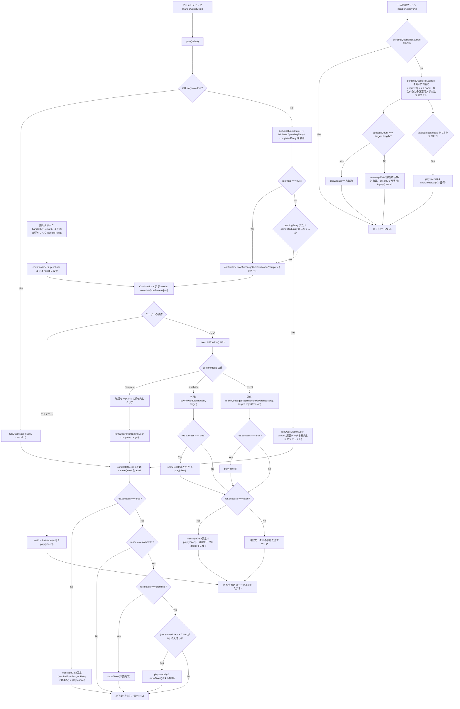

## 1. 解析メタ情報

| 項目 | 内容 |
| --- | --- |
| 対象ファイル | App.tsx |
| 言語 | React (TypeScript) |
| 解析対象 | 提供されたコードのみ |
| 推測・補完 | 一切なし |

## 関連ドキュメント

* [main.md](main.md) - 本コンポーネントをルートとしてマウントする呼び出し元（想定）
* [src/hooks/useGameData.md](src/hooks/useGameData.md) - ユーザー/クエスト/報酬データの取得・更新関数（`completeQuest`等）を提供するカスタムフック
* [src/hooks/useLayoutMode.md](src/hooks/useLayoutMode.md) - `landscape`/`portrait`のレイアウトモード判定フック
* [src/hooks/useSound.md](src/hooks/useSound.md) - 効果音再生フック
* [src/hooks/useOnlineStatus.md](src/hooks/useOnlineStatus.md) - オンライン/オフライン判定フック（対応する解析ドキュメントは本ファイルの解析時点では未作成）
* [src/context/useSettings.md](src/context/useSettings.md) - 表示密度・アイコン優先ユーザーなどの表示設定を提供するコンテキストフック（対応する解析ドキュメントは本ファイルの解析時点では未作成）
* [src/context/useToast.md](src/context/useToast.md) - トースト通知の表示関数を提供するコンテキストフック（対応する解析ドキュメントは本ファイルの解析時点では未作成）
* [src/lib/masterData.md](src/lib/masterData.md) - `INITIAL_USERS`フォールバックデータの提供元
* [src/types/index.md](src/types/index.md) - `Quest`/`QuestHistory`/`Reward`/`User`型の定義元
* [src/features/quest/hooks/useQuestStatus.md](src/features/quest/hooks/useQuestStatus.md) - `getQuestLockState`関数の実装元
* [src/components/layout/Header.md](src/components/layout/Header.md) - 子コンポーネント（ヘッダー。`hideUserSwitcher`/`hideLogSwitcher`/`showBackToMain`等のpropを渡す）
* [src/components/layout/BottomNav.md](src/components/layout/BottomNav.md) - 子コンポーネント（縦画面用フッターナビ。対応する解析ドキュメントは本ファイルの解析時点では未作成）
* [src/components/ui/AvatarUploader.md](src/components/ui/AvatarUploader.md) - 子コンポーネント（アバター変更モーダル、`React.lazy`で動的import）
* [src/components/ui/SettingsModal.md](src/components/ui/SettingsModal.md) - 子コンポーネント（表示設定モーダル、`React.lazy`で動的import。対応する解析ドキュメントは本ファイルの解析時点では未作成）
* [src/components/ui/MessageModal.md](src/components/ui/MessageModal.md) - 子コンポーネント（エラーメッセージ専用モーダル）
* [src/components/ui/Button.md](src/components/ui/Button.md) - 子コンポーネント（`ConfirmModal`内の各種ボタン）
* [src/components/ui/Modal.md](src/components/ui/Modal.md) - 子コンポーネント（`ConfirmModal`が内部で利用する汎用モーダル）
* [src/features/family/components/FamilyDashboard.md](src/features/family/components/FamilyDashboard.md) - 横画面（landscape）時のメイン表示コンポーネント
* [src/features/family/components/UserStatusCard.md](src/features/family/components/UserStatusCard.md) - 縦画面（portrait）時のユーザーステータス表示コンポーネント
* [src/features/family/components/FamilyLog.md](src/features/family/components/FamilyLog.md) - 子コンポーネント（`viewMode === 'familyLog'`時の記録表示）
* [src/features/quest/components/QuestList.md](src/features/quest/components/QuestList.md) - 縦画面時のクエスト一覧表示コンポーネント
* [src/features/quest/components/ApprovalList.md](src/features/quest/components/ApprovalList.md) - 縦画面時の承認待ち一覧表示コンポーネント（`onApproveAll`propを新たに受け取る）
* [src/features/shop/components/RewardShop.md](src/features/shop/components/RewardShop.md) - 「ごほうび」タブの実体コンポーネント
* [src/features/shop/components/InventoryList.md](src/features/shop/components/InventoryList.md) - 「もちもの」タブの実体コンポーネント

## 2. ファイルの概要

このファイルはReactアプリケーションのルートコンポーネント`App`を定義している。アプリケーション全体のUI状態（アクティブなタブ`activeTab`（クエスト/ごほうび/もちもの）、表示モード`viewMode`（メイン/家族記録）、選択中ユーザー、確認モーダルの状態、エラーメッセージ、アバターアップロード対象、設定モーダルの開閉）を管理し、`useLayoutMode`が返すレイアウトモード（`landscape`/`portrait`）に応じて、横画面用の`FamilyDashboard`（4人常時表示）または縦画面用の単一ユーザー切替UI（`UserStatusCard`＋`ApprovalList`＋`QuestList`/`RewardShop`/`InventoryList`タブ切替）のいずれかを条件分岐で描画する。`useGameData`・`useSound`・`useLayoutMode`・`useOnlineStatus`・`useSettings`・`useToast`の各フックから取得したデータや関数を各子コンポーネントへ渡すルーティング的な責務を持つ。`AvatarUploader`と`SettingsModal`は`React.lazy`による動的importで初回バンドルから分離されている。実機で子どもが操作する様子を見ると、クエスト完了のワンタップ即時実行は誤操作（意図しないクリア）につながりやすかったため、クエスト完了は`ConfirmModal`（App内で定義されたコンポーネント、`confirmMode === 'complete'`）による確認ダイアログを再び挟むように変更された。一方、取消は`QuestList`側の長押し（`useLongPress`）でのみ発火するため引き続き確認なしのワンタップ（`runQuestAction`）のままであり、ゴールドを消費する「購入」と親向けの「却下」も従来通り`ConfirmModal`による確認を経由する。成功系の通知は`useToast`によるトースト表示に統一されており、`messageData`ステートとそれに紐づく`MessageModal`はエラー通知専用となっている。
* 根拠: `App`関数定義とレイアウト分岐 (144, 146, 444, 461行目 / 抜粋: "function App() {", "const layoutMode = useLayoutMode();", "{viewMode === 'main' && layoutMode === 'landscape' && (", "{viewMode === 'main' && layoutMode === 'portrait' && (")
* 根拠: 動的importのコメント (41〜44行目 / 抜粋: "// 初期表示には不要なモーダル類は動的importで分離し、初回バンドルを軽くする\n// (実際に開かれるまでチャンクを読み込まない)\nconst AvatarUploader = lazy(() => import('./components/ui/AvatarUploader'));\nconst SettingsModal = lazy(() => import('./components/ui/SettingsModal'));")
* 根拠: クエスト完了の確認ダイアログ復活コメント (53〜54行目 / 抜粋: "// ★実機検証で子どもの誤操作が多かったため、クエスト完了(クリア)には確認ダイアログを復活させた。\n// 取り消しは長押しでのみ発火する(QuestList側のuseLongPress)ため、引き続き確認なしのワンタップとする。")

## 3. 外部依存関係

### インポート一覧

| 名称 | 種類 | 用途 | 根拠 |
| --- | --- | --- | --- |
| `useState`, `useRef`, `useEffect`, `lazy`, `Suspense` | 関数/コンポーネント | ローカル状態管理、`pendingQuestsRef`（常に最新の`pendingQuests`を参照するためのref）の保持と`useEffect`によるその同期、コンポーネントの動的import、非同期読み込み中のフォールバック制御 | 1行目: `import { useState, useRef, useEffect, lazy, Suspense } from 'react';` |
| `motion` | オブジェクト | ジェスチャー(`onPanEnd`)付きアニメーションdivの描画 | 2行目: `import { motion } from 'framer-motion';` |
| `WifiOff` | コンポーネント | オフライン時のバナーアイコン表示 | 3行目: `import { WifiOff } from 'lucide-react';` |
| `INITIAL_USERS` | 定数 | ユーザーデータが未取得または存在しない場合のフォールバック | 4行目: `import { INITIAL_USERS } from './lib/masterData';` |
| `useGameData`, `LevelUpInfo` | カスタムフック / 型定義 | ゲーム全体のデータ・状態更新関数の取得、レベルアップ情報の型 | 5行目: `import { useGameData, LevelUpInfo } from './hooks/useGameData';` |
| `useSound` | カスタムフック | 効果音再生関数の取得 | 6行目: `import { useSound } from './hooks/useSound';` |
| `useLayoutMode` | カスタムフック | 横画面/縦画面のレイアウトモード判定 | 7行目: `import { useLayoutMode } from './hooks/useLayoutMode';` |
| `useOnlineStatus` | カスタムフック | オンライン/オフライン状態の判定 | 8行目: `import { useOnlineStatus } from './hooks/useOnlineStatus';` |
| `useSettings` | カスタムフック(コンテキスト) | 表示密度(`density`)、アイコン優先表示ユーザーID一覧(`iconFirstUserIds`)の取得 | 9行目: `import { useSettings } from './context/useSettings';` |
| `useToast` | カスタムフック(コンテキスト) | トースト通知表示関数(`showToast`)の取得 | 10行目: `import { useToast } from './context/useToast';` |
| `RewardShop` | コンポーネント | 「ごほうび」タブの表示 | 11行目: `import RewardShop from './features/shop/components/RewardShop';` |
| `InventoryList` | コンポーネント | 「もちもの」タブの表示 | 12行目: `import { InventoryList } from './features/shop/components/InventoryList';` |
| `FamilyDashboard` | コンポーネント | 横画面用、4人常時表示レイアウトの表示 | 13行目: `import FamilyDashboard from './features/family/components/FamilyDashboard';` |
| `Quest`, `QuestHistory`, `Reward`, `User` | 型定義 | 各オブジェクトの型定義 | 15行目: `import { Quest, QuestHistory, Reward, User } from '@/types';` |
| `getQuestLockState` | 関数 | クエストの無限判定・申請中/完了履歴の検索など、ロック状態判定ロジックの取得 | 16行目: `import { getQuestLockState } from './features/quest/hooks/useQuestStatus';` |
| `Header` | コンポーネント | 画面上部のヘッダー表示 | 35行目: `import Header from './components/layout/Header';` |
| `BottomNav`, `BottomNavTab` | コンポーネント / 型 | 縦画面用フッターナビの表示、タブ種別の型 | 36行目: `import BottomNav, { BottomNavTab } from './components/layout/BottomNav';` |
| `MessageModal` | コンポーネント | エラーメッセージのモーダル表示 | 37行目: `import MessageModal from './components/ui/MessageModal';` |
| `Button` | コンポーネント | `ConfirmModal`内の各種ボタン表示 | 38行目: `import { Button } from './components/ui/Button';` |
| `Modal` | コンポーネント | 汎用モーダルダイアログの表示 | 39行目: `import { Modal } from './components/ui/Modal';` |
| `AvatarUploader` (lazy) | コンポーネント | アバター画像アップロード画面の表示（動的import） | 43行目: `const AvatarUploader = lazy(() => import('./components/ui/AvatarUploader'));` |
| `SettingsModal` (lazy) | コンポーネント | 表示設定モーダルの表示（動的import） | 44行目: `const SettingsModal = lazy(() => import('./components/ui/SettingsModal'));` |
| `UserStatusCard` | コンポーネント | 現在選択中ユーザーのステータス表示（縦画面） | 46行目: `import UserStatusCard from './features/family/components/UserStatusCard';` |
| `QuestList` | コンポーネント | クエスト一覧の表示（縦画面） | 47行目: `import QuestList from './features/quest/components/QuestList';` |
| `ApprovalList` | コンポーネント | 承認待ちクエスト一覧の表示（縦画面、保護者のみ） | 48行目: `import ApprovalList from './features/quest/components/ApprovalList';` |
| `FamilyLog` | コンポーネント | ファミリーのログ（記録）表示 | 49行目: `import FamilyLog from './features/family/components/FamilyLog';` |

### ブラックボックスとなる外部要素

| 名称 | 理由 | 根拠 |
| --- | --- | --- |
| インポートされている全UIコンポーネント（`RewardShop`, `InventoryList`, `FamilyDashboard`, `Header`, `BottomNav`, `AvatarUploader`, `SettingsModal`, `MessageModal`, `Button`, `Modal`, `UserStatusCard`, `QuestList`, `ApprovalList`, `FamilyLog`） | 実装ファイルが提供されておらず、内部のレンダリング内容や副作用が不明 | インポート文全体（1〜49行目） |
| `useGameData` | 実装が提供されておらず、非同期処理の成否判定やDBとの通信有無、データの初期構造が不明 | 5行目: `import { useGameData, LevelUpInfo } from './hooks/useGameData';` |
| `useSound` | 音声ファイルのパスや再生ロジックが不明 | 6行目: `import { useSound } from './hooks/useSound';` |
| `useLayoutMode` | `landscape`/`portrait`の判定条件（メディアクエリ等）の詳細が本ファイルからは不明 | 7行目: `import { useLayoutMode } from './hooks/useLayoutMode';` |
| `useOnlineStatus` | オンライン判定の具体的な実装（`navigator.onLine`監視か、実際の通信確認かなど）が不明 | 8行目: `import { useOnlineStatus } from './hooks/useOnlineStatus';` |
| `useSettings` | `density`/`iconFirstUserIds`以外に保持する設定項目や永続化方法が不明 | 9行目: `import { useSettings } from './context/useSettings';` |
| `useToast` | `showToast`の内部実装（表示時間、キュー処理、スタイリング）が不明 | 10行目: `import { useToast } from './context/useToast';` |
| `INITIAL_USERS` | データ構造の詳細が不明 | 4行目: `import { INITIAL_USERS } from './lib/masterData';` |
| `@/types` | 各型のプロパティ詳細が不明 | 15行目: `import { Quest, QuestHistory, Reward, User } from '@/types';` |
| `getQuestLockState` | 実装が提供されておらず、無限クエスト判定や履歴検索の具体的なロジックが不明 | 16行目: `import { getQuestLockState } from './features/quest/hooks/useQuestStatus';` |

## 4. 主要要素の定義（関数 / エンドポイント / コンポーネント）

### `isParentUser` (モジュールレベル関数)

* **役割**: `user.role`が`'role_adult'`かどうかで保護者判定を行う。コメントにより、これはUI上の配慮（隠しボタンを子どもに見せないため）でありセキュリティ境界ではないことが明記されている。
* 根拠: (18〜22行目 / 抜粋: "const isParentUser = (user: User) => user.role === 'role_adult';")

* **引数/リクエスト**: `user: User`
* **戻り値/レスポンス**: `boolean`
* **副作用**: なし
* **エラーハンドリング**: なし

### `getRepresentativeParent` (モジュールレベル関数)

* **役割**: 承認・却下の記録名義に使う代表の親ユーザーを返す。誰が実際にボタンを押したかは区別せず「親」として固定で記録する（要件5対応）。`allUsers`内に`role_adult`が見つからなければ`allUsers[0]`、それも無ければ`INITIAL_USERS[0]`にフォールバックする。
* 根拠: (24〜29行目 / 抜粋: "const getRepresentativeParent = (allUsers: User[]): User => {\n  const adult = allUsers.find(u => u.role === 'role_adult');\n  return adult || allUsers[0] || INITIAL_USERS[0];\n};")

* **引数/リクエスト**: `allUsers: User[]`
* **戻り値/レスポンス**: `User`
* **副作用**: なし
* **エラーハンドリング**: フォールバック連鎖により未定義を回避（27〜28行目）

### `REJECT_REASONS` (モジュールレベル定数)

* **役割**: 却下理由のプリセット文字列配列。`ConfirmModal`の却下モードで一覧表示され、自由入力の手間を省くために使われる。
* 根拠: (31〜32行目 / 抜粋: "// 却下理由のプリセット。自由入力の手間を省き、あとで見返した時にも理由がわかるようにする。\nconst REJECT_REASONS = ['写真が不明瞭', 'まだ終わっていない', '重複している', 'その他'];")

### `ConfirmTarget` (型定義)

* **役割**: `ConfirmModal`の`target`に渡りうる型。モード（完了/購入/却下）ごとに実際に持っているプロパティが異なるため、メッセージ生成はモードごとに個別にキャストして組み立てる。クエスト完了の確認ダイアログが復活したことに伴い`Quest`が追加された。
* 根拠: (51〜55行目 / 抜粋: "type ConfirmTarget = Quest | QuestHistory | Reward;")

### `ActionResult` (型定義)

* **役割**: `useGameData.ts`の`completeQuest`/`cancelQuest`/`buyReward`/`rejectQuest`/`approveQuest`ラッパー関数群の戻り値をまとめて受け取るためのインターフェース。各関数は`success`以外のフィールドが少しずつ異なる。
* 根拠: (57〜69行目 / 抜粋: "interface ActionResult {\n  success: boolean;\n  status?: string;\n  message?: string;\n  earnedMedals?: number;\n  leveledUp?: boolean;\n  newGold?: number;\n  reward?: Reward;\n  reason?: string;\n  detail?: string;\n}")

### `ERROR_REASON_MESSAGES` / `resolveErrorText` (モジュールレベル定数・関数)

* **役割**: `reason`文字列（`gold`/`pending`/`permission`/`error`）を日本語メッセージへマッピングする定数`ERROR_REASON_MESSAGES`と、`res.detail`（バックエンドが返す具体的なエラー内容）を`res.reason`によるマッピングより優先して返す`resolveErrorText`関数。
* 根拠: (71〜80行目 / 抜粋: "const resolveErrorText = (res: ActionResult, fallback: string): string =>\n  res.detail || (res.reason && ERROR_REASON_MESSAGES[res.reason]) || fallback;")

* **引数/リクエスト**: `res: ActionResult`, `fallback: string`
* **戻り値/レスポンス**: `string`
* **副作用**: なし
* **エラーハンドリング**: `res.detail`→`ERROR_REASON_MESSAGES[res.reason]`→`fallback`の順にフォールバック

### `ConfirmModal`

* **役割**: 完了確認・購入確認・却下確認用のモーダルを表示する。渡された`mode`（`'complete' | 'purchase' | 'reject' | null`）に応じて`getMessage`内の`switch`文でタイトルとメッセージテキストを切り替える。`mode === 'complete'`のときは「クエスト完了」というタイトルで「「タイトル」を完了にしますか？」を表示し（実機検証で子どもの誤操作が多かったため復活）、`mode === 'purchase'`では報酬の`cost_gold`（無ければ`cost`にフォールバック）を使って金額を表示する。`mode === 'reject'`のときのみ、`REJECT_REASONS`をワンタップで選べるボタン群を表示する。
* 根拠: (82〜142行目 / 抜粋: "const ConfirmModal = ({\n  mode, target, rejectReason, onSelectRejectReason, onConfirm, onCancel\n}: {")
* 根拠: `getMessage`の`switch`文 (94〜109行目 / 抜粋: "const getMessage = (): { title: string; text: string } => {\n    switch (mode) {")
* 根拠: `complete`ケース (96〜99行目 / 抜粋: "case 'complete': {\n        const t = target as Quest;\n        return { title: 'クエスト完了', text: `「${t.title}」を完了にしますか？` };\n      }")
* 根拠: `purchase`ケースの`cost_gold`フォールバック (100〜105行目 / 抜粋: "// Lowバグ修正: masterData.jsのフォールバック報酬はcost_goldを持たず\n        // costのみのため、cost_gold単独参照だと「undefinedG」表示になっていた。\n        return { title: 'アイテム購入', text: `「${t.title}」を ${t.cost_gold ?? t.cost}G で買いますか？` };")
* 根拠: 却下理由選択UI (117〜133行目 / 抜粋: "{mode === 'reject' && (\n          
")

* **引数/リクエスト**: オブジェクト `{ mode: 'complete' | 'purchase' | 'reject' | null, target: ConfirmTarget | null, rejectReason: string | null, onSelectRejectReason: (reason: string) => void, onConfirm: () => void, onCancel: () => void }`
* 根拠: (82〜91行目)

* **戻り値/レスポンス**: JSX要素、または`mode`/`target`が偽値の場合は`null`
* 根拠: (92行目 / 抜粋: "if (!mode || !target) return null;")

* **副作用**: なし（`onSelectRejectReason`/`onConfirm`/`onCancel`は親（`App`）から渡されたコールバックを呼ぶのみ）
* **エラーハンドリング**: `mode`または`target`がFalsyな場合は何も描画せず`null`を返す。
* 根拠: (92行目 / 抜粋: "if (!mode || !target) return null;")

### `App`

* **役割**: アプリケーションのルートコンポーネント。各種フックからデータ・関数を取得し、UI状態を管理し、各種ハンドラー関数を定義・子コンポーネントへ渡す。`useLayoutMode()`の結果に応じて`FamilyDashboard`（横画面）または縦画面用のUI一式を条件分岐で描画する。
* 根拠: `App` コンポーネント定義全体 (144〜570行目 / 抜粋: "function App() {")

* **引数/リクエスト**: なし
* 根拠: (144行目 / 抜粋: "function App() {")

* **戻り値/レスポンス**: JSX要素。`isLoading`が真の間はローディング表示のみを返す。
* 根拠: (412, 414行目 / 抜粋: "if (isLoading) return 
Loading Family Quest...
;", "return (\n    
")

* **副作用**: `App`は`useEffect`を1つ定義している（`pendingQuestsRef.current`を最新の`pendingQuests`に同期させるためのもので、`handleApproveAll`の`onRetry`が古い`pendingQuests`クロージャを掴んだままになるバグの修正として追加された）。これに加え、内部で呼び出す各種ハンドラーを通じて、状態更新・音声再生・トースト表示・`useGameData`のミューテーション呼び出しを行う。
* 根拠: (188〜194行目 / 抜粋: "// ★バグ修正(M-6-2): handleApproveAllのonRetryが承認失敗時点の古いpendingQuests\n  // クロージャを掴んだままになり、再試行すると既に承認済みの項目まで再承認しようとして\n  // 400エラーになり続けていた。refで常に最新のpendingQuestsを参照できるようにする。\n  const pendingQuestsRef = useRef(pendingQuests);\n  useEffect(() => {\n    pendingQuestsRef.current = pendingQuests;\n  }, [pendingQuests]);")

* **エラーハンドリング**: `useGameData`から取得した各更新関数(`completeQuest`等)のレスポンスが`!res.success`の場合、`resolveErrorText`により`res.detail`または`res.reason`に対応するメッセージ（なければ既定文言）を`messageData`にセットし、`cancel`音を鳴らす。
* 根拠: `runQuestAction`・`executeConfirm`・`handleApprove`・`handleApproveAll`内の分岐 (225〜230, 314〜321, 340〜347, 376〜382行目)

### `handleLevelUp` (App内の関数)

* **役割**: `useGameData`にコールバックとして渡され、レベルアップ発生時に`levelUp`効果音を再生し、トーストでレベルアップを通知する。以前はブロッキングモーダルで演出していたが、連続完了時のテンポを損なうためトースト表示に変更された（角度⑤）。
* 根拠: (170〜175行目 / 抜粋: "// 角度⑤: レベルアップ/メダル獲得などの「成功の演出」は、作業を止めるブロッキングモーダルから\n  // 自動で消えるトーストへ変更(連続してクエストを完了する際にテンポが悪かったため)。\n  const handleLevelUp = (info: LevelUpInfo) => {\n    play('levelUp');\n    showToast({ title: 'LEVEL UP!', text: `${info.user}は Lv.${info.level} になった！`, icon: '⚡' });\n  };")

* **引数/リクエスト**: `info: LevelUpInfo`
* **戻り値/レスポンス**: なし (void)
* **副作用**: `play('levelUp')`の呼び出し、`showToast`によるトースト表示
* 根拠: (173〜174行目)

### `handleUserChange` (App内の関数)

* **役割**: 現在のユーザー(`currentUserIdx`)を切り替え、`viewMode`を`'main'`に戻し、タップ音を鳴らす。
* 根拠: (197〜202行目 / 抜粋: "const handleUserChange = (idx: number) => {\n    setCurrentUserIdx(idx);\n    // ★修正③: ユーザーアイコンを押したら必ずメイン画面(User View)に戻す\n    setViewMode('main');\n    play('tap');\n  };")

* **引数/リクエスト**: `idx: number`
* **戻り値/レスポンス**: なし (void)
* **副作用**: `currentUserIdx`と`viewMode`の更新、`tap`音の再生
* **エラーハンドリング**: なし

### `runQuestAction` (App内の関数)

* **役割**: クエストの完了/取消の実行本体。完了は`ConfirmModal`（`confirmMode === 'complete'`）での確認後に`executeConfirm`から、取消は`QuestList`側の長押し操作をきっかけに`handleQuestClick`からワンタップで呼び出される。`mode`に応じて`completeQuest`または`cancelQuest`を呼び出し、成功時かつ`mode === 'complete'`の場合のみ、`res.status === 'pending'`なら申請完了トースト、`(res.earnedMedals ?? 0) > 0`ならメダル獲得演出（`medal`音＋トースト）を表示する（要件8のバグ修正: 以前フロントが`res.earnedMedals`を参照しておらず無反応だった）。
* 根拠: (204〜231行目 / 抜粋: "// 完了(confirmMode='complete'の確認後)・取り消し(長押しでワンタップ)の実行本体。\n  // 完了時、要件8のメダル演出(res.earnedMedalsを見て効果音・お祝い表示を出す)もここで行う。\n  const runQuestAction = async (user: User, mode: 'complete' | 'cancel', target: Quest | QuestHistory) => {")

* **引数/リクエスト**: `user: User`, `mode: 'complete' | 'cancel'`, `target: Quest | QuestHistory`
* 根拠: (206行目)

* **戻り値/レスポンス**: `Promise<void>`
* 根拠: `async`関数で明示的な戻り値なし (206行目)

* **副作用**: `completeQuest`/`cancelQuest`の呼び出し、`showToast`によるトースト表示、`medal`/`cancel`音の再生、失敗時の`messageData`更新
* 根拠: (211〜230行目)

* **エラーハンドリング**: `!res.success`の場合、`resolveErrorText(res, "失敗しました")`をエラーメッセージとして`messageData`にセットし（`onRetry`に同じ引数で`runQuestAction`を再実行するコールバックを含む）、`cancel`音を再生する。
* 根拠: (225〜230行目 / 抜粋: "setMessageData({\n      title: \"エラー\",\n      text: resolveErrorText(res, \"失敗しました\"),\n      onRetry: () => runQuestAction(user, mode, target),\n    });\n    play('cancel');")

### `handleQuestClick` (App内の関数)

* **役割**: クエストクリック時に、`select`音を再生した上で、履歴として渡されたかどうか、`getQuestLockState`が返す無限クエスト判定・申請中/完了履歴の有無に応じて処理を振り分ける。履歴として渡された場合、および既存の申請中/完了履歴が見つかった場合は`runQuestAction`を`'cancel'`モードでワンタップ実行する。一方、無限クエストの場合、および未実施のクエストを完了しようとする場合は（実機検証で子どもの誤操作が多かったため）即実行せず、`confirmUser`/`confirmTarget`/`confirmMode('complete')`をセットして`ConfirmModal`による確認を挟む。取消対象が既存履歴の場合、`quest_title`が履歴側に無ければ`q.title`から補完する。
* 根拠: (233〜272行目 / 抜粋: "const handleQuestClick = (user: User, q: Quest | QuestHistory, isHistory: boolean) => {")
* 根拠: 無限クエストの確認ダイアログ化 (247〜255行目 / 抜粋: "// 無限クエストは常に「完了」扱い\n    // ★実機検証で子どもの誤操作(意図しない完了)が多かったため、完了(クリア)には\n    // 確認ダイアログを挟む(取り消しは長押しで保護されているため対象外)。\n    if (isInfinite) {\n      setConfirmUser(user);\n      setConfirmTarget(q);\n      setConfirmMode('complete');\n      return;\n    }")
* 根拠: `quest_title`補完 (260〜265行目 / 抜粋: "runQuestAction(user, 'cancel', { ...historyEntry, quest_title: ('title' in q ? q.title : undefined) || historyEntry.quest_title });")
* 根拠: 未実施クエストの確認ダイアログ化 (266〜271行目 / 抜粋: "} else {\n      // 未実施なら確認ダイアログを挟んでから完了\n      setConfirmUser(user);\n      setConfirmTarget(q);\n      setConfirmMode('complete');\n    }")

* **引数/リクエスト**: `user: User`, `q: Quest | QuestHistory`, `isHistory: boolean`
* **戻り値/レスポンス**: なし (void)
* **副作用**: `isHistory`または既存履歴ありの場合は`runQuestAction`（取消）の呼び出し、それ以外（無限クエスト・未実施クエスト）の場合は`confirmUser`/`confirmTarget`/`confirmMode`の更新による`ConfirmModal`表示、`select`音の再生
* **エラーハンドリング**: なし。取消は分岐先の`runQuestAction`側で、完了は確認後の`executeConfirm`経由の`runQuestAction`側でエラー処理を行う。

### `handleBuyReward` (App内の関数)

* **役割**: 報酬購入確認モーダルを開くための状態設定（`confirmUser`, `confirmTarget`, `confirmMode`を`'purchase'`にセット）。
* 根拠: (274〜279行目 / 抜粋: "const handleBuyReward = (user: User, r: Reward) => {\n    setConfirmUser(user);\n    setConfirmTarget(r);\n    setConfirmMode('purchase');\n    play('select');\n  };")

* **引数/リクエスト**: `user: User`, `r: Reward`
* **戻り値/レスポンス**: なし (void)
* **副作用**: `confirmUser`, `confirmTarget`, `confirmMode` の更新、`select`音の再生

### `executeConfirm` (App内の関数)

* **役割**: `confirmMode`（`'complete'`/`'purchase'`/`'reject'`）に応じた処理を実行する。`confirmMode === 'complete'`の場合は確認モーダルの状態を先にクリアしたうえで`runQuestAction(actingUser, 'complete', target)`に処理を委譲し、成功/失敗の通知や演出はすべて`runQuestAction`側で行う。`'purchase'`/`'reject'`の場合は`buyReward`/`rejectQuest`を実行し、結果に応じてトースト（成功時）またはエラーメッセージ（失敗時）を設定する。購入成功時は`clear`音（要件8: メダル音は「メダル獲得時」専用に戻し、購入時に誤って鳴っていたのを削除）、却下成功時は`cancel`音を再生する。
* 根拠: (282〜327行目 / 抜粋: "const executeConfirm = async () => {")
* 根拠: `complete`モードの委譲 (286〜295行目 / 抜粋: "if (confirmMode === 'complete') {\n      // 完了処理そのもの(メダル演出・エラー表示含む)はrunQuestActionに委ねる。\n      // モーダルは先に閉じ、成功/失敗の通知はトースト/エラーモーダル側で行う。\n      const target = confirmTarget as Quest;\n      setConfirmMode(null);\n      setConfirmTarget(null);\n      setConfirmUser(null);\n      await runQuestAction(actingUser, 'complete', target);\n      return;\n    }")

* **引数/リクエスト**: なし
* **戻り値/レスポンス**: `Promise<void>`
* **副作用**: `confirmMode === 'complete'`の場合は確認モーダル状態を先にクリアしたうえで`runQuestAction`を呼び出す。`'purchase'`/`'reject'`の場合は`buyReward`/`rejectQuest`の呼び出し、成功時の`showToast`/音再生、失敗時の`messageData`更新、成功時のみ実行される確認モーダル状態のクリア(`setConfirmMode`, `setConfirmTarget`, `setConfirmUser`, `setRejectReason`)
* 根拠: (286〜295, 299〜312, 323〜326行目)

* **エラーハンドリング**: `'purchase'`/`'reject'`の場合、`!res.success`のとき`confirmMode === 'reject'`かどうかでフォールバック文言（「却下に失敗しました」/「失敗しました」）を切り替えつつ`resolveErrorText(res, fallback)`を`messageData`にセットし`cancel`音を再生して`return`する。このとき購入・却下いずれの失敗でも確認モーダルの状態（`confirmMode`/`confirmTarget`等）はクリアされず、モーダルは開いたまま残る（角度⑨: エラーを閉じたあと状態を失わずに「はい」で再試行できるようにするため）。`'complete'`の場合のエラー処理は`runQuestAction`側に委譲され、`executeConfirm`自身はモーダルを閉じるのみで成否を判定しない。
* 根拠: (314〜321行目 / 抜粋: "if (!res.success) {\n      const fallback = confirmMode === 'reject' ? \"却下に失敗しました\" : \"失敗しました\";\n      setMessageData({ title: \"エラー\", text: resolveErrorText(res, fallback) });\n      play('cancel');\n      // ★角度⑨: 確認モーダルは閉じずに残し、エラーを閉じたあとにもう一度「はい」で\n      // 再試行できるようにする(状態[購入対象/却下理由]を失わないため)\n      return;\n    }")

### `handleApprove` (App内の関数)

* **役割**: クエスト承認処理を実行する。記録名義は`getRepresentativeParent(users)`で「親」に固定する（要件5）。成功時、承認APIのレスポンス`res.earnedMedals`が1以上であれば`medal`音とメダル獲得トーストを表示する（バグ修正M-6-1: 以前は承認経由のメダル獲得演出が一切反映されなかった）。失敗時はエラーメッセージ（`onRetry`で同じ引数で自身を再実行するコールバック付き）を表示する。
* 根拠: (329〜348行目 / 抜粋: "const handleApprove = async (history: QuestHistory) => {")
* 根拠: メダル獲得演出のバグ修正 (334〜339行目 / 抜粋: "// ★バグ修正(M-6-1): 承認APIのearnedMedalsを見て、完了フロー(runQuestAction)と\n      // 同様にメダル獲得演出を出す(以前は承認経由だと一切反映されなかった)。\n      if ((res.earnedMedals ?? 0) > 0) {\n        play('medal');\n        showToast({ title: \"ちいさなメダル獲得！\", text: `ちいさなメダルを ${res.earnedMedals} 枚手に入れた！`, icon: \"🏅\" });\n      }")

* **引数/リクエスト**: `history: QuestHistory`
* **戻り値/レスポンス**: `Promise<void>`
* **副作用**: `approveQuest`の呼び出し、`approve`/`medal`/`cancel`音の再生、成功時（メダル獲得時）の`showToast`、失敗時の`messageData`更新
* **エラーハンドリング**: `!res.success`の場合、`resolveErrorText(res, "承認に失敗しました")`を`messageData`にセットし`cancel`音を再生
* 根拠: (340〜347行目)

### `handleApproveAll` (App内の関数)

* **役割**: 承認待ちが複数あるとき、1件ずつ承認する手間を減らす一括承認処理（角度⑩）。`pendingQuests`の直接のクロージャではなく`pendingQuestsRef.current`のスナップショットを対象に、`approveQuest`を1件ずつ順番に`await`し、成功件数と合計獲得メダル数(`totalEarnedMedals`)をカウントする（バグ修正M-6-2: 以前は失敗時点の古い`pendingQuests`クロージャを掴んだままの`onRetry`が再試行され、既に承認済みの項目まで再承認しようとして400エラーが続いていた）。1件でも成功すれば`approve`音を鳴らし、メダルを1枚以上獲得していれば`medal`音とメダル獲得トーストを表示する。全件成功ならトーストで結果を通知、一部でも失敗すれば成功件数を含むエラーメッセージ（`onRetry`で自身を再実行）を表示する。
* 根拠: (350〜383行目 / 抜粋: "// 角度⑩: 承認待ちが複数あるとき、1件ずつ承認する手間を減らす一括承認\n  const handleApproveAll = async () => {")
* 根拠: `pendingQuestsRef`参照へのバグ修正 (352〜354行目 / 抜粋: "// ★バグ修正(M-6-2): 古いpendingQuestsクロージャではなく、refで常に最新の\n    // 一覧を参照する(このハンドラ自体が古いonRetryとして再試行されても正しく動く)。\n    const targets = [...pendingQuestsRef.current];")
* 根拠: メダル獲得演出 (367〜371行目 / 抜粋: "if (successCount > 0) play('approve');\n    if (totalEarnedMedals > 0) {\n      play('medal');\n      showToast({ title: \"ちいさなメダル獲得！\", text: `ちいさなメダルを ${totalEarnedMedals} 枚手に入れた！`, icon: \"🏅\" });\n    }")

* **引数/リクエスト**: なし
* **戻り値/レスポンス**: `Promise<void>`
* **副作用**: `pendingQuestsRef.current`件数分の`approveQuest`呼び出し、`approve`/`medal`/`cancel`音の再生、成功時（および合計メダル獲得時）の`showToast`、一部失敗時の`messageData`更新
* 根拠: (357〜382行目)

* **エラーハンドリング**: 対象が0件なら即`return`。`successCount !== targets.length`の場合、`「一部の承認に失敗しました (成功数/対象数件成功)」`という文言で`messageData`をセットする(`onRetry`は`() => handleApproveAll()`として自身を再実行する)。
* 根拠: (355, 373〜382行目)

### `handleReject` (App内の関数)

* **役割**: 却下確認モーダルを開くための状態設定（`confirmMode`を`'reject'`にする）。`confirmUser`は`getRepresentativeParent`で親を確定するため不要としてクリアする。
* 根拠: (385〜391行目 / 抜粋: "const handleReject = (history: QuestHistory) => {\n    setConfirmTarget(history);\n    setConfirmMode('reject');\n    setConfirmUser(null); // reject は getRepresentativeParent で親を確定するため不要\n    setRejectReason(null);\n    play('select');\n  };")

* **引数/リクエスト**: `history: QuestHistory`
* **戻り値/レスポンス**: なし (void)
* **副作用**: `confirmTarget`, `confirmMode`, `confirmUser`, `rejectReason` の更新、`select`音の再生

### `getHeaderViewMode` (App内の関数)

* **役割**: `Header`コンポーネントに渡すためのビューモード文字列を判定する。`viewMode === 'familyLog'`なら`'familyLog'`、それ以外は`'user'`を返す。
* 根拠: (393〜396行目 / 抜粋: "const getHeaderViewMode = () => {\n    if (viewMode === 'familyLog') return 'familyLog';\n    return 'user';\n  };")

* **引数/リクエスト**: なし
* **戻り値/レスポンス**: 文字列 `'familyLog' | 'user'`
* **副作用**: なし

### `handleBottomNavChange` (App内の関数)

* **役割**: 縦画面用フッターナビ`BottomNav`のタブ変更を受け取り、`tap`音を再生した上で、`'familyLog'`タブなら`viewMode`を`'familyLog'`に、それ以外なら`viewMode`を`'main'`に戻しつつ`activeTab`を更新する（角度⑦: 縦画面はフッターナビに一本化）。
* 根拠: (398〜407行目 / 抜粋: "// 角度⑦: 縦画面はフッターナビ(クエスト/ごほうび/記録)に一本化する\n  const handleBottomNavChange = (tab: BottomNavTab) => {\n    play('tap');\n    if (tab === 'familyLog') {\n      setViewMode('familyLog');\n    } else {\n      setViewMode('main');\n      setActiveTab(tab);\n    }\n  };")

* **引数/リクエスト**: `tab: BottomNavTab`
* **戻り値/レスポンス**: なし (void)
* **副作用**: `viewMode`/`activeTab`の更新、`tap`音の再生

### `App` のレンダリング分岐（JSX本体）

* **役割**: `isLoading`ならローディング表示のみを返す。それ以外は、オフライン時のバナー（`!isOnline`、`WifiOff`アイコン付き）、`Header`（`hideUserSwitcher={layoutMode === 'landscape'}`, `hideLogSwitcher={layoutMode === 'portrait'}`, `showBackToMain={layoutMode === 'landscape'}`）を描画したのち、`viewMode === 'main' && layoutMode === 'landscape'`なら`FamilyDashboard`、`viewMode === 'main' && layoutMode === 'portrait'`なら`UserStatusCard`＋（保護者なら）`ApprovalList`＋スワイプ対応の`motion.div`内で`activeTab`（`quest`/`shop`/`inventory`）に応じた`QuestList`/`RewardShop`/`InventoryList`、`viewMode === 'familyLog'`なら`FamilyLog`を描画する。縦画面のときのみ`BottomNav`を表示する。コンテナの最大幅は`densityWrapperClass`（`density === 'compact'`で余白を縮小）と`layoutMode === 'landscape'`のとき`max-w-7xl`、それ以外は`max-w-md md:max-w-5xl`に切り替わる。
* 根拠: (444〜524行目 / 抜粋: "{viewMode === 'main' && layoutMode === 'landscape' && (\n          <FamilyDashboard", "{viewMode === 'main' && layoutMode === 'portrait' && (", "${layoutMode === 'landscape' ? 'max-w-7xl' : 'max-w-md md:max-w-5xl'}")
* 根拠: スワイプ操作 (480〜489行目 / 抜粋: "{/* 角度⑯: 左右スワイプでもクエスト/ごほうびタブを切り替えられるようにする */}\n            <motion.div\n              className=\"min-h-[300px] animate-fade-in\"\n              onPanEnd={(_e, info) => {\n                const order: Array<'quest' | 'shop' | 'inventory'> = ['quest', 'shop', 'inventory'];")

* **副作用**: `avatarUser`が設定されている場合、`Suspense`配下で遅延ロードされた`AvatarUploader`の`onUploadComplete`から`refreshData()`と`showToast`による成功通知が行われる。`settingsOpen`が真の場合、同じく`Suspense`配下で遅延ロードされた`SettingsModal`が表示される。
* 根拠: (551〜566行目 / 抜粋: "<Suspense fallback={null}>\n        {avatarUser && (\n          <AvatarUploader\n            user={avatarUser}\n            onClose={() => setAvatarUser(null)}\n            onUploadComplete={() => {\n              refreshData();\n              showToast({ title: \"変更完了\", text: \"アバターを変更しました！\", icon: '🖼️' });\n            }}\n          />\n        )}\n\n        {settingsOpen && (\n          <SettingsModal isOpen={settingsOpen} onClose={() => setSettingsOpen(false)} users={users} />\n        )}\n      </Suspense>")

## 5. 処理フロー図

※クエストクリックから完了(確認モーダル経由)/取消(長押しでワンタップ)までのフロー、購入・却下の確認モーダル経由フロー、一括承認フロー(角度⑩、メダル演出含む)を描画する。実機検証で子どもの誤操作が多かったため、クエスト完了は`ConfirmModal`による確認を再び挟むようになった一方、取消は引き続き確認なしのワンタップである。

```mermaid
flowchart TD
    QStart["クエストクリック (handleQuestClick)"] --> PlaySelect["play(select)"]
    PlaySelect --> IsHistory{"isHistory === true?"}

    IsHistory -- Yes --> RunCancelHist["runQuestAction(user, cancel, q)"]
    IsHistory -- No --> CallLockState["getQuestLockState() で isInfinite / pendingEntry / completedEntry を取得"]

    CallLockState --> IsInfinite{"isInfinite === true?"}
    IsInfinite -- Yes --> OpenCompleteConfirm["confirmUser/confirmTarget/confirmMode('complete') をセット"]
    IsInfinite -- No --> HasHistory{"pendingEntry または completedEntry が存在するか"}

    HasHistory -- Yes --> RunCancelWithHistory["runQuestAction(user, cancel, 履歴データを補完したオブジェクト)"]
    HasHistory -- No --> OpenCompleteConfirm

    BStart["購入クリック handleBuyReward、または却下クリック handleReject"] --> SetModal["confirmMode を purchase または reject に設定"]
    OpenCompleteConfirm --> ShowConfirmModal["ConfirmModal 表示 (mode: complete/purchase/reject)"]
    SetModal --> ShowConfirmModal

    ShowConfirmModal --> WaitAction{"ユーザーの操作"}
    WaitAction -- キャンセル --> CloseModal["setConfirmMode(null) & play(cancel)"]
    WaitAction -- はい --> ExecuteConfirm["executeConfirm() 実行"]

    ExecuteConfirm --> CheckMode{"confirmMode の値"}
    CheckMode -- complete --> CloseThenComplete["確認モーダルの状態を先にクリア"]
    CloseThenComplete --> RunCompleteConfirmed["runQuestAction(actingUser, complete, target)"]
    CheckMode -- purchase --> CallBuyReward["外部: buyReward(actingUser, target)"]
    CheckMode -- reject --> CallReject["外部: rejectQuest(getRepresentativeParent(users), target, rejectReason)"]

    RunCancelHist --> QAction["completeQuest または cancelQuest を await"]
    RunCancelWithHistory --> QAction
    RunCompleteConfirmed --> QAction

    QAction --> QSuccess{"res.success === true?"}
    QSuccess -- No --> QError["messageData設定(resolveErrorText, onRetryで再実行) & play(cancel)"]
    QSuccess -- Yes --> QMode{"mode === complete ?"}
    QMode -- No --> QEnd["終了(取消完了、演出なし)"]
    QMode -- Yes --> QPending{"res.status === pending ?"}
    QPending -- Yes --> QPendingMsg["showToast(申請完了)"]
    QPending -- No --> QMedal{"(res.earnedMedals ?? 0) が 0より大きいか"}
    QMedal -- Yes --> QMedalFx["play(medal) & showToast(メダル獲得)"]
    QMedal -- No --> QEnd
    QPendingMsg --> QEnd
    QMedalFx --> QEnd
    QError --> QEnd

    CallBuyReward --> BuySuccess{"res.success === true?"}
    BuySuccess -- Yes --> BuyMsg["showToast(購入完了) & play(clear)"]
    BuySuccess -- No --> CommonErrorCheck

    CallReject --> RejectSuccess{"res.success === true?"}
    RejectSuccess -- Yes --> PlayCancelSound["play(cancel)"]
    RejectSuccess -- No --> CommonErrorCheck

    BuyMsg --> CommonErrorCheck{"res.success === false?"}
    PlayCancelSound --> CommonErrorCheck
    CommonErrorCheck -- Yes --> HandleError["messageData設定 & play(cancel)、確認モーダルは閉じずに残す"]
    CommonErrorCheck -- No --> CleanUp["確認モーダルの状態を全てクリア"]
    HandleError --> BEnd["終了(失敗時はモーダル開いたまま)"]
    CleanUp --> BEnd
    CloseModal --> BEnd

    AStart["一括承認クリック handleApproveAll"] --> CheckTargets{"pendingQuestsRef.currentが0件か"}
    CheckTargets -- Yes --> AEnd["終了(何もしない)"]
    CheckTargets -- No --> LoopApprove["pendingQuestsRef.currentを1件ずつ順にapproveQuestをawait、成功件数と合計獲得メダル数をカウント"]
    LoopApprove --> AllSuccess{"successCount === targets.length ?"}
    AllSuccess -- Yes --> AToast["showToast(一括承認)"]
    AllSuccess -- No --> AError["messageData設定(成功数/対象数、onRetryで再実行) & play(cancel)"]
    LoopApprove --> AMedalCheck{"totalEarnedMedals が 0より大きいか"}
    AMedalCheck -- Yes --> AMedalFx["play(medal) & showToast(メダル獲得)"]
    AToast --> AEnd
    AError --> AEnd
    AMedalFx --> AEnd
```

## 6. 依存関係図

```mermaid
graph TD
    App["App コンポーネント"]
    ConfirmModal["ConfirmModal (App内定義)"]

    useGameData["Hook: useGameData (ブラックボックス)"]
    useSound["Hook: useSound (ブラックボックス)"]
    useLayoutMode["Hook: useLayoutMode (ブラックボックス)"]
    useOnlineStatus["Hook: useOnlineStatus (ブラックボックス)"]
    useSettings["Hook: useSettings (ブラックボックス)"]
    useToast["Hook: useToast (ブラックボックス)"]
    getQuestLockState["関数: getQuestLockState (ブラックボックス)"]
    INITIAL_USERS["定数: INITIAL_USERS"]

    UI_Header["コンポーネント: Header"]
    UI_BottomNav["コンポーネント: BottomNav (layoutMode==='portrait')"]
    UI_Family["コンポーネント: FamilyDashboard (layoutMode==='landscape')"]
    UI_Main_User["コンポーネント: UserStatusCard (layoutMode==='portrait')"]
    UI_Main_Approval["コンポーネント: ApprovalList (layoutMode==='portrait' かつ保護者)"]

    Tab_Quest["コンポーネント: QuestList (activeTab==='quest')"]
    Tab_Shop["コンポーネント: RewardShop (activeTab==='shop')"]
    Tab_Inventory["コンポーネント: InventoryList (activeTab==='inventory')"]

    Modal_Message["コンポーネント: MessageModal (messageData)"]
    Modal_Avatar["コンポーネント: AvatarUploader (lazy, avatarUser)"]
    Modal_Settings["コンポーネント: SettingsModal (lazy, settingsOpen)"]

    View_Log["コンポーネント: FamilyLog (viewMode==='familyLog')"]

    App --> useGameData
    App --> useSound
    App --> useLayoutMode
    App --> useOnlineStatus
    App --> useSettings
    App --> useToast
    App --> getQuestLockState
    App --> INITIAL_USERS
    App --> ConfirmModal

    App --> UI_Header
    App --> UI_BottomNav

    App --> UI_Family
    App --> UI_Main_User
    App --> UI_Main_Approval

    App --> Tab_Quest
    App --> Tab_Shop
    App --> Tab_Inventory

    App --> Modal_Message
    App --> Modal_Avatar
    App --> Modal_Settings

    App --> View_Log
```

## 7. 次のステップ（リバースエンジニアリングの提案）

| 優先度 | ファイル名(推測可) | 理由 | 根拠 |
| --- | --- | --- | --- |
| 高 | `./hooks/useGameData.ts` | アプリケーションのコアドメインロジック（データのCRUD処理やAPI通信、非同期状態）がすべてこのフックに集約されており、`ActionResult`相当の戻り値構造もここで定義されているため。 | 5行目 `import { useGameData, LevelUpInfo } from './hooks/useGameData';` |
| 高 | `./hooks/useLayoutMode.ts` | 横画面/縦画面の切り替え条件（`landscape`/`portrait`の判定基準）を正確に把握するために必須であるため。 | 7行目 `import { useLayoutMode } from './hooks/useLayoutMode';` |
| 中 | `./hooks/useOnlineStatus.ts` | オフラインバナー表示の判定条件（`navigator.onLine`か実際の疎通確認か）を把握するため。 | 8行目 `import { useOnlineStatus } from './hooks/useOnlineStatus';` |
| 中 | `./context/useSettings.ts` | `density`/`iconFirstUserIds`の設定項目一覧と永続化方法を把握するため。 | 9行目 `import { useSettings } from './context/useSettings';` |
| 中 | `./context/useToast.ts` | `showToast`のAPI仕様（表示時間、キュー処理の有無）を把握するため。 | 10行目 `import { useToast } from './context/useToast';` |
| 中 | `./components/layout/BottomNav.tsx` | `BottomNavTab`の実際の選択肢と、`active`propの反映方法を把握するため。 | 36行目 `import BottomNav, { BottomNavTab } from './components/layout/BottomNav';` |
| 中 | `./features/family/components/FamilyDashboard.tsx` | 横画面時のメイン表示コンポーネントであり、4人パネル表示や`onApproveAll`propの利用実態の内部実装を把握する必要があるため。 | 13行目 `import FamilyDashboard from './features/family/components/FamilyDashboard';` |
| 低 | `./features/quest/hooks/useQuestStatus.ts` | `getQuestLockState`（無限クエスト判定・申請中/完了履歴の検索）の実装がここに集約されており、`handleQuestClick`のロジックを正確に把握するために必須であるため。 | 16行目 `import { getQuestLockState } from './features/quest/hooks/useQuestStatus';` |

## 8. 保守上の注意点

* **確認モーダル失敗時に状態がクリアされない（purchase/rejectのみ）**: `executeConfirm`は`confirmMode`が`'purchase'`/`'reject'`いずれの場合でも、共通の`if (!res.success)`ブロックでエラーメッセージを設定するのみで`return`し、`setConfirmMode(null)`等のクリア処理を実行しない。これはコメント（角度⑨）により、エラーを閉じたあと確認モーダルを再度開き直すことなく「はい」で再試行できるようにするための意図的な設計である。一方`'complete'`の場合は確認モーダルの状態を`runQuestAction`呼び出し前に既にクリアしているため、この「モーダルを残す」再試行パターンの対象外である。
* 根拠: (314〜321行目 / 抜粋: "if (!res.success) {\n      const fallback = confirmMode === 'reject' ? \"却下に失敗しました\" : \"失敗しました\";\n      setMessageData({ title: \"エラー\", text: resolveErrorText(res, fallback) });\n      play('cancel');\n      // ★角度⑨: 確認モーダルは閉じずに残し、エラーを閉じたあとにもう一度「はい」で\n      // 再試行できるようにする(状態[購入対象/却下理由]を失わないため)\n      return;\n    }")
* **成功通知はトースト、失敗通知はモーダルに統一**: レベルアップ・メダル獲得（完了/承認/一括承認いずれの経路でも）・申請完了・購入完了・一括承認成功はすべて`useToast`の`showToast`で通知され、`messageData`/`MessageModal`はエラー専用になっている。新しい成功系フィードバックを追加する際はトースト経由に統一する必要がある。
* 根拠: 170〜175行目のコメント、および`showToast`呼び出し箇所全体 (174, 214, 219, 302, 338, 370, 374行目)
* **クエスト完了の確認ダイアログ復活とワンタップ取消の使い分け**: クエストの完了はかつて要件9によりワンタップ即時実行だったが、実機で子どもが操作する様子を見ると誤操作（意図しないクリア）につながりやすかったため、`ConfirmModal`（`confirmMode === 'complete'`）による確認ダイアログを再び挟むように変更された。取消は`QuestList`側の長押し（`useLongPress`）によってのみ発火するため、引き続き確認なしのワンタップ（`runQuestAction`）のままである。ゴールドを消費する「購入」と親向けの「却下」も引き続き`ConfirmModal`（`confirmMode`が`'purchase'`/`'reject'`）を経由する。
* 根拠: (53〜54行目 / 抜粋: "// ★実機検証で子どもの誤操作が多かったため、クエスト完了(クリア)には確認ダイアログを復活させた。\n// 取り消しは長押しでのみ発火する(QuestList側のuseLongPress)ため、引き続き確認なしのワンタップとする。")
* **メダル獲得演出のバグ修正（完了・承認・一括承認の3経路）**: 以前はサーバー側で計算されていた`earnedMedals`をフロントが一切参照していなかったため無反応だった。現在は`runQuestAction`内（クエスト完了時、215〜220行目）に加え、`handleApprove`（個別承認、334〜339行目、バグ修正M-6-1）と`handleApproveAll`（一括承認、367〜371行目）でも`(res.earnedMedals ?? 0) > 0`（一括承認は合計値`totalEarnedMedals`）を判定し、`medal`音とトーストを表示する。以前は承認経由のメダル獲得演出が一切反映されていなかった。
* 根拠: (215〜220行目 / 抜粋: "} else if ((res.earnedMedals ?? 0) > 0) {\n          // ★バグ修正(要件8): サーバーは正しくメダルを付与していたが、以前はフロントが\n          // res.earnedMedals を一切参照しておらず無反応だった。leveledUpと同様に扱う。\n          play('medal');\n          showToast({ title: \"ちいさなメダル獲得！\", ...")
* 根拠: `handleApprove`のバグ修正コメント (334〜335行目 / 抜粋: "// ★バグ修正(M-6-1): 承認APIのearnedMedalsを見て、完了フロー(runQuestAction)と\n      // 同様にメダル獲得演出を出す(以前は承認経由だと一切反映されなかった)。")
* **`pendingQuestsRef`によるクロージャバグの修正**: `handleApproveAll`は以前、失敗時点の古い`pendingQuests`をクロージャで掴んだ`onRetry`（自身の再呼び出し）を`messageData`に設定していたため、再試行すると既に承認済みの項目まで再承認しようとして400エラーが続く不具合があった(M-6-2)。修正後は`pendingQuestsRef`（`useRef`+`useEffect`で常に最新の`pendingQuests`に同期）の`current`値を対象にすることで解消されている。新たに`pendingQuests`を参照するハンドラーを追加する際、`onRetry`等でクロージャとして再実行されうる場合は同様に`pendingQuestsRef`経由の参照を検討する必要がある。
* 根拠: (188〜194行目 / 抜粋: "// ★バグ修正(M-6-2): handleApproveAllのonRetryが承認失敗時点の古いpendingQuests\n  // クロージャを掴んだままになり、再試行すると既に承認済みの項目まで再承認しようとして\n  // 400エラーになり続けていた。refで常に最新のpendingQuestsを参照できるようにする。\n  const pendingQuestsRef = useRef(pendingQuests);\n  useEffect(() => {\n    pendingQuestsRef.current = pendingQuests;\n  }, [pendingQuests]);")
* **一括承認の逐次実行**: `handleApproveAll`は`for...of`ループで`approveQuest`を1件ずつ`await`しており、並列実行（`Promise.all`等）ではない。対象件数が多い場合の実行時間はAPIレイテンシに比例する。
* 根拠: (359〜365行目 / 抜粋: "for (const history of targets) {\n      const res = await approveQuest(getRepresentativeParent(users), history);\n      if (res.success) {\n        successCount++;\n        totalEarnedMedals += res.earnedMedals ?? 0;\n      }\n    }")
* **`cost_gold`欠落時のフォールバック**: 購入確認モーダルの金額表示は以前`Reward.cost_gold`のみを参照しており、`masterData.js`のフォールバック報酬（`cost_gold`を持たず`cost`のみ）が選択されると「undefinedG」と表示されるLowバグがあった。他の参照箇所（`RewardList.tsx`）と同様に`cost_gold ?? cost`のフォールバックで修正済み。
* 根拠: (100〜105行目 / 抜粋: "// Lowバグ修正: masterData.jsのフォールバック報酬はcost_goldを持たず\n        // costのみのため、cost_gold単独参照だと「undefinedG」表示になっていた。\n        return { title: 'アイテム購入', text: `「${t.title}」を ${t.cost_gold ?? t.cost}G で買いますか？` };")
* **PARENT判定はUI上の配慮に過ぎない**: `isParentUser`（`quest_users.role`基準）はクライアント側の表示制御のみに使われ、セキュリティ境界ではない。実際のアクセス制御はバックエンド側で別途行う必要がある。
* 根拠: (18〜21行目 / 抜粋: "// ★注意: これはクライアント側のUI上の配慮（隠しボタンを子どもに見せないため）にすぎず、\n// セキュリティ境界ではない。バックエンドは現状どのuser_idでも自称できてしまうため、")
* **承認・却下の記録名義固定**: `getRepresentativeParent`により、承認・却下の記録名義は常に代表の親1名に固定される（要件5）。横画面の4人表示では「今アクティブなユーザー」概念が存在しないための設計である。
* 根拠: (24〜25行目 / 抜粋: "// 承認・却下の記録名義に使う代表の親ユーザーを返す。誰が実際にボタンを押したかは\n// 区別せず「親」として固定で記録する(要件5)。")
* **タブ切替の二重導線**: 縦画面の`activeTab`（`quest`/`shop`/`inventory`）は`BottomNav`のタップと、`motion.div`の`onPanEnd`による左右スワイプ（角度⑯）の両方で切り替え可能。スワイプの閾値は`info.offset.x`が`-60`未満／`60`超で判定している。
* 根拠: (480〜489行目 / 抜粋: "onPanEnd={(_e, info) => {\n                const order: Array<'quest' | 'shop' | 'inventory'> = ['quest', 'shop', 'inventory'];\n                const idx = order.indexOf(activeTab);\n                if (info.offset.x < -60 && idx < order.length - 1) setActiveTab(order[idx + 1]);\n                else if (info.offset.x > 60 && idx > 0) setActiveTab(order[idx - 1]);\n              }}")

## 9. 不明事項一覧

| 項目 | 理由 | 必要なファイル |
| --- | --- | --- |
| `useGameData` の各関数の戻り値構造の詳細 | `ActionResult`型はApp.tsx内でローカル定義されているが、各関数(`completeQuest`等)が実際にどのフィールドを埋めて返すかはフック側の実装依存で不明 | `./hooks/useGameData.ts` |
| `useLayoutMode` の判定基準の詳細 | `landscape`/`portrait`の閾値やメディアクエリの具体的な条件が本ファイルからは不明 | `./hooks/useLayoutMode.ts` |
| `useOnlineStatus` の判定方法 | オフライン検知が`navigator.onLine`のみに依存するか、実際の通信確認を伴うか本ファイルからは不明 | `./hooks/useOnlineStatus.ts` |
| `useSettings` が提供する設定項目の全容 | `density`/`iconFirstUserIds`以外に何を保持するか、永続化されるかが不明 | `./context/useSettings.ts` |
| `useToast` の表示仕様 | `showToast`の表示時間、複数トーストのキュー処理、`icon`の扱いが不明 | `./context/useToast.ts` |
| `getQuestLockState` の判定ロジック | 無限クエストの判定条件や`pendingEntry`/`completedEntry`の検索方法の具体的な実装が不明 | `./features/quest/hooks/useQuestStatus.ts` |
| `FamilyDashboard`/`RewardShop`/`InventoryList`/`BottomNav` の内部実装 | Propsとして渡しているデータがどのように描画され、内部でどのようなイベントが発火するか不明 | 各コンポーネントファイル |

## 相互参照による補足情報

| 元の不明事項 | 判明した内容 | 参照元ドキュメント |
| --- | --- | --- |
| `useGameData` の各関数の戻り値構造の詳細 | `family-quest/src/hooks/useGameData.ts`を直接確認した。`completeQuest`(207〜231行目)は、対象クエストが既に`pendingQuests`内にある場合は`{ success: false, reason: 'pending' }`(211〜213行目)を返し、成功時は`{ success: true, status: res.status, message: res.message, earnedMedals: res.earnedMedals, leveledUp: res.leveledUp }`(218〜227行目)、例外発生時は`{ success: false, reason: 'error', detail: extractErrorDetail(e) }`(229行目)を返す。`cancelQuest`(233〜240行目)は成功時`{ success: true }`(236行目)、失敗時は同様のerrorオブジェクト(238行目)。`approveQuest`(242〜250行目)/`rejectQuest`(252〜260行目)は`user.role !== 'role_adult'`の場合に`{ success: false, reason: 'permission' }`(243, 253行目)を即座に返すガード節を持ち、それ以外は成功時`{ success: true }`、失敗時は同様のerrorオブジェクトを返す。`buyReward`(263〜273行目)は所持ゴールド不足時`{ success: false, reason: 'gold' }`(265行目)、成功時`{ success: true, newGold: res.newGold, reward }`(269行目)を返す。これらはApp.tsx側でローカル定義されている`ActionResult`型(59〜69行目)の全フィールド(`success`/`status`/`message`/`earnedMedals`/`leveledUp`/`newGold`/`reward`/`reason`/`detail`)と完全に一致することを確認した。 | 直接ソース確認: `family-quest/src/hooks/useGameData.ts:207-273`（参考: `family-quest/src/App.tsx:59-69`） |
| `useLayoutMode` の判定基準の詳細 | `family-quest/src/hooks/useLayoutMode.ts`を直接確認した。判定に使われるメディアクエリは`(min-width: 900px) and (orientation: landscape)`(4行目、`LANDSCAPE_QUERY`定数)で、コメントにより「Echo Show 15(常設・横画面)想定の閾値」と明記されている。初期値は`getInitialMode`(8〜11行目)が`window.matchMedia(LANDSCAPE_QUERY).matches`で判定し(`window`不在時は`'portrait'`)、`useEffect`(18〜33行目)内で`matchMedia`の`change`イベントを購読しリサイズ・画面回転に追従する。Safari 13以前など`addEventListener`非対応環境向けに`addListener`/`removeListener`へのフォールバックも実装されている(27〜32行目)。 | 直接ソース確認: `family-quest/src/hooks/useLayoutMode.ts:1-37` |
| `useOnlineStatus` の判定方法 | `family-quest/src/hooks/useOnlineStatus.ts`を直接確認した。判定は`navigator.onLine`のみに依存しており(6〜8行目の初期状態、`navigator`不在時は`true`扱い)、実際の通信確認(ping/fetch等)は行っていない。ブラウザの`online`/`offline`イベント(10〜18行目)を購読して状態を更新する仕組みである。 | 直接ソース確認: `family-quest/src/hooks/useOnlineStatus.ts:1-22` |
| `useSettings` が提供する設定項目の全容 | `family-quest/src/context/useSettings.ts`、`settingsShared.ts`、`SettingsContext.tsx`を直接確認した。`useSettings`(useSettings.ts 4〜7行目)は`SettingsContext`を`useContext`で取得するだけの薄いラッパーである。実際の設定項目は`SettingsState`(settingsShared.ts 41〜48行目)で`density: 'comfortable'|'compact'`、`iconFirstUserIds: string[]`（非識字年齢の子ども向け「アイコン主体」表示を適用するユーザーIDの集合）、`userThemeColors: Record<string, ThemeColorKey>`（ユーザーごとのパネル/カードのアクセントカラー、6色から選択）の3項目である(既定値`DEFAULT_SETTINGS`、50〜54行目)。永続化は`SettingsContext.tsx`の`SettingsProvider`が担い、`localStorage`のキー`'familyQuest.settings.v1'`(`SETTINGS_STORAGE_KEY`)へ設定変更のたびに`useEffect`(31〜37行目)で書き込み、マウント時は`loadSettings`(12〜26行目)で読み込む(パース失敗時や`localStorage`不在時は`DEFAULT_SETTINGS`にフォールバック)。 | 直接ソース確認: `family-quest/src/context/useSettings.ts:1-8`, `family-quest/src/context/settingsShared.ts:41-56`, `family-quest/src/context/SettingsContext.tsx:12-37` |
| `useToast` の表示仕様 | `family-quest/src/context/useToast.ts`、`toastShared.ts`、`ToastContext.tsx`を直接確認した。`showToast`はタイトル・任意のテキスト・任意のアイコンからなる`ToastItem`(toastShared.ts 7〜13行目、`id`/`createdAt`は自動付与)を`toasts`配列に追加し(ToastContext.tsx 14〜21行目)、`AUTO_DISMISS_MS = 4000`(9行目)により4000ミリ秒後に`setTimeout`で自動的に配列から除去される。複数のトーストは配列にそのまま積み上げられ`AnimatePresence`(35〜54行目)で画面上部中央にスタック表示される「同時表示の重ね上げ」方式であり、1件ずつ順番に出す明示的なキュー処理は存在しない。`icon`は存在する場合のみ表示され(47行目)、トーストをクリックすると`dismiss`関数により即座に消去される(44, 23〜25行目)。 | 直接ソース確認: `family-quest/src/context/useToast.ts:1-8`, `family-quest/src/context/toastShared.ts:7-19`, `family-quest/src/context/ToastContext.tsx:9-54` |
| `getQuestLockState` の判定ロジック | `family-quest/src/features/quest/hooks/useQuestStatus.ts`を直接確認した。`getQuestLockState(quest, currentUser, completedQuests, pendingQuests)`(30〜81行目)は、無限クエスト判定を`quest.type === 'infinite' || quest.quest_type === 'infinite' || !!quest._isInfinite`(39行目)で行い、ロック判定は`quest.pre_requisite_quest_id`が存在する場合に`completedQuests`内に同一`user_id`・`quest_id`(`pre_requisite_quest_id`)・`status === 'approved'`の項目があるかで前提クリアを判定し(47〜51行目)、未クリアなら`isLocked = true`(54行目)とする。完了判定`isDone`は自分の承認済み完了履歴`myCompletions`の有無によるが、無限クエストの場合は常に`isDone = false`に上書きされる(65行目)。申請中判定`isPending`は`pendingQuests`から同一`user_id`・`quest_id`の項目を`find`した結果の有無(67〜70行目)。コード内コメント(16〜18行目)によれば、以前は`useQuestStatus`・`QuestList.tsx`のソート比較関数・`App.tsx`のクリックハンドラの3箇所に同種のロジックが重複しており`qId`の算出順序に食い違いがあったため、本関数への共通化にあたり`useQuestStatus`側の順序に統一したとされている。 | 直接ソース確認: `family-quest/src/features/quest/hooks/useQuestStatus.ts:11-81` |
| `FamilyDashboard`/`RewardShop`/`InventoryList`/`BottomNav` の内部実装 | `family-quest/src/features/family/components/FamilyDashboard.tsx`、`RewardShop.tsx`、`InventoryList.tsx`、`family-quest/src/components/layout/BottomNav.tsx`（同じfamily-questディレクトリ内の別ドキュメント対象ファイル）を直接確認した。`FamilyDashboard`(48〜114行目)は`users`を固定順`['dad','mom','son','daughter']`(`FAMILY_ORDER`、16行目)に並び替え(18〜27行目)、`role === 'role_adult'`の代表1名(56行目)がいる場合のみ上部に`ApprovalList`を表示し、App.tsxから渡された`onApproveAll`propはそのまま`ApprovalList`の`onApproveAll`へ透過的に渡される(88行目)。ユーザーごとの`FamilyPanel`(116〜214行目)を`grid-cols-4`(92行目)で並べ、各パネルは内部に`quest`/`shop`/`inventory`のタブ状態(136行目)を持ち、`QuestList`/`RewardShop`/`InventoryList`を切り替え表示する(190〜210行目)。`RewardShop`(14〜27行目)はコメント(11〜13行目)の通り所持品を扱わず`RewardList`のみを描画する薄いラッパーである。`InventoryList`(22〜180行目)は`apiClient.fetchInventory(userId)`を`refetchInterval: 5000`でポーリングし(31〜35行目)、アイテムタップで`itemToUse`状態を介し確認`Modal`を開き(116, 157〜177行目)、「はい」で`apiClient.useItem`を呼ぶ`useMutation`(37〜61行目)がキャッシュを即座に書き換えて一覧からアイテムを消す(44〜48行目)。`panelMode`指定時は1カラム表示に切り替わる(102〜103行目)。`BottomNav`(本仕様書と同一の対象ファイル)は`quest`/`shop`/`inventory`/`familyLog`の4タブを持つ。 | 直接ソース確認: `family-quest/src/features/family/components/FamilyDashboard.tsx:16-214`, `family-quest/src/features/shop/components/RewardShop.tsx:11-25`, `family-quest/src/features/shop/components/InventoryList.tsx:22-180`, `family-quest/src/components/layout/BottomNav.tsx` |

## 10. 自己検証結果

* [x] 完了: 推測・外部ファイルの仕様を一切含んでいない
* [x] 完了: 全関数・全クラス・全コンポーネントを列挙した
* [x] 完了: 全てのインポート要素を列挙した
* [x] 完了: すべての仕様説明に「根拠（行番号・抜粋）」を明記した
* [x] 完了: 根拠漏れが0件である
* [x] 完了: Mermaid構文にエラーの原因となる記号（エスケープ漏れ）がない
* [x] 完了: 不明事項を漏れなく列挙した
