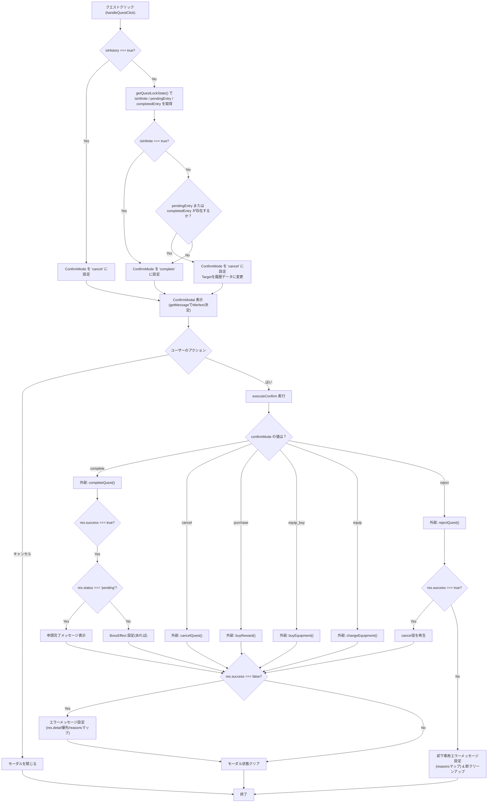

## 1. 解析メタ情報

| 項目 | 内容 |
| --- | --- |
| 対象ファイル | App.tsx |
| 言語 | React (TypeScript) |
| 解析対象 | 提供されたコードのみ |
| 推測・補完 | 一切なし |

## 2. ファイルの概要

このファイルはReactアプリケーションのメインコンポーネント（ルートに近い層）を定義している。アプリケーションの全体的な状態管理（表示モード、アクティブなタブ、選択中のユーザー、確認モーダルの状態、メッセージ等のUI状態）を行い、各種カスタムフック（`useSound`、`useGameData`）から取得したデータや関数を各子コンポーネントへ渡すルーティング的な責務を持つ。

* 根拠: `App`関数内の`useState`による状態管理と、戻り値のJSX要素群 (112行目 / 抜粋: "function App() {")

## 3. 外部依存関係

### インポート一覧

| 名称 | 種類 | 用途 | 根拠 |
| --- | --- | --- | --- |
| `useState` | 関数 | コンポーネントのローカル状態管理 | 1行目: `import { useState } from 'react';` |
| `Sword`, `Shirt`, `ShoppingBag`, `Backpack`, `Scroll`, `Sparkles` | コンポーネント | タブ切り替えボタンのアイコン表示 | 2行目: `import { Sword, Shirt, ShoppingBag, Backpack, Scroll, Sparkles } from 'lucide-react';` |
| `INITIAL_USERS` | 定数 | ユーザーデータが未取得または存在しない場合のフォールバック | 3行目: `import { INITIAL_USERS } from './lib/masterData';` |
| `useGameData`, `LevelUpInfo` | カスタムフック / 型定義 | ゲーム全体のデータ・状態更新関数の取得、レベルアップ情報の型 | 4行目: `import { useGameData, LevelUpInfo } from './hooks/useGameData';` |
| `useSound` | カスタムフック | 効果音再生関数の取得 | 5行目: `import { useSound } from './hooks/useSound';` |
| `AdminDashboard` | コンポーネント | 管理者用画面の表示 | 6行目: `import AdminDashboard from './features/admin/components/AdminDashboard';` |
| `RewardList` | コンポーネント | ごほうびリストの表示 | 7行目: `import RewardList from './features/shop/components/RewardList';` |
| `InventoryList` | コンポーネント | 所持アイテムリストの表示 | 8行目: `import { InventoryList } from './features/shop/components/InventoryList';` |
| `GuildBoard` | コンポーネント | ギルド画面の表示 | 9行目: `import { GuildBoard } from './features/guild/components/GuildBoard';` |
| `Quest`, `QuestHistory`, `Reward`, `Equipment`, `BossEffect` | 型定義 | 各オブジェクトの型定義 | 11行目: `import { Quest, QuestHistory, Reward, Equipment, BossEffect } from '@/types';` |
| `getQuestLockState` | 関数 | クエストの無限判定・申請中/完了履歴の検索など、ロック状態判定ロジックの取得 | 12行目: `import { getQuestLockState } from './features/quest/hooks/useQuestStatus';` |
| `LevelUpModal` | コンポーネント | レベルアップ時のモーダル表示 | 22行目: `import LevelUpModal from './components/ui/LevelUpModal';` |
| `Header` | コンポーネント | 画面上部のヘッダー表示 | 23行目: `import Header from './components/layout/Header';` |
| `AvatarUploader` | コンポーネント | アバター画像アップロード画面の表示 | 24行目: `import AvatarUploader from './components/ui/AvatarUploader';` |
| `MessageModal` | コンポーネント | 結果やエラーメッセージのモーダル表示 | 25行目: `import MessageModal from './components/ui/MessageModal';` |
| `Button` | コンポーネント | 各種ボタンの表示 | 26行目: `import { Button } from './components/ui/Button';` |
| `Modal` | コンポーネント | 汎用モーダルダイアログの表示 | 27行目: `import { Modal } from './components/ui/Modal';` |
| `FamilyMileageCard` | コンポーネント | ファミリーマイレージの表示 | 28行目: `import { FamilyMileageCard } from './features/family/components/FamilyMileageCard';` |
| `UserStatusCard` | コンポーネント | 現在選択中ユーザーのステータス表示 | 32行目: `import UserStatusCard from './features/family/components/UserStatusCard';` |
| `QuestList` | コンポーネント | クエスト一覧の表示 | 33行目: `import QuestList from './features/quest/components/QuestList';` |
| `ApprovalList` | コンポーネント | 承認待ちクエスト一覧の表示 | 34行目: `import ApprovalList from './features/quest/components/ApprovalList';` |
| `EquipmentShop` | コンポーネント | 装備購入画面の表示 | 35行目: `import EquipmentShop from './features/shop/components/EquipmentShop';` |
| `FamilyLog` | コンポーネント | ファミリーのログ表示 | 36行目: `import FamilyLog from './features/family/components/FamilyLog';` |
| `FamilyParty` | コンポーネント | ファミリーパーティ画面の表示 | 37行目: `import FamilyParty from './features/family/components/FamilyParty';` |
| `BattleEffect` | コンポーネント | 戦闘エフェクトの表示 | 38行目: `import BattleEffect from './components/ui/BattleEffect';` |
| `WeeklyTrends` | コンポーネント | 週間トレンドの表示 | 39行目: `import { WeeklyTrends } from './features/family/components/WeeklyTrends';` |

### ブラックボックスとなる外部要素

| 名称 | 理由 | 根拠 |
| --- | --- | --- |
| インポートされている全UIコンポーネント | 実装ファイルが提供されておらず、内部のレンダリング内容や副作用が不明 | インポート文全体（1〜39行目） |
| `useGameData` | 実装が提供されておらず、非同期処理の成否判定やDBとの通信有無、データの初期構造が不明 | 4行目: `import { useGameData, LevelUpInfo } from './hooks/useGameData';` |
| `useSound` | 音声ファイルのパスや再生ロジックが不明 | 5行目: `import { useSound } from './hooks/useSound';` |
| `INITIAL_USERS` | データ構造の詳細が不明 | 3行目: `import { INITIAL_USERS } from './lib/masterData';` |
| `@/types` | 各型のプロパティ詳細が不明 | 11行目: `import { Quest, QuestHistory, Reward, Equipment, BossEffect } from '@/types';` |
| `getQuestLockState` | 実装が提供されておらず、無限クエスト判定や履歴検索の具体的なロジックが不明 | 12行目: `import { getQuestLockState } from './features/quest/hooks/useQuestStatus';` |

## 4. 主要要素の定義（関数 / エンドポイント / コンポーネント）

### `ConfirmModal`

* **役割**: 操作確認用のモーダルを表示する。渡された`mode`に応じて`getMessage`内の`switch`文でタイトルとメッセージテキストを切り替える。
* 根拠: `ConfirmModal` コンポーネント定義内の `getMessage` 関数と戻り値 (71〜96行目 / 抜粋: "const getMessage = (): { title: string; text: string } => { switch (mode) {")

* **引数/リクエスト**: オブジェクト `{ mode: 'cancel' | 'purchase' | 'complete' | 'equip_buy' | 'equip' | 'reject' | null, target: ConfirmTarget | null, onConfirm: () => void, onCancel: () => void }` （`ConfirmTarget` は `Quest | QuestHistory | Reward | Equipment` のユニオン型、43行目で定義）
* 根拠: 引数の型定義 (63〜68行目 / 抜粋: "mode: 'cancel' | 'purchase' | 'complete' | 'equip_buy' | 'equip' | 'reject' | null,")

* **戻り値/レスポンス**: JSX.Element または null
* 根拠: 戻り値の実装 (69行目, 99〜109行目 / 抜粋: "if (!mode || !target) return null;")

* **副作用**: なし（描画のみ）
* 根拠: 内部での状態更新や外部API呼び出しなし (61〜110行目全体)

* **エラーハンドリング**: `mode`または`target`がFalsyな場合は何も描画せずnullを返す。
* 根拠: 初期チェック (69行目 / 抜粋: "if (!mode || !target) return null;")

### `App`

* **役割**: アプリケーションのメイン状態を管理し、各種ハンドラー関数を定義・子コンポーネントへ渡す。現在の`viewMode`や`activeTab`に応じて表示するコンポーネントを切り替える。
* 根拠: `App` コンポーネント定義全体 (112行目 / 抜粋: "function App() {")

* **引数/リクエスト**: なし
* 根拠: 112行目 `function App() {` の引数なし

* **戻り値/レスポンス**: JSX.Element
* 根拠: 戻り値の実装 (316行目 / 抜粋: "return ( 
")

* **副作用**: なし (内部のフック呼び出しに依存するが、`App`自身は副作用を直接定義していない)
* 根拠: コンポーネント本体に`useEffect`の記述なし

* **エラーハンドリング**: `useGameData`から取得した各更新関数(`completeQuest`等)のレスポンスが`!res.success`の場合、`res.detail`または`res.reason`に対応するメッセージ（なければ既定文言）を`messageData`にセットし、キャンセル音を鳴らす。`confirmMode === 'reject'`の場合は専用のエラー処理ブロックで別途同様の処理を行う。
* 根拠: `executeConfirm`内の分岐 (267〜278行目 / 抜粋: "if (!res.success) { ... const text = res.detail || (res.reason && reasons[res.reason]) || \"失敗しました\"; setMessageData({ title: \"エラー\", text, type: \"error\" });")

### `handleLevelUp` (App内の関数)

* **役割**: レベルアップ情報をステートに保存する。`useGameData`フックにコールバックとして渡される。
* 根拠: (130〜132行目 / 抜粋: "const handleLevelUp = (info: LevelUpInfo) => { setLevelUpInfo(info); };")

* **引数/リクエスト**: `info: LevelUpInfo`（`./hooks/useGameData`からインポートされる型）
* 根拠: 引数定義 (130行目 / 抜粋: "(info: LevelUpInfo)")

* **戻り値/レスポンス**: なし (void)
* 根拠: `return`文なし

* **副作用**: `levelUpInfo`状態の更新
* 根拠: 131行目 `setLevelUpInfo(info);`

### `handleUserChange` (App内の関数)

* **役割**: 現在のユーザーを切り替え、ビューモードを'main'に戻し、タップ音を鳴らす。
* 根拠: (146〜151行目 / 抜粋: "setCurrentUserIdx(idx); setViewMode('main'); play('tap');")

* **引数/リクエスト**: `idx: number`
* 根拠: 引数定義 (146行目 / 抜粋: "(idx: number)")

* **戻り値/レスポンス**: なし (void)
* 根拠: `return`文なし

* **副作用**: `currentUserIdx`と`viewMode`の更新、音の再生
* 根拠: 147〜150行目 `setCurrentUserIdx(idx);`, `setViewMode('main');`, `play('tap');`

### `handleQuestClick` (App内の関数)

* **役割**: クエストクリック時に、履歴として渡されたかどうか、および`getQuestLockState`（`./features/quest/hooks/useQuestStatus`）が返す無限クエスト判定・申請中/完了履歴の有無に応じて、確認モーダルのモード（'cancel' または 'complete'）とターゲットを決定する。
* 根拠: (153〜193行目 / 抜粋: "const { isInfinite, pendingEntry, completedEntry } = getQuestLockState(q as Quest, currentUser, completedQuests, pendingQuests);")

* **引数/リクエスト**: `q: Quest | QuestHistory`, `isHistory: boolean`
* 根拠: 引数定義 (153行目 / 抜粋: "(q: Quest | QuestHistory, isHistory: boolean)")

* **戻り値/レスポンス**: なし (void)
* 根拠: 早期`return`はあるが戻り値なし

* **副作用**: `confirmTarget`, `confirmMode` の更新、音の再生
* 根拠: 156〜158行目, 169〜171行目, 184〜192行目 `setConfirmTarget(...); setConfirmMode(...); play('select');`など

### `handleBuyReward` (App内の関数)

* **役割**: 報酬購入確認モーダルを開くための状態設定。
* 根拠: (195〜199行目 / 抜粋: "setConfirmTarget(r); setConfirmMode('purchase');")

* **引数/リクエスト**: `r: Reward`
* 根拠: 引数定義 (195行目 / 抜粋: "(r: Reward)")

* **戻り値/レスポンス**: なし (void)
* 根拠: `return`文なし

* **副作用**: `confirmTarget`, `confirmMode` の更新、音の再生
* 根拠: 196〜198行目 `setConfirmTarget`, `setConfirmMode`, `play`

### `handleBuyEquipment` (App内の関数)

* **役割**: 装備購入確認モーダルを開くための状態設定。
* 根拠: (201〜205行目 / 抜粋: "setConfirmTarget(e); setConfirmMode('equip_buy');")

* **引数/リクエスト**: `e: Equipment`
* 根拠: 引数定義 (201行目 / 抜粋: "(e: Equipment)")

* **戻り値/レスポンス**: なし (void)
* 根拠: `return`文なし

* **副作用**: `confirmTarget`, `confirmMode` の更新、音の再生
* 根拠: 202〜204行目 `setConfirmTarget`, `setConfirmMode`, `play`

### `handleEquip` (App内の関数)

* **役割**: 装備変更確認モーダルを開くための状態設定（`confirmMode`を`'equip'`にする）。実際の`changeEquipment`呼び出しは`executeConfirm`側に移譲されている。
* 根拠: (207〜211行目 / 抜粋: "const handleEquip = (e: Equipment) => { setConfirmTarget(e); setConfirmMode('equip'); play('select'); };")

* **引数/リクエスト**: `e: Equipment`
* 根拠: 引数定義 (207行目 / 抜粋: "(e: Equipment)")

* **戻り値/レスポンス**: なし (void)
* 根拠: 同期関数で`return`文なし (207行目 / 抜粋: "const handleEquip = (e: Equipment) => {")

* **副作用**: `confirmTarget`, `confirmMode` の更新、音の再生
* 根拠: 208〜210行目 `setConfirmTarget(e);`, `setConfirmMode('equip');`, `play('select');`

### `executeConfirm` (App内の関数)

* **役割**: `confirmMode`に応じた処理(`completeQuest`, `cancelQuest`, `buyReward`, `buyEquipment`, `changeEquipment`, `rejectQuest`)を実行し、結果に応じて成功・エラーメッセージを設定する。`'reject'`モードのみ専用のエラー処理を持ち、それ以外のモードは末尾の共通エラー処理ブロックにフォールスルーする。
* 根拠: (214〜282行目 / 抜粋: "if (confirmMode === 'complete') { ... } else if (confirmMode === 'cancel') { ... } else if (confirmMode === 'equip') { ... } else if (confirmMode === 'reject') {")

* **引数/リクエスト**: なし
* 根拠: 引数定義 (214行目 / 抜粋: "const executeConfirm = async () => {")

* **戻り値/レスポンス**: `Promise<void>`
* 根拠: `async`関数で戻り値なし (214行目 / 抜粋: "const executeConfirm = async () => {")

* **副作用**: モーダル状態のクリア(`setConfirmMode`, `setConfirmTarget`)、外部更新処理の呼び出し、メッセージおよびボスエフェクト状態の更新
* 根拠: 217行目 `let res: ActionResult = { success: false };`、各API呼び出し (220, 229, 231, 237, 243, 249行目)、280〜281行目 `setConfirmMode(null); setConfirmTarget(null);`

### `handleApprove` (App内の関数)

* **役割**: クエスト承認処理を実行し、成功時にボスエフェクトがあれば設定する。失敗時はエラーメッセージを表示する。
* 根拠: (285〜299行目 / 抜粋: "const res = await approveQuest(currentUser, history); if (res.success) { play('approve'); if (res.bossEffect) setBossEffect(res.bossEffect); }")

* **引数/リクエスト**: `history: QuestHistory`
* 根拠: 引数定義 (285行目 / 抜粋: "(history: QuestHistory)")

* **戻り値/レスポンス**: `Promise<void>`
* 根拠: `async`関数で戻り値なし

* **副作用**: `approveQuest`の呼び出し、音の再生、`bossEffect`または`messageData`の更新
* 根拠: 286, 288, 289, 296, 297行目 `approveQuest(...)`, `play('approve')`, `setBossEffect(...)`, `setMessageData(...)`, `play('cancel')`

### `handleReject` (App内の関数)

* **役割**: 却下確認モーダルを開くための状態設定（`confirmMode`を`'reject'`にする）。実際の`rejectQuest`呼び出しは`executeConfirm`側に移譲されている（ネイティブの`window.confirm`はもう使用されていない）。
* 根拠: (301〜305行目 / 抜粋: "const handleReject = (history: QuestHistory) => { setConfirmTarget(history); setConfirmMode('reject'); play('select'); };")

* **引数/リクエスト**: `history: QuestHistory`
* 根拠: 引数定義 (301行目 / 抜粋: "(history: QuestHistory)")

* **戻り値/レスポンス**: なし (void)
* 根拠: 同期関数で`return`文なし

* **副作用**: `confirmTarget`, `confirmMode` の更新、音の再生
* 根拠: 302〜304行目 `setConfirmTarget(history);`, `setConfirmMode('reject');`, `play('select');`

### `getHeaderViewMode` (App内の関数)

* **役割**: `Header`コンポーネントに渡すためのビューモード文字列を判定する。
* 根拠: (307〜312行目 / 抜粋: "const getHeaderViewMode = () => { if (viewMode === 'familyLog') return 'familyLog';")

* **引数/リクエスト**: なし
* 根拠: 引数定義 (307行目 / 抜粋: "const getHeaderViewMode = () => {")

* **戻り値/レスポンス**: 文字列 `'familyLog' | 'party' | 'trends' | 'user'`
* 根拠: 戻り値の実装 (311行目 / 抜粋: "return 'user';")

* **副作用**: なし
* 根拠: 状態や外部の変更なし

## 5. 処理フロー図

※主要なロジックである「クエストクリックから実行(モーダル表示から確定まで)」のフローを描画します。

```mermaid
flowchart TD
    Start["クエストクリック (handleQuestClick)"] --> IsHistory{"isHistory === true?"}
    
    IsHistory -- Yes --> SetCancelMode["ConfirmMode を 'cancel' に設定"]
    IsHistory -- No --> CallLockState["getQuestLockState() で\nisInfinite / pendingEntry / completedEntry を取得"]
    
    CallLockState --> IsInfinite{"isInfinite === true?"}
    IsInfinite -- Yes --> SetCompleteMode["ConfirmMode を 'complete' に設定"]
    IsInfinite -- No --> HasHistory{"pendingEntry または completedEntry が存在するか？"}
    
    HasHistory -- Yes --> SetCancelModeWithHistory["ConfirmMode を 'cancel' に設定\nTargetを履歴データに変更"]
    HasHistory -- No --> SetCompleteMode
    
    SetCompleteMode --> ShowModal["ConfirmModal 表示 (getMessageでtitle/text決定)"]
    SetCancelMode --> ShowModal
    SetCancelModeWithHistory --> ShowModal
    
    ShowModal --> WaitAction{"ユーザーのアクション"}
    WaitAction -- "キャンセル" --> CloseModal["モーダルを閉じる"]
    WaitAction -- "はい" --> ExecuteConfirm["executeConfirm 実行"]
    
    ExecuteConfirm --> CheckMode{"confirmMode の値は？"}
    
    CheckMode -- "complete" --> CallComplete["外部: completeQuest()"]
    CheckMode -- "cancel" --> CallCancel["外部: cancelQuest()"]
    CheckMode -- "purchase" --> CallBuyReward["外部: buyReward()"]
    CheckMode -- "equip_buy" --> CallBuyEquip["外部: buyEquipment()"]
    CheckMode -- "equip" --> CallChangeEquip["外部: changeEquipment()"]
    CheckMode -- "reject" --> CallReject["外部: rejectQuest()"]
    
    CallComplete --> CheckCompleteRes{"res.success === true?"}
    CheckCompleteRes -- Yes --> CheckStatus{"res.status === 'pending'?"}
    CheckStatus -- Yes --> ShowPendingMessage["申請完了メッセージ表示"]
    CheckStatus -- No --> SetBossEffect["BossEffect 設定(あれば)"]
    
    CallReject --> CheckRejectRes{"res.success === true?"}
    CheckRejectRes -- Yes --> PlayCancelSound["cancel音を再生"]
    CheckRejectRes -- No --> HandleRejectError["却下専用エラーメッセージ設定\n(reasonsマップ) & 即クリーンアップ"]
    
    CloseModal --> End["終了"]
    SetBossEffect --> CommonErrorCheck{"res.success === false?"}
    ShowPendingMessage --> CommonErrorCheck
    CallCancel --> CommonErrorCheck
    CallBuyReward --> CommonErrorCheck
    CallBuyEquip --> CommonErrorCheck
    CallChangeEquip --> CommonErrorCheck
    PlayCancelSound --> CommonErrorCheck
    
    CommonErrorCheck -- Yes --> HandleError["エラーメッセージ設定 (res.detail優先/reasonsマップ)"]
    CommonErrorCheck -- No --> CleanUp["モーダル状態クリア"]
    HandleError --> CleanUp
    HandleRejectError --> End
    
    CleanUp --> End

```

## 6. 依存関係図

```mermaid
graph TD
    App["App コンポーネント"]
    useGameData["Hook: useGameData (ブラックボックス)"]
    useSound["Hook: useSound (ブラックボックス)"]
    getQuestLockState["関数: getQuestLockState (ブラックボックス)"]
    INITIAL_USERS["定数: INITIAL_USERS"]
    
    UI_Header["コンポーネント: Header"]
    UI_Admin["コンポーネント: AdminDashboard"]
    UI_Main_Mileage["コンポーネント: FamilyMileageCard"]
    UI_Main_User["コンポーネント: UserStatusCard"]
    UI_Main_Approval["コンポーネント: ApprovalList"]
    
    Tab_Quest["コンポーネント: QuestList (通常)"]
    Tab_Special["コンポーネント: QuestList (特別)"]
    Tab_Guild["コンポーネント: GuildBoard"]
    Tab_Shop["コンポーネント: RewardList"]
    Tab_Equip["コンポーネント: EquipmentShop"]
    Tab_Inventory["コンポーネント: InventoryList"]
    
    Modal_Confirm["コンポーネント: ConfirmModal (App内定義)"]
    Modal_LevelUp["コンポーネント: LevelUpModal"]
    Modal_Message["コンポーネント: MessageModal"]
    Modal_Avatar["コンポーネント: AvatarUploader"]
    Modal_Battle["コンポーネント: BattleEffect"]
    
    View_Log["コンポーネント: FamilyLog"]
    View_Party["コンポーネント: FamilyParty"]
    View_Trends["コンポーネント: WeeklyTrends"]

    App --> useGameData
    App --> useSound
    App --> getQuestLockState
    App --> INITIAL_USERS
    App --> Modal_Confirm

    App -->|viewMode| UI_Header
    App -->|viewMode === 'admin'| UI_Admin
    
    App -->|viewMode === 'main'| UI_Main_Mileage
    App -->|viewMode === 'main'| UI_Main_User
    App -->|viewMode === 'main' & 権限あり| UI_Main_Approval
    
    App -->|activeTab === 'quest'| Tab_Quest
    App -->|activeTab === 'special_quest'| Tab_Special
    App -->|activeTab === 'guild'| Tab_Guild
    App -->|activeTab === 'shop'| Tab_Shop
    App -->|activeTab === 'equip'| Tab_Equip
    App -->|activeTab === 'inventory'| Tab_Inventory
    
    App -->|levelUpInfo| Modal_LevelUp
    App -->|messageData| Modal_Message
    App -->|isAvatarModalOpen| Modal_Avatar
    App -->|bossEffect| Modal_Battle
    
    App -->|viewMode === 'familyLog'| View_Log
    App -->|viewMode === 'party'| View_Party
    App -->|viewMode === 'trends'| View_Trends

```

## 7. 次のステップ（リバースエンジニアリングの提案）

| 優先度 | ファイル名(推測可) | 理由 | 根拠 |
| --- | --- | --- | --- |
| 高 | `./hooks/useGameData.ts` | アプリケーションのコアドメインロジック（データのCRUD処理やAPI通信、非同期状態）がすべてこのフックに集約されており、機能の詳細を把握するために必須であるため。`LevelUpInfo`型やActionResult相当の戻り値構造もここで定義されている。 | `App.tsx`内で多用される`completeQuest`や各種ステート(`quests`, `users`など)の生成元であるため |
| 高 | `./features/quest/hooks/useQuestStatus.ts` | `getQuestLockState`（無限クエスト判定・申請中/完了履歴の検索）の実装がここに集約されており、`handleQuestClick`のロジックを正確に把握するために必須であるため。 | 12行目 `import { getQuestLockState } from './features/quest/hooks/useQuestStatus';` |
| 中 | `@/types/index.ts` (または関連ファイル) | `Quest`や`QuestHistory`など、主要なデータ構造を正確に把握することで、UIの表示条件やバグの特定が容易になるため。 | `App.tsx`のインポート文 `import { Quest, QuestHistory, ... } from '@/types';` |
| 中 | `./features/quest/components/QuestList.tsx` | 「無限クエスト」「通常・特別クエスト」の分岐などの表示制御をより詳細に知る必要があるため。 | `isDaily`プロパティを渡して通常/特別を切り替えているため |

## 8. 保守上の注意点

* **型安全性の改善**: 以前は`handleQuestClick`の無限クエスト判定に`any`キャストが多用されていたが、現在は`getQuestLockState`ヘルパーへ集約され、`executeConfirm`のレスポンスも`ActionResult`インターフェース（47〜59行目）で型付けされており、`any`は使われていない。ただし`getQuestLockState`自体はブラックボックスであり、その内部実装の正しさには依存している。
* **UIモーダルへの統一**: 以前は`handleEquip`/`handleReject`がブラウザネイティブの`confirm()`を使用していたが、現在はどちらも`ConfirmModal`（`confirmMode`が`'equip'`/`'reject'`）経由の確認フローに統一されている（253行目のコメントに旧実装への言及が残る）。ネイティブ`confirm`によるスレッドブロックの懸念は解消された。
* **エラーメッセージの分岐が複雑**: `executeConfirm`は`'reject'`モードのみ専用のエラー処理ブロックを持ち、それ以外のモードは末尾の共通エラー処理にフォールスルーする構造になっており、モードを追加する際は両方の分岐を意識する必要がある。
* **PARENT_USER_IDSはUI上の配慮に過ぎない**: 18行目のコメントにある通り、`PARENT_USER_IDS`（`['dad', 'mom']`）はクライアント側の表示制御のみに使われ、セキュリティ境界ではない。実際のアクセス制御はバックエンド側で別途行う必要がある。

## 9. 不明事項一覧

| 項目 | 理由 | 必要なファイル |
| --- | --- | --- |
| `useGameData` の各関数の戻り値構造の詳細 | `ActionResult`型はApp.tsx内でローカル定義されているが、各関数(`completeQuest`等)が実際にどのフィールドを埋めて返すかはフック側の実装依存で不明 | `./hooks/useGameData.ts` |
| `getQuestLockState` の判定ロジック | 無限クエストの判定条件や`pendingEntry`/`completedEntry`の検索方法の具体的な実装が不明 | `./features/quest/hooks/useQuestStatus.ts` |
| `isDaily` の挙動 | `QuestList` コンポーネントに `isDaily={true}` 等を渡しているが、内部でどうフィルタリングされるか不明 | `./features/quest/components/QuestList.tsx` |
| 各種UIコンポーネントの実装仕様 | propsとして渡しているデータがどのように描画され、内部でどのようなイベントが発火するか不明 | 各コンポーネントファイル |

## 10. 自己検証結果

* [x] 推測・外部ファイルの仕様を一切含んでいない
* [x] 全関数・全クラス・全コンポーネントを列挙した
* [x] 全てのインポート要素を列挙した
* [x] すべての仕様説明に「根拠（行番号・抜粋）」を明記した
* [x] 根拠漏れが0件である
* [x] Mermaid構文にエラーの原因となる記号（エスケープ漏れ）がない
* [x] 不明事項を漏れなく列挙した
完了