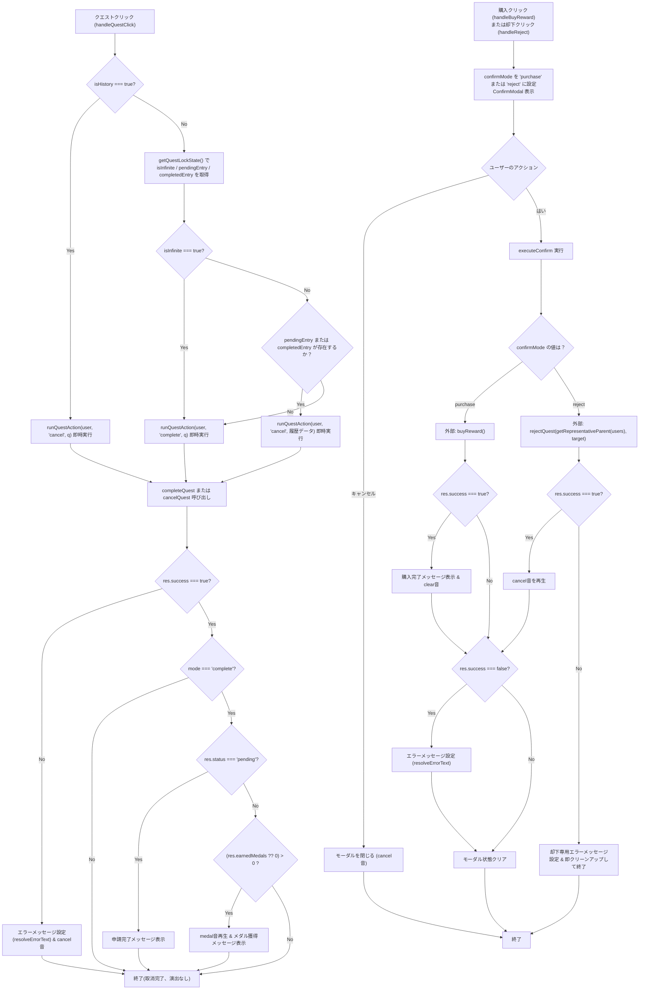

## 1. 解析メタ情報

| 項目 | 内容 |
| --- | --- |
| 対象ファイル | App.tsx |
| 言語 | React (TypeScript) |
| 解析対象 | 提供されたコードのみ |
| 推測・補完 | 一切なし |

## 関連ドキュメント

* [main.md](main.md) - 本コンポーネントをルートとしてマウントする呼び出し元（`/camera`以外のパスで`<App />`を描画）
* [src/hooks/useGameData.md](src/hooks/useGameData.md) - ユーザー/クエスト/報酬データの取得・更新関数（`completeQuest`等）を提供するカスタムフック
* [src/hooks/useLayoutMode.md](src/hooks/useLayoutMode.md) - `landscape`/`portrait`のレイアウトモード判定フック
* [src/hooks/useSound.md](src/hooks/useSound.md) - 効果音再生フック
* [src/lib/masterData.md](src/lib/masterData.md) - `INITIAL_USERS`フォールバックデータの提供元
* [src/types/index.md](src/types/index.md) - `Quest`/`QuestHistory`/`Reward`/`User`型の定義元
* [src/features/quest/hooks/useQuestStatus.md](src/features/quest/hooks/useQuestStatus.md) - `getQuestLockState`関数の実装元
* [src/components/layout/Header.md](src/components/layout/Header.md) - 子コンポーネント（ヘッダー、`hideUserSwitcher`propを渡す）
* [src/components/ui/AvatarUploader.md](src/components/ui/AvatarUploader.md) - 子コンポーネント（アバター変更モーダル）
* [src/components/ui/MessageModal.md](src/components/ui/MessageModal.md) - 子コンポーネント（結果/エラーメッセージモーダル）
* [src/components/ui/Button.md](src/components/ui/Button.md) - 子コンポーネント（各種ボタン）
* [src/components/ui/Modal.md](src/components/ui/Modal.md) - 子コンポーネント（`ConfirmModal`が内部で利用する汎用モーダル）
* [src/components/ui/LevelUpModal.md](src/components/ui/LevelUpModal.md) - 子コンポーネント（レベルアップ演出モーダル）
* [src/features/family/components/FamilyDashboard.md](src/features/family/components/FamilyDashboard.md) - 横画面（landscape）時のメイン表示コンポーネント
* [src/features/family/components/UserStatusCard.md](src/features/family/components/UserStatusCard.md) - 縦画面（portrait）時のユーザーステータス表示コンポーネント
* [src/features/family/components/FamilyLog.md](src/features/family/components/FamilyLog.md) - 子コンポーネント（`viewMode === 'familyLog'`時の記録表示）
* [src/features/quest/components/QuestList.md](src/features/quest/components/QuestList.md) - 縦画面時のクエスト一覧表示コンポーネント
* [src/features/quest/components/ApprovalList.md](src/features/quest/components/ApprovalList.md) - 縦画面時の承認待ち一覧表示コンポーネント
* [src/features/shop/components/RewardShop.md](src/features/shop/components/RewardShop.md) - 「ごほうび」タブの実体コンポーネント

## 2. ファイルの概要

このファイルはReactアプリケーションのメインコンポーネント（ルートに近い層）を定義している。アプリケーションの全体的な状態管理（アクティブなタブ、表示モード、選択中のユーザー、確認モーダルの状態、メッセージ等のUI状態）を行い、`useLayoutMode`フックが返すレイアウトモード（`landscape`/`portrait`）に応じて、横画面用の`FamilyDashboard`（4人常時表示）または縦画面用の単一ユーザー切替UI（`QuestList`/`RewardShop`のタブ切替）のいずれかを条件分岐で描画する。各種カスタムフック（`useSound`、`useGameData`、`useLayoutMode`）から取得したデータや関数を各子コンポーネントへ渡すルーティング的な責務を持つ。

* 根拠: `App`関数定義とレイアウト分岐 (106, 108, 300, 316行目 / 抜粋: "function App() {", "const layoutMode = useLayoutMode();", "{viewMode === 'main' && layoutMode === 'landscape' && (")

## 3. 外部依存関係

### インポート一覧

| 名称 | 種類 | 用途 | 根拠 |
| --- | --- | --- | --- |
| `useState` | 関数 | コンポーネントのローカル状態管理 | 1行目: `import { useState } from 'react';` |
| `Sword`, `ShoppingBag` | コンポーネント | タブ切り替えボタン（クエスト/ごほうび）のアイコン表示 | 2行目: `import { Sword, ShoppingBag } from 'lucide-react';` |
| `INITIAL_USERS` | 定数 | ユーザーデータが未取得または存在しない場合のフォールバック | 3行目: `import { INITIAL_USERS } from './lib/masterData';` |
| `useGameData`, `LevelUpInfo` | カスタムフック / 型定義 | ゲーム全体のデータ・状態更新関数の取得、レベルアップ情報の型 | 4行目: `import { useGameData, LevelUpInfo } from './hooks/useGameData';` |
| `useSound` | カスタムフック | 効果音再生関数の取得 | 5行目: `import { useSound } from './hooks/useSound';` |
| `useLayoutMode` | カスタムフック | 横画面/縦画面のレイアウトモード判定 | 6行目: `import { useLayoutMode } from './hooks/useLayoutMode';` |
| `RewardShop` | コンポーネント | 「ごほうび」画面（購入＋もちもの統合）の表示 | 7行目: `import RewardShop from './features/shop/components/RewardShop';` |
| `FamilyDashboard` | コンポーネント | 横画面用、4人常時表示レイアウトの表示 | 8行目: `import FamilyDashboard from './features/family/components/FamilyDashboard';` |
| `Quest`, `QuestHistory`, `Reward`, `User` | 型定義 | 各オブジェクトの型定義 | 10行目: `import { Quest, QuestHistory, Reward, User } from '@/types';` |
| `getQuestLockState` | 関数 | クエストの無限判定・申請中/完了履歴の検索など、ロック状態判定ロジックの取得 | 11行目: `import { getQuestLockState } from './features/quest/hooks/useQuestStatus';` |
| `LevelUpModal` | コンポーネント | レベルアップ時のモーダル表示 | 28行目: `import LevelUpModal from './components/ui/LevelUpModal';` |
| `Header` | コンポーネント | 画面上部のヘッダー表示 | 29行目: `import Header from './components/layout/Header';` |
| `AvatarUploader` | コンポーネント | アバター画像アップロード画面の表示 | 30行目: `import AvatarUploader from './components/ui/AvatarUploader';` |
| `MessageModal` | コンポーネント | 結果やエラーメッセージのモーダル表示 | 31行目: `import MessageModal from './components/ui/MessageModal';` |
| `Button` | コンポーネント | 各種ボタンの表示 | 32行目: `import { Button } from './components/ui/Button';` |
| `Modal` | コンポーネント | 汎用モーダルダイアログの表示 | 33行目: `import { Modal } from './components/ui/Modal';` |
| `UserStatusCard` | コンポーネント | 現在選択中ユーザーのステータス表示（縦画面） | 35行目: `import UserStatusCard from './features/family/components/UserStatusCard';` |
| `QuestList` | コンポーネント | クエスト一覧の表示（縦画面） | 36行目: `import QuestList from './features/quest/components/QuestList';` |
| `ApprovalList` | コンポーネント | 承認待ちクエスト一覧の表示（縦画面、保護者のみ） | 37行目: `import ApprovalList from './features/quest/components/ApprovalList';` |
| `FamilyLog` | コンポーネント | ファミリーのログ（記録）表示 | 38行目: `import FamilyLog from './features/family/components/FamilyLog';` |

### ブラックボックスとなる外部要素

| 名称 | 理由 | 根拠 |
| --- | --- | --- |
| インポートされている全UIコンポーネント（`RewardShop`, `FamilyDashboard`, `LevelUpModal`, `Header`, `AvatarUploader`, `MessageModal`, `Button`, `Modal`, `UserStatusCard`, `QuestList`, `ApprovalList`, `FamilyLog`） | 実装ファイルが提供されておらず、内部のレンダリング内容や副作用が不明 | インポート文全体（1〜38行目） |
| `useGameData` | 実装が提供されておらず、非同期処理の成否判定やDBとの通信有無、データの初期構造が不明 | 4行目: `import { useGameData, LevelUpInfo } from './hooks/useGameData';` |
| `useSound` | 音声ファイルのパスや再生ロジックが不明 | 5行目: `import { useSound } from './hooks/useSound';` |
| `useLayoutMode` | `landscape`/`portrait`の判定条件（メディアクエリ等）の詳細が本ファイルからは不明 | 6行目: `import { useLayoutMode } from './hooks/useLayoutMode';` |
| `INITIAL_USERS` | データ構造の詳細が不明 | 3行目: `import { INITIAL_USERS } from './lib/masterData';` |
| `@/types` | 各型のプロパティ詳細が不明 | 10行目: `import { Quest, QuestHistory, Reward, User } from '@/types';` |
| `getQuestLockState` | 実装が提供されておらず、無限クエスト判定や履歴検索の具体的なロジックが不明 | 11行目: `import { getQuestLockState } from './features/quest/hooks/useQuestStatus';` |

## 4. 主要要素の定義（関数 / エンドポイント / コンポーネント）

### `isParentUser` (モジュールレベル関数)

* **役割**: `user.role`が`'role_adult'`かどうかで保護者判定を行う。コメントにより、これはUI上の配慮（隠しボタンを子どもに見せないため）でありセキュリティ境界ではないことが明記されている。
* 根拠: (13〜17行目 / 抜粋: "const isParentUser = (user: User) => user.role === 'role_adult';")

* **引数/リクエスト**: `user: User`
* 根拠: (17行目 / 抜粋: "const isParentUser = (user: User) => user.role === 'role_adult';")

* **戻り値/レスポンス**: `boolean`
* 根拠: (17行目 / 抜粋: "user.role === 'role_adult';")

* **副作用**: なし
* **エラーハンドリング**: なし

### `getRepresentativeParent` (モジュールレベル関数)

* **役割**: 承認・却下の記録名義に使う代表の親ユーザーを返す。誰が実際にボタンを押したかは区別せず「親」として固定で記録する（要件5対応）。`allUsers`内に`role_adult`が見つからなければ`allUsers[0]`、それも無ければ`INITIAL_USERS[0]`にフォールバックする。
* 根拠: (19〜24行目 / 抜粋: "const getRepresentativeParent = (allUsers: User[]): User => { const adult = allUsers.find(u => u.role === 'role_adult'); return adult || allUsers[0] || INITIAL_USERS[0]; };")

* **引数/リクエスト**: `allUsers: User[]`
* **戻り値/レスポンス**: `User`
* **副作用**: なし
* **エラーハンドリング**: フォールバック連鎖により未定義を回避（21〜23行目）

### `ConfirmTarget` (型定義)

* **役割**: `ConfirmModal`の`target`に渡りうる型。モード（購入/却下）ごとに実際に持っているプロパティが異なるため、メッセージ生成はモードごとに個別にキャストして組み立てる。
* 根拠: (40〜44行目 / 抜粋: "type ConfirmTarget = QuestHistory | Reward;")

### `ActionResult` (型定義)

* **役割**: `useGameData.ts`の`completeQuest`/`cancelQuest`/`buyReward`/`rejectQuest`ラッパー関数群の戻り値をまとめて受け取るためのインターフェース。各関数は`success`以外のフィールドが少しずつ異なる。
* 根拠: (46〜58行目 / 抜粋: "interface ActionResult { success: boolean; status?: string; message?: string; earnedMedals?: number; leveledUp?: boolean; newGold?: number; reward?: Reward; reason?: string; detail?: string; }")

### `ERROR_REASON_MESSAGES` / `resolveErrorText` (モジュールレベル定数・関数)

* **役割**: `reason`文字列（`gold`/`pending`/`permission`/`error`）を日本語メッセージへマッピングする定数`ERROR_REASON_MESSAGES`と、`res.detail`（バックエンドが返す具体的なエラー内容）を`res.reason`によるマッピングより優先して返す`resolveErrorText`関数。
* 根拠: (60〜69行目 / 抜粋: "const resolveErrorText = (res: ActionResult, fallback: string): string => res.detail || (res.reason && ERROR_REASON_MESSAGES[res.reason]) || fallback;")

* **引数/リクエスト**: `res: ActionResult`, `fallback: string`
* **戻り値/レスポンス**: `string`
* **副作用**: なし
* **エラーハンドリング**: `res.detail`→`ERROR_REASON_MESSAGES[res.reason]`→`fallback`の順にフォールバック

### `ConfirmModal`

* **役割**: 操作確認用のモーダルを表示する。渡された`mode`に応じて`getMessage`内の`switch`文でタイトルとメッセージテキストを切り替える。要件9対応により、確認を挟むのは「購入」（`purchase`）と「却下」（`reject`）のみに限定されている。
* 根拠: `ConfirmModal` コンポーネント定義内の `getMessage` 関数と戻り値 (71〜104行目 / 抜粋: "const getMessage = (): { title: string; text: string } => { switch (mode) {")

* **引数/リクエスト**: オブジェクト `{ mode: 'purchase' | 'reject' | null, target: ConfirmTarget | null, onConfirm: () => void, onCancel: () => void }`
* 根拠: 引数の型定義 (71〜78行目 / 抜粋: "mode: 'purchase' | 'reject' | null,")

* **戻り値/レスポンス**: JSX.Element または null
* 根拠: 戻り値の実装 (79行目, 93〜103行目 / 抜粋: "if (!mode || !target) return null;")

* **副作用**: なし（描画のみ）
* 根拠: 内部での状態更新や外部API呼び出しなし (71〜104行目全体)

* **エラーハンドリング**: `mode`または`target`がFalsyな場合は何も描画せずnullを返す。
* 根拠: 初期チェック (79行目 / 抜粋: "if (!mode || !target) return null;")

### `App`

* **役割**: アプリケーションのメイン状態を管理し、各種ハンドラー関数を定義・子コンポーネントへ渡す。`useLayoutMode()`の結果に応じて`FamilyDashboard`（横画面）または縦画面用の単一ユーザービューを条件分岐で描画する。
* 根拠: `App` コンポーネント定義全体 (106〜408行目 / 抜粋: "function App() {")

* **引数/リクエスト**: なし
* 根拠: 106行目 `function App() {` の引数なし

* **戻り値/レスポンス**: JSX.Element
* 根拠: 戻り値の実装 (284行目 / 抜粋: "return ( 
")

* **副作用**: なし (内部のフック呼び出しに依存するが、`App`自身は`useEffect`等を直接定義していない)
* 根拠: コンポーネント本体に`useEffect`の記述なし

* **エラーハンドリング**: `useGameData`から取得した各更新関数(`completeQuest`等)のレスポンスが`!res.success`の場合、`resolveErrorText`により`res.detail`または`res.reason`に対応するメッセージ（なければ既定文言）を`messageData`にセットし、`cancel`音を鳴らす。
* 根拠: `runQuestAction`・`executeConfirm`内の分岐 (171行目, 248〜252行目 / 抜粋: "setMessageData({ title: \"エラー\", text: resolveErrorText(res, \"失敗しました\"), type: \"error\" });")

### `handleLevelUp` (App内の関数)

* **役割**: レベルアップ情報をステートに保存する。`useGameData`フックにコールバックとして渡される。
* 根拠: (127〜129行目 / 抜粋: "const handleLevelUp = (info: LevelUpInfo) => { setLevelUpInfo(info); };")

* **引数/リクエスト**: `info: LevelUpInfo`
* **戻り値/レスポンス**: なし (void)
* **副作用**: `levelUpInfo`状態の更新
* 根拠: 128行目 `setLevelUpInfo(info);`

### `handleUserChange` (App内の関数)

* **役割**: 現在のユーザー(`currentUserIdx`)を切り替え、`viewMode`を`'main'`に戻し、タップ音を鳴らす。
* 根拠: (143〜148行目 / 抜粋: "const handleUserChange = (idx: number) => { setCurrentUserIdx(idx); setViewMode('main'); play('tap'); };")

* **引数/リクエスト**: `idx: number`
* **戻り値/レスポンス**: なし (void)
* **副作用**: `currentUserIdx`と`viewMode`の更新、音の再生
* 根拠: 144〜147行目 `setCurrentUserIdx(idx);`, `setViewMode('main');`, `play('tap');`

### `runQuestAction` (App内の関数)

* **役割**: 要件9によりワンタップ化されたクエストの完了/取消を実行する。`mode`に応じて`completeQuest`または`cancelQuest`を呼び出し、成功時は`status === 'pending'`なら申請完了メッセージ、`(res.earnedMedals ?? 0) > 0`ならメダル獲得演出（`medal`音＋メッセージ）を表示する。これは以前フロントが`res.earnedMedals`を参照しておらず無反応だったバグの修正（要件8）である。失敗時は`resolveErrorText`によるエラーメッセージと`cancel`音を出す。
* 根拠: (150〜173行目 / 抜粋: "const runQuestAction = async (user: User, mode: 'complete' | 'cancel', target: Quest | QuestHistory) => {")

* **引数/リクエスト**: `user: User`, `mode: 'complete' | 'cancel'`, `target: Quest | QuestHistory`
* 根拠: (152行目 / 抜粋: "const runQuestAction = async (user: User, mode: 'complete' | 'cancel', target: Quest | QuestHistory) => {")

* **戻り値/レスポンス**: `Promise<void>`
* 根拠: `async`関数で明示的な戻り値なし (152行目)

* **副作用**: `completeQuest`/`cancelQuest`の呼び出し、`messageData`の更新、`medal`/`cancel`音の再生
* 根拠: (153〜172行目 / 抜粋: "play('medal'); setMessageData({ title: \"ちいさなメダル獲得！\", ... });")

* **エラーハンドリング**: `!res.success`の場合、`resolveErrorText(res, \"失敗しました\")`をエラーメッセージとして表示し`cancel`音を再生
* 根拠: (171〜172行目 / 抜粋: "setMessageData({ title: \"エラー\", text: resolveErrorText(res, \"失敗しました\"), type: \"error\" }); play('cancel');")

### `handleQuestClick` (App内の関数)

* **役割**: クエストクリック時に、履歴として渡されたかどうか、`getQuestLockState`が返す無限クエスト判定・申請中/完了履歴の有無に応じて、`runQuestAction`を`'complete'`または`'cancel'`モードでワンタップ実行する（確認ダイアログは挟まない、要件9）。
* 根拠: (175〜208行目 / 抜粋: "const handleQuestClick = (user: User, q: Quest | QuestHistory, isHistory: boolean) => {")

* **引数/リクエスト**: `user: User`, `q: Quest | QuestHistory`, `isHistory: boolean`
* 根拠: (175行目 / 抜粋: "(user: User, q: Quest | QuestHistory, isHistory: boolean) => {")

* **戻り値/レスポンス**: なし (void)
* **副作用**: `runQuestAction`の呼び出し、`select`音の再生
* 根拠: (176, 180, 191, 203, 206行目 / 抜粋: "play('select');", "runQuestAction(user, 'cancel', q);", "runQuestAction(user, 'complete', q);")

* **エラーハンドリング**: なし。分岐先の`runQuestAction`側でエラー処理を行う。

### `handleBuyReward` (App内の関数)

* **役割**: 報酬購入確認モーダルを開くための状態設定（`confirmUser`, `confirmTarget`, `confirmMode`を`'purchase'`にセット）。
* 根拠: (210〜215行目 / 抜粋: "const handleBuyReward = (user: User, r: Reward) => { setConfirmUser(user); setConfirmTarget(r); setConfirmMode('purchase'); play('select'); };")

* **引数/リクエスト**: `user: User`, `r: Reward`
* **戻り値/レスポンス**: なし (void)
* **副作用**: `confirmUser`, `confirmTarget`, `confirmMode` の更新、`select`音の再生
* 根拠: 211〜214行目

### `executeConfirm` (App内の関数)

* **役割**: `confirmMode`（`'purchase'`または`'reject'`）に応じた処理(`buyReward`, `rejectQuest`)を実行し、結果に応じて成功・エラーメッセージを設定する。購入成功時は`clear`音（要件8: メダル音は「メダル獲得時」専用に戻し、購入時に誤って鳴っていたのを削除）、却下成功時は`cancel`音を再生する。却下失敗時のみ専用のエラー処理ブロックを持つ。
* 根拠: (218〜257行目 / 抜粋: "if (confirmMode === 'purchase') { ... } else if (confirmMode === 'reject') {")

* **引数/リクエスト**: なし
* **戻り値/レスポンス**: `Promise<void>`
* **副作用**: モーダル状態のクリア(`setConfirmMode`, `setConfirmTarget`, `setConfirmUser`)、`buyReward`/`rejectQuest`の呼び出し、`messageData`の更新、音の再生
* 根拠: 222〜256行目 `let res: ActionResult = { success: false };`、各API呼び出し (225, 233行目)、254〜256行目 `setConfirmMode(null); setConfirmTarget(null); setConfirmUser(null);`

* **エラーハンドリング**: `confirmMode === 'reject'`かつ失敗時は専用のエラーメッセージ（`resolveErrorText(res, \"却下に失敗しました\")`）を設定し即座に状態をクリアして`return`する。それ以外の失敗（購入等）は末尾の共通エラー処理ブロックで`resolveErrorText(res, \"失敗しました\")`を設定する。
* 根拠: (236〜245, 248〜252行目 / 抜粋: "const text = resolveErrorText(res, \"却下に失敗しました\");", "if (!res.success) { const text = resolveErrorText(res, \"失敗しました\");")

### `handleApprove` (App内の関数)

* **役割**: クエスト承認処理を実行する。記録名義は`getRepresentativeParent(users)`で「親」に固定する（要件5）。失敗時はエラーメッセージを表示する。
* 根拠: (260〜268行目 / 抜粋: "const handleApprove = async (history: QuestHistory) => { const res = await approveQuest(getRepresentativeParent(users), history);")

* **引数/リクエスト**: `history: QuestHistory`
* **戻り値/レスポンス**: `Promise<void>`
* **副作用**: `approveQuest`の呼び出し、`approve`/`cancel`音の再生、`messageData`の更新
* 根拠: 261, 263, 265〜267行目

### `handleReject` (App内の関数)

* **役割**: 却下確認モーダルを開くための状態設定（`confirmMode`を`'reject'`にする）。`confirmUser`は`getRepresentativeParent`で親を確定するため不要としてクリアする。
* 根拠: (270〜275行目 / 抜粋: "const handleReject = (history: QuestHistory) => { setConfirmTarget(history); setConfirmMode('reject'); setConfirmUser(null); play('select'); };")

* **引数/リクエスト**: `history: QuestHistory`
* **戻り値/レスポンス**: なし (void)
* **副作用**: `confirmTarget`, `confirmMode`, `confirmUser` の更新、`select`音の再生

### `getHeaderViewMode` (App内の関数)

* **役割**: `Header`コンポーネントに渡すためのビューモード文字列を判定する。`viewMode === 'familyLog'`なら`'familyLog'`、それ以外は`'user'`を返す。
* 根拠: (277〜280行目 / 抜粋: "const getHeaderViewMode = () => { if (viewMode === 'familyLog') return 'familyLog'; return 'user'; };")

* **引数/リクエスト**: なし
* **戻り値/レスポンス**: 文字列 `'familyLog' | 'user'`
* **副作用**: なし

### `App` のレンダリング分岐（JSX本体）

* **役割**: `isLoading`ならローディング表示のみを返す。それ以外は`Header`（`hideUserSwitcher={layoutMode === 'landscape'}`）を描画したのち、`viewMode === 'main' && layoutMode === 'landscape'`なら`FamilyDashboard`、`viewMode === 'main' && layoutMode === 'portrait'`なら`UserStatusCard`＋（保護者なら）`ApprovalList`＋タブ切替（`quest`/`shop`）＋`QuestList`/`RewardShop`、`viewMode === 'familyLog'`なら`FamilyLog`を描画する。コンテナの最大幅は`layoutMode === 'landscape'`のとき`max-w-7xl`、それ以外は`max-w-md md:max-w-5xl`に切り替わる。
* 根拠: (282〜372行目 / 抜粋: "{viewMode === 'main' && layoutMode === 'landscape' && ( <FamilyDashboard", "{viewMode === 'main' && layoutMode === 'portrait' && (", "${layoutMode === 'landscape' ? 'max-w-7xl' : 'max-w-md md:max-w-5xl'}")

* **副作用**: `avatarUser`が設定されている場合、`AvatarUploader`の`onUploadComplete`から`refreshData()`と成功メッセージ表示が行われる。
* 根拠: (395〜404行目 / 抜粋: "onUploadComplete={() => { refreshData(); setMessageData({ title: \"変更完了\", text: \"アバターを変更しました！\", type: \"success\" }); }}")

## 5. 処理フロー図

※クエストクリックから完了/取消までのワンタップフロー(要件9)と、購入・却下の確認モーダル経由フローの両方を描画する。

```mermaid
flowchart TD
    QStart["クエストクリック (handleQuestClick)"] --> IsHistory{"isHistory === true?"}

    IsHistory -- Yes --> RunCancel["runQuestAction(user, 'cancel', q) 即時実行"]
    IsHistory -- No --> CallLockState["getQuestLockState() で\nisInfinite / pendingEntry / completedEntry を取得"]

    CallLockState --> IsInfinite{"isInfinite === true?"}
    IsInfinite -- Yes --> RunComplete["runQuestAction(user, 'complete', q) 即時実行"]
    IsInfinite -- No --> HasHistory{"pendingEntry または completedEntry が存在するか？"}

    HasHistory -- Yes --> RunCancelWithHistory["runQuestAction(user, 'cancel', 履歴データ) 即時実行"]
    HasHistory -- No --> RunComplete

    RunCancel --> QAction["completeQuest または cancelQuest 呼び出し"]
    RunCancelWithHistory --> QAction
    RunComplete --> QAction

    QAction --> QSuccess{"res.success === true?"}
    QSuccess -- No --> QError["エラーメッセージ設定(resolveErrorText) & cancel音"]
    QSuccess -- Yes --> QMode{"mode === 'complete'?"}
    QMode -- No --> QEnd["終了(取消完了、演出なし)"]
    QMode -- Yes --> QPending{"res.status === 'pending'?"}
    QPending -- Yes --> QPendingMsg["申請完了メッセージ表示"]
    QPending -- No --> QMedal{"(res.earnedMedals ?? 0) > 0 ?"}
    QMedal -- Yes --> QMedalFx["medal音再生 & メダル獲得メッセージ表示"]
    QMedal -- No --> QEnd
    QPendingMsg --> QEnd
    QMedalFx --> QEnd
    QError --> QEnd

    BStart["購入クリック (handleBuyReward)\nまたは却下クリック (handleReject)"] --> SetModal["confirmMode を 'purchase' または 'reject' に設定\nConfirmModal 表示"]
    SetModal --> WaitAction{"ユーザーのアクション"}
    WaitAction -- "キャンセル" --> CloseModal["モーダルを閉じる (cancel音)"]
    WaitAction -- "はい" --> ExecuteConfirm["executeConfirm 実行"]

    ExecuteConfirm --> CheckMode{"confirmMode の値は？"}
    CheckMode -- "purchase" --> CallBuyReward["外部: buyReward()"]
    CheckMode -- "reject" --> CallReject["外部: rejectQuest(getRepresentativeParent(users), target)"]

    CallBuyReward --> BuySuccess{"res.success === true?"}
    BuySuccess -- Yes --> BuyMsg["購入完了メッセージ表示 & clear音"]
    BuySuccess -- No --> CommonErrorCheck

    CallReject --> RejectSuccess{"res.success === true?"}
    RejectSuccess -- Yes --> PlayCancelSound["cancel音を再生"]
    RejectSuccess -- No --> HandleRejectError["却下専用エラーメッセージ設定 & 即クリーンアップして終了"]

    BuyMsg --> CommonErrorCheck{"res.success === false?"}
    PlayCancelSound --> CommonErrorCheck
    CommonErrorCheck -- Yes --> HandleError["エラーメッセージ設定 (resolveErrorText)"]
    CommonErrorCheck -- No --> CleanUp["モーダル状態クリア"]
    HandleError --> CleanUp
    HandleRejectError --> BEnd["終了"]
    CleanUp --> BEnd
    CloseModal --> BEnd

```

## 6. 依存関係図

```mermaid
graph TD
    App["App コンポーネント"]
    useGameData["Hook: useGameData (ブラックボックス)"]
    useSound["Hook: useSound (ブラックボックス)"]
    useLayoutMode["Hook: useLayoutMode (ブラックボックス)"]
    getQuestLockState["関数: getQuestLockState (ブラックボックス)"]
    INITIAL_USERS["定数: INITIAL_USERS"]

    UI_Header["コンポーネント: Header"]
    UI_Family["コンポーネント: FamilyDashboard (layoutMode==='landscape')"]
    UI_Main_User["コンポーネント: UserStatusCard (layoutMode==='portrait')"]
    UI_Main_Approval["コンポーネント: ApprovalList (layoutMode==='portrait' かつ保護者)"]

    Tab_Quest["コンポーネント: QuestList (activeTab==='quest')"]
    Tab_Shop["コンポーネント: RewardShop (activeTab==='shop')"]

    Modal_Confirm["コンポーネント: ConfirmModal (App内定義)"]
    Modal_LevelUp["コンポーネント: LevelUpModal"]
    Modal_Message["コンポーネント: MessageModal"]
    Modal_Avatar["コンポーネント: AvatarUploader"]

    View_Log["コンポーネント: FamilyLog"]

    App --> useGameData
    App --> useSound
    App --> useLayoutMode
    App --> getQuestLockState
    App --> INITIAL_USERS
    App --> Modal_Confirm

    App --> UI_Header

    App -->|viewMode==='main' & layoutMode==='landscape'| UI_Family
    App -->|viewMode==='main' & layoutMode==='portrait'| UI_Main_User
    App -->|viewMode==='main' & layoutMode==='portrait' & 保護者| UI_Main_Approval

    App -->|activeTab === 'quest'| Tab_Quest
    App -->|activeTab === 'shop'| Tab_Shop

    App -->|levelUpInfo| Modal_LevelUp
    App -->|messageData| Modal_Message
    App -->|avatarUser| Modal_Avatar

    App -->|viewMode === 'familyLog'| View_Log

```

## 7. 次のステップ（リバースエンジニアリングの提案）

| 優先度 | ファイル名(推測可) | 理由 | 根拠 |
| --- | --- | --- | --- |
| 高 | `./hooks/useGameData.ts` | アプリケーションのコアドメインロジック（データのCRUD処理やAPI通信、非同期状態）がすべてこのフックに集約されており、機能の詳細を把握するために必須であるため。`LevelUpInfo`型やActionResult相当の戻り値構造もここで定義されている。 | `App.tsx`内で多用される`completeQuest`や各種ステート(`quests`, `users`など)の生成元であるため |
| 高 | `./hooks/useLayoutMode.ts` | 横画面/縦画面の切り替え条件（`landscape`/`portrait`の判定基準）を正確に把握するために必須であるため。 | 6行目 `import { useLayoutMode } from './hooks/useLayoutMode';` |
| 高 | `./features/family/components/FamilyDashboard.tsx` | 横画面時のメイン表示コンポーネントであり、4人パネル表示の内部実装を把握する必要があるため。 | 8行目 `import FamilyDashboard from './features/family/components/FamilyDashboard';` |
| 中 | `./features/shop/components/RewardShop.tsx` | 「ごほうび」タブの実体であり、購入・所持品表示の内部実装を把握する必要があるため。 | 7行目 `import RewardShop from './features/shop/components/RewardShop';` |
| 中 | `./features/quest/hooks/useQuestStatus.ts` | `getQuestLockState`（無限クエスト判定・申請中/完了履歴の検索）の実装がここに集約されており、`handleQuestClick`のロジックを正確に把握するために必須であるため。 | 11行目 `import { getQuestLockState } from './features/quest/hooks/useQuestStatus';` |
| 中 | `@/types/index.ts` (または関連ファイル) | `Quest`や`QuestHistory`など、主要なデータ構造を正確に把握することで、UIの表示条件やバグの特定が容易になるため。 | `App.tsx`のインポート文 `import { Quest, QuestHistory, Reward, User } from '@/types';` |

## 8. 保守上の注意点

* **ワンタップ化と確認モーダルの使い分け**: 要件9により、クエストの完了/取消は`runQuestAction`によるワンタップ即時実行に変更され、確認ダイアログを挟まなくなった。一方、ゴールドを消費する「購入」と親向けの「却下」は誤操作の影響が大きいため、引き続き`ConfirmModal`（`confirmMode`が`'purchase'`/`'reject'`のみ）を経由する。この非対称な設計は、新しいアクションを追加する際に確認要否を明示的に判断する必要があることを意味する。
* 根拠: [コメント] (42〜43行目 / 抜粋: "// ★要件9: クエストの完了/取り消しは確認ダイアログを挟まないワンタップ操作に変更したため、\n// ここで確認を挟むのはゴールドを消費する「購入」と、親向けの「却下」のみ(誤操作の影響が大きいため)。")
* **メダル獲得演出のバグ修正**: 以前はサーバー側で計算されていた`earnedMedals`をフロントが一切参照していなかったため無反応だった。現在は`runQuestAction`内で`(res.earnedMedals ?? 0) > 0`を判定し、`medal`音とメッセージを表示する（要件8）。
* 根拠: (161〜166行目 / 抜粋: "// ★バグ修正(要件8): サーバーは正しくメダルを付与していたが、以前はフロントが\n// res.earnedMedals を一切参照しておらず無反応だった。")
* **購入時の誤サウンド削除**: 以前は購入時にも`medal`音が誤って鳴っていたが、`executeConfirm`の`purchase`分岐では`clear`音のみに変更されている。
* 根拠: (228〜229行目 / 抜粋: "// ★要件8: medalサウンドは「メダル獲得時」専用に戻す(以前は購入時にも誤って鳴っていた)\nplay('clear');")
* **PARENT判定はUI上の配慮に過ぎない**: 14〜16行目のコメントにある通り、`isParentUser`（`quest_users.role`基準）はクライアント側の表示制御のみに使われ、セキュリティ境界ではない。実際のアクセス制御はバックエンド側で別途行う必要がある。
* 根拠: (14〜16行目 / 抜粋: "// ★注意: これはクライアント側のUI上の配慮（隠しボタンを子どもに見せないため）にすぎず、\n// セキュリティ境界ではない。バックエンドは現状どのuser_idでも自称できてしまうため、")
* **承認・却下の記録名義固定**: `getRepresentativeParent`により、承認・却下の記録名義は常に代表の親1名に固定される（要件5）。横画面の4人表示では「今アクティブなユーザー」概念が存在しないための設計である。
* 根拠: (19〜20, 116〜117行目 / 抜粋: "// 承認・却下の記録名義に使う代表の親ユーザーを返す。誰が実際にボタンを押したかは\n// 区別せず「親」として固定で記録する(要件5)。")

## 9. 不明事項一覧

| 項目 | 理由 | 必要なファイル |
| --- | --- | --- |
| `useGameData` の各関数の戻り値構造の詳細 | `ActionResult`型はApp.tsx内でローカル定義されているが、各関数(`completeQuest`等)が実際にどのフィールドを埋めて返すかはフック側の実装依存で不明 | `./hooks/useGameData.ts` |
| `useLayoutMode` の判定基準の詳細 | `landscape`/`portrait`の閾値やメディアクエリの具体的な条件が本ファイルからは不明 | `./hooks/useLayoutMode.ts` |
| `getQuestLockState` の判定ロジック | 無限クエストの判定条件や`pendingEntry`/`completedEntry`の検索方法の具体的な実装が不明 | `./features/quest/hooks/useQuestStatus.ts` |
| `FamilyDashboard`/`RewardShop` の内部実装 | Propsとして渡しているデータがどのように描画され、内部でどのようなイベントが発火するか不明 | 各コンポーネントファイル |

## 相互参照による補足情報

| 元の不明事項 | 判明した内容 | 参照元ドキュメント |
| --- | --- | --- |
| `useGameData` の各関数の戻り値構造の詳細 | `useGameData.md`の解析によれば、`completeQuest`は`{ success, status?, message?, earnedMedals?, leveledUp?, detail? }`、`cancelQuest`/`approveQuest`/`rejectQuest`は`{ success, reason?, detail? }`、`buyReward`は`{ success, reason?, newGold?, reward?, detail? }`を返すとされている。App.tsx側の`ActionResult`型のフィールド構成とおおむね一致するが、この対応関係はあくまで`useGameData.md`側の解析結果からの推測であり、`useGameData.ts`のソースコード自体は本ファイルの解析時点では確認していない。 | `src/hooks/useGameData.md` |
| `useLayoutMode` の判定基準の詳細 | `useLayoutMode.md`の解析によれば、判定には`window.matchMedia('(min-width: 900px) and (orientation: landscape)')`というメディアクエリが使われており、Echo Show 15等の常設デバイスを想定した閾値であるとされている。ただしこれは`useLayoutMode.md`側の解析結果からの補足であり、`useLayoutMode.ts`のソースコード自体は本ファイルの解析時点では確認していない。 | `src/hooks/useLayoutMode.md` |
| `getQuestLockState` の判定ロジック | `useQuestStatus.md`の解析によれば、`getQuestLockState`は`quest`, `currentUser`, `completedQuests`, `pendingQuests`を引数に取り、前提クエストの完了判定・無限クエスト判定・保留/完了履歴の検索を行う純粋関数であるとされている。ただしこれは`useQuestStatus.md`側の解析結果からの補足であり、`useQuestStatus.ts`のソースコード自体は本ファイルの解析時点では確認していない。 | `src/features/quest/hooks/useQuestStatus.md` |
| `FamilyDashboard`/`RewardShop` の内部実装 | `FamilyDashboard.md`の解析によれば、`FamilyDashboard`は`users`を固定順（`dad`,`mom`,`son`,`daughter`）に並び替えたうえでユーザーごとの`FamilyPanel`をグリッド表示し、`RewardShop.md`の解析によれば、`RewardShop`は所持ゴールド表示・`RewardList`（購入）・`InventoryList`（所持品）を縦に並べるコンテナであるとされている。ただしこれらは各ドキュメント側の解析結果からの補足であり、`FamilyDashboard.tsx`/`RewardShop.tsx`のソースコード自体は本ファイルの解析時点では確認していない。 | `src/features/family/components/FamilyDashboard.md`, `src/features/shop/components/RewardShop.md` |

## 10. 自己検証結果

* [x] 完了: 推測・外部ファイルの仕様を一切含んでいない
* [x] 完了: 全関数・全クラス・全コンポーネントを列挙した
* [x] 完了: 全てのインポート要素を列挙した
* [x] 完了: すべての仕様説明に「根拠（行番号・抜粋）」を明記した
* [x] 完了: 根拠漏れが0件である
* [x] 完了: Mermaid構文にエラーの原因となる記号（エスケープ漏れ）がない
* [x] 完了: 不明事項を漏れなく列挙した
