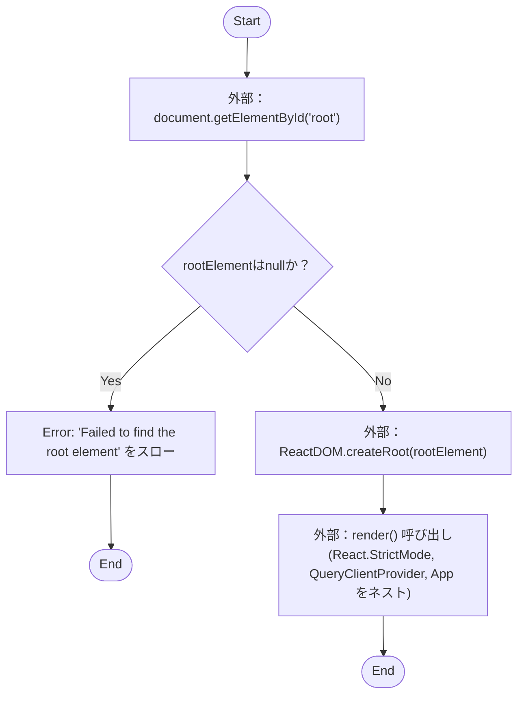
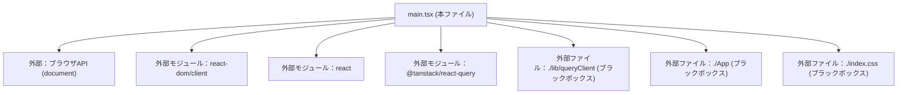

## 1. 解析メタ情報

| 項目 | 内容 |
| --- | --- |
| 対象ファイル | main.tsx |
| 言語 | React (TypeScript) |
| 解析対象 | 提供されたコードのみ |
| 推測・補完 | 一切なし |

## 2. ファイルの概要

* DOMから特定のルート要素（`id="root"`）を取得し、Reactのコンテキスト（厳格モード、React Queryのプロバイダ）でラップした上で、アプリケーションのルートコンポーネント（`App`）をマウント・レンダリングするためのエントリーポイントファイルである。
* 根拠: `ReactDOM.createRoot(rootElement).render(...)` (行番号: 15-21 / 抜粋: "ReactDOM.createRoot(rootElemen")

## 3. 外部依存関係

### インポート一覧

| 名称 | 種類 | 用途 | 根拠 |
| --- | --- | --- | --- |
| `React` | 外部ライブラリ | JSXおよびReactの基本機能 | 根拠: `React` (行番号: 1 / 抜粋: "import React from 'react'") |
| `ReactDOM` | 外部ライブラリ | DOMへのルート作成とレンダリング | 根拠: `ReactDOM` (行番号: 2 / 抜粋: "import ReactDOM from 'react-d") |
| `App` | 内部モジュール | アプリケーションのルートコンポーネント | 根拠: `App` (行番号: 3 / 抜粋: "import App from './App'") |
| 該当なし(CSS) | スタイルシート | グローバルなスタイルの適用 | 根拠: `index.css` (行番号: 4 / 抜粋: "import './index.css'") |
| `QueryClientProvider` | 外部ライブラリ | React Queryのクライアントをツリーに提供 | 根拠: `QueryClientProvider` (行番号: 5 / 抜粋: "import { QueryClientProvider") |
| `queryClient` | 内部モジュール | React Queryのクライアントインスタンス | 根拠: `queryClient` (行番号: 6 / 抜粋: "import { queryClient } from '") |

### ブラックボックスとなる外部要素

| 名称 | 理由 | 根拠 |
| --- | --- | --- |
| `App` | 内部実装が提供されていないため、どのようなUIやロジックを持つか不明（`./App`ファイルに依存のため要確認）。 | 根拠: `App` (行番号: 3 / 抜粋: "import App from './App'") |
| `./index.css` | 具体的なスタイリング内容や影響範囲が不明（該当ファイルに依存のため要確認）。 | 根拠: `index.css` (行番号: 4 / 抜粋: "import './index.css'") |
| `queryClient` | 初期化時の設定（キャッシュ設定、リトライ回数など）が不明（`./lib/queryClient`ファイルに依存のため要確認）。 | 根拠: `queryClient` (行番号: 6 / 抜粋: "import { queryClient } from '") |
| `document` API | `root`というIDを持つ要素がDOM上に存在するかどうかはHTML側の実装に依存するため不明。 | 根拠: `document.getElementById` (行番号: 9 / 抜粋: "document.getElementById('root") |

## 4. 主要要素の定義（関数 / エンドポイント / コンポーネント）

該当なし

## 5. 処理フロー図

## 6. 依存関係図

## 7. 次のステップ（リバースエンジニアリングの提案）

| 優先度 | ファイル名(推測可) | 理由 | 根拠 |
| --- | --- | --- | --- |
| 高 | `./App.tsx` または `./App.jsx` | アプリケーションのルートであり、画面の描画内容やルーティング等の主要な機能の全体像を把握するために必須であるため。 | 根拠: `App` (行番号: 3 / 抜粋: "import App from './App'") |
| 中 | `./lib/queryClient.ts` または `.js` | React Queryによるデータフェッチのグローバルなキャッシュ戦略やエラーハンドリングの設定内容を確認するため。 | 根拠: `queryClient` (行番号: 6 / 抜粋: "import { queryClient } from '") |
| 中 | `index.html` | マウント対象となる `

` 要素が確実に定義されているか、およびメタデータ等を確認するため。 | 根拠: `document.getElementById` (行番号: 9 / 抜粋: "document.getElementById('root") |
| 低 | `./index.css` | アプリケーション全体に適用されているベーススタイルやCSS変数の定義状況を把握するため。 | 根拠: `index.css` (行番号: 4 / 抜粋: "import './index.css'") |

## 8. 保守上の注意点

* `document.getElementById('root')` が `null` を返した場合、意図的に `Error` がスローされ後続のレンダリング処理が完全に停止する。呼び出し元のHTMLファイルに `id="root"` を持つ要素が存在しない場合にクリティカルな影響が出る。
* 根拠: `if (!rootElement) { throw new Error(...) }` (行番号: 11-13 / 抜粋: "throw new Error('Failed to fi")

## 9. 不明事項一覧

| 項目 | 理由 | 必要なファイル |
| --- | --- | --- |
| `App` コンポーネントの詳細な機能 | 内部実装がインポートされているのみでコード内に記述がないため。 | `./App` (拡張子は `.tsx`, `.jsx`, `.ts`, `.js` のいずれか) |
| データフェッチ機構のグローバル設定 | `queryClient` が外部ファイルからインポートされており、本ファイル内では設定パラメータが判断不可であるため。 | `./lib/queryClient` (拡張子は同上) |
| グローバルスタイルの定義内容 | CSSファイルがインポートされているのみであり、スタイルの衝突や適用範囲が不明であるため。 | `./index.css` |
| HTML側のDOM構造 | `document.getElementById('root')` の対象となる要素が定義されているHTMLファイルが提供されていないため。 | `index.html` (エントリーポイントに対応するHTMLファイル) |

## 10. 自己検証結果

* [x] 完了: 推測・外部ファイルの仕様を一切含んでいない
* [x] 完了: 全関数・全クラス・全コンポーネントを列挙した（本ファイルは該当なし）
* [x] 完了: 全てのインポート要素を列挙した
* [x] 完了: すべての仕様説明に「根拠（行番号・抜粋）」を明記した
* [x] 完了: 根拠漏れが0件である
* [x] 完了: Mermaid構文にエラーの原因となる記号（エスケープ漏れ）がない
* [x] 完了: 不明事項を漏れなく列挙した