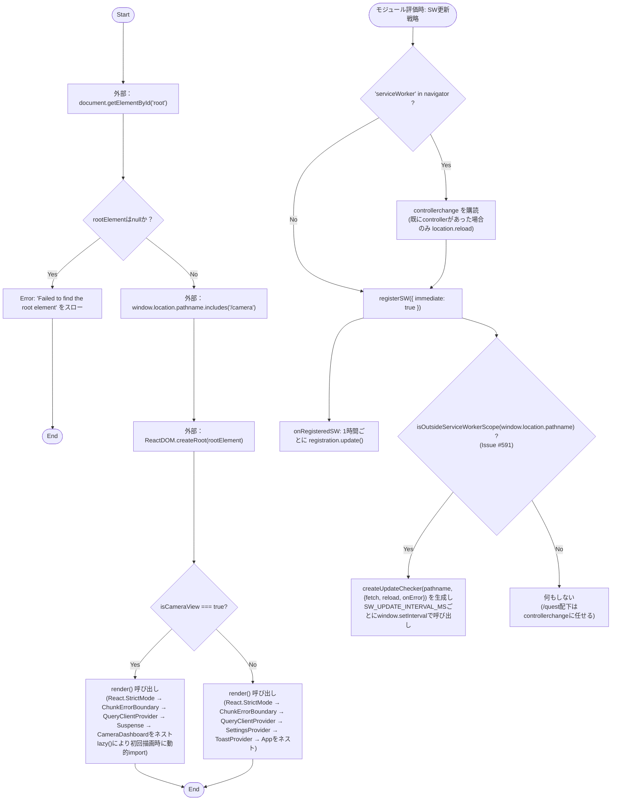

## 1. 解析メタ情報

| 項目 | 内容 |
| --- | --- |
| 対象ファイル | main.tsx |
| 言語 | React (TypeScript) |
| 解析対象 | 提供されたコードのみ |
| 推測・補完 | 一切なし |
| 解析基準コミット | `6007292` |

## 関連ドキュメント

* [App.md](App.md) - `/camera`を含まないパスでマウントされる通常時のルートコンポーネント（`SettingsProvider`/`ToastProvider`配下でマウントされる）
* [src/features/camera/components/CameraDashboard.md](src/features/camera/components/CameraDashboard.md) - `/camera`パスで`lazy()`+`Suspense`によりマウントされるカメラビューワのルートコンポーネント（`SettingsProvider`/`ToastProvider`の外側でマウントされる）
* [src/lib/queryClient.md](src/lib/queryClient.md) - `QueryClientProvider`に渡す`queryClient`インスタンスの定義元
* [src/context/SettingsContext.md](src/context/SettingsContext.md) - `App`分岐のみをラップする`SettingsProvider`の実装元
* [src/context/ToastContext.md](src/context/ToastContext.md) - `App`分岐のみをラップする`ToastProvider`の実装元
* [src/components/ui/ChunkErrorBoundary.md](src/components/ui/ChunkErrorBoundary.md) - ルート直下でツリー全体を包む、`lazy()`チャンク読込失敗時の自動再読み込み用エラーバウンダリ(Issue #362)
* [src/lib/routing.md](src/lib/routing.md) - **（Issue #472で追加）** `isCameraView`の判定に使う`isCameraRoute`関数の実装元。以前の`window.location.pathname.includes('/camera')`という単純部分一致を、単体テスト可能なセグメント単位の判定関数に置き換えた。
* [src/lib/outOfScopeReload.md](src/lib/outOfScopeReload.md) - **（Issue #591で追加）** `isOutsideServiceWorkerScope`・`createUpdateChecker`の実装元。`registerSW(...)`呼び出し直後に、Service Workerのスコープ(`/quest/`)外にある`/camera`のようなパスでのみ、no-cacheでのHTML再取得+`Last-Modified`比較による定期的な更新検知を追加登録するために使う。Issue #362の`controllerchange`ベースの仕組みがスコープ外ページでは発火しないことへの代替。

## 2. ファイルの概要

* DOMから特定のルート要素（`id="root"`）を取得し、`React.StrictMode`と`QueryClientProvider`（React Query）でラップした上で、URLのパス（`window.location.pathname`）が「カメラルート」かどうか（`isCameraView`）に応じて、マウントするツリーをルート直下で丸ごと切り替えるエントリーポイントファイルである。`isCameraView`が`true`の場合は`CameraDashboard`（カメラビューワ、`lazy()`による動的importで別チャンクに分離され`Suspense`でラップされる）を、`false`の場合は`App`（通常のFamily Questアプリ）を`SettingsProvider`・`ToastProvider`でラップしてレンダリングする。`CameraDashboard`は`SettingsProvider`/`ToastProvider`の**外側**でマウントされるため、`App`側のみが使えるこれら2つのコンテキスト（`useSettings`/`useToast`）を利用できない設計になっている。**（Issue #472で変更）** `isCameraView`の判定は、以前はこのファイル内で`window.location.pathname.includes('/camera')`という単純な部分一致で行っていたが、`./lib/routing`から新たにインポートした`isCameraRoute(window.location.pathname)`関数呼び出しに置き換えられた。判定の意図（`/camera`または`/quest/camera`で始まるパスをカメラビューとして扱う）自体は変わっていないが、実装がセグメント単位の厳密な判定になり、かつ単体テスト可能な別モジュールに切り出された。
* 根拠: `ReactDOM.createRoot(rootElement).render(...)` と `isCameraView` による分岐 (行番号: 76, 80-99 / 抜粋: "const isCameraView = isCameraRoute(window.location.pathname); ... {isCameraView ? (\n        <Suspense fallback={null}>\n          <CameraDashboard />\n        </Suspense>\n      ) : (\n        <SettingsProvider>\n          <ToastProvider>\n            <App />\n          </ToastProvider>\n        </SettingsProvider>\n      )}")
* 根拠: `isCameraRoute`のインポートへの置き換え (行番号: 11, 75〜76 / 抜粋: "import { isCameraRoute } from './lib/routing'", "// ★追加: URLのパスが '/camera' または '/quest/camera' 等で始まる場合はカメラビューワをレンダリングする\nconst isCameraView = isCameraRoute(window.location.pathname);")
* 根拠: [CameraDashboardのlazy import化とコメント] (行番号: 14〜16 / 抜粋: "// CameraDashboard(hls.js含む)は /camera 専用でFamily Quest本体とは同時に使われないため、\n// 動的importで別チャンクに分離し、通常のクエスト画面の初回読み込みバンドルから除外する。\nconst CameraDashboard = lazy(() => import('./features/camera/components/CameraDashboard'))")
* **Issue #362(PWA Service Workerの更新戦略)**: `virtual:pwa-register`の`registerSW`を明示的に呼び出し、1時間ごとに`registration.update()`で新しいSWの有無を確認する。新しいSWが有効化(`skipWaiting`+`clientsClaim`)されて`controllerchange`が発火した時点で`window.location.reload()`によりページを自動再読み込みし、常時表示中のキオスク端末(Echo Show)でも旧バンドルが残留しないようにする。初回インストール時(controllerが無い状態からの初回claim)の`controllerchange`は「更新」ではないため再読み込みしない。さらにレンダーツリー全体を`ChunkErrorBoundary`で包み、SW更新後に旧チャンクが404になって`lazy()`がthrowしても白画面にせず自動再読み込みする。
* 根拠: SW更新戦略のコメントと実装 (行番号: 18〜54 / 抜粋: "const SW_UPDATE_INTERVAL_MS = 60 * 60 * 1000;", "navigator.serviceWorker.addEventListener('controllerchange', () => {\n    if (!hadController) {\n      hadController = true;\n      return;\n    }\n    window.location.reload();\n  });", "registerSW({\n  immediate: true,\n  onRegisteredSW(_swUrl, registration) {")
* 根拠: `ChunkErrorBoundary`によるラップ (行番号: 80〜98 / 抜粋: "<ChunkErrorBoundary>\n      <QueryClientProvider client={queryClient}>")
* **Issue #591(Service Workerスコープ外ページの更新検知)**: `vite.config.ts`の`base: '/quest/'`によりService Workerのスコープは`/quest/`に限定されるため、それ以外のパス(典型的には、バックエンドが専用ルートで配信する`/camera`)では`navigator.serviceWorker.controller`が常に`null`のままとなり、Issue #362の`controllerchange`が一切発火しない。この隙間を埋めるため、`registerSW(...)`呼び出しの直後に`./lib/outOfScopeReload`の`isOutsideServiceWorkerScope(window.location.pathname)`を評価し、真の場合のみ`createUpdateChecker(window.location.pathname, { fetch, reload, onError })`が返すチェック関数を、Issue #362と同じ`SW_UPDATE_INTERVAL_MS`(1時間)間隔で`window.setInterval`により呼び出す。判定・比較の実際のロジックは`./lib/outOfScopeReload`側にあり、詳細は[outOfScopeReload.md](src/lib/outOfScopeReload.md)を参照。
* 根拠: Issue #591のコメントと追加コード (行番号: 12, 56〜66 / 抜粋: "import { isOutsideServiceWorkerScope, createUpdateChecker } from './lib/outOfScopeReload'", "if (isOutsideServiceWorkerScope(window.location.pathname)) {\n  const checkForUpdate = createUpdateChecker(window.location.pathname, {\n    fetch: window.fetch.bind(window),\n    reload: () => window.location.reload(),\n    onError: (e: unknown) => console.warn('Camera page update check failed:', e),\n  });\n  window.setInterval(checkForUpdate, SW_UPDATE_INTERVAL_MS);\n}")

## 3. 外部依存関係

### インポート一覧

| 名称 | 種類 | 用途 | 根拠 |
| --- | --- | --- | --- |
| `React`, `lazy`, `Suspense` | 外部ライブラリ | JSXおよびReactの基本機能。`lazy`は`CameraDashboard`の動的import、`Suspense`はその読み込み待機中のフォールバック表示に使用 | 根拠: `React` (行番号: 1 / 抜粋: "import React, { lazy, Suspense } from 'react'") |
| `ReactDOM` | 外部ライブラリ | DOMへのルート作成とレンダリング | 根拠: `ReactDOM` (行番号: 2 / 抜粋: "import ReactDOM from 'react-dom/client'") |
| `registerSW` | 外部ライブラリ(`vite-plugin-pwa`の仮想モジュール) | Service Workerの明示登録と、登録済み`registration`を受け取っての定期`update()`呼び出し(Issue #362) | 根拠: (行番号: 3 / 抜粋: "import { registerSW } from 'virtual:pwa-register'") |
| `ChunkErrorBoundary` | 内部モジュール | `lazy()`チャンク読込失敗時に自動再読み込みするエラーバウンダリ。ルート直下でツリー全体を包む(Issue #362) | 根拠: (行番号: 10 / 抜粋: "import ChunkErrorBoundary from './components/ui/ChunkErrorBoundary'") |
| `App` | 内部モジュール | アプリケーションのルートコンポーネント（通常時、`SettingsProvider`/`ToastProvider`配下でマウント） | 根拠: `App` (行番号: 4 / 抜粋: "import App from './App' // 拡張子は省略可能") |
| 該当なし(CSS) | スタイルシート | グローバルなスタイルの適用 | 根拠: `index.css` (行番号: 5 / 抜粋: "import './index.css'") |
| `QueryClientProvider` | 外部ライブラリ | React Queryのクライアントをツリーに提供 | 根拠: `QueryClientProvider` (行番号: 6 / 抜粋: "import { QueryClientProvider } from '@tanstack/react-query'") |
| `queryClient` | 内部モジュール | React Queryのクライアントインスタンス | 根拠: `queryClient` (行番号: 7 / 抜粋: "import { queryClient } from './lib/queryClient'") |
| `SettingsProvider` | 内部モジュール | `App`分岐のみをラップする設定コンテキストのプロバイダ（`CameraDashboard`側では利用不可） | 根拠: `SettingsProvider` (行番号: 8 / 抜粋: "import { SettingsProvider } from './context/SettingsContext'") |
| `ToastProvider` | 内部モジュール | `App`分岐のみをラップするトースト通知コンテキストのプロバイダ（`CameraDashboard`側では利用不可） | 根拠: `ToastProvider` (行番号: 9 / 抜粋: "import { ToastProvider } from './context/ToastContext'") |
| `CameraDashboard` | 内部モジュール（`lazy`による動的import） | カメラビューワのルートコンポーネント（`/camera`パス時。静的importではなく`lazy()`で別チャンクに分離される） | 根拠: `CameraDashboard` (行番号: 16 / 抜粋: "const CameraDashboard = lazy(() => import('./features/camera/components/CameraDashboard'))") |
| `isCameraRoute` | 内部モジュール（純粋関数） | **（Issue #472で追加）** URLのパスが「カメラルート」（`/camera`または`/quest/camera`で始まる）かどうかを判定する。以前ここに直接書かれていた`pathname.includes('/camera')`という部分一致判定を置き換えた | 根拠: (行番号: 11 / 抜粋: "import { isCameraRoute } from './lib/routing'") |
| `isOutsideServiceWorkerScope`, `createUpdateChecker` | 内部モジュール（純粋関数／チェック関数のファクトリ） | **（Issue #591で追加）** SWスコープ(`/quest/`)外のパスかどうかの判定と、no-cacheでのHTML再取得+`Last-Modified`比較による更新チェック関数の生成 | 根拠: (行番号: 12 / 抜粋: "import { isOutsideServiceWorkerScope, createUpdateChecker } from './lib/outOfScopeReload'") |

### ブラックボックスとなる外部要素

| 名称 | 理由 | 根拠 |
| --- | --- | --- |
| `App` | 内部実装が提供されていないため、どのようなUIやロジックを持つか不明（`./App`ファイルに依存のため要確認）。 | 根拠: `App` (行番号: 4 / 抜粋: "import App from './App'") |
| `CameraDashboard` | 内部実装が提供されていないため、どのようなUIやロジックを持つか不明（`./features/camera/components/CameraDashboard`ファイルに依存のため要確認）。 | 根拠: `CameraDashboard` (行番号: 16 / 抜粋: "const CameraDashboard = lazy(() => import('./features/camera/components/CameraDashboard'))") |
| `./index.css` | 具体的なスタイリング内容や影響範囲が不明（該当ファイルに依存のため要確認）。 | 根拠: `index.css` (行番号: 5 / 抜粋: "import './index.css'") |
| `queryClient` | 初期化時の設定（キャッシュ設定、リトライ回数など）が不明（`./lib/queryClient`ファイルに依存のため要確認）。 | 根拠: `queryClient` (行番号: 7 / 抜粋: "import { queryClient } from './lib/queryClient'") |
| `SettingsProvider` | 内部実装が提供されていないため、どのような設定コンテキストを提供するか不明（`./context/SettingsContext`ファイルに依存のため要確認）。 | 根拠: `SettingsProvider` (行番号: 8 / 抜粋: "import { SettingsProvider } from './context/SettingsContext'") |
| `ToastProvider` | 内部実装が提供されていないため、どのようなトースト通知機構を提供するか不明（`./context/ToastContext`ファイルに依存のため要確認）。 | 根拠: `ToastProvider` (行番号: 9 / 抜粋: "import { ToastProvider } from './context/ToastContext'") |
| `document` API | `root`というIDを持つ要素がDOM上に存在するかどうかはHTML側の実装に依存するため不明。 | 根拠: `document.getElementById` (行番号: 69 / 抜粋: "const rootElement = document.getElementById('root');") |
| `window.location` API | 実行時のURLパスに依存するため、どのタイミングで`/camera`パスになるか（ルーティング全体の設計）は本ファイルからは不明。 | 根拠: `window.location.pathname` (行番号: 59〜60, 76 / 抜粋: "if (isOutsideServiceWorkerScope(window.location.pathname)) {\n  const checkForUpdate = createUpdateChecker(window.location.pathname, {", "const isCameraView = isCameraRoute(window.location.pathname);") |
| `navigator.serviceWorker` / `virtual:pwa-register` | ブラウザのService Worker APIおよび`vite-plugin-pwa`がビルド時に生成する仮想モジュール。生成されるSWの中身(`skipWaiting`/`clientsClaim`/`cleanupOutdatedCaches`)は`vite.config.ts`の`VitePWA`設定に依存し本ファイルからは不明。 | 根拠: (行番号: 3, 27〜54 / 抜粋: "if ('serviceWorker' in navigator) {", "registerSW({\n  immediate: true,") |
| `window.fetch` | **（Issue #591で追加）** ブラウザ標準API。本ファイルは`deps.fetch`として`window.fetch.bind(window)`を渡すのみで、実際にどのタイミング・条件で呼ばれるか（no-cache再取得のロジック本体）は`./lib/outOfScopeReload`の`createUpdateChecker`側にあり本ファイルからは不明。 | 根拠: (行番号: 61 / 抜粋: "fetch: window.fetch.bind(window),") |

## 4. 主要要素の定義（関数 / エンドポイント / コンポーネント）

### Service Worker更新戦略 (モジュールレベルの副作用、Issue #362)

* **役割**: `'serviceWorker' in navigator`の場合、`controllerchange`イベントを購読し、既に`controller`が存在していた状態からの変化(=新しいSWへの切り替わり)であれば`window.location.reload()`する。初回インストール時の`controllerchange`は`hadController`フラグで除外する。続いて`registerSW({ immediate: true, onRegisteredSW, onRegisterError })`を呼び、`onRegisteredSW`で受け取った`registration`に対して`SW_UPDATE_INTERVAL_MS`(1時間)ごとに`update()`を呼ぶ(失敗は`console.warn`)。
* 根拠: (行番号: 27〜54 / 抜粋: "const SW_UPDATE_INTERVAL_MS = 60 * 60 * 1000;\n\nif ('serviceWorker' in navigator) {\n  let hadController = !!navigator.serviceWorker.controller;\n  navigator.serviceWorker.addEventListener('controllerchange', () => {", "registerSW({\n  immediate: true,\n  onRegisteredSW(_swUrl, registration) {\n    if (!registration) return;\n    window.setInterval(() => {\n      registration.update().catch((e: unknown) => console.warn('SW update check failed:', e));\n    }, SW_UPDATE_INTERVAL_MS);")
* **副作用**: `navigator.serviceWorker`へのイベントリスナー登録、SW登録、`setInterval`、条件付きの`window.location.reload()`
* **エラーハンドリング**: `registration.update()`の失敗は`console.warn`、SW登録失敗は`onRegisterError`で`console.error`に記録するのみでアプリの描画は継続する。
* 根拠: (行番号: 48, 51〜52)

### スコープ外ページの更新チェック (モジュールレベルの副作用、Issue #591)

* **役割**: `registerSW(...)`呼び出しの直後、`./lib/outOfScopeReload`の`isOutsideServiceWorkerScope(window.location.pathname)`を評価する。真（現在のパスがService Workerのスコープ`/quest/`の外、典型的には`/camera`）の場合のみ、同モジュールの`createUpdateChecker(window.location.pathname, { fetch, reload, onError })`を呼んでチェック関数`checkForUpdate`を生成し、Issue #362と同じ`SW_UPDATE_INTERVAL_MS`(1時間)間隔で`window.setInterval(checkForUpdate, SW_UPDATE_INTERVAL_MS)`により定期実行する。渡す`deps`は`fetch: window.fetch.bind(window)`、`reload: () => window.location.reload()`、`onError`の3点で、`checkForUpdate`自身の内部ロジック（`pathname`のno-cache再取得と`Last-Modified`比較、初回呼び出し時は基準値を記録するだけで`reload`しない、等）は本ファイルの責務ではなく`./lib/outOfScopeReload`側にある（詳細は[outOfScopeReload.md](src/lib/outOfScopeReload.md)を参照）。スコープ内(`/quest/...`)のパスではこのブロック自体が丸ごとスキップされ、Issue #362の`controllerchange`ベースの仕組みのみが働く。
* 根拠: (行番号: 12, 56〜66 / 抜粋: "import { isOutsideServiceWorkerScope, createUpdateChecker } from './lib/outOfScopeReload'", "if (isOutsideServiceWorkerScope(window.location.pathname)) {\n  const checkForUpdate = createUpdateChecker(window.location.pathname, {\n    fetch: window.fetch.bind(window),\n    reload: () => window.location.reload(),\n    onError: (e: unknown) => console.warn('Camera page update check failed:', e),\n  });\n  window.setInterval(checkForUpdate, SW_UPDATE_INTERVAL_MS);\n}")
* **副作用**: `deps.fetch`(`window.fetch`)によるno-cache HTTPリクエスト、条件成立時の`window.location.reload()`、`setInterval`によるタイマー登録。いずれも`checkForUpdate`が呼ばれる度に発生し、実行主体は`./lib/outOfScopeReload`側のクロージャ。
* **エラーハンドリング**: `onError`コールバックが`fetch`失敗時に`console.warn('Camera page update check failed:', e)`を出力するのみで、リロードは行わずアプリの表示は継続する。実際に`onError`を呼ぶかどうかの判断自体は`createUpdateChecker`側の責務。
* 根拠: (行番号: 60〜64 / 抜粋: "const checkForUpdate = createUpdateChecker(window.location.pathname, {\n    fetch: window.fetch.bind(window),\n    reload: () => window.location.reload(),\n    onError: (e: unknown) => console.warn('Camera page update check failed:', e),\n  });")

## 5. 処理フロー図

```mermaid
flowchart TD
    Start([Start]) --> GetElement["外部：document.getElementById('root')"]
    GetElement --> CheckNull{"rootElementはnullか？"}
    CheckNull -- Yes --> ThrowError["Error: 'Failed to find the root element' をスロー"]
    ThrowError --> EndError([End])
    CheckNull -- No --> CheckCamera["外部：window.location.pathname.includes('/camera')"]
    CheckCamera --> CreateRoot["外部：ReactDOM.createRoot(rootElement)"]
    CreateRoot --> IsCameraView{"isCameraView === true?"}
    IsCameraView -- Yes --> RenderCamera["render() 呼び出し<br>(React.StrictMode → ChunkErrorBoundary → QueryClientProvider → Suspense → CameraDashboardをネスト<br>lazy()により初回描画時に動的import)"]
    IsCameraView -- No --> RenderApp["render() 呼び出し<br>(React.StrictMode → ChunkErrorBoundary → QueryClientProvider → SettingsProvider → ToastProvider → Appをネスト)"]
    RenderCamera --> End([End])
    RenderApp --> End

    SWStart([モジュール評価時: SW更新戦略]) --> HasSW{"'serviceWorker' in navigator ?"}
    HasSW -- Yes --> Listen["controllerchange を購読<br>(既にcontrollerがあった場合のみ location.reload)"]
    HasSW -- No --> Register
    Listen --> Register["registerSW({ immediate: true })"]
    Register --> Interval["onRegisteredSW: 1時間ごとに registration.update()"]
    Register --> CheckScope{"isOutsideServiceWorkerScope(window.location.pathname) ?<br>(Issue #591)"}
    CheckScope -- Yes --> SetupChecker["createUpdateChecker(pathname, {fetch, reload, onError}) を生成し<br>SW_UPDATE_INTERVAL_MSごとにwindow.setIntervalで呼び出し"]
    CheckScope -- No --> ScopeNoOp["何もしない<br>(/quest配下はcontrollerchangeに任せる)"]

```

## 6. 依存関係図

```mermaid
graph TD
    Main["main.tsx (本ファイル)"] --> Document["外部：ブラウザAPI (document)"]
    Main --> Location["外部：ブラウザAPI (window.location)"]
    Main --> ReactDOM["外部モジュール：react-dom/client"]
    Main --> React["外部モジュール：react (lazy, Suspense含む)"]
    Main --> ReactQuery["外部モジュール：@tanstack/react-query"]
    Main --> QueryClient["外部ファイル：./lib/queryClient (ブラックボックス)"]
    Main --> App["外部ファイル：./App (ブラックボックス)"]
    Main -.->|lazy動的import| CameraDashboard["外部ファイル：./features/camera/components/CameraDashboard (ブラックボックス)"]
    Main --> CSS["外部ファイル：./index.css (ブラックボックス)"]
    Main --> SettingsProvider["外部ファイル：./context/SettingsContext (ブラックボックス)<br>Appのみラップ"]
    Main --> ToastProvider["外部ファイル：./context/ToastContext (ブラックボックス)<br>Appのみラップ"]
    Main --> ChunkErrorBoundary["内部ファイル：./components/ui/ChunkErrorBoundary<br>ルート直下で全体をラップ"]
    Main --> RegisterSW["外部モジュール：virtual:pwa-register (registerSW)"]
    Main --> ServiceWorker["外部：navigator.serviceWorker (controllerchange)"]
    Main -->|isCameraRoute(pathname), #472| Routing["内部ファイル：./lib/routing (isCameraRoute)"]
    Main -->|isOutsideServiceWorkerScope/createUpdateChecker, #591| OutOfScopeReload["内部ファイル：./lib/outOfScopeReload<br>(isOutsideServiceWorkerScope, createUpdateChecker)"]

```

## 7. 次のステップ（リバースエンジニアリングの提案）

| 優先度 | ファイル名(推測可) | 理由 | 根拠 |
| --- | --- | --- | --- |
| 高 | `./App.tsx` | アプリケーションのルートであり、画面の描画内容やルーティング等の主要な機能の全体像を把握するために必須であるため。 | 根拠: `App` (行番号: 3 / 抜粋: "import App from './App'") |
| 高 | `./features/camera/components/CameraDashboard.tsx` | `/camera`パスでマウントされるもう一方のルートコンポーネントであり、カメラ機能の全体像を把握するために必須であるため。 | 根拠: `CameraDashboard` (行番号: 12 / 抜粋: "const CameraDashboard = lazy(() => import('./features/camera/components/CameraDashboard'))") |
| 中 | `./context/SettingsContext.tsx`, `./context/ToastContext.tsx` | `App`分岐のみをラップするコンテキストの実装内容（`CameraDashboard`側で利用不可な理由の裏付け）を確認するため。 | 根拠: `SettingsProvider`, `ToastProvider` (行番号: 7-8 / 抜粋: "import { SettingsProvider } from './context/SettingsContext'\nimport { ToastProvider } from './context/ToastContext'") |
| 中 | `./lib/queryClient.ts` または `.js` | React Queryによるデータフェッチのグローバルなキャッシュ戦略やエラーハンドリングの設定内容を確認するため。 | 根拠: `queryClient` (行番号: 6 / 抜粋: "import { queryClient } from './lib/queryClient'") |
| 中 | `index.html` | マウント対象となる `

` 要素が確実に定義されているか、およびメタデータ等を確認するため。 | 根拠: `document.getElementById` (行番号: 15 / 抜粋: "document.getElementById('root'); ") |
| 低 | `./index.css` | アプリケーション全体に適用されているベーススタイルやCSS変数の定義状況を把握するため。 | 根拠: `index.css` (行番号: 4 / 抜粋: "import './index.css'") |
| 中 | `./lib/routing.ts` | **（Issue #472で追加）** `isCameraRoute`の正確な判定ロジック（どのパスがカメラルートとみなされるか）を確認するため。本ファイル単体では呼び出しているのみで判定条件の詳細は不明。 | 根拠: (行番号: 11 / 抜粋: "import { isCameraRoute } from './lib/routing'") |

## 8. 保守上の注意点

* `document.getElementById('root')` が `null` を返した場合、意図的に `Error` がスローされ後続のレンダリング処理が完全に停止する。呼び出し元のHTMLファイルに `id="root"` を持つ要素が存在しない場合にクリティカルな影響が出る。
* 根拠: `if (!rootElement) { throw new Error('Failed to find the root element'); }` (行番号: 71-73)
* **`CameraDashboard`は`SettingsProvider`/`ToastProvider`の外側でマウントされる**: `App`分岐のみが`SettingsProvider`・`ToastProvider`でラップされており、`CameraDashboard`（および配下のコンポーネント）はこれらのコンテキストの外でマウントされる。そのため`CameraDashboard`側では`useSettings`/`useToast`フックを使用できない設計上の制約がある（`CameraDashboard`側でトースト通知的なUIが必要な場合は、コンテキストに依存しないローカルstateでの実装が必要になる）。
* 根拠: [レンダーツリー構造] (行番号: 85-95 / 抜粋: "{isCameraView ? (\n        <Suspense fallback={null}>\n          <CameraDashboard />\n        </Suspense>\n      ) : (\n        <SettingsProvider>\n          <ToastProvider>\n            <App />\n          </ToastProvider>\n        </SettingsProvider>\n      )}")
* **SW更新時の自動再読み込みはユーザー操作を待たない(Issue #362)**: `controllerchange`を受けた時点で入力中の状態やモーダルの有無に関わらず`window.location.reload()`する。Family Questはサーバー側にしか永続状態を持たないため実害は小さいが、長い入力フォームを持つ画面を追加する場合はこの挙動を考慮する必要がある。また`registerSW`を`src/`から明示的にimportしているため、`vite-plugin-pwa`(`injectRegister: 'auto'`既定)は`registerSW.js`の自動注入を行わず、登録は本ファイルの呼び出しに一本化される。
* 根拠: (行番号: 18〜26, 33〜41, 43〜54)
* **[修正済み] ルーティング判定の部分一致による誤マッチのリスク（Issue #472）**: 以前は`isCameraView`を`window.location.pathname.includes('/camera')`という単純な部分一致で本ファイル内で直接決定しており、専用のルーティングライブラリも使っていなかった。将来的に`/camera`を含む別の意図しないパス（例: `/settings/camera-help`）が追加された場合、意図せず`CameraDashboard`がマウントされてしまう懸念があった。現在は`./lib/routing`に切り出した`isCameraRoute`関数（セグメント単位で先頭が`camera`、または先頭が`quest`かつ2番目が`camera`の場合のみ真）を呼び出す形に置き換えられ、単体テスト（`routing.test.ts`）も追加された。依然として専用のルーティングライブラリは使っておらず、ルート判定はこの1関数に閉じている。
* 根拠: (11, 76行目 / 抜粋: "import { isCameraRoute } from './lib/routing'", "const isCameraView = isCameraRoute(window.location.pathname);")
* **[修正済み] `/camera`はSWスコープ外のため`controllerchange`(Issue #362)に頼れなかった隙間（Issue #591）**: `vite.config.ts`の`base: '/quest/'`によりService Workerのスコープは`/quest/`に限定される。`/camera`は`MY_HOME_SYSTEM/unified_server.py`が`/quest/{full_path}`と同じハンドラを`@app.get("/camera/{full_path:path}")`にも二重登録する形で配信する、`/quest/`とは別の独立したトップレベルパスであるため、Service Worker仕様上このページの`navigator.serviceWorker.controller`は常に`null`のままとなり、Issue #362で追加した`controllerchange`リスナーは一切発火しない。修正前は、Echo Show等の常時表示端末で`/camera`を開いたまま`deploy.sh`が新しいバンドルをデプロイしても検知・自動リロードの手段が皆無で、Issue #362がそもそも解決しようとしていた「旧バンドル固着」（2026-09-01障害）と同型の問題がこのページにだけ再発しうる状態だった。現在は`isOutsideServiceWorkerScope(window.location.pathname)`が真の場合のみ、`./lib/outOfScopeReload`の`createUpdateChecker`が生成する関数を同じ`SW_UPDATE_INTERVAL_MS`間隔で呼び出し、`pathname`自身をno-cacheで再取得して`Last-Modified`ヘッダの変化を検知したら`window.location.reload()`する形で埋められている（バックエンドの`/camera`ルートがStarletteの`FileResponse(index_path)`で`index.html`を返す際、ファイルのmtimeから`Last-Modified`が自動的に付与されることに依存する）。なお`createUpdateChecker`は初回呼び出し時は比較対象がなくbaselineを記録するだけで終わるため、`/camera`を開いた直後にリロードが走ることはなく、実際に新しいバンドルを検知してリロードするまでには次のインターバル（最大`SW_UPDATE_INTERVAL_MS`＝1時間）を待つ点、および`Last-Modified`ヘッダが欠落した場合は変化なし扱いとなりリロードされない点に注意（詳細は[outOfScopeReload.md](src/lib/outOfScopeReload.md)を参照）。
* 根拠: (行番号: 12, 56〜66 / 抜粋: "import { isOutsideServiceWorkerScope, createUpdateChecker } from './lib/outOfScopeReload'", "if (isOutsideServiceWorkerScope(window.location.pathname)) {\n  const checkForUpdate = createUpdateChecker(window.location.pathname, {\n    fetch: window.fetch.bind(window),\n    reload: () => window.location.reload(),\n    onError: (e: unknown) => console.warn('Camera page update check failed:', e),\n  });\n  window.setInterval(checkForUpdate, SW_UPDATE_INTERVAL_MS);\n}")

## 9. 不明事項一覧

| 項目 | 理由 | 必要なファイル |
| --- | --- | --- |
| `App` コンポーネントの詳細な機能 | 内部実装がインポートされているのみでコード内に記述がないため。 | `./App.tsx` |
| `CameraDashboard` コンポーネントの詳細な機能 | 内部実装がインポートされているのみでコード内に記述がないため。 | `./features/camera/components/CameraDashboard.tsx` |
| データフェッチ機構のグローバル設定 | `queryClient` が外部ファイルからインポートされており、本ファイル内では設定パラメータが判断不可であるため。 | `./lib/queryClient` (拡張子は同上) |
| グローバルスタイルの定義内容 | CSSファイルがインポートされているのみであり、スタイルの衝突や適用範囲が不明であるため。 | `./index.css` |
| HTML側のDOM構造 | `document.getElementById('root')` の対象となる要素が定義されているHTMLファイルが提供されていないため。 | `index.html` (エントリーポイントに対応するHTMLファイル) |
| `/camera` 以外のルーティング設計の有無 | `isCameraRoute`（`./lib/routing`）による判定でしか分岐していないため、他にルーティングライブラリや設定が存在するか不明。 | ルーティング関連の設定ファイル（存在する場合） |
| `isCameraRoute`の正確な判定条件 | 本ファイルは`isCameraRoute(window.location.pathname)`を呼び出しているのみで、関数自体の実装（どのパスパターンを真と判定するか）は`./lib/routing`側にあるため本ファイルからは不明。 | `./lib/routing.ts` |

## 相互参照による補足情報

| 元の不明事項 | 判明した内容 | 参照元ドキュメント |
| --- | --- | --- |
| `App` コンポーネントの詳細な機能 | `family-quest/src/App.tsx`(全526行)を直接確認した。ユーザー切替(`currentUserIdx`)、購入・却下確認モーダル(`ConfirmModal`)、エラー表示モーダル(`MessageModal`)、クエスト完了/取消のワンタップ実行(`runQuestAction`/`handleQuestClick`)、報酬購入(`handleBuyReward`/`executeConfirm`)、承認・一括承認(`handleApprove`/`handleApproveAll`)、`useLayoutMode`による横画面(`FamilyDashboard`)/縦画面(`UserStatusCard`+`QuestList`等+`BottomNav`)のレイアウト切替、アバターアップロード(`AvatarUploader`、`lazy`import)、設定モーダル(`SettingsModal`、`lazy`import)を統括するFamily Questのメイン画面コンポーネントであることを確認した(138〜523行目)。 | 直接ソース確認: `family-quest/src/App.tsx:138-523` |
| `CameraDashboard` コンポーネントの詳細な機能 | `family-quest/src/features/camera/components/CameraDashboard.tsx`(全67行)を直接確認した。マウント時の`useEffect`(13〜27行目)で`document.title`を「ホーム監視カメラ」に変更しつつ`apiClient.get<CameraConfig[]>('/api/cameras/settings')`を呼び出し、`enabled`なカメラのみ`filter`し`order`昇順に`sort`して`cameras`状態にセットする(16〜19行目)。「🟢 ライブ映像」/「📼 録画再生」の2タブ(`activeTab`, 43〜56行目)を持ち、`live`時は`LiveView`、`record`時は`RecordView`にカメラ一覧を渡して描画する(58〜62行目)独立した全画面レイアウト(`min-h-screen`、31〜65行目)のコンポーネントである。 | 直接ソース確認: `family-quest/src/features/camera/components/CameraDashboard.tsx:1-67` |
| データフェッチ機構のグローバル設定 | `family-quest/src/lib/queryClient.ts`(全10行)を直接確認した。`queryClient`は`retry: 1`（失敗時1回再試行）、`staleTime: 1000 * 60`（60秒）、`refetchOnWindowFocus: false`という`defaultOptions.queries`(4〜9行目)を持つ`QueryClient`インスタンスであり、記載内容以外の追加設定（`mutations`のデフォルト等）はファイル内に存在しない。 | 直接ソース確認: `family-quest/src/lib/queryClient.ts:1-10` |
| グローバルスタイルの定義内容 | `family-quest/src/index.css`を直接確認した。**（PR #428 / Tailwind CSS v4への移行で変更）** v3では`@tailwind base; @tailwind components; @tailwind utilities;`の3行だったが、v4ではこれが`@import "tailwindcss";`の1行に統合された。加えて、v3の`tailwind.config.js`にあった`theme.extend`（`wiggle`アニメーション）は設定ファイルではなくCSS側の`@theme`ブロックに移り、`@keyframes wiggle`と共に本ファイルに記述されている（この`wiggle`はどのコンポーネントからも参照されていないが、移行で黙って落とさないよう残している）。それ以外のカスタムCSS変数やベーススタイルの追加定義は本ファイルには存在しない（**Issue #412 品質で修正**: `main.tsx`からインポートされていない、どこからも参照されていなかった`App.css`は死蔵ファイルと判断し削除された。同様に未参照だった`src/assets/react.svg`・`public/silent.mp3`も削除された）。 | 直接ソース確認: `family-quest/src/index.css:1-24` |
| HTML側のDOM構造 | `family-quest/index.html`(全20行)を直接確認した。`<body>`内に`

`(16行目)と``(17行目)のみが存在し、`main.tsx`がマウント対象とする`id="root"`の要素が確実に存在することを確認した。`<head>`には`<title>Family Quest</title>`(12行目)、`theme-color`(9行目)、`description`(10行目)、`apple-touch-icon`(11行目)等のメタデータが定義されている。 | 直接ソース確認: `family-quest/index.html:1-20` |
| `/camera` 以外のルーティング設計の有無 | `family-quest/package.json`および`family-quest`ディレクトリ全体を確認したが、`react-router`等のルーティングライブラリの依存は存在せず(`package.json`に`router`を含む依存は0件)、`*route*`/`*router*`という名前の設定ファイルは`src/lib/routing.ts`（Issue #472で新規追加、ルーティングライブラリではなく単一の判定関数`isCameraRoute`のみを提供するモジュール）のみであることを確認した。`family-quest/src/main.tsx`を確認したところ、ルーティングは`isCameraRoute(window.location.pathname)`の真偽のみで、`isCameraView`の真偽で`CameraDashboard`か`App`(+`SettingsProvider`+`ToastProvider`)かをルート直下で丸ごと切り替えている。専用のルーティングライブラリや、`isCameraRoute`以外の追加のルート判定は存在しないことを確認した。 | 直接ソース確認: `family-quest/src/main.tsx`, `family-quest/src/lib/routing.ts`, `family-quest/package.json`（`router`依存なし） |
| `isCameraRoute`の正確な判定条件 | `family-quest/src/lib/routing.ts`を直接確認した。`isCameraRoute(pathname)`は`pathname.split('/').filter(Boolean)`でパスを非空セグメントに分割し、先頭セグメントが`'camera'`と一致するか、または先頭が`'quest'`かつ2番目のセグメントが`'camera'`と一致する場合にのみ`true`を返す純粋関数である。詳細は[routing.md](src/lib/routing.md)を参照。 | 直接ソース確認: `family-quest/src/lib/routing.ts:1-19` |

## 10. 自己検証結果

* [x] 完了: 推測・外部ファイルの仕様を一切含んでいない
* [x] 完了: 全関数・全クラス・全コンポーネントを列挙した（本ファイルは該当なし）
* [x] 完了: 全てのインポート要素を列挙した
* [x] 完了: すべての仕様説明に「根拠（行番号・抜粋）」を明記した
* [x] 完了: 根拠漏れが0件である
* [x] 完了: Mermaid構文にエラーの原因となる記号（エスケープ漏れ）がない
* [x] 完了: 不明事項を漏れなく列挙した