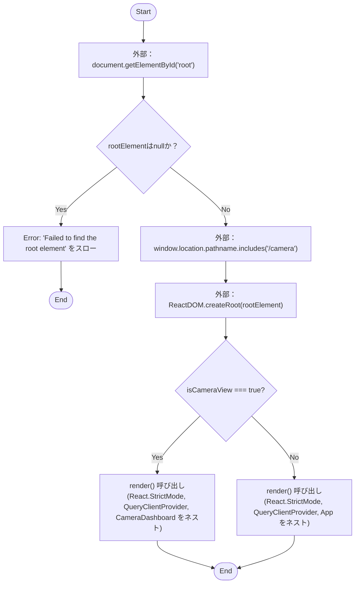
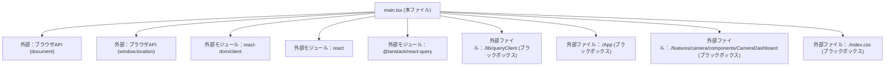

## 1. 解析メタ情報

| 項目 | 内容 |
| --- | --- |
| 対象ファイル | main.tsx |
| 言語 | React (TypeScript) |
| 解析対象 | 提供されたコードのみ |
| 推測・補完 | 一切なし |

## 関連ドキュメント

* [App.md](App.md) - `/camera`を含まないパスでマウントされる通常時のルートコンポーネント
* [src/features/camera/components/CameraDashboard.md](src/features/camera/components/CameraDashboard.md) - `/camera`パスでマウントされるカメラビューワのルートコンポーネント
* [src/lib/queryClient.md](src/lib/queryClient.md) - `QueryClientProvider`に渡す`queryClient`インスタンスの定義元

## 2. ファイルの概要

* DOMから特定のルート要素（`id="root"`）を取得し、Reactのコンテキスト（厳格モード、React Queryのプロバイダ）でラップした上で、URLのパス（`window.location.pathname`）に`/camera`が含まれるかどうかに応じて、`CameraDashboard`（カメラビューワ）または`App`（通常のFamily Questアプリ）のいずれかをルートとしてマウント・レンダリングするためのエントリーポイントファイルである。
* 根拠: `ReactDOM.createRoot(rootElement).render(...)` と `isCameraView` による分岐 (行番号: 17, 19-26 / 抜粋: "const isCameraView = window.location.pathname.includes('/camera'); ... {isCameraView ? <CameraDashboard /> : <App />}")

## 3. 外部依存関係

### インポート一覧

| 名称 | 種類 | 用途 | 根拠 |
| --- | --- | --- | --- |
| `React` | 外部ライブラリ | JSXおよびReactの基本機能 | 根拠: `React` (行番号: 1 / 抜粋: "import React from 'react'") |
| `ReactDOM` | 外部ライブラリ | DOMへのルート作成とレンダリング | 根拠: `ReactDOM` (行番号: 2 / 抜粋: "import ReactDOM from 'react-dom/client'") |
| `App` | 内部モジュール | アプリケーションのルートコンポーネント（通常時） | 根拠: `App` (行番号: 3 / 抜粋: "import App from './App' // 拡張子は省略可能") |
| `CameraDashboard` | 内部モジュール | カメラビューワのルートコンポーネント（`/camera`パス時） | 根拠: `CameraDashboard` (行番号: 4 / 抜粋: "import CameraDashboard from './features/camera/components/CameraDashboard' // ★追加") |
| 該当なし(CSS) | スタイルシート | グローバルなスタイルの適用 | 根拠: `index.css` (行番号: 5 / 抜粋: "import './index.css'") |
| `QueryClientProvider` | 外部ライブラリ | React Queryのクライアントをツリーに提供 | 根拠: `QueryClientProvider` (行番号: 6 / 抜粋: "import { QueryClientProvider } from '@tanstack/react-query'") |
| `queryClient` | 内部モジュール | React Queryのクライアントインスタンス | 根拠: `queryClient` (行番号: 7 / 抜粋: "import { queryClient } from './lib/queryClient'") |

### ブラックボックスとなる外部要素

| 名称 | 理由 | 根拠 |
| --- | --- | --- |
| `App` | 内部実装が提供されていないため、どのようなUIやロジックを持つか不明（`./App`ファイルに依存のため要確認）。 | 根拠: `App` (行番号: 3 / 抜粋: "import App from './App'") |
| `CameraDashboard` | 内部実装が提供されていないため、どのようなUIやロジックを持つか不明（`./features/camera/components/CameraDashboard`ファイルに依存のため要確認）。 | 根拠: `CameraDashboard` (行番号: 4 / 抜粋: "import CameraDashboard from './features/camera/components/CameraDashboard'") |
| `./index.css` | 具体的なスタイリング内容や影響範囲が不明（該当ファイルに依存のため要確認）。 | 根拠: `index.css` (行番号: 5 / 抜粋: "import './index.css'") |
| `queryClient` | 初期化時の設定（キャッシュ設定、リトライ回数など）が不明（`./lib/queryClient`ファイルに依存のため要確認）。 | 根拠: `queryClient` (行番号: 7 / 抜粋: "import { queryClient } from './lib/queryClient'") |
| `document` API | `root`というIDを持つ要素がDOM上に存在するかどうかはHTML側の実装に依存するため不明。 | 根拠: `document.getElementById` (行番号: 10 / 抜粋: "const rootElement = document.getElementById('root');") |
| `window.location` API | 実行時のURLパスに依存するため、どのタイミングで`/camera`パスになるか（ルーティング全体の設計）は本ファイルからは不明。 | 根拠: `window.location.pathname` (行番号: 17 / 抜粋: "const isCameraView = window.location.pathname.includes('/camera');") |

## 4. 主要要素の定義（関数 / エンドポイント / コンポーネント）

該当なし

## 5. 処理フロー図

```mermaid
flowchart TD
    Start([Start]) --> GetElement["外部：document.getElementById('root')"]
    GetElement --> CheckNull{"rootElementはnullか？"}
    CheckNull -- Yes --> ThrowError["Error: 'Failed to find the root element' をスロー"]
    ThrowError --> EndError([End])
    CheckNull -- No --> CheckCamera["外部：window.location.pathname.includes('/camera')"]
    CheckCamera --> CreateRoot["外部：ReactDOM.createRoot(rootElement)"]
    CreateRoot --> IsCameraView{"isCameraView === true?"}
    IsCameraView -- Yes --> RenderCamera["render() 呼び出し<br>(React.StrictMode, QueryClientProvider, CameraDashboard をネスト)"]
    IsCameraView -- No --> RenderApp["render() 呼び出し<br>(React.StrictMode, QueryClientProvider, App をネスト)"]
    RenderCamera --> End([End])
    RenderApp --> End

```

## 6. 依存関係図

```mermaid
graph TD
    Main["main.tsx (本ファイル)"] --> Document["外部：ブラウザAPI (document)"]
    Main --> Location["外部：ブラウザAPI (window.location)"]
    Main --> ReactDOM["外部モジュール：react-dom/client"]
    Main --> React["外部モジュール：react"]
    Main --> ReactQuery["外部モジュール：@tanstack/react-query"]
    Main --> QueryClient["外部ファイル：./lib/queryClient (ブラックボックス)"]
    Main --> App["外部ファイル：./App (ブラックボックス)"]
    Main --> CameraDashboard["外部ファイル：./features/camera/components/CameraDashboard (ブラックボックス)"]
    Main --> CSS["外部ファイル：./index.css (ブラックボックス)"]

```

## 7. 次のステップ（リバースエンジニアリングの提案）

| 優先度 | ファイル名(推測可) | 理由 | 根拠 |
| --- | --- | --- | --- |
| 高 | `./App.tsx` | アプリケーションのルートであり、画面の描画内容やルーティング等の主要な機能の全体像を把握するために必須であるため。 | 根拠: `App` (行番号: 3 / 抜粋: "import App from './App'") |
| 高 | `./features/camera/components/CameraDashboard.tsx` | `/camera`パスでマウントされるもう一方のルートコンポーネントであり、カメラ機能の全体像を把握するために必須であるため。 | 根拠: `CameraDashboard` (行番号: 4 / 抜粋: "import CameraDashboard from './features/camera/components/CameraDashboard'") |
| 中 | `./lib/queryClient.ts` または `.js` | React Queryによるデータフェッチのグローバルなキャッシュ戦略やエラーハンドリングの設定内容を確認するため。 | 根拠: `queryClient` (行番号: 7 / 抜粋: "import { queryClient } from './lib/queryClient'") |
| 中 | `index.html` | マウント対象となる `

` 要素が確実に定義されているか、およびメタデータ等を確認するため。 | 根拠: `document.getElementById` (行番号: 10 / 抜粋: "document.getElementById('root'); ") |
| 低 | `./index.css` | アプリケーション全体に適用されているベーススタイルやCSS変数の定義状況を把握するため。 | 根拠: `index.css` (行番号: 5 / 抜粋: "import './index.css'") |

## 8. 保守上の注意点

* `document.getElementById('root')` が `null` を返した場合、意図的に `Error` がスローされ後続のレンダリング処理が完全に停止する。呼び出し元のHTMLファイルに `id="root"` を持つ要素が存在しない場合にクリティカルな影響が出る。
* 根拠: `if (!rootElement) { throw new Error('Failed to find the root element'); }` (行番号: 12-14)
* **ルーティングがURLパスの文字列一致のみで判定されている**: `isCameraView` は `window.location.pathname.includes('/camera')` という単純な部分一致で決定されており、専用のルーティングライブラリを使っていない。将来的に`/camera`を含む別の意図しないパス（例: `/settings/camera-help`）が追加された場合、意図せず`CameraDashboard`がマウントされる可能性がある。
* 根拠: (17行目 / 抜粋: "const isCameraView = window.location.pathname.includes('/camera');")

## 9. 不明事項一覧

| 項目 | 理由 | 必要なファイル |
| --- | --- | --- |
| `App` コンポーネントの詳細な機能 | 内部実装がインポートされているのみでコード内に記述がないため。 | `./App.tsx` |
| `CameraDashboard` コンポーネントの詳細な機能 | 内部実装がインポートされているのみでコード内に記述がないため。 | `./features/camera/components/CameraDashboard.tsx` |
| データフェッチ機構のグローバル設定 | `queryClient` が外部ファイルからインポートされており、本ファイル内では設定パラメータが判断不可であるため。 | `./lib/queryClient` (拡張子は同上) |
| グローバルスタイルの定義内容 | CSSファイルがインポートされているのみであり、スタイルの衝突や適用範囲が不明であるため。 | `./index.css` |
| HTML側のDOM構造 | `document.getElementById('root')` の対象となる要素が定義されているHTMLファイルが提供されていないため。 | `index.html` (エントリーポイントに対応するHTMLファイル) |
| `/camera` 以外のルーティング設計の有無 | `window.location.pathname`の単純な文字列一致でしか分岐していないため、他にルーティングライブラリや設定が存在するか不明。 | ルーティング関連の設定ファイル（存在する場合） |

## 相互参照による補足情報

| 元の不明事項 | 判明した内容 | 参照元ドキュメント |
| --- | --- | --- |
| `App` コンポーネントの詳細な機能 | `App.md`の解析によれば、`App`はユーザー切替・確認モーダル・クエスト完了/取消・報酬購入等を統括するFamily Questのメイン画面コンポーネントであるとされている。ただしこれは`App.md`側の解析結果からの補足であり、`App.tsx`のソースコード自体は本ファイルの解析時点では確認していない。 | `App.md` |
| `CameraDashboard` コンポーネントの詳細な機能 | `CameraDashboard.md`の解析によれば、`CameraDashboard`はマウント時に`/api/cameras/settings`からカメラ設定一覧を取得し、「ライブ映像」（`LiveView`）と「録画再生」（`RecordView`）のタブ切り替えを提供する独立した全画面レイアウトのコンポーネントであるとされている。ただしこれは`CameraDashboard.md`側の解析結果からの補足であり、`CameraDashboard.tsx`のソースコード自体は本ファイルの解析時点では確認していない。 | `src/features/camera/components/CameraDashboard.md` |
| データフェッチ機構のグローバル設定 | `queryClient.md`の解析によれば、`queryClient`は`retry: 1`（失敗時1回再試行）、`staleTime: 1000 * 60`（60秒）、`refetchOnWindowFocus: false`という既定オプションを持つ`QueryClient`インスタンスであるとされている。ただしこれは`queryClient.md`側の解析結果からの補足であり、`queryClient.ts`のソースコード自体は本ファイルの解析時点では確認していない。 | `src/lib/queryClient.md` |

## 10. 自己検証結果

* [x] 完了: 推測・外部ファイルの仕様を一切含んでいない
* [x] 完了: 全関数・全クラス・全コンポーネントを列挙した（本ファイルは該当なし）
* [x] 完了: 全てのインポート要素を列挙した
* [x] 完了: すべての仕様説明に「根拠（行番号・抜粋）」を明記した
* [x] 完了: 根拠漏れが0件である
* [x] 完了: Mermaid構文にエラーの原因となる記号（エスケープ漏れ）がない
* [x] 完了: 不明事項を漏れなく列挙した