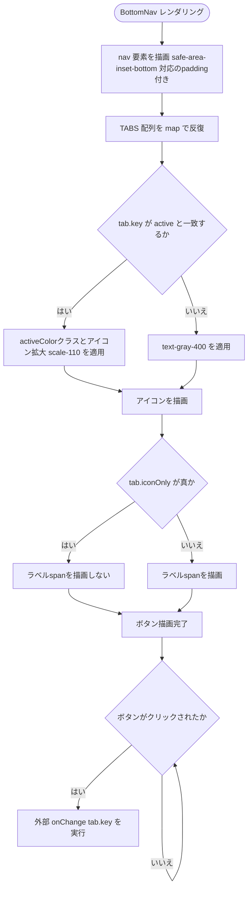
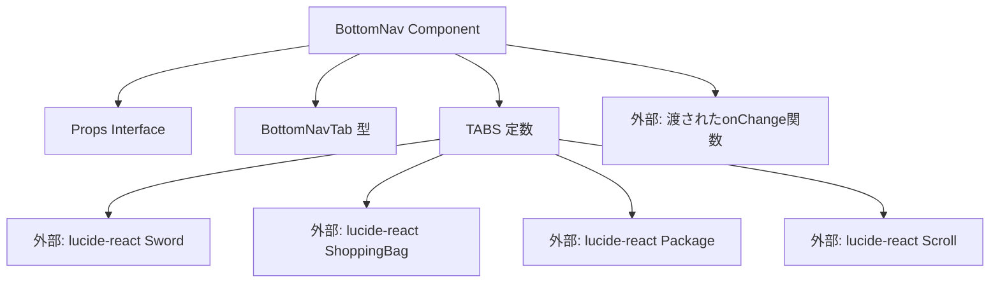

## 1. 解析メタ情報

| 項目 | 内容 |
| --- | --- |
| 対象ファイル | BottomNav.tsx |
| 言語 | React (TypeScript) |
| 解析対象 | 提供されたコードのみ |
| 推測・補完 | 一切なし |

## 関連ドキュメント

* [../../../App.md](../../../App.md) - 本コンポーネントおよび`BottomNavTab`型を呼び出している側

## 2. ファイルの概要

画面下部に固定表示されるフッターナビゲーションを提供するコンポーネントである。「クエスト」「ごほうび」「もちもの」「記録」の4タブで構成され、そのうち先頭3タブ（クエスト/ごほうび/もちもの）はラベルを非表示にしてアイコンのみで表示し、「記録」タブのみラベルも表示する。ファイル内のコメントによれば、これは以前存在した「上部stickyタブ＋ヘッダーの記録ボタン」という二重のナビゲーション構造を廃止し、フッター1本の4タブ構成に統一した実装であるとされている。

* 根拠: `const TABS: { key: BottomNavTab; label: string; icon: React.ElementType; activeColor: string; iconOnly?: boolean }[] = [\n    { key: 'quest', label: 'クエスト', icon: Sword, activeColor: 'text-blue-400', iconOnly: true },\n    { key: 'shop', label: 'ごほうび', icon: ShoppingBag, activeColor: 'text-orange-400', iconOnly: true },\n    { key: 'inventory', label: 'もちもの', icon: Package, activeColor: 'text-green-400', iconOnly: true },\n    { key: 'familyLog', label: '記録', icon: Scroll, activeColor: 'text-purple-400' },\n];` (行番号: 13〜18)
* 根拠: `// 角度⑦: 縦画面での「上部stickyタブ(クエスト/ごほうび)」+「ヘッダーの記録ボタン」という\n// 二重のナビゲーション構造を廃止し、フッター1本の4タブに統一する。` (行番号: 20〜21)
* 根拠: `{!tab.iconOnly && {tab.label}}` (行番号: 39)

## 3. 外部依存関係

### インポート一覧

| 名称 | 種類 | 用途 | 根拠 |
| --- | --- | --- | --- |
| React | モジュール | Reactコンポーネント定義 | 根拠: `import React from 'react';` (行番号: 1) |
| Sword, ShoppingBag, Package, Scroll | アイコンコンポーネント | 各タブ（クエスト/ごほうび/もちもの/記録）のアイコン表示 | 根拠: `import { Sword, ShoppingBag, Package, Scroll } from 'lucide-react';` (行番号: 2) |

### ブラックボックスとなる外部要素

| 名称 | 理由 | 根拠 |
| --- | --- | --- |
| lucide-react | `Sword`/`ShoppingBag`/`Package`/`Scroll`各アイコンの具体的な描画仕様は外部ライブラリの実装に依存し不明 | 根拠: `import { Sword, ShoppingBag, Package, Scroll } from 'lucide-react';` (行番号: 2) |

## 4. 主要要素の定義（関数 / エンドポイント / コンポーネント）

### `BottomNavTab` (型定義)

* **役割**: ナビゲーションのタブキーを表す文字列リテラル型。`'quest' | 'shop' | 'inventory' | 'familyLog'`の4値。
* 根拠: `export type BottomNavTab = 'quest' | 'shop' | 'inventory' | 'familyLog';` (行番号: 4)

### `Props`

* **役割**: `BottomNav`が受け取るプロパティの型定義。現在アクティブなタブ(`active`)と、タブ変更時のコールバック(`onChange`)を受け取る。
* 根拠: `interface Props {\n    active: BottomNavTab;\n    onChange: (tab: BottomNavTab) => void;\n}` (行番号: 6〜9)

* **引数/リクエスト**: 該当なし（型定義のため）
* 根拠: `interface Props {` (行番号: 6)

* **戻り値/レスポンス**: 該当なし（型定義のため）
* 根拠: `interface Props {` (行番号: 6)

* **副作用**: なし
* 根拠: `interface Props {` (行番号: 6〜9)

* **エラーハンドリング**: なし
* 根拠: `interface Props {` (行番号: 6〜9)

### `TABS` (モジュールレベル定数)

* **役割**: 描画する4タブそれぞれの`key`（識別子）、`label`（表示ラベル）、`icon`（アイコンコンポーネント）、`activeColor`（アクティブ時の文字色クラス）、`iconOnly`（アイコンのみ表示するか）を定義した配列。
* 根拠: `const TABS: { key: BottomNavTab; label: string; icon: React.ElementType; activeColor: string; iconOnly?: boolean }[] = [` (行番号: 13〜18)

* **引数/リクエスト**: 該当なし（モジュールレベル定数のため）
* **戻り値/レスポンス**: 該当なし（モジュールレベル定数のため）
* **副作用**: なし
* **エラーハンドリング**: なし
* 根拠: `const TABS: { ... }[] = [` (行番号: 13〜18)

### `BottomNav`

* **役割**: `TABS`定数を`map`で反復し、各タブをボタンとして描画する。`active`propと一致するタブには`activeColor`クラスとアイコンの拡大表示（`scale-110`）を適用し、`iconOnly`が真のタブではラベル``を描画しない。各ボタンのクリック時に`onChange(tab.key)`を呼び出す。
* 根拠: `const BottomNav: React.FC<Props> = ({ active, onChange }) => {` (行番号: 22〜45)

* **引数/リクエスト**: `Props`型（`{ active: BottomNavTab; onChange: (tab: BottomNavTab) => void }`）
* 根拠: `({ active, onChange })` (行番号: 22)

* **戻り値/レスポンス**: `JSX.Element`（`<nav>`要素、4つの`<button>`を含む）
* 根拠: `return (\n        <nav` (行番号: 23〜24)

* **副作用**: タブボタンのクリック時に、propsとして渡された`onChange`関数を呼び出す
* 根拠: `onClick={() => onChange(tab.key)}` (行番号: 34)

* **エラーハンドリング**: なし
* 根拠: ファイル内に`try-catch`やエラー制御の記述なし (行番号: 22〜45)

## 5. 処理フロー図

## 6. 依存関係図

## 7. 次のステップ（リバースエンジニアリングの提案）

| 優先度 | ファイル名(推測可) | 理由 | 根拠 |
| --- | --- | --- | --- |
| 高 | `../../../App.tsx` | `active`/`onChange`propsに実際どのような値・関数が渡されているか（タブ切り替え時に何の画面が表示されるか）を確認するため。 | 根拠: 本ファイル単体では呼び出し元は不明 |

## 8. 保守上の注意点

* タブの並び順・表示内容（ラベルの有無を含む）は`TABS`定数の配列順にそのまま依存しており、タブを追加・削除・並び替える場合はこの配列を編集するだけでよい設計になっている。
* 根拠: `const TABS: { ... }[] = [` (行番号: 13〜18)
* 「クエスト」「ごほうび」「もちもの」の3タブは`iconOnly: true`によりラベルが非表示だが、「記録」タブのみ`iconOnly`が指定されておらず（`undefined`）ラベルが表示される。タブ間で表示仕様が統一されていない点に注意が必要。
* 根拠: `{ key: 'quest', ... iconOnly: true },` (行番号: 14), `{ key: 'familyLog', label: '記録', icon: Scroll, activeColor: 'text-purple-400' },` (行番号: 17)
* `nav`要素には`env(safe-area-inset-bottom)`によるセーフエリア対応のpaddingが指定されており、ノッチ・ホームインジケーター付きデバイスを想定した実装になっている。
* 根拠: `style={{ paddingBottom: 'env(safe-area-inset-bottom)' }}` (行番号: 26)
* コメントによれば、以前は「上部stickyタブ」と「ヘッダーの記録ボタン」という別のナビゲーション構造が存在していたとされており、本コンポーネントへの統一に伴い、それらの旧実装が別ファイル（ヘッダー等）に残存していないか確認が必要。
* 根拠: `// 角度⑦: 縦画面での「上部stickyタブ(クエスト/ごほうび)」+「ヘッダーの記録ボタン」という\n// 二重のナビゲーション構造を廃止し、フッター1本の4タブに統一する。` (行番号: 20〜21)

## 9. 不明事項一覧

| 項目 | 理由 | 必要なファイル |
| --- | --- | --- |
| `active`/`onChange`に実際渡される値・処理内容（タブ切り替え時にどの画面コンポーネントが表示されるか） | 本ファイルはpropsの受け取り側のみであり、呼び出しコンテキストは含まれていないため | `../../../App.tsx` |
| 旧「上部stickyタブ」「ヘッダーの記録ボタン」実装が他ファイルに残存しているか | 本ファイルのコメント内で言及されているのみで、他ファイルの現状は確認できないため | `../../../App.tsx`, `./Header.tsx` |

## 相互参照による補足情報

| 元の不明事項 | 判明した内容 | 参照元ドキュメント |
| --- | --- | --- |
| `active`/`onChange`に実際渡される値・処理内容（タブ切り替え時にどの画面コンポーネントが表示されるか） | `family-quest/src/App.tsx`を直接確認した。`BottomNav`は`layoutMode === 'portrait'`の場合のみレンダリングされ(479〜484行目)、`active={viewMode === 'familyLog' ? 'familyLog' : activeTab}`（`viewMode`は`'main'|'familyLog'`、`activeTab`は`'quest'|'shop'|'inventory'`の状態）、`onChange={handleBottomNavChange}`が渡される。`handleBottomNavChange(tab: BottomNavTab)`(352〜360行目)は`play('tap')`を鳴らしたうえで、`tab === 'familyLog'`なら`setViewMode('familyLog')`（`FamilyLog`コンポーネントが描画される）、それ以外は`setViewMode('main')`かつ`setActiveTab(tab)`とし、`quest`/`shop`/`inventory`いずれかのタブに応じて`QuestList`/`RewardShop`/`InventoryList`が縦画面メイン領域(443〜468行目)に切り替え表示される。 | 直接ソース確認: `family-quest/src/App.tsx:352-360, 443-484` |
| 旧「上部stickyタブ」「ヘッダーの記録ボタン」実装が他ファイルに残存しているか | `family-quest/src/App.tsx`(全526行)および`family-quest/src/components/layout/Header.tsx`(全176行)を直接確認したが、いずれのファイルにも「上部stickyタブ」に相当するsticky配置のタブUIや、`BottomNav`とは別に独立した「記録」ボタンの実装は見つからなかった。`Header.tsx`にはユーザー切替行(94〜134行目)・記録ボタン(`onLogSwitch`、142〜168行目、`hideLogSwitcher`propで縦画面時は非表示)・ホームボタン(69〜91行目、`showBackToMain`prop)が存在するが、いずれも現行の統一ナビゲーション設計(コメント12〜14, 16〜18, 19〜22行目)の一部として実装されており、旧構造の残存コードは確認できなかった。 | 直接ソース確認: `family-quest/src/App.tsx:1-526`, `family-quest/src/components/layout/Header.tsx:1-176` |

## 10. 自己検証結果

* [x] 推測・外部ファイルの仕様を一切含んでいない
* [x] 全関数・全クラス・全コンポーネントを列挙した
* [x] 全てのインポート要素を列挙した
* [x] すべての仕様説明に「根拠（行番号・抜粋）」を明記した
* [x] 根拠漏れが0件である
* [x] Mermaid構文にエラーの原因となる記号（エスケープ漏れ）がない
* [x] 不明事項を漏れなく列挙した
