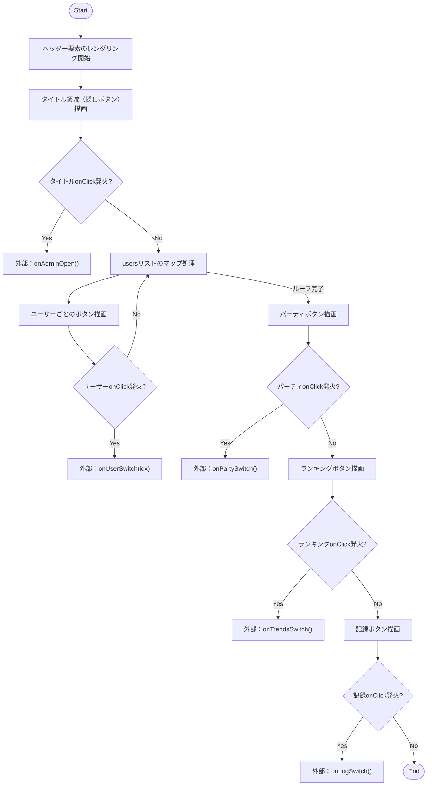
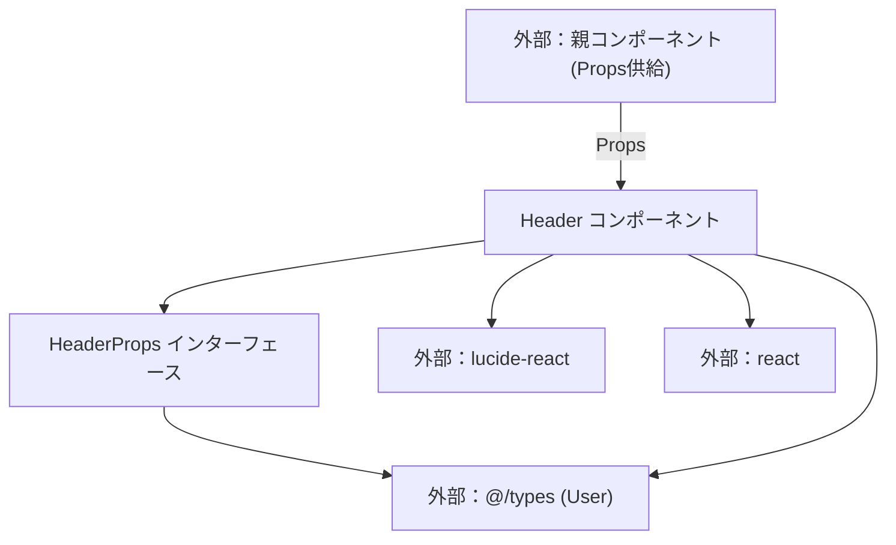

## 1. 解析メタ情報

| 項目 | 内容 |
| --- | --- |
| 対象ファイル | Header.tsx |
| 言語 | React (TypeScript) |
| 解析対象 | 提供されたコードのみ |
| 推測・補完 | 一切なし |

## 2. ファイルの概要

* ユーザー切り替え、パーティ表示、ランキング（トレンド）表示、および記録表示のナビゲーション機能を持つヘッダーUIを提供する。
* タイトル部分に隠しボタンとして管理画面（Admin）を開くためのトリガーが組み込まれている。
* コンポーネント自身は状態（State）を持たず、親から渡されたProps（表示データおよびコールバック関数）に基づいてレンダリングを行う純粋なプレゼンテーションコンポーネントである。

## 3. 外部依存関係

### インポート一覧

| 名称 | 種類 | 用途 | 根拠 |
| --- | --- | --- | --- |
| `React` | ライブラリ | Reactコンポーネントの定義 | `import React from 'react';` (行番号: 1) |
| `User` | 型定義 | Props内でユーザーデータの型を指定 | `import { User } from '@/types';` (行番号: 2) |
| `Users` | アイコンコンポーネント | パーティボタンのアイコンとして描画 | `import { Users, Scroll, TrendingUp } from 'lucide-react';` (行番号: 3) |
| `Scroll` | アイコンコンポーネント | 記録ボタンのアイコンとして描画 | `import { Users, Scroll, TrendingUp } from 'lucide-react';` (行番号: 3) |
| `TrendingUp` | アイコンコンポーネント | ランキングボタンのアイコンとして描画 | `import { Users, Scroll, TrendingUp } from 'lucide-react';` (行番号: 3) |

### ブラックボックスとなる外部要素

| 名称 | 理由 | 根拠 |
| --- | --- | --- |
| `User` (from `@/types`) | 外部ファイルで定義されており、プロパティの全容（`user_id`, `name`, `avatar`, `icon`以外に何を持つか）が本ファイルからは判断不可。 | `import { User } from '@/types';` (行番号: 2) |
| 各種コールバック関数の処理内容 | 親コンポーネントから渡される関数であり、実行時に具体的にどのような処理（API呼び出しやルーティングなど）が行われるか判断不可。 | `onClick={onAdminOpen}` など各コールバック呼び出し (行番号: 32, 48, 88, 112, 138) |

## 4. 主要要素の定義（関数 / エンドポイント / コンポーネント）

### `HeaderProps`

* **役割**: `Header` コンポーネントが受け取るプロパティの型定義。
* 根拠: `interface HeaderProps {` (行番号: 5〜14 / 抜粋: "interface HeaderProps {")

* **プロパティ一覧**:
* `users`: `User[]`
* `currentUserIdx`: `number`
* `viewMode`: `'user' | 'party' | 'familyLog' | 'trends'`
* `onUserSwitch`: `(idx: number) => void`
* `onPartySwitch`: `() => void`
* `onLogSwitch`: `() => void`
* `onTrendsSwitch`: `() => void`
* `onAdminOpen`: `() => void`

### `Header`

* **役割**: ナビゲーションおよびタイトルを含むヘッダーUIのレンダリング。
* 根拠: `const Header: React.FC<HeaderProps> = ({...}) => { return (<header...` (行番号: 16〜162 / 抜粋: "const Header: React.FC<Heade...")

* **引数/リクエスト**: `HeaderProps` で定義されたプロパティのオブジェクト
* 根拠: `const Header: React.FC<HeaderProps> = ({ users, currentUserIdx, ... })` (行番号: 16〜25 / 抜粋: "const Header: React.FC<Heade...")

* **戻り値/レスポンス**: JSX要素 (`<header>` タグをルートとするReact要素)
* 根拠: `return ( <header className="bg-gradient-to-b...` (行番号: 26〜161 / 抜粋: "return ( <header classNa...")

* **副作用**: なし
* 根拠: コンポーネント内に `useEffect` 等のフックや、外部状態を直接変更する処理が存在しない。 (行番号: 26〜161 / 抜粋: "return (")

* **エラーハンドリング**: なし
* 根拠: 例外を捕捉する `try-catch` ブロックやエラーバウンダリが存在しない。 (行番号: 16〜162 / 抜粋: "const Header: React.FC<Heade...")

## 5. 処理フロー図

## 6. 依存関係図

## 7. 次のステップ（リバースエンジニアリングの提案）

| 優先度 | ファイル名(推測可) | 理由 | 根拠 |
| --- | --- | --- | --- |
| 高 | `@/types` (または `types.ts` 等) | `User`オブジェクトの詳細な構造（プロパティの一覧と型）を把握するため。 | `import { User } from '@/types';` (行番号: 2) |
| 高 | 親コンポーネント (例: `App.tsx`, `Layout.tsx` 等) | 各種コールバック関数(`onAdminOpen`, `onUserSwitch`等)の実装ロジックおよび状態管理(State)の仕組みを特定するため。 | Propsとして各種コールバックを受け取っているため (行番号: 9〜13) |

## 8. 保守上の注意点

* `users.map` 内でユーザーのアイコンを表示する際、`user.avatar && user.avatar.startsWith('/')` という判定を用いている。`user.avatar` が文字列以外であった場合にランタイムエラーを防ぐ短絡評価が含まれているが、型定義上 `avatar` が文字列であることが保証されているかは不明。
* 各コールバック（`onAdminOpen`, `onPartySwitch` など）はオプショナルチェーンなしで直接実行されている（例: `onClick={onAdminOpen}`）。親コンポーネントから関数が渡されなかった場合（TypeScriptの型定義上は必須だが、JSとして実行された場合）、実行時エラーとなる。

## 9. 不明事項一覧

| 項目 | 理由 | 必要なファイル |
| --- | --- | --- |
| `User` 型の正確な定義 | `user_id`, `name`, `avatar`, `icon` が使われていることはコードから読み取れるが、その他のプロパティの有無が不明なため。 | `@/types` |
| コールバック実行後の実際の挙動 | 本コンポーネントは表示のみを担当しており、ルーティングの変更やデータフェッチ等の具体的なアクションが不明なため。 | このコンポーネントを呼び出している親ファイル |

## 10. 自己検証結果

* [x] 推測・外部ファイルの仕様を一切含んでいない
* [x] 全関数・全クラス・全コンポーネントを列挙した
* [x] 全てのインポート要素を列挙した
* [x] すべての仕様説明に「根拠（行番号・抜粋）」を明記した
* [x] 根拠漏れが0件である
* [x] Mermaid構文にエラーの原因となる記号（エスケープ漏れ）がない
* [x] 不明事項を漏れなく列挙した
* [x] 完了