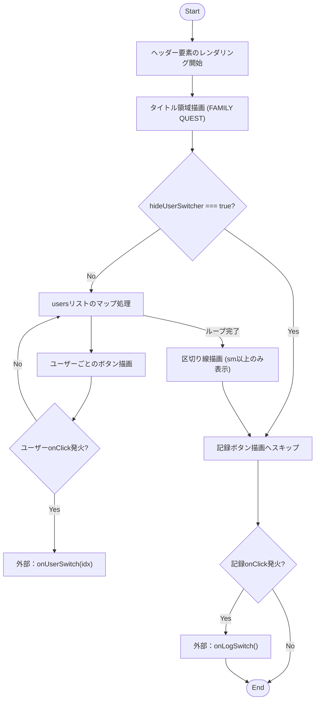

## 1. 解析メタ情報

| 項目 | 内容 |
| --- | --- |
| 対象ファイル | Header.tsx |
| 言語 | React (TypeScript) |
| 解析対象 | 提供されたコードのみ |
| 推測・補完 | 一切なし |

## 2. ファイルの概要

* ユーザー切り替えおよび記録（家族の年代記）表示への切り替えナビゲーション機能を持つヘッダーUIを提供する。
* `hideUserSwitcher`propが真の場合、ユーザー切替行全体を省略し、タイトルと記録ボタンのみを表示する。横画面（4人常時表示レイアウト）では各ユーザーのアバターが既にメイン画面のパネルに常時表示されているため、ヘッダー側のユーザー切替行が冗長になることに対応したものである。
* コンポーネント自身は状態（State）を持たず、親から渡されたProps（表示データおよびコールバック関数）に基づいてレンダリングを行う純粋なプレゼンテーションコンポーネントである。
* 根拠: `hideUserSwitcher`の説明コメントと使用箇所 (11〜14, 40行目 / 抜粋: "// 横画面(4人常時表示レイアウト)では、各ユーザーのアバターは既にメイン画面の\n// パネルに常時表示されているため、ヘッダー側のユーザー切替行は冗長になる。", "{!hideUserSwitcher && users.map((user, idx) => {")

## 3. 外部依存関係

### インポート一覧

| 名称 | 種類 | 用途 | 根拠 |
| --- | --- | --- | --- |
| `React` | ライブラリ | Reactコンポーネントの定義 | `import React from 'react';` (行番号: 1) |
| `User` | 型定義 | Props内でユーザーデータの型を指定 | `import { User } from '@/types';` (行番号: 2) |
| `Scroll` | アイコンコンポーネント | 記録ボタンのアイコンとして描画 | `import { Scroll } from 'lucide-react';` (行番号: 3) |

### ブラックボックスとなる外部要素

| 名称 | 理由 | 根拠 |
| --- | --- | --- |
| `User` (from `@/types`) | 外部ファイルで定義されており、プロパティの全容（`user_id`, `name`, `avatar`, `icon`以外に何を持つか）が本ファイルからは判断不可。 | `import { User } from '@/types';` (行番号: 2) |
| 各種コールバック関数の処理内容 | 親コンポーネントから渡される関数であり、実行時に具体的にどのような処理（API呼び出しやルーティングなど）が行われるか判断不可。 | `onClick={() => onUserSwitch(idx)}` (行番号: 45), `onClick={onLogSwitch}` (行番号: 89) |

## 4. 主要要素の定義（関数 / エンドポイント / コンポーネント）

### `HeaderProps`

* **役割**: `Header` コンポーネントが受け取るプロパティの型定義。
* 根拠: `interface HeaderProps {` (行番号: 5〜15 / 抜粋: "interface HeaderProps {")

* **プロパティ一覧**:
* `users`: `User[]`
* `currentUserIdx`: `number`
* `viewMode`: `'user' | 'familyLog'`
* `onUserSwitch`: `(idx: number) => void`
* `onLogSwitch`: `() => void`
* `hideUserSwitcher`: `boolean`（オプショナル。真の場合、ユーザー切替行を省略しタイトルと記録ボタンのみを表示する）
* 根拠: 6〜14行目 / 抜粋: "interface HeaderProps {\n    users: User[];\n    currentUserIdx: number;\n    viewMode: 'user' | 'familyLog';\n    onUserSwitch: (idx: number) => void;\n    onLogSwitch: () => void;\n    ...\n    hideUserSwitcher?: boolean;\n}"

### `Header`

* **役割**: ナビゲーション（ユーザー切替＋記録ボタン）およびタイトルを含むヘッダーUIのレンダリング。`hideUserSwitcher`が真の場合はユーザー切替のボタン群とその区切り線を描画しない。
* 根拠: `const Header: React.FC<HeaderProps> = ({...}) => { return (<header...` (行番号: 17〜119 / 抜粋: "const Header: React.FC<HeaderProps> = ({")

* **引数/リクエスト**: `HeaderProps` で定義されたプロパティのオブジェクト
* 根拠: `const Header: React.FC<HeaderProps> = ({ users, currentUserIdx, viewMode, onUserSwitch, onLogSwitch, hideUserSwitcher })` (行番号: 17〜24 / 抜粋: "const Header: React.FC<HeaderProps> = ({")

* **戻り値/レスポンス**: JSX要素 (`<header>` タグをルートとするReact要素)
* 根拠: `return ( <header className="bg-gradient-to-b...` (行番号: 25〜116 / 抜粋: "return (\n        <header className=\"bg-gradient-to-b from-gray-900 to-black")

* **副作用**: なし
* 根拠: コンポーネント内に `useEffect` 等のフックや、外部状態を直接変更する処理が存在しない。 (行番号: 17〜117)

* **エラーハンドリング**: なし
* 根拠: 例外を捕捉する `try-catch` ブロックやエラーバウンダリが存在しない。 (行番号: 17〜119)

## 5. 処理フロー図

```mermaid
flowchart TD
    Start([Start]) --> RenderHeader["ヘッダー要素のレンダリング開始"]
    RenderHeader --> RenderTitle["タイトル領域描画 (FAMILY QUEST)"]

    RenderTitle --> CheckHide{"hideUserSwitcher === true?"}
    CheckHide -- Yes --> RenderLogBtn["記録ボタン描画へスキップ"]
    CheckHide -- No --> LoopUsers["usersリストのマップ処理"]

    LoopUsers --> RenderUserBtn["ユーザーごとのボタン描画"]
    RenderUserBtn --> UserClick{"ユーザーonClick発火?"}
    UserClick -- Yes --> UserSwitch["外部：onUserSwitch(idx)"]
    UserClick -- No --> LoopUsers

    LoopUsers -- ループ完了 --> RenderDivider["区切り線描画 (sm以上のみ表示)"]
    RenderDivider --> RenderLogBtn

    RenderLogBtn --> LogClick{"記録onClick発火?"}
    LogClick -- Yes --> LogSwitch["外部：onLogSwitch()"]
    LogClick -- No --> End([End])
    LogSwitch --> End

```

## 6. 依存関係図

```mermaid
graph TD
    Header["Header コンポーネント"]
    HeaderProps["HeaderProps インターフェース"]
    Types_User["外部：@/types (User)"]
    Lucide["外部：lucide-react (Scroll)"]
    React["外部：react"]
    Parent["外部：親コンポーネント (Props供給)"]

    Header --> HeaderProps
    HeaderProps --> Types_User
    Header --> Types_User
    Header --> Lucide
    Header --> React
    Parent -->|Props (hideUserSwitcherを含む)| Header

```

## 7. 次のステップ（リバースエンジニアリングの提案）

| 優先度 | ファイル名(推測可) | 理由 | 根拠 |
| --- | --- | --- | --- |
| 高 | `@/types` (または `types.ts` 等) | `User`オブジェクトの詳細な構造（プロパティの一覧と型）を把握するため。 | `import { User } from '@/types';` (行番号: 2) |
| 高 | `App.tsx` | `hideUserSwitcher`propの渡し方（`layoutMode === 'landscape'`との連動）や、`onUserSwitch`/`onLogSwitch`の実装ロジックを特定するため。 | Propsとして各種コールバックを受け取っているため (行番号: 5〜15) |
| 中 | `./hooks/useLayoutMode.ts` | `hideUserSwitcher`が真になる条件（横画面判定）の詳細を把握するため。 | `App.tsx`側で`hideUserSwitcher={layoutMode === 'landscape'}`として渡されている（`Header.tsx`単体からは不明） |

## 8. 保守上の注意点

* `users.map` 内でユーザーのアイコンを表示する際、`user.avatar && user.avatar.startsWith('/')` という判定を用いている（56行目）。`user.avatar` が文字列以外であった場合にランタイムエラーを防ぐ短絡評価が含まれているが、型定義上 `avatar` が文字列であることが保証されているかは不明。
* `hideUserSwitcher`はオプショナル（`hideUserSwitcher?: boolean;`）であり、未指定時は`undefined`となる。`!hideUserSwitcher`による判定（40, 83行目）のため、`undefined`は「ユーザー切替行を表示する」（従来どおり）として扱われる。
* 根拠: (14, 40, 83行目 / 抜粋: "hideUserSwitcher?: boolean;", "{!hideUserSwitcher && users.map((user, idx) => {", "{!hideUserSwitcher && (")
* かつて存在した`onAdminOpen`（隠しボタンによる管理画面起動）、`onPartySwitch`/`onTrendsSwitch`（パーティ・週間ランキング画面切替）に対応するProps・UI要素は本ファイルには存在しない。

## 9. 不明事項一覧

| 項目 | 理由 | 必要なファイル |
| --- | --- | --- |
| `User` 型の正確な定義 | `user_id`, `name`, `avatar`, `icon` が使われていることはコードから読み取れるが、その他のプロパティの有無が不明なため。 | `@/types` |
| コールバック実行後の実際の挙動 | 本コンポーネントは表示のみを担当しており、ルーティングの変更やデータフェッチ等の具体的なアクションが不明なため。 | このコンポーネントを呼び出している親ファイル |
| `hideUserSwitcher`が渡される条件の詳細 | 本ファイル単体では「横画面(4人常時表示レイアウト)」という利用意図がコメントで示されているのみで、具体的な判定条件（ビューポート幅等）は不明なため。 | 呼び出し元 (`App.tsx`)、`./hooks/useLayoutMode.ts` |

## 10. 自己検証結果

* [x] 完了: 推測・外部ファイルの仕様を一切含んでいない
* [x] 完了: 全関数・全クラス・全コンポーネントを列挙した
* [x] 完了: 全てのインポート要素を列挙した
* [x] 完了: すべての仕様説明に「根拠（行番号・抜粋）」を明記した
* [x] 完了: 根拠漏れが0件である
* [x] 完了: Mermaid構文にエラーの原因となる記号（エスケープ漏れ）がない
* [x] 完了: 不明事項を漏れなく列挙した
