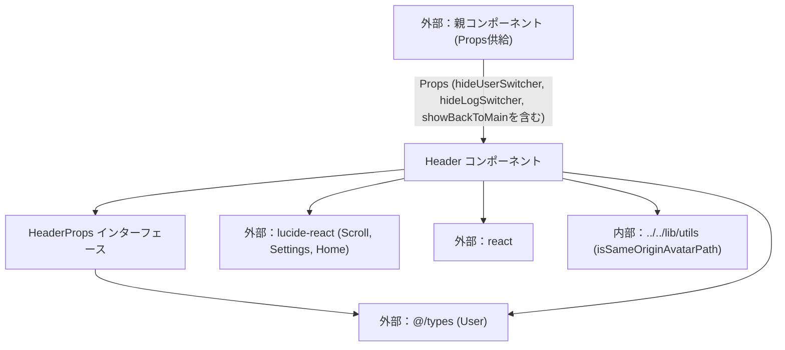

## 1. 解析メタ情報

| 項目 | 内容 |
| --- | --- |
| 対象ファイル | Header.tsx |
| 言語 | React (TypeScript) |
| 解析対象 | 提供されたコードのみ |
| 推測・補完 | 一切なし |
| 解析基準コミット | `53f4ba8` |

## 関連ドキュメント

* [../../../App.md](../../../App.md) - 呼び出し元。`hideUserSwitcher`/`hideLogSwitcher`/`showBackToMain`/`onBackToMain`等のPropsを供給する
* [../../types/index.md](../../types/index.md) - `User`型の定義元
* [../../hooks/useLayoutMode.md](../../hooks/useLayoutMode.md) - `hideUserSwitcher`/`hideLogSwitcher`/`showBackToMain`が真になる条件（`layoutMode`）の判定元
* [../../lib/utils.md](../../lib/utils.md) - `isSameOriginAvatarPath`関数の実装元（プロトコル相対URLバイパスのバグ修正、M-9-5で新規に参照するようになった）

## 2. ファイルの概要

* ユーザー切り替え、記録（家族の年代記）表示への切り替え、およびホーム（メイン画面）への復帰ナビゲーション機能を持つヘッダーUIを提供する。
* `hideUserSwitcher`propが真の場合、ユーザー切替行を省略する。横画面（4人常時表示レイアウト）では各ユーザーのアバターが既にメイン画面のパネルに常時表示されているため、ヘッダー側のユーザー切替行が冗長になることに対応したものである。
* `hideLogSwitcher`propが真の場合、記録ボタンを省略する。縦画面ではフッターナビ（`BottomNav`）に「記録」タブが統合されたため、ヘッダー側の記録ボタンが二重導線になることに対応したものである。
* `showBackToMain`propが真の場合、ユーザー切替行の代わりに単一の「ホーム」ボタンを表示する。横画面（4人並び）で記録画面を表示中に、ユーザー切替行をそのまま出すと「ホームに戻る」という意図が伝わらなかったバグの修正として追加された。
* コンポーネント自身は状態（State）を持たず、親から渡されたProps（表示データおよびコールバック関数）に基づいてレンダリングを行う純粋なプレゼンテーションコンポーネントである。
* 根拠: `hideUserSwitcher`/`hideLogSwitcher`/`showBackToMain`の説明コメントと使用箇所 (13〜24, 70, 95, 143行目 / 抜粋: "// 横画面(4人常時表示レイアウト)では、各ユーザーのアバターは既にメイン画面の\n    // パネルに常時表示されているため、ヘッダー側のユーザー切替行は冗長になる。", "{showBackToMain && (", "{!hideUserSwitcher && users.map((user, idx) => {", "{!hideLogSwitcher && (")
* ユーザーアバターの表示可否判定には`isSameOriginAvatarPath(user.avatar)`（`lib/utils.ts`からインポート）を用いる。以前の`user.avatar && user.avatar.startsWith('/')`という判定は、プロトコル相対URL（`"//evil.example/x"`）もマッチしてしまい、外部ホストの画像に差し替えられる可能性があるバグ（M-9-5）だったため、`"//"`で始まるものを明示的に除外する共通ヘルパーに置き換えられた。
* 根拠: `isSameOriginAvatarPath`のインポートと使用 (4, 111行目 / 抜粋: "import { isSameOriginAvatarPath } from '../../lib/utils';", "{isSameOriginAvatarPath(user.avatar) ? (")
* **[修正済み] トグル系ボタンへの`aria-pressed`付与（Issue #412 F-L5）**: ホームボタン（`showBackToMain`）・ユーザー切替ボタン・記録ボタンはいずれも「選択中/非選択」という状態を持つトグルだが、以前は視覚的なスタイル（`scale`/枠線色等）でしか状態を表現しておらず、スクリーンリーダー利用者には選択状態が伝わらなかった。各ボタンに`aria-pressed`（それぞれ`viewMode === 'user'`/`isActive`/`viewMode === 'familyLog'`）と`aria-label`（見た目のテキストと同じ内容だが、アイコン+バッジのレイアウトのため明示）を追加した。
* 根拠: (行番号: 78〜79, 108〜109, 155〜156 / 抜粋: "aria-pressed={viewMode === 'user'}", "aria-pressed={isActive}", "aria-pressed={viewMode === 'familyLog'}")

## 3. 外部依存関係

### インポート一覧

| 名称 | 種類 | 用途 | 根拠 |
| --- | --- | --- | --- |
| `React` | ライブラリ | Reactコンポーネントの定義 | `import React from 'react';` (行番号: 1) |
| `User` | 型定義 | Props内でユーザーデータの型を指定 | `import { User } from '@/types';` (行番号: 2) |
| `Scroll`, `Settings`, `Home` | アイコンコンポーネント | 記録ボタン(`Scroll`)、表示設定ボタン(`Settings`)、ホームボタン(`Home`)のアイコンとして描画 | `import { Scroll, Settings, Home } from 'lucide-react';` (行番号: 3) |
| `isSameOriginAvatarPath` | 関数 | ユーザーアバターのURLが自サーバーの相対パスかどうかを判定する（`"//"`始まりのプロトコル相対URLを除外、M-9-5バグ修正で追加） | `import { isSameOriginAvatarPath } from '../../lib/utils';` (行番号: 4) |

### ブラックボックスとなる外部要素

| 名称 | 理由 | 根拠 |
| --- | --- | --- |
| `User` (from `@/types`) | 外部ファイルで定義されており、プロパティの全容（`user_id`, `name`, `avatar`以外に何を持つか）が本ファイルからは判断不可。**（Issue #390）** 以前参照していた`user.icon`はバックエンドが送出しない幽霊フィールド（常に`undefined`）だったため参照を削除し、アバターの絵文字フォールバックは`user.avatar \|\| '🙂'`のみになった。 | `import { User } from '@/types';` (行番号: 2), `{user.avatar \|\| '🙂'}` (行番号: 115) |
| 各種コールバック関数の処理内容 | 親コンポーネントから渡される関数であり、実行時に具体的にどのような処理（API呼び出しやルーティングなど）が行われるか判断不可。 | `onClick={() => onUserSwitch(idx)}` (行番号: 100), `onClick={onLogSwitch}` (行番号: 145), `onClick={onSettingsClick}` (行番号: 46), `onClick={onBackToMain}` (行番号: 72) |

## 4. 主要要素の定義（関数 / エンドポイント / コンポーネント）

### `HeaderProps`

* **役割**: `Header` コンポーネントが受け取るプロパティの型定義。
* 根拠: `interface HeaderProps {` (行番号: 6〜26 / 抜粋: "interface HeaderProps {")

* **プロパティ一覧**:
* `users`: `User[]`
* `currentUserIdx`: `number`
* `viewMode`: `'user' | 'familyLog'`
* `onUserSwitch`: `(idx: number) => void`
* `onLogSwitch`: `() => void`
* `onSettingsClick`: `() => void`
* `hideUserSwitcher`: `boolean`（オプショナル。真の場合、ユーザー切替行を省略する）
* `hideLogSwitcher`: `boolean`（オプショナル。真の場合、記録ボタンを省略する）
* `showBackToMain`: `boolean`（オプショナル。真の場合、ユーザー切替行の代わりに「ホーム」ボタンを表示する）
* `onBackToMain`: `() => void`（オプショナル。「ホーム」ボタンクリック時に呼ばれる）
* 根拠: 7〜25行目 / 抜粋: "interface HeaderProps {\n    users: User[];\n    currentUserIdx: number;\n    viewMode: 'user' | 'familyLog';\n    onUserSwitch: (idx: number) => void;\n    onLogSwitch: () => void;\n    onSettingsClick: () => void;\n    ...\n    hideUserSwitcher?: boolean;\n    ...\n    hideLogSwitcher?: boolean;\n    ...\n    showBackToMain?: boolean;\n    onBackToMain?: () => void;\n}"

### `Header`

* **役割**: ナビゲーション（ホームボタン＋ユーザー切替＋記録ボタン）、表示設定ボタン、タイトルを含むヘッダーUIのレンダリング。**（Issue #412 F-L9で修正）** タイトル「FAMILY QUEST」の`fontFamily`から`"Press Start 2P"`を削除した。このフォントはGoogle Fonts等の読込設定がどこにも存在せず一度も読み込まれておらず、実際には常に次点の`cursive`フォールバックで描画され続けていた「死んだ指定」だったため、実際に使われているフォールバックのみを書くようにした（見た目に変化はない）。`hideUserSwitcher`が真の場合はユーザー切替のボタン群を、`hideLogSwitcher`が真の場合は記録ボタンを、`showBackToMain`が偽の場合はホームボタンを、それぞれ描画しない。
* 根拠: `const Header: React.FC<HeaderProps> = ({...}) => { return (<header...` (行番号: 28〜174 / 抜粋: "const Header: React.FC<HeaderProps> = ({")

* **引数/リクエスト**: `HeaderProps` で定義されたプロパティのオブジェクト（`users`, `currentUserIdx`, `viewMode`, `onUserSwitch`, `onLogSwitch`, `onSettingsClick`, `hideUserSwitcher`, `hideLogSwitcher`, `showBackToMain`, `onBackToMain`）
* 根拠: (行番号: 28〜39 / 抜粋: "const Header: React.FC<HeaderProps> = ({\n    users,\n    currentUserIdx,\n    viewMode,\n    onUserSwitch,\n    onLogSwitch,\n    onSettingsClick,\n    hideUserSwitcher,\n    hideLogSwitcher,\n    showBackToMain,\n    onBackToMain,\n}) => {")

* **戻り値/レスポンス**: JSX要素 (`<header>` タグをルートとするReact要素)
* 根拠: `return ( <header className="bg-gradient-to-b...` (行番号: 40〜173 / 抜粋: "return (\n        <header className=\"bg-gradient-to-b from-gray-900 to-black")

* **副作用**: なし
* 根拠: コンポーネント内に `useEffect` 等のフックや、外部状態を直接変更する処理が存在しない。 (行番号: 28〜174)

* **エラーハンドリング**: なし
* 根拠: 例外を捕捉する `try-catch` ブロックやエラーバウンダリが存在しない。 (行番号: 28〜174)

## 5. 処理フロー図

```mermaid
flowchart TD
    Start([Start]) --> RenderHeader["ヘッダー要素のレンダリング開始"]
    RenderHeader --> RenderSettingsBtn["表示設定ボタン描画"]
    RenderSettingsBtn --> RenderTitle["タイトル領域描画 (FAMILY QUEST)"]

    RenderTitle --> CheckBackToMain{"showBackToMain === true?"}
    CheckBackToMain -- Yes --> RenderHomeBtn["ホームボタン描画 (viewMode==='user'で強調表示)"]
    CheckBackToMain -- No --> CheckHideUser
    RenderHomeBtn --> CheckHideUser{"hideUserSwitcher === true?"}

    CheckHideUser -- Yes --> CheckDivider["区切り線の描画判定へ"]
    CheckHideUser -- No --> LoopUsers["usersリストのマップ処理"]

    LoopUsers --> RenderUserBtn["ユーザーごとのボタン描画"]
    RenderUserBtn --> UserClick{"ユーザーonClick発火?"}
    UserClick -- Yes --> UserSwitch["外部：onUserSwitch(idx)"]
    UserClick -- No --> LoopUsers

    LoopUsers -- ループ完了 --> CheckDivider
    CheckDivider --> DividerCond{"(!hideUserSwitcher または showBackToMain) かつ !hideLogSwitcher ?"}
    DividerCond -- Yes --> RenderDivider["区切り線描画 (sm以上のみ表示)"]
    DividerCond -- No --> CheckHideLog
    RenderDivider --> CheckHideLog{"hideLogSwitcher === true?"}

    CheckHideLog -- Yes --> End([End])
    CheckHideLog -- No --> RenderLogBtn["記録ボタン描画"]

    RenderLogBtn --> LogClick{"記録onClick発火?"}
    LogClick -- Yes --> LogSwitch["外部：onLogSwitch()"]
    LogClick -- No --> End
    LogSwitch --> End

    RenderSettingsBtn --> SettingsClick{"設定ボタンonClick発火?"}
    SettingsClick -- Yes --> SettingsSwitch["外部：onSettingsClick()"]
```

## 6. 依存関係図

```mermaid
graph TD
    Header["Header コンポーネント"]
    HeaderProps["HeaderProps インターフェース"]
    Types_User["外部：@/types (User)"]
    Lucide["外部：lucide-react (Scroll, Settings, Home)"]
    React["外部：react"]
    Utils["内部：../../lib/utils (isSameOriginAvatarPath)"]
    Parent["外部：親コンポーネント (Props供給)"]

    Header --> HeaderProps
    HeaderProps --> Types_User
    Header --> Types_User
    Header --> Lucide
    Header --> React
    Header --> Utils
    Parent -->|"Props (hideUserSwitcher, hideLogSwitcher, showBackToMainを含む)"| Header
```

## 7. 次のステップ（リバースエンジニアリングの提案）

| 優先度 | ファイル名(推測可) | 理由 | 根拠 |
| --- | --- | --- | --- |
| 高 | `@/types` (または `types.ts` 等) | `User`オブジェクトの詳細な構造（プロパティの一覧と型）を把握するため。 | `import { User } from '@/types';` (行番号: 2) |
| 高 | `App.tsx` | `hideUserSwitcher`/`hideLogSwitcher`/`showBackToMain`propの渡し方（`layoutMode`との連動）や、各種コールバックの実装ロジックを特定するため。 | Propsとして各種コールバックを受け取っているため (行番号: 6〜26) |
| 中 | `./hooks/useLayoutMode.ts` | `hideUserSwitcher`/`hideLogSwitcher`/`showBackToMain`が真になる条件（横画面/縦画面判定）の詳細を把握するため。 | `App.tsx`側で`layoutMode`を用いて各propが渡されている（`Header.tsx`単体からは不明） |

## 8. 保守上の注意点

* `users.map` 内でユーザーのアイコンを表示する際、`isSameOriginAvatarPath(user.avatar)`（`lib/utils.ts`の共通ヘルパー）の判定を用いている（111行目）。以前は本ファイル内でインラインに`user.avatar && user.avatar.startsWith('/')`と判定していたが、プロトコル相対URL（`"//evil.example/x"`）も`startsWith('/')`がtrueになり素通りしてしまうバグ（M-9-5）があった。ブラウザは`"//host/path"`を現在のプロトコルでの外部ホストへのリンクとして解決するため、外部ホストの画像に差し替えられる可能性があった（バックエンド側の無認証問題と組み合わさるとLAN内の誰でも設定可能な状態だった）。修正後は`"//"`で始まるものを明示的に除外する`isSameOriginAvatarPath`に置き換えられ、`FamilyLog.tsx`・`UserStatusCard.tsx`の同様の判定箇所とも共通化されている。
* 根拠: (行番号: 4, 111行目 / 抜粋: "import { isSameOriginAvatarPath } from '../../lib/utils';", "{isSameOriginAvatarPath(user.avatar) ? (")
* `hideUserSwitcher`/`hideLogSwitcher`/`showBackToMain`はいずれもオプショナル（`?: boolean;`）であり、未指定時は`undefined`となる。`!hideUserSwitcher`（95行目）、`!hideLogSwitcher`（138, 143行目）による判定のため、`undefined`は「表示する」（従来どおり）として扱われる。一方`showBackToMain`は`&&`による真偽判定（70行目）のため、`undefined`は「ホームボタンを表示しない」扱いになる。
* 根拠: (行番号: 16, 19, 24, 70, 95, 138, 143行目 / 抜粋: "hideUserSwitcher?: boolean;", "hideLogSwitcher?: boolean;", "showBackToMain?: boolean;", "{showBackToMain && (", "{!hideUserSwitcher && users.map((user, idx) => {", "{(!hideUserSwitcher || showBackToMain) && !hideLogSwitcher && (", "{!hideLogSwitcher && ("
* ホームボタンの選択状態表示（強調スタイル）は`viewMode === 'user'`かどうかで切り替わり、`viewMode === 'familyLog'`の間はホームボタンが非選択スタイルになる。以前はスタイルが常に「選択中」固定だったため、記録画面に遷移してもホームボタンだけフォーカスされたままに見えていたバグの修正である。
* 根拠: (行番号: 65〜69, 73〜74行目 / 抜粋: "// ★バグ修正: 以前はスタイルが常に「選択中」固定だったため、記録画面に\n                    // 遷移したあともホームボタンだけフォーカスされたままに見えていた。\n                    // 他のボタン同様、viewMode に応じて選択中/非選択を切り替える", "className={`relative transition-all duration-300 flex flex-col items-center group p-1 ${viewMode === 'user' ? 'scale-110 -translate-y-1 z-10' : 'scale-95 opacity-60 hover:opacity-100 hover:scale-100'\n                            }`}")
* かつて存在した`onAdminOpen`（隠しボタンによる管理画面起動）、`onPartySwitch`/`onTrendsSwitch`（パーティ・週間ランキング画面切替）に対応するProps・UI要素は本ファイルには存在しない。

## 9. 不明事項一覧

| 項目 | 理由 | 必要なファイル |
| --- | --- | --- |
| `User` 型の正確な定義 | `user_id`, `name`, `avatar`, `icon` が使われていることはコードから読み取れるが、その他のプロパティの有無が不明なため。 | `@/types` |
| コールバック実行後の実際の挙動 | 本コンポーネントは表示のみを担当しており、ルーティングの変更やデータフェッチ等の具体的なアクションが不明なため。 | このコンポーネントを呼び出している親ファイル |
| `hideUserSwitcher`/`hideLogSwitcher`/`showBackToMain`が渡される条件の詳細 | 本ファイル単体では利用意図がコメントで示されているのみで、具体的な判定条件（ビューポート幅等）は不明なため。 | 呼び出し元 (`App.tsx`)、`./hooks/useLayoutMode.ts` |

## 相互参照による補足情報

| 元の不明事項 | 判明した内容 | 参照元ドキュメント |
| --- | --- | --- |
| `hideUserSwitcher`/`hideLogSwitcher`/`showBackToMain`が渡される条件の詳細 | `family-quest/src/App.tsx`379〜390行目を直接確認した。`<Header ... hideUserSwitcher={layoutMode === 'landscape'} hideLogSwitcher={layoutMode === 'portrait'} showBackToMain={layoutMode === 'landscape'} onBackToMain={() => { setViewMode('main'); play('tap'); }} />`という形で呼び出されており、`layoutMode`は140行目で`useLayoutMode()`フックから取得している。さらに`family-quest/src/hooks/useLayoutMode.ts`を直接確認したところ、`landscape`判定は`window.matchMedia('(min-width: 900px) and (orientation: landscape)')`(4行目`LANDSCAPE_QUERY`定数、コメントにより「Echo Show 15(常設・横画面)想定の閾値」と明記)によって行われ、`matchMedia`の`change`イベント購読(18〜33行目)によりリサイズ・画面回転にリアルタイムで追従することを確認した。 | 直接ソース確認: `family-quest/src/App.tsx:140, 379-390`, `family-quest/src/hooks/useLayoutMode.ts:1-37` |
| `User` 型の正確な定義 | `family-quest/src/types/index.ts`9〜26行目を直接確認した。`interface User`は`user_id: string`, `name: string`, `level: number`, `exp: number`, `avatar?: string`, `icon?: string`, `medal_count?: number`, `job_class?: string`, `gold: number`, `role?: string`, `hp?: number`, `maxHp?: number`の12フィールドを持つ。20〜23行目のコメントにより、`hp`/`maxHp`はバックエンド(MY_HOME_SYSTEM)側で`calculate_max_hp(level) = level * 20 + 5`により計算され送られてくる値であり、個々のプレイヤーはダメージを受けない仕様のため`hp`は常に`maxHp`と等しく、フロント側で独自に再計算してはいけない（旧実装は誤った式で再計算していた）と明記されている。 | 直接ソース確認: `family-quest/src/types/index.ts:9-26` |
| コールバック実行後の実際の挙動 | `family-quest/src/App.tsx`を直接確認した。`onUserSwitch`には`handleUserChange(idx)`(183〜188行目)が渡され、`setCurrentUserIdx(idx)`・`setViewMode('main')`・`play('tap')`を行う。`onLogSwitch`には`() => { setViewMode('familyLog'); play('select'); }`(384行目)が、`onSettingsClick`には`() => { setSettingsOpen(true); play('tap'); }`(385行目)が、`onBackToMain`には`() => { setViewMode('main'); play('tap'); }`(389行目)がそれぞれインラインで渡されている。いずれも画面遷移(`viewMode`/`currentUserIdx`等のローカルstate変更)と効果音再生(`useSound`の`play`)のみを行い、データフェッチやAPI通信は発生しない。 | 直接ソース確認: `family-quest/src/App.tsx:183-188, 379-390` |

## 10. 自己検証結果

* [x] 完了: 推測・外部ファイルの仕様を一切含んでいない
* [x] 完了: 全関数・全クラス・全コンポーネントを列挙した
* [x] 完了: 全てのインポート要素を列挙した
* [x] 完了: すべての仕様説明に「根拠（行番号・抜粋）」を明記した
* [x] 完了: 根拠漏れが0件である
* [x] 完了: Mermaid構文にエラーの原因となる記号（エスケープ漏れ）がない
* [x] 完了: 不明事項を漏れなく列挙した
