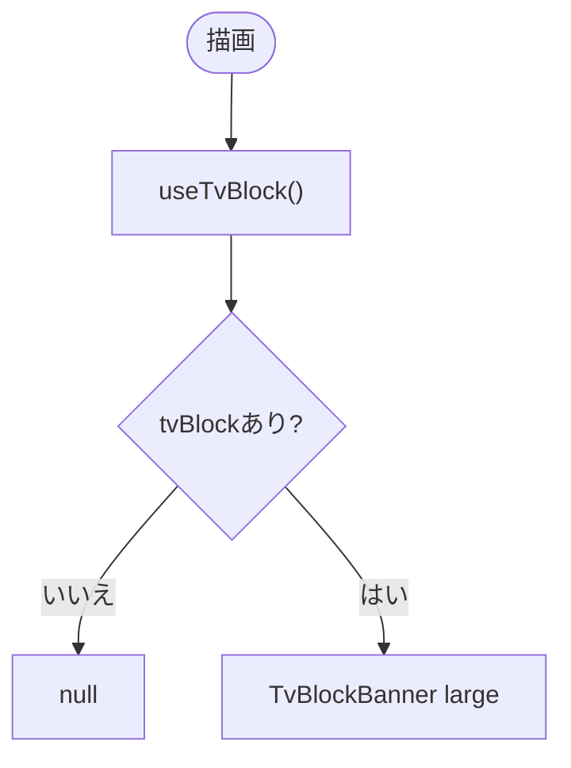
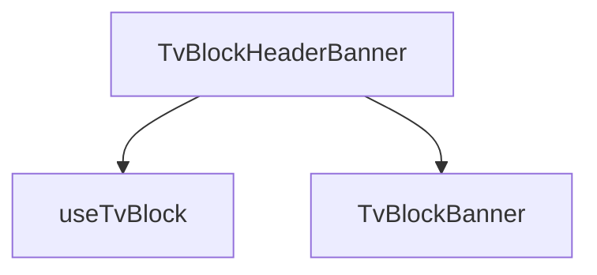

## 1. 解析メタ情報

| 項目 | 内容 |
| --- | --- |
| 対象ファイル | TvBlockHeaderBanner.tsx |
| 言語 | React (TypeScript) |
| 解析対象 | 提供されたコードのみ |
| 推測・補完 | 一切なし |

## 関連ドキュメント

* [../../hooks/useTvBlock.md](../../hooks/useTvBlock.md) - データ取得・カウントダウン
* [../ui/TvBlockBanner.md](../ui/TvBlockBanner.md) - 実際の描画
* [../../../App.md](../../../App.md) - 呼び出し元

## 2. ファイルの概要

* ヘッダー直下に置く、全タブ・全ユーザー共通のテレビおやすみ帯（`TvBlockHeaderBanner`）。`useTvBlock()` の結果を `TvBlockBanner`（large）で表示し、平日・取得失敗時（tvBlockがnull）は何も描画しない。
* 根拠: `const TvBlockHeaderBanner: React.FC = () => {` (行番号: 7 / 抜粋: "const TvBlockHeaderBanner: React.FC = () => {")

## 3. 外部依存関係

### インポート一覧

| 名称 | 種類 | 用途 | 根拠 |
| --- | --- | --- | --- |
| `useTvBlock` | フック | おやすみ状態の取得 | 根拠: `import { useTvBlock } from '../../hooks/useTvBlock';` (行番号: 2 / 抜粋: "import { useTvBlock } from '../../hooks/useTvBlock';") |
| `TvBlockBanner` | コンポーネント | 描画 | 根拠: `import TvBlockBanner from '../ui/TvBlockBanner';` (行番号: 3 / 抜粋: "import TvBlockBanner from '../ui/TvBlockBanner';") |

### ブラックボックスとなる外部要素

| 名称 | 理由 | 根拠 |
| --- | --- | --- |
| 各importの実装 | 本ファイル外のため | 根拠: import文 (行番号: 1 / 抜粋: 判断不可) |

## 4. 主要要素の定義（関数 / エンドポイント / コンポーネント）

### TvBlockHeaderBanner

* **役割**: 画面上部の共通帯。tvBlockがnullなら null を返す。
* 根拠: `if (!tvBlock) return null;` (行番号: 9 / 抜粋: "if (!tvBlock) return null;")
* **引数/リクエスト**: なし
* **戻り値/レスポンス**: JSX または null
* **副作用**: `useTvBlock` による定期取得（間接）
* **エラーハンドリング**: 取得失敗時は帯を出さないだけ（フック側でdataがnullのまま）

## 5. 処理フロー図

## 6. 依存関係図

## 7. 次のステップ（リバースエンジニアリングの提案）

| 優先度 | ファイル名(推測可) | 理由 |
| --- | --- | --- |
| 低 | `family-quest/src/App.tsx` | 配置位置の確認 |

## 8. 保守上の注意点

* ごほうび画面側のバナーと内容が揃うよう、描画は TvBlockBanner に委ねている。

## 9. 不明事項一覧

| 項目 | 理由 | 必要なファイル |
| --- | --- | --- |
| 平日の判定 | サーバー側（`get_tv_block_state`）がnullを返す条件に依存し、本ファイルには無い | MY_HOME_SYSTEM/services/switchbot_service.py |

## 10. 自己検証結果

* [x] 推測・外部ファイルの仕様を一切含んでいない
* [x] 全関数・全クラス・全コンポーネントを列挙した
* [x] 全てのインポート要素を列挙した
* [x] すべての仕様説明に「根拠（行番号・抜粋）」を明記した
* [x] 根拠漏れが0件である
* [x] Mermaid構文にエラーの原因となる記号（エスケープ漏れ）がない
* [x] 不明事項を漏れなく列挙した
