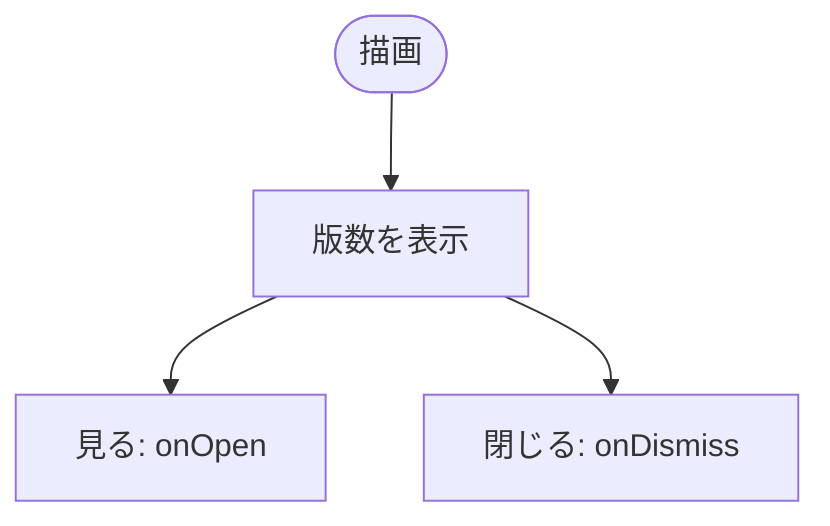
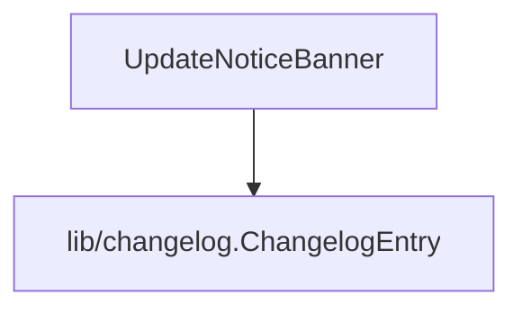

## 1. 解析メタ情報

| 項目 | 内容 |
| --- | --- |
| 対象ファイル | UpdateNoticeBanner.tsx |
| 言語 | React (TypeScript) |
| 解析対象 | 提供されたコードのみ |
| 推測・補完 | 一切なし |

## 関連ドキュメント

* [../../hooks/useChangelogUnread.md](../../hooks/useChangelogUnread.md) - 未読判定
* [../../../App.md](../../../App.md) - 呼び出し元
* [../ui/ChangelogModal.md](../ui/ChangelogModal.md) - 「見る」で開く履歴モーダル

## 2. ファイルの概要

* 新しいアップデートがあるときだけ画面上部に出す案内帯（`UpdateNoticeBanner`）。版数を表示し、「見る」ボタンと閉じる（×）ボタンを呼び出し側へ通知する。
* 根拠: `const UpdateNoticeBanner: React.FC<Props> = ({ entry, onOpen, onDismiss }) => (` (行番号: 15 / 抜粋: "const UpdateNoticeBanner: React.FC<Props> = ({ entry, onOpen, onDismiss }) => (")

## 3. 外部依存関係

### インポート一覧

| 名称 | 種類 | 用途 | 根拠 |
| --- | --- | --- | --- |
| `ChangelogEntry` | 型 | 表示するエントリ | 根拠: `import { ChangelogEntry } from '../../lib/changelog';` (行番号: 3 / 抜粋: "import { ChangelogEntry } from '../../lib/changelog';") |
| `X` | アイコン | 閉じるボタン | 根拠: `import { X } from 'lucide-react';` (行番号: 2 / 抜粋: "import { X } from 'lucide-react';") |

### ブラックボックスとなる外部要素

| 名称 | 理由 | 根拠 |
| --- | --- | --- |
| 各importの実装 | 本ファイル外のため | 根拠: import文 (行番号: 1 / 抜粋: 判断不可) |

## 4. 主要要素の定義（関数 / エンドポイント / コンポーネント）

### UpdateNoticeBanner

* **役割**: 🆕「アップデートがありました(vX.Y.Z)」の帯。
* 根拠: `const UpdateNoticeBanner: React.FC<Props> = ({ entry, onOpen, onDismiss }) => (` (行番号: 15 / 抜粋: "const UpdateNoticeBanner: React.FC<Props> = ({ entry, onOpen, onDismiss }) => (")
* **引数/リクエスト**: `entry`, `onOpen`, `onDismiss`
* **戻り値/レスポンス**: JSX
* **副作用**: なし（既読化は呼び出し側）
* **エラーハンドリング**: なし

### 追加・変更（2026-10-10: おしらせを「記録」ボタンの横へ移動）

* 帯自身が持っていた外側の幅指定ラッパー（`max-w-md md:max-w-5xl mx-auto`）を外し、帯だけを返すようにした。配置・幅は呼び出し先の `Header` の `notices` 枠（xl以上は記録ボタン右の空きスペース、xl未満はボタン行の下）が決める。
* 根拠: `const UpdateNoticeBanner: React.FC<Props> = ({ entry, onOpen, onDismiss }) => (` (行番号: 15 / 抜粋: "const UpdateNoticeBanner: React.FC<Props> = ({ entry, onOpen, onDismiss }) => (")

## 5. 処理フロー図

## 6. 依存関係図

## 7. 次のステップ（リバースエンジニアリングの提案）

| 優先度 | ファイル名(推測可) | 理由 |
| --- | --- | --- |
| 低 | `family-quest/src/App.tsx` | 既読化との結線の確認 |

## 8. 保守上の注意点

* ボタンは44px以上のタップ領域（`min-h-[44px]`／`w-11 h-11`）を確保している。

## 9. 不明事項一覧

| 項目 | 理由 | 必要なファイル |
| --- | --- | --- |
| なし | － | － |

## 10. 自己検証結果

* [x] 推測・外部ファイルの仕様を一切含んでいない
* [x] 全関数・全クラス・全コンポーネントを列挙した
* [x] 全てのインポート要素を列挙した
* [x] すべての仕様説明に「根拠（行番号・抜粋）」を明記した
* [x] 根拠漏れが0件である
* [x] Mermaid構文にエラーの原因となる記号（エスケープ漏れ）がない
* [x] 不明事項を漏れなく列挙した
