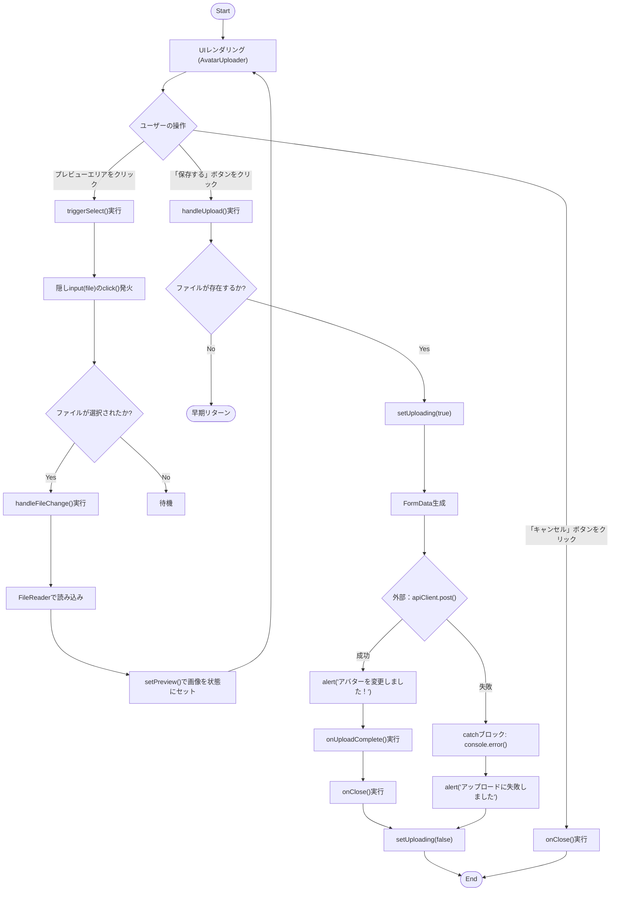
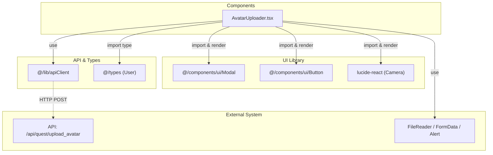

## 1. 解析メタ情報

| 項目 | 内容 |
| --- | --- |
| 対象ファイル | AvatarUploader.tsx |
| 言語 | React (TypeScript) |
| 解析対象 | 提供されたコードのみ |
| 推測・補完 | 一切なし |

## 2. ファイルの概要

このファイルは、ユーザーが自分のアバター画像を選択・プレビューし、サーバーへアップロードするためのUIコンポーネントである。モーダル画面として表示され、ファイルシステムからの画像選択、選択画像のプレビュー表示、API経由でのアップロード実行、およびキャンセル機能を提供する。

## 3. 外部依存関係

### インポート一覧

| 名称 | 種類 | 用途 | 根拠 |
| --- | --- | --- | --- |
| `React`, `useState`, `useRef` | ライブラリ | Reactコンポーネント定義、状態管理、DOM参照 | `import React, { useState, useRef } from "react";` (行番号: 1 / 抜粋: "import React, { useState, use") |
| `Camera` | ライブラリ | カメラアイコンの表示 | `import { Camera } from "lucide-react";` (行番号: 2 / 抜粋: "import { Camera } from "lucid") |
| `apiClient` | 外部モジュール | アバター画像アップロードのAPIリクエスト | `import { apiClient } from "@/lib/apiClient";` (行番号: 3 / 抜粋: "import { apiClient } from "@") |
| `User` | 型定義 | コンポーネントが受け取るユーザー情報の型 | `import { User } from "@/types";` (行番号: 4 / 抜粋: "import { User } from "@/type") |
| `Modal` | UIコンポーネント | モーダルウィンドウの表示 | `import { Modal } from "@/components/ui/Modal";` (行番号: 5 / 抜粋: "import { Modal } from "@/com") |
| `Button` | UIコンポーネント | キャンセルおよび保存用ボタンの表示 | `import { Button } from "@/components/ui/Button";` (行番号: 6 / 抜粋: "import { Button } from "@/co") |

### ブラックボックスとなる外部要素

| 名称 | 理由 | 根拠 |
| --- | --- | --- |
| `apiClient` | APIリクエストの実装詳細（認証ヘッダーの自動付与、ベースURL、共通エラー処理など）が不明（`@/lib/apiClient` に依存のため要確認）。 | `await (apiClient as any).post('/api/quest/upload_avatar'` (行番号: 40 / 抜粋: "await (apiClient as any).po") |
| `User` | `user_id`, `avatar`, `icon` 以外のプロパティ構成が不明（`@/types` に依存のため要確認）。 | `user: User;` (行番号: 9 / 抜粋: "user: User;") |
| `Modal` | モーダルの正確な動作仕様（内部イベント、アクセシビリティ対応など）が不明（`@/components/ui/Modal` に依存のため要確認）。 | `<Modal isOpen={true}` (行番号: 59 / 抜粋: "<Modal isOpen={true} onClose=") |
| `Button` | ボタンの正確な動作仕様（`variant`, `isLoading` 指定時の内部的な挙動変化など）が不明（`@/components/ui/Button` に依存のため要確認）。 | `<Button variant="secondary"` (行番号: 97 / 抜粋: "<Button variant="secondary" ") |
| エンドポイント `/api/quest/upload_avatar` | サーバー側の処理、バリデーション、レスポンス形式が不明（バックエンドに依存のため要確認）。 | `'/api/quest/upload_avatar'` (行番号: 40 / 抜粋: "await (apiClient as any).po") |

## 4. 主要要素の定義（関数 / エンドポイント / コンポーネント）

### `AvatarUploaderProps`

* **役割**: `AvatarUploader` コンポーネントがPropsとして受け取る値の型定義。
* 根拠: `interface AvatarUploaderProps { ... }` (行番号: 8〜12 / 抜粋: "interface AvatarUploaderProps")

* **引数/リクエスト**: なし（インターフェース定義のため）
* 根拠: 該当なし

* **戻り値/レスポンス**: なし
* 根拠: 該当なし

* **副作用**: なし
* 根拠: 該当なし

* **エラーハンドリング**: なし
* 根拠: 該当なし

### `AvatarUploader`

* **役割**: アバターの選択、プレビュー、アップロードを実行するReact関数コンポーネント。
* 根拠: `const AvatarUploader: React.FC<AvatarUploaderProps>` (行番号: 14〜113 / 抜粋: "const AvatarUploader: React.")

* **引数/リクエスト**: `AvatarUploaderProps` オブジェクト（`user`, `onClose`, `onUploadComplete` を分割代入で取得）
* 根拠: `({ user, onClose, onUploadComplete })` (行番号: 14 / 抜粋: "= ({ user, onClose, onUpload")

* **戻り値/レスポンス**: `Modal` コンポーネントでラップされたJSX要素。
* 根拠: `return ( <Modal...` (行番号: 58〜112 / 抜粋: "return (")

* **副作用**: API経由での画像データの送信。ブラウザ標準の `alert` による成否の通知。
* 根拠: `await (apiClient as any).post...`, `alert(...)` (行番号: 40, 43, 48 / 抜粋: "await (apiClient as any).po")

* **エラーハンドリング**: APIリクエスト時の例外をキャッチし、コンソールにエラーを出力し、`alert` でユーザーに通知。
* 根拠: `catch (error) { ... }` (行番号: 46〜49 / 抜粋: "catch (error) {")

### `handleFileChange` (内部関数)

* **役割**: ファイル選択時発火し、`FileReader` を用いて画像をData URL形式で非同期に読み込み、ローカル状態(`preview`)にセットする。
* 根拠: `const handleFileChange = (e: React.ChangeEvent<HTMLInputElement>)` (行番号: 19〜29 / 抜粋: "const handleFileChange = (e:")

* **引数/リクエスト**: `React.ChangeEvent<HTMLInputElement>` (ファイル入力のチェンジイベント)
* 根拠: `(e: React.ChangeEvent<HTMLInputElement>)` (行番号: 19 / 抜粋: "e: React.ChangeEvent<HTMLInp")

* **戻り値/レスポンス**: なし (void)
* 根拠: return文なし (行番号: 19〜29 / 抜粋: "const handleFileChange = (e:")

* **副作用**: `setPreview` 関数を通じたコンポーネントの再レンダリングのトリガー。
* 根拠: `setPreview(reader.result as string);` (行番号: 25 / 抜粋: "setPreview(reader.result as ")

* **エラーハンドリング**: 選択されたファイルが取得できない（`undefined` 等）場合はブロック内の処理を実行しない。
* 根拠: `if (file) {` (行番号: 21 / 抜粋: "if (file) {")

### `handleUpload` (内部関数)

* **役割**: 選択されたファイルとユーザーIDを `FormData` に格納し、サーバーへアップロード処理を行う。完了後にコールバック関数を呼び出す。
* 根拠: `const handleUpload = async () =>` (行番号: 31〜52 / 抜粋: "const handleUpload = async (")

* **引数/リクエスト**: なし
* 根拠: `() =>` (行番号: 31 / 抜粋: "const handleUpload = async (")

* **戻り値/レスポンス**: `Promise<void>`
* 根拠: `async` の指定 (行番号: 31 / 抜粋: "const handleUpload = async (")

* **副作用**: `setUploading` によるローディング状態変更、`apiClient` によるネットワーク通信、`alert` の表示、`onUploadComplete` および `onClose` の実行。
* 根拠: `setUploading(true);`, `await (apiClient as any).post`, `alert`, `onUploadComplete`, `onClose` (行番号: 34〜50 / 抜粋: "setUploading(true);")

* **エラーハンドリング**: `try-catch-finally` 構文で通信エラーをキャッチし、成否に関わらず `finally` ブロックでローディング状態を解除する。ファイル未選択時は早期リターンする。
* 根拠: `if (!fileInputRef.current?.files?.[0]) return;`, `try { ... } catch (error) { ... } finally { ... }` (行番号: 32, 39〜51 / 抜粋: "try {")

### `triggerSelect` (内部関数)

* **役割**: 非表示のファイル入力用 `input` 要素に対し、プログラムからクリックイベントを発火させる。
* 根拠: `const triggerSelect = () =>` (行番号: 54〜56 / 抜粋: "const triggerSelect = () => ")

* **引数/リクエスト**: なし
* 根拠: `() =>` (行番号: 54 / 抜粋: "const triggerSelect = () => ")

* **戻り値/レスポンス**: なし (void)
* 根拠: return文なし (行番号: 54〜56 / 抜粋: "const triggerSelect = () => ")

* **副作用**: ブラウザのファイル選択ダイアログの表示。
* 根拠: `fileInputRef.current?.click();` (行番号: 55 / 抜粋: "fileInputRef.current?.click(")

* **エラーハンドリング**: オプショナルチェーニング (`?.`) を使用し、参照が `null` の場合のエラーを回避。
* 根拠: `?.click()` (行番号: 55 / 抜粋: "fileInputRef.current?.click(")

## 5. 処理フロー図

## 6. 依存関係図

## 7. 次のステップ（リバースエンジニアリングの提案）

| 優先度 | ファイル名(推測可) | 理由 | 根拠 |
| --- | --- | --- | --- |
| 高 | `@/lib/apiClient.ts` | `apiClient` が `any` でキャストされており、リクエスト送信時の共通処理（認証情報など）やエラー仕様がフロントエンド全体に影響するため。 | `await (apiClient as any).post` (行番号: 40) |
| 中 | バックエンドの当該API処理ファイル（コントローラー層） | UI上で「正方形にトリミングされます」と記載があるが、コンポーネント内にトリミング処理が存在しないため、サーバー側で実装されているか確認する必要がある。 | `'/api/quest/upload_avatar'` (行番号: 40) および `(正方形にトリミングされます)` (行番号: 93) |
| 低 | `@/components/ui/Button.tsx` | `isLoading` プロパティの振る舞い（ボタンの非活性化やスピナー表示などの視覚的変化）を確認するため。 | `<Button ... isLoading={uploading}>` (行番号: 100〜105) |

## 8. 保守上の注意点

* **`any` キャストの使用**: `apiClient` が `any` でキャストされているため、引数や戻り値の型検査が無効になっており、TypeScriptの恩恵を受けられない状態である。
* **トリミング処理の不在**: テキストに「正方形にトリミングされます」とあるが、本ファイル内（クライアントサイド）に画像をトリミング・クロップする処理はない。
* **バリデーションの制限**: `input` 要素で `accept="image/*"` を指定しているが、JSによる拡張子チェックやファイルサイズ上限のバリデーションは実装されていない。
* **UIブロッキング**: エラー・成功時の通知にブラウザ標準の同期関数 `alert` を使用しているため、ユーザーがダイアログを閉じるまでJavaScriptの実行（コールバックの呼び出しなど）がブロックされる。
* **依存状態の不整合リスク**: `handleUpload` 関数内で送信するファイルを `fileInputRef.current.files[0]` から直接参照している。状態管理されている `preview` に紐づくファイルオブジェクトを使用していない。

## 9. 不明事項一覧

| 項目 | 理由 | 必要なファイル |
| --- | --- | --- |
| `apiClient` の詳細仕様 | インターセプターの有無や共通のエラーハンドリング、ヘッダー付与などの仕様が読み取れないため。 | `@/lib/apiClient.ts` |
| 画像のトリミング責務 | フロントエンドに処理がないため、サーバー側で期待通りにトリミングされているか不明なため。 | バックエンドのエンドポイント処理ファイル |
| `User` 型の全体像 | `user_id`, `avatar`, `icon` 以外のプロパティが本コンポーネント以外でどのように影響するか不明なため。 | `@/types/index.ts`（または該当の型定義ファイル） |

## 10. 自己検証結果

* [x] 推測・外部ファイルの仕様を一切含んでいない
* [x] 全関数・全クラス・全コンポーネントを列挙した
* [x] 全てのインポート要素を列挙した
* [x] すべての仕様説明に「根拠（行番号・抜粋）」を明記した
* [x] 根拠漏れが0件である
* [x] Mermaid構文にエラーの原因となる記号（エスケープ漏れ）がない
* [x] 不明事項を漏れなく列挙した

完了