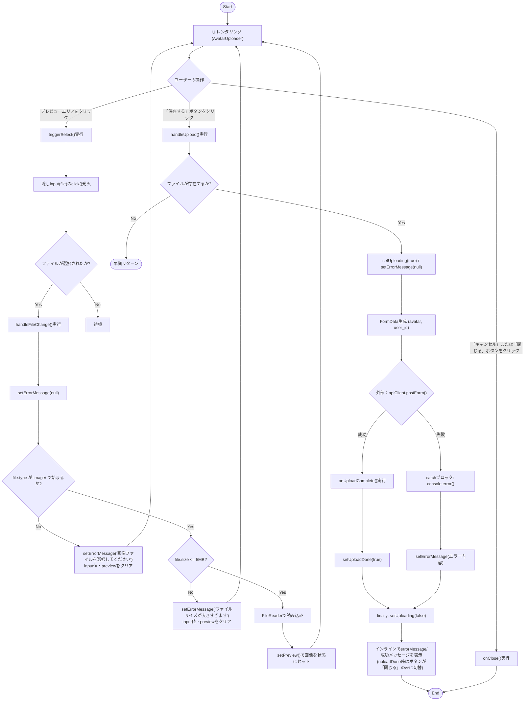
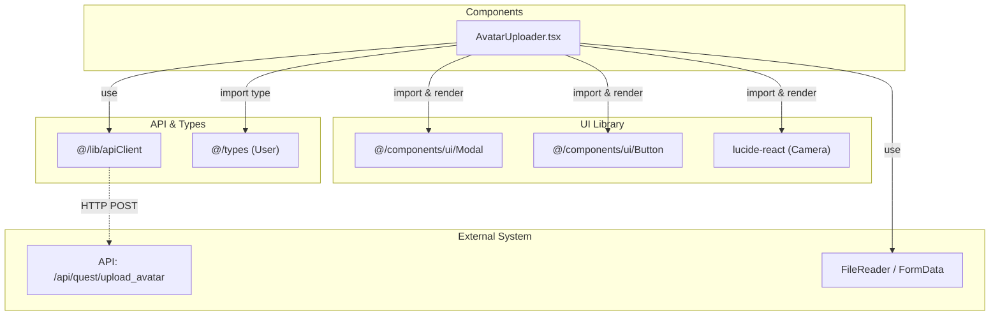

## 1. 解析メタ情報

| 項目 | 内容 |
| --- | --- |
| 対象ファイル | AvatarUploader.tsx |
| 言語 | React (TypeScript) |
| 解析対象 | 提供されたコードのみ |
| 推測・補完 | 一切なし |

## 2. ファイルの概要

このファイルは、ユーザーが自分のアバター画像を選択・プレビューし、サーバーへアップロードするためのUIコンポーネントである。モーダル画面として表示され、ファイルシステムからの画像選択、クライアント側でのファイル形式・サイズのバリデーション、選択画像のプレビュー表示、API経由でのアップロード実行、およびキャンセル機能を提供する。エラーおよび成功メッセージは（ブラウザ標準の`alert`ではなく）モーダル内のインラインUIとして表示され、アップロード成功後もモーダルは自動的には閉じず、ユーザーが「閉じる」ボタンを押すまで表示され続ける。

## 3. 外部依存関係

### インポート一覧

| 名称 | 種類 | 用途 | 根拠 |
| --- | --- | --- | --- |
| `React`, `useState`, `useRef` | ライブラリ | Reactコンポーネント定義、状態管理、DOM参照 | `import React, { useState, useRef } from "react";` (行番号: 1 / 抜粋: "import React, { useState, use") |
| `Camera` | ライブラリ | カメラアイコンの表示 | `import { Camera } from "lucide-react";` (行番号: 2 / 抜粋: "import { Camera } from "lucid") |
| `apiClient` | 外部モジュール | アバター画像アップロードのAPIリクエスト | `import { apiClient } from "@/lib/apiClient";` (行番号: 3 / 抜粋: "import { apiClient } from "@") |
| `User` | 型定義 | コンポーネントが受け取るユーザー情報の型 | `import { User } from "@/types";` (行番号: 4 / 抜粋: "import { User } from "@/type") |
| `Modal` | UIコンポーネント | モーダルウィンドウの表示 | `import { Modal } from "@/components/ui/Modal";` (行番号: 5 / 抜粋: "import { Modal } from "@/com") |
| `Button` | UIコンポーネント | キャンセルおよび保存用ボタンの表示 | `import { Button } from "@/components/ui/Button";` (行番号: 6 / 抜粋: "import { Button } from "@/co") |

### ブラックボックスとなる外部要素

| 名称 | 理由 | 根拠 |
| --- | --- | --- |
| `apiClient` | APIリクエストの実装詳細（`postForm`メソッドの内部実装、認証ヘッダーの自動付与、ベースURL、共通エラー処理など）が不明（`@/lib/apiClient` に依存のため要確認）。 | `await apiClient.postForm('/api/quest/upload_avatar', formData);` (行番号: 61) |
| `User` | `user_id`, `avatar`, `icon` 以外のプロパティ構成が不明（`@/types` に依存のため要確認）。 | `user: User;` (行番号: 9 / 抜粋: "user: User;") |
| `Modal` | モーダルの正確な動作仕様（内部イベント、アクセシビリティ対応など）が不明（`@/components/ui/Modal` に依存のため要確認）。 | `<Modal isOpen={true}` (行番号: 79 / 抜粋: "<Modal isOpen={true} onClose={onClose} title=\"アバター変更\">") |
| `Button` | ボタンの正確な動作仕様（`variant`, `isLoading`, `disabled` 指定時の内部的な挙動変化など）が不明（`@/components/ui/Button` に依存のため要確認）。 | `<Button variant="secondary" ...>` (行番号: 130, 135, 138) |
| エンドポイント `/api/quest/upload_avatar` | サーバー側の処理、バリデーション、レスポンス形式が不明（バックエンドに依存のため要確認）。 | `'/api/quest/upload_avatar'` (行番号: 61) |

## 4. 主要要素の定義（関数 / エンドポイント / コンポーネント）

### `AvatarUploaderProps`

* **役割**: `AvatarUploader` コンポーネントがPropsとして受け取る値の型定義。
* 根拠: `interface AvatarUploaderProps { ... }` (行番号: 8〜12 / 抜粋: "interface AvatarUploaderProps")

* **引数/リクエスト**: なし（インターフェース定義のため）
* 根拠: 該当なし

* **戻り値/レスポンス**: なし
* 根拠: 該当なし

* **副作用**: なし
* 根拠: 該当なし

* **エラーハンドリング**: なし
* 根拠: 該当なし

### `AvatarUploader`

* **役割**: アバターの選択、クライアント側バリデーション、プレビュー、アップロードを実行するReact関数コンポーネント。内部状態として `uploading`（送信中）, `preview`（プレビュー画像のData URL）, `errorMessage`（バリデーション/通信エラー文言）, `uploadDone`（アップロード完了フラグ）を持つ。
* 根拠: `const AvatarUploader: React.FC<AvatarUploaderProps>` (行番号: 16〜153 / 抜粋: "const AvatarUploader: React.FC<AvatarUploaderProps> = ({ user, onClose, onUploadComplete }) => {")

* **引数/リクエスト**: `AvatarUploaderProps` オブジェクト（`user`, `onClose`, `onUploadComplete` を分割代入で取得）
* 根拠: `({ user, onClose, onUploadComplete })` (行番号: 16 / 抜粋: "= ({ user, onClose, onUploadComplete }) => {")

* **戻り値/レスポンス**: `Modal` コンポーネントでラップされたJSX要素。`uploadDone`が`true`の場合は「閉じる」ボタンのみ、それ以外は「キャンセル」「保存する」ボタンを表示する。
* 根拠: `return ( <Modal...` (行番号: 78〜152 / 抜粋: "return ( <Modal isOpen={true} onClose={onClose} title=\"アバター変更\">")、条件分岐 (129〜148行目)

* **副作用**: API経由での画像データの送信（`apiClient.postForm`）。成功・失敗いずれもモーダル内のインラインUI（`errorMessage`/`uploadDone`）で通知する（ブラウザ標準の`alert`は使用しない）。
* 根拠: 61行目 `await apiClient.postForm('/api/quest/upload_avatar', formData);`、68行目 `setErrorMessage(error instanceof Error ? error.message : "アップロードに失敗しました");`、64〜65行目 `onUploadComplete(); setUploadDone(true);`

* **エラーハンドリング**: APIリクエスト時の例外をキャッチし、コンソールにエラーを出力し、`errorMessage`状態にセットしてインライン表示する。
* 根拠: `catch (error) { ... }` (行番号: 66〜68 / 抜粋: "console.error('Upload failed:', error); setErrorMessage(error instanceof Error ? error.message : \"アップロードに失敗しました\");")

### `handleFileChange` (内部関数)

* **役割**: ファイル選択時に発火し、選択されたファイルが画像形式（`image/`で始まるMIMEタイプ）かつ`MAX_AVATAR_SIZE_BYTES`（5MB）以下であることをクライアント側で検証する。検証に失敗した場合は`errorMessage`をセットして入力値・プレビューをクリアし、成功した場合は`FileReader`で画像をData URL形式で非同期に読み込みローカル状態(`preview`)にセットする。
* 根拠: `const handleFileChange = (e: React.ChangeEvent<HTMLInputElement>)` (行番号: 23〜49 / 抜粋: "if (!file.type.startsWith('image/')) { setErrorMessage(\"画像ファイルを選択してください\");")

* **引数/リクエスト**: `React.ChangeEvent<HTMLInputElement>` (ファイル入力のチェンジイベント)
* 根拠: `(e: React.ChangeEvent<HTMLInputElement>)` (行番号: 23 / 抜粋: "const handleFileChange = (e: React.ChangeEvent<HTMLInputElement>) => {")

* **戻り値/レスポンス**: なし (void)
* 根拠: return文なし (行番号: 23〜49)

* **副作用**: `setErrorMessage`, `setPreview` によるコンポーネントの再レンダリングのトリガー。
* 根拠: 27, 31, 33, 37, 39, 46行目 `setErrorMessage(...)`, `setPreview(...)`

* **エラーハンドリング**: 選択されたファイルが存在しない場合、画像形式でない場合、サイズ上限（5MB）を超える場合の3パターンで早期リターンし、後者2つは`errorMessage`をセットして`input`の値と`preview`をクリアする。
* 根拠: `if (!file) return;` (24〜25行目), `if (!file.type.startsWith('image/')) { ... return; }` (30〜35行目), `if (file.size > MAX_AVATAR_SIZE_BYTES) { ... return; }` (36〜41行目)

### `handleUpload` (内部関数)

* **役割**: 選択されたファイルとユーザーIDを `FormData` に格納し、サーバーへアップロード処理を行う。成功時は`onUploadComplete`を呼び出し`uploadDone`を`true`にするが、`onClose`は呼ばない（モーダルは自動では閉じない）。
* 根拠: `const handleUpload = async () =>` (行番号: 51〜72 / 抜粋: "const handleUpload = async () => {")

* **引数/リクエスト**: なし
* 根拠: `() =>` (行番号: 51 / 抜粋: "const handleUpload = async () => {")

* **戻り値/レスポンス**: `Promise<void>`
* 根拠: `async` の指定 (行番号: 51 / 抜粋: "const handleUpload = async () => {")

* **副作用**: `setUploading` によるローディング状態変更、`setErrorMessage(null)`によるエラー表示クリア、`apiClient.postForm` によるネットワーク通信、成功時の `onUploadComplete` 呼び出しと `setUploadDone(true)`、`finally`での`setUploading(false)`。
* 根拠: `setUploading(true);`, `await apiClient.postForm(...)`, `onUploadComplete();`, `setUploadDone(true);` (行番号: 54〜65 / 抜粋: "setUploading(true);")

* **エラーハンドリング**: `try-catch-finally` 構文で通信エラーをキャッチし`errorMessage`にセットする。成否に関わらず `finally` ブロックでローディング状態を解除する。ファイル未選択時は早期リターンする。
* 根拠: `if (!fileInputRef.current?.files?.[0]) return;`, `try { ... } catch (error) { ... } finally { ... }` (行番号: 52, 60〜71 / 抜粋: "try { await apiClient.postForm(...)")

### `triggerSelect` (内部関数)

* **役割**: 非表示のファイル入力用 `input` 要素に対し、プログラムからクリックイベントを発火させる。
* 根拠: `const triggerSelect = () =>` (行番号: 74〜76 / 抜粋: "const triggerSelect = () => { fileInputRef.current?.click(); };")

* **引数/リクエスト**: なし
* 根拠: `() =>` (行番号: 74 / 抜粋: "const triggerSelect = () => {")

* **戻り値/レスポンス**: なし (void)
* 根拠: return文なし (行番号: 74〜76)

* **副作用**: ブラウザのファイル選択ダイアログの表示。
* 根拠: `fileInputRef.current?.click();` (行番号: 75 / 抜粋: "fileInputRef.current?.click();")

* **エラーハンドリング**: オプショナルチェーニング (`?.`) を使用し、参照が `null` の場合のエラーを回避。
* 根拠: `?.click()` (行番号: 75 / 抜粋: "fileInputRef.current?.click();")

## 5. 処理フロー図

```mermaid
flowchart TD
    Start([Start]) --> Render["UIレンダリング (AvatarUploader)"]
    
    Render --> UserAction{"ユーザーの操作"}
    
    %% ファイル選択フロー
    UserAction -- "プレビューエリアをクリック" --> TriggerSelect["triggerSelect()実行"]
    TriggerSelect --> ClickHiddenInput["隠しinput(file)のclick()発火"]
    ClickHiddenInput --> SelectFile{"ファイルが選択されたか?"}
    SelectFile -- Yes --> HandleFileChange["handleFileChange()実行"]
    SelectFile -- No --> Wait["待機"]
    HandleFileChange --> ClearError["setErrorMessage(null)"]
    ClearError --> ValidateType{"file.type が image/ で始まるか?"}
    ValidateType -- No --> SetTypeError["setErrorMessage('画像ファイルを選択してください')\ninput値・previewをクリア"]
    ValidateType -- Yes --> ValidateSize{"file.size <= 5MB?"}
    ValidateSize -- No --> SetSizeError["setErrorMessage('ファイルサイズが大きすぎます')\ninput値・previewをクリア"]
    ValidateSize -- Yes --> ReadFile["FileReaderで読み込み"]
    ReadFile --> SetPreview["setPreview()で画像を状態にセット"]
    SetTypeError --> Render
    SetSizeError --> Render
    SetPreview --> Render
    
    %% アップロードフロー
    UserAction -- "「保存する」ボタンをクリック" --> HandleUpload["handleUpload()実行"]
    HandleUpload --> CheckFile{"ファイルが存在するか?"}
    CheckFile -- No --> EndUpload([早期リターン])
    CheckFile -- Yes --> SetUploadingTrue["setUploading(true) / setErrorMessage(null)"]
    SetUploadingTrue --> CreateFormData["FormData生成 (avatar, user_id)"]
    CreateFormData --> ApiCall{"外部：apiClient.postForm()"}
    
    ApiCall -- 成功 --> CallComplete["onUploadComplete()実行"]
    CallComplete --> SetUploadDoneTrue["setUploadDone(true)"]
    SetUploadDoneTrue --> FinallyBlock["finally: setUploading(false)"]
    
    ApiCall -- 失敗 --> CatchError["catchブロック: console.error()"]
    CatchError --> SetUploadError["setErrorMessage(エラー内容)"]
    SetUploadError --> FinallyBlock
    
    FinallyBlock --> RenderResult["インラインでerrorMessage/成功メッセージを表示\n(uploadDone時はボタンが「閉じる」のみに切替)"]
    RenderResult --> End([End])
    
    %% キャンセル・クローズフロー
    UserAction -- "「キャンセル」または「閉じる」ボタンをクリック" --> CancelClose["onClose()実行"]
    CancelClose --> End

```

## 6. 依存関係図

```mermaid
graph TD
    subgraph Components
        AvatarUploader["AvatarUploader.tsx"]
    end
    
    subgraph UI Library
        Modal["@/components/ui/Modal"]
        Button["@/components/ui/Button"]
        Camera["lucide-react (Camera)"]
    end
    
    subgraph API & Types
        apiClient["@/lib/apiClient"]
        UserType["@/types (User)"]
    end
    
    subgraph External System
        BackendAPI["API: /api/quest/upload_avatar"]
        BrowserAPI["FileReader / FormData"]
    end
    
    AvatarUploader -->|"import & render"| Modal
    AvatarUploader -->|"import & render"| Button
    AvatarUploader -->|"import & render"| Camera
    AvatarUploader -->|"import type"| UserType
    AvatarUploader -->|"use"| apiClient
    apiClient -.->|"HTTP POST"| BackendAPI
    AvatarUploader -->|"use"| BrowserAPI

```

## 7. 次のステップ（リバースエンジニアリングの提案）

| 優先度 | ファイル名(推測可) | 理由 | 根拠 |
| --- | --- | --- | --- |
| 高 | `@/lib/apiClient.ts` | `postForm` メソッドの共通処理（認証情報の付与、`multipart/form-data`ヘッダーの扱いなど）やエラー仕様がフロントエンド全体に影響するため。 | `await apiClient.postForm(...)` (行番号: 61) |
| 中 | バックエンドの当該API処理ファイル（コントローラー層） | UI上で「正方形にトリミングされます」と記載があるが、コンポーネント内にトリミング処理が存在しないため、サーバー側で実装されているか確認する必要がある。 | `'/api/quest/upload_avatar'` (行番号: 61) および `(正方形にトリミングされます)` (行番号: 113) |
| 低 | `@/components/ui/Button.tsx` | `isLoading`/`disabled` プロパティの振る舞い（ボタンの非活性化やスピナー表示などの視覚的変化）を確認するため。 | `<Button ... isLoading={uploading}>` (行番号: 138〜144) |

## 8. 保守上の注意点

* **アップロード成功後にモーダルが自動で閉じない**: `handleUpload` 成功時は `onUploadComplete()` を呼び出して `uploadDone` を `true` にするのみで、`onClose()` は呼ばれない（64〜65行目）。親コンポーネント（`App.tsx`）の `onUploadComplete` は独自に `messageData` をセットして `MessageModal` を表示するため、アバター変更成功時は本コンポーネントの成功メッセージ表示と `MessageModal` が同時に開く構成になっている点に注意が必要。
* **`FormData` 送信時のファイル参照**: `handleUpload` 関数内で送信するファイルを `fileInputRef.current.files[0]` から直接参照している（57行目）。状態管理されている `preview` に紐づくファイルオブジェクトを使用していない。
* **クライアント側バリデーションはあるがサーバー側の検証内容は不明**: 画像形式（`image/`プレフィックス）とサイズ上限（5MB, `MAX_AVATAR_SIZE_BYTES`）はクライアント側で検証されているが、サーバー側で同等の検証が行われているかは本ファイルからは判断できない。
* **トリミング処理の不在**: テキストに「正方形にトリミングされます」とあるが、本ファイル内（クライアントサイド）に画像をトリミング・クロップする処理はない。

## 9. 不明事項一覧

| 項目 | 理由 | 必要なファイル |
| --- | --- | --- |
| `apiClient.postForm` の詳細仕様 | インターセプターの有無や共通のエラーハンドリング、ヘッダー付与などの仕様が読み取れないため。 | `@/lib/apiClient.ts` |
| 画像のトリミング責務 | フロントエンドに処理がないため、サーバー側で期待通りにトリミングされているか不明なため。 | バックエンドのエンドポイント処理ファイル |
| `User` 型の全体像 | `user_id`, `avatar`, `icon` 以外のプロパティが本コンポーネント以外でどのように影響するか不明なため。 | `@/types/index.ts`（または該当の型定義ファイル） |
| サーバー側のファイルサイズ・形式検証の有無 | クライアント側の5MB/画像形式チェックがサーバー側でも二重に検証されているか不明なため。 | バックエンドのエンドポイント処理ファイル |

## 10. 自己検証結果

* [x] 推測・外部ファイルの仕様を一切含んでいない
* [x] 全関数・全クラス・全コンポーネントを列挙した
* [x] 全てのインポート要素を列挙した
* [x] すべての仕様説明に「根拠（行番号・抜粋）」を明記した
* [x] 根拠漏れが0件である
* [x] Mermaid構文にエラーの原因となる記号（エスケープ漏れ）がない
* [x] 不明事項を漏れなく列挙した

完了