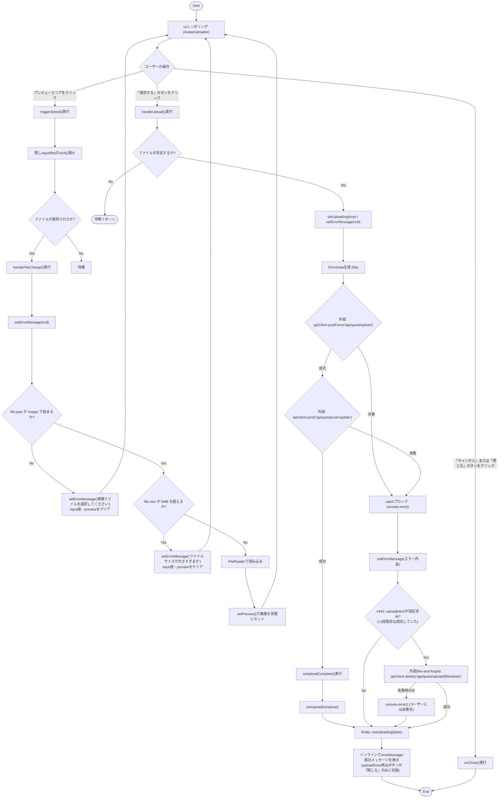
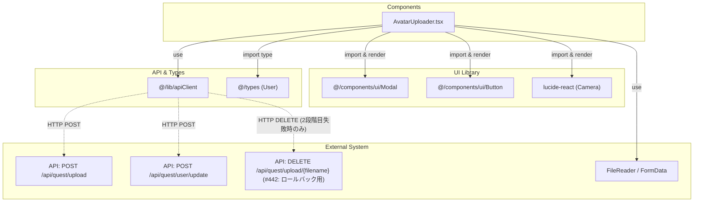

## 1. 解析メタ情報

| 項目 | 内容 |
| --- | --- |
| 対象ファイル | AvatarUploader.tsx |
| 言語 | React (TypeScript) |
| 解析対象 | 提供されたコードのみ |
| 推測・補完 | 一切なし |
| 解析基準コミット | `65fce15` |

## 関連ドキュメント

* [../../../App.md](../../../App.md) - 呼び出し元。`avatarUser`が設定されたときに`React.lazy`で動的importされた本コンポーネントを描画し、`onUploadComplete`で`refreshData()`とトースト表示（`showToast`）を行う
* [../../lib/apiClient.md](../../lib/apiClient.md) - `postForm`/`post`メソッドの実装元
* [../../types/index.md](../../types/index.md) - `User`型の定義元
* [../../lib/utils.md](../../lib/utils.md) - `isSameOriginAvatarPath`の実装元
* [./Modal.md](./Modal.md) - 利用するモーダルコンポーネント
* [./Button.md](./Button.md) - 利用するボタンコンポーネント
* [../../../../MY_HOME_SYSTEM/quest_router.md](../../../../MY_HOME_SYSTEM/quest_router.md) - Family Quest系バックエンドのルーター定義（アップロード・ユーザー更新系エンドポイントを提供）

## 2. ファイルの概要

このファイルは、ユーザーが自分のアバター画像を選択・プレビューし、サーバーへアップロードするためのUIコンポーネントである。モーダル画面として表示され、ファイルシステムからの画像選択、クライアント側でのファイル形式・サイズのバリデーション、選択画像のプレビュー表示、API経由でのアップロードと2段階のリクエスト（画像アップロード→ユーザーのアバターURL更新）、およびキャンセル機能を提供する。エラーおよび成功メッセージは（ブラウザ標準の`alert`ではなく）モーダル内のインラインUIとして表示され、アップロード成功後もモーダルは自動的には閉じず、ユーザーが「閉じる」ボタンを押すまで表示され続ける。
* 根拠: `AvatarUploader`コンポーネント定義とアップロード処理 (17, 52〜78行目 / 抜粋: "const AvatarUploader: React.FC<AvatarUploaderProps> = ({ user, onClose, onUploadComplete }) => {", "const handleUpload = async () => {")

## 3. 外部依存関係

### インポート一覧

| 名称 | 種類 | 用途 | 根拠 |
| --- | --- | --- | --- |
| `React`, `useState`, `useRef` | ライブラリ | Reactコンポーネント定義、状態管理、DOM参照 | `import React, { useState, useRef } from "react";` (行番号: 1) |
| `Camera` | アイコンコンポーネント | プレビューエリア上のカメラアイコン表示 | `import { Camera } from "lucide-react";` (行番号: 2) |
| `apiClient` | 外部モジュール | アバター画像アップロードおよびユーザー情報更新のAPIリクエスト | `import { apiClient } from "@/lib/apiClient";` (行番号: 3) |
| `User` | 型定義 | コンポーネントが受け取るユーザー情報の型 | `import { User } from "@/types";` (行番号: 4) |
| `Modal` | UIコンポーネント | モーダルウィンドウの表示 | `import { Modal } from "@/components/ui/Modal";` (行番号: 5) |
| `Button` | UIコンポーネント | キャンセルおよび保存/閉じる用ボタンの表示 | `import { Button } from "@/components/ui/Button";` (行番号: 6) |
| `isSameOriginAvatarPath` | 外部モジュール | `user.avatar`が自サーバーの画像パスか(絵文字等の非パス値ではないか)を判定するための型ガード関数 | `import { isSameOriginAvatarPath } from "@/lib/utils";` (行番号: 7) |

### ブラックボックスとなる外部要素

| 名称 | 理由 | 根拠 |
| --- | --- | --- |
| `apiClient` | APIリクエストの実装詳細（`postForm`/`post`メソッドの内部実装、認証ヘッダーの自動付与、ベースURL、共通エラー処理など）が不明。 | `await apiClient.postForm<{ url: string }>('/api/quest/upload', formData);` (行番号: 65)、`await apiClient.post('/api/quest/user/update', { ... });` (行番号: 66) |
| `User` | `user_id`, `avatar` 以外のプロパティ構成が不明。 | `user: User;` (行番号: 10) |
| `Modal` | モーダルの正確な動作仕様（内部イベント、アクセシビリティ対応など）が不明。 | `<Modal isOpen={true} onClose={onClose} title="アバター変更">` (行番号: 85) |
| `Button` | ボタンの正確な動作仕様（`variant`, `isLoading`, `disabled` 指定時の内部的な挙動変化など）が不明。 | `<Button variant="secondary" ...>` (行番号: 141, 146, 149) |
| エンドポイント `/api/quest/upload` | サーバー側のバリデーション、レスポンス形式（`{ url }`）の詳細が不明。 | `'/api/quest/upload'` (行番号: 65) |
| エンドポイント `/api/quest/user/update` | サーバー側でユーザーレコードがどう更新されるか不明。 | `'/api/quest/user/update'` (行番号: 66) |

## 4. 主要要素の定義（関数 / エンドポイント / コンポーネント）

### `AvatarUploaderProps`

* **役割**: `AvatarUploader` コンポーネントがPropsとして受け取る値の型定義。
* 根拠: `interface AvatarUploaderProps { ... }` (行番号: 9〜13 / 抜粋: "interface AvatarUploaderProps {\n    user: User;\n    onClose: () => void;\n    onUploadComplete: () => void;\n}")

* **引数/リクエスト**: なし（インターフェース定義のため）
* **戻り値/レスポンス**: なし
* **副作用**: なし
* **エラーハンドリング**: なし

### `MAX_AVATAR_SIZE_BYTES` (モジュールレベル定数)

* **役割**: アップロード可能な画像ファイルサイズの上限（5MB）を定義する。`handleFileChange`のバリデーションで参照される。M15/Issue #325対応で、バックエンド(`MY_HOME_SYSTEM/config.py`の`UPLOAD_MAX_FILE_SIZE_MB`、既定5MB)と同一値に揃えられており、変更時は両方(とエラー文言)を更新する旨の相互参照コメントが付いている。
* 根拠: (行番号: 17 / 抜粋: "const MAX_AVATAR_SIZE_BYTES = 5 * 1024 * 1024; // 5MB")

### `AvatarUploader`

* **役割**: アバターの選択、クライアント側バリデーション、プレビュー、アップロードを実行するReact関数コンポーネント。内部状態として `uploading`（送信中）, `preview`（プレビュー画像のData URL）, `errorMessage`（バリデーション/通信エラー文言）, `uploadDone`（アップロード完了フラグ）を持つ。プレビューエリアの表示は、`avatarImageSrc`（`preview`＝選択直後のdata:URLを最優先し、無ければ`isSameOriginAvatarPath(user.avatar)`が`true`＝自サーバーのアップロード画像パスの場合に`user.avatar`、それ以外は`null`）が存在する場合のみ``を描画し、それ以外（未アップロード時の絵文字デフォルト値等）は`user.avatar || '👤'`をテキストとして描画する（**Issue #390**: `user.avatar`が`string | null`になったため``へ渡す値を事前に`string | null`へ絞る`avatarImageSrc`を導入し、幽霊フィールド`user.icon`へのフォールバックを削除）（Issue #117: 以前は`preview || user.avatar`が真であれば無条件に``をレンダリングしており、`user.avatar`が絵文字の場合に壊れた画像アイコンになっていた）。
* 根拠: `const AvatarUploader: React.FC<AvatarUploaderProps>` (行番号: 17〜164 / 抜粋: "const AvatarUploader: React.FC<AvatarUploaderProps> = ({ user, onClose, onUploadComplete }) => {")
* 根拠: `avatarImageSrc`の算出とプレビュー分岐 (行番号: 86〜112 / 抜粋: "const avatarImageSrc = preview || (isSameOriginAvatarPath(user.avatar) ? user.avatar : null);", "{avatarImageSrc ? (", "src={avatarImageSrc}", "{user.avatar || '👤'}")

* **引数/リクエスト**: `AvatarUploaderProps` オブジェクト（`user`, `onClose`, `onUploadComplete` を分割代入で取得）
* 根拠: `({ user, onClose, onUploadComplete })` (行番号: 17 / 抜粋: "= ({ user, onClose, onUploadComplete }) => {")

* **戻り値/レスポンス**: `Modal` コンポーネントでラップされたJSX要素。`uploadDone`が`true`の場合は「閉じる」ボタンのみ、それ以外は「キャンセル」「保存する」ボタンを表示する。
* 根拠: `return ( <Modal...` (行番号: 84〜163 / 抜粋: "return (\n        <Modal isOpen={true} onClose={onClose} title=\"アバター変更\">")、条件分岐 (139〜159行目)

* **副作用**: API経由での画像データの送信（`apiClient.postForm`）とユーザーレコードの更新（`apiClient.post`）。成功・失敗いずれもモーダル内のインラインUI（`errorMessage`/`uploadDone`）で通知する（ブラウザ標準の`alert`は使用しない）。
* 根拠: (行番号: 65〜66, 74 / 抜粋: "const { url } = await apiClient.postForm<{ url: string }>('/api/quest/upload', formData);\n            await apiClient.post('/api/quest/user/update', { user_id: user.user_id, avatar_url: url });", "setErrorMessage(error instanceof Error ? error.message : \"アップロードに失敗しました\");")

* **エラーハンドリング**: APIリクエスト時の例外をキャッチし、コンソールにエラーを出力し、`errorMessage`状態にセットしてインライン表示する。
* 根拠: `catch (error) { ... }` (行番号: 72〜74 / 抜粋: "console.error('Upload failed:', error);\n            setErrorMessage(error instanceof Error ? error.message : \"アップロードに失敗しました\");")

### `handleFileChange` (内部関数)

* **役割**: ファイル選択時に発火し、選択されたファイルが画像形式（`image/`で始まるMIMEタイプ）かつ`MAX_AVATAR_SIZE_BYTES`（5MB）以下であることをクライアント側で検証する。検証に失敗した場合は`errorMessage`をセットして入力値・プレビューをクリアし、成功した場合は`FileReader`で画像をData URL形式で非同期に読み込みローカル状態(`preview`)にセットする。
* 根拠: `const handleFileChange = (e: React.ChangeEvent<HTMLInputElement>)` (行番号: 24〜50 / 抜粋: "if (!file.type.startsWith('image/')) {\n            setErrorMessage(\"画像ファイルを選択してください\");")

* **引数/リクエスト**: `React.ChangeEvent<HTMLInputElement>` (ファイル入力のチェンジイベント)
* 根拠: `(e: React.ChangeEvent<HTMLInputElement>)` (行番号: 24 / 抜粋: "const handleFileChange = (e: React.ChangeEvent<HTMLInputElement>) => {")

* **戻り値/レスポンス**: なし (void)
* **副作用**: `setErrorMessage`, `setPreview` によるコンポーネントの再レンダリングのトリガー。
* 根拠: (行番号: 28, 32, 34, 38, 40, 47 / 抜粋: "setErrorMessage(...)", "setPreview(...)")

* **エラーハンドリング**: 選択されたファイルが存在しない場合、画像形式でない場合、サイズ上限（5MB）を超える場合の3パターンで早期リターンし、後者2つは`errorMessage`をセットして`input`の値と`preview`をクリアする。
* 根拠: `if (!file) return;` (25〜26行目), `if (!file.type.startsWith('image/')) { ... return; }` (31〜36行目), `if (file.size > MAX_AVATAR_SIZE_BYTES) { ... return; }` (37〜42行目)

### `handleUpload` (内部関数)

* **役割**: 選択されたファイルを`FormData`（フィールド名`file`）に格納し、`/api/quest/upload`へアップロードして返ってきたURLを`/api/quest/user/update`へ明示的に紐付ける2段階のアップロード処理を行う。成功時は`onUploadComplete`を呼び出し`uploadDone`を`true`にするが、`onClose`は呼ばない（モーダルは自動では閉じない）。以前は存在しない`/api/quest/upload_avatar`にPOSTしており常に失敗していたバグの修正が施されている。**（#442で追加）** 1段階目のアップロードが成功した時点で返ってきたURLを`uploadedUrl`（`try`ブロック外で宣言したローカル変数）に保持しておき、その後（＝2段階目の紐付け）で例外が発生した場合、`catch`ブロック内で`uploadedUrl`からファイル名を取り出し、`DELETE /api/quest/upload/{filename}`へのベストエフォートのロールバック削除リクエストを追加で発行する。このロールバック呼び出し自体の失敗は`.catch()`で握りつぶしてコンソールにログ出力するのみで、ユーザーには通常の（1つ目の）エラーメッセージのみが表示される。
* 根拠: `const handleUpload = async () =>` (行番号: 54〜95 / 抜粋: "const handleUpload = async () => {")
* 根拠: バグ修正のコメント (行番号: 62〜65 / 抜粋: "// ★バグ修正: 以前は存在しない /api/quest/upload_avatar にPOSTしており\n            // 常に失敗していた(実際のアップロード先は /api/quest/upload、フィールド名は file)。\n            // さらにアップロードするだけではユーザーのアバターには反映されないため、\n            // 返ってきたURLを /api/quest/user/update で明示的に紐付ける。")
* 根拠: ロールバック削除の追加 (行番号: 66, 69, 80〜91 / 抜粋: "let uploadedUrl: string | null = null;", "uploadedUrl = url;", "// #442: 1段階目(画像アップロード)は成功したが2段階目(ユーザーへの紐付け)が\n            // 失敗した場合、アップロード済みの画像がどのユーザーにも紐付かないまま\n            // サーバー上に孤立して残ってしまう。ベストエフォートでロールバック削除を\n            // 試みる(失敗してもユーザーへは元のエラーのみを表示する)。\n            if (uploadedUrl) {\n                const filename = uploadedUrl.split('/').pop();\n                if (filename) {\n                    apiClient.delete(`/api/quest/upload/${encodeURIComponent(filename)}`).catch(rollbackError => {\n                        console.error('Failed to roll back orphaned avatar upload:', rollbackError);\n                    });\n                }\n            }")

* **引数/リクエスト**: なし
* 根拠: `() =>` (行番号: 54 / 抜粋: "const handleUpload = async () => {")

* **戻り値/レスポンス**: `Promise<void>`
* 根拠: `async` の指定 (行番号: 54 / 抜粋: "const handleUpload = async () => {")

* **副作用**: `setUploading` によるローディング状態変更、`setErrorMessage(null)`によるエラー表示クリア、`apiClient.postForm`（画像アップロード）と`apiClient.post`（アバターURL紐付け）による2回のネットワーク通信、成功時の `onUploadComplete` 呼び出しと `setUploadDone(true)`。**（#442で追加）** 2段階目が失敗した場合、`uploadedUrl`が設定されていれば`apiClient.delete('/api/quest/upload/{filename}')`によるロールバック削除リクエスト（結果を待たない fire-and-forget、失敗時は`console.error`のみ）を追加で発行する。`finally`での`setUploading(false)`。
* 根拠: `setUploading(true);`, `await apiClient.postForm(...)`, `await apiClient.post(...)`, `onUploadComplete();`, `setUploadDone(true);` (行番号: 57〜75)、ロールバック削除 (行番号: 84〜90)

* **エラーハンドリング**: `try-catch-finally` 構文で通信エラーをキャッチし`errorMessage`にセットする（`Error`インスタンスなら`error.message`、それ以外は既定文言）。**（#442で追加）** 続けて、1段階目のアップロードが成功していた（`uploadedUrl`が非`null`）場合のみ、孤立した画像ファイルのベストエフォートなロールバック削除（`apiClient.delete`、失敗は`console.error`にログするのみでユーザーには通知しない）を試みる。成否に関わらず `finally` ブロックでローディング状態を解除する。ファイル未選択時は早期リターンする。
* 根拠: `if (!fileInputRef.current?.files?.[0]) return;`, `try { ... } catch (error) { ... } finally { ... }` (行番号: 55, 67〜94 / 抜粋: "try {\n            const { url } = await apiClient.postForm...")

### `triggerSelect` (内部関数)

* **役割**: 非表示のファイル入力用 `input` 要素に対し、プログラムからクリックイベントを発火させる。
* 根拠: `const triggerSelect = () =>` (行番号: 80〜82 / 抜粋: "const triggerSelect = () => {\n        fileInputRef.current?.click();\n    };")

* **引数/リクエスト**: なし
* **戻り値/レスポンス**: なし (void)
* **副作用**: ブラウザのファイル選択ダイアログの表示。
* 根拠: `fileInputRef.current?.click();` (行番号: 81)

* **エラーハンドリング**: オプショナルチェーニング (`?.`) を使用し、参照が `null` の場合のエラーを回避。
* 根拠: `?.click()` (行番号: 81)

## 5. 処理フロー図

```mermaid
flowchart TD
    Start([Start]) --> Render["UIレンダリング (AvatarUploader)"]

    Render --> UserAction{"ユーザーの操作"}

    UserAction -- "プレビューエリアをクリック" --> TriggerSelect["triggerSelect()実行"]
    TriggerSelect --> ClickHiddenInput["隠しinput(file)のclick()発火"]
    ClickHiddenInput --> SelectFile{"ファイルが選択されたか?"}
    SelectFile -- Yes --> HandleFileChange["handleFileChange()実行"]
    SelectFile -- No --> Wait["待機"]
    HandleFileChange --> ClearError["setErrorMessage(null)"]
    ClearError --> ValidateType{"file.type が image/ で始まるか?"}
    ValidateType -- No --> SetTypeError["setErrorMessage('画像ファイルを選択してください')\ninput値・previewをクリア"]
    ValidateType -- Yes --> ValidateSize{"file.size が 5MB を超えるか?"}
    ValidateSize -- Yes --> SetSizeError["setErrorMessage('ファイルサイズが大きすぎます')\ninput値・previewをクリア"]
    ValidateSize -- No --> ReadFile["FileReaderで読み込み"]
    ReadFile --> SetPreview["setPreview()で画像を状態にセット"]
    SetTypeError --> Render
    SetSizeError --> Render
    SetPreview --> Render

    UserAction -- "「保存する」ボタンをクリック" --> HandleUpload["handleUpload()実行"]
    HandleUpload --> CheckFile{"ファイルが存在するか?"}
    CheckFile -- No --> EndUpload([早期リターン])
    CheckFile -- Yes --> SetUploadingTrue["setUploading(true) / setErrorMessage(null)"]
    SetUploadingTrue --> CreateFormData["FormData生成 (file)"]
    CreateFormData --> ApiCall1{"外部: apiClient.postForm('/api/quest/upload')"}

    ApiCall1 -- 成功 --> ApiCall2{"外部: apiClient.post('/api/quest/user/update')"}
    ApiCall2 -- 成功 --> CallComplete["onUploadComplete()実行"]
    CallComplete --> SetUploadDoneTrue["setUploadDone(true)"]
    SetUploadDoneTrue --> FinallyBlock["finally: setUploading(false)"]

    ApiCall1 -- 失敗 --> CatchError["catchブロック: console.error()"]
    ApiCall2 -- 失敗 --> CatchError
    CatchError --> SetUploadError["setErrorMessage(エラー内容)"]
    SetUploadError --> CheckUploadedUrl{"#442: uploadedUrlが設定済み?\n(=1段階目は成功していた)"}
    CheckUploadedUrl -- Yes --> RollbackDelete["外部(fire-and-forget): apiClient.delete('/api/quest/upload/{filename}')"]
    RollbackDelete -- 失敗時のみ --> LogRollbackError["console.error() (ユーザーには非表示)"]
    CheckUploadedUrl -- No --> FinallyBlock
    LogRollbackError --> FinallyBlock
    RollbackDelete -- 成功 --> FinallyBlock

    FinallyBlock --> RenderResult["インラインでerrorMessage/成功メッセージを表示\n(uploadDone時はボタンが「閉じる」のみに切替)"]
    RenderResult --> End([End])

    UserAction -- "「キャンセル」または「閉じる」ボタンをクリック" --> CancelClose["onClose()実行"]
    CancelClose --> End
```

## 6. 依存関係図

```mermaid
graph TD
    subgraph Components
        AvatarUploader["AvatarUploader.tsx"]
    end

    subgraph UI Library
        Modal["@/components/ui/Modal"]
        Button["@/components/ui/Button"]
        Camera["lucide-react (Camera)"]
    end

    subgraph API & Types
        apiClient["@/lib/apiClient"]
        UserType["@/types (User)"]
    end

    subgraph External System
        UploadAPI["API: POST /api/quest/upload"]
        UpdateAPI["API: POST /api/quest/user/update"]
        DeleteAPI["API: DELETE /api/quest/upload/{filename} (#442: ロールバック用)"]
        BrowserAPI["FileReader / FormData"]
    end

    AvatarUploader -->|"import & render"| Modal
    AvatarUploader -->|"import & render"| Button
    AvatarUploader -->|"import & render"| Camera
    AvatarUploader -->|"import type"| UserType
    AvatarUploader -->|"use"| apiClient
    apiClient -.->|"HTTP POST"| UploadAPI
    apiClient -.->|"HTTP POST"| UpdateAPI
    apiClient -.->|"HTTP DELETE (2段階目失敗時のみ)"| DeleteAPI
    AvatarUploader -->|"use"| BrowserAPI
```

## 7. 次のステップ（リバースエンジニアリングの提案）

| 優先度 | ファイル名(推測可) | 理由 | 根拠 |
| --- | --- | --- | --- |
| 高 | `@/lib/apiClient.ts` | `postForm`/`post` メソッドの共通処理（認証情報の付与、`multipart/form-data`ヘッダーの扱いなど）やエラー仕様がフロントエンド全体に影響するため。 | `await apiClient.postForm(...)`, `await apiClient.post(...)` (行番号: 65〜66) |
| 中 | バックエンドの`/api/quest/upload`・`/api/quest/user/update`処理ファイル（コントローラー層） | UI上で「正方形にトリミングされます」と記載があるが、コンポーネント内にトリミング処理が存在しないため、サーバー側で実装されているか確認する必要がある。また2エンドポイントの整合性（アップロードとユーザー更新の間で不整合が起きた場合の扱い）を確認する必要がある。 | `'/api/quest/upload'`, `'/api/quest/user/update'` (行番号: 65〜66) および `(正方形にトリミングされます)` (行番号: 124) |
| 低 | `@/components/ui/Button.tsx` | `isLoading`/`disabled` プロパティの振る舞い（ボタンの非活性化やスピナー表示などの視覚的変化）を確認するため。 | `<Button ... isLoading={uploading}>` (行番号: 149〜155) |

## 8. 保守上の注意点

* **アップロード成功後にモーダルが自動で閉じない**: `handleUpload` 成功時は `onUploadComplete()` を呼び出して `uploadDone` を `true` にするのみで、`onClose()` は呼ばれない（74〜75行目）。親コンポーネント（`App.tsx`）の `onUploadComplete` は独自に `refreshData()` と `showToast` による成功トーストを表示するため、アバター変更成功時は本コンポーネントの成功メッセージ表示とトーストが同時に発生する構成になっている点に注意が必要。
* **[修正済み] アップロード先が2エンドポイントに分かれている件のロールバック（#442）**: 画像自体のアップロード（`POST /api/quest/upload`）と、ユーザーレコードへのアバターURL紐付け（`POST /api/quest/user/update`）は依然として別々のリクエストとして順に実行される。以前は1つ目が成功し2つ目が失敗した場合、アップロード済み画像がどのユーザーにも紐付かないまま孤立してサーバーに残り続けていた。現在は`catch`ブロックで`uploadedUrl`（1段階目成功時にセットされる）が設定されていれば、`DELETE /api/quest/upload/{filename}`へのベストエフォートのロールバック削除を追加で発行する。ただし、このロールバック自体はレスポンスを待たない(`.catch()`のみ、`await`しない) fire-and-forgetであり、ロールバック自体が失敗（ネットワーク断・サーバー側エラー等）した場合は`console.error`にログするのみでユーザーには一切通知されず、孤立ファイルの残存を完全には防げない。
* 根拠: (行番号: 68〜91 / 抜粋: "const { url } = await apiClient.postForm<{ url: string }>('/api/quest/upload', formData);\n            uploadedUrl = url;\n            await apiClient.post('/api/quest/user/update', { user_id: user.user_id, avatar_url: url });", "if (uploadedUrl) {\n                const filename = uploadedUrl.split('/').pop();\n                if (filename) {\n                    apiClient.delete(`/api/quest/upload/${encodeURIComponent(filename)}`).catch(rollbackError => {\n                        console.error('Failed to roll back orphaned avatar upload:', rollbackError);\n                    });\n                }\n            }")
* **ファイル名の抽出方法**: ロールバック削除対象のファイル名は`uploadedUrl.split('/').pop()`（86行目）で、URLの末尾セグメントをそのまま使う簡易な文字列処理。クエリ文字列やフラグメントを含むURLが返された場合の考慮は無い（本ファイルからは`/api/quest/upload`が返す`url`の正確な形式は不明。§9参照）。
* **`FormData` 送信時のファイル参照**: `handleUpload` 関数内で送信するファイルを `fileInputRef.current.files[0]` から直接参照している（60行目）。状態管理されている `preview` に紐づくファイルオブジェクトを使用していない。
* **クライアント側バリデーションはあるがサーバー側の検証内容は不明**: 画像形式（`image/`プレフィックス）とサイズ上限（5MB, `MAX_AVATAR_SIZE_BYTES`）はクライアント側で検証されているが、サーバー側で同等の検証が行われているかは本ファイルからは判断できない。
* **トリミング処理の不在**: テキストに「正方形にトリミングされます」とあるが、本ファイル内（クライアントサイド）に画像をトリミング・クロップする処理はない。
* **Issue #117で修正: `preview`/`user.avatar`の``直接使用**: 以前はプレビューエリアの表示条件が`preview || user.avatar`（真偽値のみで判定）で、真であれば無条件に``をレンダリングしていた。`user.avatar`はアップロード画像パス（`/uploads/...`）だけでなく未設定時の絵文字デフォルト値（`'⚔️'`等）も取りうるため、絵文字が渡ると壊れた画像アイコンになっていた。`Header.tsx`/`UserStatusCard.tsx`/`FamilyLog.tsx`で既に使われている`isSameOriginAvatarPath`（`@/lib/utils`）による同一オリジンパス判定を導入し、`preview`（選択直後のdata:URL、常に画像として妥当）またはパス形式の`user.avatar`のときのみ``を描画するよう修正した。

## 9. 不明事項一覧

| 項目 | 理由 | 必要なファイル |
| --- | --- | --- |
| `apiClient.postForm`/`apiClient.post` の詳細仕様 | インターセプターの有無や共通のエラーハンドリング、ヘッダー付与などの仕様が読み取れないため。 | `@/lib/apiClient.ts` |
| 画像のトリミング責務 | フロントエンドに処理がないため、サーバー側で期待通りにトリミングされているか不明なため。 | バックエンドのエンドポイント処理ファイル |
| `User` 型の全体像 | `user_id`, `avatar` 以外のプロパティが本コンポーネント以外でどのように影響するか不明なため。 | `@/types/index.ts`（または該当の型定義ファイル） |
| サーバー側のファイルサイズ・形式検証の有無 | クライアント側の5MB/画像形式チェックがサーバー側でも二重に検証されているか不明なため。 | バックエンドのエンドポイント処理ファイル |
| ロールバック用`DELETE /api/quest/upload/{filename}`エンドポイントの実装詳細 | **（#442）** フロント側は紐付け失敗時にこのエンドポイントへベストエフォートで削除リクエストを送るのみで、サーバー側が実際にどのファイルシステム上のパスを削除するか、権限チェックの有無、他ユーザーの画像を誤って指定した場合の挙動などは本ファイルからは不明なため。 | バックエンドのエンドポイント処理ファイル (`MY_HOME_SYSTEM/routers/quest_router.py`) |
| `/api/quest/upload`が返す`url`の正確なフォーマット | ロールバック時の`uploadedUrl.split('/').pop()`によるファイル名抽出（86行目）が、クエリ文字列やフラグメントを含む可能性のあるURL形式に対して常に正しいファイル名を返すか、本ファイルからは判断できないため。 | バックエンドのエンドポイント処理ファイル |

## 相互参照による補足情報

| 元の不明事項 | 判明した内容 | 参照元ドキュメント |
| --- | --- | --- |
| `apiClient.postForm`/`apiClient.post` の詳細仕様 | `family-quest/src/lib/apiClient.ts`を直接確認した。`postForm`(56〜61行目)は`Content-Type`ヘッダーを明示的に指定せず`body: formData`をそのまま渡す実装で、コメント(53〜55行目)により「ブラウザにboundary付きのヘッダーを自動生成させるため（手動指定するとboundaryが欠落しリクエストが壊れるため）」と明記されている。`post`(43〜51行目)は`Content-Type: application/json`を付与し`JSON.stringify(body)`を送信する。共通の`_request`メソッド(77〜95行目)は`response.ok`が`false`の場合、レスポンスボディを`.json()`でパースし(失敗時は`{}`)、`errorData.detail`が文字列であればそれを、そうでなければ`API Error: {status}`という文字列を`message`として`Error`を`throw`する(83〜88行目)。この`Error`の`message`は`apiClient`呼び出し元(`useGameData.ts`の`extractErrorDetail`等)がユーザー向けエラー表示に利用する。 | 直接ソース確認: `family-quest/src/lib/apiClient.ts:43-95` |
| 画像のトリミング責務／サーバー側のファイルサイズ・形式検証の有無／アップロード成功・紐付け失敗時の整合性 | `MY_HOME_SYSTEM/routers/quest_router.py`および`MY_HOME_SYSTEM/services/quest_service.py`を直接確認した。`POST /upload`(`upload_image`、89〜118行目)は拡張子チェック(`.jpg`/`.jpeg`/`.png`/`.gif`/`.webp`、92〜95行目)とマジックナンバー検証(`validate_image_header`、82〜87行目、JPEG/PNG/GIF/WEBPの先頭バイト列を確認)のみを行い、画像を正方形にトリミング・リサイズする処理はコード上に存在しない。ファイルサイズの上限チェック（`MAX_AVATAR_SIZE_BYTES`相当のサーバー側検証）も本関数内には存在せず、`MY_HOME_SYSTEM/config.py`・`MY_HOME_SYSTEM/tests/test_quest_router_api.py`（アップロードのテストケース群、134〜199行目）を確認してもファイルサイズを検証するテスト・実装は見つからなかった。`POST /user/update`(`update_user_avatar`、77〜79行目)は`UserService.update_avatar`(quest_service.py 105〜115行目)を呼び出し、`quest_users`テーブルの`avatar`カラムをUPDATEするのみで、ユーザーが存在しない場合は`HTTPException(status_code=404)`(108〜109行目)を送出する。`update_avatar`内には、アップロード済み画像ファイル（`/upload`が保存したファイル）を削除・ロールバックする処理や、アップロードとの紐付けを検証する処理は存在せず、2エンドポイントはサーバー側では完全に独立している。**（#442でフロント側に追記）** `family-quest/src/components/ui/AvatarUploader.tsx`の`handleUpload`は、2段階目（`/user/update`）が失敗した場合に`DELETE /api/quest/upload/{filename}`（`MY_HOME_SYSTEM/routers/quest_router.py`87〜88行目に存在を確認）へベストエフォートの削除リクエストを追加で送るようになったため、サーバー側の自動ロールバックは無いままだが、フロント側がクライアント主導でこのケースの孤立ファイル解消を試みる構成になった（ロールバック自体が失敗した場合は従来どおり孤立したまま残る）。 | 直接ソース確認: `MY_HOME_SYSTEM/routers/quest_router.py:77-118`, `MY_HOME_SYSTEM/services/quest_service.py:105-115`, `family-quest/src/components/ui/AvatarUploader.tsx:80-91` |
| `User` 型の全体像 | `family-quest/src/types/index.ts`9〜26行目を直接確認した。`interface User`は`user_id: string`, `name: string`, `level: number`, `exp: number`, `avatar?: string`, `icon?: string`, `medal_count?: number`, `job_class?: string`, `gold: number`, `role?: string`, `hp?: number`, `maxHp?: number`の12フィールドを持つ。20〜23行目のコメントにより、`hp`/`maxHp`はバックエンド(MY_HOME_SYSTEM)側で計算された値をそのまま使う設計（`calculate_max_hp(level) = level * 20 + 5`）であり、フロント側で独自に再計算してはいけないと明記されている。 | 直接ソース確認: `family-quest/src/types/index.ts:9-26` |

## 10. 自己検証結果

* [x] 推測・外部ファイルの仕様を一切含んでいない
* [x] 全関数・全クラス・全コンポーネントを列挙した
* [x] 全てのインポート要素を列挙した
* [x] すべての仕様説明に「根拠（行番号・抜粋）」を明記した
* [x] 根拠漏れが0件である
* [x] Mermaid構文にエラーの原因となる記号（エスケープ漏れ）がない
* [x] 不明事項を漏れなく列挙した

完了
