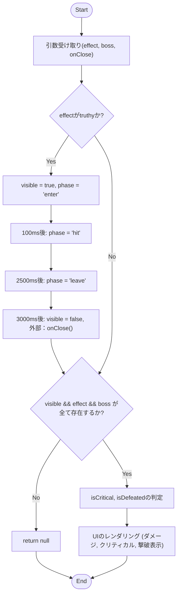
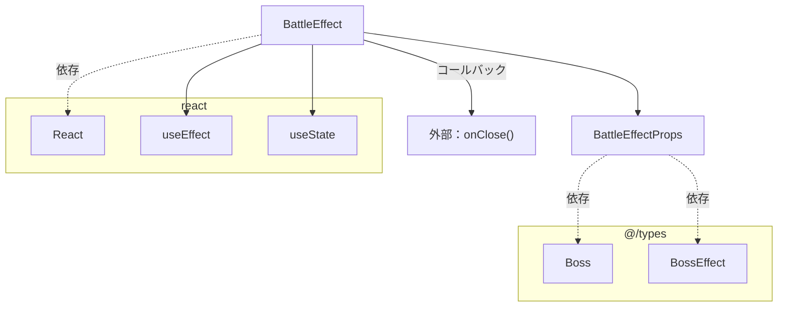

## 1. 解析メタ情報

| 項目 | 内容 |
| --- | --- |
| 対象ファイル | BattleEffect.tsx |
| 言語 | React (TypeScript) |
| 解析対象 | 提供されたコードのみ |
| 推測・補完 | 一切なし |

## 2. ファイルの概要

ボスキャラクターへのダメージや撃破などのバトルエフェクトを画面上にアニメーション表示し、一定時間経過後に非表示にしてコールバック関数を呼び出す責務を持つUIコンポーネントである。

## 3. 外部依存関係

### インポート一覧

| 名称 | 種類 | 用途 | 根拠 |
| --- | --- | --- | --- |
| `React`, `useEffect`, `useState` | モジュール/フック | Reactコンポーネントの定義と状態・副作用管理 | 根拠: `import React, { useEffect, useState } from 'react';` (行番号: 1 / 抜粋: "import React, { useEffect, useS") |
| `Boss`, `BossEffect` | 型 | Propsの型定義に使用 | 根拠: `import { Boss, BossEffect } from '@/types';` (行番号: 2 / 抜粋: "import { Boss, BossEffect } fr") |

### ブラックボックスとなる外部要素

| 名称 | 理由 | 根拠 |
| --- | --- | --- |
| `@/types` | ファイル内に型定義の実装がなく、各プロパティの全容が不明 | 根拠: `import { Boss, BossEffect } from '@/types';` (行番号: 2 / 抜粋: "import { Boss, BossEffect } fr") |
| `onClose` | Propsとして受け取るコールバック関数であり、呼び出し側の具体的な処理内容が不明 | 根拠: `onClose: () => void;` (行番号: 8 / 抜粋: "onClose: () => void;") |

## 4. 主要要素の定義（関数 / エンドポイント / コンポーネント）

### `BattleEffectProps`

* **役割**: `BattleEffect`コンポーネントが受け取るプロパティの型定義
* 根拠: `interface BattleEffectProps` (行番号: 5〜9 / 抜粋: "interface BattleEffectProps {")

* **引数/リクエスト**: 該当なし
* 根拠: インターフェース定義のため (行番号: 5〜9 / 抜粋: "interface BattleEffectProps {")

* **戻り値/レスポンス**: 該当なし
* 根拠: インターフェース定義のため (行番号: 5〜9 / 抜粋: "interface BattleEffectProps {")

* **副作用**: なし
* 根拠: インターフェース定義のため (行番号: 5〜9 / 抜粋: "interface BattleEffectProps {")

* **エラーハンドリング**: なし
* 根拠: インターフェース定義のため (行番号: 5〜9 / 抜粋: "interface BattleEffectProps {")

### `BattleEffect`

* **役割**: バトルエフェクトのアニメーションフェーズ（enter, hit, leave）を時間経過で切り替え、ダメージ、クリティカル、撃破などの表示を行う。完了時に`onClose`を呼び出す。
* 根拠: `const BattleEffect: React.FC<BattleEffectProps> = ({ effect, boss, onClose }) => {` (行番号: 11 / 抜粋: "const BattleEffect: React.FC<Ba")

* **引数/リクエスト**: `effect` (`BossEffect | null`), `boss` (`Boss | null`), `onClose` (`() => void`)
* 根拠: `({ effect, boss, onClose })` (行番号: 11 / 抜粋: "({ effect, boss, onClose }) =>")

* **戻り値/レスポンス**: JSX要素（React Node）または `null`
* 根拠: `if (!visible || !effect || !boss) return null;` および `return ( 
 {")

* **エラーハンドリング**: 描画に必要な値(`visible`, `effect`, `boss`)が存在しない場合はアーリーリターンで`null`を返し、レンダリングエラーを防止している。
* 根拠: `if (!visible || !effect || !boss) return null;` (行番号: 36 / 抜粋: "if (!visible || !effect || !bos")

## 5. 処理フロー図

## 6. 依存関係図

## 7. 次のステップ（リバースエンジニアリングの提案）

| 優先度 | ファイル名(推測可) | 理由 | 根拠 |
| --- | --- | --- | --- |
| 高 | `@/types` (例: `types.ts` 等) | `Boss` および `BossEffect` の全プロパティと型構造を把握し、コンポーネントが前提としているデータモデルを明確にするため。 | 根拠: `import { Boss, BossEffect } from '@/types';` (行番号: 2 / 抜粋: "import { Boss, BossEffect } fr") |
| 中 | このコンポーネントの呼び出し元ファイル（親コンポーネント） | `onClose` 関数でどのような状態リセット処理や後続処理が行われているかを把握するため。 | 根拠: `onClose();` (行番号: 25 / 抜粋: "onClose();") |

## 8. 保守上の注意点

* `useEffect`内で`setTimeout`を3つ発行し、クリーンアップ関数内でそれぞれのタイマーを`clearTimeout`で破棄している。
* `effect` と `onClose` が `useEffect` の依存配列に指定されている。
* `effect.isNewDefeat` または `effect.isDefeated` のいずれかが真であれば `isDefeated` を真として扱うロジックが存在する。
* Tailwind CSS のクラス（`scale-110`, `scale-100`, `animate-[wiggle_0.3s_ease-in-out_infinite]`, `translate-y-0` 等）を用いて状態（`phase`）に応じたアニメーション制御を行っている。

## 9. 不明事項一覧

| 項目 | 理由 | 必要なファイル |
| --- | --- | --- |
| `Boss` および `BossEffect` の型定義の詳細 | 本ファイル内にはインポート文のみで具体的なプロパティ一覧が存在しないため | `@/types` が解決するファイル |
| `onClose` 実行時の具体的な副作用 | 外部から渡されるコールバック関数であり、呼び出し元の実装に依存するため | 本コンポーネントを利用している親コンポーネント |
| 使用されているTailwindのカスタムアニメーション設定 | `animate-[wiggle_0.3s_ease-in-out_infinite]` などが指定されているが、`tailwind.config.js` 等の設定内容が見えないため | Tailwindの設定ファイル |

## 10. 自己検証結果

* [x] 推測・外部ファイルの仕様を一切含んでいない
* [x] 全関数・全クラス・全コンポーネントを列挙した
* [x] 全てのインポート要素を列挙した
* [x] すべての仕様説明に「根拠（行番号・抜粋）」を明記した
* [x] 根拠漏れが0件である
* [x] Mermaid構文にエラーの原因となる記号（エスケープ漏れ）がない
* [x] 不明事項を漏れなく列挙した