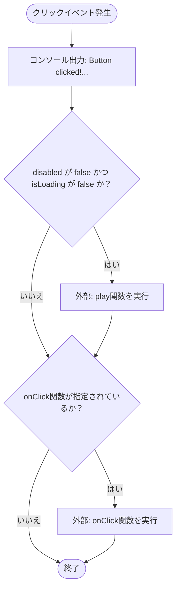
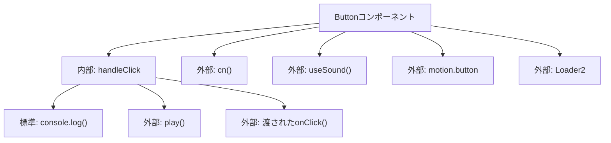

## 1. 解析メタ情報

| 項目 | 内容 |
| --- | --- |
| 対象ファイル | Button.tsx |
| 言語 | React (TypeScript) |
| 解析対象 | 提供されたコードのみ |
| 推測・補完 | 一切なし |

## 関連ドキュメント

* [../../hooks/useSound.md](../../hooks/useSound.md) - `play`関数の実装元
* [../../lib/utils.md](../../lib/utils.md) - `cn`関数の実装元
* [./Modal.md](./Modal.md) - 本コンポーネントを利用する側の一例（ヘッダー部の閉じるボタン）
* [./MessageModal.md](./MessageModal.md) - 本コンポーネントを利用する側の一例（OKボタン）

## 2. ファイルの概要

Framer Motionを利用したアニメーション付きのボタンコンポーネントを提供する。バリエーション（色・見た目）、サイズ、ローディング状態をプロパティで制御し、クリック時に外部フックを用いた音声再生処理と元のクリックイベントハンドラを実行する責務を持つ。

## 3. 外部依存関係

### インポート一覧

| 名称 | 種類 | 用途 | 根拠 |
| --- | --- | --- | --- |
| React | モジュール | Reactコンポーネント定義と `forwardRef` の利用 | 根拠: `import React from "react";` (行番号: 1) |
| Loader2 | コンポーネント | ローディング状態時のアイコン表示 | 根拠: `import { Loader2 } from "lucide-react";` (行番号: 2) |
| cn | 関数 | コンポーネントのクラス名結合 | 根拠: `import { cn } from "@/lib/utils";` (行番号: 3) |
| motion | オブジェクト | アニメーション付きボタン要素（`motion.button`）の描画 | 根拠: `import { motion, HTMLMotionProps } from "framer-motion";` (行番号: 4) |
| HTMLMotionProps | 型 | コンポーネントのProps型定義の拡張元 | 根拠: `import { motion, HTMLMotionProps } from "framer-motion";` (行番号: 4) |
| useSound | フック | 音声再生関数の取得 | 根拠: `import { useSound } from "@/hooks/useSound";` (行番号: 5) |

### ブラックボックスとなる外部要素

| 名称 | 理由 | 根拠 |
| --- | --- | --- |
| cn | クラス名の結合や重複排除などの具体的な処理ロジックが不明 | 根拠: `import { cn } from "@/lib/utils";` (行番号: 3) |
| useSound | 取得される `play` 関数の実装詳細および引数 `'tap'` の具体的な動作仕様が不明 | 根拠: `import { useSound } from "@/hooks/useSound";` (行番号: 5) |
| lucide-react | `Loader2` アイコンの具体的な描画仕様が不明 | 根拠: `import { Loader2 } from "lucide-react";` (行番号: 2) |

## 4. 主要要素の定義（関数 / エンドポイント / コンポーネント）

### Button

* **役割**: 指定されたバリエーションとサイズに基づくスタイルを適用し、アニメーションと音声再生を伴うボタンを描画する。
* 根拠: `export const Button = React.forwardRef<HTMLButtonElement, ButtonProps>(...` (行番号: 17〜71 / 抜粋: "export const Button = React.forwardRef<HTMLButtonElement, ButtonProps>(")

* **引数/リクエスト**: `ButtonProps` 型（`HTMLMotionProps<"button">` から `ref` を除外し、`variant`, `size`, `isLoading`, `children` を追加）
* 根拠: `interface ButtonProps extends Omit<HTMLMotionProps<"button">, "ref"> {...` (行番号: 10〜15 / 抜粋: "interface ButtonProps extends Omit<HTMLMotionProps<\"button\">, \"ref\"> {")

* **戻り値/レスポンス**: `React.ReactNode`（`motion.button` コンポーネント）
* 根拠: `return ( <motion.button...` (行番号: 54〜69 / 抜粋: "return ( <motion.button")

* **副作用**: `useSound` の呼び出しによる初期化。
* 根拠: `const { play } = useSound();` (行番号: 19 / 抜粋: "const { play } = useSound();")

* **エラーハンドリング**: なし
* 根拠: ファイル内にtry-catchやエラー制御の記述なし (行番号: 17〜71 / 抜粋: 判断不可)

### handleClick (Buttonコンポーネント内部関数)

* **役割**: クリックイベントをフックし、条件を満たす場合は音声再生を実行した上で、プロパティとして渡された `onClick` 関数を実行する。
* 根拠: `const handleClick = (e: React.MouseEvent<HTMLButtonElement>) => {...` (行番号: 44〜52 / 抜粋: "const handleClick = (e: React.MouseEvent<HTMLButtonElement>) => {")

* **引数/リクエスト**: `e: React.MouseEvent<HTMLButtonElement>`
* 根拠: `(e: React.MouseEvent<HTMLButtonElement>)` (行番号: 44 / 抜粋: "const handleClick = (e: React.MouseEvent<HTMLButtonElement>) => {")

* **戻り値/レスポンス**: `void`
* 根拠: 関数内に `return` ステートメントなし (行番号: 44〜52)

* **副作用**: コンソールへのログ出力、および外部関数 `play('tap')` の呼び出し。
* 根拠: `console.log("Button clicked! Playing tap sound...");` (45行目) および `play('tap');` (47行目)

* **エラーハンドリング**: なし
* 根拠: ファイル内にtry-catchやエラー制御の記述なし (行番号: 44〜52 / 抜粋: 判断不可)

## 5. 処理フロー図

```mermaid
flowchart TD
    Start([クリックイベント発生]) --> Log[コンソール出力: Button clicked!...]
    Log --> Condition1{disabled が false かつ isLoading が false か？}
    Condition1 -- はい --> Play[外部: play関数を実行]
    Condition1 -- いいえ --> Condition2
    Play --> Condition2{onClick関数が指定されているか？}
    Condition2 -- はい --> ExecOnClick[外部: onClick関数を実行]
    Condition2 -- いいえ --> End([終了])
    ExecOnClick --> End

```

## 6. 依存関係図

```mermaid
graph TD
    Button["Buttonコンポーネント"] --> handleClick["内部: handleClick"]
    Button --> cn["外部: cn()"]
    Button --> useSound["外部: useSound()"]
    Button --> motion["外部: motion.button"]
    Button --> Loader2["外部: Loader2"]
    handleClick --> console["標準: console.log()"]
    handleClick --> play["外部: play()"]
    handleClick --> propsOnClick["外部: 渡されたonClick()"]

```

## 7. 次のステップ（リバースエンジニアリングの提案）

| 優先度 | ファイル名(推測可) | 理由 | 根拠 |
| --- | --- | --- | --- |
| 高 | `@/hooks/useSound.ts` または `@/hooks/useSound.tsx` | 音声再生処理の詳細、利用しているAPI（Web Audio APIなど）、およびエラー時の挙動を特定するため。 | 根拠: `import { useSound } from "@/hooks/useSound";` (行番号: 5) |
| 中 | `@/lib/utils.ts` | `cn` 関数の内部実装を確認し、クラス名の競合解決やマージのルールを把握するため。 | 根拠: `import { cn } from "@/lib/utils";` (行番号: 3) |

## 8. 保守上の注意点

* コンソールログ (`console.log`) がクリックのたびに出力されるため、本番環境へのデプロイ前に制御または削除が必要になる可能性がある。
* `disabled` と `isLoading` の両方が `true` の場合、コンポーネントの `disabled` 属性は `true` となる（論理和 `disabled || isLoading` に依存）。
* `play` 関数の呼び出しに対するエラーハンドリングが存在しないため、ブラウザの音声再生制限（Autoplay Policyなど）に抵触した場合の挙動が制御されていない。

## 9. 不明事項一覧

| 項目 | 理由 | 必要なファイル |
| --- | --- | --- |
| `cn` の処理仕様 | 外部ファイルに実装が存在するため | `@/lib/utils.ts` (または `.js`) |
| `useSound` および `play` の実装仕様 | 外部ファイルに実装が存在するため | `@/hooks/useSound.ts` (または `.tsx` / `.js`) |
| `lucide-react` の `Loader2` アイコン仕様 | 外部ライブラリであるため（`family-quest/package.json`17〜18行目付近で`"lucide-react": "^0.451.0"`への依存を確認したが、`node_modules`がリポジトリ内に存在せず`npm install`前の状態であるため、実際のアイコン実装コードはリポジトリ内を検索しても見つからず解消不可） | `lucide-react` パッケージの実装 |
| `framer-motion` の動作仕様 | 外部ライブラリであるため（`family-quest/package.json`16行目で`"framer-motion": "^11.11.9"`への依存を確認したが、`node_modules`がリポジトリ内に存在せず`npm install`前の状態であるため、実際の実装コードはリポジトリ内を検索しても見つからず解消不可） | `framer-motion` パッケージの実装 |

## 相互参照による補足情報

| 元の不明事項 | 判明した内容 | 参照元ドキュメント |
| --- | --- | --- |
| `cn` の処理仕様 | `family-quest/src/lib/utils.ts`(全9行)を直接確認した。`cn`は`export function cn(...inputs: ClassValue[]) { return twMerge(clsx(inputs)); }`(8〜9行目)という実装であり、`clsx`で複数のクラス名候補（文字列・条件付き値等）を1つの文字列にまとめた結果を、`tailwind-merge`の`twMerge`でTailwind CSSのクラス競合解決（例: `cn("bg-red-500", "p-4", "p-2")`は末尾の`p-2`が優先され`p-4`は消える）に渡す関数であることを確認した。 | 直接ソース確認: `family-quest/src/lib/utils.ts:1-9` |
| `useSound` および `play` の実装仕様 | `family-quest/src/hooks/useSound.ts`(全49行)を直接確認した。`SOUNDS`定数(4〜13行目)がキー（`submit`/`approve`/`clear`/`levelUp`/`medal`/`tap`/`select`/`cancel`、`select`は`submit`と、`cancel`は`tap`と同じ音声ファイルを指す）と`/quest/`配下の音声ファイルパスを対応付けており、`play`(21〜46行目)はモジュールスコープの`audioCache`（`Partial<Record<SoundKey, HTMLAudioElement>>`、18行目）にキャッシュがなければ`new Audio(path)`を生成し、`audio.currentTime = 0`で連続再生用にリセットしたうえで`audio.play()`を呼ぶ。`key === 'tap'`の場合のみ`audio.volume = 0.5`に設定する(35行目)。`audio.play()`が失敗した場合(`.catch`、38〜41行目)は`console.warn('Sound play failed:', e)`で警告を出すのみで例外は投げず、`try`ブロック自体が失敗した場合も`console.error('Audio setup error:', error)`(44行目)でログを出すのみである。 | 直接ソース確認: `family-quest/src/hooks/useSound.ts:1-49` |

## 10. 自己検証結果

* [x] 推測・外部ファイルの仕様を一切含んでいない (完了)
* [x] 全関数・全クラス・全コンポーネントを列挙した (完了)
* [x] 全てのインポート要素を列挙した (完了)
* [x] すべての仕様説明に「根拠（行番号・抜粋）」を明記した (完了)
* [x] 根拠漏れが0件である (完了)
* [x] Mermaid構文にエラーの原因となる記号（エスケープ漏れ）がない (完了)
* [x] 不明事項を漏れなく列挙した (完了)