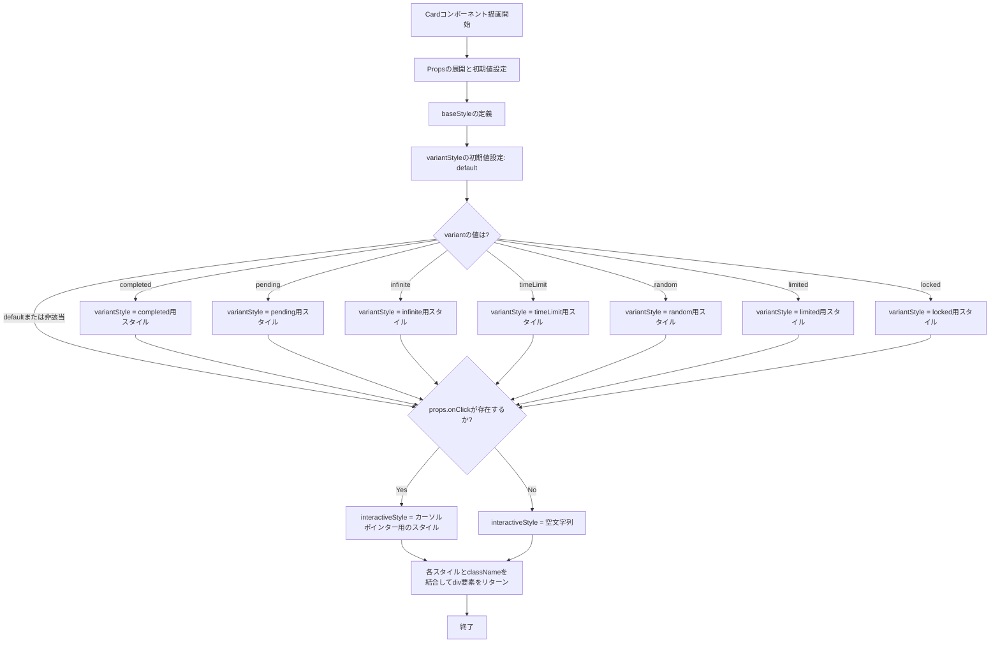
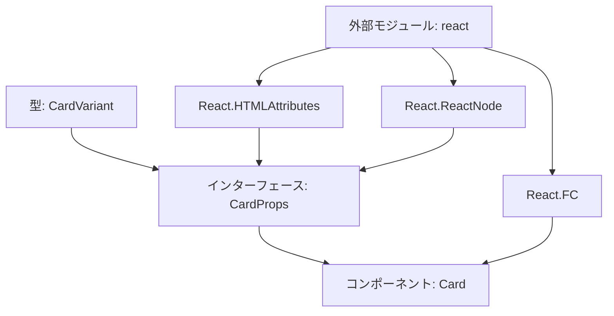

## 1. 解析メタ情報

| 項目 | 内容 |
| --- | --- |
| 対象ファイル | `Card.tsx` |
| 言語 | React (TypeScript) |
| 解析対象 | 提供されたコードのみ |
| 推測・補完 | 一切なし |

## 2. ファイルの概要

* 汎用的なカード型のUIコンポーネントを定義している。
* プロパティとして渡されるバリエーション（`variant`）およびクリックイベント（`onClick`）の有無に応じて、適用するCSSスタイル（クラス名）を動的に切り替える責務を持つ。

## 3. 外部依存関係

### インポート一覧

| 名称 | 種類 | 用途 | 根拠 |
| --- | --- | --- | --- |
| `React` | ライブラリ | Reactの型定義（`React.HTMLAttributes`, `React.ReactNode`, `React.FC`）の利用 | 根拠: `import React` (行番号: 1 / 抜粋: "import React from 'react';") |

### ブラックボックスとなる外部要素

| 名称 | 理由 | 根拠 |
| --- | --- | --- |
| 該当なし | - | - |

## 4. 主要要素の定義（関数 / エンドポイント / コンポーネント）

### `CardVariant`

* **役割**: カードのバリエーションの種類を文字列リテラルユニオンとして定義する型。
* 根拠: `type CardVariant` (行番号: 4 / 抜粋: "type CardVariant = 'default' |")

### `CardProps`

* **役割**: `Card`コンポーネントが受け取るプロパティの型定義。標準の`div`要素の属性を継承しつつ、カスタムプロパティを追加している。
* 根拠: `interface CardProps` (行番号: 6-9 / 抜粋: "interface CardProps extends Re")

### `Card`

* **役割**: 渡されたプロパティを元にスタイル（バリエーションごとの色や状態、インタラクティブ性）を決定し、子要素をラップする`div`要素を描画するコンポーネント。
* 根拠: `export const Card` (行番号: 11 / 抜粋: "export const Card: React.FC<Ca")

* **引数/リクエスト**: `CardProps`型オブジェクト（`variant`、`className`、`children`、その他`div`要素が受け取るプロパティ群）。
* 根拠: `引数` (行番号: 11 / 抜粋: "({ variant = 'default', clas")

* **戻り値/レスポンス**: JSX.Element (`div`要素)。
* 根拠: `return` (行番号: 46-50 / 抜粋: "return ( <div className...")

* **副作用**: なし。
* 根拠: `関数内部` (行番号: 11-51 / 抜粋: "export const Card: React.FC<Ca")

* **エラーハンドリング**: なし。
* 根拠: `関数内部` (行番号: 11-51 / 抜粋: "export const Card: React.FC<Ca")

## 5. 処理フロー図

## 6. 依存関係図

## 7. 次のステップ（リバースエンジニアリングの提案）

| 優先度 | ファイル名(推測可) | 理由 | 根拠 |
| --- | --- | --- | --- |
| 高 | 不明（本コンポーネントをインポートしているファイル） | `Card`コンポーネントがどのように利用され、各`variant`がどのようなビジネスロジックに基づいて切り替わっているか（状態管理など）を特定するため。 | 根拠: `export const Card` (行番号: 11 / 抜粋: "export const Card: React.FC<Ca") |

## 8. 保守上の注意点

* `onClick`プロパティの有無によって、UIのインタラクティブな見た目（`cursor-pointer`等）が自動的に切り替わる仕様となっている。
* 根拠: `const interactiveStyle` (行番号: 44 / 抜粋: "props.onClick ? "cursor-point")

* 外部から渡される`className`は、内部で定義されたクラス群の末尾に結合されるため、スタイル（Tailwind CSSのクラス等）の競合や上書きが発生する可能性がある。
* 根拠: `classNameプロパティ` (行番号: 47 / 抜粋: "className={`${baseStyle} ${va")

## 9. 不明事項一覧

| 項目 | 理由 | 必要なファイル |
| --- | --- | --- |
| 各`variant`の実際の利用シナリオと表示内容 | UIコンポーネントの定義のみであり、実際にどの画面・状態でどのバリエーションが使われるかは不明。 | `Card`コンポーネントをインポートし、表示ロジックを構成している親コンポーネントのファイル |

## 10. 自己検証結果

* [x] 完了: 推測・外部ファイルの仕様を一切含んでいない
* [x] 完了: 全関数・全クラス・全コンポーネントを列挙した
* [x] 完了: 全てのインポート要素を列挙した
* [x] 完了: すべての仕様説明に「根拠（行番号・抜粋）」を明記した
* [x] 完了: 根拠漏れが0件である
* [x] 完了: Mermaid構文にエラーの原因となる記号（エスケープ漏れ）がない
* [x] 完了: 不明事項を漏れなく列挙した