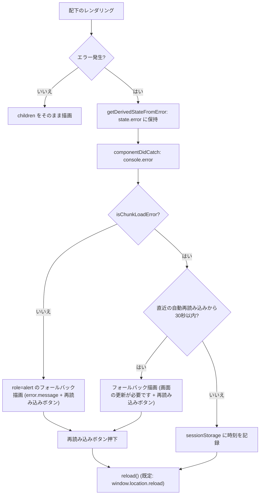
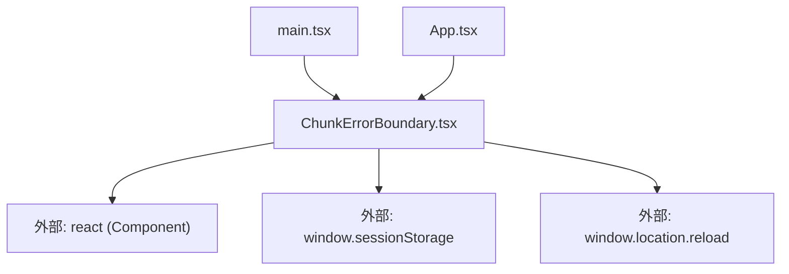

## 1. 解析メタ情報

| 項目 | 内容 |
| --- | --- |
| 対象ファイル | ChunkErrorBoundary.tsx |
| 言語 | React (TypeScript) |
| 解析対象 | 提供されたコードのみ |
| 推測・補完 | 一切なし |
| 解析基準コミット | `46c9bc4` |

## 関連ドキュメント

* [../../../main.md](../../../main.md) - ルート直下(`QueryClientProvider`の外側)で本コンポーネントによりツリー全体を包む呼び出し元
* [../../../App.md](../../../App.md) - `lazy()`で分割した`AvatarUploader`/`SettingsModal`の`Suspense`を本コンポーネントで包む呼び出し元

## 2. ファイルの概要

* `React.lazy()`で分割されたチャンク(`AvatarUploader`/`SettingsModal`/`CameraDashboard`)の読み込み失敗を受け止めるエラーバウンダリ(クラスコンポーネント)である。PWAのService Worker更新(`skipWaiting`+`cleanupOutdatedCaches`)で旧ハッシュ付きチャンクがprecacheから消えた後、常時表示中の旧ページが`import()`を実行して404になると`lazy`がthrowし、バウンダリが無ければReact 18はルートごとアンマウントして白画面になる(Issue #362)。「動的importの失敗」と判定できるエラーは自動でページを再読み込みし(30秒以内の連続発生時はループ防止のため自動再読み込みしない)、それ以外の描画エラーはエラー文言と「再読み込み」ボタン付きのフォールバックを表示する。
* 根拠: ファイル冒頭コメント (行番号: 3〜12 / 抜粋: "// #362: lazy() で分割したチャンク(AvatarUploader/SettingsModal/CameraDashboard)の\n// 読み込みが失敗したときの受け皿。")
* 根拠: `componentDidCatch`での自動再読み込み判定 (行番号: 77〜90)

## 3. 外部依存関係

### インポート一覧

| 名称 | 種類 | 用途 | 根拠 |
| --- | --- | --- | --- |
| `React` | 外部ライブラリ | `React.Component`の継承(エラーバウンダリはクラスコンポーネントでのみ実装可能)とJSX | 根拠: (行番号: 1 / 抜粋: "import React from 'react';") |

### ブラックボックスとなる外部要素

| 名称 | 理由 | 根拠 |
| --- | --- | --- |
| `window.sessionStorage` | ブラウザ実行環境のAPI。プライベートモード等で例外を投げうるため`try/catch`で防御している | 根拠: (行番号: 50〜66 / 抜粋: "const raw = window.sessionStorage.getItem(AUTO_RELOAD_GUARD_KEY);") |
| `window.location.reload` | ブラウザAPI。テストから差し替えられるよう`reload`propで上書き可能 | 根拠: (行番号: 68 / 抜粋: "const defaultReload = () => window.location.reload();") |

## 4. 主要要素の定義（関数 / エンドポイント / コンポーネント）

### `ChunkErrorBoundaryProps` / `ChunkErrorBoundaryState` (型定義)

* **役割**: propsは`children`と任意の`reload`(再読み込みの実体。jsdomでは`window.location.reload`をモックできないためテスト用に差し替え可能)、stateは捕捉した`error`のみ。
* 根拠: (行番号: 14〜23 / 抜粋: "interface ChunkErrorBoundaryProps {\n    children: React.ReactNode;\n    // テストから差し替えられるよう、再読み込みの実体は差し替え可能にしておく\n    reload?: () => void;\n}")

### `CHUNK_LOAD_ERROR_PATTERNS` / `isChunkLoadError` (モジュールレベル定数・関数)

* **役割**: Chrome/Edge(`Failed to fetch dynamically imported module`)、Safari(`Importing a module script failed`)、Firefox(`error loading dynamically imported module`)、webpack系(`Loading chunk N failed`/`ChunkLoadError`)の各文言に対する正規表現群と、`error.name`+`error.message`をそれらに照合する判定関数。
* 根拠: (行番号: 26〜47 / 抜粋: "const CHUNK_LOAD_ERROR_PATTERNS: RegExp[] = [\n    /Failed to fetch dynamically imported module/i,\n    /Importing a module script failed/i,")

### `AUTO_RELOAD_GUARD_MS` / `AUTO_RELOAD_GUARD_KEY` / `readLastAutoReloadAt` / `writeLastAutoReloadAt`

* **役割**: 自動再読み込みの無限ループ防止。`sessionStorage`のキー`familyQuest.chunkErrorReloadedAt`に直近の自動再読み込み時刻を記録し、30秒以内の再発生では自動再読み込みを行わない。読み書きは`try/catch`で防御し、失敗時は「ガード無し(0)」/「記録しない」として続行する。
* 根拠: (行番号: 43〜66 / 抜粋: "const AUTO_RELOAD_GUARD_MS = 30 * 1000;\nconst AUTO_RELOAD_GUARD_KEY = 'familyQuest.chunkErrorReloadedAt';")

### `ChunkErrorBoundary` (クラスコンポーネント、default export)

* **役割**: `getDerivedStateFromError`で捕捉したエラーをstateに保持し、`componentDidCatch`で`console.error`出力後、チャンク読込失敗なら(ガード時間外であれば)`sessionStorage`に時刻を記録して`handleReload`を呼ぶ。`render`は`error`が無ければ`children`をそのまま返し、あれば`role="alert"`の全画面オーバーレイにメッセージ(チャンク失敗時は「画面の更新が必要です」、それ以外は「画面の表示に失敗しました」と`error.message`)と「再読み込み」ボタンを表示する。
* 根拠: (行番号: 70〜125 / 抜粋: "class ChunkErrorBoundary extends React.Component<ChunkErrorBoundaryProps, ChunkErrorBoundaryState> {")
* **引数/リクエスト**: `ChunkErrorBoundaryProps`
* **戻り値/レスポンス**: `children`またはフォールバックのJSX
* **副作用**: `console.error`、`sessionStorage`への書き込み、`reload`(既定は`window.location.reload()`)の呼び出し
* 根拠: (行番号: 78, 88〜89, 92〜95)
* **エラーハンドリング**: 本コンポーネント自体が配下のレンダリングエラーの受け皿。`sessionStorage`アクセスの例外は握りつぶす。
* 根拠: (行番号: 50〜66)

## 5. 処理フロー図

## 6. 依存関係図

## 7. 次のステップ（リバースエンジニアリングの提案）

| 優先度 | ファイル名(推測可) | 理由 | 根拠 |
| --- | --- | --- | --- |
| 高 | `../../main.tsx` | Service Worker更新戦略(`registerSW`+`controllerchange`での自動再読み込み)と本バウンダリの組み合わせで白画面化を防ぐ全体像を把握するため | 根拠: ファイル冒頭コメント (行番号: 5〜9) |

## 8. 保守上の注意点

* **チャンク失敗の判定は文言の正規表現一致に依存する**: ブラウザやバンドラが文言を変えた場合は`CHUNK_LOAD_ERROR_PATTERNS`を追随させる必要がある。一致しない場合でも白画面にはならず、「再読み込み」ボタン付きフォールバックにフォールバックする。
* 根拠: (行番号: 26〜37)
* **自動再読み込みのループ防止は`sessionStorage`頼み**: `sessionStorage`が使えない環境ではガードが効かず、サーバー側障害でチャンクが取得できない間は再読み込みを繰り返しうる(ただし各再読み込みはネットワーク越しのため無限ループというより「失敗のたびに再読み込み」になる)。
* 根拠: (行番号: 43〜66)
* **`reload`propはテスト用**: 本番の呼び出し元(`main.tsx`/`App.tsx`)は`reload`を渡さず既定の`window.location.reload()`を使う。
* 根拠: (行番号: 16〜18, 68)

## 9. 不明事項一覧

| 項目 | 理由 | 必要なファイル |
| --- | --- | --- |
| Service Worker側でどのタイミングで旧チャンクが削除されるか | 本ファイルはエラーの受け皿のみで、SWの生成設定は`vite.config.ts`(`VitePWA`)に依存する | `../../../vite.config.ts` |

## 相互参照による補足情報

| 元の不明事項 | 判明した内容 | 参照元ドキュメント |
| --- | --- | --- |
| Service Worker側でどのタイミングで旧チャンクが削除されるか | `family-quest/vite.config.ts`を直接確認した。`VitePWA({ registerType: 'autoUpdate', ... })`により生成されるService Workerは`skipWaiting`+`clientsClaim`+`cleanupOutdatedCaches`で動作し、新しいSWが有効化された時点で旧ハッシュ付きチャンクはprecacheから削除される。`main.tsx`側で`controllerchange`時に自動再読み込みする対策と組み合わせて用いる。 | 直接ソース確認: `family-quest/vite.config.ts`, `family-quest/src/main.tsx` |

## 10. 自己検証結果

* [x] 推測・外部ファイルの仕様を一切含んでいない
* [x] 全関数・全クラス・全コンポーネントを列挙した
* [x] 全てのインポート要素を列挙した
* [x] すべての仕様説明に「根拠（行番号・抜粋）」を明記した
* [x] 根拠漏れが0件である
* [x] Mermaid構文にエラーの原因となる記号（エスケープ漏れ）がない
* [x] 不明事項を漏れなく列挙した
