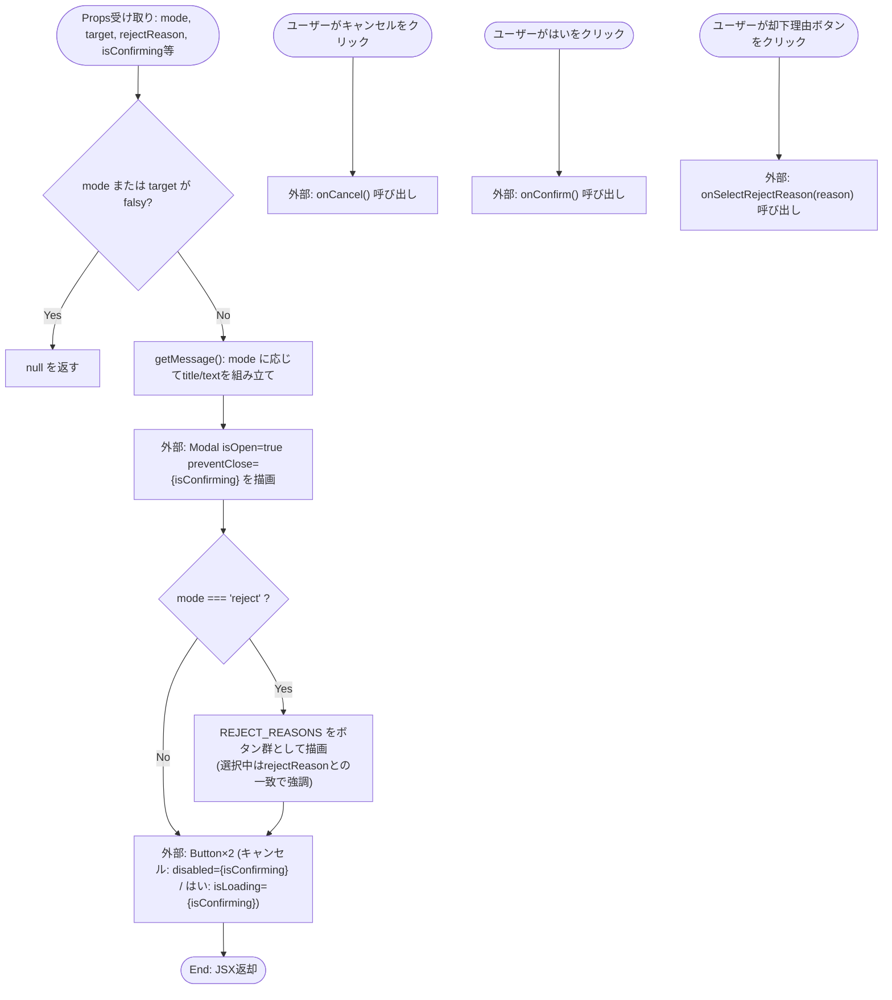
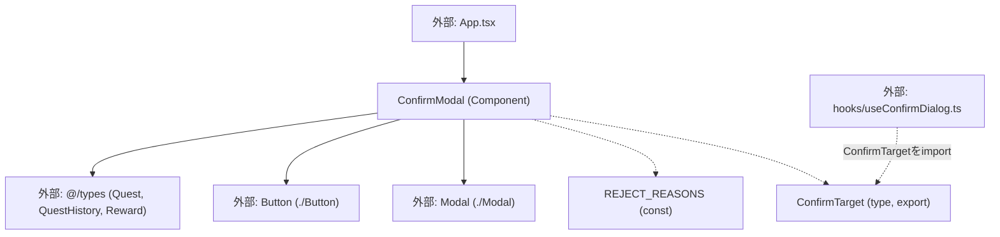

## 1. 解析メタ情報

| 項目 | 内容 |
| --- | --- |
| 対象ファイル | ConfirmModal.tsx (family-quest/src/components/ui/ConfirmModal.tsx) |
| 言語 | React (TypeScript) |
| 解析対象 | 提供されたコードのみ |
| 推測・補完 | 一切なし |
| 解析基準コミット | `f06eef5` |

## 関連ドキュメント

* [../../../App.md](../../../App.md) - 呼び出し元。`mode`/`target`/`rejectReason`/`onSelectRejectReason`/`onConfirm`/`onCancel`/`isConfirming`のpropsを渡す
* [../../hooks/useConfirmDialog.md](../../hooks/useConfirmDialog.md) - 本ファイルがexportする`ConfirmTarget`型をimportして使う利用元（Issue #552で`App.tsx`から抽出されたフック）
* [./Modal.md](./Modal.md) - モーダルの外枠・ESC/背景クリック/`preventClose`制御を提供する基盤コンポーネント
* [./Button.md](./Button.md) - 「キャンセル」「はい」ボタンの実装元
* [../../types/index.md](../../types/index.md) - `Quest`/`QuestHistory`/`Reward`型の定義元

## 2. ファイルの概要

* クエスト完了・報酬購入・クエスト却下の3つの確認ダイアログを1つのコンポーネントで提供する。**（Issue #552で`App.tsx`から抽出）** 以前は`App.tsx`内にインラインで定義されていたコンポーネントであり、`ConfirmTarget`型・`REJECT_REASONS`定数とともに本ファイルへ移動された（ロジック自体の変更はなし）。`mode`（`'complete' | 'purchase' | 'reject' | null`）と`target`（`ConfirmTarget | null`）に応じて`getMessage`内の`switch`文でタイトル・本文を切り替え、`mode === 'reject'`のときのみ`REJECT_REASONS`をワンタップで選べるボタン群を追加表示する。
* 根拠: ファイル冒頭のコメント (行番号: 5〜8 / 抜粋: "// ConfirmModal の target に渡りうる型。モードごとに実際に持っているプロパティが異なるため、\n// メッセージ生成はモードごとに個別にキャストして組み立てる（getMessage 内）。\n// ★実機検証で子どもの誤操作が多かったため、クエスト完了(クリア)には確認ダイアログを復活させた。\n// 取り消しは長押しでのみ発火する(QuestList側のuseLongPress)ため、引き続き確認なしのワンタップとする。")

## 3. 外部依存関係

### インポート一覧

| 名称 | 種類 | 用途 | 根拠 |
| --- | --- | --- | --- |
| `Modal` | コンポーネント | モーダルの外枠・開閉制御 | 根拠: (行番号: 1 / 抜粋: "import { Modal } from './Modal';") |
| `Button` | コンポーネント | 「キャンセル」「はい」ボタンの描画 | 根拠: (行番号: 2 / 抜粋: "import { Button } from './Button';") |
| `Quest`, `QuestHistory`, `Reward` | 型定義 | `ConfirmTarget`のUnionを構成する各モードの対象型 | 根拠: (行番号: 3 / 抜粋: "import { Quest, QuestHistory, Reward } from '@/types';") |

### ブラックボックスとなる外部要素

| 名称 | 理由 | 根拠 |
| --- | --- | --- |
| `Modal` | 内部実装（`preventClose`時の具体的な閉鎖抑止方法等）が本ファイルからは不明 | 根拠: (行番号: 1 / 抜粋: "import { Modal } from './Modal';") |
| `Button` | 内部実装（`isLoading`表示や連打防止の有無）が本ファイルからは不明 | 根拠: (行番号: 2 / 抜粋: "import { Button } from './Button';") |

## 4. 主要要素の定義（関数 / エンドポイント / コンポーネント）

### `ConfirmTarget` (export型定義)

* **役割**: `ConfirmModal`の`target`propに渡りうる型のUnion。モード（完了/購入/却下）ごとに実際に持っているプロパティが異なるため、`getMessage`内で個別にキャストしてメッセージを組み立てる。
* 根拠: (行番号: 9 / 抜粋: "export type ConfirmTarget = Quest | QuestHistory | Reward;")

* **引数/リクエスト**: 該当なし（型定義）
* **戻り値/レスポンス**: 該当なし（型定義）
* **副作用**: なし
* **エラーハンドリング**: なし

### `REJECT_REASONS` (モジュールレベル定数、非export)

* **役割**: 却下理由のプリセット文字列配列。却下モードで一覧表示され、自由入力の手間を省くために使われる。
* 根拠: (行番号: 11〜12 / 抜粋: "// 却下理由のプリセット。自由入力の手間を省き、あとで見返した時にも理由がわかるようにする。\nconst REJECT_REASONS = ['写真が不明瞭', 'まだ終わっていない', '重複している', 'その他'];")

* **引数/リクエスト**: 該当なし
* **戻り値/レスポンス**: `string[]`（4要素固定）
* **副作用**: なし
* **エラーハンドリング**: なし

### `ConfirmModalProps` (非export interface)

* **役割**: `ConfirmModal`コンポーネントが受け取るpropsの型。
* 根拠: (行番号: 14〜22 / 抜粋: "interface ConfirmModalProps {\n    mode: 'complete' | 'purchase' | 'reject' | null;\n    target: ConfirmTarget | null;\n    rejectReason: string | null;\n    onSelectRejectReason: (reason: string) => void;\n    onConfirm: () => void;\n    onCancel: () => void;\n    isConfirming: boolean;\n}")

### `ConfirmModal` (export const コンポーネント)

* **役割**: `mode`または`target`が偽値なら即座に`null`を返す。`getMessage`関数（内部の`switch`文）が`mode`に応じてタイトル・本文を組み立てる。`complete`は「クエスト完了」/「「タイトル」を完了にしますか？」、`purchase`は「アイテム購入」/「「タイトル」を{cost_gold}Gで買いますか？」（**Issue #291で修正**: `masterData.js`のフォールバック報酬も含め`cost_gold`に一本化されたため、`cost`へのフォールバックは無い）、`reject`は「却下確認」/「本当に却下しますか？」を返す。`reject`モードのときのみ`REJECT_REASONS`を選択可能なボタン群を表示する。**（Issue #394）** 内部の`Modal`へ`preventClose={isConfirming}`を渡し、応答待ち中は背景タップ・ESC・×ボタンのいずれでも閉じられないようにする。`isConfirming`が`true`の間、「キャンセル」ボタンは`disabled`、「はい」ボタンは`isLoading`になる（連打防止ガード自体の実体は呼び出し元、`useConfirmDialog.ts`の`isConfirmingRef`/`App.tsx`の`executeConfirm`にあり、本コンポーネントはpropとして受け取った`isConfirming`の値をボタンの見た目に反映するのみ）。
* 根拠: (行番号: 24〜80 / 抜粋: "export const ConfirmModal = ({\n    mode, target, rejectReason, onSelectRejectReason, onConfirm, onCancel, isConfirming\n}: ConfirmModalProps) => {")
* 根拠: 早期リターン (行番号: 27 / 抜粋: "if (!mode || !target) return null;")
* 根拠: `getMessage`の`switch`文 (行番号: 29〜44 / 抜粋: "const getMessage = (): { title: string; text: string } => {\n        switch (mode) {")
* 根拠: `complete`ケース (行番号: 31〜34 / 抜粋: "case 'complete': {\n                const t = target as Quest;\n                return { title: 'クエスト完了', text: `「${t.title}」を完了にしますか？` };\n            }")
* 根拠: `purchase`ケースの`cost_gold`一本化コメント (行番号: 35〜40 / 抜粋: "case 'purchase': {\n                const t = target as Reward;\n                // #291: masterData.js のフォールバック報酬も含め cost_gold に一本化したため、\n                // cost へのフォールバックは不要になった。\n                return { title: 'アイテム購入', text: `「${t.title}」を ${t.cost_gold}G で買いますか？` };\n            }")
* 根拠: `reject`ケース (行番号: 41〜42 / 抜粋: "case 'reject':\n                return { title: '却下確認', text: '本当に却下しますか？' };")
* 根拠: `preventClose`の付与 (行番号: 48〜51 / 抜粋: "// #394: 応答待ち中(isConfirming)は背景タップ/ESC/×ボタンのいずれでも閉じられない\n        // ようにする(閉じてもリクエストは継続するため、「モーダルを残して再試行できる\n        // ようにする」という設計意図が崩れてしまう)。\n        <Modal isOpen={true} onClose={onCancel} title={msg.title} preventClose={isConfirming}>")
* 根拠: 却下理由選択UI (行番号: 55〜71 / 抜粋: "{/* 角度⑫: 却下理由をプリセットからワンタップで選べるようにし、自由入力の手間を省く */}\n                {mode === 'reject' && (")
* 根拠: `isConfirming`によるボタン制御 (行番号: 73〜76 / 抜粋: "
\n                    <Button variant=\"secondary\" onClick={onCancel} disabled={isConfirming}>キャンセル</Button>\n                    <Button variant=\"primary\" onClick={onConfirm} isLoading={isConfirming}>はい</Button>\n                
")

* **引数/リクエスト**: `ConfirmModalProps`（上記参照）
* 根拠: (行番号: 24〜26)

* **戻り値/レスポンス**: JSX要素、または`mode`/`target`が偽値の場合は`null`
* 根拠: (行番号: 27 / 抜粋: "if (!mode || !target) return null;")

* **副作用**: なし（`onSelectRejectReason`/`onConfirm`/`onCancel`は呼び出し元から渡されたコールバックを呼ぶのみ）
* **エラーハンドリング**: `mode`または`target`がFalsyな場合は何も描画せず`null`を返す。`getMessage`の`switch`文に`default`ケースは無いが、`mode`の型が`'complete' | 'purchase' | 'reject' | null`に限定されており、直前の`if (!mode ...) return null;`で`null`は除外済みのため、到達しうる全パターンが列挙されている。
* 根拠: (行番号: 27, 29〜44)

## 5. 処理フロー図

## 6. 依存関係図

## 7. 次のステップ（リバースエンジニアリングの提案）

| 優先度 | ファイル名(推測可) | 理由 | 根拠 |
| --- | --- | --- | --- |
| 中 | `../../hooks/useConfirmDialog.ts` | `ConfirmTarget`を実際にどう使い、`openConfirm`/`closeConfirm`からどう`ConfirmModal`へpropsが渡るかを確認するため | 根拠: 関連ドキュメント参照 |
| 中 | `../../../App.tsx` | `isConfirming`/`isConfirmingRef`による連打防止ガード（Issue #101）の実体、および`executeConfirm`での実行フローを確認するため | 根拠: 関連ドキュメント参照 |
| 低 | `./Modal.tsx` | `preventClose`propの具体的な閉鎖抑止実装を確認するため（既に`Modal.md`で解析済み） | 根拠: 関連ドキュメント参照 |

## 8. 保守上の注意点

* **`isConfirming`の実体は本ファイルの外にある**: 連打防止ガード（Issue #101の`isConfirmingRef`）自体は`useConfirmDialog.ts`が保持し、`App.tsx`の`executeConfirm`が実行を制御する。本コンポーネントはpropとして渡された`isConfirming`の値をボタンの見た目（`disabled`/`isLoading`）に反映するだけで、連打を実際に防いでいるわけではない。
* **`REJECT_REASONS`はこのファイルにのみ存在する**: 却下理由の選択肢を追加・変更する場合は本ファイルの当該配列を直接編集する。
* **`purchase`モードの金額表示は`cost_gold`のみを参照する**: Issue #291で`masterData.js`のフォールバック報酬も含め`cost_gold`に統一されたため、`cost`フィールドへのフォールバックは行われない。将来`cost_gold`を持たない`Reward`が渡された場合、表示金額は`undefined`になる点に注意。
* **`preventClose`はIssue #394の意図的な設計**: 応答待ち中にモーダルが消えてもAPIリクエスト自体は継続するため、ユーザーが「閉じた」と誤認したまま二重に操作するのを防ぐ目的で、あえて閉じさせない設計になっている。

## 9. 不明事項一覧

| 項目 | 理由 | 必要なファイル |
| --- | --- | --- |
| `Modal`の`preventClose`実装詳細 | 本ファイルからは`Modal`へのprop渡しのみが確認でき、内部でどう閉鎖を抑止するかは不明 | ./Modal.tsx |
| `Button`の`isLoading`/`disabled`表示詳細 | 本ファイルからは`Button`へのprop渡しのみが確認でき、内部の見た目・連打防止の有無は不明 | ./Button.tsx |

## 相互参照による補足情報

| 元の不明事項 | 判明した内容 | 参照元ドキュメント |
| --- | --- | --- |
| `Modal`の`preventClose`実装詳細（直接ソース確認） | `family-quest/src/components/ui/Modal.tsx`を直接確認した。`preventClose`（13〜17行目でコメント付きで宣言、既定値`false`、27行目）が`true`の間、ESCキーの`keydown`リスナー登録自体をスキップし（30〜34行目`if (isOpen && !preventClose) window.addEventListener(...)`）、背景クリック用のハンドラも`undefined`に差し替える（48〜49行目`const handleClose = preventClose ? undefined : onClose;`）ことで、ESC・背景クリックのいずれからも`onClose`が呼ばれないようにしている。 | 直接ソース確認: `family-quest/src/components/ui/Modal.tsx:13-17, 27, 30-34, 48-49` |
| `Button`の`isLoading`/`disabled`表示詳細 | `MessageModal.md`の解析によれば、`Button`は`disabled={disabled || isLoading}`により見た目上クリックを抑制するのみで、専用の連打防止制御は無いとされている（`handleClick`は`disabled`でも`isLoading`でもなければ`useSound`の`play('tap')`後に渡された`onClick`を呼ぶ）。ただしこれは`MessageModal.md`側の解析結果からの補足であり、`Button.tsx`のソースコード自体は本ファイルの解析時点では直接確認していない。 | ./MessageModal.md |

## 10. 自己検証結果

* [x] 推測・外部ファイルの仕様を一切含んでいない
* [x] 全関数・全クラス・全コンポーネントを列挙した
* [x] 全てのインポート要素を列挙した
* [x] すべての仕様説明に「根拠（行番号・抜粋）」を明記した
* [x] 根拠漏れが0件である
* [x] Mermaid構文にエラーの原因となる記号（エスケープ漏れ）がない
* [x] 不明事項を漏れなく列挙した
