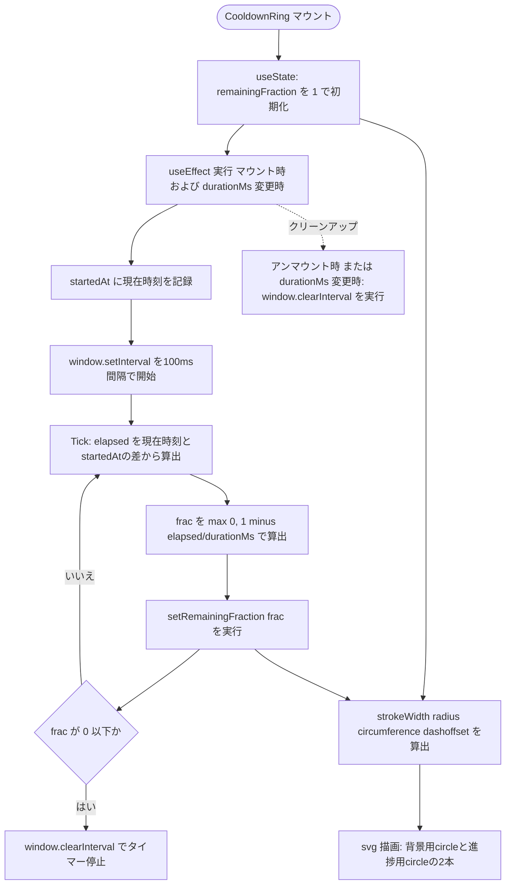
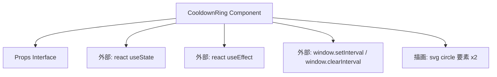

## 1. 解析メタ情報

| 項目 | 内容 |
| --- | --- |
| 対象ファイル | CooldownRing.tsx |
| 言語 | React (TypeScript) |
| 解析対象 | 提供されたコードのみ |
| 推測・補完 | 一切なし |

## 関連ドキュメント

* [../../features/quest/components/QuestList.md](../../features/quest/components/QuestList.md) - 本コンポーネントを呼び出している唯一の箇所（クールダウン中のクエストカード内、`size={24}`で使用）

## 2. ファイルの概要

無限クエストの連打防止クールダウン（60秒）について、残り時間を円形のSVGプログレスリングとして視覚的に表示するコンポーネントである。`durationMs`で指定された時間が経過するまで、100ms間隔でリングの進捗（円弧の欠け具合）を更新し続ける。

* 根拠: `// 無限クエストの連打防止クールダウン(60秒)を、テキストだけでなく\n// 残り時間が視覚的にわかる円形プログレスリングとして表示する。` (行番号: 8〜9)
* 根拠: `export const CooldownRing: React.FC<Props> = ({ durationMs, size = 40 }) => {` (行番号: 10)
* 根拠: `}, 100);` (行番号: 20 / 100ms間隔での更新)

## 3. 外部依存関係

### インポート一覧

| 名称 | 種類 | 用途 | 根拠 |
| --- | --- | --- | --- |
| React | モジュール | `React.FC`型を用いたコンポーネント定義 | 根拠: `import React, { useEffect, useState } from 'react';` (行番号: 1) |
| useEffect | フック | マウント時（および`durationMs`変更時）にタイマーを開始し、アンマウント時にクリアする副作用処理 | 根拠: `import React, { useEffect, useState } from 'react';` (行番号: 1) |
| useState | フック | 残り時間の割合（`remainingFraction`）をローカル状態として保持 | 根拠: `import React, { useEffect, useState } from 'react';` (行番号: 1) |

### ブラックボックスとなる外部要素

| 名称 | 理由 | 根拠 |
| --- | --- | --- |
| `window.setInterval` / `window.clearInterval` | ブラウザ実行環境のグローバルAPIであり、タイマーの実行精度・スロットリング挙動（バックグラウンドタブでの間引き等）はコード単体からは判定不可 | 根拠: `const id = window.setInterval(() => {` (行番号: 15), `window.clearInterval(id);` (行番号: 19, 21) |

## 4. 主要要素の定義（関数 / エンドポイント / コンポーネント）

### `Props`

* **役割**: `CooldownRing`が受け取るプロパティの型定義。`durationMs`（クールダウンの総時間・ミリ秒）は必須、`size`（SVGの一辺サイズ・ピクセル）は任意でデフォルト40。
* 根拠: `interface Props {\n    durationMs: number;\n    size?: number;\n}` (行番号: 3〜6)

* **引数/リクエスト**: 該当なし（型定義のため）
* 根拠: `interface Props {` (行番号: 3)

* **戻り値/レスポンス**: 該当なし（型定義のため）
* 根拠: `interface Props {` (行番号: 3)

* **副作用**: なし
* 根拠: `interface Props {` (行番号: 3〜6)

* **エラーハンドリング**: なし
* 根拠: `interface Props {` (行番号: 3〜6)

### `CooldownRing`

* **役割**: `durationMs`で指定された時間の経過割合を100ms間隔で計算し、その割合に応じてSVG円のストローク（`stroke-dashoffset`）を変化させることで、時計回りに欠けていく（＝時間経過とともに縮んでいく）円形プログレスリングを描画する。
* 根拠: `export const CooldownRing: React.FC<Props> = ({ durationMs, size = 40 }) => {` (行番号: 10〜53)

* **引数/リクエスト**: `Props`型（`{ durationMs: number; size?: number }`）
* 根拠: `({ durationMs, size = 40 })` (行番号: 10 / 抜粋: "export const CooldownRing: React.FC<Props> = ({ durationMs, size = 40 }) => {")

* **戻り値/レスポンス**: `JSX.Element`（`<svg>`要素、背景リングと進捗リングの2本の`<circle>`を含む）
* 根拠: `return (\n        <svg width={size} height={size}` (行番号: 29〜51)

* **副作用**:
  - マウント時（および`durationMs`変更時）に`window.setInterval`で100ms間隔のタイマーを開始し、経過割合`remainingFraction`を`setRemainingFraction`で更新し続ける
  - 根拠: `const id = window.setInterval(() => {\n            const elapsed = Date.now() - startedAt;\n            const frac = Math.max(0, 1 - elapsed / durationMs);\n            setRemainingFraction(frac);` (行番号: 15〜18)

  - 経過割合が0以下になった時点でタイマー自身を`window.clearInterval`で停止する
  - 根拠: `if (frac <= 0) window.clearInterval(id);` (行番号: 19)

  - `useEffect`のクリーンアップ関数として、アンマウント時（および`durationMs`変更による再実行時）に`window.clearInterval`を呼び出す
  - 根拠: `return () => window.clearInterval(id);` (行番号: 21)

* **エラーハンドリング**: なし
* 根拠: ファイル内に`try-catch`やエラー制御の記述なし (行番号: 10〜53)

## 5. 処理フロー図

## 6. 依存関係図

## 7. 次のステップ（リバースエンジニアリングの提案）

| 優先度 | ファイル名(推測可) | 理由 | 根拠 |
| --- | --- | --- | --- |
| 高 | `../../features/quest/components/QuestList.tsx` | `CooldownRing`を呼び出している唯一の箇所であり、`durationMs`に実際渡される定数名・ミリ秒数（本ファイルのコメントが示す「60秒」の裏付け）を確認するため。 | 根拠: 本ファイル自体は`durationMs`をpropsとして受け取るのみで具体的な数値を持たない (行番号: 3〜6) |

## 8. 保守上の注意点

* `durationMs`に`0`が渡された場合、初回タイマー発火時点で`elapsed / durationMs`がゼロ除算となり計算結果が`Infinity`となるため、`frac`は`Math.max(0, -Infinity)`＝`0`に丸められ、リングは即座に「経過完了」の表示になる。この挙動が意図的なものかは本ファイルからは不明。
* 根拠: `const frac = Math.max(0, 1 - elapsed / durationMs);` (行番号: 17)
* 更新間隔は100ms固定であり、CSS側にも`transition: 'stroke-dashoffset 100ms linear'`が設定されているため、両者の間隔が一致していることが視覚的な滑らかさの前提になっている。片方のみ変更すると、カクつきや不整合が生じる可能性がある。
* 根拠: `}, 100);` (行番号: 20), `style={{ transition: 'stroke-dashoffset 100ms linear' }}` (行番号: 49)
* `strokeWidth`は`3`固定値であり、`radius = size / 2 - strokeWidth`で算出されるため、`size`に`6`未満の極端に小さい値を渡すと`radius`が0または負になり、描画が破綻する可能性がある。
* 根拠: `const strokeWidth = 3;\n    const radius = size / 2 - strokeWidth;` (行番号: 24〜25)
* `setInterval`の`id`は`useEffect`のクロージャ内でのみ参照され、タイマーが自己停止（`frac <= 0`）した場合もクリーンアップ関数側は変数`id`を再度`clearInterval`しようとするが、既に停止済みのIDに対する`clearInterval`はブラウザ仕様上無害である。

## 9. 不明事項一覧

| 項目 | 理由 | 必要なファイル |
| --- | --- | --- |
| 実際に`durationMs`へ渡される値（呼び出し元での具体的なミリ秒数・定数名） | 本ファイルはpropsとして受け取るのみで、コメント上の「60秒」という記載以外に具体的な数値の裏付けがないため | 呼び出し元ファイル（`../../features/quest/components/QuestList.tsx`） |
| `durationMs`に0または負の値が渡された場合の想定挙動が仕様として許容されるか | 型定義上は`number`としか制約されておらず、バリデーションのコードが存在しないため | 呼び出し元のバリデーションロジック、または仕様書 |

## 10. 自己検証結果

* [x] 推測・外部ファイルの仕様を一切含んでいない
* [x] 全関数・全クラス・全コンポーネントを列挙した
* [x] 全てのインポート要素を列挙した
* [x] すべての仕様説明に「根拠（行番号・抜粋）」を明記した
* [x] 根拠漏れが0件である
* [x] Mermaid構文にエラーの原因となる記号（エスケープ漏れ）がない
* [x] 不明事項を漏れなく列挙した
