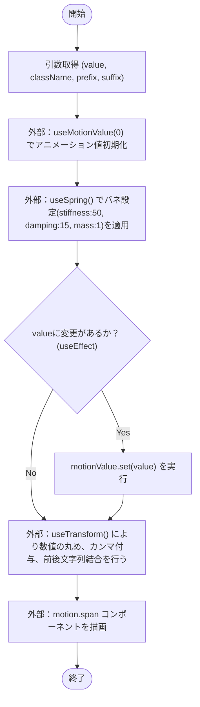
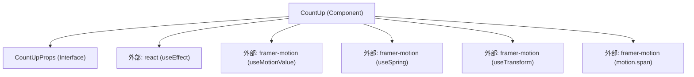

## 1. 解析メタ情報

| 項目 | 内容 |
| --- | --- |
| 対象ファイル | `CountUp.tsx` |
| 言語 | React (TypeScript) |
| 解析対象 | 提供されたコードのみ |
| 推測・補完 | 一切なし |

## 2. ファイルの概要

* `framer-motion`ライブラリのフックとコンポーネントを利用し、受け取った数値（`value`）に対してバネ物理モデルに基づいたカウントアップアニメーションを適用し、プレフィックス・サフィックス・カンマ区切りを付与してテキストとして描画するコンポーネントである。

## 3. 外部依存関係

### インポート一覧

| 名称 | 種類 | 用途 | 根拠 |
| --- | --- | --- | --- |
| `useEffect` | React Hook | 数値(`value`)の変更を検知し、アニメーションの開始をトリガーするため | 根拠: [インポート宣言] (行番号: 1 / 抜粋: `import { useEffect } from "reac`) |
| `useSpring` | framer-motion Hook | アニメーション値に対してバネの物理効果（硬さ、減衰、重さ）を適用するため | 根拠: [インポート宣言] (行番号: 2 / 抜粋: `import { useSpring, useMotionV`) |
| `useMotionValue` | framer-motion Hook | アニメーションの対象となる内部状態値（初期値0）を生成・保持するため | 根拠: [インポート宣言] (行番号: 2 / 抜粋: `import { useSpring, useMotionV`) |
| `useTransform` | framer-motion Hook | アニメーションする数値を、プレフィックス・サフィックス・カンマ区切りの文字列に変換するため | 根拠: [インポート宣言] (行番号: 2 / 抜粋: `import { useSpring, useMotionV`) |
| `motion` | framer-motion Component | アニメーション値の変更に追従して描画更新を行うHTML要素（`span`）を生成するため | 根拠: [インポート宣言] (行番号: 2 / 抜粋: `import { useSpring, useMotionV`) |

### ブラックボックスとなる外部要素

| 名称 | 理由 | 根拠 |
| --- | --- | --- |
| `react` ライブラリの内部実装 | 外部ライブラリであり、`useEffect`などの正確な内部挙動はこのファイルからは読み取れないため | 根拠: [インポート先] (行番号: 1 / 抜粋: `from "react";`) |
| `framer-motion` ライブラリの内部実装 | 外部ライブラリであり、各フックおよび`motion`コンポーネントの正確な内部計算・レンダリング制御はこのファイルからは読み取れないため | 根拠: [インポート先] (行番号: 2 / 抜粋: `from "framer-motion";`) |

## 4. 主要要素の定義（関数 / エンドポイント / コンポーネント）

### `CountUpProps`

* **役割**: `CountUp`コンポーネントが受け取るプロパティの型定義
* 根拠: [インターフェース定義] (行番号: 4〜9 / 抜粋: `interface CountUpProps {`)|

* **引数/リクエスト**: 該当なし（型定義のため）
* 根拠: [インターフェース定義] (行番号: 4〜9 / 抜粋: `interface CountUpProps {`)

* **戻り値/レスポンス**: 該当なし（型定義のため）
* 根拠: [インターフェース定義] (行番号: 4〜9 / 抜粋: `interface CountUpProps {`)

* **副作用**: なし
* 根拠: [インターフェース定義] (行番号: 4〜9 / 抜粋: `interface CountUpProps {`)

* **エラーハンドリング**: なし
* 根拠: [インターフェース定義] (行番号: 4〜9 / 抜粋: `interface CountUpProps {`)

### `CountUp`

* **役割**: プロパティから数値や文字列を受け取り、初期値0から受け取った数値までをバネ効果を用いてカウントアップするテキスト（`motion.span`）を描画する。
* 根拠: [コンポーネント定義] (行番号: 11〜33 / 抜粋: `export const CountUp: React.FC`)

* **引数/リクエスト**: `CountUpProps` 型のオブジェクト。`value` (number), `className` (string, 任意), `prefix` (string, デフォルト値 `""`), `suffix` (string, デフォルト値 `""`)
* 根拠: [引数定義] (行番号: 11 / 抜粋: `({ value, className, prefix = `)

* **戻り値/レスポンス**: `JSX.Element` (`<motion.span>` 要素)
* 根拠: [戻り値] (行番号: 32 / 抜粋: `return <motion.span className=`)

* **副作用**: `value`が変更された際、`useEffect`内の処理により`motionValue`の内部状態が更新される。
* 根拠: [useEffectコールバック] (行番号: 23〜25 / 抜粋: `motionValue.set(value);`)

* **エラーハンドリング**: なし
* 根拠: [コンポーネント全体] (行番号: 11〜33 / 抜粋: `export const CountUp: React.FC`)

## 5. 処理フロー図

## 6. 依存関係図

## 7. 次のステップ（リバースエンジニアリングの提案）

| 優先度 | ファイル名(推測可) | 理由 | 根拠 |
| --- | --- | --- | --- |
| 高 | `CountUp` コンポーネントをインポート・利用している親コンポーネント群 | どのようなタイミングで、どのような範囲の `value` が渡されるかを特定し、システム全体での使われ方を把握するため | 根拠: [export宣言] (行番号: 11 / 抜粋: `export const CountUp: React.FC`) |

## 8. 保守上の注意点

* `useMotionValue(0)` と定義されているため、コンポーネントのマウント時には必ず `0` からアニメーションが開始される。前回の値を保持して途中から再開するようなロジックは含まれていない。
* `Math.round(current)` を使用しているため、小数点以下の値が渡された場合やアニメーション途中であっても、描画される数値は常に整数に丸められる。
* `toLocaleString()` を使用して文字列化しているため、実行環境（ブラウザなど）のロケール設定に依存してカンマ区切りなどのフォーマットが変化する。

## 9. 不明事項一覧

| 項目 | 理由 | 必要なファイル |
| --- | --- | --- |
| 本コンポーネントに渡される実際のプロパティ値（特に `value` の桁数・更新頻度や `className` によるスタイリング） | このファイルはコンポーネントの定義のみであり、呼び出し側のコンテキストが含まれていないため | 本コンポーネントを呼び出している親ファイル群 |

## 10. 自己検証結果

* [x] 推測・外部ファイルの仕様を一切含んでいない
* [x] 全関数・全クラス・全コンポーネントを列挙した
* [x] 全てのインポート要素を列挙した
* [x] すべての仕様説明に「根拠（行番号・抜粋）」を明記した
* [x] 根拠漏れが0件である
* [x] Mermaid構文にエラーの原因となる記号（エスケープ漏れ）がない
* [x] 不明事項を漏れなく列挙した