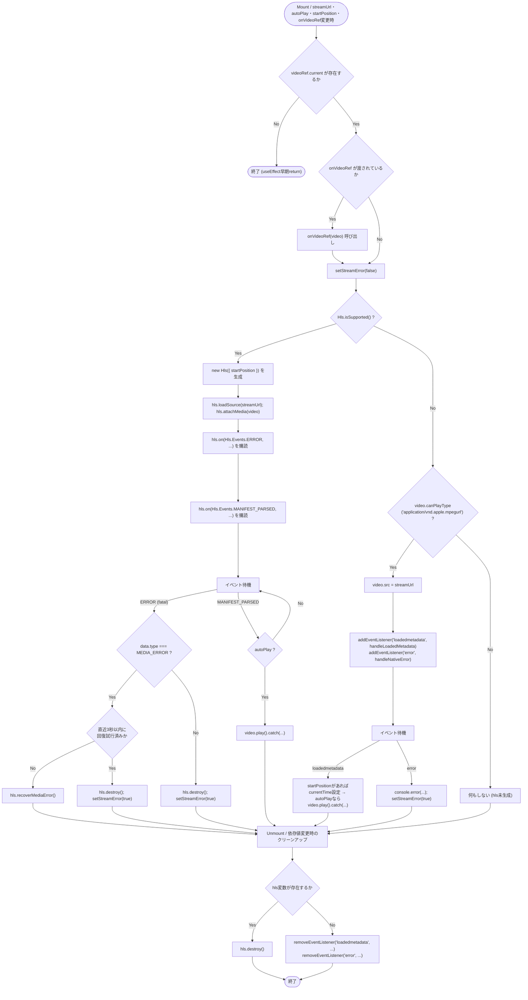
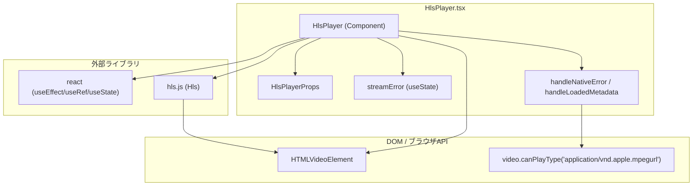

## 1. 解析メタ情報

| 項目 | 内容 |
| --- | --- |
| 対象ファイル | `family-quest/src/components/ui/HlsPlayer.tsx` |
| 言語 | React (TypeScript) |
| 解析対象 | 提供されたコードのみ |
| 推測・補完 | 一切なし |

## 2. ファイルの概要

* `hls.js` ライブラリを用いてHLS（HTTP Live Streaming）形式の映像ストリームを`<video>`要素に再生させる汎用UIコンポーネント。
* `Hls.isSupported()`によりブラウザ対応状況を判定し、対応していれば`hls.js`でストリームを再生、非対応かつSafariのようにネイティブHLS再生に対応するブラウザではネイティブ再生機能にフォールバックする。
* 再生開始位置の指定、自動再生、ミュート、コントロールバー表示可否、外部からの`<video>`要素参照取得、致命的エラー時のメディア回復・エラー表示をサポートする。

## 3. 外部依存関係

### インポート一覧

| 名称 | 種類 | 用途 | 根拠 |
| --- | --- | --- | --- |
| `React`, `useEffect`, `useRef`, `useState` | ライブラリ (`react`) | コンポーネント定義、副作用処理、DOM参照、状態管理 | 根拠: [`import React, { useEffect, useRef, useState } from 'react';`] (行番号: 1 / 抜粋: "import React, { useEffect, useRef, useState } from 'react';") |
| `Hls` | ライブラリ (`hls.js`) | HLSストリームのデコード・再生制御（MSEベース） | 根拠: [`import Hls from 'hls.js';`] (行番号: 2 / 抜粋: "import Hls from 'hls.js';") |

### ブラックボックスとなる外部要素

| 名称 | 理由 | 根拠 |
| --- | --- | --- |
| `hls.js` (`Hls`クラス) | 本ファイルからは`Hls.isSupported()`、`new Hls(config)`、`loadSource`、`attachMedia`、`on(Hls.Events.ERROR, ...)`、`on(Hls.Events.MANIFEST_PARSED, ...)`、`recoverMediaError`、`destroy`等のAPI呼び出しのみが確認でき、内部のセグメント取得・バッファリング・エラー分類などの実装詳細は読み取れない。`package.json`より バージョンは`^1.5.17`であることが確認できる。 | 根拠: [`Hls.isSupported()`] (行番号: 51 / 抜粋: "if (Hls.isSupported()) {") |
| ブラウザのネイティブHLS再生機構（`video.canPlayType('application/vnd.apple.mpegurl')`） | Safari等が持つネイティブHLS再生の内部実装はブラウザ依存であり、本ファイルからは把握できない。 | 根拠: [`canPlayType`] (行番号: 83 / 抜粋: "} else if (video.canPlayType('application/vnd.apple.mpegurl')) {") |

## 4. 主要要素の定義（関数 / エンドポイント / コンポーネント）

### `HlsPlayer`

* **役割**: `streamUrl`で指定されたHLSストリームを`<video>`要素で再生するコンポーネント本体。`hls.js`対応環境では`hls.js`経由、非対応かつネイティブHLS対応環境（Safari等）ではネイティブ`<video src>`再生を行う。致命的な再生エラー時にはオーバーレイでエラーメッセージを表示する。
* 根拠: [`HlsPlayer`] (行番号: 13〜116 / 抜粋: "const HlsPlayer: React.FC<HlsPlayerProps> = ({")

* **引数/リクエスト（Props）**: `HlsPlayerProps`
  * `streamUrl: string` （必須）再生対象のHLSマニフェスト（`.m3u8`）のURL
  * `muted?: boolean` （デフォルト`true`）ミュート再生の可否
  * `autoPlay?: boolean` （デフォルト`true`）自動再生の可否
  * `controls?: boolean` （デフォルト`false`）ブラウザ標準の再生コントロールバー表示可否
  * `startPosition?: number` 再生開始位置（秒）
  * `onVideoRef?: (element: HTMLVideoElement | null) => void` マウント時に`<video>`のDOM要素を呼び出し元へ渡すコールバック
* 根拠: [`HlsPlayerProps`] (行番号: 4〜11 / 抜粋: "interface HlsPlayerProps {")、[デフォルト値] (行番号: 13〜20 / 抜粋: "streamUrl,\n    muted = true,\n    autoPlay = true,\n    controls = false,\n    startPosition,\n    onVideoRef")

* **戻り値/レスポンス**: JSX要素。`<video>`要素と、`streamError`が`true`の場合に重ねて表示されるエラーオーバーレイ`
`を含む`
`。
* 根拠: [return文] (行番号: 101〜115 / 抜粋: "return (\n        
")

* **副作用**:
  * `useEffect`内で`videoRef.current`（`<video>`要素）を取得し、`onVideoRef`が渡されていれば呼び出す。
  * `Hls.isSupported()`が`true`の場合、`new Hls({ startPosition: ... })`でインスタンスを生成し、`hls.loadSource(streamUrl)`・`hls.attachMedia(video)`でストリームをアタッチし、`Hls.Events.ERROR`と`Hls.Events.MANIFEST_PARSED`イベントを購読する。
  * `Hls.isSupported()`が`false`かつ`video.canPlayType('application/vnd.apple.mpegurl')`が真の場合、`video.src = streamUrl`を直接設定し、`loadedmetadata`・`error`のネイティブDOMイベントを購読する。
  * クリーンアップ関数（`useEffect`の戻り値）で、`hls`変数が存在すれば`hls.destroy()`を呼び、存在しなければ（ネイティブ再生時のみ）`loadedmetadata`/`error`のリスナーを`removeEventListener`する。
* 根拠: [`useEffect`] (行番号: 25〜99 / 抜粋: "useEffect(() => {\n        const video = videoRef.current;")、[cleanup] (行番号: 89〜98 / 抜粋: "return () => {\n            if (hls) {\n                hls.destroy();")

* **エラーハンドリング**: `Hls.Events.ERROR`イベントで`data.fatal`が`true`の場合、`console.error`でログ出力した上で、`data.type === Hls.ErrorTypes.MEDIA_ERROR`であれば直近3秒以内に回復を試みていない場合のみ`hls.recoverMediaError()`で回復を試行し（3秒以内の連続エラーは`hls.destroy()`＋`setStreamError(true)`で中断）、それ以外の致命的エラー種別では即座に`hls.destroy()`＋`setStreamError(true)`とする。Safariのネイティブ再生時は`error`イベントで`handleNativeError`が呼ばれ`console.error`＋`setStreamError(true)`する。また`video.play()`失敗時（Promiseのreject）は`.catch(e => console.error("Play failed:", e))`でログ出力するのみで`streamError`状態は更新しない。`streamError`が`true`の間は「映像を取得できませんでした」というオーバーレイを表示する。
* 根拠: [`Hls.Events.ERROR`] (行番号: 57〜77 / 抜粋: "hls.on(Hls.Events.ERROR, (_event, data) => {")、[`handleNativeError`] (行番号: 40〜43 / 抜粋: "const handleNativeError = () => {\n            console.error(\"Native video playback error (Safari HLS)\");\n            setStreamError(true);\n        };")、[`play().catch`] (行番号: 48 / 抜粋: "if (autoPlay) video.play().catch(e => console.error(\"Play failed:\", e));")、[エラーオーバーレイ] (行番号: 109〜113 / 抜粋: "{streamError && (\n                
")

## 5. 処理フロー図

## 6. 依存関係図

## 7. 次のステップ（リバースエンジニアリングの提案）

| 優先度 | ファイル名(推測可) | 理由 | 根拠 |
| --- | --- | --- | --- |
| 高 | `family-quest/src/features/camera/components/LiveView.tsx`, `RecordView.tsx` | `HlsPlayer`の呼び出し元であり、`streamUrl`・`startPosition`・`onVideoRef`等がどう組み立てられ、実際のストリームURLとして渡されるかを確認する必要がある。 | 根拠: [`HlsPlayerProps`] (行番号: 4〜11 / 抜粋: "interface HlsPlayerProps {") |
| 中 | `hls.js` ライブラリ本体（`node_modules/hls.js`） | `Hls`クラスの内部実装（エラー分類の詳細、`recoverMediaError`の具体的な回復挙動、`MANIFEST_PARSED`以外のイベント種別など）を確認するため。`package.json`記載のバージョンは`^1.5.17`。 | 根拠: [`Hls.isSupported()`] (行番号: 51 / 抜粋: "if (Hls.isSupported()) {") |
| 低 | バックエンドの`/api/cameras/live/{id}/stream.m3u8`・`/api/cameras/record/...`エンドポイント実装 | `streamUrl`として渡されるHLSマニフェストの生成方式（セグメント長、有効期限等）を確認するため。 | 根拠: [呼び出し元での`streamUrl`組み立て] 本ファイル単体では確認できない |

## 8. 保守上の注意点

* `hls.js`非対応かつネイティブHLS非対応（`video.canPlayType`が偽を返す）ブラウザの場合、`if (Hls.isSupported())`と`else if (video.canPlayType(...))`のいずれの分岐にも入らず、`hls`変数は未初期化（`let hls: Hls;`のまま代入されない）となる。この状態でクリーンアップ関数が呼ばれると`if (hls)`が`false`になり、リスナーの`removeEventListener`も呼ばれない（元々登録されていないため実害はないが、ユーザーには何の映像もエラー表示も出ない「サイレント失敗」状態になる）。
* 根拠: [`let hls: Hls;`] (行番号: 34 / 抜粋: "let hls: Hls;")、[分岐] (行番号: 51, 83 / 抜粋: "if (Hls.isSupported()) {" / "} else if (video.canPlayType('application/vnd.apple.mpegurl')) {")
* `recoverDecodingErrorDate`による3秒間隔の連続エラー抑制ロジックは、コメント上「無限ループ防止」を目的としているが、`MEDIA_ERROR`以外の`fatal`エラー（`NETWORK_ERROR`等）に対しては即座に`hls.destroy()`されるのみで、リトライは行われない。
* 根拠: [`if (data.type === Hls.ErrorTypes.MEDIA_ERROR)`] (行番号: 60 / 抜粋: "if (data.type === Hls.ErrorTypes.MEDIA_ERROR) {")
* `video.play()`の失敗（自動再生ポリシー等によるreject）は`console.error`でログ出力されるのみで、`streamError`状態には反映されない。ユーザー向けのエラーオーバーレイは表示されず、無音の一時停止画面のまま残る可能性がある。
* 根拠: [`.catch(e => console.error("Play failed:", e))`] (行番号: 48, 81 / 抜粋: "if (autoPlay) video.play().catch(e => console.error(\"Play failed:\", e));")
* `useEffect`の依存配列に`onVideoRef`が含まれているため、呼び出し元が毎レンダーで新規のインライン関数を渡した場合、`streamUrl`が変わっていなくても`useEffect`が再実行され、HLSのセットアップ（`new Hls`・`loadSource`・`attachMedia`）がやり直される可能性がある（呼び出し元の`RecordView.tsx`にはこれを回避するためのコメントが存在する）。
* 根拠: [依存配列] (行番号: 99 / 抜粋: "}, [streamUrl, autoPlay, startPosition, onVideoRef]);")

## 9. 不明事項一覧

| 項目 | 理由 | 必要なファイル |
| --- | --- | --- |
| `hls.js`（`Hls`クラス）の内部実装詳細 | 本ファイルからは呼び出しているAPI（`isSupported`, `loadSource`, `attachMedia`, `recoverMediaError`, `destroy`等）のみが確認でき、内部ロジックは不明なため | `hls.js`ライブラリ本体のソース、または`node_modules/hls.js/package.json` |
| `streamUrl`として渡される実際のHLSマニフェストの仕様（セグメント長、更新頻度など） | 本ファイルはURLを受け取って再生するのみで、マニフェストの生成側の情報を持たないため | バックエンドの`/api/cameras/live/...`・`/api/cameras/record/...`エンドポイント実装 |
| Hls非対応かつネイティブ非対応ブラウザでの実際のユーザー体験 | コード上は無反応（サイレント失敗）になると読めるが、実機・実ブラウザでの検証情報がないため | 該当なし（実機検証が必要） |

## 10. 自己検証結果

* [x] 推測・外部ファイルの仕様を一切含んでいない
* [x] 全関数・全クラス・全コンポーネントを列挙した
* [x] 全てのインポート要素を列挙した
* [x] すべての仕様説明に「根拠（行番号・抜粋）」を明記した
* [x] 根拠漏れが0件である
* [x] Mermaid構文にエラーの原因となる記号（エスケープ漏れ）がない
* [x] 不明事項を漏れなく列挙した

完了
